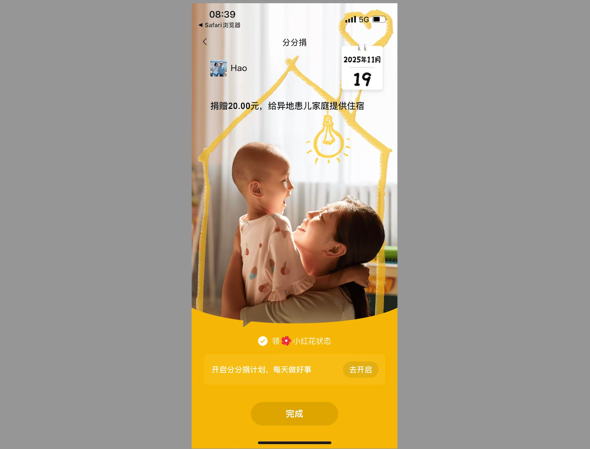
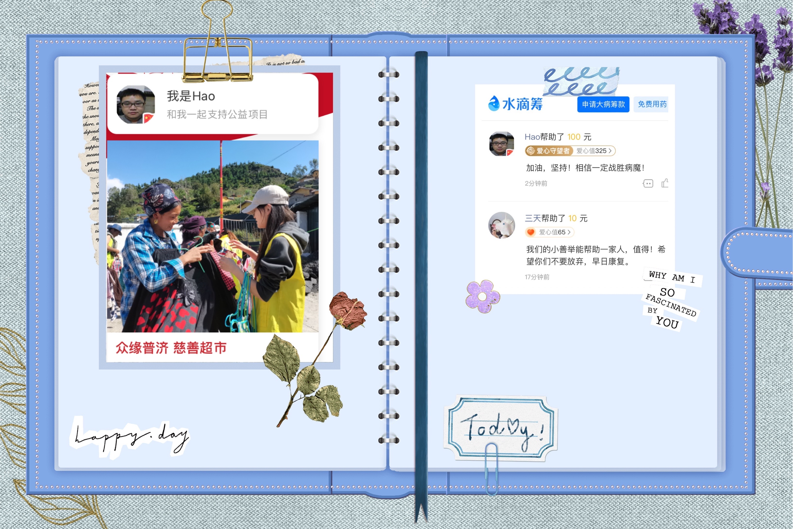
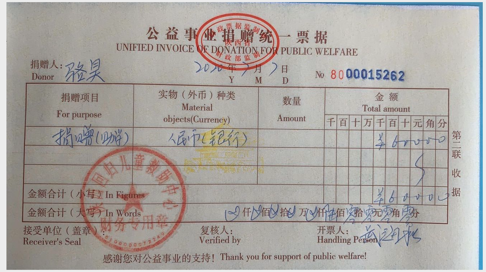
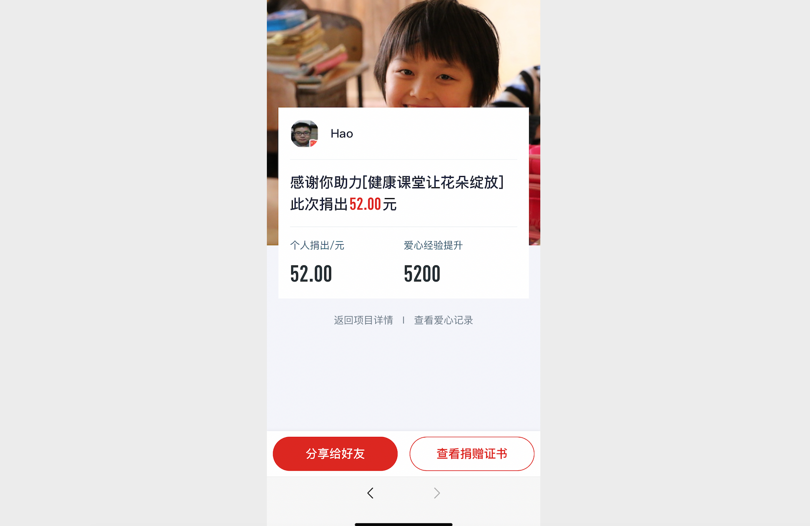
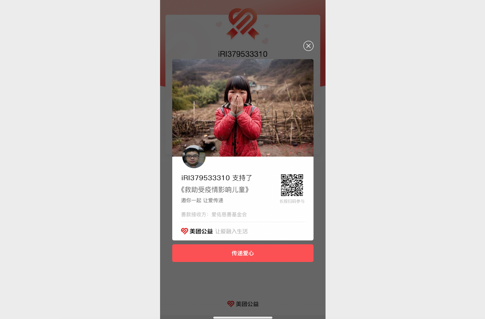
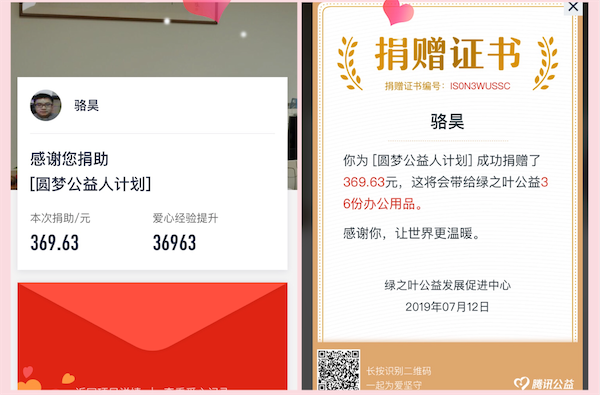

## Changelog

### December 7, 2025

1. Updated some resource files and fixed issues in the documentation.
2. Updated the popular "Python Learning Resources" compilation.

### March 4, 2025

1. Added code and resources for the Python data analysis section.
2. Corrected typos and broken links in the documentation.

### February 18, 2025

1. Fixed the issue where mathematical formulas were not displaying correctly.
1. Revised and supplemented the machine learning documentation.

### January 30, 2025

1. Updated the content for Days 01-20, "Python Language Fundamentals."
1. Updated the content for Days 21-30, "Python Language Applications."
1. Restructured the project's directory layout.
1. Fixed issues with some resource files.

### January 22, 2025

1. Completed the "Machine Learning" section content.
2. Fixed errors in some documentation.
3. Started a new project to explore deep learning topics.

### April 18, 2024

1. Reorganized the project structure and added some documentation.
2. Preparing to start writing the "Machine Learning and Deep Learning" section.

### January 11, 2022

1. Donated recent tips received through Shuidichou and Zhongyuan Puji Public Charity Promotion Association to those in need.

    

### November 22, 2021

1. Updated documentation and code for the database section.
2. Fixed bugs in documentation and code reported by community members.
3. Updated group information in the README file.

### October 7, 2021

1. Restructured the project directory.
2. Updated the data analysis section content.

### March 28, 2021

1. Recently reviewed data mining materials; preparing to start writing documentation.

2. Donated recent tips through Meituan Charity to those in need.

    

    

    

### October 3, 2020

1. Restructured the project directory.
2. Began filling in missing content and updating the final sections.
3. Donated recent tips through Shuidichou and other platforms to those in need.

### July 12, 2020

1. Fixed bugs in some documentation.

2. Updated the Django section documentation.

3. Donated recent tips to the Shaanxi Return Children's Rescue Center.

    

### April 8, 2020

1. Extracted the fundamentals section (Days 1-15) into a new repository called "Python-Core-50-Courses" and updated some content.

2. Updated the README.md file.

3. Donated recent tips through Tencent Charity to support "Children's Health Classroom."

   

### March 8, 2020

1. Updated some documentation for the last 10 days.

2. Donated recent tips through Meituan Charity to children affected by the pandemic.

   

### March 1, 2020

1. Optimized some image resources in the project.
2. Updated some documentation.

### September 23, 2019

1. Planning to complete the update for Days 91-100 before the National Day holiday ends, including the latest Python interview questions collection.
2. Revised the content of Day 7, "Strings and Common Data Structures."

### September 15, 2019

1. Donated WeChat tip income through Tencent Charity to underprivileged college students at the national level.

   

2. Began updating and revising content for Days 1-15.

3. Started compiling the much-anticipated "Complete Python Interview Questions with Reference Answers."

### August 12, 2019

1. Published the article "Building Your Own Blog with Hexo."

### August 8, 2019

1. The company has assigned a lot of tasks recently, so this project hasn't been updated for a while. Today I finally completed the long-planned "Relational Database MySQL" update.
2. Yesterday, WeChat payment notifications showed I've received tips for 48 consecutive days. Thank you all for your continued support.
3. I've been planning to record companion videos for this project. The workload is obviously enormous, but I've decided to start before the end of the year, so as not to let down all the people who want to learn Python through this project.

### July 11, 2019

1. Today I finally finished my business trip. First thing I did was donate all recent tips through the Tencent Charity platform to Green Leaf, totaling 111 donations.

   

### July 9, 2019

1. I've been on a business trip recently, so the project has been on hiatus. Many beginners in the discussion group have reported that the content gets difficult starting from Day 8. I had been planning to reorganize the language fundamentals and web scraping sections anyway, aiming to make the text and examples more accessible and practical. This effort has already begun, with the ultimate goal of turning this content into a book. I hope everyone will continue to support it.
2. In the past week or so, I've received over 60 tips, with a peak of 14 tips in a single day. Thank you again for supporting knowledge sharing. Joining the discussion group is free — your contributions will be used to support education for children in rural areas.
3. Today I retranslated the *Zen of Python*, and I quite like this version, so I'm sharing it with everyone.

### June 30, 2019

1. Received 11 tips in the past 2 days.
2. Finally updated Day 48 "Front-End and Back-End Separation Development," though I feel it might be a bit thin. I didn't put much effort into the text descriptions; you can refer to the project code to understand front-end/back-end separation development. The project uses Vue.js, but without scaffolding tools or front-end routing — just Vue.js for page rendering, since I'm not a professional front-end developer.

### June 27, 2019

1. Received 35 tips in the past 3 days. Thank you for your continued attention.
2. Things have been busy recently, so updates may slow down. Please bear with me.
3. Tonight's public lecture materials have been updated in the public courses directory.

### June 23, 2019

1. Received 25 tips in the past few days. Thank you for your support.
2. Updated the QQ discussion group — created a new 2000-member group.

### June 18, 2019

1. At a friend's suggestion, I added a tip QR code to the homepage to see how many people are willing to pay for knowledge. Today I received tips from 7 people. Thank you! All tip income will be donated through the Tencent Charity platform.
2. The Django section (Days 41-55) has been updated to Day 47. The latest additions include reports, logging, ORM query optimization, and middleware-related content. The voting application's complete code has been synced to GitHub.
