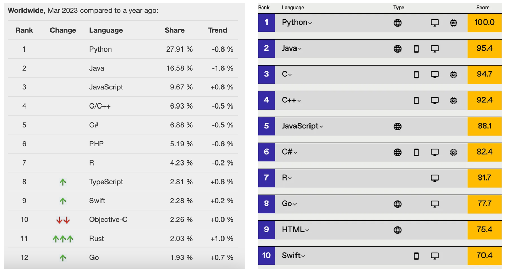
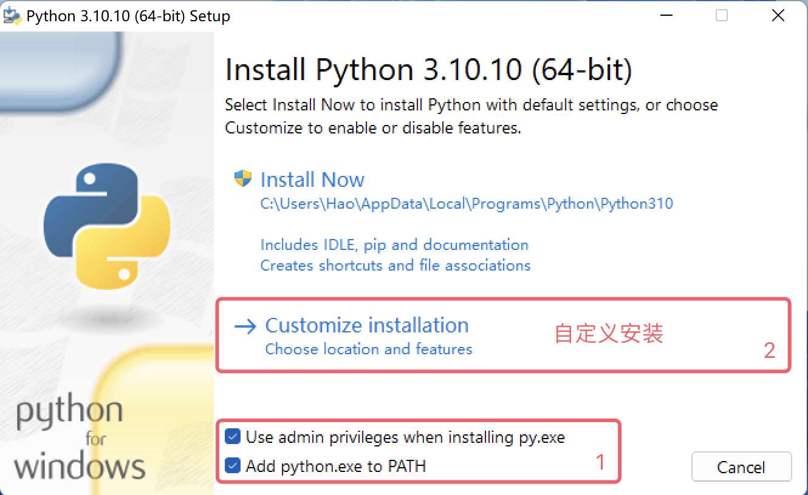
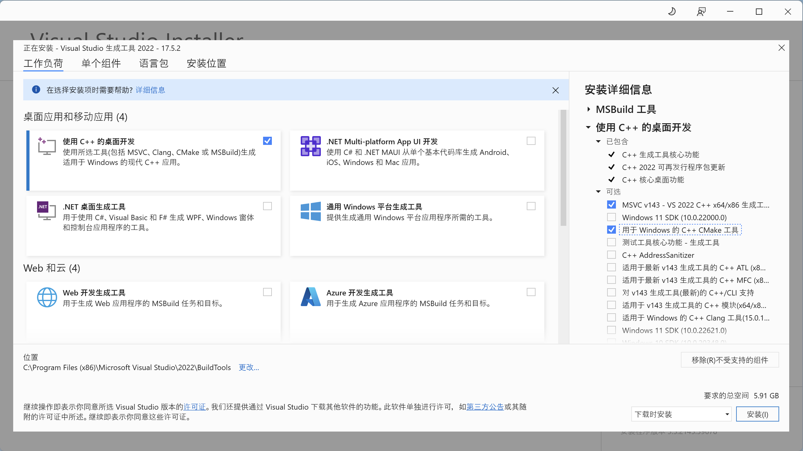
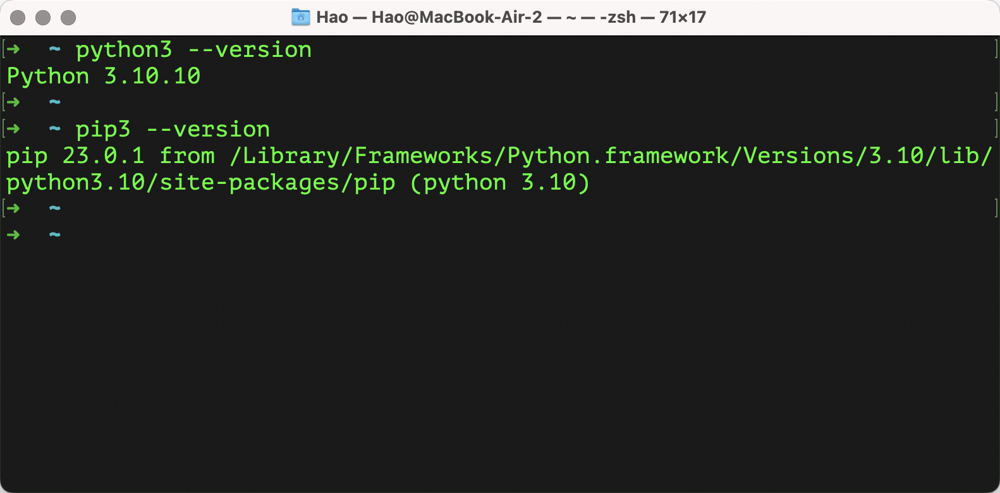

## Introduction to Python

### A Brief Introduction to Python

Python (British pronunciation: /ˈpaɪθən/; American pronunciation: /ˈpaɪθɑːn/) is a programming language invented by Dutchman Guido von Rossum. It is currently the most popular and widely used programming language in the world. Python emphasizes code readability and syntactic simplicity. Compared to other equally influential programming languages like C, C++, and Java, Python allows users to express their intentions with less code. Below are a few authoritative programming language rankings showing Python's position. The first image is provided by the TIOBE Index, and the third image is provided by IEEE Spectrum. It is worth mentioning the second image, which shows how popular programming languages are on GitHub, the world's largest code hosting platform. In recent years, Python has consistently held the top position.

#### A Brief History of Python

Here are some important milestones in the development of the Python language:

1. December 1989: Guido von Rossum decided to develop a new scripting language and its interpreter to pass the boring Christmas holiday. The new language would serve as a successor to the ABC language, primarily used to replace Unix shell and C for system administration. Since Guido was a big fan of the BBC TV show *Monty Python's Flying Circus*, he chose the word Python as the name for the new language.
2. February 1991: Guido von Rossum published the initial code of the Python interpreter on the alt.sources newsgroup, marked as version 0.9.0.
3. January 1994: Python 1.0 was released — where the dream began.
4. October 2000: Python 2.0 was released. The entire development process of Python became more transparent, and the ecosystem began to take shape.
5. December 2008: Python 3.0 was released, introducing many modern programming language features, but it was not fully backward compatible.
6. April 2011: pip was first released, giving the Python language its own package management tool.
7. July 2018: Guido von Rossum announced his "permanent vacation" from the position of "Benevolent Dictator For Life" (the person who has the final say when disputes arise in open-source project communities).
8. January 2020: After Python 2 and Python 3 coexisted for 11 years, official support for Python 2 was discontinued, encouraging users to switch to Python 3 as soon as possible.
9. Currently: Python is widely used in large language models (GPT-3, GPT-4, BERT, etc.), computer vision (image recognition, object detection, image generation, etc.), intelligent recommendation systems (YouTube, Netflix, ByteDance, etc.), autonomous driving (Waymo, Apollo, etc.), speech recognition, data science, quantitative trading, automated testing, automated operations, and many other fields. The Python ecosystem is thriving.

> **Note**: Most software version numbers are divided into three parts in the form A.B.C, where A represents the major version number, which only increases when the software is completely rewritten or has backward-incompatible changes; B represents feature updates, which increases when new features are added; C represents minor changes (e.g., fixing a bug), which increases with any modification.

#### Advantages and Disadvantages of Python

Python has many advantages. Here are a few of them:

1. **Simple and elegant** — compared to many other programming languages, Python is **easier to learn**.
2. Allows you to do more with less code, **improving development efficiency**.
3. Open source, with a **strong community and ecosystem**.
4. **Extremely versatile**, with strong adaptability.
5. A **glue language** that can integrate components developed in other languages.
6. An interpreted language that is easier to make **cross-platform**, capable of running on multiple operating systems.

Python's main disadvantage is its **low execution efficiency** (a common issue with interpreted languages). If you value code execution efficiency more, C, C++, or Go might be better choices.

### Installing the Python Environment

As the saying goes, "A craftsman must first sharpen his tools." To start your Python programming journey, you first need to install the Python environment on your computer — in simple terms, install the Python interpreter needed to run Python programs. We recommend installing the official Python 3 interpreter, which is written in C and commonly referred to as CPython — it is probably your best choice right now. First, you need to find the download link on the official website's [download page](https://www.python.org/downloads/), click the "Download" button to enter the download page, and then select the appropriate Python 3 installer for your operating system, as shown below.

After entering the download page, some Python versions do not provide installers for Windows and macOS, only source code archives. For those familiar with Linux, you can build and install from source code; for Windows or macOS users, we **strongly recommend** using the installer. For example, if you want to install Python 3.10, selecting Python 3.10.10 or Python 3.10.11 will give you Windows or macOS installers, while other versions may only have source code, as shown below.

#### Windows Environment

Below we will use Windows 11 as an example to explain how to install the Python environment on a Windows operating system. Double-click the installer downloaded from the official website to open an installation wizard, as shown below.

First, be sure to check the "Add python.exe to PATH" option, which will add the Python interpreter to the Windows system PATH environment variable (don't worry if you don't understand this — just check it). Second, "Use admin privileges when installing py.exe" gives you administrative privileges during installation, and it is recommended to check it. Then, choose "Customize Installation" to use the custom installation mode — this is the professional choice, and you are (pretending to be) that professional. We do not recommend using "Install Now" (default installation).

Next, the installation wizard will prompt you to select "Optional Features." You can select all of them. It is worth mentioning the second item, which is Python's package management tool pip, which helps install third-party libraries and tools — so be sure to check it, then click "Next" to proceed.

Next is the selection of "Advanced Options." We recommend checking only "Add Python to environment variables" and "Precompile standard library." The former will automatically configure your environment variables, and the latter will precompile the standard library (generating `.pyc` files) so there is no need for on-the-fly compilation during use. Again, don't worry if you don't understand — just check them. The "Customize install location" below is **strongly recommended** to be changed to a custom path. This path should not contain Chinese characters, spaces, or other special characters — following this advice will save you a lot of unnecessary trouble in the future. After completing the settings, click "Install" to begin the installation.

A successful installation will show the screen below. The keyword for a successful installation is "successful"; if the installation fails, the word will be "failed."

After installation, you can open the Windows "Command Prompt" or PowerShell and type `python --version` or `python -V` to check whether the installation was successful — this command shows the version number of the Python interpreter. If you see a screen like the one shown below, congratulations — the Python environment has been installed successfully. We also recommend checking that Python's package management tool pip is available by using the command `pip --version` or `pip -V`.

> **Note**: If the installation process reports errors or indicates failure, it is very likely that your Windows system is missing some dynamic link library files or necessary build tools. You can download "Visual Studio 2022 Build Tools" from the [Microsoft website](https://visualstudio.microsoft.com/zh-hans/downloads/) for repair, as shown below. If downloading from the Microsoft website is inconvenient, you can also use the following Baidu Cloud link to obtain the repair tool: https://pan.baidu.com/s/1iNDnU5UVdDX5sKFqsiDg5Q extraction code: cjs3.
>
> 
>
> The "Visual Studio 2022 Build Tools" downloaded above requires an internet connection to run. After running it, you will see the screen shown below. You can refer to the image to select the corresponding options for repair. The repair process requires downloading the corresponding packages online, which may take some time. After a successful repair, you may be required to restart your operating system.
>
> 

#### macOS Environment

Installing the Python environment on macOS is simpler than on Windows. The installer downloaded from the official website is a `pkg` file. After double-clicking it, just keep clicking "Continue" and the installation will be complete — almost no settings or options need to be configured, as shown below.

After installation, you can type `python3 --version` in the macOS "Terminal" tool to check whether the installation was successful. Note that the command here is `python3`, not `python`! Then check the package management tool by typing `pip3 --version`, as shown below.

#### Other Installation Methods

Some people may recommend that beginners install [Anaconda](https://www.anaconda.com/download/success) directly, because Anaconda installs the Python interpreter along with some commonly used third-party libraries and provides some convenient tools, which is especially suitable for complete beginners. Personally, I do not recommend this approach, because when installing Anaconda, you will unknowingly install a large number of third-party libraries (both useful and useless, taking up a considerable amount of disk space), and your terminal or command prompt will be hijacked by Anaconda (automatically activating a virtual environment on every startup). These behaviors do not conform to the **Principle of Least Astonishment** in software design. Other minor issues with Anaconda will not be discussed here. If you insist on using Anaconda, I recommend installing Miniconda instead, which is on the same download page as Anaconda.

Beginners also often hear or say, "I want to write Python programs — can't I just install PyCharm?" Here is a brief clarification: PyCharm is just a tool that assists in writing Python code; it does not have the ability to run Python code itself. Running Python code relies on the Python interpreter we installed above. Of course, some versions of PyCharm will prompt you to download a Python interpreter online when creating a Python project if it cannot detect a Python environment on your computer. We will cover PyCharm installation and usage in the next lesson.

### Summary

Let's summarize what we have learned:

1. The Python language is powerful and can do many things, so it is well worth learning.
2. To use the Python language, you first need to install the Python environment, which is the Python interpreter required to run Python programs.
3. On Windows, you can type `python --version` in the Command Prompt or PowerShell to check whether the Python environment was installed successfully; on macOS, you can type `python3 --version` in the Terminal to check.
