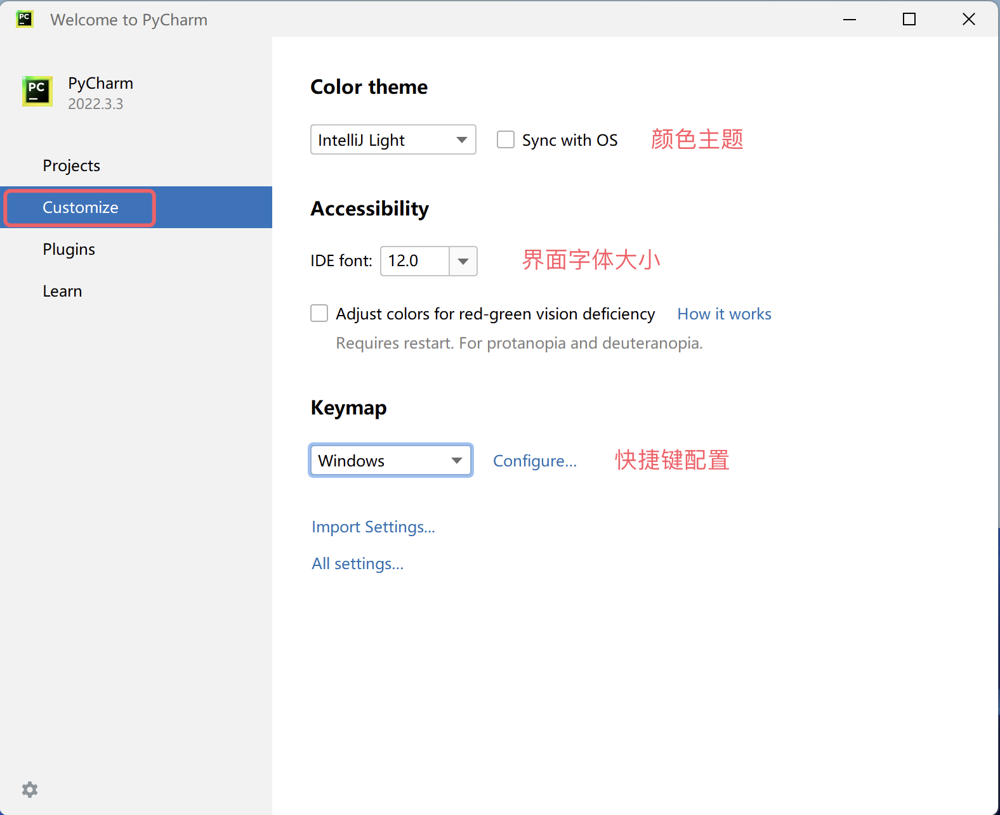
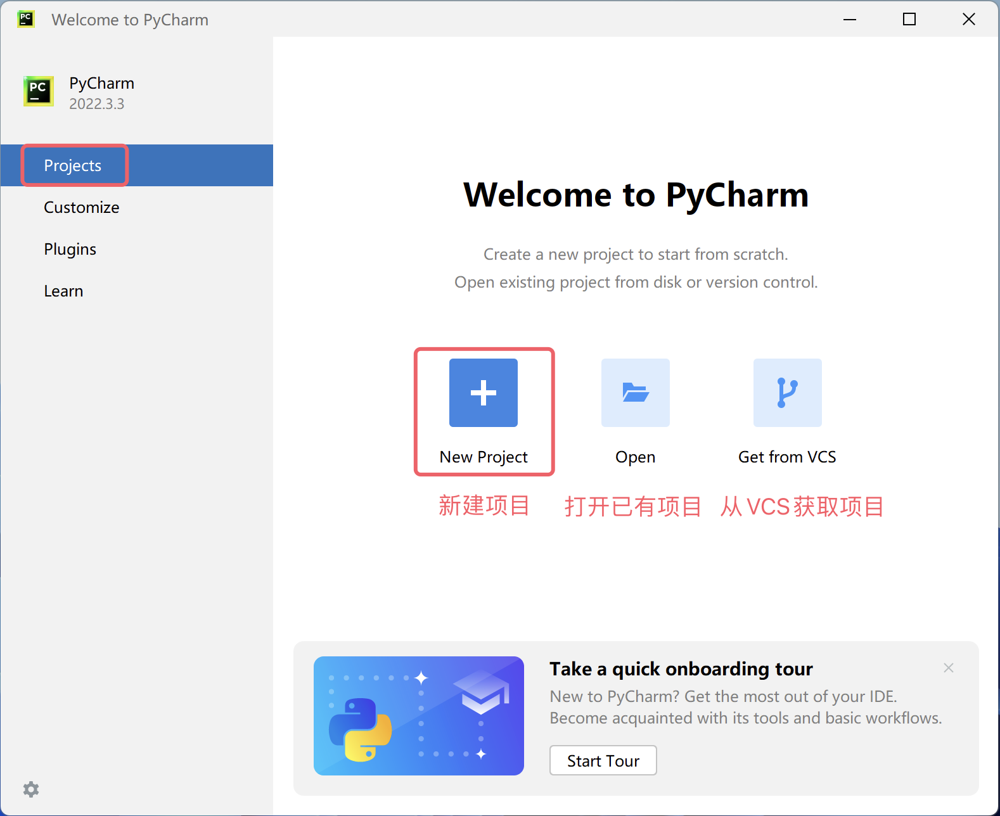
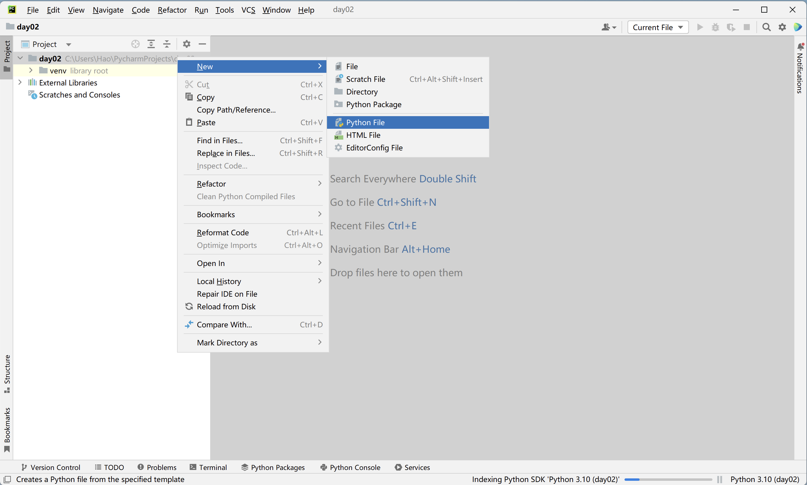
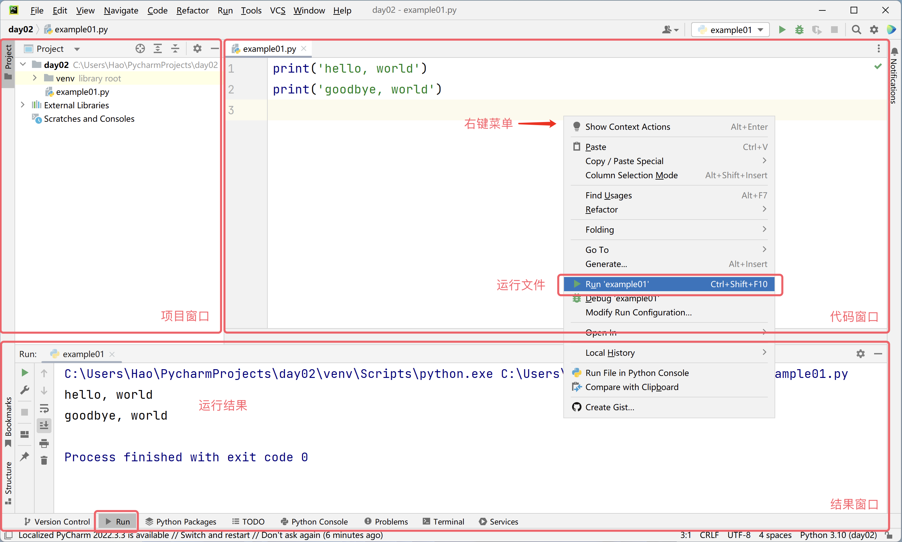

## Your First Python Program

In the previous lesson, we learned about the past and present of the Python language and set up the interpreter environment needed to run Python programs. You are probably eager to start your Python programming journey, but a new question arises: where should we write Python programs, and how do we run them?

### Tools for Writing Code

Below we will introduce several tools that can be used to write and run Python code. You can choose the right tool based on your needs. For beginners, I personally recommend using PyCharm, because it requires little configuration yet is very powerful and quite beginner-friendly. If you have heard of or prefer PyCharm, you can skip the introduction of the other tools below and jump directly to the PyCharm section.

#### The Default Interactive Environment

Open the Windows "Command Prompt" or "PowerShell" tool, type `python`, and press `Enter`. This command will take you to an interactive environment. In an interactive environment, you type a line of code and press `Enter`, and the code is executed immediately. If the code produces a result, it will be displayed in the window, as shown below.

```Bash
Python 3.10.10
Type "help", "copyright", "credits" or "license" for more information.
>>> 2 * 3
6
>>> 2 + 3
5
>>>
```

> **Note**: macOS users need to open the "Terminal" tool and type `python3` to enter the interactive environment.

To exit the interactive environment, type `quit()` in the interactive environment, as shown below.

```Bash
>>> quit()
```

#### A Better Interactive Environment - IPython

The default interactive environment described above does not offer a great user experience, as you will notice once you try it. We can replace it with IPython, which provides more powerful editing and interactive features. You can install IPython using the Python package management tool `pip` in the command prompt or terminal, as shown below.

```bash
pip install ipython
```

> **Tip**: Before using the command above to install IPython, you can first change the download source to a faster mirror using `pip config set global.index-url https://pypi.doubanio.com/simple` or `pip config set global.index-url https://pypi.tuna.tsinghua.edu.cn/simple/`; otherwise, the download and installation process may be very slow.

You can then use the following command to start IPython and enter the interactive environment.

```bash
ipython
```

> **Note**: There is also a web-based version of IPython called Jupyter. We will introduce it when we need to use it.

#### The Text Editing Powerhouse - Visual Studio Code

Visual Studio Code is a code editing powerhouse developed by Microsoft that runs on Windows, Linux, and macOS operating systems. It supports syntax highlighting, auto-completion, multi-cursor editing, running and debugging, and many other convenient features, and it supports multiple programming languages. If you want to choose a high-level text editing tool, we strongly recommend Visual Studio Code. Interested readers can research its [download](https://code.visualstudio.com/), installation, and usage on their own.


#### Integrated Development Environment - PyCharm

If you are developing commercial projects with Python, we recommend using the more professional tool PyCharm. PyCharm is an integrated development environment (IDE) provided by a Czech company called [JetBrains](https://www.jetbrains.com/) specifically for the Python language. An integrated development environment typically refers to a development tool that provides a series of powerful features and convenient operations such as code writing, code execution, debugging, code analysis, and version control, making it particularly suitable for commercial project development. You can find the PyCharm [download link](https://www.jetbrains.com/pycharm/download) on the JetBrains official website, as shown below.


The official website provides two versions of PyCharm: the free Community Edition, which has relatively fewer features but is more than sufficient for beginners; and the paid Professional Edition, which is very powerful but requires an annual or monthly subscription, with a 30-day free trial for new users. Installing PyCharm is straightforward — run the downloaded installer and use the default settings for almost everything. For Windows users, one step allows you to check "Create Desktop Shortcut" and "Add 'Open Folder as Project'" to the context menu, as shown below.


When running PyCharm for the first time, on the screen prompting you to import PyCharm settings, simply select "Do not import settings." You will then see the welcome screen shown below. Here, you can click the "Customize" option to make some personalized settings for PyCharm.



Next, you can click "New Project" in the "Projects" option to create a new project. You can also "open an existing project" or "get a project from a version control server (VCS)," as shown below.



When creating a project, you need to specify the project path and create a "virtual environment." We recommend that each Python project runs in its own dedicated virtual environment. If your system does not yet have a Python environment, PyCharm will provide a download link from the official website, and when you click the "Create" button to create the project, it will download the Python interpreter online, as shown below.


Of course, we do not recommend this approach, because we already installed the Python environment in the previous lesson. When a Python environment exists on your system, PyCharm usually auto-detects the location of the Python interpreter and creates a virtual environment based on it, so the screen you see should look like the one shown below.


> **Note**: The screenshots above are from Windows. If you are using macOS, the project path and Python interpreter path will be different.

After creating the project, you will see the screen shown below. You can right-click on the project folder, select "New" from the menu, and then "Python File" to create a Python file. When naming the file, it is recommended to use a combination of English letters and underscores. The newly created Python file will open automatically in an editable state.



Next, you can write your Python code in the code window. After writing the code, right-click in the window and select the "Run" menu item to run the code. The "Run" window below will display the execution results, as shown below.



At this point, our first Python program is up and running — pretty cool, right? By the way, PyCharm has a "Tip of the Day" popup that teaches you tips for using PyCharm, as shown below. If you don't need it, just close it; if you don't want it to appear again, check "Don't show tips on startup" before closing.


### Hello World

By convention, the first program we write when learning any programming language outputs `hello, world`, because this code was written by the great Dennis Ritchie (the father of the C language, who co-developed the Unix operating system with Ken Thompson) and Brian Kernighan (the inventor of the awk language) as the first piece of code in their immortal work *The C Programming Language*. Below is the Python version.

```python
print('hello, world')
```

> **Note**: The parentheses and single quotes in the code above must be typed using the English input method. If you accidentally type Chinese parentheses or quotes, you will see error messages like `SyntaxError: invalid character '（' (U+FF08)` or `SyntaxError: invalid character ''' (U+2018)` when running the code.

The code above has only one statement. In this statement, we used a function called `print`, which helps us output specified content; `'hello, world'` inside the parentheses of the `print` function is a string representing a piece of text content; in Python, we can use single quotes or double quotes to represent a string. Unlike programming languages such as C, C++, or Java, statements in Python code do not need semicolons to indicate the end, meaning if we want to write another statement, we just need to press Enter for a new line, as shown below. Additionally, Python code does not require writing a `main` entry function to run — providing an entry function is mandatory for writing executable C, C++, or Java code, which many programmers are familiar with, but in Python it is not necessary.

```python
print('hello, world')
print('goodbye, world')
```

If you are not using an integrated development environment like PyCharm, you can also directly invoke the Python interpreter to run Python programs. We can save the code above to a file named `example01.py`. For Windows, assuming the file is in the `C:\code` directory, open the "Command Prompt" or "PowerShell" and enter the following command to run it.

```powershell
python C:\code\example01.py
```

For macOS, assuming the file is in the `/Users/Hao` directory, enter the following command in the terminal to run the program.

```Bash
python3 /Users/Hao/example01.py
```

> **Tip**: If the path is long and you don't want to type it manually, you can drag the file directly into the "Command Prompt" or "Terminal," which will automatically input the full file path.

Try modifying the code above — for example, replace `hello, world` inside the quotes with other content or write a few more similar statements to see what results you get. A reminder: when writing Python code, it is best to write only one statement per line. Although you can use `;` as a separator to write multiple statements on a single line, this makes the code very hard to read and no longer maintains good readability.

### Commenting Your Code

Comments are an important part of programming languages, used to explain the purpose of code within the code itself, thereby enhancing code readability. Of course, you can also temporarily disable code that you don't need to run by adding comments. When you need to use that code again, simply remove the comment markers. In short, **comments make code easier to understand without affecting the execution results**.

Python has two forms of comments:

1. Single-line comments: Start with `#` and a space, which comments out the entire line from `#` onward.
2. Multi-line comments: Start and end with three quotes (usually double quotes), typically used for adding multi-line explanatory content.

```python
"""
First Python program - hello, world

Version: 1.0
Author: Luo Hao
"""
# print('hello, world')
print("Hello, World!")
```

### Summary

We have now gotten our first Python program up and running — doesn't that feel like an accomplishment?! As long as you keep learning, in a little while we will be able to do more and cooler things with Python. Today, programming is like English — for many people, it is a skill that must be mastered.
