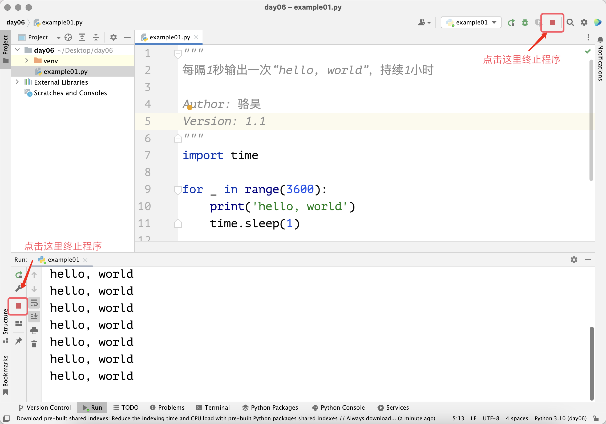

## Loop Structures

When writing programs, it is very likely that we will encounter scenarios where certain instructions need to be executed repeatedly. For example, we need to output "hello, world" to the screen every 1 second for an hour. The code below can accomplish this operation once. If we want to output it continuously for one hour, we would need to write this code 3600 times -- would you be willing to do that?

```python
import time

print('hello, world')
time.sleep(1)
```

> **Note**: The `sleep` function from Python's built-in `time` module can pause the program. The parameter `1` indicates the number of seconds to sleep, and it can be of `int` or `float` type. For example, `0.05` represents `50` milliseconds. We will cover functions and modules in later lessons.

To handle the problem described in the scenario above, we can use loop structures in Python programs. A loop structure is a structure in a program that controls certain instructions to be executed repeatedly. With such a structure, the code above doesn't need to be written 3600 times -- it just needs to be written once and then repeated 3600 times within the loop structure. There are two ways to construct loop structures in Python: the `for-in` loop and the `while` loop.

### for-in Loop

If you know exactly how many times the loop should execute, we recommend using the `for-in` loop. For example, for the scenario mentioned above of repeating 3600 times, we can implement it with the code below. Note that the code block controlled by the `for-in` loop is also constructed using indentation, just like code blocks in branching structures. We call the code block controlled by a `for-in` loop the loop body, and the statements in the loop body are usually executed repeatedly according to the loop's settings.

```python
"""
Output "hello, world" every 1 second for 1 hour

Author: Luo Hao
Version: 1.0
"""
import time

for i in range(3600):
    print('hello, world')
    time.sleep(1)
```

It should be noted that `range(3600)` in the code above constructs a range from `0` to `3599`. When we put such a range in a `for-in` loop, the loop variable `i` will sequentially take on integer values from `0` to `3599`, causing the statements in the `for-in` code block to be repeated 3600 times. Of course, the usage of `range` is very flexible. The list below gives some examples of using the `range` function:

- `range(101)`: Produces integers from `0` to `100`. Note that `101` is not included.
- `range(1, 101)`: Produces integers from `1` to `100`. It uses a left-closed, right-open convention, i.e., `[1, 101)`.
- `range(1, 101, 2)`: Produces odd numbers from `1` to `100`, where `2` is the step (stride), meaning the increment each time. `101` is not included.
- `range(100, 0, -2)`: Produces even numbers from `100` to `1`, where `-2` is the step (stride), meaning the decrement each time. `0` is not included.

You may have already noticed that the output operation and sleep operation in the code above do not use the loop variable `i`. For `for-in` loop structures where the loop variable is not needed, by Python convention, we typically name the loop variable `_`. The modified code is shown below. Although the result doesn't change, this makes you look more professional and instantly elevates your code style.

```python
"""
Output "hello, world" every 1 second for 1 hour

Author: Luo Hao
Version: 1.1
"""
import time

for _ in range(3600):
    print('hello, world')
    time.sleep(1)
```

The code above would run for an hour. If you want to terminate the program early, you can click the stop button in PyCharm's run window, as shown in the image below. If you are running the code from a command prompt or terminal, you can use the keyboard shortcut `ctrl+c` to terminate the program.



Now let's use a `for-in` loop to calculate the sum of integers from 1 to 100, i.e., $\small{\sum_{n=1}^{100}{n}}$.

```python
"""
Sum of integers from 1 to 100

Version: 1.0
Author: Luo Hao
"""
total = 0
for i in range(1, 101):
    total += i
print(total)
```

In the code above, the variable `total` is used to store the cumulative sum. During the loop, the loop variable `i` takes values from 1 all the way to 100. For each value of `i`, we execute `total += i`, which is equivalent to `total = total + i`, performing the accumulation operation. So, when the loop ends and we output the value of `total`, it equals 5050, the result of summing from 1 to 100. Note that the `print(total)` statement has no indentation before it, so it is not controlled by the `for-in` loop and will not be executed repeatedly.

Let's write some code to compute the sum of even numbers from 1 to 100, as shown below.

```python
"""
Sum of even numbers from 1 to 100

Version: 1.0
Author: Luo Hao
"""
total = 0
for i in range(1, 101):
    if i % 2 == 0:
        total += i
print(total)
```

> **Note**: In the `for-in` loop above, we used a branching structure to check whether the loop variable `i` is even.

We can also modify the parameters of the `range` function, changing the start value and step to `2`, to implement the sum of even numbers from 1 to 100 with simpler code.

```python
"""
Sum of even numbers from 1 to 100

Version: 1.1
Author: Luo Hao
"""
total = 0
for i in range(2, 101, 2):
    total += i
print(total)
```

Of course, an even simpler approach is to use Python's built-in `sum` function for summation, which eliminates the need for a loop structure altogether.

```python
"""
Sum of even numbers from 1 to 100

Version: 1.2
Author: Luo Hao
"""
print(sum(range(2, 101, 2)))
```

### while Loop

If you need to construct a loop but cannot determine the number of repetitions in advance, we recommend using the `while` loop. The `while` loop uses a boolean value or an expression that produces a boolean value to control the loop. When the boolean value or expression evaluates to `True`, the statements in the loop body (the code block below the `while` statement with the same indentation) will be executed repeatedly. When the expression evaluates to `False`, the loop ends.

Let's use a `while` loop to compute the sum of integers from 1 to 100, as shown below.

```python
"""
Sum of integers from 1 to 100

Version: 1.1
Author: Luo Hao
"""
total = 0
i = 1
while i <= 100:
    total += i
    i += 1
print(total)
```

Compared to the `for-in` loop, in the code above we added a variable `i` before the loop starts. We use this variable to control the loop, so the condition `i <= 100` follows the `while`. Inside the `while` loop body, in addition to the accumulation, we also need to increment the variable `i`, so we added the statement `i += 1`. This way, `i` will take the values 1, 2, 3, ..., up to 101. When `i` becomes 101, the `while` loop condition is no longer true, the code exits the `while` loop, and we output the value of `total`, which is 5050, the result of summing from 1 to 100.

If we want to compute the sum of even numbers from 1 to 100, we can slightly modify the code above.

```python
"""
Sum of even numbers from 1 to 100

Version: 1.3
Author: Luo Hao
"""
total = 0
i = 2
while i <= 100:
    total += i
    i += 2
print(total)
```

### break and continue

What happens if we set the `while` loop's condition to `True`, making the condition always true? Let's look at the code below, which again uses `while` to construct a loop structure to compute the sum of even numbers from 1 to 100.

```python
"""
Sum of even numbers from 1 to 100

Version: 1.4
Author: Luo Hao
"""
total = 0
i = 2
while True:
    total += i
    i += 2
    if i > 100:
        break
print(total)
```

The code above uses `while True` to construct a loop whose condition is always true, meaning that without special handling, the loop would never end -- this is what we commonly call an "infinite loop." To stop the loop after the value of `i` exceeds 100, we used the `break` keyword, which terminates the execution of the loop structure. Note that `break` only terminates the loop it is in, which is important to keep in mind when using nested loop structures -- we will discuss nested loops later. Besides `break`, there is another keyword that can be used in loop structures: `continue`. It skips the remaining code in the current iteration and moves the loop directly to the next iteration, as shown in the code below.

```python
"""
Sum of even numbers from 1 to 100

Version: 1.5
Author: Luo Hao
"""
total = 0
for i in range(1, 101):
    if i % 2 != 0:
        continue
    total += i
print(total)
```

> **Note**: The code above uses the `continue` keyword to skip the case when `i` is odd. Only when `i` is even will `total += i` be executed.

### Nested Loop Structures

Just like branching structures, loop structures can also be nested, meaning that you can construct loop structures within loop structures. The example below demonstrates how to output a multiplication table (times table) using nested loops.

```python
"""
Print the Multiplication Table

Version: 1.0
Author: Luo Hao
"""
for i in range(1, 10):
    for j in range(1, i + 1):
        print(f'{i}*{j}={i * j}', end='\t')
    print()
```

In the code above, the loop body of the `for-in` loop contains another `for-in` loop. The outer loop controls producing `i` rows of output, while the inner loop controls outputting `j` columns within a row. Obviously, the output of the inner `for-in` loop constitutes an entire row of the multiplication table. So when the inner loop completes, we use `print()` to create a line break, making the next output start on a new line. The final output is shown below.

```
1*1=1
2*1=2	2*2=4
3*1=3	3*2=6	3*3=9
4*1=4	4*2=8	4*3=12	4*4=16
5*1=5	5*2=10	5*3=15	5*4=20	5*5=25
6*1=6	6*2=12	6*3=18	6*4=24	6*5=30	6*6=36
7*1=7	7*2=14	7*3=21	7*4=28	7*5=35	7*6=42	7*7=49
8*1=8	8*2=16	8*3=24	8*4=32	8*5=40	8*6=48	8*7=56	8*8=64
9*1=9	9*2=18	9*3=27	9*4=36	9*5=45	9*6=54	9*7=63	9*8=72	9*9=81
```

### Applications of Loop Structures

#### Example 1: Checking for Prime Numbers

Requirements: Input a positive integer greater than 1 and determine whether it is a prime number.

> **Tip**: A prime number is an integer greater than 1 that is only divisible by 1 and itself. For example, for a positive integer $\small{n}$, we can check whether it is prime by looking for factors of $\small{n}$ between 2 and $\small{n - 1}$. Of course, the loop doesn't need to go from 2 all the way to $\small{n - 1}$, because for positive integers greater than 1, factors always come in pairs, so the loop only needs to go up to $\small{\sqrt{n}}$.

```python
"""
Input a positive integer greater than 1 and check if it is prime

Version: 1.0
Author: Luo Hao
"""
num = int(input('Please enter a positive integer: '))
end = int(num ** 0.5)
is_prime = True
for i in range(2, end + 1):
    if num % i == 0:
        is_prime = False
        break
if is_prime:
    print(f'{num} is a prime number')
else:
    print(f'{num} is not a prime number')
```

> **Note**: In the code above, we used a boolean variable `is_prime`. We first assign it to `True`, assuming `num` is a prime number. Then, we search for factors of `num` in the range from 2 to `num ** 0.5`. If a factor is found, it is definitely not prime, so we set `is_prime` to `False` and use the `break` keyword to terminate the loop. Finally, we provide different output based on whether `is_prime` is `True` or `False`.

#### Example 2: Greatest Common Divisor

Requirements: Input two positive integers greater than 0 and find their greatest common divisor.

> **Tip**: The greatest common divisor of two numbers is the largest of their common factors.

```python
"""
Input two positive integers and find their greatest common divisor

Version: 1.0
Author: Luo Hao
"""
x = int(input('x = '))
y = int(input('y = '))
for i in range(x, 0, -1):
    if x % i == 0 and y % i == 0:
        print(f'Greatest common divisor: {i}')
        break
```

> **Note**: In the code above, the `for-in` loop variable iterates from large to small, so the first factor `i` that can divide both `x` and `y` is their greatest common divisor, at which point we use `break` to terminate the loop. If `x` and `y` are coprime, the loop will run until `i` becomes 1, since 1 is a factor of all positive integers, and the greatest common divisor of `x` and `y` would be 1.

The approach above for finding the greatest common divisor has efficiency issues. Suppose `x` is `999999999998` and `y` is `999999999999`. Clearly, the two numbers are coprime with a greatest common divisor of 1. But with the code above, the loop would repeat `999999999998` times, which is usually unacceptable. We can use the Euclidean algorithm to find the greatest common divisor, which helps us get the result much faster, as shown below.

```python
"""
Input two positive integers and find their greatest common divisor

Version: 1.1
Author: Luo Hao
"""
x = int(input('x = '))
y = int(input('y = '))
while y % x != 0:
    x, y = y % x, x
print(f'Greatest common divisor: {x}')
```

> **Note**: The method and steps for solving a problem can be called an algorithm. For the same problem, we can design different algorithms, and different algorithms will differ in storage space usage and execution efficiency -- these differences represent the quality of the algorithm. You can compare the two code snippets above and appreciate why the Euclidean algorithm is the better choice. In the code above, the statement `x, y = y % x, x` assigns the value of `y % x` to `x` and the original value of `x` to `y`.

#### Example 3: Number Guessing Game

Requirements: The computer generates a random number between 1 and 100. The player inputs their guess, and the computer provides a hint: "Higher", "Lower", or "Correct!" If the player guesses correctly, the computer tells how many attempts it took, and the game ends; otherwise, the game continues.

```python
"""
Number Guessing Game

Version: 1.0
Author: Luo Hao
"""
import random

answer = random.randrange(1, 101)
counter = 0
while True:
    counter += 1
    num = int(input('Please enter your guess: '))
    if num < answer:
        print('Higher.')
    elif num > answer:
        print('Lower.')
    else:
        print('Correct!')
        break
print(f'You guessed {counter} time(s) in total.')
```

> **Note**: The code above uses `import random` to import Python's standard library `random` module. The `randrange` function of this module generates a random number in the range of 1 to 100 (excluding 100). The variable `counter` records the number of loop iterations, i.e., how many times the user guessed. Each iteration increments `counter` by 1.

### Summary

Once you have learned branching structures and loop structures in Python, you can solve many practical problems. Through this lesson, you should now know that you can use the `for` and `while` keywords to construct loop structures. **If the number of repetitions is known in advance, we typically use a** `for` **loop**; **if the number of repetitions is uncertain, we can use a** `while` **loop**. Additionally, we can **use** `break` **to terminate a loop**, and **use** `continue` **to skip to the next iteration of the loop**.
