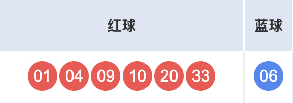
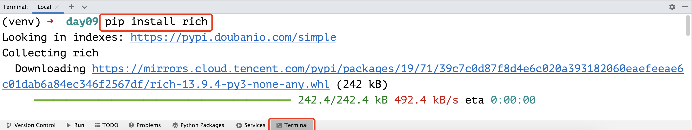
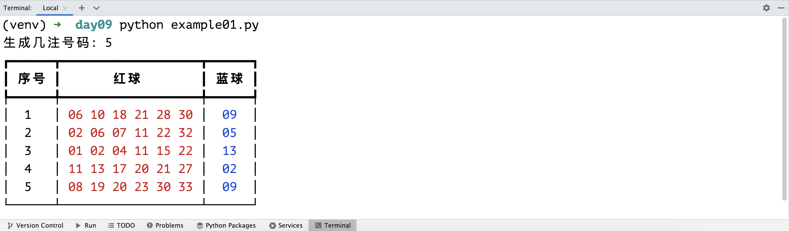

## Common Data Structures: Lists (Part 2)

### List Methods

List-type variables have many methods that help us manipulate a list. Assuming we have a list named `foos` and the list has a method named `bar`, the syntax for using a list method is: `foos.bar()`. This syntax calls the object's method through an object reference. We will explain this syntax in detail when we cover object-oriented programming later. This syntax is also known as sending a message to an object.

#### Adding and Removing Elements

A list is a mutable container, meaning that we can add elements to it, remove elements from it, and modify existing elements. We can use the list's `append` method to add an element to the end of a list, and the `insert` method to insert an element at a specified position. Appending means adding an element to the end of the list, while inserting adds a new element at the specified position. See the code below.

```python
languages = ['Python', 'Java', 'C++']
languages.append('JavaScript')
print(languages)  # ['Python', 'Java', 'C++', 'JavaScript']
languages.insert(1, 'SQL')
print(languages)  # ['Python', 'SQL', 'Java', 'C++', 'JavaScript']
```

We can use the list's `remove` method to remove a specified element from the list. Note that if the element to be removed is not in the list, it will raise a `ValueError`, crashing the program. So it's recommended to use the membership operation we covered earlier to check first before removing. We can also use the `pop` method to remove an element. By default, `pop` removes the last element, but you can also specify a position to remove the element at that position. If the index is out of range when using `pop`, it will raise an `IndexError`, crashing the program. Additionally, lists have a `clear` method that removes all elements, as shown below.

```python
languages = ['Python', 'SQL', 'Java', 'C++', 'JavaScript']
if 'Java' in languages:
    languages.remove('Java')
if 'Swift' in languages:
    languages.remove('Swift')
print(languages)  # ['Python', 'SQL', C++', 'JavaScript']
languages.pop()
temp = languages.pop(1)
print(temp)       # SQL
languages.append(temp)
print(languages)  # ['Python', C++', 'SQL']
languages.clear()
print(languages)  # []
```

> **Note**: The `pop` method returns the removed element. In the code above, we assigned the element removed by `pop` to a variable named `temp`. Of course, you can add this element back to the list, as shown by `languages.append(temp)` above.

Here's a quick question: if the `languages` list contains multiple `'Python'` entries, does `languages.remove('Python')` remove all of them or just the first one? You can guess first, then try it yourself.

There is another way to remove elements from a list -- using Python's `del` keyword followed by the element to delete. This approach is essentially the same as using `pop` with an index, but the latter returns the removed element. The former is slightly better in terms of performance because `del` corresponds to the `DELETE_SUBSCR` bytecode instruction, while `pop` corresponds to `CALL_METHOD` and `POP_TOP` instructions. If you don't understand this, don't worry about it.

```python
items = ['Python', 'Java', 'C++']
del items[1]
print(items)  # ['Python', 'C++']
```

#### Element Position and Frequency

The list's `index` method finds the index position of an element in the list. If the element is not found, it raises a `ValueError`. The list's `count` method counts how many times an element appears in the list, as shown below.

```python
items = ['Python', 'Java', 'Java', 'C++', 'Kotlin', 'Python']
print(items.index('Python'))     # 0
# Search for 'Python' starting from index position 1
print(items.index('Python', 1))  # 5
print(items.count('Python'))     # 2
print(items.count('Kotlin'))     # 1
print(items.count('Swfit'))      # 0
# Search for 'Java' starting from index position 3
print(items.index('Java', 3))    # ValueError: 'Java' is not in list
```

#### Sorting and Reversing Elements

The list's `sort` method sorts the list elements, and the `reverse` method reverses them, as shown below.

```python
items = ['Python', 'Java', 'C++', 'Kotlin', 'Swift']
items.sort()
print(items)  # ['C++', 'Java', 'Kotlin', 'Python', 'Swift']
items.reverse()
print(items)  # ['Swift', 'Python', 'Kotlin', 'Java', 'C++']
```

### List Comprehensions

In Python, lists can also be created using a special literal syntax called a comprehension. Let's use examples to illustrate the benefits of creating lists with list comprehensions.

Scenario 1: Create a list of numbers in the range `1` to `99` that are divisible by `3` or `5`.

```python
items = []
for i in range(1, 100):
    if i % 3 == 0 or i % 5 == 0:
        items.append(i)
print(items)
```

Using a list comprehension to do the same thing:

```python
items = [i for i in range(1, 100) if i % 3 == 0 or i % 5 == 0]
print(items)
```

Scenario 2: Given an integer list `nums1`, create a new list `nums2` where each element is the square of the corresponding element in `nums1`.

```python
nums1 = [35, 12, 97, 64, 55]
nums2 = []
for num in nums1:
    nums2.append(num ** 2)
print(nums2)
```

Using a list comprehension to do the same thing:

```python
nums1 = [35, 12, 97, 64, 55]
nums2 = [num ** 2 for num in nums1]
print(nums2)
```

Scenario 3: Given an integer list `nums1`, create a new list `nums2` containing only the elements from `nums1` that are greater than `50`.

```python
nums1 = [35, 12, 97, 64, 55]
nums2 = []
for num in nums1:
    if num > 50:
        nums2.append(num)
print(nums2)
```

Using a list comprehension to do the same thing:

```python
nums1 = [35, 12, 97, 64, 55]
nums2 = [num for num in nums1 if num > 50]
print(nums2)
```

Using list comprehensions to create lists is not only simpler and more elegant but also more performant than using a `for-in` loop with `append` to add elements to an empty list. Why do comprehensions have better performance? Because the Python interpreter has specialized bytecode instructions for comprehensions (`LIST_APPEND` instruction), while `for` loops add elements through method calls (`LOAD_METHOD` and `CALL_METHOD` instructions), and method calls themselves are relatively time-consuming operations. If you don't understand this point, that's fine -- just remember the conclusion: **it is strongly recommended to use comprehension syntax to create lists**.

### Nested Lists

Python does not require list elements to be of the same data type, meaning that elements in a list can be of any data type, including lists themselves. If a list's elements are also lists, we call it a nested list. Nested lists can be used to represent tables or mathematical matrices. For example, to store the grades of 5 students in 3 courses, we can use the following list.

```python
scores = [[95, 83, 92], [80, 75, 82], [92, 97, 90], [80, 78, 69], [65, 66, 89]]
print(scores[0])
print(scores[0][1])
```

For the nested list above, each element represents one student's grades in 3 courses, such as `[95, 83, 92]`. The `83` in this list represents the student's grade in a particular course. To access this value, we use two index operations: `scores[0][1]`. Here, `scores[0]` gives us `[95, 83, 92]`, and then the index operation `[1]` retrieves the second element of that list.

If you want to input the grades of 5 students in 3 courses from the keyboard and save them in a list, you can use the code below.

```python
scores = []
for _ in range(5):
    temp = []
    for _ in range(3):
        score = int(input('Please enter: '))
        temp.append(score)
    scores.append(temp)
print(scores)
```

If you want to generate the grades of 5 students in 3 courses using random numbers and save them in a list, we can use a list comprehension, as shown below.

```python
import random

scores = [[random.randrange(60, 101) for _ in range(3)] for _ in range(5)]
print(scores)
```

> **Note**: The code `[random.randrange(60, 101) for _ in range(3)]` produces a list of 3 random integers. We then placed this code inside another list comprehension as the list element, generating 5 such elements, ultimately producing a nested list.

### List Applications

Let's use a Chinese Double Color Ball random number picker as an example to illustrate list applications. Double Color Ball is a lottery game sold by the China Welfare Lottery Center. Each bet consists of `6` red balls and `1` blue ball. Red ball numbers are selected from `1` to `33`, and blue ball numbers are selected from `1` to `16`. Each bet requires selecting `6` red ball numbers and `1` blue ball number, as shown below.



> **Tip**: There is a brilliant quote on Zhihu about the nature of various lotteries in China, shared here: "**Create a fictitious person who gets something for nothing, use them to deceive a group of people who want something for nothing, and ultimately support a group of people who truly get something for nothing.**" Many people who have no concept of probability even think the odds of winning or not winning the lottery are both 50%. Others believe that if the probability of winning is 1%, buying 100 tickets guarantees a win -- these are all absurd ideas. So, **treasure your life, stay away from gambling, especially when you know nothing about probability!**

Let's write a Python program to generate a set of random numbers.

```python
"""
Double Color Ball Random Number Picker

Author: Luo Hao
Version: 1.0
"""
import random

red_balls = list(range(1, 34))
selected_balls = []
# Add 6 red balls to the selection list
for _ in range(6):
    # Generate a random integer representing the index of the selected red ball
    index = random.randrange(len(red_balls))
    # Remove the selected ball from the red ball list and add it to the selection list
    selected_balls.append(red_balls.pop(index))
# Sort the selected red balls
selected_balls.sort()
# Output the selected red balls
for ball in selected_balls:
    print(f'\033[031m{ball:0>2d}\033[0m', end=' ')
# Randomly select 1 blue ball
blue_ball = random.randrange(1, 17)
# Output the selected blue ball
print(f'\033[034m{blue_ball:0>2d}\033[0m')
```

> **Note**: In the code above, `print(f'\033[0m...\033[0m')` is used to control the output color -- red balls are displayed in red and blue balls in blue. The ellipsis represents the content we want to output. `\033[0m` is a control code that resets all attributes, meaning previous control codes are no longer in effect. You can think of it as a delimiter. The `0` before `m` means the console display mode is set to default (`0` can be omitted); `1` means bold; `5` means blinking; `7` means reverse display, etc. Between `0` and `m`, we can write numbers representing colors: `30` for black, `31` for red, `32` for green, `33` for yellow, `34` for blue, etc.

We can also use the `sample` and `choice` functions from the `random` module to simplify the code above. The former implements sampling without replacement, while the latter randomly selects a single element. The modified code is shown below.

```python
"""
Double Color Ball Random Number Picker

Author: Luo Hao
Version: 1.1
"""
import random

red_balls = [i for i in range(1, 34)]
blue_balls = [i for i in range(1, 17)]
# Randomly draw 6 red balls from the red ball list (without replacement)
selected_balls = random.sample(red_balls, 6)
# Sort the selected red balls
selected_balls.sort()
# Output the selected red balls
for ball in selected_balls:
    print(f'\033[031m{ball:0>2d}\033[0m', end=' ')
# Randomly draw 1 blue ball from the blue ball list
blue_ball = random.choice(blue_balls)
# Output the selected blue ball
print(f'\033[034m{blue_ball:0>2d}\033[0m')
```

To generate `N` sets of numbers randomly, we just need to put the code above inside a loop that runs `N` times, as shown below.

```python
"""
Double Color Ball Random Number Picker

Author: Luo Hao
Version: 1.2
"""
import random

n = int(input('How many sets of numbers to generate: '))
red_balls = [i for i in range(1, 34)]
blue_balls = [i for i in range(1, 17)]
for _ in range(n):
    # Randomly draw 6 red balls from the red ball list (without replacement)
    selected_balls = random.sample(red_balls, 6)
    # Sort the selected red balls
    selected_balls.sort()
    # Output the selected red balls
    for ball in selected_balls:
        print(f'\033[031m{ball:0>2d}\033[0m', end=' ')
    # Randomly draw 1 blue ball from the blue ball list
    blue_ball = random.choice(blue_balls)
    # Output the selected blue ball
    print(f'\033[034m{blue_ball:0>2d}\033[0m')
```

Running the code above in PyCharm and inputting `5`, the result looks like the image below.


Here's an introduction to a Python third-party library called rich, which helps us produce the most beautiful output in the simplest way. You can install this library using Python's package management tool pip in the terminal. For PyCharm users, you should use the pip command in PyCharm's terminal window to install rich into your project's virtual environment, with the command shown below.

```bash
pip install rich
```



As shown in the image above, after rich is installed successfully, we can use the following code to control output.

```python
"""
Double Color Ball Random Number Picker

Author: Luo Hao
Version: 1.3
"""
import random

from rich.console import Console
from rich.table import Table

# Create a console
console = Console()

n = int(input('How many sets of numbers to generate: '))
red_balls = [i for i in range(1, 34)]
blue_balls = [i for i in range(1, 17)]

# Create a table and add headers
table = Table(show_header=True)
for col_name in ('No.', 'Red Balls', 'Blue Ball'):
    table.add_column(col_name, justify='center')

for i in range(n):
    selected_balls = random.sample(red_balls, 6)
    selected_balls.sort()
    blue_ball = random.choice(blue_balls)
    # Add a row to the table (number, red balls, blue ball)
    table.add_row(
        str(i + 1),
        f'[red]{" ".join([f"{ball:0>2d}" for ball in selected_balls])}[/red]',
        f'[blue]{blue_ball:0>2d}[/blue]'
    )

# Output the table through the console
console.print(table)
```

> **Note**: Line 31 in the code above uses list comprehension syntax to process red ball numbers into strings and save them in a list. `" ".join([...])` joins multiple strings in the list into a single string separated by spaces. If you don't understand this, you can come back to it later. `[red]...[/red]` in the string sets the output color to red, and `[blue]...[/blue]` on line 32 sets the output color to blue. For more about the rich library, refer to the [official documentation](https://github.com/textualize/rich/blob/master/README.cn.md).

The final output looks like the image below -- doesn't it make you feel better?



### Summary

Under the hood, Python lists are dynamically resizable arrays where elements are stored contiguously in computer memory, enabling random access (accessing any element by a valid index in constant time regardless of list size). We can set aside these underlying storage details for now, and we don't need to understand the asymptotic time complexity of each list method (the relationship between execution time and the number of elements). The most important thing right now is to learn how to use lists to solve practical problems.
