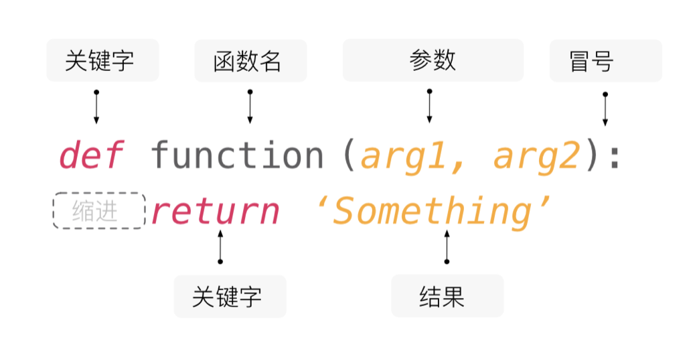

## Functions and Modules

Before we dive into this lesson's content, let's first look at a math problem. How many sets of positive integer solutions does the following equation have?

$$
x_{1} + x_{2} + x_{3} + x_{4} = 8
$$

You may have already figured it out — this problem is equivalent to dividing 8 apples into four groups with at least one apple in each group, which is also equivalent to placing three dividers in the 7 gaps between the 8 apples to split them into four groups. So the answer is $\small{C_{7}^{3} = 35}$, where $\small{C_{7}^{3}}$ represents the combination of choosing 3 from 7, with the formula shown below.

$$
C_m^n = \frac {m!} {n!(m-n)!}
$$

Based on what we've learned before, we can calculate $\small{m!}$, $\small{n!}$, and $\small{(m-n)!}$ separately using loops for cumulative multiplication, and then get the combination number $\small{C_{m}^{n}}$ through division, as shown in the code below.

```python
"""
Input m and n, calculate the value of C(m,n)

Version: 1.0
Author: Luo Hao
"""

m = int(input('m = '))
n = int(input('n = '))
# Calculate m factorial
fm = 1
for num in range(1, m + 1):
    fm *= num
# Calculate n factorial
fn = 1
for num in range(1, n + 1):
    fn *= num
# Calculate (m-n) factorial
fk = 1
for num in range(1, m - n + 1):
    fk *= num
# Calculate the value of C(m,n)
print(fm // fn // fk)
```

Input:

```
m = 7
n = 3
```

Output:

```
35
```

Have you noticed that in the code above, we performed the factorial operation three times? Although the values of $\small{m}$, $\small{n}$, and $\small{m - n}$ are different, the three code segments are essentially the same — they are duplicate code. The world-renowned programming master *Martin Fowler* once said: "**Code has many bad smells, and duplication is the worst!**" To write high-quality code, the first thing to address is the problem of duplicate code. For the code above, we can encapsulate the factorial functionality into a block of code called a "function". Wherever we need to compute a factorial, we simply "call the function" to reuse the factorial functionality.

### Defining Functions

In mathematics, functions typically take the form of $\small{y = f(x)}$ or $\small{z = g(x, y)}$. In $\small{y = f(x)}$, $\small{f}$ is the function name, $\small{x}$ is the independent variable, and $\small{y}$ is the dependent variable. In $\small{z = g(x, y)}$, $\small{g}$ is the function name, $\small{x}$ and $\small{y}$ are the independent variables, and $\small{z}$ is the dependent variable. Functions in Python follow the same structure — each function has its own name, independent variables, and dependent variables. We typically call the independent variables of a Python function its **parameters**, and the dependent variable is called the **return value**.

In Python, you can use the `def` keyword to define a function. Like variables, every function should have a descriptive name, following the same naming rules as variables (try to recall the variable naming rules we discussed before). You can set the function's parameters inside the parentheses after the function name — these are the independent variables we just mentioned. After the function finishes execution, we use the `return` keyword to return the function's result — this is the dependent variable we just mentioned. If there is no `return` statement in the function, the function returns `None`, which represents a null value. Also, a function may have no independent variables (parameters), but the parentheses after the function name are still required. The code that a function needs to execute (its body) is placed after the function definition line using indentation, similar to how code blocks work in branch and loop structures, as shown in the diagram below.



Now, let's place the factorial operation from the previous code into a function and use this approach to refactor the code above. **Refactoring means adjusting the structure of code without affecting its execution results.** The refactored code is shown below.

```python
"""
Input m and n, calculate the value of C(m,n)

Version: 1.1
Author: Luo Hao
"""


# Define a factorial function using the def keyword
# The independent variable (parameter) num is a non-negative integer
# The dependent variable (return value) is the factorial of num
def fac(num):
    result = 1
    for n in range(2, num + 1):
        result *= n
    return result


m = int(input('m = '))
n = int(input('n = '))
# No need to write duplicate code for calculating factorials — just call the function
# The syntax for calling a function is the function name followed by parentheses with parameters
print(fac(m) // fac(n) // fac(m - n))
```

As you can see, the code above is simpler and more elegant than the previous version. More importantly, the `fac` function we defined can be reused in other code that needs factorial calculations. So, **using functions allows us to encapsulate relatively independent and reusable functionality**. When we need this code, instead of writing the duplicate code again, we **reuse existing code by calling the function**. In fact, Python's standard library `math` module already has a function called `factorial` that implements factorial computation. We can import the `math` module with `import math` and then use `math.factorial` to call the factorial function. We can also use `from math import factorial` to import the `factorial` function directly, as shown below.

```python
"""
Input m and n, calculate the value of C(m,n)

Version: 1.2
Author: Luo Hao
"""
from math import factorial

m = int(input('m = '))
n = int(input('n = '))
print(factorial(m) // factorial(n) // factorial(m - n))
```

The functions we will use in the future will either be self-defined or provided by Python's standard library or third-party libraries. If there is already an available function, there is no need to define it yourself — "**reinventing the wheel**" is a very bad practice. For the code above, if you find the name `factorial` too long and inconvenient to type, you can give it an alias using the `as` keyword when importing. When calling the function, you can use the alias instead of the original name, as shown below.

```python
"""
Input m and n, calculate the value of C(m,n)

Version: 1.3
Author: Luo Hao
"""
from math import factorial as f

m = int(input('m = '))
n = int(input('n = '))
print(f(m) // f(n) // f(m - n))
```

### Function Parameters

#### Positional Parameters and Keyword Parameters

Let's write another function that determines whether three given edge lengths can form a triangle. If they can, it returns `True`; otherwise, it returns `False`, as shown below.

```python
def make_judgement(a, b, c):
    """Determine if three edge lengths can form a triangle"""
    return a + b > c and b + c > a and a + c > b
```

The `make_judgement` function above has three parameters, which are called positional parameters. When calling the function, they are typically passed in order from left to right, and the number of arguments passed must match the number of parameters defined, as shown below.

```python
print(make_judgement(1, 2, 3))  # False
print(make_judgement(4, 5, 6))  # True
```

If you don't want to pass the values of `a`, `b`, and `c` in left-to-right order, you can use keyword parameters by passing arguments in the form of "parameter_name=value", as shown below.

```python
print(make_judgement(b=2, c=3, a=1))  # False
print(make_judgement(c=6, b=4, a=5))  # True
```

When defining a function, you can use `/` in the parameter list to set **positional-only arguments**, and `*` to set **keyword-only arguments**. Positional-only arguments can only receive values by position when calling the function, while keyword-only arguments can only be passed in the "parameter_name=value" form. Take a look at the examples below.

```python
# Parameters before / are positional-only arguments
def make_judgement(a, b, c, /):
    """Determine if three edge lengths can form a triangle"""
    return a + b > c and b + c > a and a + c > b


# The code below will produce a TypeError, with the message "positional-only arguments cannot be given parameter names"
# TypeError: make_judgement() got some positional-only arguments passed as keyword arguments
# print(make_judgement(b=2, c=3, a=1))
```

> **Note**: Positional-only parameters are a new feature introduced in Python 3.8. Be aware of this when using older versions of the Python interpreter.

```python
# Parameters after * are keyword-only arguments
def make_judgement(*, a, b, c):
    """Determine if three edge lengths can form a triangle"""
    return a + b > c and b + c > a and a + c > b


# The code below will produce a TypeError, with the message "function takes 0 positional arguments but 3 were given"
# TypeError: make_judgement() takes 0 positional arguments but 3 were given
# print(make_judgement(1, 2, 3))
```

#### Default Parameter Values

Python allows function parameters to have default values. Let's take an example from a previous lesson — the "CRAPS Dice Game" (from "Lesson 07: Applications of Branch and Loop Structures") — and encapsulate the dice-rolling functionality into a function, as shown below.

```python
from random import randrange


# Define a dice-rolling function
# The parameter n represents the number of dice, with a default value of 2
# The return value represents the total points from rolling n dice
def roll_dice(n=2):
    total = 0
    for _ in range(n):
        total += randrange(1, 7)
    return total


# If no argument is specified, n uses the default value of 2, meaning roll two dice
print(roll_dice())
# Pass in 3, so n is assigned 3, meaning roll three dice and get the total points
print(roll_dice(3))
```

Let's look at an even simpler example.

```python
def add(a=0, b=0, c=0):
    """Sum of three numbers"""
    return a + b + c


# Call add with no arguments; a, b, c all use default value 0
print(add())         # 0
# Call add with one argument; it is assigned to a, while b and c use default value 0
print(add(1))        # 1
# Call add with two arguments; they are assigned to a and b, while c uses default value 0
print(add(1, 2))     # 3
# Call add with three arguments; they are assigned to a, b, and c respectively
print(add(1, 2, 3))  # 6
```

Note that **parameters with default values must be placed after parameters without default values**; otherwise, a `SyntaxError` will be raised with the message: `non-default argument follows default argument`.

#### Variable Arguments

Python allows functions to support variable arguments through star expression syntax. Variable arguments mean that when calling a function, you can pass `0` or any number of arguments. When developing commercial projects as a team, you may need to design functions for others to use, but sometimes you don't know how many arguments the caller will pass — this is where variable arguments come in handy.

The code below demonstrates how to use variable positional arguments to implement an `add` function that sums any number of values. The arguments passed when calling the function are stored in a tuple, and by iterating over this tuple, we can access the arguments passed to the function.

```python
# Use a star expression to indicate that args can receive 0 or any number of arguments
# The n arguments passed when calling the function are packed into an n-tuple and assigned to args
# If no arguments are passed, args will be an empty tuple
def add(*args):
    total = 0
    # Iterate over the tuple that holds the variable arguments
    for val in args:
        # Type check the arguments (only numeric types can be summed)
        if type(val) in (int, float):
            total += val
    return total


# When calling the add function, you can pass 0 or any number of arguments
print(add())         # 0
print(add(1))        # 1
print(add(1, 2, 3))  # 6
print(add(1, 2, 'hello', 3.45, 6))  # 12.45
```

If we want to pass any number of arguments in the "parameter_name=value" form, where the exact count is uncertain, we can add variable keyword arguments to the function. These keyword arguments are packed into a dictionary, as shown below.

```python
# **kwargs in the parameter list can receive 0 or any number of keyword arguments
# The keyword arguments passed when calling the function are packed into a dictionary
# (parameter names become dictionary keys, parameter values become dictionary values)
# If no keyword arguments are passed, kwargs will be an empty dictionary
def foo(*args, **kwargs):
    print(args)
    print(kwargs)


foo(3, 2.1, True, name='骆昊', age=43, gpa=4.95)
```

Output:

```
(3, 2.1, True)
{'name': '骆昊', 'age': 43, 'gpa': 4.95}
```

### Managing Functions with Modules

No matter what programming language you use, naming variables and functions is always a headache, because we inevitably encounter **naming conflicts**. The simplest scenario is defining two functions with the same name in the same `.py` file, as shown below.

```python
def foo():
    print('hello, world!')


def foo():
    print('goodbye, world!')


foo()  # Guess what calling foo will output
```

The situation above is easy to avoid, but what about when a project is being developed collaboratively by multiple programmers, and several of them define a function named `foo`? The answer is quite simple: in Python, each file represents a module, and different modules can contain functions with the same name. When using a function, we import the specified module using the `import` keyword and then use the **fully qualified name** (`module_name.function_name`) to distinguish which module's `foo` function we want to use, as shown below.

`module1.py`

```python
def foo():
    print('hello, world!')
```

`module2.py`

```python
def foo():
    print('goodbye, world!')
```

`test.py`

```python
import module1
import module2

# Use "module_name.function_name" (fully qualified name) to call functions
module1.foo()  # hello, world!
module2.foo()  # goodbye, world!
```

When importing modules, you can also use the `as` keyword to give them aliases, allowing you to use shorter fully qualified names.

`test.py`

```python
import module1 as m1
import module2 as m2

m1.foo()  # hello, world!
m2.foo()  # goodbye, world!
```

In the two code snippets above, we imported the modules that define the functions. We can also use `from...import...` syntax to import the needed functions directly from a module, as shown below.

`test.py`

```python
from module1 import foo

foo()  # hello, world!

from module2 import foo

foo()  # goodbye, world!
```

However, if we import functions with the same name from two different modules, the later import will replace the earlier one. In the code below, calling `foo` will output `goodbye, world!` because we first imported `foo` from `module1` and then imported `foo` from `module2`. If the two `from...import...` statements were reversed, the result would be different.

`test.py`

```python
from module1 import foo
from module2 import foo

foo()  # goodbye, world!
```

If you want to use `foo` functions from both modules in the code above, there is still a way — as you may have guessed, use the `as` keyword to give aliases to the imported functions, as shown below.

`test.py`

```python
from module1 import foo as f1
from module2 import foo as f2

f1()  # hello, world!
f2()  # goodbye, world!
```

### Modules and Functions from the Standard Library

Python's standard library provides a large number of modules and functions to simplify our development work. The `random` module we've used before provides functions for generating random numbers and performing random sampling, while the `time` module provides time-related functions. The `math` module we've used also includes mathematical functions for computing sine, cosine, exponential, logarithm, and more. As we delve deeper into Python, we will use even more modules and functions.

There is also a category of functions in Python's standard library that can be used directly without an `import` — we call these **built-in functions**. These built-in functions are not only useful but also very commonly used. The table below lists some of them.

| Function | Description                                                  |
| ------- | ------------------------------------------------------------ |
| `abs`   | Returns the absolute value of a number. For example, `abs(-1.3)` returns `1.3`. |
| `bin`   | Converts an integer to a binary string prefixed with `'0b'`. For example, `bin(123)` returns `'0b1111011'`. |
| `chr`   | Converts a Unicode code to the corresponding character. For example, `chr(8364)` returns `'€'`. |
| `hex`   | Converts an integer to a hexadecimal string prefixed with `'0x'`. For example, `hex(123)` returns `'0x7b'`. |
| `input` | Reads a line from input and returns the string read.         |
| `len`   | Gets the length of a string, list, etc.                      |
| `max`   | Returns the maximum value among multiple arguments or an iterable. For example, `max(12, 95, 37)` returns `95`. |
| `min`   | Returns the minimum value among multiple arguments or an iterable. For example, `min(12, 95, 37)` returns `12`. |
| `oct`   | Converts an integer to an octal string prefixed with `'0o'`. For example, `oct(123)` returns `'0o173'`. |
| `open`  | Opens a file and returns a file object.                      |
| `ord`   | Converts a character to the corresponding Unicode code. For example, `ord('€')` returns `8364`. |
| `pow`   | Performs exponentiation. For example, `pow(2, 3)` returns `8`; `pow(2, 0.5)` returns `1.4142135623730951`. |
| `print` | Prints output.                                               |
| `range` | Constructs a range sequence. For example, `range(100)` produces an integer sequence from `0` to `99`. |
| `round` | Rounds a number to the specified precision. For example, `round(1.23456, 4)` returns `1.2346`. |
| `sum`   | Sums the items in a sequence from left to right. For example, `sum(range(1, 101))` returns `5050`. |
| `type`  | Returns the type of an object. For example, `type(10)` returns `int`; `type('hello')` returns `str`. |

###  Summary

**A function is an encapsulation of relatively independent and reusable code.** Learning to define and use functions enables you to write better quality code. Of course, Python's standard library already provides a wealth of modules and commonly used functions — using these modules and functions well allows you to do more with less code. If these modules and functions don't meet your needs, you may need to define your own functions and then manage them using the concept of modules.
