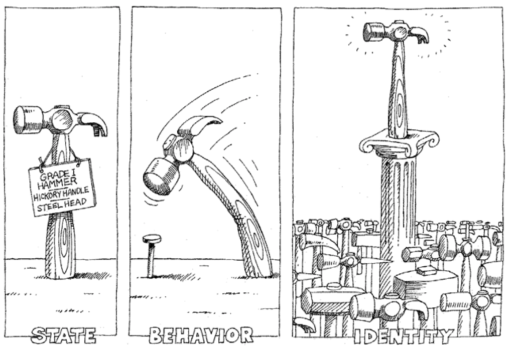

## Introduction to Object-Oriented Programming

Object-oriented programming is a very popular **programming paradigm**. A programming paradigm is a **methodology for program design** — in simple terms, it is how programmers perceive and understand programs and how they write code.

In previous lessons, we said that "**a program is a collection of instructions**". When a program runs, the statements in it become one or more instructions that are executed by the CPU (Central Processing Unit). To simplify program design, we then introduced functions — **placing relatively independent and frequently reused code into functions** and calling them when needed. If a function becomes too complex and bloated, we can further **break it down into multiple sub-functions** to reduce system complexity.

Have you noticed that programming is essentially the programmer controlling a machine to complete tasks by writing code according to how computers work? However, the way computers work is different from how humans normally think. If programming requires abandoning normal human thinking to cater to computers, much of the fun of programming would be lost. I'm not saying we can't write code following the computer's way of working, but when we need to develop a complex system, this approach makes the code overly complex, making both development and maintenance extremely difficult.

As software complexity increases, writing correct and reliable code becomes an extremely daunting task — this is why many people firmly believe that "software development is the most complex of all human activities to transform the world." How to use programs to describe complex systems and solve complex problems has become a question that every programmer must think about and face. The Smalltalk language, born in the 1970s, gave software developers hope because it introduced a new programming paradigm called object-oriented programming. In the world of object-oriented programming, **data and the functions that operate on data form a logical whole** called an **object**. **Objects can receive messages**, and the way to solve problems is to **create objects and send various messages to them**. Through message passing, multiple objects in a program can work together, enabling us to construct complex systems and solve real-world problems. Of course, the origins of object-oriented programming can be traced back even further to the earlier Simula language, but that is not the focus of our discussion here.

> **Note:** Many high-level programming languages we use today support object-oriented programming, but object-oriented programming is not a "silver bullet" that solves all problems in software development — in fact, there is currently no such "silver bullet" in the software development industry. For more on this topic, you can refer to the paper "No Silver Bullet — Essence and Accidents of Software Engineering" by Frederick Brooks, the father of the IBM 360 system, or the classic software engineering book *The Mythical Man-Month*.

### Classes and Objects

If I had to summarize object-oriented programming in one sentence, I think the following statement is quite incisive and accurate.

> **Object-Oriented Programming**: Combine a set of data and the methods that process the data into **objects**, group objects with the same behavior into **classes**, hide the internal details of objects through **encapsulation**, achieve specialization and generalization of classes through **inheritance**, and implement dynamic dispatch based on object types through **polymorphism**.

This statement may not be easy for beginners to understand, but let me highlight a few key terms: **object**, **class**, **encapsulation**, **inheritance**, **polymorphism**.

Let's first talk about classes and objects. In object-oriented programming, **a class is an abstract concept, while an object is a concrete concept**. When we extract the common characteristics of a group of similar objects, we get a class. For example, "human" is an abstract concept, while each individual person is a real, tangible entity under this abstract concept — that is, an object. In short, **a class is the blueprint and template for objects, and an object is an instance of a class — a concrete entity that can receive messages**.

In the world of object-oriented programming, **everything is an object**, **objects have attributes and behaviors**, **every object is unique**, and **every object belongs to some class**. An object's attributes are its static characteristics, and an object's behaviors are its dynamic characteristics. Following the description above, if we extract the attributes and behaviors common to all objects of the same kind, we can define a class.



### Defining Classes

In Python, we can use the `class` keyword followed by a class name to define a class. Through indentation, we define the class's code block, just like defining a function. In the class's code block, we need to write some functions. We said that a class is an abstract concept, so these functions are the extraction of common dynamic characteristics of a group of objects. Functions written inside a class are usually called **methods**. Methods are the behaviors of objects — the messages that objects can receive. The first parameter of a method is typically `self`, which represents the object that receives the message.

```python
class Student:

    def study(self, course_name):
        print(f'The student is studying {course_name}.')

    def play(self):
        print(f'The student is playing games.')
```

### Creating and Using Objects

After defining a class, we can use constructor syntax to create objects, as shown below.

```python
stu1 = Student()
stu2 = Student()
print(stu1)    # <__main__.Student object at 0x10ad5ac50>
print(stu2)    # <__main__.Student object at 0x10ad5acd0>
print(hex(id(stu1)), hex(id(stu2)))    # 0x10ad5ac50 0x10ad5acd0
```

Placing parentheses after the class name is the so-called constructor syntax. The code above creates two student objects, assigning one to the variable `stu1` and the other to `stu2`. When we use the `print` function to print the `stu1` and `stu2` variables, we can see the objects' memory addresses (in hexadecimal), which match the values we get from the `id` function. Now we can tell you that the variables we define actually store the logical address (location) of an object in memory. Through this logical address, we can find the object in memory. So an assignment like `stu3 = stu2` does not create a new object — it simply stores the address of an existing object in a new variable.

Next, let's try sending messages to objects — that is, calling object methods. In the `Student` class above, we defined two methods: `study` and `play`. The first parameter `self` of both methods represents the student object receiving the message, and the second parameter of `study` is the name of the course being studied. In Python, there are two ways to send messages to objects, as shown below.

```python
# Call the method via "Class.method"
# The first parameter is the object receiving the message
# The second parameter is the course name
Student.study(stu1, 'Python Programming')    # The student is studying Python Programming.
# Call the method via "object.method"
# The object before the dot is the one receiving the message
# Only the second parameter (course name) needs to be passed
stu1.study('Python Programming')             # The student is studying Python Programming.

Student.play(stu2)                      # The student is playing games.
stu2.play()                             # The student is playing games.
```

### The Initialization Method

You may have noticed that the student objects we created above only have behaviors but no attributes. To define attributes for student objects, we can modify the `Student` class by adding a method called `__init__`. When we call the `Student` class constructor to create an object, it first allocates the memory space needed to store the student object, then automatically executes the `__init__` method to initialize the memory — that is, to place data into the allocated memory space. So by adding an `__init__` method to the `Student` class, we can specify attributes for student objects and initialize their values. For this reason, `__init__` is commonly called the initialization method.

Let's modify the `Student` class above to add `name` and `age` attributes to student objects.

```python
class Student:
    """Student"""

    def __init__(self, name, age):
        """Initialization method"""
        self.name = name
        self.age = age

    def study(self, course_name):
        """Study"""
        print(f'{self.name} is studying {course_name}.')

    def play(self):
        """Play"""
        print(f'{self.name} is playing games.')
```

Let's modify the code for creating objects and sending messages, and run it again to see how the output changes.

```python
# Call the Student class constructor to create objects and pass initialization parameters
stu1 = Student('骆昊', 44)
stu2 = Student('王大锤', 25)
stu1.study('Python Programming')    # 骆昊 is studying Python Programming.
stu2.play()                    # 王大锤 is playing games.
```


### The Pillars of Object-Oriented Programming

Object-oriented programming has three pillars, which are the three key terms we highlighted earlier: **encapsulation**, **inheritance**, and **polymorphism**. The latter two concepts will be explained in detail in the next lesson. Here, let's first talk about what encapsulation is. My understanding of encapsulation is: **hide all implementation details that can be hidden, and only expose simple calling interfaces to the outside world**. The object methods we define in a class are a form of encapsulation. This encapsulation allows us to create an object and then simply send it a message to execute the method's code — meaning we can use the method knowing only its name and parameters (the method's external view), without knowing its internal implementation details (the method's internal view).

For example, suppose we need to control a robot to pour a glass of water for us. Without object-oriented programming and without any encapsulation, we would need to send the robot a series of instructions: stand up, turn left, walk forward 5 steps, pick up the glass in front of you, turn around, walk forward 10 steps, bend down, put down the glass, press the water button, wait 10 seconds, release the water button, pick up the glass, turn right, walk forward 5 steps, put down the glass, etc. Just thinking about it feels cumbersome. With the object-oriented approach, we can encapsulate the water-pouring operation into a method of the robot object. When we need the robot to pour water, we simply send a "pour water" message to the robot object — isn't that better?

In many scenarios, object-oriented programming is essentially a three-step process: step one, define a class; step two, create an object; step three, send messages to the object. Of course, sometimes the first step is not necessary because the class we need may already exist. As we mentioned before, Python's built-in `list`, `set`, and `dict` are all classes — if we need to create list, set, or dictionary objects, we don't need to define our own classes. Of course, some classes are not directly provided by Python's standard library — they may come from third-party code. How to install and use third-party code will be discussed in later lessons. In certain special scenarios, we use what are called "built-in objects" — objects where both the first step (defining the class) and the second step (creating the object) are already done. The class already exists and the object has already been created — we just send messages to it directly. This is what we commonly call "out of the box."

### Object-Oriented Examples

#### Example 1: Clock

> **Requirement**: Define a class to describe a digital clock, providing functionality for ticking and displaying the time.

```python
import time


# Define the Clock class
class Clock:
    """Digital clock"""

    def __init__(self, hour=0, minute=0, second=0):
        """Initialization method
        :param hour: hours
        :param minute: minutes
        :param second: seconds
        """
        self.hour = hour
        self.min = minute
        self.sec = second

    def run(self):
        """Tick"""
        self.sec += 1
        if self.sec == 60:
            self.sec = 0
            self.min += 1
            if self.min == 60:
                self.min = 0
                self.hour += 1
                if self.hour == 24:
                    self.hour = 0

    def show(self):
        """Display time"""
        return f'{self.hour:0>2d}:{self.min:0>2d}:{self.sec:0>2d}'


# Create a clock object
clock = Clock(23, 59, 58)
while True:
    # Send a message to the clock object to read the time
    print(clock.show())
    # Sleep for 1 second
    time.sleep(1)
    # Send a message to the clock object to tick
    clock.run()
```

#### Example 2: Point on a Plane

>  **Requirement**: Define a class to describe a point on a plane, providing a method to calculate the distance to another point.

```python
class Point:
    """Point on a plane"""

    def __init__(self, x=0, y=0):
        """Initialization method
        :param x: x-coordinate
        :param y: y-coordinate
        """
        self.x, self.y = x, y

    def distance_to(self, other):
        """Calculate the distance to another point
        :param other: another point
        """
        dx = self.x - other.x
        dy = self.y - other.y
        return (dx * dx + dy * dy) ** 0.5

    def __str__(self):
        return f'({self.x}, {self.y})'


p1 = Point(3, 5)
p2 = Point(6, 9)
print(p1)  # Calls the object's __str__ magic method
print(p2)
print(p1.distance_to(p2))
```

### Summary

Object-oriented programming is a very popular programming paradigm. Besides OOP, there are also **imperative programming**, **functional programming**, and other paradigms. Since the real world is composed of objects, and objects are entities that can receive messages, **object-oriented programming aligns more closely with normal human thinking habits**. A class is abstract, an object is concrete. With a class, we can create objects; with objects, we can receive messages — this is the foundation of object-oriented programming. Defining a class is an abstraction process: finding common attributes of objects is data abstraction, and finding common methods is behavioral abstraction. The abstraction process is subjective — abstracting the same group of objects may yield different results, as shown in the diagram below.


> **Note:** The illustrations in this lesson are from the book *Object-Oriented Analysis and Design* by Grady Booch and others. This book is a classic on object-oriented programming. Interested readers can purchase and read it to learn more about object-oriented concepts.
