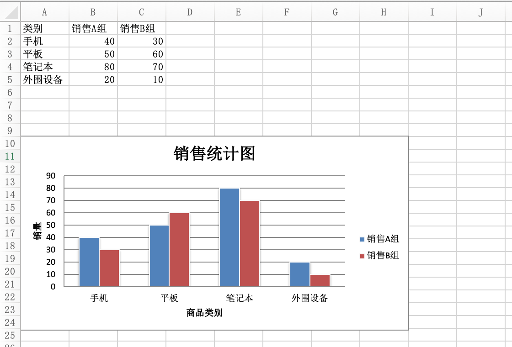

## Reading and Writing Excel Files in Python - Part 2

### Introduction to Excel

Excel is a spreadsheet software developed by Microsoft for the Windows and macOS operating systems. With its intuitive interface, excellent computation capabilities, and charting tools, combined with successful marketing, Excel has long been the most popular personal computer data processing software. Of course, Excel has many competitors, such as Google Sheets, LibreOffice Calc, Numbers, etc. These competitors are basically compatible with Excel and can at least read and write newer versions of Excel files, but these are not the focus of our discussion. Mastering how to manipulate Excel files with Python programs can make daily office automation tasks much easier and more enjoyable. Moreover, importing and exporting Excel files is a very common feature in many commercial projects.

In this chapter, we continue to explain how to work with Excel files using another third-party library called `openpyxl`. First, you need to install it.

```Bash
pip install openpyxl
```

The advantage of `openpyxl` is that once you open an Excel file, you can both read from and write to it, and it is more convenient to use than `xlwt` and `xlrd`. Additionally, for style editing and formula calculations, `openpyxl` is far simpler than the methods we discussed in the previous chapter. `openpyxl` also supports pivot tables and chart insertion, making it very powerful. One point that needs to be emphasized again: `openpyxl` does not support working with Excel files from versions prior to Office 2007.

### Reading Excel Files

For example, suppose there is an Excel file named "Alibaba 2020 Stock Data.xlsx" in the current folder. If you want to read and display the contents of this file, you can do so with the following code.

```python
import datetime

import openpyxl

# Load a workbook ---> Workbook
wb = openpyxl.load_workbook('阿里巴巴2020年股票数据.xlsx')
# Get the worksheet names
print(wb.sheetnames)
# Get a worksheet ---> Worksheet
sheet = wb.worksheets[0]
# Get the cell range
print(sheet.dimensions)
# Get the number of rows and columns
print(sheet.max_row, sheet.max_column)

# Get the value of a specific cell
print(sheet.cell(3, 3).value)
print(sheet['C3'].value)
print(sheet['G255'].value)

# Get multiple cells (nested tuple)
print(sheet['A2:C5'])

# Read all cell data
for row_ch in range(2, sheet.max_row + 1):
    for col_ch in 'ABCDEFG':
        value = sheet[f'{col_ch}{row_ch}'].value
        if type(value) == datetime.datetime:
            print(value.strftime('%Y年%m月%d日'), end='\t')
        elif type(value) == int:
            print(f'{value:<10d}', end='\t')
        elif type(value) == float:
            print(f'{value:.4f}', end='\t')
        else:
            print(value, end='\t')
    print()
```

> **Tip**: The Excel file "Alibaba 2020 Stock Data.xlsx" used in the code above can be obtained from the following Baidu Cloud link: https://pan.baidu.com/s/1rQujl5RQn9R7PadB2Z5g_g, access code: e7b4.

A reminder: `openpyxl` provides two ways to access a specific cell. One is through the `cell` method -- note that both the row index and column index start from `1`, which accommodates the habits of people accustomed to Excel. The other is through index operations, by specifying the cell coordinates such as `C3` or `G255`, which also retrieves the corresponding cell. Then, through the cell object's `value` attribute, you can get the cell's value. From the code above, you may have also noticed that you can use slicing operations like `sheet['A2:C5']` or `sheet['A2':'C5']` to get multiple cells. This operation returns nested tuples, equivalent to getting multiple rows and columns.

### Writing Excel Files

Below, we use `openpyxl` to perform Excel write operations.

```python
import random

import openpyxl

# Step 1: Create a Workbook
wb = openpyxl.Workbook()

# Step 2: Add a Worksheet
sheet = wb.active
sheet.title = 'Final Exam Scores'

titles = ('Name', 'Chinese', 'Math', 'English')
for col_index, title in enumerate(titles):
    sheet.cell(1, col_index + 1, title)

names = ('Guan Yu', 'Zhang Fei', 'Zhao Yun', 'Ma Chao', 'Huang Zhong')
for row_index, name in enumerate(names):
    sheet.cell(row_index + 2, 1, name)
    for col_index in range(2, 5):
        sheet.cell(row_index + 2, col_index, random.randrange(50, 101))

# Step 4: Save the Workbook
wb.save('exam_scores.xlsx')
```

### Adjusting Styles and Formula Calculations

When working with Excel using `openpyxl`, you can adjust cell styles directly through the cell object's (`Cell` object) attributes. Cell object attributes include font (`font`), alignment (`alignment`), border (`border`), etc. For details, refer to the `openpyxl` [official documentation](https://openpyxl.readthedocs.io/en/stable/index.html). When using `openpyxl` for formula calculations, you can operate exactly as you would in Excel. The specific code is shown below.

```python
import openpyxl
from openpyxl.styles import Font, Alignment, Border, Side

# Alignment
alignment = Alignment(horizontal='center', vertical='center')
# Border line
side = Side(color='ff7f50', style='mediumDashed')

wb = openpyxl.load_workbook('exam_scores.xlsx')
sheet = wb.worksheets[0]

# Adjust row height and column width
sheet.row_dimensions[1].height = 30
sheet.column_dimensions['E'].width = 120

sheet['E1'] = 'Average'
# Set font
sheet.cell(1, 5).font = Font(size=18, bold=True, color='ff1493', name='华文楷体')
# Set alignment
sheet.cell(1, 5).alignment = alignment
# Set cell border
sheet.cell(1, 5).border = Border(left=side, top=side, right=side, bottom=side)
for i in range(2, 7):
    # Formula to calculate each student's average score
    sheet[f'E{i}'] = f'=average(B{i}:D{i})'
    sheet.cell(i, 5).font = Font(size=12, color='4169e1', italic=True)
    sheet.cell(i, 5).alignment = alignment

wb.save('exam_scores.xlsx')
```

### Generating Charts

With the `openpyxl` library, you can insert charts directly into Excel, and the approach is largely the same as inserting charts in Excel itself. We can create a chart object of a specified type, then configure the chart through its attributes. Most importantly, we need to bind data to the chart -- what the horizontal axis represents, what the vertical axis represents, and the specific values. Finally, we can add the chart object to the worksheet. The specific code is shown below.

```python
from openpyxl import Workbook
from openpyxl.chart import BarChart, Reference

wb = Workbook(write_only=True)
sheet = wb.create_sheet()

rows = [
    ('Category', 'Sales Team A', 'Sales Team B'),
    ('Phones', 40, 30),
    ('Tablets', 50, 60),
    ('Laptops', 80, 70),
    ('Peripherals', 20, 10),
]

# Add rows to the worksheet
for row in rows:
    sheet.append(row)

# Create chart object
chart = BarChart()
chart.type = 'col'
chart.style = 10
# Set chart title
chart.title = 'Sales Statistics'
# Set chart Y-axis title
chart.y_axis.title = 'Sales Volume'
# Set chart X-axis title
chart.x_axis.title = 'Product Category'
# Set data range
data = Reference(sheet, min_col=2, min_row=1, max_row=5, max_col=3)
# Set category range
cats = Reference(sheet, min_col=1, min_row=2, max_row=5)
# Add data to chart
chart.add_data(data, titles_from_data=True)
# Set chart categories
chart.set_categories(cats)
chart.shape = 4
# Add chart to the worksheet at the specified cell
sheet.add_chart(chart, 'A10')

wb.save('demo.xlsx')
```

Running the code above and opening the generated Excel file produces the result shown in the figure below.



### Summary

Mastering how to work with Excel files using Python programs can help solve many tedious Excel spreadsheet tasks in daily office work. The most common tasks are merging multiple Excel files with the same data format into one file and extracting specific data from multiple Excel files or worksheets. If the data volume is large or the data processing methods are complex, we recommend using the pandas library -- one of Python's data analysis powerhouses.
