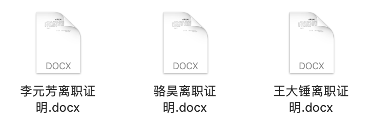

## Working with Word and PowerPoint Files in Python

In daily work, many simple repetitive tasks can be entirely handled by Python programs, such as batch-generating many Word or PowerPoint files based on template files. Word is a word processing program developed by Microsoft -- everyone is familiar with it, as many formal documents in daily office work are written and edited with Word. The current Word file extension is typically `.docx`. PowerPoint is a presentation program developed by Microsoft and a member of the Microsoft Office suite. It is widely used by business professionals, teachers, students, and other groups, and is often referred to as "slides." In Python, you can use the third-party library called `python-docx` to work with Word, and the third-party library called `python-pptx` to generate PowerPoint presentations.

### Working with Word Documents

We can first install the `python-docx` third-party library using the following command.

```bash
pip install python-docx
```

According to the [official documentation](https://python-docx.readthedocs.io/en/latest/), we can use the following code to generate a simple Word document.

```python
from docx import Document
from docx.shared import Cm, Pt

from docx.document import Document as Doc

# Create a Doc object representing a Word document
document = Document()  # type: Doc
# Add a title
document.add_heading('Happy Learning Python', 0)
# Add a paragraph
p = document.add_paragraph('Python is a very popular programming language that is ')
run = p.add_run('simple')
run.bold = True
run.font.size = Pt(18)
p.add_run(' and ')
run = p.add_run('elegant')
run.font.size = Pt(18)
run.underline = True
p.add_run('.')

# Add a level 1 heading
document.add_heading('Heading, level 1', level=1)
# Add a styled paragraph
document.add_paragraph('Intense quote', style='Intense Quote')
# Add an unordered list
document.add_paragraph(
    'first item in unordered list', style='List Bullet'
)
document.add_paragraph(
    'second item in ordered list', style='List Bullet'
)
# Add an ordered list
document.add_paragraph(
    'first item in ordered list', style='List Number'
)
document.add_paragraph(
    'second item in ordered list', style='List Number'
)

# Add an image (note: the path and image must exist)
document.add_picture('resources/guido.jpg', width=Cm(5.2))

# Add a section break
document.add_section()

records = (
    ('Luo Hao', 'Male', '1995-5-5'),
    ('Sun Meili', 'Female', '1992-2-2')
)
# Add a table
table = document.add_table(rows=1, cols=3)
table.style = 'Dark List'
hdr_cells = table.rows[0].cells
hdr_cells[0].text = 'Name'
hdr_cells[1].text = 'Gender'
hdr_cells[2].text = 'Date of Birth'
# Add rows to the table
for name, sex, birthday in records:
    row_cells = table.add_row().cells
    row_cells[0].text = name
    row_cells[1].text = sex
    row_cells[2].text = birthday

# Add a page break
document.add_page_break()

# Save the document
document.save('demo.docx')
```

> **Tip**: The comment `# type: Doc` on line 7 of the code above is for getting code completion hints in PyCharm. Without knowing the specific data type of the object, PyCharm cannot provide code completion hints for the `Doc` object in subsequent code.

Running the code above and opening the generated Word document produces the result shown in the figures below.

&nbsp;&nbsp;

For an existing Word file, we can iterate through all its paragraphs and get the corresponding content using the following code.

```python
from docx import Document
from docx.document import Document as Doc

doc = Document('resources/离职证明.docx')  # type: Doc
for no, p in enumerate(doc.paragraphs):
    print(no, p.text)
```

> **Tip**: If you need the Word file used in the code above, you can obtain it from the following Baidu Cloud link: https://pan.baidu.com/s/1rQujl5RQn9R7PadB2Z5g_g, access code: e7b4.

The content read is as follows.

```
0
1 Certificate of Employment Termination
2
3 This is to certify that Wang Dachui, ID number: 100200199512120001, worked in our Development Department as a Java Development Engineer from August 7, 2018 to June 28, 2020, with no misconduct during employment. Due to personal reasons, the labor contract was terminated effective June 28, 2020. All financial matters have been settled, all procedures related to the termination of the employment relationship have been completed, and there are no labor disputes between the parties.
4
5 Hereby certified!
6
7
8 Company Name (Seal): Chengdu Fengcheche Technology Co., Ltd.
9    			June 28, 2020
```

At this point, many readers may have already thought of it: we can turn the certificate above into a template file, replacing the name, ID number, start and end dates, etc. with placeholders. By substituting the placeholders with actual information, we can batch-generate Word documents based on actual needs.

Following this idea, we first edit a certificate template file, as shown in the figure below.


Next, we read the file, replace the placeholders with real information, and generate a new Word document, as shown below.

```python
from docx import Document
from docx.document import Document as Doc

# Store real information as dictionaries in a list
employees = [
    {
        'name': '骆昊',
        'id': '100200198011280001',
        'sdate': '2008年3月1日',
        'edate': '2012年2月29日',
        'department': '产品研发',
        'position': '架构师',
        'company': '成都华为技术有限公司'
    },
    {
        'name': '王大锤',
        'id': '510210199012125566',
        'sdate': '2019年1月1日',
        'edate': '2021年4月30日',
        'department': '产品研发',
        'position': 'Python开发工程师',
        'company': '成都谷道科技有限公司'
    },
    {
        'name': '李元芳',
        'id': '2102101995103221599',
        'sdate': '2020年5月10日',
        'edate': '2021年3月5日',
        'department': '产品研发',
        'position': 'Java开发工程师',
        'company': '同城企业管理集团有限公司'
    },
]
# Iterate through the list to batch-generate Word documents
for emp_dict in employees:
    # Read the certificate template file
    doc = Document('resources/离职证明模板.docx')  # type: Doc
    # Iterate through all paragraphs to find placeholders
    for p in doc.paragraphs:
        if '{' not in p.text:
            continue
        # Cannot directly modify paragraph content, otherwise styles will be lost
        # So we need to iterate through the elements in the paragraph for find-and-replace
        for run in p.runs:
            if '{' not in run.text:
                continue
            # Replace placeholders with actual content
            start, end = run.text.find('{'), run.text.find('}')
            key, place_holder = run.text[start + 1:end], run.text[start:end + 1]
            run.text = run.text.replace(place_holder, emp_dict[key])
    # Save a Word document for each person
    doc.save(f'{emp_dict["name"]}离职证明.docx')
```

Running the code above will generate three Word documents in the current directory, as shown in the figure below.



### Generating PowerPoint Presentations

First, we need to install the third-party library called `python-pptx`, as shown below.

```Bash
pip install python-pptx
```

Since the practical application scenarios for working with PowerPoint using Python are not very common, I won't go into detail here. Interested readers can read the `python-pptx` [official documentation](https://python-pptx.readthedocs.io/en/latest/) on their own. Below is a code snippet from the official documentation.

```python
from pptx import Presentation

# Create a presentation object
pres = Presentation()

# Select a layout and add a slide
title_slide_layout = pres.slide_layouts[0]
slide = pres.slides.add_slide(title_slide_layout)
# Get the title and subtitle placeholders
title = slide.shapes.title
subtitle = slide.placeholders[1]
# Edit the title and subtitle
title.text = "Welcome to Python"
subtitle.text = "Life is short, I use Python"

# Select a layout and add a slide
bullet_slide_layout = pres.slide_layouts[1]
slide = pres.slides.add_slide(bullet_slide_layout)
# Get all shapes on the page
shapes = slide.shapes
# Get the title and body
title_shape = shapes.title
body_shape = shapes.placeholders[1]
# Edit the title
title_shape.text = 'Introduction'
# Edit the body content
tf = body_shape.text_frame
tf.text = 'History of Python'
# Add a first-level paragraph
p = tf.add_paragraph()
p.text = 'X\'max 1989'
p.level = 1
# Add a second-level paragraph
p = tf.add_paragraph()
p.text = 'Guido began to write interpreter for Python.'
p.level = 2

# Save the presentation
pres.save('test.pptx')
```

Running the code above generates a PowerPoint file as shown in the figure below.


### Summary

Using Python programs to solve office automation problems is really cool -- it can free us from tedious and boring labor. Writing this kind of code is a one-time effort that pays off repeatedly. Even if the process of writing the code isn't always enjoyable, using the code afterward should be very satisfying.
