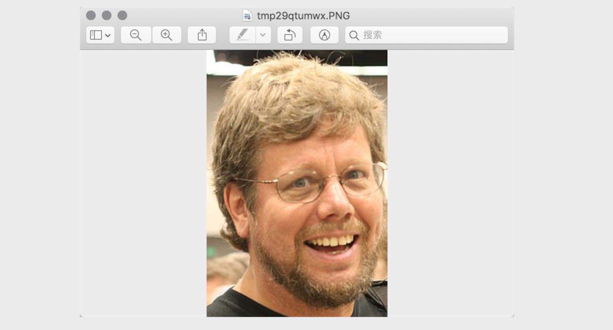

## Image Processing with Python

### Basic Concepts

1. Color. If you have experience painting with pigments, you know that mixing red, yellow, and blue pigments can produce other colors. In fact, these three colors are the primary colors in art -- they cannot be decomposed into more basic colors. In computers, we can combine red, green, and blue light in different proportions to create other colors, making these three the primary colors of light. In computer systems, we typically represent a color as an RGB value or RGBA value (where A stands for Alpha channel, which determines the transparency of the pixel in the image).

   |    Name     |      RGB Value      |     Name     |     RGB Value     |
   | :---------: | :-------------: | :----------: | :-----------: |
   | White | (255, 255, 255) |  Red   |  (255, 0, 0)  |
   | Green |   (0, 255, 0)   |  Blue  |  (0, 0, 255)  |
   | Gray  | (128, 128, 128) | Yellow | (255, 255, 0) |
   | Black |    (0, 0, 0)    | Purple | (128, 0, 128) |

2. Pixels. For an image represented by a sequence of numbers, the smallest unit is a small square of a single color on the image. Each small square has a definite position and an assigned color value. The color and position of these small squares determine the final appearance of the image. They are indivisible units, commonly called pixels. Every image contains a certain number of pixels, and these pixels determine the size of the image as displayed on screen. If you enjoy photography or taking selfies, you should be familiar with the term "pixel."

### Processing Images with Pillow

Pillow is a fork developed from the famous Python image processing library PIL. Through Pillow, you can perform various operations such as image compression and image processing. You can install Pillow using the following command.

```Shell
pip install pillow
```

The most important class in Pillow is `Image`, which can be obtained by using the `open` function of the `Image` module to read an image file and get an `Image` object.

1. Reading and Displaying Images

   ```python
   from PIL import Image

   # Read an image to get an Image object
   image = Image.open('guido.jpg')
   # Get the image format through the Image object's format attribute
   print(image.format) # JPEG
   # Get the image size through the Image object's size attribute
   print(image.size)   # (500, 750)
   # Get the image mode through the Image object's mode attribute
   print(image.mode)   # RGB
   # Display the image through the Image object's show method
   image.show()
   ```

   

2. Cropping Images

   ```python
   # Crop the image by specifying the crop region through the Image object's crop method
   image.crop((80, 20, 310, 360)).show()
   ```

   

3. Generating Thumbnails

   ```python
   # Generate a thumbnail of the specified size through the Image object's thumbnail method
   image.thumbnail((128, 128))
   image.show()
   ```

   

4. Scaling and Pasting Images

   ```python
   # Read Luo Hao's photo to get an Image object
   luohao_image = Image.open('luohao.png')
   # Read Guido's photo to get an Image object
   guido_image = Image.open('guido.jpg')
   # Crop Guido's head from his photo
   guido_head = guido_image.crop((80, 20, 310, 360))
   width, height = guido_head.size
   # Use the Image object's resize method to change the image dimensions
   # Use the Image object's paste method to paste Guido's head onto Luo Hao's photo
   luohao_image.paste(guido_head.resize((int(width / 1.5), int(height / 1.5))), (172, 40))
   luohao_image.show()
   ```

   

5. Rotation and Flipping

   ```python
   image = Image.open('guido.jpg')
   # Use the Image object's rotate method to rotate the image
   image.rotate(45).show()
   # Use the Image object's transpose method to flip the image
   # Image.FLIP_LEFT_RIGHT - horizontal flip
   # Image.FLIP_TOP_BOTTOM - vertical flip
   image.transpose(Image.FLIP_TOP_BOTTOM).show()
   ```

   

6. Manipulating Pixels

   ```python
   for x in range(80, 310):
       for y in range(20, 360):
           # Modify the specified pixel of the image through the Image object's putpixel method
           image.putpixel((x, y), (128, 128, 128))
   image.show()
   ```

   

7. Filter Effects

   ```python
   from PIL import ImageFilter

   # Apply a filter to the image through the Image object's filter method
   # The ImageFilter module contains many preset filters, and custom filters can also be created
   image.filter(ImageFilter.CONTOUR).show()
   ```

   

### Drawing with Pillow

Pillow has a module called `ImageDraw`. The `Draw` function of this module returns an `ImageDraw` object. Through the `ImageDraw` object's `arc`, `line`, `rectangle`, `ellipse`, `polygon`, and other methods, you can draw arcs, lines, rectangles, ellipses, polygons, and other shapes on an image. You can also add text to an image using the object's `text` method.


To draw the image shown above, the complete code is as follows.

```python
import random

from PIL import Image, ImageDraw, ImageFont


def random_color():
    """Generate a random color"""
    red = random.randint(0, 255)
    green = random.randint(0, 255)
    blue = random.randint(0, 255)
    return red, green, blue


width, height = 800, 600
# Create an 800*600 image with a white background
image = Image.new(mode='RGB', size=(width, height), color=(255, 255, 255))
# Create an ImageDraw object
drawer = ImageDraw.Draw(image)
# Get an ImageFont object by specifying the font and size
font = ImageFont.truetype('Kongxin.ttf', 32)
# Draw text using the ImageDraw object's text method
drawer.text((300, 50), 'Hello, world!', fill=(255, 0, 0), font=font)
# Draw two diagonal lines using the ImageDraw object's line method
drawer.line((0, 0, width, height), fill=(0, 0, 255), width=2)
drawer.line((width, 0, 0, height), fill=(0, 0, 255), width=2)
xy = width // 2 - 60, height // 2 - 60, width // 2 + 60, height // 2 + 60
# Draw a rectangle using the ImageDraw object's rectangle method
drawer.rectangle(xy, outline=(255, 0, 0), width=2)
# Draw ellipses using the ImageDraw object's ellipse method
for i in range(4):
    left, top, right, bottom = 150 + i * 120, 220, 310 + i * 120, 380
    drawer.ellipse((left, top, right, bottom), outline=random_color(), width=8)
# Display the image
image.show()
# Save the image
image.save('result.png')
```

> **Note**: The font file used in the code above needs to be prepared by yourself. Choose a font file you like and place it in the code directory.

### Summary

When developing with Python, besides Pillow for image processing, you can also use the more powerful OpenCV library to handle graphics and images. OpenCV (**Open** Source **C**omputer **V**ision Library) is a cross-platform computer vision library that can be used to develop real-time image processing, computer vision, and pattern recognition programs. In our daily work, many tedious and boring tasks can actually be handled by Python programs. The purpose of programming is to let computers help us solve problems and reduce repetitive, tedious labor. Through this chapter's study, you should have experienced the fun of using Python programs to draw and modify images. But what Python can do goes far beyond this -- keep on learning!
