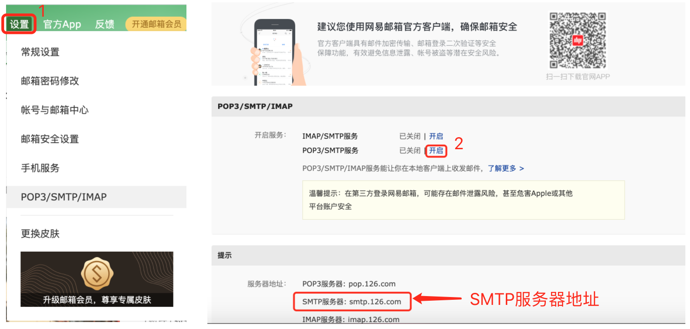
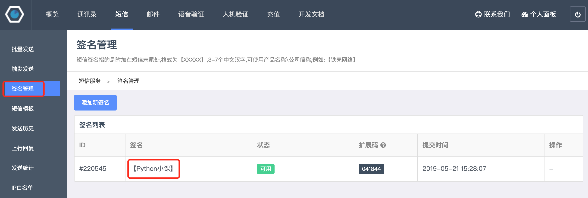

## Sending Emails and SMS with Python

In the previous lessons, we have already taught you how to automatically generate Excel, Word, and PDF documents using Python programs. Now we can take it a step further by sending the generated documents to specified recipients via email, and then notifying them via SMS that we've sent an email. These tasks can also be easily accomplished using Python programs.

### Sending Emails

In today's world of advanced instant messaging software, email remains one of the most widely used applications on the Internet. Companies send job offer letters to applicants, websites send account activation links to users, and banks promote their financial products to customers -- almost all of these are done through email, and these tasks should all be completed automatically by programs.

We can use HTTP (Hypertext Transfer Protocol) to access website resources. HTTP is an application-level protocol built on top of TCP (Transmission Control Protocol). TCP provides reliable data transmission services for many application-level protocols. To send emails, we need to use SMTP (Simple Mail Transfer Protocol), which is also an application-level protocol built on TCP that specifies the details of how an email sender communicates with the mail server. Python simplifies these operations through a module called `smtplib`, which provides an `SMTP_SSL` object. Through this object's `login` and `send_mail` methods, you can complete the email sending operation.

Let's first try sending an extremely simple email that does not contain attachments, images, or other rich text content. Sending an email first requires connecting to a mail server. We can set up our own mail server -- which is not beginner-friendly -- but we can choose to use third-party email services. For example, I have registered an account at <www.126.com>. After logging in successfully, I can enable the SMTP service in the settings, which effectively gives me a mail server. The specific operation is shown below.




You can scan the QR code above with your phone to obtain an authorization code by sending an SMS. After the SMS is sent successfully, click "I have sent" to get the authorization code. The authorization code should be kept safe, because once leaked, someone else could impersonate you to send emails. Next, we can write the code to send emails, as shown below.

```python
import smtplib
from email.header import Header
from email.mime.multipart import MIMEMultipart
from email.mime.text import MIMEText

# Create the email body object
email = MIMEMultipart()
# Set sender, recipients, and subject
email['From'] = 'xxxxxxxxx@126.com'
email['To'] = 'yyyyyy@qq.com;zzzzzz@1000phone.com'
email['Subject'] = Header('First Half Year Work Report', 'utf-8')
# Add email body content
content = """According to German media reports, on the 9th local time, members of the German
Train Drivers' Union voted to hold a nationwide strike starting on the 10th local time.
The freight transport strike began at 7 PM local time on the 10th.
Subsequently, from 2 AM on the 11th to 2 AM on the 13th, a 48-hour strike of
passenger and rail infrastructure will take place nationwide in Germany."""
email.attach(MIMEText(content, 'plain', 'utf-8'))

# Create an SMTP_SSL object (connect to the mail server)
smtp_obj = smtplib.SMTP_SSL('smtp.126.com', 465)
# Log in with username and authorization code
smtp_obj.login('xxxxxxxxx@126.com', 'your_mail_server_authorization_code')
# Send email (sender, recipients, email content as string)
smtp_obj.sendmail(
    'xxxxxxxxx@126.com',
    ['yyyyyy@qq.com', 'zzzzzz@1000phone.com'],
    email.as_string()
)
```

To send an email with attachments, you simply need to encode the attachment content in BASE64, and then it's almost no different from regular text content. BASE64 is a representation method for binary data using 64 printable characters. It is commonly used in situations that require representing, transmitting, or storing binary data, and email is one of them. If you're not familiar with this encoding method, I recommend reading the article [Base64 Notes](http://www.ruanyifeng.com/blog/2008/06/base64.html). As mentioned earlier, Python's standard library `base64` module provides support for BASE64 encoding and decoding.

The following code demonstrates how to send an email with attachments.

```python
import smtplib
from email.header import Header
from email.mime.multipart import MIMEMultipart
from email.mime.text import MIMEText
from urllib.parse import quote

# Create the email body object
email = MIMEMultipart()
# Set sender, recipient, and subject
email['From'] = 'xxxxxxxxx@126.com'
email['To'] = 'zzzzzzzz@1000phone.com'
email['Subject'] = Header('Please find the employment termination certificate attached', 'utf-8')
# Add email body content (HTML formatted content)
content = """<p>Dear former colleague:</p>
<p>The employment termination certificate you requested is in the attachment. Please check!</p>
<br>
<p>Best wishes!</p>
<hr>
<p>Sun Meili, today</p>"""
email.attach(MIMEText(content, 'html', 'utf-8'))
# Read the file to be attached
with open(f'resources/王大锤离职证明.docx', 'rb') as file:
    attachment = MIMEText(file.read(), 'base64', 'utf-8')
    # Specify content type
    attachment['content-type'] = 'application/octet-stream'
    # URL-encode the Chinese filename
    filename = quote('王大锤离职证明.docx')
    # Specify content disposition
    attachment['content-disposition'] = f'attachment; filename="{filename}"'

# Create an SMTP_SSL object (connect to the mail server)
smtp_obj = smtplib.SMTP_SSL('smtp.126.com', 465)
# Log in with username and authorization code
smtp_obj.login('xxxxxxxxx@126.com', 'your_mail_server_authorization_code')
# Send email (sender, recipient, email content as string)
smtp_obj.sendmail(
    'xxxxxxxxx@126.com',
    'zzzzzzzz@1000phone.com',
    email.as_string()
)
```

To make it easier for everyone to send emails with Python, I have encapsulated the code above into a function. When using it, you only need to adjust the mail server domain, port, username, and authorization code.

```python
import smtplib
from email.header import Header
from email.mime.multipart import MIMEMultipart
from email.mime.text import MIMEText
from urllib.parse import quote

# Mail server domain (modify as needed)
EMAIL_HOST = 'smtp.126.com'
# Mail server port (usually 465)
EMAIL_PORT = 465
# Account for logging into the mail server (modify as needed)
EMAIL_USER = 'xxxxxxxxx@126.com'
# Authorization code for SMTP service (modify as needed)
EMAIL_AUTH = 'your_mail_server_authorization_code'


def send_email(*, from_user, to_users, subject='', content='', filenames=[]):
    """Send an email

    :param from_user: Sender
    :param to_users: Recipients, multiple recipients separated by semicolons
    :param subject: Email subject
    :param content: Email body content
    :param filenames: File paths for attachments to send
    """
    email = MIMEMultipart()
    email['From'] = from_user
    email['To'] = to_users
    email['Subject'] = subject

    message = MIMEText(content, 'plain', 'utf-8')
    email.attach(message)
    for filename in filenames:
        with open(filename, 'rb') as file:
            pos = filename.rfind('/')
            display_filename = filename[pos + 1:] if pos >= 0 else filename
            display_filename = quote(display_filename)
            attachment = MIMEText(file.read(), 'base64', 'utf-8')
            attachment['content-type'] = 'application/octet-stream'
            attachment['content-disposition'] = f'attachment; filename="{display_filename}"'
            email.attach(attachment)

    smtp = smtplib.SMTP_SSL(EMAIL_HOST, EMAIL_PORT)
    smtp.login(EMAIL_USER, EMAIL_AUTH)
    smtp.sendmail(from_user, to_users.split(';'), email.as_string())
```

### Sending SMS

Sending SMS is also a common feature in projects. Website registration codes, verification codes, and marketing messages are basically all sent to users via SMS. Sending SMS requires support from a third-party platform. Below, we use the [Luosimao platform](https://luosimao.com/) as an example to introduce how to send SMS with a Python program. We won't go into the details of account registration and purchasing SMS services here -- you can consult the platform's customer service.


Next, we can use the `requests` library to send an HTTP request to the SMS gateway provided by the platform. By passing the recipient's phone number and message content as parameters, we can send an SMS. The code is shown below.

```python
import random

import requests


def send_message_by_luosimao(tel, message):
    """Send SMS (via Luosimao SMS gateway)"""
    resp = requests.post(
        url='http://sms-api.luosimao.com/v1/send.json',
        auth=('api', 'key-your_platform_assigned_key'),
        data={
            'mobile': tel,
            'message': message
        },
        timeout=10,
        verify=False
    )
    return resp.json()


def gen_mobile_code(length=6):
    """Generate a mobile verification code of specified length"""
    return ''.join(random.choices('0123456789', k=length))


def main():
    code = gen_mobile_code()
    message = f'Your SMS verification code is {code}. Never share it with anyone! [Python Class]'
    print(send_message_by_luosimao('13500112233', message))


if __name__ == '__main__':
    main()
```

The request to Luosimao's SMS gateway `http://sms-api.luosimao.com/v1/send.json` will return JSON-formatted data. If it returns `{'error': 0, 'msg': 'OK'}`, the SMS has been sent successfully. If the `error` value is not `0`, you can check the official [developer documentation](https://luosimao.com/docs/api/) to find out what went wrong. Common error types on the Luosimao platform are shown in the figure below.


Currently, most SMS platforms require that SMS content include a signature. The figure below shows the SMS signature "[Python Class]" I configured on the Luosimao platform. For SMS involving sensitive content, you may also need to configure SMS templates in advance. Interested readers can explore this on their own. Generally, to prevent SMS from being misused, platforms will also require setting up an "IP whitelist." If you're unsure how to configure this, you can consult the platform's customer service.



Of course, there are many SMS platforms in China. Readers can choose based on their own needs (typically considering budget, SMS delivery rate, ease of use, and other metrics). If you need to use SMS services in commercial projects, it is recommended to purchase a package plan from an SMS platform.

### Summary

In fact, sending emails, like sending SMS, can also be accomplished by calling third-party services. In actual commercial projects, it is recommended to set up your own mail server or purchase third-party services for sending emails -- this is the more reliable choice.
