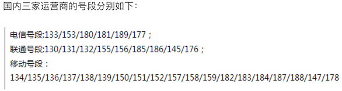

## Regular Expressions

### Regular Expression Basics

When writing programs that process strings, you will often need to find strings that match certain rules within a piece of text. Regular expressions are the tool used to describe these rules. In other words, we can use regular expressions to define string matching patterns -- how to check whether a string has a part that matches a certain pattern, or extract the matching parts from a string, or replace them.

Here's a simple example: if you've ever used file search in Windows and used wildcards (`*` and `?`) when specifying file names, then regular expressions are a similar tool for text matching. The difference is that regular expressions are more powerful than wildcards -- they can describe your needs more precisely. Of course, the trade-off is that writing a regular expression is much more complex than using wildcards, because anything that benefits you comes with a corresponding cost.

Here's another example: suppose we obtain a string from somewhere (perhaps a text file or a piece of online news) and want to find phone numbers and landline numbers within it. We could say that a mobile phone number consists of 11 digits (note: not just any random 11 digits, since you've never seen a mobile number like "25012345678"), and landline numbers follow a pattern like "area code-number." Without regular expressions, completing this task would be quite cumbersome. Computers were originally born for mathematical calculations, processing mostly numerical information. But today, much of the information we handle in daily work is text data. We want computers to be able to recognize and process text that matches certain patterns, which is why regular expressions are so important. Today, almost all programming languages provide support for regular expression operations. Python supports regular expression operations through the `re` module in its standard library.

For knowledge related to regular expressions, you can read a very famous blog post called [Regular Expressions in 30 Minutes](https://deerchao.net/tutorials/regex/regex.htm). After reading this article, you'll be able to understand the table below, which is a concise summary of some basic symbols in regular expressions.

| Symbol         | Explanation                                | Example            | Description                                                  |
| -------------- | ------------------------------------------ | ------------------ | ------------------------------------------------------------ |
| `.`            | Matches any character                      | `b.t`              | Can match bat / but / b#t / b1t, etc.                        |
| `\w`           | Matches letter/digit/underscore            | `b\wt`             | Can match bat / b1t / b_t, etc.<br>But not b#t               |
| `\s`           | Matches whitespace (including \r, \n, \t)  | `love\syou`        | Can match love you                                           |
| `\d`           | Matches a digit                            | `\d\d`             | Can match 01 / 23 / 99, etc.                                 |
| `\b`           | Matches a word boundary                    | `\bThe\b`          |                                                              |
| `^`            | Matches the start of a string              | `^The`             | Can match strings starting with The                          |
| `$`            | Matches the end of a string                | `.exe$`            | Can match strings ending with .exe                           |
| `\W`           | Matches non-letter/digit/underscore        | `b\Wt`             | Can match b#t / b@t, etc.<br>But not but / b1t / b_t         |
| `\S`           | Matches non-whitespace                     | `love\Syou`        | Can match love#you, etc.<br>But not love you                 |
| `\D`           | Matches non-digit                          | `\d\D`             | Can match 9a / 3# / 0F, etc.                                 |
| `\B`           | Matches non-word boundary                  | `\Bio\B`           |                                                              |
| `[]`           | Matches any single character from a set    | `[aeiou]`          | Can match any vowel character                                |
| `[^]`          | Matches any character not in the set       | `[^aeiou]`         | Can match any non-vowel character                            |
| `*`            | Matches 0 or more times                    | `\w*`              |                                                              |
| `+`            | Matches 1 or more times                    | `\w+`              |                                                              |
| `?`            | Matches 0 or 1 time                        | `\w?`              |                                                              |
| `{N}`          | Matches exactly N times                    | `\w{3}`            |                                                              |
| `{M,}`         | Matches at least M times                   | `\w{3,}`           |                                                              |
| `{M,N}`        | Matches at least M and at most N times     | `\w{3,6}`          |                                                              |
| `\|`           | Alternation                                | `foo\|bar`         | Can match foo or bar                                         |
| `(?#)`         | Comment                                    |                    |                                                              |
| `(exp)`        | Matches exp and captures to auto-named group |                  |                                                              |
| `(?<name>exp)` | Matches exp and captures to group named name |                  |                                                              |
| `(?:exp)`      | Matches exp but does not capture           |                    |                                                              |
| `(?=exp)`      | Matches position before exp                | `\b\w+(?=ing)`     | Can match danc in "I'm dancing"                              |
| `(?<=exp)`     | Matches position after exp                 | `(?<=\bdanc)\w+\b` | Can match the first ing in "I love dancing and reading"      |
| `(?!exp)`      | Matches position not followed by exp       |                    |                                                              |
| `(?<!exp)`     | Matches position not preceded by exp       |                    |                                                              |
| `*?`           | Repeat any number of times, but as few as possible | `a.*b`<br>`a.*?b` | When applied to aabab, the former matches the entire string aabab, the latter matches aab and ab |
| `+?`           | Repeat 1 or more times, but as few as possible |                |                                                              |
| `??`           | Repeat 0 or 1 time, but as few as possible |                    |                                                              |
| `{M,N}?`       | Repeat M to N times, but as few as possible |                   |                                                              |
| `{M,}?`        | Repeat M or more times, but as few as possible |                |                                                              |

> **Note:** If the character you want to match is a special character in regular expressions, you can use `\` to escape it. For example, to match a literal period, write `\.`, because writing `.` alone will match any character. Similarly, to match parentheses, you must write `\(` and `\)`, otherwise parentheses are treated as grouping in regular expressions.

### Python's Support for Regular Expressions

Python provides the `re` module to support regular expression operations. Below are the core functions in the `re` module.

| Function                                       | Description                                                  |
| ---------------------------------------------- | ------------------------------------------------------------ |
| `compile(pattern, flags=0)`                    | Compiles a regular expression and returns a regex object     |
| `match(pattern, string, flags=0)`              | Matches a string with a regex, returns a match object on success, otherwise `None` |
| `search(pattern, string, flags=0)`             | Searches for the first occurrence of the regex pattern in a string, returns a match object on success, otherwise `None` |
| `split(pattern, string, maxsplit=0, flags=0)`  | Splits a string using the regex pattern as delimiter, returns a list |
| `sub(pattern, repl, string, count=0, flags=0)` | Replaces patterns matching the regex in the original string with the specified string; `count` can specify the number of replacements |
| `fullmatch(pattern, string, flags=0)`          | Full match version of the `match` function (from start to end of string) |
| `findall(pattern, string, flags=0)`            | Finds all patterns matching the regex in a string, returns a list of strings |
| `finditer(pattern, string, flags=0)`           | Finds all patterns matching the regex in a string, returns an iterator |
| `purge()`                                      | Clears the cache of implicitly compiled regular expressions  |
| `re.I` / `re.IGNORECASE`                       | Case-insensitive matching flag                               |
| `re.M` / `re.MULTILINE`                        | Multi-line matching flag                                     |

> **Note:** The functions in the `re` module mentioned above can also be replaced by methods of the regex object (`Pattern` object) in actual development. If a regular expression needs to be used repeatedly, it is wiser to first compile it using the `compile` function to create a regex object.

Below, we demonstrate how to use regular expressions in Python through a series of examples.

#### Example 1: Validate whether the input username and QQ number are valid and provide corresponding messages.

```python
"""
Requirements: Username must consist of letters, digits, or underscores and be 6-20 characters long.
QQ number must be 5-12 digits and cannot start with 0.
"""
import re

username = input('Please enter username: ')
qq = input('Please enter QQ number: ')
# The first parameter of the match function is a regex string or regex object
# The second parameter is the string to match against
m1 = re.match(r'^[0-9a-zA-Z_]{6,20}$', username)
if not m1:
    print('Please enter a valid username.')
# The fullmatch function requires the string to fully match the regex
# So the regex doesn't need start and end anchors
m2 = re.fullmatch(r'[1-9]\d{4,11}', qq)
if not m2:
    print('Please enter a valid QQ number.')
if m1 and m2:
    print('The information you entered is valid!')
```

> **Tip:** In the regular expressions above, we used "raw strings" (prefixed with `r`). A "raw string" means every character in the string retains its original meaning -- in other words, there are no escape characters in the string. Since regular expressions have many metacharacters and places that need escaping, without raw strings you would need to write backslashes as `\\`. For example, `\d` for matching digits would need to be written as `\\d`, which is not only inconvenient to write but also difficult to read.

#### Example 2: Extract Chinese mobile phone numbers from a text passage.

The image below shows the mobile number segments offered by China's three major carriers as of the end of 2017.



```python
import re

# Create a regex object, using lookahead and lookbehind to ensure no digits before/after the phone number
pattern = re.compile(r'(?<=\D)1[34578]\d{9}(?=\D)')
sentence = '''Important things bear repeating 8130123456789 times. My phone number is 13512346789, a premium number.
It's not 15600998765, nor is it 110 or 119. Wang Dachui's phone number is 15600998765.'''
# Method 1: Find all matches and save to a list
tels_list = re.findall(pattern, sentence)
for tel in tels_list:
    print(tel)
print('--------Fancy Divider--------')

# Method 2: Use an iterator to get match objects and retrieve matched content
for temp in pattern.finditer(sentence):
    print(temp.group())
print('--------Fancy Divider--------')

# Method 3: Use the search function with position specification to find all matches
m = pattern.search(sentence)
while m:
    print(m.group())
    m = pattern.search(sentence, m.end())
```

> **Note:** The regular expression above for matching Chinese mobile numbers is not perfect, because numbers starting with 14 only include 145 or 147, and the regex above doesn't account for this. A better regex for matching Chinese mobile numbers would be: `(?<=\D)(1[38]\d{9}|14[57]\d{8}|15[0-35-9]\d{8}|17[678]\d{8})(?=\D)`. China now seems to have mobile numbers starting with 19 and 16, but those are not considered here for now.

#### Example 3: Replace inappropriate content in strings

```python
import re

sentence = 'Oh, shit! Are you a moron? Fuck you.'
purified = re.sub('fuck|shit|[傻煞沙][比笔逼叉缺吊碉雕]',
                  '*', sentence, flags=re.IGNORECASE)
print(purified)  # Oh, *! Are you a *? * you.
```

> **Note:** The `flags` parameter in the regex-related functions of the `re` module represents the regex matching flags. Through these flags, you can specify whether to ignore case during matching, whether to perform multi-line matching, whether to display debug information, etc. If you need to specify multiple values for the `flags` parameter, you can combine them using the [bitwise OR operator](http://www.runoob.com/python/python-operators.html#ysf5), such as `flags=re.I | re.M`.

#### Example 4: Split long strings

```python
import re

poem = 'Bright moonlight before my bed, I suspect it is frost on the ground. I raise my head to gaze at the bright moon, then lower it, thinking of home.'
sentences_list = re.split(r'[,.]', poem)
sentences_list = [sentence for sentence in sentences_list if sentence]
for sentence in sentences_list:
    print(sentence)
```

### Summary

Regular expressions are truly powerful for string processing and matching. Through the examples above, you should have experienced the charm of regular expressions. Of course, writing a regular expression is not that easy for beginners, but practice makes perfect -- just go ahead and try. There is an online [regular expression testing tool](https://c.runoob.com/front-end/854) that should help you to some degree.
