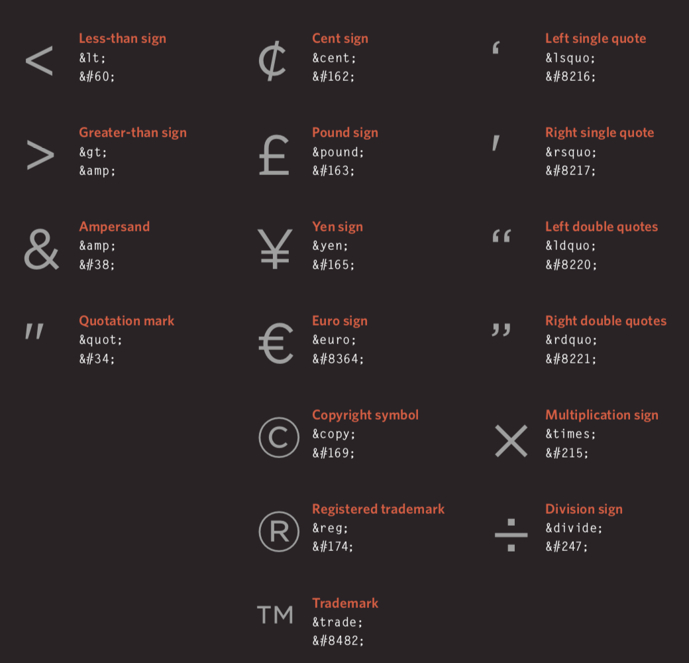
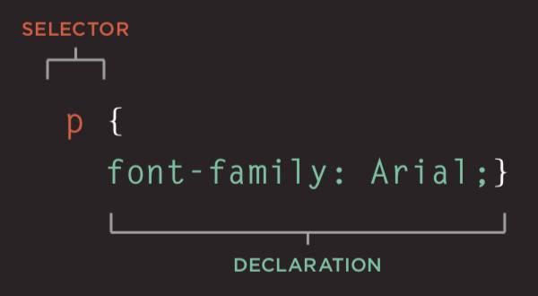
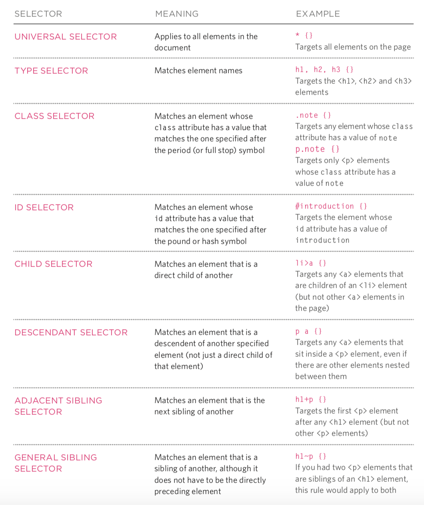
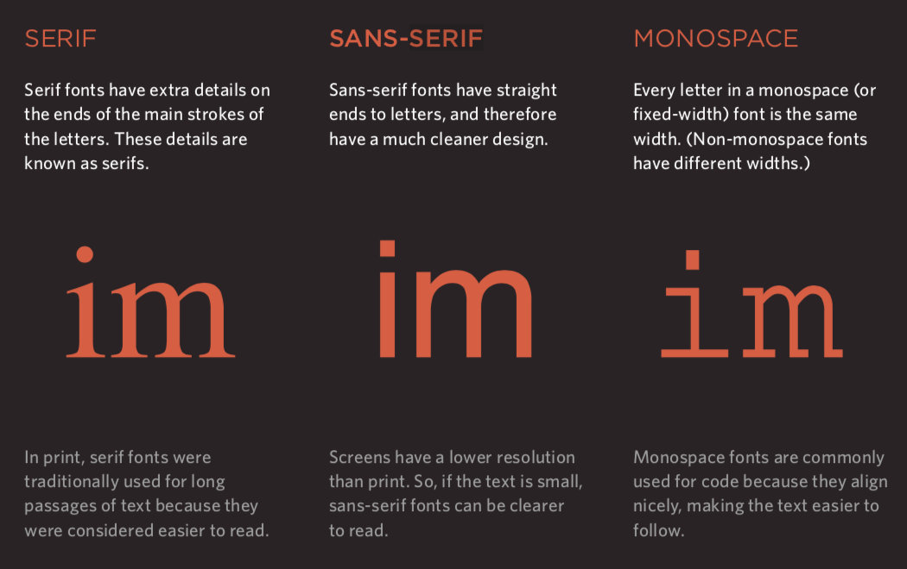
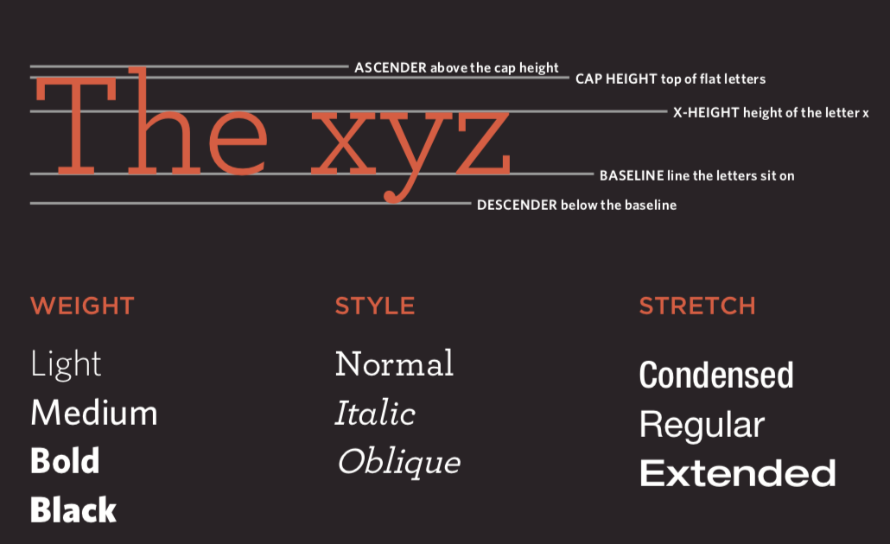
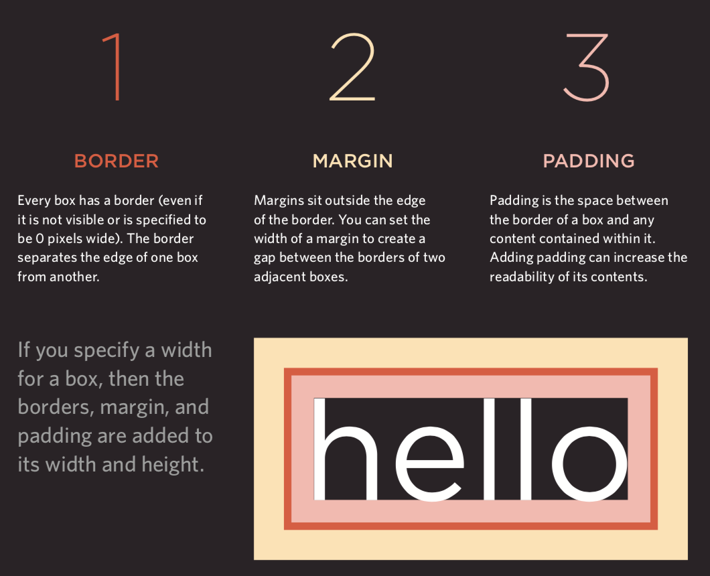

## Web Frontend Overview

> **Note**: Some illustrations used in this article are from *Jon Duckett*'s *[HTML and CSS: Design and Build Websites](https://www.amazon.cn/dp/1118008189/ref=sr_1_5?__mk_zh_CN=%E4%BA%9A%E9%A9%AC%E9%80%8A%E7%BD%91%E7%AB%99&keywords=html+%26+css&qid=1554609325&s=gateway&sr=8-5)*, which is an excellent introductory book on frontend development. Interested readers can find the purchase link on Amazon or other websites.

HTML is a language used to describe web pages. Its full name is Hyper-Text Markup Language. The text, buttons, images, videos, and other elements we see when browsing web pages are all written in HTML and rendered by browsers.

### A Brief History of HTML

1. October 1991: An informal CERN ([European Organization for Nuclear Research](https://zh.wikipedia.org/wiki/%E6%AD%90%E6%B4%B2%E6%A0%B8%E5%AD%90%E7%A0%94%E7%A9%B6%E7%B5%84%E7%B9%94)) document first publicly described 18 HTML tags. The author of this document was physicist [Tim Berners-Lee](https://zh.wikipedia.org/wiki/%E8%92%82%E5%A7%86%C2%B7%E4%BC%AF%E7%BA%B3%E6%96%AF-%E6%9D%8E), who is the inventor of the [World Wide Web](https://zh.wikipedia.org/wiki/%E4%B8%87%E7%BB%B4%E7%BD%91) and the chairman of the [World Wide Web Consortium](https://zh.wikipedia.org/wiki/%E4%B8%87%E7%BB%B4%E7%BD%91%E8%81%94%E7%9B%9F).
2. November 1995: HTML 2.0 standard released (RFC 1866).
3. January 1997: HTML 3.2 released as a [W3C](https://zh.wikipedia.org/wiki/W3C) Recommendation.
4. December 1997: HTML 4.0 released as a W3C Recommendation.
5.  December 1999: HTML 4.01 released as a W3C Recommendation.
6. January 2008: HTML5 published by W3C as a Working Draft.
7. May 2011: W3C advanced HTML5 to the "Last Call" stage.
8. December 2012: W3C designated HTML5 as a "Candidate Recommendation" stage.
9. October 2014: HTML5 released as a stable W3C Recommendation, meaning the standardization of HTML5 was complete.

#### New Features of HTML5

1. Introduced native multimedia support (audio and video tags)
2. Introduced programmable content (canvas tag)
3. Introduced semantic web (article, aside, details, figure, footer, header, nav, section, summary, and other tags)
4. Introduced new form controls (date, email, search, range, etc.)
5. Introduced better support for offline storage (localStorage and sessionStorage)
6. Introduced support for geolocation, drag and drop, WebSocket, background tasks, etc.

### Using Tags to Carry Content


####  Structure

- html
  - head
    - title
    - meta
  - body

#### Text

- Headings and paragraphs
  - h1 ~ h6
  - p
- Superscript and subscript
  - sup
  - sub
- Whitespace (white space collapsing)
- Line break and horizontal ruler
  - br
  - hr
- Semantic tags
  - Bold and emphasis - strong
  - Blockquote - blockquote
  - Abbreviations and acronyms - abbr / acronym
  - Citation - cite
  - Owner contact information - address
  - Content modification - ins / del

#### Lists

 - Ordered list - ol / li
 - Unordered list - ul / li
 - Definition list - dl / dt / dd

#### Links (anchor)

- Page links
- Anchor links
- Functional links

#### Images (image)

- Image storage locations

  

- Images and their dimensions

- Choosing the right image format
  - JPEG
  - GIF
  - PNG

- Vector graphics

- Semantic tags - figure / figcaption

#### Tables (table)

- Basic table structure - table / tr / td / th
- Table caption - caption
- Rowspan and colspan - rowspan attribute / colspan attribute
- Long tables - thead / tbody / tfoot

#### Forms (form)

- Important attributes - action / method / enctype
- Form controls (input) - type attribute
  - Text box - `text` / Password box - `password` / Number box - `number`
  - Email - `email` / Phone - `tel` / Date - `date` / Range - `range` / URL - `url` / Search - `search`
  - Radio button - `radio` / Checkbox - `checkbox`
  - File upload - `file` / Hidden field - `hidden`
  - Submit button - `submit` / Image button - `image`  / Reset button - `reset`
- Dropdown list - select / option
- Text area (multi-line text) - textarea
- Grouping form elements - fieldset / legend

#### Audio and Video (audio / video)

- Video formats and players
- Video hosting services
- Preparation for adding video
- video tag and attributes - autoplay / controls / loop / muted / preload / src
- audio tag and attributes - autoplay / controls / loop / muted / preload / src / width / height / poster

#### Frames (frame)

- Frameset (obsolete, not recommended) - frameset / frame

- Inline frame - iframe

#### Others

- Document type

  ```HTML
  <!doctype html>
  ```

  ```HTML
  <!DOCTYPE HTML PUBLIC "-//W3C//DTD HTML 4.01//EN" "http://www.w3.org/TR/html4/strict.dtd">
  ```

  ```HTML
  <!DOCTYPE HTML PUBLIC "-//W3C//DTD HTML 4.01 Transitional//EN" "http://www.w3.org/TR/html4/loose.dtd">
  ```

- Comments

  ```HTML
  <!-- This is a comment. Comments cannot be nested -->
  ```

- Attributes
  - id: Unique identifier
  - class: The class the element belongs to, used to differentiate elements
  - title: Extra information about the element (tooltip text shown on mouse hover)
  - tabindex: Tab key navigation order
  - contenteditable: Whether the element is editable
  - draggable: Whether the element is draggable

- Block-level elements / Inline elements

- Character entities (entity replacements)

  

### Styling Pages with CSS

#### Introduction

- The role of CSS

- How CSS works

- Rules, properties, and values

  

- Common selectors

  

#### Color

- How to specify colors
- Color terminology and color contrast
- Background color

#### Text (text / font)

- Text size and font family (font-size / font-family)

  

  

- Weight, style, stretch, and decoration (font-weight / font-style / font-stretch / text-decoration)

  

- Line height (line-height), letter spacing (letter-spacing), and word spacing (word-spacing)

- Alignment (text-align) and indentation (text-indent)

- Link styles (:link / :visited / :active / :hover)

- CSS3 new properties
  - Text shadow - text-shadow
  - First letter and first line (:first-letter / :first-line)
  - Responding to users

#### Box Model

- Controlling box dimensions (width / height)

  

- Box border, margin, and padding (border / margin / padding)

  

- Showing and hiding boxes (display / visibility)

- CSS3 new properties
  - Border image (border-image)
  - Box shadow (border-shadow)
  - Rounded corners (border-radius)

#### Lists, Tables, and Forms

- List bullet styles (list-style)
- Table borders and backgrounds (border-collapse)
- Form control appearance
- Form control alignment
- Browser developer tools

#### Images

- Controlling image size (display: inline-block)
- Aligning images
- Background images (background / background-image / background-repeat / background-position)

#### Layout

- Controlling element position (position / z-index)
  - Normal flow
  - Relative positioning
  - Absolute positioning
  - Fixed positioning
  - Floating elements (float / clear)
- Website layout

  - HTML5 layout

    
- Adapting to screen sizes
  - Fixed-width layout
  - Fluid layout
  - Layout grids

### Controlling Behavior with JavaScript

#### JavaScript Basic Syntax

- Statements and comments
- Variables and data types
  - Declaration and assignment
  - Simple data types and complex data types
  - Variable naming rules
- Expressions and operators
  - Assignment operators
  - Arithmetic operators
  - Comparison operators
  - Logical operators: `&&`, `||`, `!`
- Branching structures
  - `if...else...`
  - `switch...cas...default...`
- Loop structures
  - `for` loop
  - `while` loop
  - `do...while` loop
- Arrays
  - Creating arrays
  - Manipulating array elements
- Functions
  - Declaring functions
  - Calling functions
  - Parameters and return values
  - Anonymous functions
  - Immediately invoked function expressions (IIFE)

#### Object-Oriented Programming

 - The concept of objects
 - Creating objects with literal syntax
 - Member access operators
 - Creating objects with constructor syntax
    - `this` keyword
 - Adding and deleting properties
    - `delete` keyword
 - Standard objects
    - `Number` / `String` / `Boolean` / `Symbol` / `Array` / `Function`
    - `Date` / `Error` / `Math` / `RegExp` / `Object` / `Map` / `Set`
    - `JSON` / `Promise` / `Generator` / `Reflect` / `Proxy`

#### BOM

 - Properties and methods of the `window` object
 - `history` object
    - `forward()` / `back()` / `go()`
 - `location` object
 - `navigator` object
 - `screen` object

#### DOM

 - DOM tree
 - Accessing elements
    - `getElementById()` / `querySelector()`
    - `getElementsByClassName()` / `getElementsByTagName()` / `querySelectorAll()`
    - `parentNode` / `previousSibling` / `nextSibling` / `children` / `firstChild` / `lastChild`
- Manipulating elements
  - `nodeValue`
  - `innerHTML` / `textContent` / `createElement()` / `createTextNode()` / `appendChild()` / `insertBefore()` / `removeChild()`
  - `className` / `id` / `hasAttribute()` / `getAttribute()` / `setAttribute()` / `removeAttribute()`
- Event handling
  - Event types
    - UI events: `load` / `unload` / `error` / `resize` / `scroll`
    - Keyboard events: `keydown` / `keyup` / `keypress`
    - Mouse events: `click` / `dbclick` / `mousedown` / `mouseup` / `mousemove` / `mouseover` / `mouseout`
    - Focus events: `focus` / `blur`
    - Form events: `input` / `change` / `submit` / `reset` / `cut` / `copy` / `paste` / `select`
  - Event binding
    - HTML event handlers (not recommended, as tags and code should be separated)
    - Traditional DOM event handlers (can only attach one callback function)
    - Event listeners (not supported in older browsers)
  - Event flow: Event capturing / Event bubbling
  - Event object (window.event in older versions of IE)
    - `target` (some browsers use srcElement)
    - `type`
    - `cancelable`
    - `preventDefault()`
    - `stopPropagation()` (cancelBubble in older versions of IE)
  - Mouse events - Where the event occurred
    - Screen position: `screenX` and `screenY`
    - Page position: `pageX` and `pageY`
    - Client position: `clientX` and `clientY`
  - Keyboard events - Which key was pressed
    - `keyCode` property (some browsers use `which`)
    - `String.fromCharCode(event.keyCode)`
  - HTML5 events
    - `DOMContentLoaded`
    - `hashchange`
    - `beforeunload`

#### JavaScript API

- Client-side storage - `localStorage` and `sessionStorage`

  ```JavaScript
  localStorage.colorSetting = '#a4509b';
  localStorage['colorSetting'] = '#a4509b';
  localStorage.setItem('colorSetting', '#a4509b');
  ```

- Getting location information - `geolocation`

  ```JavaScript
  navigator.geolocation.getCurrentPosition(function(pos) {
      console.log(pos.coords.latitude)
      console.log(pos.coords.longitude)
  })
  ```

- Fetching data from a server - Fetch API
- Drawing graphics - `<canvas>` API
- Audio and video - `<audio>` and `<video>` API

### Frontend Frameworks

#### Progressive Framework - [Vue.js](<https://cn.vuejs.org/>)

The essential framework for frontend-backend separated development (frontend rendering).

##### Quick Start

1. Include the Vue JavaScript file. We still recommend loading it from a CDN server.

   ```HTML
   <script src="https://cdn.jsdelivr.net/npm/vue"></script>
   ```

2. Data binding (declarative rendering).

   ```HTML
   <div id="app">
   	<h1>{{ product }} Inventory Information</h1>
   </div>

   <script src="https://cdn.jsdelivr.net/npm/vue"></script>
   <script>
   	const app = new Vue({
   		el: '#app',
   		data: {
   			product: 'iPhone X'
   		}
   	});
   </script>
   ```

3. Conditionals and loops.

   ```HTML
   <div id="app">
   	<h1>Inventory Information</h1>
       <hr>
   	<ul>
   		<li v-for="product in products">
   			{{ product.name }} - {{ product.quantity }}
   			<span v-if="product.quantity === 0">
   				Sold Out
   			</span>
   		</li>
   	</ul>
   </div>

   <script src="https://cdn.jsdelivr.net/npm/vue"></script>
   <script>
   	const app = new Vue({
   		el: '#app',
   		data: {
   			products: [
   				{"id": 1, "name": "iPhone X", "quantity": 20},
   				{"id": 2, "name": "Huawei Mate20", "quantity": 0},
   				{"id": 3, "name": "Xiaomi Mix3", "quantity": 50}
   			]
   		}
   	});
   </script>
   ```

4. Computed properties.

   ```HTML
   <div id="app">
   	<h1>Inventory Information</h1>
   	<hr>
   	<ul>
   		<li v-for="product in products">
   			{{ product.name }} - {{ product.quantity }}
   			<span v-if="product.quantity === 0">
   				Sold Out
   			</span>
   		</li>
   	</ul>
   	<h2>Total Inventory: {{ totalQuantity }} units</h2>
   </div>

   <script src="https://cdn.jsdelivr.net/npm/vue"></script>
   <script>
   	const app = new Vue({
   		el: '#app',
   		data: {
   			products: [
   				{"id": 1, "name": "iPhone X", "quantity": 20},
   				{"id": 2, "name": "Huawei Mate20", "quantity": 0},
   				{"id": 3, "name": "Xiaomi Mix3", "quantity": 50}
   			]
   		},
   		computed: {
   			totalQuantity() {
   				return this.products.reduce((sum, product) => {
   					return sum + product.quantity
   				}, 0);
   			}
   		}
   	});
   </script>
   ```

5. Handling events.

   ```HTML
   <div id="app">
   	<h1>Inventory Information</h1>
   	<hr>
   	<ul>
   		<li v-for="product in products">
   			{{ product.name }} - {{ product.quantity }}
   			<span v-if="product.quantity === 0">
   				Sold Out
   			</span>
   			<button @click="product.quantity += 1">
   				Add Stock
   			</button>
   		</li>
   	</ul>
   	<h2>Total Inventory: {{ totalQuantity }} units</h2>
   </div>

   <script src="https://cdn.jsdelivr.net/npm/vue"></script>
   <script>
   	const app = new Vue({
   		el: '#app',
   		data: {
   			products: [
   				{"id": 1, "name": "iPhone X", "quantity": 20},
   				{"id": 2, "name": "Huawei Mate20", "quantity": 0},
   				{"id": 3, "name": "Xiaomi Mix3", "quantity": 50}
   			]
   		},
   		computed: {
   			totalQuantity() {
   				return this.products.reduce((sum, product) => {
   					return sum + product.quantity
   				}, 0);
   			}
   		}
   	});
   </script>
   ```

6. User input.

   ```HTML
   <div id="app">
   	<h1>Inventory Information</h1>
   	<hr>
   	<ul>
   		<li v-for="product in products">
   			{{ product.name }} -
   			<input type="number" v-model.number="product.quantity" min="0">
   			<span v-if="product.quantity === 0">
   				Sold Out
   			</span>
   			<button @click="product.quantity += 1">
   				Add Stock
   			</button>
   		</li>
   	</ul>
   	<h2>Total Inventory: {{ totalQuantity }} units</h2>
   </div>

   <script src="https://cdn.jsdelivr.net/npm/vue"></script>
   <script>
   	const app = new Vue({
   		el: '#app',
   		data: {
   			products: [
   				{"id": 1, "name": "iPhone X", "quantity": 20},
   				{"id": 2, "name": "Huawei Mate20", "quantity": 0},
   				{"id": 3, "name": "Xiaomi Mix3", "quantity": 50}
   			]
   		},
   		computed: {
   			totalQuantity() {
   				return this.products.reduce((sum, product) => {
   					return sum + product.quantity
   				}, 0);
   			}
   		}
   	});
   </script>
   ```

7. Loading JSON data over the network.

   ```HTML
   <div id="app">
   	<h2>Inventory Information</h2>
   	<ul>
   		<li v-for="product in products">
   			{{ product.name }} - {{ product.quantity }}
   			<span v-if="product.quantity === 0">
   				Sold Out
   			</span>
   		</li>
   	</ul>
   </div>

   <script src="https://cdn.jsdelivr.net/npm/vue"></script>
   <script>
   	const app = new Vue({
   		el: '#app',
   		data: {
   			products: []
   		}，
   		created() {
   			fetch('https://jackfrued.top/api/products')
   				.then(response => response.json())
   				.then(json => {
   					this.products = json
   				});
   		}
   	});
   </script>
   ```

##### Using Scaffolding - vue-cli

Vue provides a very convenient scaffolding tool called vue-cli for commercial project development. With this tool, you can skip the manual configuration of development, testing, and production environments, allowing developers to focus only on solving the problem at hand.

1. Install the scaffolding.
2. Create a project.
3. Install dependencies.
4. Run the project.


#### UI Framework - [Element](<http://element-cn.eleme.io/#/zh-CN>)

A desktop component library based on Vue 2.0 for building user interfaces, with responsive layout support.

1. Include the Element CSS and JavaScript files.

   ```HTML
   <!-- Include styles -->
   <link rel="stylesheet" href="https://unpkg.com/element-ui/lib/theme-chalk/index.css">
   <!-- Include component library -->
   <script src="https://unpkg.com/element-ui/lib/index.js"></script>
   ```

2. A simple example.

   ```HTML
   <!DOCTYPE html>
   <html>
   	<head>
   		<meta charset="UTF-8">
   		<link rel="stylesheet" href="https://unpkg.com/element-ui/lib/theme-chalk/index.css">
   	</head>
   	<body>
   		<div id="app">
   			<el-button @click="visible = true">Click Me</el-button>
   			<el-dialog :visible.sync="visible" title="Hello world">
   				<p>Start using Element</p>
   			</el-dialog>
               </div>
   	</body>
   	<script src="https://unpkg.com/vue/dist/vue.js"></script>
   	<script src="https://unpkg.com/element-ui/lib/index.js"></script>
   	<script>
   		new Vue({
   			el: '#app',
   			data: {
   				visible: false,
   			}
   		})
   	</script>
   </html>
   ```

3. Using components.

   ```HTML
   <!DOCTYPE html>
   <html>
   	<head>
   		<meta charset="UTF-8">
   		<link rel="stylesheet" href="https://unpkg.com/element-ui/lib/theme-chalk/index.css">
   	</head>
   	<body>
   		<div id="app">
   			<el-table :data="tableData" stripe style="width: 100%">
   				<el-table-column prop="date" label="Date" width="180">
   				</el-table-column>
   				<el-table-column prop="name" label="Name" width="180">
   				</el-table-column>
   				<el-table-column prop="address" label="Address">
   				</el-table-column>
   			</el-table>
   		</div>
   	</body>
   	<script src="https://unpkg.com/vue/dist/vue.js"></script>
   	<script src="https://unpkg.com/element-ui/lib/index.js"></script>
   	<script>
   		new Vue({
   			el: '#app',
   			data: {
   				tableData:  [
   					{
   						date: '2016-05-02',
   						name: 'Wang Yiba',
   						address: '1518 Jinshajiang Road, Putuo District, Shanghai'
   					},
   					{
   						date: '2016-05-04',
   						name: 'Liu Ergou',
   						address: '1517 Jinshajiang Road, Putuo District, Shanghai'
   					},
   					{
   						date: '2016-05-01',
   						name: 'Yang Sanmeng',
   						address: '1519 Jinshajiang Road, Putuo District, Shanghai'
   					},
   					{
   						date: '2016-05-03',
   						name: 'Chen Sichui',
   						address: '1516 Jinshajiang Road, Putuo District, Shanghai'
   					}
   				]
   			}
   		})
   	</script>
   </html>
   ```


#### Charting Framework - [ECharts](<https://echarts.baidu.com>)

An open-source visualization library by Baidu, commonly used to generate various types of charts.


#### Flexbox-based CSS Framework - [Bulma](<https://bulma.io/>)

Bulma is a modern CSS framework based on Flexbox. Its original design philosophy is Mobile First with a modular design, making it easy to implement various simple or complex content layouts. Even developers who are not familiar with CSS can use it to create beautiful pages.

```HTML
<!DOCTYPE html>
<html lang="en">
<head>
	<meta charset="UTF-8">
	<title>Bulma</title>
	<link href="https://cdn.bootcss.com/bulma/0.7.4/css/bulma.min.css" rel="stylesheet">
	<style type="text/css">
		div { margin-top: 10px; }
		.column { color: #fff; background-color: #063; margin: 10px 10px; text-align: center; }
	</style>
</head>
<body>
	<div class="columns">
		<div class="column">1</div>
		<div class="column">2</div>
		<div class="column">3</div>
		<div class="column">4</div>
	</div>
	<div>
		<a class="button is-primary">Primary</a>
		<a class="button is-link">Link</a>
		<a class="button is-info">Info</a>
		<a class="button is-success">Success</a>
		<a class="button is-warning">Warning</a>
		<a class="button is-danger">Danger</a>
	</div>
	<div>
		<progress class="progress is-danger is-medium" max="100">60%</progress>
	</div>
	<div>
		<table class="table is-hoverable">
			<tr>
				<th>One</th>
				<th>Two</th>
			</tr>
			<tr>
				<td>Three</td>
				<td>Four</td>
			</tr>
			<tr>
				<td>Five</td>
				<td>Six</td>
			</tr>
			<tr>
				<td>Seven</td>
				<td>Eight</td>
			</tr>
			<tr>
				<td>Nine</td>
				<td>Ten</td>
			</tr>
			<tr>
				<td>Eleven</td>
				<td>Twelve</td>
			</tr>
		</table>
	</div>
</body>
</html>
```

#### Responsive Layout Framework - [Bootstrap](<http://www.bootcss.com/>)

A frontend framework for rapid web application development with responsive layout support.

1. Features
   - Supports major browsers and mobile devices
   - Easy to get started
   - Responsive design

2. Contents
   - Grid system
   - Encapsulated CSS
   - Ready-made components
   - JavaScript plugins

3. Visual Builder

   
