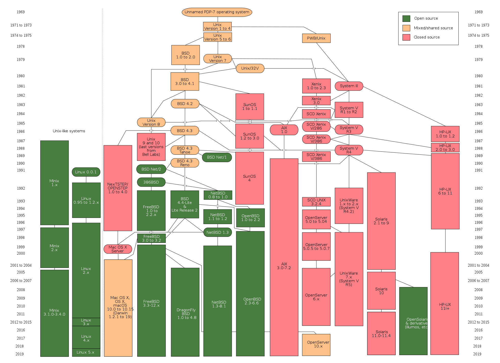
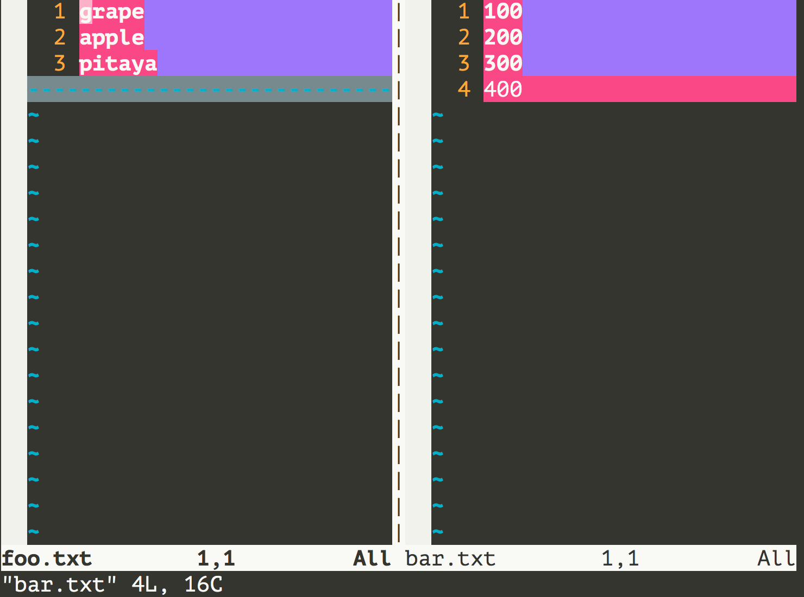

Mastering the Linux Operating System

> **Note**: The Linux command explanations in this article are based on the CentOS Linux distribution. I personally use an Alibaba Cloud server with CentOS Linux release 7.6.1810. There are some differences in shell commands and utilities across different Linux distributions, but these differences are minimal.

### History of Operating Systems

A computer system with only hardware and no software is called a "bare machine." It is very difficult to use a "bare machine" for everyday computing tasks (such as storage and computation), so specific software is needed to control the hardware. The software closest to the computer hardware is system software, and the most important one is the "operating system." An operating system is a collection of programs that controls and manages all computer hardware and software resources, implements resource allocation and task scheduling, and provides interfaces and environments for system users and other software.

#### No Operating System (Manual Operation)

In the early days when computers had no operating systems, people first loaded the program tape (or cards) onto the computer, then started the input device to feed the program into the computer, and used console switches to start the program. When the program finished executing, the printer would output the results, and the user would unload and take away the tape (or cards). The second user would then get on the machine and repeat the same steps. Throughout this process, the user had exclusive use of the machine, the CPU waited for manual operations, and resource utilization was extremely low.

#### Batch Processing Systems

First, a supervisor program was started on the computer. Under the control of the supervisor program, the computer could automatically process one or more users' jobs in batches. After completing a batch of jobs, the supervisor program would read more jobs from the input device and store them on tape. The tasks were processed by repeating the above steps. The supervisor program continuously processed jobs, achieving automatic job transition, reducing job setup time and manual operation time, and improving computer resource utilization. Batch processing systems can be further classified into single-stream batch processing, multi-stream batch processing, online batch processing, and offline batch processing systems.

#### Time-Sharing and Real-Time Systems

A time-sharing system divides the processor's running time into very short time slices and allocates the processor to each online job in a round-robin fashion. If a job cannot complete its computation within its allocated time slice, the job is temporarily interrupted, the processor is given to another job, and the first job waits for the next scheduling cycle to continue. Because computers are very fast and job rotation is rapid, each user feels as if they have exclusive use of the computer. Each user can issue various operational commands to the system through their terminal and complete job execution with full human-computer interaction. To address the inability of time-sharing systems to respond to user instructions promptly, real-time systems emerged, which can complete event processing within strict time constraints and respond to random external events promptly.

#### General-Purpose Operating Systems

1. 1960s: IBM's System/360 series machines had a unified operating system, OS/360.

2. 1965: AT&T's Bell Labs joined the GE and MIT collaboration to develop MULTICS.

3. 1969: The MULTICS project failed. Ken Thompson, being idle at home, developed Unics in assembly language on the already obsolete PDP-7 to play the "Space Travel" game.

   > Note: It's hard to imagine that Unix, such a great operating system, was developed by an idle programmer (whose wife had even gone back to her parents' home with the children) on an obsolete device just to play a game.

4. 1970-1971: Ken Thompson and Dennis Ritchie rewrote Unics in B language on the PDP-11, and at the suggestion of Brian Kernighan, renamed it to Unix.

   

5. 1972-1973: Dennis Ritchie invented the C language to replace the less portable B language, and began the work of rewriting Unix in C.

6. 1974: Unix released its milestone fifth edition, almost entirely implemented in C.

7. 1979: Starting from Unix seventh edition, AT&T released new licensing terms, making Unix proprietary.

8. 1987: Professor Andrew S. Tanenbaum, in order to teach students the details of operating system internals in his classes, decided to develop a Unix-compatible operating system from scratch without using any AT&T source code to avoid copyright disputes. The system was named Minix.

   

9. 1991: While studying at the University of Helsinki in Finland, Linus Torvalds attempted to do some development work on Minix. However, since Minix was only an educational operating system and was not very powerful, Linus wrote a disk driver and file system to conveniently read, write, and download files in the school's newsgroup and mail systems. These components formed the embryo of the Linux kernel.

   

The following diagram shows the family tree of Unix operating systems.



### Linux Overview

Linux is a general-purpose operating system. An operating system is responsible for task scheduling, memory allocation, handling peripheral I/O, and other operations. An operating system typically consists of a kernel (the core program that runs other programs and manages hardware devices like disks and printers) and system programs (device drivers, low-level libraries, shell, service programs, etc.).

The Linux kernel was developed by Finnish programmer Linus Torvalds and was released in September 1991. As a product of the Internet era, the Linux operating system was collaboratively developed by many developers worldwide. It is a free operating system (note that "free" and "gratis" are not the same concept; to understand the difference, you can [click here](https://www.debian.org/intro/free)).

### Advantages of Linux

1. A general-purpose operating system, not tied to specific hardware.
2. Written in C, highly portable, with kernel programming interfaces.
3. Supports multiple users and multitasking, with a secure hierarchical file system.
4. A large number of utility programs, comprehensive networking capabilities, and strong documentation support.
5. Reliable security and good stability, more developer-friendly.

### Linux Distributions

1. [Redhat](https://www.redhat.com/en)
2. [Ubuntu](https://www.ubuntu.com/)
3. [CentOS](https://www.centos.org/)
4. [Fedora](https://getfedora.org/)
5. [Debian](https://www.debian.org/)
6. [openSUSE](https://www.opensuse.org/)

### Basic Commands

Linux system commands typically follow this format:

```Shell
command_name [command_parameters] [command_objects]
```

1. Get login information - **w** / **who** / **last**/ **lastb**.

   ```Shell
   [root ~]# w
    23:31:16 up 12:16,  2 users,  load average: 0.00, 0.01, 0.05
   USER     TTY      FROM             LOGIN@   IDLE   JCPU   PCPU WHAT
   root     pts/0    182.139.66.250   23:03    4.00s  0.02s  0.00s w
   jackfrue pts/1    182.139.66.250   23:26    3:56   0.00s  0.00s -bash
   [root ~]# who
   root     pts/0        2018-04-12 23:03 (182.139.66.250)
   jackfrued pts/1        2018-04-12 23:26 (182.139.66.250)
   [root ~]# who am i
   root     pts/0        2018-04-12 23:03 (182.139.66.250)
   [root ~]# who mom likes
   root     pts/0        2018-04-12 23:03 (182.139.66.250)
   [root ~]# last
   root     pts/0        117.136.63.184   Sun May 26 18:57   still logged in
   reboot   system boot  3.10.0-957.10.1. Mon May 27 02:52 - 19:10  (-7:-42)
   root     pts/4        117.136.63.184   Sun May 26 18:51 - crash  (08:01)
   root     pts/4        117.136.63.184   Sun May 26 18:49 - 18:49  (00:00)
   root     pts/3        117.136.63.183   Sun May 26 18:35 - crash  (08:17)
   root     pts/2        117.136.63.183   Sun May 26 18:34 - crash  (08:17)
   root     pts/0        117.136.63.183   Sun May 26 18:10 - crash  (08:42)
   ```

2. Check which Shell you are using - **ps**.

   Shell is also known as the "shell program." It acts as an interpreter between the user and the operating system kernel -- simply put, it is the interface for human-computer interaction. Most Linux systems currently default to bash (<u>B</u>ourne <u>A</u>gain <u>SH</u>ell), because it supports tab completion for commands and paths, saves command history, allows easy configuration of environment variables, and supports batch operations.

   ```Shell
   [root ~]# ps
     PID TTY          TIME CMD
    3531 pts/0    00:00:00 bash
    3553 pts/0    00:00:00 ps
   ```

3. View command descriptions and locations - **whatis** / **which** / **whereis**.

   ```Shell
   [root ~]# whatis ps
   ps (1)        - report a snapshot of the current processes.
   [root ~]# whatis python
   python (1)    - an interpreted, interactive, object-oriented programming language
   [root ~]# whereis ps
   ps: /usr/bin/ps /usr/share/man/man1/ps.1.gz
   [root ~]# whereis python
   python: /usr/bin/python /usr/bin/python2.7 /usr/lib/python2.7 /usr/lib64/python2.7 /etc/python /usr/include/python2.7 /usr/share/man/man1/python.1.gz
   [root ~]# which ps
   /usr/bin/ps
   [root ~]# which python
   /usr/bin/python
   ```

4. Clear the screen - **clear**.

5. View help documentation - **man** / **info** / **--help** / **apropos**.
   ```Shell
   [root@izwz97tbgo9lkabnat2lo8z ~]# ps --help
   Usage:
    ps [options]
    Try 'ps --help <simple|list|output|threads|misc|all>'
     or 'ps --help <s|l|o|t|m|a>'
    for additional help text.
   For more details see ps(1).
   [root@izwz97tbgo9lkabnat2lo8z ~]# man ps
   PS(1)                                User Commands                                PS(1)
   NAME
          ps - report a snapshot of the current processes.
   SYNOPSIS
          ps [options]
   DESCRIPTION
   ...
   ```

6. View system and hostname - **uname** / **hostname**.

   ```Shell
   [root@izwz97tbgo9lkabnat2lo8z ~]# uname
   Linux
   [root@izwz97tbgo9lkabnat2lo8z ~]# hostname
   izwz97tbgo9lkabnat2lo8z
   [root@iZwz97tbgo9lkabnat2lo8Z ~]# cat /etc/centos-release
   CentOS Linux release 7.6.1810 (Core)
   ```

   > Note: `cat` is a command that concatenates file contents and prints them to standard output, which will be covered later. `/etc` is a very important directory on Linux systems that stores many configuration files. `centos-release` is a file in that directory. Since the Linux distribution I use is CentOS 7.6, such a file exists here.

7. Time and date - **date** / **cal**.

   ```Shell
   [root@iZwz97tbgo9lkabnat2lo8Z ~]# date
   Wed Jun 20 12:53:19 CST 2018
   [root@iZwz97tbgo9lkabnat2lo8Z ~]# cal
         June 2018
   Su Mo Tu We Th Fr Sa
                   1  2
    3  4  5  6  7  8  9
   10 11 12 13 14 15 16
   17 18 19 20 21 22 23
   24 25 26 27 28 29 30
   [root@iZwz97tbgo9lkabnat2lo8Z ~]# cal 5 2017
         May 2017
   Su Mo Tu We Th Fr Sa
       1  2  3  4  5  6
    7  8  9 10 11 12 13
   14 15 16 17 18 19 20
   21 22 23 24 25 26 27
   28 29 30 31
   ```

8. Restart and shutdown - **reboot** / **shutdown**.

   ```Shell
   [root ~]# shutdown -h +5
   Shutdown scheduled for Sun 2019-05-26 19:34:27 CST, use 'shutdown -c' to cancel.
   [root ~]#
   Broadcast message from root (Sun 2019-05-26 19:29:27 CST):

   The system is going down for power-off at Sun 2019-05-26 19:34:27 CST!
   [root ~]# shutdown -c

   Broadcast message from root (Sun 2019-05-26 19:30:22 CST):

   The system shutdown has been cancelled at Sun 2019-05-26 19:31:22 CST!
   [root ~]# shutdown -r 23:58
   Shutdown scheduled for Sun 2019-05-26 23:58:00 CST, use 'shutdown -c' to cancel.
   [root ~]# shutdown -c

   Broadcast message from root (Sun 2019-05-26 19:31:06 CST):

   The system shutdown has been cancelled at Sun 2019-05-26 19:32:06 CST!
   ```

   > Note: When executing the `shutdown` command, a warning is sent to logged-in users. You can append a custom warning message after the command to replace the default warning message, or use `now` after the `-h` parameter to shut down immediately.

9. Logout -  **exit** / **logout**.

10. View command history - **history**.

  ```Shell
  [root@iZwz97tbgo9lkabnat2lo8Z ~]# history
  ...
  452  ls
  453  cd Python-3.6.5/
  454  clear
  455  history
  [root@iZwz97tbgo9lkabnat2lo8Z ~]# !454
  ```

  > **Note**: After viewing the command history, you can use `!history_command_number` to re-execute that command. You can clear the history with `history -c`.

### Utilities

#### File and Directory Operations

1. Create/delete empty directories - **mkdir** / **rmdir**.

   ```Shell
   [root ~]# mkdir abc
   [root ~]# mkdir -p xyz/abc
   [root ~]# rmdir abc
   ```

2. Create/delete files - **touch** / **rm**.

   ```Shell
   [root ~]# touch readme.txt
   [root ~]# touch error.txt
   [root ~]# rm error.txt
   rm: remove regular empty file 'error.txt'? y
   [root ~]# rm -rf xyz
   ```

   - The `touch` command is used to create empty files or modify file timestamps. In Linux, a file has three types of timestamps:
     - Content modification time - mtime.
     - Permission change time - ctime.
     - Last access time - atime.
   - Important parameters for `rm`:
     - `-i`: Interactive deletion, prompting for each item.
     - `-r`: Delete directories and recursively delete files and directories within.
     - `-f`: Force deletion, ignoring nonexistent files with no prompts.

3. Change and view current working directory - **cd** / **pwd**.

   > Note: The `cd` command can be followed by a relative path (relative to the current path) or an absolute path (starting with `/`) to switch to the specified directory. You can also use `cd ..` to return to the parent directory. Think about it -- if you want to go up two levels, what parameter should you pass to the `cd` command?

4. List directory contents - **ls**.

   - `-l`: View files and directories in long format.
   - `-a`: Show files and directories starting with a dot (hidden files).
   - `-R`: Recursively expand directories (continue listing files and directories within).
   - `-d`: List only directories, not their contents.
   - `-S` / `-t`: Sort by size/time.

5. View file contents - **cat** / **tac** / **head** / **tail** / **more** / **less** / **rev** / **od**.

   ```Shell
   [root ~]# wget http://www.sohu.com/ -O sohu.html
   --2018-06-20 18:42:34--  http://www.sohu.com/
   Resolving www.sohu.com (www.sohu.com)... 14.18.240.6
   Connecting to www.sohu.com (www.sohu.com)|14.18.240.6|:80... connected.
   HTTP request sent, awaiting response... 200 OK
   Length: 212527 (208K) [text/html]
   Saving to: 'sohu.html'
   100%[==================================================>] 212,527     --.-K/s   in 0.03s
   2018-06-20 18:42:34 (7.48 MB/s) - 'sohu.html' saved [212527/212527]
   [root ~]# cat sohu.html
   ...
   [root ~]# head -10 sohu.html
   <!DOCTYPE html>
   <html>
   <head>
   <title>搜狐</title>
   <meta name="Keywords" content="搜狐,门户网站,新媒体,网络媒体,新闻,财经,体育,娱乐,时尚,汽车,房产,科技,图片,论坛,微博,博客,视频,电影,电视剧"/>
   <meta name="Description" content="搜狐网为用户提供24小时不间断的最新资讯，及搜索、邮件等网络服务。内容包括全球热点事件、突发新闻、时事评论、热播影视剧、体育赛事、行业动态、生活服务信息，以及论坛、博客、微博、我的搜狐等互动空间。" />
   <meta name="shenma-site-verification" content="1237e4d02a3d8d73e96cbd97b699e9c3_1504254750">
   <meta charset="utf-8"/>
   <meta http-equiv="X-UA-Compatible" content="IE=Edge,chrome=1"/>
   [root ~]# tail -2 sohu.html
   </body>
   </html>
   [root ~]# less sohu.html
   ...
   [root ~]# cat -n sohu.html | more
   ...
   ```

   > **Note**: The `wget` command used above is a network downloader that can download resources from a specified URL.

6. Copy/move files - **cp** / **mv**.

   ```Shell
   [root ~]# mkdir backup
   [root ~]# cp sohu.html backup/
   [root ~]# cd backup
   [root backup]# ls
   sohu.html
   [root backup]# mv sohu.html sohu_index.html
   [root backup]# ls
   sohu_index.html
   ```

7. Rename files - **rename**.

  ```Shell
  [root@iZwz97tbgo9lkabnat2lo8Z ~]# rename .htm .html *.htm
  ```

8. Find files and search content - **find** / **grep**.

   ```Shell
   [root@iZwz97tbgo9lkabnat2lo8Z ~]# find / -name "*.html"
   /root/sohu.html
   /root/backup/sohu_index.html
   [root@izwz97tbgo9lkabnat2lo8z ~]# find . -atime 7 -type f -print
   [root@izwz97tbgo9lkabnat2lo8z ~]# find . -type f -size +2k
   [root@izwz97tbgo9lkabnat2lo8z ~]# find . -type f -name "*.swp" -delete
   [root@iZwz97tbgo9lkabnat2lo8Z ~]# grep "<script>" sohu.html -n
   20:<script>
   [root@iZwz97tbgo9lkabnat2lo8Z ~]# grep -E \<\/?script.*\> sohu.html -n
   20:<script>
   22:</script>
   24:<script src="//statics.itc.cn/web/v3/static/js/es5-shim-08e41cfc3e.min.js"></script>
   25:<script src="//statics.itc.cn/web/v3/static/js/es5-sham-1d5fa1124b.min.js"></script>
   26:<script src="//statics.itc.cn/web/v3/static/js/html5shiv-21fc8c2ba6.js"></script>
   29:<script type="text/javascript">
   52:</script>
   ...
   ```
   > **Note**: `grep` supports regular expressions when searching strings. If you need to use regular expressions, you can use `grep -E` or directly use `egrep`.

9. Create and view links - **ln** / **readlink**.

   ```Shell
   [root@iZwz97tbgo9lkabnat2lo8Z ~]# ls -l sohu.html
   -rw-r--r-- 1 root root 212131 Jun 20 19:15 sohu.html
   [root@iZwz97tbgo9lkabnat2lo8Z ~]# ln /root/sohu.html /root/backup/sohu_backup
   [root@iZwz97tbgo9lkabnat2lo8Z ~]# ls -l sohu.html
   -rw-r--r-- 2 root root 212131 Jun 20 19:15 sohu.html
   [root@iZwz97tbgo9lkabnat2lo8Z ~]# ln /root/sohu.html /root/backup/sohu_backup2
   [root@iZwz97tbgo9lkabnat2lo8Z ~]# ls -l sohu.html
   -rw-r--r-- 3 root root 212131 Jun 20 19:15 sohu.html
   [root@iZwz97tbgo9lkabnat2lo8Z ~]# ln -s /etc/centos-release sysinfo
   [root@iZwz97tbgo9lkabnat2lo8Z ~]# ls -l sysinfo
   lrwxrwxrwx 1 root root 19 Jun 20 19:21 sysinfo -> /etc/centos-release
   [root@iZwz97tbgo9lkabnat2lo8Z ~]# cat sysinfo
   CentOS Linux release 7.4.1708 (Core)
   [root@iZwz97tbgo9lkabnat2lo8Z ~]# cat /etc/centos-release
   CentOS Linux release 7.4.1708 (Core)
   ```

   > **Note**: Links can be divided into hard links and soft links (symbolic links). A hard link can be thought of as a pointer to the file's data, similar to Python's reference counting for objects. Each time a hard link is added, the file's link count increases by 1. Only when the link count reaches 0 can the file's storage space be overwritten by other files. When we normally delete a file, we are not actually deleting the data on the hard drive -- we are only deleting a pointer, or a usage record of the data. This is why software like "file shredders" not only delete the file pointer but also fill the file's storage area with data to ensure the file cannot be recovered. Soft links are similar to shortcuts in Windows. When the file that a soft link points to is deleted, the soft link becomes invalid.

10. Compress/decompress and archive/unarchive - **gzip** / **gunzip** / **xz**.

  ```Shell
  [root@iZwz97tbgo9lkabnat2lo8Z ~]# wget http://download.redis.io/releases/redis-4.0.10.tar.gz
  --2018-06-20 19:29:59--  http://download.redis.io/releases/redis-4.0.10.tar.gz
  Resolving download.redis.io (download.redis.io)... 109.74.203.151
  Connecting to download.redis.io (download.redis.io)|109.74.203.151|:80... connected.
  HTTP request sent, awaiting response... 200 OK
  Length: 1738465 (1.7M) [application/x-gzip]
  Saving to: 'redis-4.0.10.tar.gz'
  100%[==================================================>] 1,738,465   70.1KB/s   in 74s
  2018-06-20 19:31:14 (22.9 KB/s) - 'redis-4.0.10.tar.gz' saved [1738465/1738465]
  [root@iZwz97tbgo9lkabnat2lo8Z ~]# ls redis*
  redis-4.0.10.tar.gz
  [root@iZwz97tbgo9lkabnat2lo8Z ~]# gunzip redis-4.0.10.tar.gz
  [root@iZwz97tbgo9lkabnat2lo8Z ~]# ls redis*
  redis-4.0.10.tar
  ```

11. Archive and unarchive - **tar**.

   ```Shell
   [root@iZwz97tbgo9lkabnat2lo8Z ~]# tar -xvf redis-4.0.10.tar
   redis-4.0.10/
   redis-4.0.10/.gitignore
   redis-4.0.10/00-RELEASENOTES
   redis-4.0.10/BUGS
   redis-4.0.10/CONTRIBUTING
   redis-4.0.10/COPYING
   redis-4.0.10/INSTALL
   redis-4.0.10/MANIFESTO
   redis-4.0.10/Makefile
   redis-4.0.10/README.md
   redis-4.0.10/deps/
   redis-4.0.10/deps/Makefile
   redis-4.0.10/deps/README.md
   ...
   ```

   > Note: Both archiving (also called creating an archive) and unarchiving use the `tar` command. Creating an archive typically requires the `-cvf` parameters, where `c` stands for create, `v` stands for verbose (show details), and `f` stands for file (specify the archive file). Unarchiving requires the `-xvf` parameters, where `x` stands for extract, and the other two parameters are the same as for creating archives.

12. Convert standard input to command-line arguments - **xargs**.

   The following command finds html files in the current path, then passes them as arguments to the `rm` command via `xargs`, achieving a find-and-delete operation.

   ```Shell
   [root@iZwz97tbgo9lkabnat2lo8Z ~]# find . -type f -name "*.html" | xargs rm -f
   ```

   The following command converts multi-line content from a.txt into a single line and outputs it to b.txt, where `<` means reading input from a.txt and `>` means redirecting the command output to b.txt.

   ```Shell
   [root@iZwz97tbgo9lkabnat2lo8Z ~]# xargs < a.txt > b.txt
   ```

   > **Note**: This command, as demonstrated above, is commonly used in pipe (a mechanism for inter-process communication) and redirection (redirecting input/output locations) operations. Pipes and I/O redirection will be covered later.

13. Display file or directory names - **basename** / **dirname**.

14. Other related tools.

   - **sort** - Sort content
   - **uniq** - Remove adjacent duplicate content
   - **tr** - Replace specified content with new content
   - **cut** / **paste** - Cut/paste content
   - **split** - Split files
   - **file** - Determine file type
   - **wc** - Count lines, words, and bytes in a file
   - **iconv** - Character encoding conversion

   ```Shell
   [root ~]# cat foo.txt
   grape
   apple
   pitaya
   [root ~]# cat bar.txt
   100
   200
   300
   400
   [root ~]# paste foo.txt bar.txt
   grape   100
   apple   200
   pitaya  300
           400
   [root ~]# paste foo.txt bar.txt > hello.txt
   [root ~]# cut -b 4-8 hello.txt
   pe      10
   le      20
   aya     3
   0
   [root ~]# cat hello.txt | tr '\t' ','
   grape,100
   apple,200
   pitaya,300
   ,400
   [root ~]# split -l 100 sohu.html hello
   [root ~]# wget https://www.baidu.com/img/bd_logo1.png
   [root ~]# file bd_logo1.png
   bd_logo1.png: PNG image data, 540 x 258, 8-bit colormap, non-interlaced
   [root ~]# wc sohu.html
     2979   6355 212527 sohu.html
   [root ~]# wc -l sohu.html
   2979 sohu.html
   [root ~]# wget http://www.qq.com -O qq.html
   [root ~]# iconv -f gb2312 -t utf-8 qq.html
   ```

#### Pipes and Redirection

1. Using pipes - **\|**.

   Example: Count the number of files in the current directory.

   ```Shell
   [root ~]# find ./ | wc -l
   6152
   ```

   Example: List files and directories in the current path, adding a number to each item.

   ```Shell
   [root ~]# ls | cat -n
        1  dump.rdb
        2  mongodb-3.6.5
        3  Python-3.6.5
        4  redis-3.2.11
        5  redis.conf
   ```

   Example: Find the total number of records in record.log that contain AAA but not BBB.

   ```Shell
   [root ~]# cat record.log | grep AAA | grep -v BBB | wc -l
   ```

2. Output redirection and error redirection - **\>** / **>>** / **2\>**.

   ```Shell
   [root ~]# cat readme.txt
   banana
   apple
   grape
   apple
   grape
   watermelon
   pear
   pitaya
   [root ~]# cat readme.txt | sort | uniq > result.txt
   [root ~]# cat result.txt
   apple
   banana
   grape
   pear
   pitaya
   watermelon
   ```

3. Input redirection - **\<**.

   ```Shell
   [root ~]# echo 'hello, world!' > hello.txt
   [root ~]# wall < hello.txt
   [root ~]#
   Broadcast message from root (Wed Jun 20 19:43:05 2018):
   hello, world!
   [root ~]# echo 'I will show you some code.' >> hello.txt
   [root ~]# wall < hello.txt
   [root ~]#
   Broadcast message from root (Wed Jun 20 19:43:55 2018):
   hello, world!
   I will show you some code.
   ```

4. Multiple redirection - **tee**.

   The following command displays the result of the `ls` command in the terminal while also appending the output to the `ls.txt` file.

   ```Shell
   [root ~]# ls | tee -a ls.txt
   ```

#### Aliases

1. **alias**

   ```Shell
   [root ~]# alias ll='ls -l'
   [root ~]# alias frm='rm -rf'
   [root ~]# ll
   ...
   drwxr-xr-x  2 root       root   4096 Jun 20 12:52 abc
   ...
   [root ~]# frm abc
   ```

2. **unalias**

   ```Shell
   [root ~]# unalias frm
   [root ~]# frm sohu.html
   -bash: frm: command not found
   ```

#### Text Processing

1. Stream editor - **sed**.

   sed is a tool for manipulating, filtering, and transforming text content. Assume there is a file named fruit.txt with the following content.

   ```Shell
   [root ~]# cat -n fruit.txt
        1  banana
        2  grape
        3  apple
        4  watermelon
        5  orange
   ```

   Next, let's add "pitaya" after line 2.

   ```Shell
   [root ~]# sed '2a pitaya' fruit.txt
   banana
   grape
   pitaya
   apple
   watermelon
   orange
   ```

   > Note: Like many commands we've discussed before, this command does not modify the fruit.txt file itself. Instead, it outputs the content with the new line added to the terminal. If you want to save it to fruit.txt, you can use output redirection.

   Insert "waxberry" before line 2.

   ```Shell
   [root ~]# sed '2i waxberry' fruit.txt
   banana
   waxberry
   grape
   apple
   watermelon
   orange
   ```

   Delete line 3.

   ```Shell
   [root ~]# sed '3d' fruit.txt
   banana
   grape
   watermelon
   orange
   ```

   Delete lines 2 through 4.

   ```Shell
   [root ~]# sed '2,4d' fruit.txt
   banana
   orange
   ```

   Replace the character 'a' with '@' in the text.

   ```Shell
   [root ~]# sed 's#a#@#' fruit.txt
   b@nana
   gr@pe
   @pple
   w@termelon
   or@nge
   ```

   Replace the character 'a' with '@' in the text using global mode.

   ```Shell
   [root ~]# sed 's#a#@#g' fruit.txt
   b@n@n@
   gr@pe
   @pple
   w@termelon
   or@nge
   ```

2. Pattern matching and processing language - **awk**.

   awk is a programming language and the most powerful text processing tool in Linux systems. One of its authors and current maintainer is Brian Kernighan, who was previously mentioned (Ken and dmr's closest collaborator). This command can extract specified columns from text, use regular expressions to extract desired content, display specific lines, and perform statistical calculations -- in short, it is extremely powerful.

   Assume there is a file named fruit2.txt with the following content.

   ```Shell
   [root ~]# cat fruit2.txt
   1       banana      120
   2       grape       500
   3       apple       1230
   4       watermelon  80
   5       orange      400
   ```

   Display line 3 of the file.

   ```Shell
   [root ~]# awk 'NR==3' fruit2.txt
   3       apple       1230
   ```

   Display column 2 of the file.

   ```Shell
   [root ~]# awk '{print $2}' fruit2.txt
   banana
   grape
   apple
   watermelon
   orange
   ```

   Display the last column of the file.

   ```Shell
   [root ~]# awk '{print $NF}' fruit2.txt
   120
   500
   1230
   80
   400
   ```

   Output lines where the trailing number is greater than or equal to 300.

   ```Shell
   [root ~]# awk '{if($3 >= 300) {print $0}}' fruit2.txt
   2       grape       500
   3       apple       1230
   5       orange      400
   ```

   What we've shown above is just the tip of the iceberg for the awk command. More content is left for readers to explore in practice.

### User Management

1. Create and delete users - **useradd** / **userdel**.

   ```Shell
   [root home]# useradd hellokitty
   [root home]# userdel hellokitty
   ```

   - `-d` - Specify the home directory when creating a user
   - `-g` - Specify the user group when creating a user

2. Create and delete user groups - **groupadd** / **groupdel**.

   > Note: User groups are mainly used to facilitate the management of all users within a group.

3. Change password - **passwd**.

   ```Shell
   [root ~]# passwd hellokitty
   New password:
   Retype new password:
   passwd: all authentication tokens updated successfully.
   ```

   > Note: The password and confirmation password are not displayed and must be entered in one go (you cannot use the backspace key). The password and confirmation must match. If the `passwd` command is used without specifying a target, it means changing the current user's password. To batch change user passwords, you can use the `chpasswd` command.

   - `-l` / `-u` - Lock/unlock a user.
   - `-d` - Clear a user's password.
   - `-e` - Set the password to expire immediately, forcing the user to change it upon login.
   - `-i` - Set the number of days after password expiration before the user is disabled.

4. View and modify password expiration - **chage**.

   Set the hellokitty user to change password after 100 days, notify the user 15 days before expiration, and disable the user 7 days after expiration.

   ```Shell
   chage -M 100 -W 15 -I 7 hellokitty
   ```

5. Switch users - **su**.

   ```Shell
   [root ~]# su hellokitty
   [hellokitty root]$
   ```

6. Execute commands as administrator - **sudo**.

   ```Shell
   [hellokitty ~]$ ls /root
   ls: cannot open directory /root: Permission denied
   [hellokitty ~]$ sudo ls /root
   [sudo] password for hellokitty:
   ```

   > **Note**: If you want a user to be able to execute commands as an administrator, the user must appear in the sudoers list. The sudoers file is located in the `/etc` directory. If you want to edit this file directly, you can use the following command.

7. Edit the sudoers file - **visudo**.

   The editor used here is vi. Knowledge about vi will be covered later. A portion of this file is shown below:

   ```
   ## Allow root to run any commands anywhere
   root    ALL=(ALL)   ALL

   ## Allows members of the 'sys' group to run networking, software,
   ## service management apps and more.
   # %sys ALL = NETWORKING, SOFTWARE, SERVICES, STORAGE, DELEGATING, PROCESSES, LOCATE, DRIVERS
   ## Allows people in group wheel to run all commands
   %wheel  ALL=(ALL)   ALL

   ## Same thing without a password
   # %wheel    ALL=(ALL)   NOPASSWD: ALL

   ## Allows members of the users group to mount and unmount the
   ## cdrom as root
   # %users  ALL=/sbin/mount /mnt/cdrom, /sbin/umount /mnt/cdrom

   ## Allows members of the users group to shutdown this system
   # %users  localhost=/sbin/shutdown -h now
   ```

8. Display user and group information - **id**.

9. Send messages to other users - **write** / **wall**.

   Sender:

   ```Shell
   [root ~]# write hellokitty
   Dinner is on me.
   Call me at 6pm.
   ```

   Receiver:

   ```Shell
   [hellokitty ~]$
   Message from root on pts/0 at 17:41 ...
   Dinner is on me.
   Call me at 6pm.
   EOF
   ```

10. View/set whether to receive messages from other users - **mesg**.

   ```Shell
   [hellokitty ~]$ mesg
   is y
   [hellokitty ~]$ mesg n
   [hellokitty ~]$ mesg
   is n
   ```

### File System

#### Files and Paths

1. Naming rules: The maximum file name length depends on the file system type. Generally, file names should not exceed 255 characters. Although most characters can be used in file names, it is best to use uppercase and lowercase English letters, numbers, underscores, and periods. While spaces can be used in file names, they should be avoided as much as possible; otherwise, you need to enclose the file name in double quotes or escape spaces with `\` when entering the file name.
2. Extensions: File extensions are optional in Linux, but using them helps understand file content. Some applications identify files by extension, but many applications do not rely on file extensions -- the `file` command, for example, does not determine file type based on extension.
3. Hidden files: Files starting with a dot are hidden files (invisible files) in Linux.

#### Directory Structure

1. /bin - Binary files for basic commands.
2. /boot - Static files for the boot loader.
3. /dev - Device files.
4. **/etc** - Configuration files.
5. /home - Parent directory for regular user home directories.
6. /lib - Shared library files.
7. /lib64 - Shared 64-bit library files.
8. /lost+found - Storage for unlinked files.
9. /media - Mount directory for auto-detected devices.
10. /mnt - Mount point for temporarily mounted file systems.
11. /opt - Optional add-on software package installation location.
12. /proc - Kernel and process information.
13. **/root** - Home directory for the superuser.
14. /run - Storage for system runtime data.
15. /sbin - Binary files for the superuser.
16. /sys - Pseudo file system for devices.
17. /tmp - Temporary files folder.
18. **/usr** - User applications directory.
19. /var - Variable data directory.

#### Access Permissions

1. **chmod** - Change file mode bits.

   ```Shell
   [root ~]# ls -l
   ...
   -rw-r--r--  1 root       root 211878 Jun 19 16:06 sohu.html
   ...
   [root ~]# chmod g+w,o+w sohu.html
   [root ~]# ls -l
   ...
   -rw-rw-rw-  1 root       root 211878 Jun 19 16:06 sohu.html
   ...
   [root ~]# chmod 644 sohu.html
   [root ~]# ls -l
   ...
   -rw-r--r--  1 root       root 211878 Jun 19 16:06 sohu.html
   ...
   ```
   > Note: As shown in the examples above, there are two ways to change file mode bits with `chmod`: symbolic notation and numeric notation. In addition to `chmod`, you can use `umask` to set which permissions will be removed from the default permissions of new files.

   The results and corresponding permission values displayed when viewing directories or files in long format are shown in the table below.

   

2. **chown** - Change file owner.

    ```Shell
    [root ~]# ls -l
    ...
    -rw-r--r--  1 root root     54 Jun 20 10:06 readme.txt
    ...
    [root ~]# chown hellokitty readme.txt
    [root ~]# ls -l
    ...
    -rw-r--r--  1 hellokitty root     54 Jun 20 10:06 readme.txt
    ...
    ```

3. **chgrp** - Change user group.

#### Disk Management

1. List disk usage of file systems - **df**.

   ```Shell
   [root ~]# df -h
   Filesystem      Size  Used Avail Use% Mounted on
   /dev/vda1        40G  5.0G   33G  14% /
   devtmpfs        486M     0  486M   0% /dev
   tmpfs           497M     0  497M   0% /dev/shm
   tmpfs           497M  356K  496M   1% /run
   tmpfs           497M     0  497M   0% /sys/fs/cgroup
   tmpfs           100M     0  100M   0% /run/user/0
   ```

2. Disk partition table operations - **fdisk**.

   ```Shell
   [root ~]# fdisk -l
   Disk /dev/vda: 42.9 GB, 42949672960 bytes, 83886080 sectors
   Units = sectors of 1 * 512 = 512 bytes
   Sector size (logical/physical): 512 bytes / 512 bytes
   I/O size (minimum/optimal): 512 bytes / 512 bytes
   Disk label type: dos
   Disk identifier: 0x000a42f4
      Device Boot      Start         End      Blocks   Id  System
   /dev/vda1   *        2048    83884031    41940992   83  Linux
   Disk /dev/vdb: 21.5 GB, 21474836480 bytes, 41943040 sectors
   Units = sectors of 1 * 512 = 512 bytes
   Sector size (logical/physical): 512 bytes / 512 bytes
   I/O size (minimum/optimal): 512 bytes / 512 bytes
   ```

3. Disk partitioning tool - **parted**.

4. Format file systems - **mkfs**.

   ```Shell
   [root ~]# mkfs -t ext4 -v /dev/sdb
   ```

   - `-t` - Specify the file system type.
   - `-c` - Check for disk damage when creating the file system.
   - `-v` - Display detailed information.

5. File system check - **fsck**.

6. Convert or copy files - **dd**.

7. Mount/unmount - **mount** / **umount**.

8. Create/activate/deactivate swap partition - **mkswap** / **swapon** / **swapoff**.

> **Note**: Executing the above commands carries some risk. If you are not familiar with these commands, it is best not to use them casually. When using them, refer to documentation and confirm before proceeding.

### Editor - vim

1. Starting vim. You can start vim using the `vi` or `vim` command. You can specify a filename to open a file when starting. If no filename is specified, you can specify one when saving.

   ```Shell
   [root ~]# vim guess.py
   ```

2. Command mode, Insert mode, and Last-line mode: Starting vim enters command mode (also called Normal mode). Pressing the letter `i` in command mode enters Insert mode, with `-- INSERT --` appearing at the bottom of the screen. Pressing `Esc` in Insert mode returns to command mode. Typing `:` enters Last-line mode, where typing `q!` force-quits vim without saving. Pressing `v` in command mode enters Visual mode, where you can select a region with the cursor and perform operations on it.

3. Saving and quitting vim: In command mode, type `:` to enter Last-line mode, then type `wq` to save and quit. To discard changes, type `q!` to force-quit, as mentioned earlier. In command mode, you can also type `ZZ` to save and quit directly. To save the file without quitting, type `w` in Last-line mode. You can also type a space followed by a filename after `w` to specify the save location.

4. Cursor operations.

   - In command mode, use `h`, `j`, `k`, `l` to move the cursor left, down, up, and right respectively. You can prefix with a number to indicate distance, e.g., `10h` moves 10 characters to the left.
   - In command mode, use `Ctrl+y` and `Ctrl+e` to scroll one line up and down, and `Ctrl+f` and `Ctrl+b` to page forward and backward.
   - In command mode, press `G` to move the cursor to the end of the file, `gg` to move to the beginning, or prefix `G` with a number to go to a specific line.

5. Text operations.

   - Delete: In command mode, use `dd` to delete the entire line. Prefix `dd` with a number to specify the number of lines to delete. Use `d$` to delete from the cursor to the end of the line, or `d0` to delete from the cursor to the beginning. Use `dw` to delete a word. To delete the entire file, type `:%d` (where `:` enters Last-line mode from command mode).
   - Copy and paste: In command mode, use `yy` to copy the entire line. Prefix `yy` with a number to specify the number of lines. Use `p` to paste the copied content at the cursor position.
   - Undo and redo: In command mode, press `u` to undo. Use `Ctrl+r` to redo the undone operation.
   - Sort content: In command mode, type `%!sort`.

6. Find and replace.

   - To search, type `/` to enter Last-line mode and provide a regular expression to match content, e.g., `/doc.*\.`. Press `n` to search forward or `N` to search backward.
   - To replace, type `:` to enter Last-line mode and specify the search range, regular expression, replacement content, and matching options, e.g., `:1,$s/doc.*/hello/gice`, where:
     - `g` - global: Global match.
     - `i` - ignore case: Case-insensitive matching.
     - `c` - confirm: Confirm before each replacement.
     - `e` - error: Ignore errors.

7. Parameter settings: After typing `:` to enter Last-line mode, you can configure vim settings.

   - Set Tab key spaces: `set ts=4`

   - Show/hide line numbers: `set nu` / `set nonu`

   - Enable/disable syntax highlighting: `syntax on` / `syntax off`

   - Show ruler (cursor row and column): `set ruler`

   - Enable/disable search result highlighting: `set hls` / `set nohls`

     > Note: If you want these settings to take effect automatically every time vim starts, you need to write them to the .vimrc file in your home directory.

8. Advanced tips

   - Compare multiple files.

     ```Shell
     [root ~]# vim -d foo.txt bar.txt
     ```
     

   - Open multiple files.

     ```Shell
     [root ~]# vim foo.txt bar.txt hello.txt
     ```

     After starting vim, only one window shows foo.txt. You can type `ls` in Last-line mode to see the three open files, or type `b <num>` in Last-line mode to display another file. For example, `:b 2` shows bar.txt and `:b 3` shows hello.txt.

   - Split and switch windows.

     You can type `sp` or `vs` in Last-line mode to split the window horizontally or vertically, allowing you to open multiple editing windows simultaneously. Press `Ctrl+w` twice to switch between windows. Quitting in one window only closes that window; the others remain.

     

   - Map keyboard shortcuts: In vim, you can map common operations to keyboard shortcuts to improve efficiency.
     - Example 1: In command mode, press `F4` to delete 10000 lines starting from the first line.

       `:map <F4> gg10000dd`.

       Example 2: In Insert mode, type `__main` to auto-complete `if __name__ == '__main__':`.

       `:inoremap __main if __name__ == '__main__':`

     > Note: In Example 2 above, the `i` in `inoremap` means the mapping is used in Insert mode, and `nore` means no recursion, which is very important -- otherwise, if the mapped content contains the key itself, it would cause recursion (equivalent to an infinite loop). If you want the mapped shortcuts to take effect every time vim starts, you need to write them to the .vimrc file in your home directory.

   - Record macros.

     - In command mode, press `qa` to start recording a macro (where `a` is the register name, which can also be other letters or digits 0-9).

     - Perform your operations (cursor operations, editing operations, etc.), which will all be recorded.

     - When finished recording, press `q` to stop.

     - Play the macro with `@a` (where `a` is the register name used earlier). To execute the macro multiple times, prefix with a number, e.g., `100@a` plays the macro 100 times.

     - Try the following example to experience macro recording. This example is from the [Harttle Land website](https://harttle.land/tags.html#Vim), which offers many vim tips for those who are interested.

       

### Software Installation and Configuration

#### Using Package Management Tools

1. **yum** - Yellowdog Updater Modified.
   - `yum search`: Search for packages, e.g., `yum search nginx`.
   - `yum list installed`: List installed packages, e.g., `yum list installed | grep zlib`.
   - `yum install`: Install packages, e.g., `yum install nginx`.
   - `yum remove`: Remove packages, e.g., `yum remove nginx`.
   - `yum update`: Update packages, e.g., `yum update` updates all packages, while `yum update tar` only updates tar.
   - `yum check-update`: Check for available updates.
   - `yum info`: Display package information, e.g., `yum info nginx`.
2. **rpm** - Redhat Package Manager.
   - Install a package: `rpm -ivh <packagename>.rpm`.
   - Remove a package: `rpm -e <packagename>`.
   - Query packages: `rpm -qa`, e.g., `rpm -qa | grep mysql` to check if MySQL-related packages are installed.

Below is an example of installing software using yum, with Nginx as the example.

```Shell
[root ~]# yum -y install nginx
...
Installed:
  nginx.x86_64 1:1.12.2-2.el7
Dependency Installed:
  nginx-all-modules.noarch 1:1.12.2-2.el7
  nginx-mod-http-geoip.x86_64 1:1.12.2-2.el7
  nginx-mod-http-image-filter.x86_64 1:1.12.2-2.el7
  nginx-mod-http-perl.x86_64 1:1.12.2-2.el7
  nginx-mod-http-xslt-filter.x86_64 1:1.12.2-2.el7
  nginx-mod-mail.x86_64 1:1.12.2-2.el7
  nginx-mod-stream.x86_64 1:1.12.2-2.el7
Complete!
[root ~]# yum info nginx
Loaded plugins: fastestmirror
Loading mirror speeds from cached hostfile
Installed Packages
Name        : nginx
Arch        : x86_64
Epoch       : 1
Version     : 1.12.2
Release     : 2.el7
Size        : 1.5 M
Repo        : installed
From repo   : epel
Summary     : A high performance web server and reverse proxy server
URL         : http://nginx.org/
License     : BSD
Description : Nginx is a web server and a reverse proxy server for HTTP, SMTP, POP3 and
            : IMAP protocols, with a strong focus on high concurrency, performance and low
            : memory usage.
[root ~]# nginx -v
nginx version: nginx/1.12.2
```

Remove Nginx.

```Shell
[root ~]# yum -y remove nginx
```

Below is an example of installing software using rpm, with MySQL as the example. To install MySQL, you first need to download the corresponding [RPM files](https://dev.mysql.com/downloads/mysql/) from the [MySQL official website](https://www.mysql.com/), making sure to select the version that matches your Linux system. MySQL is now a product under Oracle. After MySQL was acquired, its original author created a fork called MariaDB, which can be installed via yum.

```Shell
[root mysql]# ls
mysql-community-client-5.7.22-1.el7.x86_64.rpm
mysql-community-common-5.7.22-1.el7.x86_64.rpm
mysql-community-libs-5.7.22-1.el7.x86_64.rpm
mysql-community-server-5.7.22-1.el7.x86_64.rpm
[root mysql]# yum -y remove mariadb-libs
[root mysql]# yum -y install libaio
[root mysql]#rpm -ivh mysql-community-common-5.7.26-1.el7.x86_64.rpm
...
[root mysql]#rpm -ivh mysql-community-libs-5.7.26-1.el7.x86_64.rpm
...
[root mysql]#rpm -ivh mysql-community-client-5.7.26-1.el7.x86_64.rpm
...
[root mysql]#rpm -ivh mysql-community-server-5.7.26-1.el7.x86_64.rpm
...
```

> Note: Since MySQL and [MariaDB](https://mariadb.org/) have conflicting underlying dependencies, we first used `yum` to remove the mariadb-libs dependency and installed the libaio library for asynchronous I/O support. For the relationship between MySQL and MariaDB, you can read the introduction on [Wikipedia](https://zh.wikipedia.org/wiki/MariaDB).

Remove the installed MySQL.

```Shell
[root ~]# rpm -qa | grep mysql | xargs rpm -e
```

#### Download, Extract, and Configure Environment Variables

Below is an example of installing MongoDB to demonstrate how to install this type of software.

```Shell
[root ~]# wget https://fastdl.mongodb.org/linux/mongodb-linux-x86_64-rhel70-3.6.5.tgz
--2018-06-21 18:32:53--  https://fastdl.mongodb.org/linux/mongodb-linux-x86_64-rhel70-3.6.5.tgz
Resolving fastdl.mongodb.org (fastdl.mongodb.org)... 52.85.83.16, 52.85.83.228, 52.85.83.186, ...
Connecting to fastdl.mongodb.org (fastdl.mongodb.org)|52.85.83.16|:443... connected.
HTTP request sent, awaiting response... 200 OK
Length: 100564462 (96M) [application/x-gzip]
Saving to: 'mongodb-linux-x86_64-rhel70-3.6.5.tgz'
100%[==================================================>] 100,564,462  630KB/s   in 2m 9s
2018-06-21 18:35:04 (760 KB/s) - 'mongodb-linux-x86_64-rhel70-3.6.5.tgz' saved [100564462/100564462]
[root ~]# gunzip mongodb-linux-x86_64-rhel70-3.6.5.tgz
[root ~]# tar -xvf mongodb-linux-x86_64-rhel70-3.6.5.tar
mongodb-linux-x86_64-rhel70-3.6.5/README
mongodb-linux-x86_64-rhel70-3.6.5/THIRD-PARTY-NOTICES
mongodb-linux-x86_64-rhel70-3.6.5/MPL-2
mongodb-linux-x86_64-rhel70-3.6.5/GNU-AGPL-3.0
mongodb-linux-x86_64-rhel70-3.6.5/bin/mongodump
mongodb-linux-x86_64-rhel70-3.6.5/bin/mongorestore
mongodb-linux-x86_64-rhel70-3.6.5/bin/mongoexport
mongodb-linux-x86_64-rhel70-3.6.5/bin/mongoimport
mongodb-linux-x86_64-rhel70-3.6.5/bin/mongostat
mongodb-linux-x86_64-rhel70-3.6.5/bin/mongotop
mongodb-linux-x86_64-rhel70-3.6.5/bin/bsondump
mongodb-linux-x86_64-rhel70-3.6.5/bin/mongofiles
mongodb-linux-x86_64-rhel70-3.6.5/bin/mongoreplay
mongodb-linux-x86_64-rhel70-3.6.5/bin/mongoperf
mongodb-linux-x86_64-rhel70-3.6.5/bin/mongod
mongodb-linux-x86_64-rhel70-3.6.5/bin/mongos
mongodb-linux-x86_64-rhel70-3.6.5/bin/mongo
mongodb-linux-x86_64-rhel70-3.6.5/bin/install_compass
[root ~]# vim .bash_profile
...
PATH=$PATH:$HOME/bin:$HOME/mongodb-linux-x86_64-rhel70-3.6.5/bin
export PATH
...
[root ~]# source .bash_profile
[root ~]# mongod --version
db version v3.6.5
git version: a20ecd3e3a174162052ff99913bc2ca9a839d618
OpenSSL version: OpenSSL 1.0.1e-fips 11 Feb 2013
allocator: tcmalloc
modules: none
build environment:
    distmod: rhel70
    distarch: x86_64
    target_arch: x86_64
[root ~]# mongo --version
MongoDB shell version v3.6.5
git version: a20ecd3e3a174162052ff99913bc2ca9a839d618
OpenSSL version: OpenSSL 1.0.1e-fips 11 Feb 2013
allocator: tcmalloc
modules: none
build environment:
    distmod: rhel70
    distarch: x86_64
    target_arch: x86_64
```

> Note: You can also install MongoDB via yum. For details, refer to the instructions on the [official website](https://docs.mongodb.com/master/administration/install-on-linux/).

#### Building from Source Code

1. Installing Python 3.6.

   ```Shell
   [root ~]# yum install gcc
   [root ~]# wget https://www.python.org/ftp/python/3.6.5/Python-3.6.5.tgz
   [root ~]# gunzip Python-3.6.5.tgz
   [root ~]# tar -xvf Python-3.6.5.tar
   [root ~]# cd Python-3.6.5
   [root ~]# ./configure --prefix=/usr/local/python36 --enable-optimizations
   [root ~]# yum -y install zlib-devel bzip2-devel openssl-devel ncurses-devel sqlite-devel readline-devel tk-devel gdbm-devel db4-devel libpcap-devel xz-devel
   [root ~]# make && make install
   ...
   [root ~]# ln -s /usr/local/python36/bin/python3.6 /usr/bin/python3
   [root ~]# python3 --version
   Python 3.6.5
   [root ~]# python3 -m pip install -U pip
   [root ~]# pip3 --version
   ```

   > Note: After installing Python, you also need to register the PATH environment variable by adding the absolute path of the bin folder under the Python installation directory to PATH. You can modify the .bash_profile in the user's home directory or the profile file in the /etc directory. The difference is that the former is equivalent to a user environment variable, while the latter is a system environment variable.

2. Installing Redis-3.2.12.

   ```Shell
   [root ~]# wget http://download.redis.io/releases/redis-3.2.12.tar.gz
   [root ~]# gunzip redis-3.2.12.tar.gz
   [root ~]# tar -xvf redis-3.2.12.tar
   [root ~]# cd redis-3.2.12
   [root ~]# make && make install
   [root ~]# redis-server --version
   Redis server v=3.2.12 sha=00000000:0 malloc=jemalloc-4.0.3 bits=64 build=5bc5cd3c03d6ceb6
   [root ~]# redis-cli --version
   redis-cli 3.2.12
   ```

### Configuring Services

We can install and configure various services on Linux systems, meaning we can turn a Linux system into a database server, web server, cache server, file server, message queue server, and more. Most services on Linux are set up as daemon processes (they run in the background but do not prevent Linux from shutting down). The services we install usually have the letter `d` at the end of their names, which stands for `daemon`. For example, the firewall service is called firewalld, the MySQL service we installed earlier is called mysqld, and the Apache server is called httpd. After installing a service, you can use the `systemctl` or `service` command to start, stop, and perform other operations on the service.

1. Start the firewall service.

   ```Shell
   [root ~]# systemctl start firewalld
   ```

2. Stop the firewall service.

   ```Shell
   [root ~]# systemctl stop firewalld
   ```

3. Restart the firewall service.

   ```Shell
   [root ~]# systemctl restart firewalld
   ```

4. Check the firewall service status.

    ```Shell
    [root ~]# systemctl status firewalld
    ```

5. Enable/disable the firewall service at startup.

   ```Shell
   [root ~]# systemctl enable firewalld
   Created symlink from /etc/systemd/system/dbus-org.fedoraproject.FirewallD1.service to /usr/lib/systemd/system/firewalld.service.
   Created symlink from /etc/systemd/system/multi-user.target.wants/firewalld.service to /usr/lib/systemd/system/firewalld.service.
   [root ~]# systemctl disable firewalld
   Removed symlink /etc/systemd/system/multi-user.target.wants/firewalld.service.
   Removed symlink /etc/systemd/system/dbus-org.fedoraproject.FirewallD1.service.
   ```

### Scheduled Tasks

1. Execute commands at a specified time.

   - **at** - Queue tasks for execution at a specified time.
   - **atq** - View the pending task queue.
   - **atrm** - Remove pending tasks from the queue.

   Schedule a task to run at 5 PM in 3 days.

   ```Shell
   [root ~]# at 5pm+3days
   at> rm -f /root/*.html
   at> <EOT>
   job 9 at Wed Jun  5 17:00:00 2019
   ```

   View the pending task queue.

   ```Shell
   [root ~]# atq
   9       Wed Jun  5 17:00:00 2019 a root
   ```

   Remove a specific task from the queue.

   ```Shell
   [root ~]$ atrm 9
   ```

2. Scheduled task table - **crontab**.

   ```Shell
   [root ~]# crontab -e
   * * * * * echo "hello, world!" >> /root/hello.txt
   59 23 * * * rm -f /root/*.log
   ```
   > Note: The `crontab -e` command opens vim to edit Cron expressions and specify triggered tasks. Above, we set up two scheduled tasks: one appends "hello, world!" to /root/hello.txt every minute; the other deletes files with the .log extension in /root at 23:59 every day. If you don't know how to write Cron expressions, you can refer to the hints in the /etc/crontab file (shown below) or search for an "online Cron expression generator."

   Files related to crontab are in the `/etc` directory. You can also customize scheduled tasks by modifying the crontab file in the `/etc` directory.

   ```Shell
   [root ~]# cd /etc
   [root etc]# ls -l | grep cron
   -rw-------.  1 root root      541 Aug  3  2017 anacrontab
   drwxr-xr-x.  2 root root     4096 Mar 27 11:56 cron.d
   drwxr-xr-x.  2 root root     4096 Mar 27 11:51 cron.daily
   -rw-------.  1 root root        0 Aug  3  2017 cron.deny
   drwxr-xr-x.  2 root root     4096 Mar 27 11:50 cron.hourly
   drwxr-xr-x.  2 root root     4096 Jun 10  2014 cron.monthly
   -rw-r--r--   1 root root      493 Jun 23 15:09 crontab
   drwxr-xr-x.  2 root root     4096 Jun 10  2014 cron.weekly
   [root etc]# vim crontab
     1 SHELL=/bin/bash
     2 PATH=/sbin:/bin:/usr/sbin:/usr/bin
     3 MAILTO=root
     4
     5 # For details see man 4 crontabs
     6
     7 # Example of job definition:
     8 # .---------------- minute (0 - 59)
     9 # |  .------------- hour (0 - 23)
    10 # |  |  .---------- day of month (1 - 31)
    11 # |  |  |  .------- month (1 - 12) OR jan,feb,mar,apr ...
    12 # |  |  |  |  .---- day of week (0 - 6) (Sunday=0 or 7) OR sun,mon,tue,wed,thu,fri,sat
    13 # |  |  |  |  |
    14 # *  *  *  *  * user-name  command to be executed
   ```


### Network Access and Management

1. Secure remote connection - **ssh**.

    ```Shell
    [root ~]$ ssh root@120.77.222.217
    The authenticity of host '120.77.222.217 (120.77.222.217)' can't be established.
    ECDSA key fingerprint is SHA256:BhUhykv+FvnIL03I9cLRpWpaCxI91m9n7zBWrcXRa8w.
    ECDSA key fingerprint is MD5:cc:85:e9:f0:d7:07:1a:26:41:92:77:6b:7f:a0:92:65.
    Are you sure you want to continue connecting (yes/no)? yes
    Warning: Permanently added '120.77.222.217' (ECDSA) to the list of known hosts.
    root@120.77.222.217's password:
    ```

2. Download resources over the network - **wget**.

   - -b Background download mode
   - -O Download to specified directory
   - -r Recursive download

3. Send and receive email - **mail**.

4. Network configuration tool (legacy) - **ifconfig**.

   ```Shell
   [root ~]# ifconfig eth0
   eth0: flags=4163<UP,BROADCAST,RUNNING,MULTICAST>  mtu 1500
           inet 172.18.61.250  netmask 255.255.240.0  broadcast 172.18.63.255
           ether 00:16:3e:02:b6:46  txqueuelen 1000  (Ethernet)
           RX packets 1067841  bytes 1296732947 (1.2 GiB)
           RX errors 0  dropped 0  overruns 0  frame 0
           TX packets 409912  bytes 43569163 (41.5 MiB)
           TX errors 0  dropped 0 overruns 0  carrier 0  collisions
   ```

5. Network configuration tool (new) - **ip**.

   ```Shell
   [root ~]# ip address
   1: lo: <LOOPBACK,UP,LOWER_UP> mtu 65536 qdisc noqueue state UNKNOWN qlen 1
       link/loopback 00:00:00:00:00:00 brd 00:00:00:00:00:00
       inet 127.0.0.1/8 scope host lo
          valid_lft forever preferred_lft forever
   2: eth0: <BROADCAST,MULTICAST,UP,LOWER_UP> mtu 1500 qdisc pfifo_fast state UP qlen 1000
       link/ether 00:16:3e:02:b6:46 brd ff:ff:ff:ff:ff:ff
       inet 172.18.61.250/20 brd 172.18.63.255 scope global eth0
          valid_lft forever preferred_lft forever
   ```

6. Network reachability check - **ping**.

   ```Shell
   [root ~]# ping www.baidu.com -c 3
   PING www.a.shifen.com (220.181.111.188) 56(84) bytes of data.
   64 bytes from 220.181.111.188 (220.181.111.188): icmp_seq=1 ttl=51 time=36.3 ms
   64 bytes from 220.181.111.188 (220.181.111.188): icmp_seq=2 ttl=51 time=36.4 ms
   64 bytes from 220.181.111.188 (220.181.111.188): icmp_seq=3 ttl=51 time=36.4 ms
   --- www.a.shifen.com ping statistics ---
   3 packets transmitted, 3 received, 0% packet loss, time 2002ms
   rtt min/avg/max/mdev = 36.392/36.406/36.427/0.156 ms
   ```

7. Display or manage routing tables - **route**.

8. View network services and ports - **netstat** / **ss**.

   ```Shell
   [root ~]# netstat -nap | grep nginx
   ```

9. Network packet capture - **tcpdump**.

10. Secure file copy - **scp**.

  ```Shell
  [root ~]# scp root@1.2.3.4:/root/guido.jpg hellokitty@4.3.2.1:/home/hellokitty/pic.jpg
  ```

11. File synchronization tool - **rsync**.

    > Note: Using `rsync` enables automatic file synchronization, which is very important for file servers. We will explain the usage of this command in detail when we discuss project deployment later.

12. Secure file transfer - **sftp**.

    ```Shell
    [root ~]# sftp root@1.2.3.4
    root@1.2.3.4's password:
    Connected to 1.2.3.4.
    sftp>
    ```

    - `help`: Display help information.

    - `ls`/`lls`: List remote/local directory contents.

    - `cd`/`lcd`: Change remote/local path.

    - `mkdir`/`lmkdir`: Create remote/local directory.

    - `pwd`/`lpwd`: Display remote/local current working directory.

    - `get`: Download files.

    - `put`: Upload files.

    - `rm`: Delete remote files.

    - `bye`/`exit`/`quit`: Exit sftp.

### Process Management

1. View processes - **ps**.

   ```Shell
   [root ~]# ps -ef
   UID        PID  PPID  C STIME TTY          TIME CMD
   root         1     0  0 Jun23 ?        00:00:05 /usr/lib/systemd/systemd --switched-root --system --deserialize 21
   root         2     0  0 Jun23 ?        00:00:00 [kthreadd]
   ...
   [root ~]# ps -ef | grep mysqld
   root      4943  4581  0 22:45 pts/0    00:00:00 grep --color=auto mysqld
   mysql    25257     1  0 Jun25 ?        00:00:39 /usr/sbin/mysqld --daemonize --pid-file=/var/run/mysqld/mysqld.pid
   ```

2. Display process status tree - **pstree**.

    ```Shell
    [root ~]# pstree
    systemd─┬─AliYunDun───18*[{AliYunDun}]
            ├─AliYunDunUpdate───3*[{AliYunDunUpdate}]
            ├─2*[agetty]
            ├─aliyun-service───2*[{aliyun-service}]
            ├─atd
            ├─auditd───{auditd}
            ├─dbus-daemon
            ├─dhclient
            ├─irqbalance
            ├─lvmetad
            ├─mysqld───28*[{mysqld}]
            ├─nginx───2*[nginx]
            ├─ntpd
            ├─polkitd───6*[{polkitd}]
            ├─rsyslogd───2*[{rsyslogd}]
            ├─sshd───sshd───bash───pstree
            ├─systemd-journal
            ├─systemd-logind
            ├─systemd-udevd
            └─tuned───4*[{tuned}]
    ```

3. Find processes matching specified conditions - **pgrep**.

   ```Shell
   [root ~]$ pgrep mysqld
   3584
   ```

4. Terminate a process by PID - **kill**.

   ```Shell
   [root ~]$ kill -l
    1) SIGHUP       2) SIGINT       3) SIGQUIT      4) SIGILL       5) SIGTRAP
    6) SIGABRT      7) SIGBUS       8) SIGFPE       9) SIGKILL     10) SIGUSR1
   11) SIGSEGV     12) SIGUSR2     13) SIGPIPE     14) SIGALRM     15) SIGTERM
   16) SIGSTKFLT   17) SIGCHLD     18) SIGCONT     19) SIGSTOP     20) SIGTSTP
   21) SIGTTIN     22) SIGTTOU     23) SIGURG      24) SIGXCPU     25) SIGXFSZ
   26) SIGVTALRM   27) SIGPROF     28) SIGWINCH    29) SIGIO       30) SIGPWR
   31) SIGSYS      34) SIGRTMIN    35) SIGRTMIN+1  36) SIGRTMIN+2  37) SIGRTMIN+3
   38) SIGRTMIN+4  39) SIGRTMIN+5  40) SIGRTMIN+6  41) SIGRTMIN+7  42) SIGRTMIN+8
   43) SIGRTMIN+9  44) SIGRTMIN+10 45) SIGRTMIN+11 46) SIGRTMIN+12 47) SIGRTMIN+13
   48) SIGRTMIN+14 49) SIGRTMIN+15 50) SIGRTMAX-14 51) SIGRTMAX-13 52) SIGRTMAX-12
   53) SIGRTMAX-11 54) SIGRTMAX-10 55) SIGRTMAX-9  56) SIGRTMAX-8  57) SIGRTMAX-7
   58) SIGRTMAX-6  59) SIGRTMAX-5  60) SIGRTMAX-4  61) SIGRTMAX-3  62) SIGRTMAX-2
   63) SIGRTMAX-1  64) SIGRTMAX
   [root ~]# kill 1234
   [root ~]# kill -9 1234
   ```

5. Terminate processes by name - **killall** / **pkill**.

    Terminate the process named mysqld.

    ```Shell
    [root ~]# pkill mysqld
    ```

    Terminate all processes of the hellokitty user.

    ```Shell
    [root ~]# pkill -u hellokitty
    ```

    > Note: This operation will disconnect the hellokitty user from the server.

6. Send processes to the background.

   - `Ctrl+Z` - Shortcut key to stop a process and send it to the background.
   - `&` - Run a process in the background.

   ```Shell
   [root ~]# mongod &
   [root ~]# redis-server
   ...
   ^Z
   [4]+  Stopped                 redis-server
   ```

7. Query background processes - **jobs**.

   ```Shell
   [root ~]# jobs
   [2]   Running                 mongod &
   [3]-  Stopped                 cat
   [4]+  Stopped                 redis-server
   ```

8. Resume a process in the background - **bg**.

   ```Shell
   [root ~]# bg %4
   [4]+ redis-server &
   [root ~]# jobs
   [2]   Running                 mongod &
   [3]+  Stopped                 cat
   [4]-  Running                 redis-server &
   ```

9. Bring a background process to the foreground - **fg**.

    ```Shell
    [root ~]# fg %4
    redis-server
    ```

    > Note: A foreground process can be terminated with `Ctrl+C`.

10. Adjust process/program priority - **nice** / **renice**.

11. Keep processes running after user logout - **nohup**.

     ```Shell
     [root ~]# nohup ping www.baidu.com > result.txt &
     ```

12. Trace process system calls - **strace**.

     ```Shell
     [root ~]# pgrep mysqld
     8803
     [root ~]# strace -c -p 8803
     strace: Process 8803 attached
     ^Cstrace: Process 8803 detached
     % time     seconds  usecs/call     calls    errors syscall
     ------ ----------- ----------- --------- --------- ----------------
      99.18    0.005719        5719         1           restart_syscall
       0.49    0.000028          28         1           mprotect
       0.24    0.000014          14         1           clone
       0.05    0.000003           3         1           mmap
       0.03    0.000002           2         1           accept
     ------ ----------- ----------- --------- --------- ----------------
     100.00    0.005766                     5           total
     ```

     > Note: The usage and parameters of this command are quite complex. It is recommended to learn about it based on actual needs when you truly need to use this command.

13. Check the current runlevel - **runlevel**.

     ```Shell
     [root ~]# runlevel
     N 3
     ```

14. Monitor real-time resource usage by processes - **top**.

     ```Shell
     [root ~]# top
     top - 23:04:23 up 3 days, 14:10,  1 user,  load average: 0.00, 0.01, 0.05
     Tasks:  65 total,   1 running,  64 sleeping,   0 stopped,   0 zombie
     %Cpu(s):  0.3 us,  0.3 sy,  0.0 ni, 99.3 id,  0.0 wa,  0.0 hi,  0.0 si,  0.0 st
     KiB Mem :  1016168 total,   191060 free,   324700 used,   500408 buff/cache
     KiB Swap:        0 total,        0 free,        0 used.   530944 avail Mem
     ...
     ```

     - `-c` - Show the full path of the process.
     - `-d` - Specify the interval between screen refreshes (in seconds).
     - `-i` - Do not display idle or zombie processes.
     - `-p` - Display information for a specific process.

### System Diagnostics

1. System boot diagnostics - **dmesg**.

2. View system activity information - **sar**.

   ```Shell
   [root ~]# sar -u -r 5 10
   Linux 3.10.0-957.10.1.el7.x86_64 (izwz97tbgo9lkabnat2lo8z)      06/02/2019      _x86_64_        (2 CPU)

   06:48:30 PM     CPU     %user     %nice   %system   %iowait    %steal     %idle
   06:48:35 PM     all      0.10      0.00      0.10      0.00      0.00     99.80

   06:48:30 PM kbmemfree kbmemused  %memused kbbuffers  kbcached  kbcommit   %commit  kbactive   kbinact   kbdirty
   06:48:35 PM   1772012   2108392     54.33    102816   1634528    784940     20.23    793328   1164704         0
   ```

   - `-A` - Display the status of all devices (CPU, memory, disk).
   - `-u` - Display the load of all CPUs.
   - `-d` - Display the usage of all disks.
   - `-r` - Display memory usage.
   - `-n` - Display network status.

3. View memory usage - **free**.

   ```Shell
   [root ~]# free
                 total        used        free      shared  buff/cache   available
   Mem:        1016168      323924      190452         356      501792      531800
   Swap:             0           0           0
   ```

4. Virtual memory statistics - **vmstat**.

   ```Shell
   [root ~]# vmstat
   procs -----------memory---------- ---swap-- -----io---- -system-- ------cpu-----
    r  b   swpd   free   buff  cache   si   so    bi    bo   in   cs us sy id wa st
    2  0      0 204020  79036 667532    0    0     5    18  101   58  1  0 99  0  0
   ```

5. CPU information statistics - **mpstat**.

   ```Shell
   [root ~]# mpstat
   Linux 3.10.0-957.5.1.el7.x86_64 (iZ8vba0s66jjlfmo601w4xZ)       05/30/2019      _x86_64_        (1 CPU)

   01:51:54 AM  CPU    %usr   %nice    %sys %iowait    %irq   %soft  %steal  %guest  %gnice   %idle
   01:51:54 AM  all    0.71    0.00    0.17    0.04    0.00    0.00    0.00    0.00    0.00   99.07
   ```

6. View process memory usage - **pmap**.

   ```Shell
   [root ~]# ps
     PID TTY          TIME CMD
    4581 pts/0    00:00:00 bash
    5664 pts/0    00:00:00 ps
   [root ~]# pmap 4581
   4581:   -bash
   0000000000400000    884K r-x-- bash
   00000000006dc000      4K r---- bash
   00000000006dd000     36K rw--- bash
   00000000006e6000     24K rw---   [ anon ]
   0000000001de0000    400K rw---   [ anon ]
   00007f82fe805000     48K r-x-- libnss_files-2.17.so
   00007f82fe811000   2044K ----- libnss_files-2.17.so
   ...
   ```

7. Report device CPU and I/O statistics - **iostat**.

   ```Shell
   [root ~]# iostat
   Linux 3.10.0-693.11.1.el7.x86_64 (iZwz97tbgo9lkabnat2lo8Z)      06/26/2018      _x86_64_       (1 CPU)
   avg-cpu:  %user   %nice %system %iowait  %steal   %idle
              0.79    0.00    0.20    0.04    0.00   98.97
   Device:            tps    kB_read/s    kB_wrtn/s    kB_read    kB_wrtn
   vda               0.85         6.78        21.32    2106565    6623024
   vdb               0.00         0.01         0.00       2088          0
   ```

8. Display all PCI devices - **lspci**.

   ```Shell
   [root ~]# lspci
   00:00.0 Host bridge: Intel Corporation 440FX - 82441FX PMC [Natoma] (rev 02)
   00:01.0 ISA bridge: Intel Corporation 82371SB PIIX3 ISA [Natoma/Triton II]
   00:01.1 IDE interface: Intel Corporation 82371SB PIIX3 IDE [Natoma/Triton II]
   00:01.2 USB controller: Intel Corporation 82371SB PIIX3 USB [Natoma/Triton II] (rev 01)
   00:01.3 Bridge: Intel Corporation 82371AB/EB/MB PIIX4 ACPI (rev 03)
   00:02.0 VGA compatible controller: Cirrus Logic GD 5446
   00:03.0 Ethernet controller: Red Hat, Inc. Virtio network device
   00:04.0 Communication controller: Red Hat, Inc. Virtio console
   00:05.0 SCSI storage controller: Red Hat, Inc. Virtio block device
   00:06.0 SCSI storage controller: Red Hat, Inc. Virtio block device
   00:07.0 Unclassified device [00ff]: Red Hat, Inc. Virtio memory balloon
   ```

9. Display inter-process communication facility status - **ipcs**.

   ```Shell
   [root ~]# ipcs

   ------ Message Queues --------
   key        msqid      owner      perms      used-bytes   messages

   ------ Shared Memory Segments --------
   key        shmid      owner      perms      bytes      nattch     status

   ------ Semaphore Arrays --------
   key        semid      owner      perms      nsems
   ```

### Shell Programming

As mentioned earlier, Shell is an application that connects users to the operating system. It provides a human-computer interaction interface, through which users access the services of the operating system kernel. A shell script is a script program written for the shell. We can use shell scripts for system administration as well as file operations. In short, writing shell scripts should be a standard skill for anyone using Linux.

There is a wealth of information about shell scripting on the Internet. I do not intend to provide a comprehensive and systematic explanation of shell scripting here. Let's get a feel for shell scripts through the following code examples.

Example 1: Input two integers m and n, and calculate the sum of integers from m to n.

```Shell
#!/usr/bin/bash
printf 'm = '
read m
printf 'n = '
read n
a=$m
sum=0
while [ $a -le $n ]
do
    sum=$[ sum + a ]
    a=$[ a + 1 ]
done
echo 'Result: '$sum
```

Example 2: Automatically create a folder and a specified number of files.

```Shell
#!/usr/bin/bash
printf 'Enter folder name: '
read dir
printf 'Enter file name: '
read file
printf 'Enter number of files (<1000): '
read num
if [ $num -ge 1000 ]
then
    echo 'Number of files cannot exceed 1000'
else
    if [ -e $dir -a -d $dir ]
    then
        rm -rf $dir
    else
        if [ -e $dir -a -f $dir ]
        then
            rm -f $dir
        fi
    fi
    mkdir -p $dir
    index=1
    while [ $index -le $num ]
    do
        if [ $index -lt 10 ]
        then
            pre='00'
        elif [ $index -lt 100 ]
        then
            pre='0'
        else
            pre=''
        fi
        touch $dir'/'$file'_'$pre$index
        index=$[ index + 1 ]
    done
fi
```

Example 3: Automatically install a specified version of Redis.

```Shell
#!/usr/bin/bash
install_redis() {
    if ! which redis-server > /dev/null
    then
        cd /root
        wget $1$2'.tar.gz' >> install.log
        gunzip /root/$2'.tar.gz'
        tar -xf /root/$2'.tar'
        cd /root/$2
        make >> install.log
        make install >> install.log
        echo 'Installation complete'
    else
        echo 'Redis is already installed'
    fi
}

install_redis 'http://download.redis.io/releases/' $1
```

### Related Resources

1. Common Linux Command-Line Shortcuts

   | Shortcut   | Description                                              |
   | ---------- | -------------------------------------------------------- |
   | tab        | Auto-complete commands or paths                          |
   | Ctrl+a     | Move cursor to the beginning of the command line         |
   | Ctrl+e     | Move cursor to the end of the command line               |
   | Ctrl+f     | Move cursor one character to the right                   |
   | Ctrl+b     | Move cursor one character to the left                    |
   | Ctrl+k     | Cut from cursor to end of line                           |
   | Ctrl+u     | Cut from cursor to beginning of line                     |
   | Ctrl+w     | Cut the word before the cursor                           |
   | Ctrl+y     | Paste the content cut by the cut commands                 |
   | Ctrl+c     | Interrupt the currently running task                      |
   | Ctrl+h     | Delete the character before the cursor                    |
   | Ctrl+d     | Exit the current command line                             |
   | Ctrl+r     | Search command history                                    |
   | Ctrl+g     | Exit command history search                               |
   | Ctrl+l     | Clear all content on the screen and start a new line at the top |
   | Ctrl+s     | Lock the terminal, temporarily preventing input           |
   | Ctrl+q     | Unlock the terminal                                       |
   | Ctrl+z     | Stop the currently running task and send it to the background |
   | !!         | Execute the last command                                  |
   | !number    | Execute the command corresponding to the history number   |
   | !letter    | Execute the most recent command starting with that letter  |
   | !$ / Esc+. | Get the last argument of the previous command              |
   | Esc+b      | Move to the beginning of the current word                 |
   | Esc+f      | Move to the end of the current word                       |

2. Man Page Section Descriptions

   | Section Title | Description                                                                  |
   | ------------- | ---------------------------------------------------------------------------- |
   | NAME          | Description and introduction of the command                                   |
   | SYNOPSIS      | Basic syntax for using the command                                            |
   | DESCRIPTION   | Detailed description of using the command and the function of each parameter; sometimes this information appears in OPTIONS |
   | OPTIONS       | Description of command-related parameter options                              |
   | EXAMPLES      | Reference examples for using the command                                      |
   | EXIT STATUS   | Exit status codes when the command finishes; typically 0 indicates success    |
   | SEE ALSO      | Other related commands or information                                         |
   | BUGS          | Description of known defects related to the command                           |
   | AUTHOR        | Introduction to the command's author                                          |
