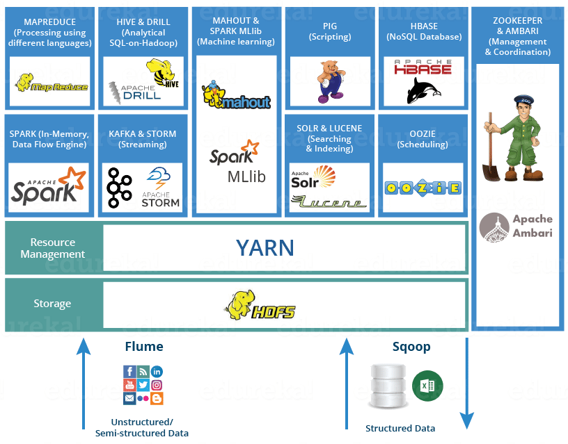

## Hive in Practice

### Hive Overview

[Hive](https://hive.apache.org/) is an open-source data warehouse tool developed by Facebook and built on top of Hadoop. It is currently maintained by the Apache Software Foundation and is the most widely used big data solution. In simple terms, Hive can convert SQL queries into MapReduce or Spark tasks, providing excellent SQL support and making big data analytics very convenient. It allows people who do not know Java or Scala to work with big data platforms and distributed file systems, implementing data storage and processing.




The main functions of Hive include:

1. Mapping structured data files to a table.
2. Providing the SQL-like query language HiveQL to operate on large-scale data.
3. Relying on Hadoop's HDFS for storage and MapReduce / Spark / Tez engine for task execution at the bottom layer.

The characteristics of Hive are as follows:

1. SQL-like syntax: Supports SQL queries, lowering the barrier to learning big data.
2. Scalability: Can easily support PB-level data.
3. Flexible storage: Supports multiple storage formats (Text, ORC, Parquet, Avro, etc.).
4. Selectable compute engines: Underlying execution engines include MapReduce, Tez, and Spark.
5. Higher latency: Suitable for offline analysis, not suitable for low-latency OLTP queries.

Comparison between Hive and traditional relational databases:


### Environment Setup

#### Prerequisites

> **Note**: The following operations use Ubuntu as an example.

1. Sync timezone

   ```bash
   sudo timedatectl set-timezone Asia/Shanghai
   ```

2. Change download source

   ```bash
   sudo mv /etc/apt/sources.list /etc/apt/sources.list.bak
   sudo vi /etc/apt/sources.list
   ```

   ```shell
   # 24.04 /etc/apt/sources.list
   deb https://mirrors.tuna.tsinghua.edu.cn/ubuntu/ focal main restricted universe multiverse
   deb https://mirrors.tuna.tsinghua.edu.cn/ubuntu/ focal-updates main restricted universe multiverse
   deb https://mirrors.tuna.tsinghua.edu.cn/ubuntu/ focal-backports main restricted universe multiverse
   deb https://mirrors.tuna.tsinghua.edu.cn/ubuntu/ focal-security main restricted universe multiverse
   ```

   ```shell
   # 18.04 /etc/apt/sources.list
   deb https://mirrors.tuna.tsinghua.edu.cn/ubuntu/ bionic main restricted universe multiverse
   deb-src https://mirrors.tuna.tsinghua.edu.cn/ubuntu/ bionic main restricted universe multiverse
   deb https://mirrors.tuna.tsinghua.edu.cn/ubuntu/ bionic-updates main restricted universe multiverse
   deb-src https://mirrors.tuna.tsinghua.edu.cn/ubuntu/ bionic-updates main restricted universe multiverse
   deb https://mirrors.tuna.tsinghua.edu.cn/ubuntu/ bionic-backports main restricted universe multiverse
   deb-src https://mirrors.tuna.tsinghua.edu.cn/ubuntu/ bionic-backports main restricted universe multiverse
   deb https://mirrors.tuna.tsinghua.edu.cn/ubuntu/ bionic-security main restricted universe multiverse
   deb-src https://mirrors.tuna.tsinghua.edu.cn/ubuntu/ bionic-security main restricted universe multiverse
   deb https://mirrors.tuna.tsinghua.edu.cn/ubuntu/ bionic-proposed main restricted universe multiverse
   deb-src https://mirrors.tuna.tsinghua.edu.cn/ubuntu/ bionic-proposed main restricted universe multiverse
   ```

3. Install utility software

   ```bash
   sudo apt update
   sudo apt upgrade
   sudo apt install -y vim wget net-tools openssh-server
   ```

4. Start SSH

   ```bash
   sudo systemctl start ssh
   sudo systemctl enable ssh
   sudo systemctl status ssh
   ```

5. Configure firewall

   ```bash
   sudo ufw enable
   sudo ufw allow ssh
   sudo ufw status

   sudo ufw disable
   ```

6. Prepare Hadoop

   ```bash
   wget https://archive.apache.org/dist/hadoop/common/stable2/hadoop-2.10.2.tar.gz
   sudo tar -zxvf hadoop-2.10.2.tar.gz -C /opt
   ```

7. Prepare Hive

   ```bash
   wget https://archive.apache.org/dist/hive/stable-2/apache-hive-2.3.9-bin.tar.gz
   sudo tar -zxvf apache-hive-2.3.9-bin.tar.gz -C /opt
   ```

#### Java Environment

1. Check

   ```bash
   java -version
   ```

2. Search

   ```bash
   sudo apt search openjdk
   ```

3. Install

   ```
   sudo apt install -y openjdk-8-jdk
   ```

#### MySQL Environment

1. Install

   ```bash
   sudo apt install mysql-server
   ```

2. Configure

   ```bash
   mysql_secure_installation
   ```

3. Start

   ```bash
   sudo systemctl enable mysql
   sudo systemctl start mysql
   sudo systemctl status mysql
   ```

#### Hadoop Configuration

> **Tip**: See the PDF document for details.

#### Hive Configuration

> **Tip**: See the PDF document for details.

#### Starting the Environment

1. Start HDFS

   ```bash
   start-dfs.sh
   start-yarn.sh
   ```

2. Start Hive

   ```bash
   hive --service metastore &
   hive --service hiveserver2 > hiveserver2.log 2> hiveerrors.log &
   ```

3. Check ports

   ```bash
   ss -ntl
   netstat -ntlp

### Common Commands

| Command                                            | Description                                                 |
| -------------------------------------------------- | ----------------------------------------------------------- |
| `hadoop fs -ls <path>`                             | List directory contents, similar to Linux `ls`              |
| `hadoop fs -ls -R <path>`                          | Recursively list all files under a directory                |
| `hadoop fs -du <path>`                             | Show file or directory size (non-recursive)                 |
| `hadoop fs -du -s <path>`                          | Show total directory size in summary                        |
| `hadoop fs -du -h <path>`                          | Show file sizes in human-readable format (KB/MB/GB)         |
| `hadoop fs -COUNT <path>`                          | Count files, directories, and total bytes under a directory |
| `hadoop fs -mkdir <path>`                          | Create a directory                                          |
| `hadoop fs -mkdir -p <path>`                       | Recursively create multi-level directories                  |
| `hadoop fs -rm <path>`                             | Delete a file                                               |
| `hadoop fs -rm -r <path>`                          | Recursively delete a directory                              |
| `hadoop fs -copyFromLocal <local> <hdfs>`          | Copy files from local to HDFS                               |
| `hadoop fs -moveFromLocal <local> <hdfs>`          | Move files from local to HDFS (delete local after copy)     |
| `hadoop fs -copyToLocal <hdfs> <local>`            | Copy files from HDFS to local                               |
| `hadoop fs -moveToLocal <hdfs> <local>`            | Move files from HDFS to local (delete HDFS file after copy) |
| `hadoop fs -put <local> <hdfs>`                    | Equivalent to `-copyFromLocal`, upload files                |
| `hadoop fs -get <hdfs> <local>`                    | Equivalent to `-copyToLocal`, download files                |
| `hadoop fs -getmerge <hdfs_dir> <local_file>`      | Merge files in HDFS directory and save to a single local file |
| `hadoop fs -cat <path>`                            | Output file contents to stdout (suitable for small files)   |
| `hadoop fs -tail <path>`                           | Show the end portion of a file                              |
| `hadoop fs -text <path>`                           | View compressed file contents as text (e.g., Gzip, SequenceFile) |
| `hadoop fs -appENDToFile <local_file> <hdfs_file>` | Append local file contents to the end of an HDFS file       |
| `hadoop fs -cp <src> <dst>`                        | Copy files or directories within HDFS                       |
| `hadoop fs -mv <src> <dst>`                        | Move/rename files or directories within HDFS                |
| `hadoop fs -chown <user:group> <path>`             | Change file or directory owner and group                    |
| `hadoop fs -chgrp <group> <path>`                  | Change file or directory group                              |
| `hadoop fs -chmod <mode> <path>`                   | Change file or directory permissions, similar to Linux `chmod` |
| `hadoop fs -stat <format> <path>`                  | Show file or directory status info (e.g., size, modification time) |
| `hadoop fs -expunge`                               | Empty the HDFS trash                                        |
| `hadoop fs -checkSUM <path>`                       | Calculate file checksum                                     |

### Basic Syntax

1. Drop a database.

    ```hive
    DROP DATABASE IF EXISTS eshop CASCADE;
    ```

2. Create a database.

    ```hive
    CREATE DATABASE IF NOT EXISTS eshop;
    ```

3. Switch context.

    ```hive
    USE eshop;
    ```

4. Create an external table.

    ```hive
    CREATE EXTERNAL TABLE IF NOT EXISTS dim_user_info
    (
    user_id           STRING,
    user_name         STRING,
    sex               STRING,
    age               INT,
    city              STRING,
    first_active_time STRING,
    level             INT,
    extra1            STRING,
    extra2            MAP<STRING, STRING>
    )
    ROW FORMAT DELIMITED
    FIELDS TERMINATED BY '\t'
    COLLECTION ITEMS TERMINATED BY ','
    MAP KEYS TERMINATED BY ':'
    LINES TERMINATED BY '\n'
    STORED AS TEXTFILE;

5. Load data.

   ```hive
   LOAD DATA LOCAL INPATH '/home/hadoop/data/user_info/user_info.txt' OVERWRITE INTO TABLE dim_user_info;
   ```

   ```hive
   LOAD DATA INPATH '/user/data/user_info.txt' OVERWRITE INTO TABLE dim_user_info;
   ```

6. Create a partitioned table.

   ```hive
   CREATE TABLE IF NOT EXISTS fact_user_trade
   (
   user_name      STRING,
   piece          INT,
   price          DOUBLE,
   pay_amount     DOUBLE,
   goods_category STRING,
   pay_time       BIGINT
   )
   PARTITIONED BY (dt STRING)
   ROW FORMAT DELIMITED
   FIELDS TERMINATED BY '\t'
   LINES TERMINATED BY '\n'
   STORED AS TEXTFILE;
   ```

7. Set dynamic partitioning.

   ```hive
   -- Enable dynamic partitioning
   SET hive.exec.dynamic.partition=true;
   -- Set dynamic partition to non-strict mode (strict mode requires at least one static partition column)
   SET hive.exec.dynamic.partition.mode=nonstrict;
   -- Maximum number of dynamic partitions a single SQL operation can create (across nodes)
   SET hive.exec.max.dynamic.partitions=1000;
   -- Maximum number of dynamic partitions each node can create
   SET hive.exec.max.dynamic.partitions.pernode=10000;
   ```

8. Repair partitions.

   ```hive
   MSCK REPAIR TABLE fact_user_trade;
   ```

9. Data extraction.

   ```hive
   -- Enable automatic local mode detection
   SET hive.exec.mode.local.auto=true;
   -- Set MapReduce file count
   SET hive.exec.mode.local.auto.input.files.max=128;
   -- Set MapReduce file size
   SET hive.exec.mode.local.auto.input.bytes.max=134217728;
   -- Set number of Reduce tasks to 1
   SET mapreduce.job.reduces=1;

   -- Query names of first 10 female users in Beijing
   SELECT user_name
     FROM dim_user_info
    WHERE city='beijing'
          AND sex='female'
    LIMIT 10;

   -- Query usernames, quantities, and payment amounts for food purchases on March 24, 2019 (no aggregation)
   SELECT user_name
        , piece
        , pay_amount
     FROM fact_user_trade
    WHERE dt='2019-03-24'
          AND goods_category='food';

   -- Calculate user ELLA's total payment amount in 2018 and the number of days between the earliest and latest purchases
   SELECT SUM(pay_amount) AS total
        , DATEDIFF(
              MAX(FROM_UNIXTIME(pay_time, 'yyyy-MM-dd')),
              MIN(FROM_UNIXTIME(pay_time, 'yyyy-MM-dd'))
          ) AS gap_days
     FROM fact_user_trade
    WHERE YEAR(dt)='2018'
          AND user_name='ELLA';
   ```

10. Group aggregation.

    ```hive
    -- Query from January to April 2019, how many people purchased each category and cumulative amount
    SELECT goods_category
         , COUNT(DISTINCT user_name) AS total_user
         , SUM(pay_amount) AS total_pay
      FROM fact_user_trade
     WHERE dt BETWEEN '2019-01-01' AND '2019-04-30'
     GROUP BY goods_category;

    -- Query users whose total payment exceeded 50,000 in April 2019
    SELECT user_name
         , SUM(pay_amount) AS total
      FROM fact_user_trade
     WHERE dt BETWEEN '2019-04-01' AND '2019-04-30'
     GROUP BY user_name
    HAVING SUM(pay_amount) > 50000;

    -- Query the number of users who purchased more than two product categories in 2018
    SELECT COUNT(t.user_name)
      FROM (SELECT user_name
                 , COUNT(DISTINCT goods_category) AS total
              FROM fact_user_trade
             WHERE YEAR(dt)='2018'
             GROUP BY user_name
            HAVING COUNT(DISTINCT goods_category)>2) AS t;

    -- Query top 5 users by payment amount in April 2019
    SELECT user_name
         , SUM(pay_amount) AS total
      FROM fact_user_trade
     WHERE dt BETWEEN '2019-04-01' AND '2019-04-30'
     GROUP BY user_name
     ORDER BY total DESC
     LIMIT 5;

    -- Count users by age group
    SELECT CASE WHEN age < 20 THEN 'Under 20'
                WHEN age < 30 THEN 'Under 30'
                WHEN age < 40 THEN 'Under 40'
                ELSE 'Over 40'
            END AS age_seg,
           COUNT(DISTINCT user_id) AS total
      FROM dim_user_info
     GROUP BY CASE WHEN age < 20 THEN 'Under 20'
                   WHEN age < 30 THEN 'Under 30'
                   WHEN age < 40 THEN 'Under 40'
                   ELSE 'Over 40'
               END;

    -- Count marital status for users activated in 2018, in the 20-30 and 30-40 age groups
    SELECT age_seg,
           IF(marriage_status = 1, 'Married', 'Single') AS marriage_status,
           COUNT(*) AS total
      FROM (SELECT CASE WHEN age < 20 THEN 'Under 20'
                        WHEN age < 30 THEN '20-30'
                        WHEN age < 40 THEN '30-40'
                        ELSE 'Over 40'
                    END AS age_seg,
                   extra2['marriage_status'] AS marriage_status
              FROM dim_user_info
             WHERE TO_DATE(first_active_time) BETWEEN '2018-01-01' AND '2018-12-31'
           ) AS t
     WHERE age_seg in ('20-30', '30-40')
     GROUP BY age_seg, IF(marriage_status = 1, 'Married', 'Single');

    -- List product categories purchased by each user
    SELECT user_name,
           COLLECT_SET(goods_category) AS categories
      FROM fact_user_trade
     GROUP BY user_name;

    -- Concatenate arrays into strings
    SELECT user_name
         , CONCAT_WS(', ', COLLECT_SET(goods_category)) AS categories
      FROM fact_user_trade
     GROUP BY user_name;

    -- Aggregate data into a map type
    SELECT user_name
         , STR_TO_MAP(CONCAT_WS(',', COLLECT_LIST(CONCAT(goods_category, ':', cnt)))) AS category_cnt_map
      FROM (SELECT user_name
                 , goods_category
                 , COUNT(*) AS cnt
              FROM fact_user_trade
             GROUP BY user_name, goods_category) AS t
     GROUP BY user_name;
    ```

11. Data sampling.

     ~~~hive
     -- Data sampling
     SELECT *
       FROM fact_user_trade
      WHERE RAND() < 0.1;

     SELECT *
       FROM fact_user_trade
            TABLESAMPLE(BUCKET 1 OUT OF 10 ON user_name);

     -- Binary storage support (e.g., ORC)
     -- SELECT *
     --   FROM fact_user_trade
     --        TABLESAMPLE(BYTE 100M);
     ~~~

12. Lateral view (explode).

     ```hive
     -- Create views
     CREATE OR REPLACE VIEW v_user_categories
     AS
     SELECT user_name
          , COLLECT_SET(goods_category) AS categories
       FROM fact_user_trade
      WHERE dt BETWEEN '2019-04-01' and '2019-04-30'
      GROUP BY user_name;

     CREATE OR REPLACE VIEW v_user_categories_map
     AS
     SELECT user_name
          , STR_TO_MAP(CONCAT_WS(',', COLLECT_LIST(CONCAT(goods_category, ':', cnt)))) AS category_cnt_map
       FROM (SELECT user_name
                  , goods_category
                  , COUNT(*) AS cnt
               FROM fact_user_trade
              WHERE dt BETWEEN '2019-04-01' AND '2019-04-30'
              GROUP BY user_name, goods_category) AS t
      GROUP BY user_name;

     -- Lateral view to explode an array
      SELECT user_name
           , category
        FROM v_user_categories
     LATERAL VIEW EXPLODE(categories) t AS category;

     -- Lateral view to explode a map
      SELECT user_name
           , category
           , cnt
        FROM v_user_categories_map
     LATERAL VIEW EXPLODE(category_cnt_map) t AS category, cnt;
     ```

### Table Creation

#### Data Types

Hive data types are broadly divided into three categories: primitive types, complex types, and nested types.

| Data Type     | Description                                              | Use Case      |
| ------------- | ---------------------------------------------------------| ------------- |
| TINYINT       | 1-byte signed integer, range -128 to 127.               |  |
| SMALLINT      | 2-byte signed integer, range -32768 to 32767.           |  |
| INT           | 4-byte signed integer, range -2147483648 to 2147483647. |  |
| BIGINT        | 8-byte signed integer, range -9223372036854775808 to 9223372036854775807. | Counters, IDs |
| BOOLEAN       | Boolean value, TRUE or FALSE.                            |  |
| FLOAT         | Single-precision floating point (4 bytes).               |  |
| DOUBLE        | Double-precision floating point (8 bytes).               |  |
| DECIMAL(P, S) | High-precision decimal, P=total digits, S=decimal digits.| Order amounts |
| STRING        | Variable-length string | Text, JSON |
| CHAR          | Fixed-length string |  |
| VARCHAR       | String with maximum length limit |  |
| BINARY        | Binary data |  |
| TIMESTAMP     | Timestamp | Millisecond precision |
| DATE          | Date |  |
| INTERVAL      | Time interval type |  |
| STRUCT | Similar to C structs, `STRUCT<first_name:STRING, last_name:STRING>` | Player behavior |
| MAP    | Collection of key-value pairs, `MAP<STRING, INT>`               | Product attributes |
| ARRAY    | Container of variables with the same type, `ARRAY<STRING>`      | Equipment list |

Usage of complex and nested types is shown below.

```hive
CREATE TABLE complex
(
  c1 ARRAY<INT>,
  c2 MAP<STRING, INT>,
  c3 STRUCT<a:STRING, b:INT, c:DOUBLE>,
  c4 STRUCT<name:STRING, addrs:ARRAY<STRUCT<city:STRING, zipcode:STRING>>>
);

SELECT c1[0]
     , c2['key']
     , c3.b
     , c4.addrs[0].city
  FROM complex;
```

Hive data types support two kinds of conversion:

1. Implicit conversion: TINYINT -> INT -> BIGINT -> DOUBLE -> STRING, FLOAT -> DOUBLE.

2. Explicit conversion:

   ```hive
   SELECT CAST('123' AS INT);
   SELECT CAST(3.14159 AS DECIMAL(5,2));
   ```

#### Table Types

Hive table types are as follows:

| Table Type                         | Definition/Creation                                          | Storage Location                                        | Lifecycle                                    | Characteristics                             | Use Cases                         |
| ------------------------------ | ------------------------------------------------------------ | ------------------------------------------------------- | -------------------------------------------- | ------------------------------------------- | --------------------------------- |
| **Managed Table**              | `CREATE TABLE t1 (id INT, name STRING); `                    | Data stored in Hive warehouse directory (`/user/hive/warehouse/...`) | **Data deleted when table is dropped**       | Hive fully manages metadata and data        | Temporary data, experimental data |
| **External Table**             | `CREATE EXTERNAL TABLE t2 (id INT, name STRING) LOCATION '/data/t2'; ` | Data stored in user-specified directory                  | **Data preserved when table is dropped**, only metadata deleted | Metadata and data separated, easy to share  | Data sharing, preventing accidental deletion, data lake scenarios |
| **Partitioned Table**          | `CREATE TABLE sales (id INT, amount INT) PARTITIONED BY (dt STRING, region STRING); ` | Each partition corresponds to a subdirectory             | Partition fields not stored in data files, used as path directories | Improves query efficiency (partition pruning) | Time series, regional division, log data |
| **Bucketed Table**             | `CREATE TABLE users (id INT, name STRING) CLUSTERED BY (id) INTO 8 BUCKETS; ` | Each bucket corresponds to a file                        | Fixed number of buckets                      | Data distributed by hash to bucket files, facilitating sampling and join optimization | Equi-join, large table sampling, balanced data distribution |
| **Temporary Table**            | `CREATE TEMPORARY TABLE tmp (id INT); `                      | Exists only in current session memory                    | Automatically destroyed when session ends    | Not persisted to disk, does not update Hive metadata | Temporary computation, session-level intermediate results |
| **View**                       | `CREATE VIEW v1 AS SELECT ...; `                             | No data stored, only metadata definition                 | Bound to underlying tables                   | Like a virtual table                        | Data security, SQL reuse, encapsulating complex queries |

#### Modifiers

Modifiers available when creating tables:

| Keyword                             | Purpose            | Effect When Used                                             | **Default When Not Used**                                    |
| ----------------------------------- | ------------------ | ------------------------------------------------------------ | ------------------------------------------------------------ |
| **EXTERNAL**                        | Specify external table | `CREATE EXTERNAL TABLE ... LOCATION ...` -> Table and data separated, dropping table does not delete data | **Managed Table**, data directory deleted when table is dropped |
| **PARTITIONED BY**                  | Define partition fields | `PARTITIONED BY (dt STRING, city STRING)` -> Data written to subdirectories `/table/dt=2025-08-26/city=Beijing/` | **Non-partitioned table**, all data in one directory         |
| **CLUSTERED BY ... INTO N BUCKETS** | Bucketing          | `CLUSTERED BY (user_id) INTO 8 BUCKETS` -> Data distributed by hash to 8 file buckets | **No bucketing**, data as regular files                      |
| **STORED AS**                       | File storage format | Common: `TEXTFILE`, `SEQUENCEFILE`, `ORC`, `PARQUET`         | **TEXTFILE** (text file)                                     |
| **ROW FORMAT**                      | Specify row format and SerDe | e.g., `ROW FORMAT DELIMITED FIELDS TERMINATED BY ','` or `ROW FORMAT SERDE 'org.apache.hadoop.hive.serde2.JsonSerDe'` | **LazySimpleSerDe** (default delimiter `\001`, invisible Ctrl+A) |
| **LOCATION**                        | Specify HDFS path  | `LOCATION '/user/hive/custom_path'` -> Table data stored at custom path | Default to **warehouse directory**: `/user/hive/warehouse/<db>.db/<table>/` |
| **TBLPROPERTIES/DBPROPERTIES**      | Store metadata properties | `TBLPROPERTIES ('creator'='Hao')`                            | **Empty**, unless manually added                             |
| **COMMENT**                         | Table/field comment | `COMMENT 'User transaction fact table'`                      | **Empty**                                                    |

#### ROW FORMAT

| Syntax                                                       | Description           | Common Scenarios    |
| ------------------------------------------------------------ | --------------------- | ------------------- |
| `ROW FORMAT DELIMITED FIELDS TERMINATED BY ','`              | Parse by delimiter    | CSV/TSV/text        |
| `ROW FORMAT DEFAULT`                                         | Default format        | CSV/TSV/text        |
| `ROW FORMAT SERDE 'org.apache.hadoop.hive.serde2.LazySimpleSerDe'` | Default SerDe         | Text tables (\001 delimiter) |
| `ROW FORMAT SERDE 'org.apache.hadoop.hive.serde2.OpenCSVSerde'` | Smarter CSV parsing   | CSV with quotes/escapes |
| `ROW FORMAT SERDE 'org.apache.hadoop.hive.serde2.RegexSerDe'` | Regex-based row matching | Log data            |
| `ROW FORMAT SERDE 'org.apache.hadoop.hive.serde2.JsonSerDe'` | JSON format parsing   | JSON files          |
| `ROW FORMAT SERDE 'org.apache.hadoop.hive.serde2.AvroSerDe'` | Avro format           | JSON + binary compression |
| `ROW FORMAT SERDE 'org.apache.hadoop.hive.serde2.ParquetHiveSerDe'` | Parquet format        | Parquet data        |
| `ROW FORMAT SERDE 'org.apache.hadoop.hive.serde2.OrcSerde'`  | ORC format            | ORC data            |

> **Note**: You only need to explicitly specify SERDE when using **non-default formats (CSV/JSON/Regex)**.

### Writing Data

| Write Method                          | Example Syntax                                               | Characteristics                                       | Use Cases                               |
| ------------------------------------- | ------------------------------------------------------------ | ----------------------------------------------------- | --------------------------------------- |
| **INSERT INTO**                       | `INSERT INTO TABLE sales PARTITION (dt='2025-08-26') SELECT * FROM tmp_sales; ` | **Appends data** to table/partition, does not overwrite | Daily data appending (logs, transactions) |
| **INSERT OVERWRITE**                  | `INSERT OVERWRITE TABLE sales PARTITION (dt='2025-08-26') SELECT * FROM tmp_sales; ` | Overwrites target table/partition data (delete then write) | Periodic full data refresh (e.g., T+1 daily/monthly reports) |
| **LOAD DATA**                         | `LOAD DATA INPATH '/user/hadoop/data.txt' INTO TABLE sales; ` | **Moves files** to Hive table directory (no parsing), fast | Importing existing HDFS files directly into Hive |
| **LOAD DATA LOCAL**                   | `LOAD DATA LOCAL INPATH '/home/user/data.txt' INTO TABLE sales; ` | Copies data from **local filesystem** to Hive table   | Quick import of local temporary data    |
| **CREATE TABLE AS SELECT (CTAS)**     | `CREATE TABLE new_sales AS SELECT * FROM sales WHERE dt='2025-08-26'; ` | Creates new table and writes query results in one step | Generating intermediate/derived tables, data exploration |
| **INSERT + Directory (write to HDFS)** | `INSERT OVERWRITE DIRECTORY '/tmp/export/' ROW FORMAT DELIMITED FIELDS TERMINATED BY ',' SELECT * FROM sales; ` | Writes query results to **HDFS directory**, can specify delimiter/format | Data export, interacting with other systems |
| **INSERT + LOCAL Directory (write to local)** | `INSERT OVERWRITE LOCAL DIRECTORY '/home/user/export/' ROW FORMAT DELIMITED FIELDS TERMINATED BY ',' SELECT * FROM sales; ` | Writes results to **local directory**                 | Small-scale result export, local analysis |
| **External Table Write**              | `CREATE EXTERNAL TABLE ext_sales (...) LOCATION '/data/sales'; ` | External table only manages metadata, actual writing depends on `LOAD DATA`/`INSERT` | Shared data directories, preventing accidental deletion |
| **Dynamic Partition Write**           | `SET hive.exec.dynamic.partition=true;` `SET hive.exec.dynamic.partition.mode=nonstrict;` `INSERT OVERWRITE TABLE sales PARTITION (dt) SELECT id, amount, dt FROM tmp; ` | Automatically generates partition directories based on field values | Large-scale partitioned table data loading |

### Common Functions

#### Math Functions

| Function                   | Description              | Example                    |
| -------------------------- | ------------------------ | -------------------------- |
| `abs(x)`                   | Absolute value           | `abs(-10) = 10`            |
| `round(x[, d])`            | Round, d = decimal places | `round(3.14159, 2) = 3.14` |
| `floor(x)`                 | Floor (round down)       | `floor(3.9) = 3`           |
| `ceil(x)`                  | Ceiling (round up)       | `ceil(3.1) = 4`            |
| `rand()`                   | Generate random number in [0,1) | `rand()`              |
| `pow(x, y)` / `power(x,y)` | Power                    | `pow(2,3) = 8`             |
| `sqrt(x)`                  | Square root              | `sqrt(16) = 4`             |
| `exp(x)`                   | e^x                      | `exp(1) ~ 2.718`           |
| `ln(x)`                    | Natural logarithm        | `ln(e) = 1`                |
| `log10(x)`                 | Base-10 logarithm        | `log10(100) = 2`           |

#### String Functions

| Function                                | Description          | Example                                             |
| ----------------------------------- | ---------------- | ----------------------------------------------- |
| `length(str)`                       | String length    | `length('hive') = 4`                            |
| `upper(str)`                        | Convert to uppercase | `upper('hive') = HIVE`                       |
| `lower(str)`                        | Convert to lowercase | `lower('HIVE') = hive`                       |
| `concat(str1,str2,...)`             | Concatenate strings | `concat('hive','sql') = hivesql`              |
| `concat_ws(sep,str1,str2,...)`      | Concatenate with separator | `concat_ws('-', 'a','b','c') = a-b-c`   |
| `substr(str, start, len)`          | Extract substring | `substr('hive',2,2) = iv`                      |
| `instr(str, substr)`               | Return substring position | `instr('hive','iv') = 2`                 |
| `split(str, regex)`                | Split string into array | `split('a,b,c',',') = ['a','b','c']`      |
| `regexp_extract(str, pattern, idx)` | Regex extraction  | `regexp_extract('abc123','([0-9]+)',1) = 123`   |
| `regexp_replace(str, pattern, rep)` | Regex replacement | `regexp_replace('abc123','[0-9]','X') = abcXXX` |
| `trim(str)`                        | Trim leading/trailing spaces | `trim('  hi  ') = hi`                 |
| `lpad(str,n,pad)`                  | Left-pad to length n | `lpad('hi',5,'*') = ***hi`                   |
| `rpad(str,n,pad)`                  | Right-pad to length n | `rpad('hi',5,'*') = hi***`                  |

#### Date and Time Functions

| Function                         | Description          | Example                                               |
| ---------------------------- | ---------------- | ----------------------------------------------------- |
| `current_date`               | Current date     | `2025-09-15`                                          |
| `current_timestamp`          | Current timestamp | `2025-09-15 22:00:00`                                |
| `unix_timestamp()`           | Current timestamp (seconds) | `1694784000`                                 |
| `from_unixtime(ts, fmt)`     | Timestamp to string | `from_unixtime(1694784000,'yyyy-MM-dd') = 2025-09-15` |
| `to_date(str)`               | String to date   | `to_date('2025-09-15 22:00:00') = 2025-09-15`        |
| `year(dt)`                   | Extract year     | `year('2025-09-15') = 2025`                           |
| `month(dt)`                  | Extract month    | `month('2025-09-15') = 9`                             |
| `day(dt)` / `dayofmonth(dt)` | Extract day      | `day('2025-09-15') = 15`                              |
| `hour(ts)`                   | Extract hour     | `hour('2025-09-15 22:30:00') = 22`                    |
| `minute(ts)`                 | Extract minute   | `minute('2025-09-15 22:30:00') = 30`                  |
| `second(ts)`                 | Extract second   | `second('2025-09-15 22:30:00') = 0`                   |
| `datediff(dt1,dt2)`          | Days between dates | `datediff('2025-09-15','2025-09-10') = 5`           |
| `add_months(dt,n)`           | Add n months     | `add_months('2025-09-15',2) = 2025-11-15`            |
| `date_add(dt,n)`             | Add n days       | `date_add('2025-09-15',10) = 2025-09-25`             |
| `date_sub(dt,n)`             | Subtract n days  | `date_sub('2025-09-15',10) = 2025-09-05`             |

#### Conditional Functions

| Function                                  | Description            | Example                                          |
| ------------------------------------- | ---------------------- | ------------------------------------------------ |
| `if(cond, t, f)`                      | Conditional evaluation | `if(1=1,'yes','no') = yes`                       |
| `case when ... then ... else ... end` | Multi-condition evaluation | `case when age>18 then 'adult' else 'child' end` |
| `coalesce(x1,x2,...)`                 | Return first non-NULL value | `coalesce(null,'hive','sql') = hive`          |
| `nvl(x, y)`                           | Return y if x is NULL  | `nvl(null,0) = 0`                                |

#### Aggregate Functions

| Function          | Description    | Example         |
| ----------------- | -------------- | --------------- |
| `count(*)`        | Count          | `count(*)`      |
| `sum(x)`          | Sum            | `sum(price)`    |
| `avg(x)`          | Average        | `avg(score)`    |
| `max(x)`          | Maximum        | `max(age)`      |
| `min(x)`          | Minimum        | `min(age)`      |
| `collect_set(x)`  | Deduplicated set | `['a','b','c']` |
| `collect_list(x)` | List with duplicates | `['a','b','a']` |

#### Type Conversion Functions

| Function          | Description    | Example                    |
| ----------------- | -------------- | -------------------------- |
| `cast(x AS type)` | Type conversion | `cast('123' as int) = 123` |
| `typeof(x)`       | Return field type | `typeof(123) = int`      |

#### Complex Type Functions

| Function                         | Description    | Example                                         |
| ---------------------------- | -------------- | ------------------------------------------- |
| `size(array/map)`            | Get size       | `size(array('a','b')) = 2`                  |
| `map_keys(map)`              | Return all keys | `map_keys(map('a',1,'b',2)) = ['a','b']`   |
| `map_values(map)`            | Return all values | `map_values(map('a',1,'b',2)) = [1,2]`   |
| `sort_array(array)`          | Sort array     | `sort_array(array(3,1,2)) = [1,2,3]`       |
| `array_contains(array, val)` | Check if element exists | `array_contains(array('a','b'),'a') = true` |

#### Window Functions

Commonly used for **ranking, cumulative calculations, and within-group calculations**.

| Function              | Description              | Example                                                     |
| --------------------- | ------------------------ | ----------------------------------------------------------- |
| `row_number()`        | Row number within group  | `row_number() over(partition by dept order by salary desc)` |
| `rank()`              | Rank (with gaps on ties) | `rank() over(order by score desc)`                          |
| `dense_rank()`        | Rank (no gaps on ties)   | `dense_rank() over(order by score desc)`                    |
| `lag(col,n,default)`  | Get value n rows before  | `lag(salary,1,0) over(order by id)`                         |
| `lead(col,n,default)` | Get value n rows after   | `lead(salary,1,0) over(order by id)`                        |
| `first_value(col)`    | First value in group     | `first_value(salary) over(order by id)`                     |
| `last_value(col)`     | Last value in group      | `last_value(salary) over(order by id)`                      |
| `sum(col) over(...)`  | Cumulative sum in window | `sum(sales) over(partition by region order by month)`       |

#### Usage Examples

1. `FROM_UNIXTIME`: Convert a timestamp to a date

   ```hive
   SELECT FROM_UNIXTIME(pay_time, 'yyyy-MM-dd hh:mm:ss')
     FROM fact_user_trade LIMIT 10;
   ```

3. `DATEDIFF`: Calculate the difference between two dates

   ```Hive
   -- Interval between user's first activation time and a reference date
   SELECT user_name, DATEDIFF('2019-4-1', to_date(firstactivetime))
     FROM dim_user_info LIMIT 10;
   ```

4. `IF`: Return different values based on conditions

   ```Hive
   -- Count of high-level users by gender
   SELECT sex
        , IF(level > 5, 'High', 'Low') AS level_type
        , COUNT(DISTINCT user_id) AS total
     FROM dim_user_info
    GROUP BY sex, IF(level > 5, 'High', 'Low');
   ```

4. `SUBSTR`: Extract a substring

   ```Hive
   -- Count new users activated each month
   SELECT SUBSTR(first_active_time, 1, 7) AS month
        , COUNT(DISTINCT user_id) AS total
     FROM dim_user_info
    GROUP BY substr(first_active_time, 1, 7);
   ```

6. `GET_JSON_OBJECT`: Extract the `value` for a specified `key` from a JSON string, e.g., `GET_JSON_OBJECT(info, '$.first_name')`.

   ```Hive
   -- Count users by phone brand
   SELECT GET_JSON_OBJECT(extra1, '$.phonebrand') AS phone
        , COUNT(DISTINCT user_id) AS total
     FROM user_info
    GROUP BY GET_JSON_OBJECT(extra1, '$.phonebrand');
   ```

   > **Note**: The equivalent MySQL function is `JSON_EXTRACT`.

### Group Aggregation

| Operation         | Example Syntax                                               | Description            | Result Characteristics                      | Typical Use Cases          |
| ----------------- | ------------------------------------------------------------ | ---------------------- | ------------------------------------------- | -------------------------- |
| **GROUP BY**      | `SELECT region, product, SUM(amount) FROM sales GROUP BY region, product; ` | Group by specified columns | Outputs aggregation for **one dimension combination** only | Single or fixed combination summary |
| **GROUPING SETS** | `SELECT region, product, SUM(amount) FROM sales GROUP BY GROUPING SETS ((region, product), (region), (product), ()); ` | Specify multiple grouping combinations at once | Outputs **multiple dimension combinations**, can include grand total | Reports needing only partial combinations |
| **CUBE**          | `SELECT region, product, SUM(amount) FROM sales GROUP BY CUBE(region, product); ` | Auto-generate all dimension combinations | Outputs **all dimension combinations** (2^n types) | OLAP full multi-dimensional analysis |

### Sampling Operations

| Sampling Method                      | Example Syntax                                               | Core Semantics                                    | Random?        | Reproducibility             | Precision/Bias              | Prerequisites                                | Performance & Notes                        | Typical Use Cases                |
| ------------------------------------ | ------------------------------------------------------------ | ------------------------------------------------- | -------------- | --------------------------- | --------------------------- | -------------------------------------------- | ------------------------------------------ | ---------------------------- |
| **BUCKET Sampling (Physical)**       | `SELECT * FROM t TABLESAMPLE(BUCKET 2 OUT OF 8);`            | Select **physical bucket #2** of a bucketed table (8 total) | No             | Stable (determined by bucket write) | Consistent with table bucketing | Table must be **CLUSTERED BY ... INTO 8 BUCKETS** | Only reads matching files, fast; only works on **bucketed tables** | Proportional large table sampling |
| **BUCKET Sampling (Logical)**        | `SELECT * FROM t TABLESAMPLE(BUCKET 1 OUT OF 4 ON user_id);` | Map data to 4 logical buckets by `hash(user_id)`, take bucket 1 | Pseudo-random (hash) | Stable (same key, same result) | ~1/4, affected by key skew | No bucketed table required                   | Only scans matching rows; affected by key skew | Train/eval split, AB testing |
| **Probabilistic (Bernoulli)**        | `SELECT * FROM t WHERE RAND() < 0.1;`                        | Independently sample each row at 10% probability  | Yes            | Use `RAND(42)` for fixed seed | Expected 10%, high variance for small samples | None                                         | Full table scan; affected by data volume   | Quick downsampling, exploration |
| **Fixed Sample Size Per Group**      | `SELECT * FROM (SELECT *, ROW_NUMBER() OVER(PARTITION BY gid ORDER BY RAND()) rn FROM t) x WHERE rn <= 100;` | Randomly take **fixed N rows** per group (`gid`)  | Yes            | Use `RAND(42)`              | Equal sample size per group | Requires window functions                    | Two scans + sort, moderate cost            | Class-balanced sampling |
| **Per-Group Proportional Sampling**  | `WHERE RAND() < CASE WHEN gid='A' THEN 0.2 ELSE 0.05 END`    | Set different sampling rates per group             | Yes            | Can fix seed                | Expected proportion, within-group variance | None                                         | Full table scan                            | Weighted sampling |
| **LIMIT Truncation (Non-random)**    | `SELECT * FROM t LIMIT 1000;`                                | Take first N rows (non-random)                    | No             | Stable (depends on file/split order) | Biased (non-random)         | None                                         | Fastest; for debugging preview only        | Dev/debug, field inspection |
| **Per-Bucket Top-N (Non-random)**    | `... DISTRIBUTE BY k SORT BY k LIMIT 100;` (or per-group `ROW_NUMBER`) | Take top N from each shard/group                  | No             | Stable                      | Biased (by sort order)      | Requires distribute/sort                     | Suitable for parallel TopN, not random sampling | TopN per group |

### Sorting Operations

| Sort Method                 | Example Syntax                                            | Core Semantics                                  | Reducer Count          | Globally Ordered?           | Shuffle/Sort Behavior                      | Performance & Notes                                      | Typical Use Cases          |
| --------------------------- | --------------------------------------------------------- | ----------------------------------------------- | ---------------------- | --------------------------- | ------------------------------------------ | -------------------------------------------------------- | -------------------------- |
| **ORDER BY**                | `SELECT * FROM t ORDER BY ts DESC;`                       | **Global sort**                                 | **1** (single reducer) | Yes                         | All data goes to 1 reducer for total sort  | Slowest; single-point bottleneck; may OOM on large results; suitable for small result sets or with `LIMIT` | Export small results, final display |
| **ORDER BY ... LIMIT**      | `SELECT * FROM t ORDER BY score DESC LIMIT 1000;`         | Global Top-N                                    | 1                      | Yes                         | Still single reducer, but `LIMIT` enables early pruning | Acceptable; common Top-N pattern                         | Global Top-N               |
| **SORT BY**                 | `SELECT * FROM t SORT BY ts DESC;`                        | **Sort within each reducer** (locally ordered)  | Multiple               | No                          | Map output partitioned to multiple reducers; each sorts independently | Faster than ORDER BY; overall result **not globally ordered** | Large table shard sort, parallel export |
| **DISTRIBUTE BY**           | `SELECT * FROM t DISTRIBUTE BY key;`                      | Control **distribution by key** to reducers     | Multiple               | No                          | Same key goes to same reducer; no sorting  | Often used with SORT BY                                  | Pre-partition for aggregation/sorting |
| **DISTRIBUTE BY + SORT BY** | `SELECT * FROM t DISTRIBUTE BY key SORT BY key, ts DESC;` | **Same key same shard + within-shard sort**     | Multiple               | No (but **ordered within each key**) | Records with same key ordered within same reducer | Common; good for downstream merge/sort-based processing  | Per-user/product time series sort |
| **CLUSTER BY**              | `SELECT * FROM t CLUSTER BY key;`                         | `DISTRIBUTE BY key` **+ `SORT BY key` (ascending)** | Multiple           | No                          | Syntactic sugar, **cannot specify ASC/DESC** | Concise but sort direction not controllable              | Bucket writes / equi-join pre-sort |
| **Partition-scoped Sort**   | `... WHERE dt='2025-08-26' SORT BY ts;`                   | Process only one partition's data                | Depends on config      | Locally ordered within partition | Same as SORT BY                            | Significantly faster with reduced data                   | Partition data export, window function prep |

### Lateral View

`LATERAL VIEW` is a very important syntax in Hive, primarily used in combination with table-generating functions (such as `EXPLODE`) to split one row of data into multiple rows. The most common use cases involve processing ARRAY, MAP, JSON, and similar field types, and can also convert wide tables to narrow tables.

| Usage                                | Example Syntax                                               | Description                     | Typical Use Cases      |
| ------------------------------------ | ------------------------------------------------------------ | ------------------------------- | ---------------------- |
| **LATERAL VIEW explode(array)**      | `SELECT order_id, item FROM orders LATERAL VIEW explode(items) t AS item; ` | Split array into rows, one element per row | Order details, event tracking |
| **LATERAL VIEW posexplode(array)**   | `SELECT order_id, pos, item FROM orders LATERAL VIEW explode(items) t AS pos, item; ` | Split array into rows with element index | Click stream analysis with ordering |
| **LATERAL VIEW explode(map)**        | `SELECT user_id, k, v FROM user_tags LATERAL VIEW explode(tags) t AS k, v; ` | Split map into rows, yielding (key, value) | User tags, attribute key-value pairs |
| **LATERAL VIEW json_tuple(json, ...)** | `SELECT log_id, ip, device FROM event_log LATERAL VIEW json_tuple(log_json,'ip','device') t AS ip, device; ` | Extract fields from JSON and generate columns | Log parsing, semi-structured data |
| **LATERAL VIEW inline(array)**       | `SELECT order_id, col1, col2 FROM orders LATERAL VIEW inline(item_structs) t AS col1,col2; ` | Expand struct array into multiple rows and columns | Splitting multi-dimensional attributes |
| **LATERAL VIEW stack(n, ...)**       | `SELECT user_id, subject, score FROM user_score LATERAL VIEW stack(3,'math',math,'eng',english,'phy',physics) t AS subject, score; ` | Convert multiple columns to multiple rows (column-to-row) | Wide table to long table, UNPIVOT |

### HiveSQL vs. MySQL

| **Feature**             | **Hive SQL**                                                 | **MySQL SQL**                                                | **Difference**                                               |
| --------------------- | ------------------------------------------------------------ | ------------------------------------------------------------ | ------------------------------------------------------------ |
| **Table Partitioning** | `PARTITIONED BY`: Create tables with partitions to divide data by a field, speeding up data filtering during queries. | Does not support partitioning.                               | Hive can store data separately through partitions, suitable for big data scenarios. MySQL lacks a similar partitioning mechanism. |
| **Table Bucketing**    | `CLUSTERED BY` (bucketing): Distribute table data by a field into buckets, suitable for optimizing large table joins. | Does not support bucketing.                                  | Hive supports join optimization through bucketing; MySQL does not support bucketing. |
| **Storage Format**     | `STORED AS`: Supports columnar storage formats like ORC and Parquet. | Uses row-based storage like InnoDB.                          | Hive supports columnar storage formats for optimized queries and compression; MySQL primarily uses row-based storage. |
| **Query Engine**       | Supports multiple execution engines including MapReduce, Tez, and Spark. | Only supports the InnoDB engine.                             | Hive queries can be optimized through different execution engines (like Tez or Spark); MySQL can only use a single engine. |
| **Complex Query Support** | Supports LATERAL VIEW, MAP, ARRAY, and other complex data structure processing. | Does not support LATERAL VIEW or similar complex data types. | Hive supports more complex nested queries and data types; MySQL does not support similar features. |
| **JOIN Types**         | Supports MapJoin (Map-side Join): Small tables loaded into memory for Map-phase joins, avoiding Shuffle. | Supports standard INNER JOIN, LEFT JOIN, RIGHT JOIN, OUTER JOIN, etc. | Hive's MapJoin optimization accelerates small-large table joins; MySQL lacks this optimization strategy. |
| **User-Defined Functions (UDF)** | Supports UDF and UDTF (User-Defined Table Functions). | Supports UDF and triggers.                                   | Hive focuses more on UDF flexibility; MySQL focuses more on table operation-related functions. |
| **Query Optimization** | Supports partition pruning, column pruning, dynamic partition inserts, etc. | Index-based optimization, but no column pruning or partition pruning. | Hive has more big data query optimization mechanisms; MySQL primarily relies on indexes and query cache. |
| **Indexes**            | Supports `CREATE INDEX`: But not recommended in Hive; high performance overhead. | Supports `CREATE INDEX`; indexes are key to MySQL query performance. | Hive indexes are rarely used and resource-intensive; MySQL greatly improves query performance through indexes. |
| **Data Types**         | Supports complex types like `ARRAY`, `MAP`, `STRUCT`.        | Only supports basic data types like `INT`, `VARCHAR`, etc.   | Hive supports richer data types, especially for structured data; MySQL is relatively simpler. |
| **NULL Handling**       | Supports `IS NULL`, `IS NOT NULL`, but NULL handling may differ from MySQL depending on the execution engine. | Supports `IS NULL`, `IS NOT NULL`, consistent NULL handling. | Both support NULL checks, but Hive's NULL handling in large queries may be less precise than MySQL's. |
| **Aggregate Functions** | Supports common aggregates (`SUM()`, `COUNT()`, `AVG()`, etc.) and extended functions like `APPROX_COUNT_DISTINCT()`. | Supports common aggregates (`SUM()`, `COUNT()`, `AVG()`, etc.). | Hive provides `APPROX_COUNT_DISTINCT()` and other efficient approximate aggregates better suited for massive data; MySQL aggregates are typically exact. |
| **Subquery Support**   | Supports subqueries, but may be less efficient on large datasets; often needs optimization (e.g., `MAPJOIN`). | Supports subqueries; MySQL's subquery optimization is better, especially for small data. | Hive subquery performance on large data may lag behind MySQL; MySQL's subquery optimization is more mature. |
| **Table Creation Syntax** | Hive table creation requires specifying storage format, partitions, file format, etc. | MySQL table creation mainly focuses on field types, indexes, etc. | Hive table creation is more complex, involving storage formats and partitions for big data; MySQL table creation is more concise. |
| **Materialized Views** | Hive supports creating **materialized views**, which can improve query performance in some cases. | MySQL does not directly support materialized views; similar functionality is typically achieved through temporary tables or application-level caching. | Hive provides materialized views for pre-computing and storing query results; MySQL lacks native materialized view support. |
| **Query Cache**        | Hive does not support query caching; performance optimization is typically through MapJoin, indexes, etc. | MySQL supports query caching to cache frequent query results. | MySQL has a powerful query caching mechanism; Hive typically relies on other optimization strategies. |
| **String Functions**   | Hive supports string functions like `CONCAT()`, `LENGTH()`, `SUBSTRING()`, etc. | MySQL also supports string functions with comprehensive coverage. | Both support similar string operations, but Hive's string processing is typically more suited to big data analytics. |
| **NULL Default Values** | Hive fields generally do not support NULL default values; data is typically inserted using `INSERT INTO`. | MySQL allows specifying NULL or default values when creating tables. | Hive does not directly support field defaults; MySQL allows setting defaults (including NULL). |

### Performance Optimization

There are many ways to optimize Hive SQL query performance, ranging from table structure design and query optimization to execution engine tuning.

| **Optimization Method**              | **Description**                                              | **Use Cases**                                                |
| ---------------------------------- | ------------------------------------------------------------ | ------------------------------------------------------------ |
| **Partitioning**                   | Partition tables by a field (e.g., date). Through partition pruning, only scan partitions that match conditions, reducing data volume scanned. | When data volume is large and queries frequently filter by a field (e.g., time, region). |
| **Bucketing**                      | Distribute data by hash value of a field into fixed number of buckets. Used to optimize large-small table joins, especially for aggregations. | When efficient join and aggregation operations are needed, especially with repeated operations on a column. |
| **Column Pruning**                 | Select only needed columns during queries, reducing unnecessary column scans. | When queries only need a subset of table columns. |
| **Partition Pruning**              | Prune non-matching partitions during queries, scanning only qualifying partitions. | When tables are partitioned and queries include partition field filters. |
| **Compressed Storage Formats (ORC, Parquet)** | Use columnar storage formats (ORC, Parquet) which are more efficient than row-based formats (TextFile), especially for reading large data. | When table data volume is large, especially for fast scanning needs. |
| **MapJoin (Map-side Join)**        | When joining small and large tables, load small table into memory to complete join during Map phase, avoiding Shuffle and Reduce overhead. | When small table fits in memory for small-large table joins. |
| **Appropriate Join Types**         | Using suitable join types (Sort Merge Join or Bucketed Join) can optimize join efficiency. | When both tables are bucketed or sorted by the same column. |
| **Proper Execution Engine Selection** | Choosing the right execution engine (MapReduce, Tez, Spark) improves query efficiency. Tez or Spark are typically more efficient than MapReduce. | Select different engines based on data volume and query type. |
| **Appropriate File Formats**       | Choosing suitable file formats (ORC, Parquet) improves storage and read efficiency, especially for large-scale data operations. | When efficient storage and reading are needed. |
| **Enable Dynamic Partition Inserts** | Setting `hive.exec.dynamic.partition=true` enables dynamic partition inserts, avoiding manual partition specification. | When data needs dynamic partition insertion. |
| **Reduce Data Scanning (Deferred Computation)** | Use `WHERE` clauses to avoid scanning unnecessary data, filtering as early as possible. | When queries involve large data volumes, reduce scanned data early. |
| **Batch Execution**                | Use `LIMIT` for paginated queries or `TABLESAMPLE` for data sampling to reduce query data volume. | When data volume is too large and completeness is not critical. |
| **Appropriate Use of Indexes**     | Create indexes to speed up queries, especially on frequently filtered columns. | When certain columns are frequently used as query conditions. |
| **Query Caching**                  | Enable Hive's query cache to cache result sets and improve efficiency for identical queries. | When the same queries are executed frequently. |
| **Reduce MapReduce Task Count**    | Adjust `mapreduce.map.memory.mb` and `mapreduce.reduce.memory.mb` parameters to reduce MapReduce task count and improve efficiency. | When queries involve multiple complex MapReduce tasks. |
| **Proper Table Storage Format Selection** | Choose appropriate storage formats to avoid performance issues from format mismatch. ORC and Parquet are more efficient for big data queries. | When query data volume is large, especially for reads and aggregations. |
| **Materialized Views**             | Create materialized views to pre-compute and store query results, reducing repeated computation overhead. | When certain query results are frequently used. |
| **Parallel Execution**             | Enable parallel execution with `hive.exec.parallel=true` to run multiple query tasks in parallel, reducing execution time. | When multiple queries can be parallelized. |
