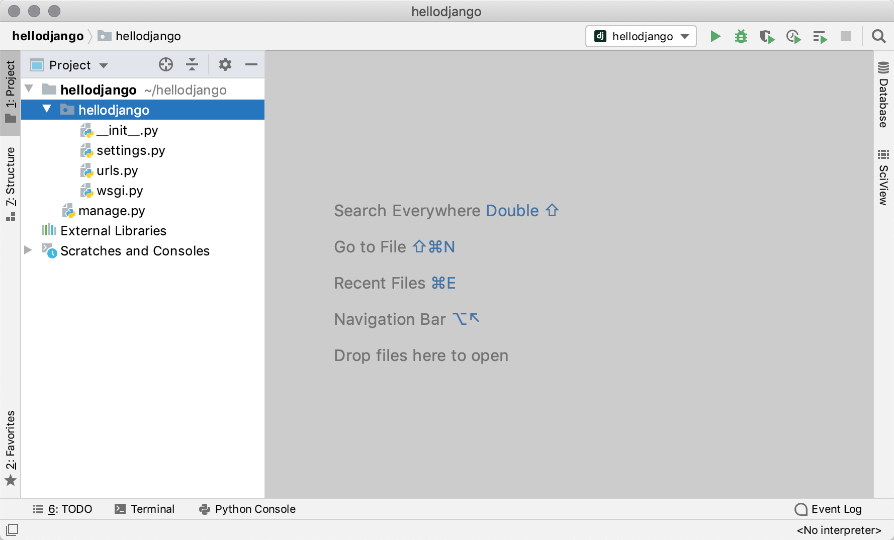
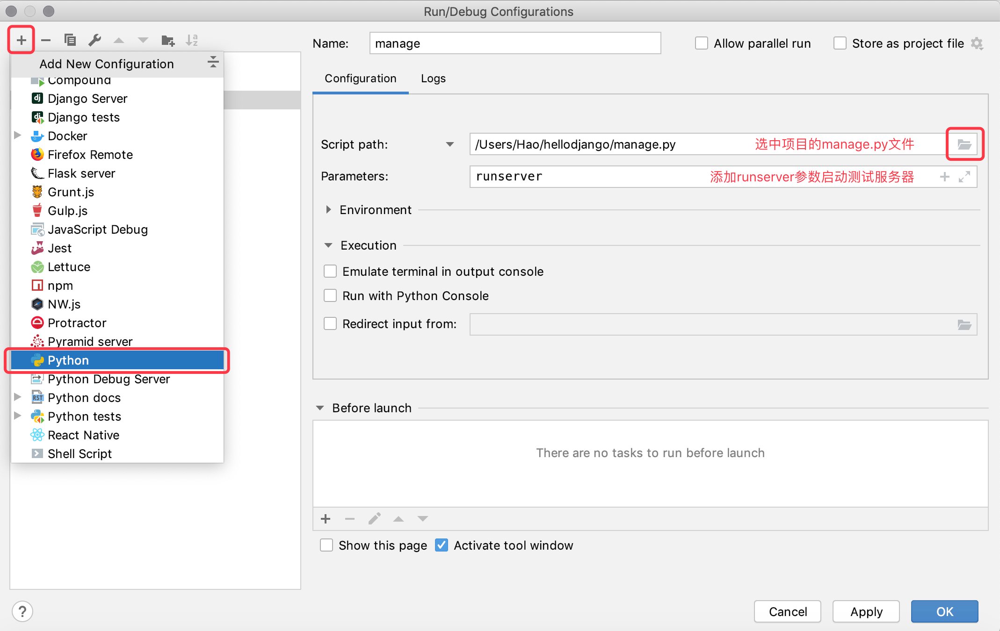
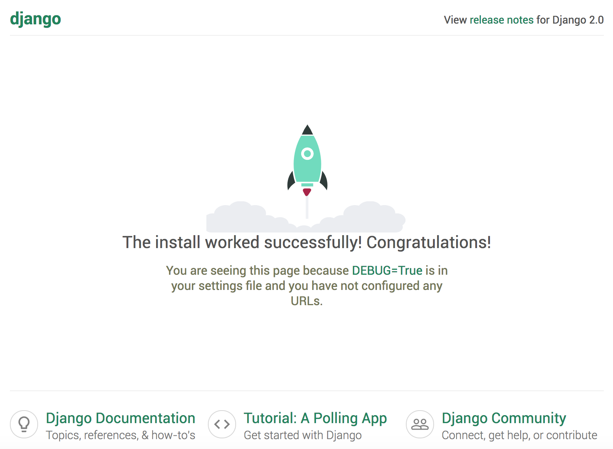
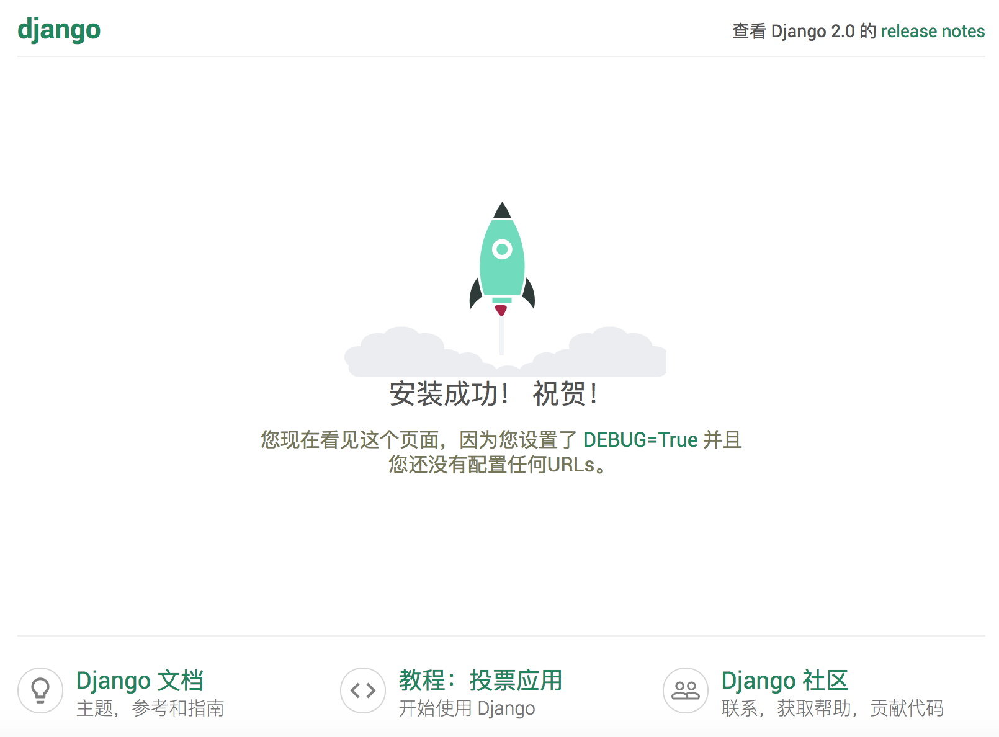
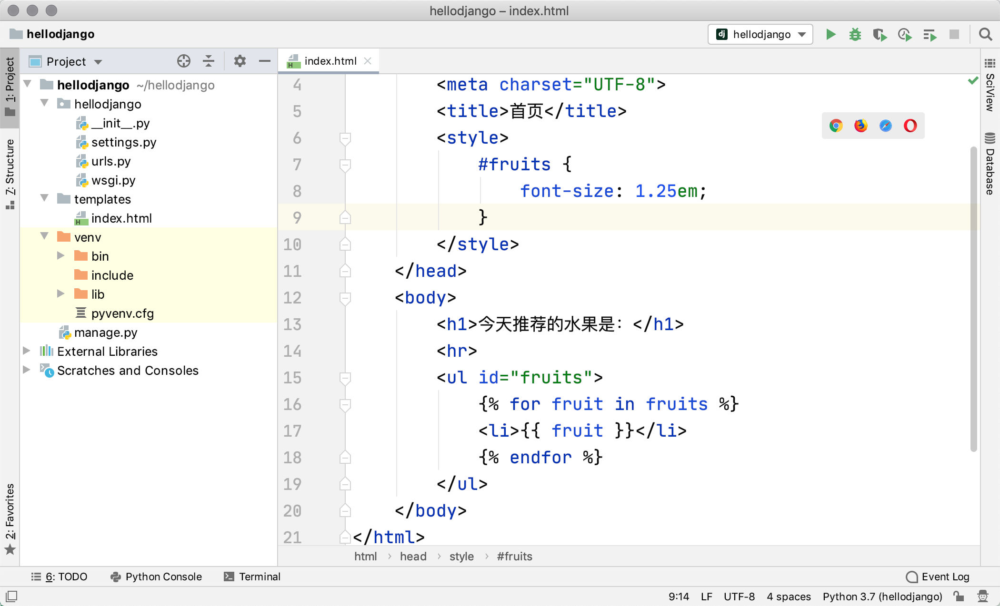

## Getting Started with Django Quickly

In the early days of web development, developers had to manually write every page. For example, a news portal website would need its HTML pages modified daily. As the scale and volume of a website grew, this approach was clearly terrible. To solve this problem, developers came up with using programs to generate dynamic content for web servers, meaning that dynamic content on web pages was no longer manually written but automatically generated by programs. In the earliest days, this technology was called CGI (Common Gateway Interface). Of course, as time went on, CGI exposed more and more problems, such as large amounts of repetitive boilerplate code and generally low performance. Against this backdrop of the era calling for new heroes, web application development technologies like PHP, ASP, and JSP emerged like mushrooms after rain in the mid-to-late 1990s. What we usually call a web application refers to an application that accesses network resources through a browser. Due to the ubiquity and ease of use of browsers, web applications are convenient and simple to use, eliminating the hassle of installing and updating applications. From a developer's perspective, there's no need to worry about what operating system users are running, or even to distinguish between PC and mobile.

### Web Application Mechanisms and Terminology

The diagram below shows the workflow of a web application. The terms involved are listed in the table below.


> **Note**: Experienced readers will notice that this diagram is actually missing many elements, such as reverse proxy servers, database servers, firewalls, etc. Moreover, each node in the diagram may actually be a cluster of nodes in real project deployments. Of course, if you don't have a clear concept of these things, don't worry - just keep going, and we'll explain each one later.

| Term              | Explanation                                                  |
| ----------------- | ------------------------------------------------------------ |
| **URL/URI**       | Uniform Resource Locator/Uniform Resource Identifier, the unique identifier of a network resource |
| **Domain Name**   | A memorable string name that corresponds to a web server address |
| **DNS**           | Domain Name System, which can convert domain names to corresponding IP addresses |
| **IP Address**    | The identity identifier of a host on the network; different hosts can be distinguished through IP addresses |
| **HTTP**          | HyperText Transfer Protocol, an application-level protocol built on top of TCP, the foundation of data communication on the World Wide Web |
| **Reverse Proxy** | Proxies client requests to the server, then returns the resources from the server back to the client |
| **Web Server**    | Accepts HTTP requests and returns resources such as HTML files, plain text files, images, etc. to the requester |
| **Nginx**         | A high-performance web server that can also be used as a [reverse proxy](https://zh.wikipedia.org/wiki/%E5%8F%8D%E5%90%91%E4%BB%A3%E7%90%86), [load balancer](https://zh.wikipedia.org/wiki/%E8%B4%9F%E8%BD%BD%E5%9D%87%E8%A1%A1) and [HTTP cache](https://zh.wikipedia.org/wiki/HTTP%E7%BC%93%E5%AD%98) |

#### The HTTP Protocol

Let's spend some time discussing the HTTP protocol. HTTP (HyperText Transfer Protocol) is an application-level protocol built on top of TCP (Transmission Control Protocol). It uses the reliable transport service provided by TCP to implement data exchange in web applications. According to Wikipedia, the initial purpose of designing HTTP was to provide a method for publishing and receiving [HTML](https://zh.wikipedia.org/wiki/HTML) pages, meaning that this protocol is the carrier for data transmitted between browsers and web servers. For detailed information about this protocol and its current development, you can read [Introduction to HTTP Protocol](http://www.ruanyifeng.com/blog/2016/08/http.html), the [Introduction to Internet Protocols](http://www.ruanyifeng.com/blog/2012/05/internet_protocol_suite_part_i.html) series, and [Illustrated HTTPS Protocol](http://www.ruanyifeng.com/blog/2014/09/illustration-ssl.html). The image below shows the HTTP request and response messages (protocol data) captured when visiting the Baidu homepage, using the open-source protocol analysis tool Ethereal (the predecessor of the packet capture tool WireShark) during my study and work at the Sichuan Province Key Laboratory of Network Communication Technology. Since Ethereal captures data passing through the network adapter, you can clearly see the protocol data from the physical link layer to the application layer.

HTTP Request (request line + request headers + blank line + [message body]):


HTTP Response (response line + response headers + blank line + message body):


>  **Note**: These two screenshots were captured in the early morning of September 10, 2009. I hope these somewhat aged screenshots can help you understand what HTTP actually looks like. Of course, without professional packet capture tools, you can also use the "Developer Tools" provided by your browser to view the data format of HTTP requests and responses.

### Django Overview

Python has over a hundred web frameworks, more than its keywords. A so-called web framework is the infrastructure for developing web server-side applications - in plain terms, it's a set of pre-packaged modules and tools. In fact, even without a web framework, we can still develop web server-side applications using sockets or [CGI](https://zh.wikipedia.org/wiki/%E9%80%9A%E7%94%A8%E7%BD%91%E5%85%B3%E6%8E%A5%E5%8F%A3), but the cost and price of doing so is usually unacceptable in commercial projects. Through web frameworks, we can simplify things and reduce the workload of creating, updating, and extending applications. As we just mentioned, Python has over a hundred web frameworks, including Django, Flask, Tornado, Sanic, Pyramid, Bottle, Web2py, web.py, and more.

Among the Python web frameworks mentioned above, Django is undoubtedly the most representative heavyweight contender. Developers can quickly build reliable web applications based on Django because it reduces unnecessary overhead in web development, encapsulates common design and development patterns, and provides support for the MVC architecture (referred to as MTV architecture in Django). MVC is a universally applicable architecture in software system development. It divides the components of a system into Model, View, and Controller, thereby achieving decoupling of the model (data) and view (display). Since the model and view are separated, an intermediary is needed to connect the decoupled model and view, and the controller plays this role. Software systems of any significant scale use the MVC architecture (or other architectures evolved from MVC). In Django projects, we call it MTV, where M in MTV is the same as M in MVC, representing the data model. T represents web templates (the view for displaying data), and V represents view functions. In the Django framework, view functions together with the Django framework itself play the role of C in MVC.


The Django framework was born in 2003. It is a project that grew from real-world applications, developed by the CMS (Content Management System) team of an online news website under the Lawrence Publishing Group (mainly Adrian Holovaty and Simon Willison), named after the Belgian gypsy jazz guitarist Django Reinhardt. The Django framework was released as an open-source framework in the summer of 2005. Using the Django framework, you can build a fully functional website in a very short time because it handles the repetitive and tedious work for the programmer, leaving only the truly meaningful core business for the programmer to develop. This is the best practice of the DRY (Don't Repeat Yourself) principle. Many successful websites and applications are developed based on the Python language. Domestically, representative websites include: Zhihu, Douban, Guokr, Sohu Flash Mail, 101weiqi, Haibao Fashion, Beishuba, Duitang, Mobile Sohu, Codoon, Aiwowo, Guoku, and others, many of which use the Django framework.

### Quick Start

#### Your First Django Project

1. Check your Python environment: Django 1.11 requires Python 2.7 or Python 3.4+; Django 2.0 requires Python 3.4+; Django 2.1 and 2.2 require Python 3.5+; Django 3.0 requires Python 3.6+.

   > **Note**: The Python interpreter environment required by different versions of the Django framework can be found in the Django official documentation's [FAQ](https://docs.djangoproject.com/zh-hans/3.0/faq/install/#faq-python-version-support).

   You can enter the following command in the macOS terminal to check the Python interpreter version. On Windows, you can enter `python --version` in the command prompt.

   ```Bash
python3 --version
   ```

   You can also run the following code in Python's interactive environment to check the Python interpreter version.

   ```Shell
   import sys
   sys.version
   sys.version_info
   ```

2. Update the package management tool and install the Django environment (used to create Django projects).

   > **Note**: At the time of updating this document, the latest official version of Django is 3.0.7. Django 3.0 provides support for ASGI, enabling full-duplex asynchronous communication, but the current user experience is mediocre, so it is not recommended to use Django 3.0 for now. Below we install Django version 2.2.13. When using `pip` to install third-party libraries and tools, you can specify the version to install with `==`.

   ```Bash
   pip3 install -U pip
   pip3 install django==2.2.13
   ```

3. Check the Django environment and use the `django-admin` command to create a Django project (project name: hellodjango).

   ```Shell
   django-admin --version
   django-admin startproject hellodjango
   ```

4. Open the created Django project with PyCharm and add a virtual environment for it.

   

   As shown in the image above, in PyCharm's project explorer, the top-level folder `hellodjango` is the Python project folder. The name of this folder is not important, and the Django project doesn't care what this folder is called. Under this folder, there is a folder with the same name, which is the Django project folder. It contains four files: `__init__.py`, `settings.py`, `urls.py`, and `wsgi.py`. At the same level as the Django project folder named `hellodjango`, there is also a file named `manage.py`. The roles of these files are as follows:

   - `hellodjango/__init__.py`: An empty file that tells the Python interpreter this directory should be treated as a Python package.
   - `hellodjango/settings.py`: The configuration file for the Django project.
   - `hellodjango/urls.py`: The URL mapping declarations for the Django project, like a "table of contents" for the website.
   - `hellodjango/wsgi.py`: The entry point file for running the project on WSGI-compatible web servers.
   - `manage.py`: A script for managing the Django project.

   > Note: WSGI stands for Web Server Gateway Interface. Wikipedia describes it as "a simple and universal interface defined between [web servers](https://zh.wikipedia.org/wiki/%E7%B6%B2%E9%A0%81%E4%BC%BA%E6%9C%8D%E5%99%A8) and [web applications](https://zh.wikipedia.org/wiki/%E7%BD%91%E7%BB%9C%E5%BA%94%E7%94%A8%E7%A8%8B%E5%BA%8F) or frameworks for the Python language."

   The interface for creating a virtual environment is shown in the image below.

   

5. Install project dependencies.

   Method 1: Open PyCharm's terminal and install Django project dependencies via the `pip` command in the terminal.

   > **Note**: Since we have already created a virtual environment based on the Python 3 interpreter for the project, the `python` command in the virtual environment corresponds to the Python 3 interpreter, and the `pip` command corresponds to the Python 3 package management tool.

   ```Shell
   pip install django==2.2.13
   ```

   Method 2: In PyCharm's preferences, you can find the project's interpreter environment and already installed third-party libraries. You can install new dependencies by clicking the add button. Note that when installing the Django dependency, you need to specify the version number, otherwise it will default to installing the latest version 3.0.7 at the time of writing.

   

   The table below shows the correspondence between Django versions and Python versions. Please match accordingly.

   | Django Version | Python Versions                           |
   | -------------- | ----------------------------------------- |
   | 1.8            | 2.7, 3.2, 3.3, 3.4, 3.5                  |
   | 1.9, 1.10      | 2.7, 3.4, 3.5                             |
   | 1.11           | 2.7, 3.4, 3.5, 3.6, 3.7 (Django 1.11.17) |
   | 2.0            | 3.4, 3.5, 3.6, 3.7                        |
   | 2.1            | 3.5, 3.6, 3.7                             |
   | 2.2            | 3.5, 3.6, 3.7, 3.8 (Django 2.2.8)        |
   | 3.0            | 3.6, 3.7, 3.8                             |

6. Start the Django built-in server to run the project.

   Method 1: In the "Run" menu, select "Edit Configuration" and configure "Django server" to run the project (applicable to PyCharm Professional Edition).

   

   Method 2: In the "Run" menu, select "Edit Configuration" and configure a "Python" program to run the project (applicable to both Professional and Community Editions of PyCharm).

   

   Method 3: Run the project via command in PyCharm's Terminal (applicable to both Professional and Community Editions of PyCharm).

   ```Shell
   python manage.py runserver
   ```

7. View the running result.

  Enter `http://127.0.0.1:8000` in your browser to access our server. The result is shown in the image below.

   

   > **Notes**:
   >
   > 1. The Django built-in server that was just started can only be used for development and testing environments, as this server is a lightweight web server written in pure Python, not suitable for production environments.
   > 2. If you modify the code, you don't need to restart the Django built-in server for the changes to take effect. However, when adding new project files, the server won't automatically reload, and you'll need to manually restart the server.
   > 3. You can view the available command parameters for the Django management script by running `python manage.py help` in the terminal.
   > 4. When starting the server with `python manage.py runserver`, you can add parameters to specify the IP address and port number. By default, the server will run on port `8000` on localhost.
   > 5. A server running in the terminal can be stopped with Ctrl+C. A server started through PyCharm's "Run Configuration" can be terminated by clicking the close button on the window.
   > 6. You cannot start multiple servers on the same port, as this will cause address conflicts (a port is an extension of an IP address and is part of a computer network address).
8. Modify the project configuration file `settings.py`.

   Django is a framework that supports internationalization and localization, so the default homepage of the Django project we just saw also supports internationalization. We can modify the configuration file to change the default language to Chinese and set the timezone to East Asia (UTC+8).

   Find the original configuration (after line 100 in `settings.py`).

   ```Python
   LANGUAGE_CODE = 'en-us'
   TIME_ZONE = 'UTC'
   ```

   Change it to the following content.

   ```Python
   LANGUAGE_CODE = 'zh-hans'
   TIME_ZONE = 'Asia/Chongqing'
   ```

   Refresh the previous page to see the result after modifying the language code and timezone.

   

#### Creating Your Own Application

If you want to develop your own web application, you need to first create an "app" in the Django project. A Django project can contain one or more apps.

1. Execute the following command in PyCharm's terminal to create an app named `first`.

   ```Shell
   python manage.py startapp first
   ```

   Executing the above command will create a `first` directory in the current path, with the following directory structure:

   - `__init__.py`: An empty file that tells the Python interpreter this directory should be treated as a Python package.
   - `admin.py`: Can be used to register models for managing them in Django's built-in admin backend.
   -  `apps.py`: Configuration file for the current app.
   - `migrations`: Stores database migration information related to models.
     - `__init__.py`: An empty file that tells the Python interpreter this directory should be treated as a Python package.
   - `models.py`: Stores the app's data models (M in MTV).
   - `tests.py`: Contains test classes and test functions for testing various features of the app.
   - `views.py`: Functions or classes that handle user HTTP requests and return HTTP responses (V in MTV).

2. Modify the view file `views.py` in the app directory.

   ```Python
   from django.http import HttpResponse


   def show_index(request):
       return HttpResponse('<h1>Hello, Django!</h1>')
   ```

4. Modify the `urls.py` file in the Django project directory to map the view function to the path that users request in the browser.

   ```Python
   from django.contrib import admin
   from django.urls import path, include

   from first.views import show_index

   urlpatterns = [
       path('admin/', admin.site.urls),
       path('hello/', show_index),
   ]
   ```

5. Re-run the project and open `http://127.0.0.1:8000/hello/` in your browser.

5. Above we generated content for the browser through code, but it's still static content. To generate dynamic content, you can modify `views.py` and add the following code.

   ```Python
   from random import sample

   from django.http import HttpResponse


   def show_index(request):
       fruits = [
           'Apple', 'Orange', 'Pitaya', 'Durian', 'Waxberry', 'Blueberry',
           'Grape', 'Peach', 'Pear', 'Banana', 'Watermelon', 'Mango'
       ]
       selected_fruits = sample(fruits, 3)
       content = '<h3>Today\'s recommended fruits are:</h3>'
       content += '<hr>'
       content += '<ul>'
       for fruit in selected_fruits:
           content += f'<li>{fruit}</li>'
       content += '</ul>'
       return HttpResponse(content)
   ```

6. Refresh the page to see the program's output. See if you get different content each time you refresh the page.


#### Using Templates

The approach of generating dynamic content for the browser by concatenating HTML code above is unacceptable in actual development, because real project front-end pages can be very complex and cannot be completed by concatenating dynamic content this way - everyone can surely understand this. To solve this problem, we can prepare a template page (T in MTV) in advance. A template page is an HTML page with placeholders and template directives.

The Django framework has a convenient function called `render` that can complete the template rendering operation. Rendering means replacing the template directives and placeholders in the template page with data. Of course, this rendering is called backend rendering, meaning the page is rendered on the server side before being output to the browser. When a web application has high traffic, backend rendering puts significant load on the server, so more and more web applications choose frontend rendering, where the server only provides the data needed by the page (usually in JSON format), and JavaScript code in the browser retrieves this data and renders the page. We will cover frontend rendering in later chapters. Currently, we are using backend rendering through template pages, with the specific steps as follows.

The steps for using template pages are as follows.

1. Create a folder named templates in the project directory.

   

2. Add the template page `index.html`.

   > **Note**: In actual project development, static pages are provided by front-end developers. Backend developers need to modify the static pages into template pages so that they can be rendered by Python programs. This approach is the backend rendering mentioned above.

   ```HTML
   <!DOCTYPE html>
   <html lang="en">
       <head>
           <meta charset="UTF-8">
           <title>Home</title>
           <style>
               #fruits {
                   font-size: 1.25em;
               }
           </style>
       </head>
       <body>
           <h1>Today's recommended fruits are:</h1>
           <hr>
           <ul id="fruits">
               
               <li>{{ fruit }}</li>
               
           </ul>
       </body>
   </html>
   ```
   In the template page above, we used the template placeholder syntax `{{ fruit }}` and the template directive ``, which are part of the Django Template Language (DTL). For template syntax and directives, you can refer to the official documentation - these are quite easy to understand and don't need much elaboration. You can also refer to the [official documentation]() to learn about template directives and syntax.

3. Modify the `views.py` file to call the `render` function to render the template page.

   ```Python
   from random import sample

   from django.shortcuts import render


   def show_index(request):
       fruits = [
           'Apple', 'Orange', 'Pitaya', 'Durian', 'Waxberry', 'Blueberry',
           'Grape', 'Peach', 'Pear', 'Banana', 'Watermelon', 'Mango'
       ]
       selected_fruits = sample(fruits, 3)
       return render(request, 'index.html', {'fruits': selected_fruits})
   ```

   The first parameter of the `render` function is the request object `request`, the second parameter is the name of the template page we want to render, and the third parameter is the data to be rendered on the page. We pass the data to the template page through a dictionary, where the keys in the dictionary are the variable names used in the template directives or placeholders in the template page.

4. At this point, the `render` in the view function still cannot find the template file `index.html`. We need to modify `settings.py` to configure the path where template files are located. Modify `settings.py`, find the `TEMPLATES` configuration, and update the `DIRS` setting.

   ```Python
   TEMPLATES = [
       {
           'BACKEND': 'django.template.backends.django.DjangoTemplates',
           'DIRS': [os.path.join(BASE_DIR, 'templates'), ],
           'APP_DIRS': True,
           'OPTIONS': {
               'context_processors': [
                   'django.template.context_processors.debug',
                   'django.template.context_processors.request',
                   'django.contrib.auth.context_processors.auth',
                   'django.contrib.messages.context_processors.messages',
               ],
           },
       },
   ]
   ```

5. Re-run the project or simply refresh the page to see the results.

### Summary

At this point, we have completed a very small web application using the Django framework. Although it has no practical value, it gives you a hands-on feel for the Django framework. The best resource for learning Django is certainly its [official documentation](https://docs.djangoproject.com/zh-hans/2.0/). The official documentation provides support for multiple languages and includes beginner tutorials to guide newcomers in learning the Django framework. It is recommended to learn and use this framework by reading Django's official documentation. Of course, the [Django for Beginners](http://www.ituring.com.cn/book/2630) book published by Turing Community is also an excellent introductory read for beginners. Interested readers can click the link to purchase it.
