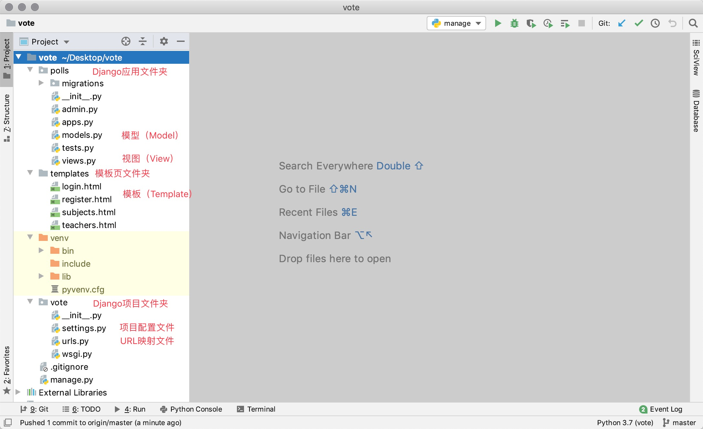
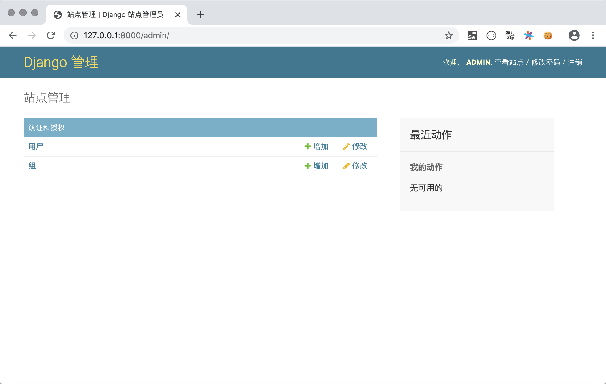
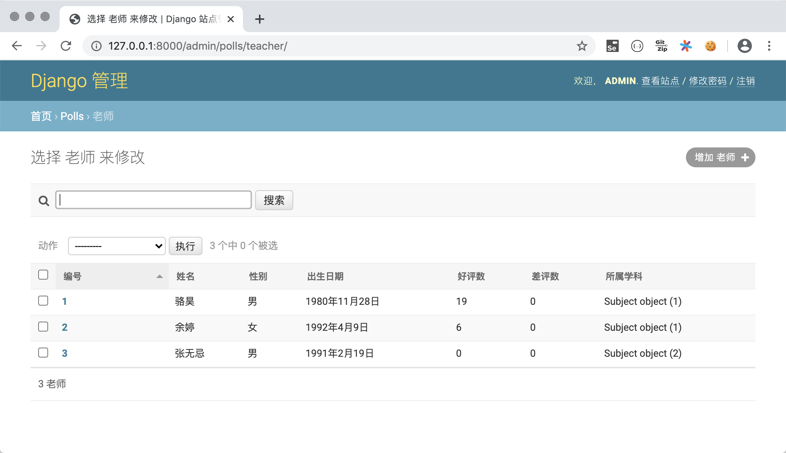

## Deep Dive into Models

In the previous chapter, we mentioned that Django is a web framework based on the MVC architecture, and the MVC architecture pursues the decoupling of "models" and "views." The so-called "model," put more plainly, is the (representation of) data, so it is usually also called a "data model." In actual projects, data models usually achieve persistence through databases, and relational databases have been and continue to be the preferred solution for persistence. Below, we will explain the knowledge points related to models by completing a voting project. The voting project homepage will display all subjects of an online education platform; clicking on a subject will show the teachers and their information for that subject; logged-in users can vote for teachers on the teacher page, casting either upvotes or downvotes; users who are not logged in can log in through the login page; users who have not yet registered can register by entering their personal information on the registration page. In this project, we use the MySQL database for data persistence.

### Creating the Project and Application

First, we create the Django project `vote` and add a virtual environment and dependencies for it. Next, we create an app named `polls` and a folder named `templates` for storing template pages within the project. The project folder structure is shown below.



Based on the project requirements described above, we have prepared four static pages: a page displaying subjects `subjects.html`, a page showing subject teachers `teachers.html`, a login page `login.html`, and a registration page `register.html`. We will later modify the static pages into the template pages required by the Django project.

### Configuring the Relational Database MySQL

1. Create a database in MySQL, create a user, and grant the user access to the database.

   ```SQL
   create database vote default charset utf8;
   create user 'hellokitty'@'%' identified by 'Hellokitty.618';
   grant all privileges on vote.* to 'hellokitty'@'%';
   flush privileges;
   ```

2. Create two-dimensional tables in MySQL to store subject and teacher information (the table for user information will be handled later).

   ```SQL
   use vote;

   -- Create the subject table
   create table `tb_subject`
   (
   	`no` integer auto_increment comment 'Subject ID',
       `name` varchar(50) not null comment 'Subject Name',
       `intro` varchar(1000) not null default '' comment 'Subject Introduction',
       `is_hot` boolean not null default 0 comment 'Is Hot Subject',
       primary key (`no`)
   );
   -- Create the teacher table
   create table `tb_teacher`
   (
       `no` integer auto_increment comment 'Teacher ID',
       `name` varchar(20) not null comment 'Teacher Name',
       `sex` boolean not null default 1 comment 'Teacher Gender',
       `birth` date not null comment 'Date of Birth',
       `intro` varchar(1000) not null default '' comment 'Teacher Introduction',
       `photo` varchar(255) not null default '' comment 'Teacher Photo',
       `gcount` integer not null default 0 comment 'Upvote Count',
       `bcount` integer not null default 0 comment 'Downvote Count',
       `sno` integer not null comment 'Subject Affiliation',
       primary key (`no`),
       foreign key (`sno`) references `tb_subject` (`no`)
   );
   ```

3. Install the dependencies required for connecting to the MySQL database in the virtual environment.

   ```Bash
   pip install mysqlclient
   ```

   > **Note**: If you are unable to install the `mysqlclient` third-party library for some reason, you can use its alternative `pymysql`. `pymysql` is a pure Python library for connecting to MySQL, which is easier to install successfully, but you need to add the following code in the Django project folder's `__init__.py`.
   >
   > ```Python
   > import pymysql
   >
   > pymysql.install_as_MySQLdb()
   > ```
   >
   > If using Django 2.2 or above, you will also encounter compatibility issues between PyMySQL and the Django framework. These compatibility issues will prevent the project from running and need to be resolved according to the methods provided in the PyMySQL repository's [Issues](https://github.com/PyMySQL/PyMySQL/issues/790) on GitHub. Overall, using `pymysql` can be quite troublesome, and it is strongly recommended to install `mysqlclient` first.

4. Modify the project's settings.py file. First, add our created app `polls` to the installed apps (`INSTALLED_APPS`), then configure MySQL as the persistence solution.

   ```Python
   INSTALLED_APPS = [
       'django.contrib.admin',
       'django.contrib.auth',
       'django.contrib.contenttypes',
       'django.contrib.sessions',
       'django.contrib.messages',
       'django.contrib.staticfiles',
       'polls',
   ]

   DATABASES = {
       'default': {
           # Database engine configuration
           'ENGINE': 'django.db.backends.mysql',
           # Database name
           'NAME': 'vote',
           # Database server IP address (use localhost or 127.0.0.1 for local machine)
           'HOST': 'localhost',
           # Port number for the MySQL service
           'PORT': 3306,
           # Database username and password
           'USER': 'hellokitty',
           'PASSWORD': 'Hellokitty.618',
           # Character set used by the database
           'CHARSET': 'utf8',
           # Timezone setting for database date and time
           'TIME_ZONE': 'Asia/Chongqing',
       }
   }
   ```

   When configuring the ENGINE property, commonly available options include:

   - `'django.db.backends.sqlite3'`: SQLite embedded database.
   - `'django.db.backends.postgresql'`: An open-source relational database product released under the BSD license.
   - `'django.db.backends.mysql'`: Oracle Corporation's cost-effective database product.
   - `'django.db.backends.oracle'`: Oracle Corporation's flagship relational database product.

   Other configurations can be found in the [database configuration](https://docs.djangoproject.com/zh-hans/2.0/ref/databases/#third-party-notes) section of the official documentation.

5. The Django framework provides ORM to solve the data persistence problem. ORM stands for "Object-Relational Mapping." Since Python is an object-oriented programming language, we use object models to store data in Python programs, while relational databases use relational models and two-dimensional tables to store data - these two models don't match. Using ORM is to achieve **bidirectional conversion** between the object model and the relational model, so you don't need to write SQL statements and cursor operations in Python code, as these will all be done automatically by ORM. Using Django's ORM, we can directly convert the subject and teacher tables we just created into Django model classes.

   ```Bash
   python manage.py inspectdb > polls/models.py
   ```

   We can make some slight adjustments to the auto-generated model classes, as shown below.

   ```Python
   from django.db import models


   class Subject(models.Model):
       no = models.AutoField(primary_key=True, verbose_name='ID')
       name = models.CharField(max_length=50, verbose_name='Name')
       intro = models.CharField(max_length=1000, verbose_name='Introduction')
       is_hot = models.BooleanField(verbose_name='Is Hot')

       class Meta:
           managed = False
           db_table = 'tb_subject'


   class Teacher(models.Model):
       no = models.AutoField(primary_key=True, verbose_name='ID')
       name = models.CharField(max_length=20, verbose_name='Name')
       sex = models.BooleanField(default=True, verbose_name='Gender')
       birth = models.DateField(verbose_name='Date of Birth')
       intro = models.CharField(max_length=1000, verbose_name='Introduction')
       photo = models.ImageField(max_length=255, verbose_name='Photo')
       good_count = models.IntegerField(default=0, db_column='gcount', verbose_name='Upvotes')
       bad_count = models.IntegerField(default=0, db_column='bcount', verbose_name='Downvotes')
       subject = models.ForeignKey(Subject, models.DO_NOTHING, db_column='sno')

       class Meta:
           managed = False
           db_table = 'tb_teacher'
   ```

   > **Note**: All model classes directly or indirectly inherit from the `Model` class. Model classes correspond to two-dimensional tables in the relational database, model objects correspond to records in the table, and model object attributes correspond to fields in the table. If you don't fully understand the attribute definitions in the model classes above, you can refer to the "Model Definition Reference" section provided later in this article.

### Using ORM for CRUD Operations on Models

With Django's ORM framework, we can directly use object-oriented methods to perform CRUD (Create, Read, Update, Delete) operations on data. We can enter the following command in PyCharm's terminal to enter the Django project's interactive environment, and then try model operations.

```Bash
python manage.py shell
```

#### Create

```Python
from polls.models import Subject

subject1 = Subject(name='Python Full Stack Development', intro='The hottest subject right now', is_hot=True)
subject1.save()
subject2 = Subject(name='Full Stack Software Testing', intro='Subject for learning automated testing', is_hot=False)
subject2.save()
subject3 = Subject(name='JavaEE Distributed Development', intro='Server application development based on Java', is_hot=True)
```

#### Delete

```Python
subject = Subject.objects.get(no=2)
subject.delete()
```

#### Update

```Shell
subject = Subject.objects.get(no=1)
subject.name = 'Python Full Stack + AI'
subject.save()
```

#### Query

1. Query all objects.

```Shell
Subject.objects.all()
```

2. Filter data.

```Shell
# Query subjects with the name "Python Full Stack + AI"
Subject.objects.filter(name='Python Full Stack + AI')

# Query subjects whose name contains "Full Stack" (fuzzy query)
Subject.objects.filter(name__contains='Full Stack')
Subject.objects.filter(name__startswith='Full Stack')
Subject.objects.filter(name__endswith='Full Stack')

# Query all hot subjects
Subject.objects.filter(is_hot=True)

# Query subjects with ID greater than 3 and less than 10
Subject.objects.filter(no__gt=3).filter(no__lt=10)
Subject.objects.filter(no__gt=3, no__lt=10)

# Query subjects with ID between 3 and 7
Subject.objects.filter(no__ge=3, no__le=7)
Subject.objects.filter(no__range=(3, 7))
```

3. Query a single object.

```Shell
# Query the subject with primary key 1
Subject.objects.get(pk=1)
Subject.objects.get(no=1)
Subject.objects.filter(no=1).first()
Subject.objects.filter(no=1).last()
```

4. Sorting.

```Shell
# Query all subjects sorted by ID in ascending order
Subject.objects.order_by('no')
# Query all subjects sorted by ID in descending order
Subject.objects.order_by('-no')
```

5. Slicing (paginated queries).

```Shell
# Query the first 3 subjects sorted by ID from smallest to largest
Subject.objects.order_by('no')[:3]
```

6. Counting.

```Python
# Query the total number of subjects
Subject.objects.count()
```

7. Advanced queries.

```Shell
# Query teachers belonging to the subject with ID 1
Teacher.objects.filter(subject__no=1)
Subject.objects.get(pk=1).teacher_set.all()

# Query teachers of subjects whose name contains "Full Stack"
Teacher.objects.filter(subject__name__contains='Full Stack')
```

> **Note 1**: Since there is a many-to-one foreign key relationship between teachers and subjects, you can reverse-query from a subject to find its teachers (querying the "many" side from the "one" side in a one-to-many relationship). The default name for the reverse query attribute is `classname_lowercase_set` (like `teacher_set` in the example above). You can also specify the name of the reverse query attribute through the `related_name` attribute of `ForeignKey` when creating the model. If you don't want to allow reverse queries, you can set the `related_name` attribute to `'+'` or a string starting with `'+'`.

> **Note 2**: When ORM queries return multiple objects, it returns a QuerySet object. QuerySets use lazy evaluation, meaning that no database activity occurs during the creation of the QuerySet object. SQL statements are only sent to the database when the objects are actually used (when the QuerySet is evaluated). This is something to be aware of in actual development!

> **Note 3**: If you want to update multiple records, you don't need to first retrieve each model object and then modify object attributes individually. You can directly use the QuerySet's `update()` method to update multiple records at once.


### Managing Models with Django Admin

After creating the model classes, you can use Django's built-in admin application (`admin` app) to manage the models. Although in actual applications, this admin may not meet all our needs, when learning the Django framework, we can use the `admin` app to manage our models and also understand what features a project's admin system needs. The steps for using Django's built-in `admin` app are as follows.

1. Migrate the tables required by the `admin` app to the database. The `admin` app itself also needs database support, and the relevant data model classes have already been defined in the `admin` app. We only need to perform the model migration operation to automatically generate the required two-dimensional tables in the database.

   ```Bash
   python manage.py migrate
   ```

2. Create a superuser account to access the `admin` app. You will need to enter a username, email, and password.

   ```Shell
   python manage.py createsuperuser
   ```

   > **Note**: There is no echo or backspace when entering the password, so you need to type it all at once without mistakes.

3. Run the project and visit `http://127.0.0.1:8000/admin` in your browser. Enter the superuser account and password you just created to log in.

   

   After logging in, you enter the admin dashboard.

   

   Note that we cannot yet see the model classes we created earlier in the `admin` app. To do this, we need to register the models that need to be managed in the `admin.py` file of the `polls` app.

4. Register model classes.

   ```Python
   from django.contrib import admin

   from polls.models import Subject, Teacher

   admin.site.register(Subject)
   admin.site.register(Teacher)
   ```

   After registering the model classes, they will be visible in the admin system.

   

5. Perform CRUD operations on models.

   You can perform C (Create), R (Read), U (Update), D (Delete) operations on models in the admin dashboard, as shown below.

   - Add a subject.

       

   - View all subjects.

       

   - Delete and update subjects.

       

6. Register model admin classes.

   You may have noticed that when viewing subject information in the admin earlier, the displayed information was not very intuitive. So let's modify `admin.py` again. By registering model admin classes, we can better manage models in the admin system.

   ```Python
   from django.contrib import admin

   from polls.models import Subject, Teacher


   class SubjectModelAdmin(admin.ModelAdmin):
       list_display = ('no', 'name', 'intro', 'is_hot')
       search_fields = ('name', )
       ordering = ('no', )


   class TeacherModelAdmin(admin.ModelAdmin):
       list_display = ('no', 'name', 'sex', 'birth', 'good_count', 'bad_count', 'subject')
       search_fields = ('name', )
       ordering = ('no', )


   admin.site.register(Subject, SubjectModelAdmin)
   admin.site.register(Teacher, TeacherModelAdmin)
   ```

   

   

   For better model display, we add a `__str__` magic method to the `Subject` class that returns the subject name. This way, on the teacher listing page shown above, when displaying the teacher's subject, it will show the subject name instead of the cryptic `Subject object(1)`.

### Implementing the Subject and Teacher Page Effects

1. Modify `polls/views.py` to write view functions that render the subject and teacher pages.

    ```Python
    from django.shortcuts import render, redirect

    from polls.models import Subject, Teacher


    def show_subjects(request):
        subjects = Subject.objects.all().order_by('no')
        return render(request, 'subjects.html', {'subjects': subjects})


    def show_teachers(request):
        try:
            sno = int(request.GET.get('sno'))
            teachers = []
            if sno:
                subject = Subject.objects.only('name').get(no=sno)
                teachers = Teacher.objects.filter(subject=subject).order_by('no')
            return render(request, 'teachers.html', {
                'subject': subject,
                'teachers': teachers
            })
        except (ValueError, Subject.DoesNotExist):
            return redirect('/')
   ```

2. Modify the `templates/subjects.html` and `templates/teachers.html` template pages.

    `subjects.html`

     ```HTML
    <!DOCTYPE html>
    <html lang="en">
    <head>
        <meta charset="UTF-8">
        <title>Subject Information</title>
        <style>
            #container {
                width: 80%;
                margin: 10px auto;
            }
            .user {
                float: right;
                margin-right: 10px;
            }
            .user>a {
                margin-right: 10px;
            }
            #main>dl>dt {
                font-size: 1.5em;
                font-weight: bold;
            }
            #main>dl>dd {
                font-size: 1.2em;
            }
            a {
                text-decoration: none;
                color: darkcyan;
            }
        </style>
    </head>
    <body>
        <div id="container">
            <div class="user">
                <a href="login.html">User Login</a>
                <a href="register.html">Quick Register</a>
            </div>
            <h1>All Subjects</h1>
            <hr>
            <div id="main">
                
                <dl>
                    <dt>
                        <a href="/teachers/?sno={{ subject.no }}">{{ subject.name }}</a>
                        
                        
                        
                    </dt>
                    <dd>{{ subject.intro }}</dd>
                </dl>
                
            </div>
        </div>
    </body>
    </html>
     ```

    `teachers.html`

    ```HTML
    <!DOCTYPE html>
    <html lang="en">
    <head>
        <meta charset="UTF-8">
        <title>Teacher Information</title>
        <style>
            #container {
                width: 80%;
                margin: 10px auto;
            }
            .teacher {
                width: 100%;
                margin: 0 auto;
                padding: 10px 0;
                border-bottom: 1px dashed gray;
                overflow: auto;
            }
            .teacher>div {
                float: left;
            }
            .photo {
                height: 140px;
                border-radius: 75px;
                overflow: hidden;
                margin-left: 20px;
            }
            .info {
                width: 75%;
                margin-left: 30px;
            }
            .info div {
                clear: both;
                margin: 5px 10px;
            }
            .info span {
                margin-right: 25px;
            }
            .info a {
                text-decoration: none;
                color: darkcyan;
            }
        </style>
    </head>
    <body>
        <div id="container">
            <h1>Teachers of {{ subject.name }}</h1>
            <hr>
            
                <h2>No teacher information available for this subject</h2>
            
            
            <div class="teacher">
                <div class="photo">
                    
                </div>
                <div class="info">
                    <div>
                        <span><strong>Name: {{ teacher.name }}</strong></span>
                        <span>Gender: {{ teacher.sex | yesno:'Male,Female' }}</span>
                        <span>Date of Birth: {{ teacher.birth | date:'M j, Y'}}</span>
                    </div>
                    <div class="intro">{{ teacher.intro }}</div>
                    <div class="comment">
                        <a href="">Upvote</a>&nbsp;(<strong>{{ teacher.good_count }}</strong>)
                        &nbsp;&nbsp;&nbsp;&nbsp;
                        <a href="">Downvote</a>&nbsp;<strong>{{ teacher.bad_count }}</strong>)
                    </div>
                </div>
            </div>
            
            <a href="/">Back to Home</a>
        </div>
    </body>
    </html>
    ```

3. Modify `vote/urls.py` to set up URL mappings.

    ```Python
    from django.contrib import admin
    from django.urls import path

    from polls.views import show_subjects, show_teachers

    urlpatterns = [
        path('admin/', admin.site.urls),
        path('', show_subjects),
        path('teachers/', show_teachers),
    ]
    ```

At this point, the images (static resources) needed on the pages are still not displaying properly. We will introduce how to handle static resources required by template pages in the next chapter.

### Supplementary Content

#### Django Model Best Practices

1. Name models and relationship fields correctly.
2. Set appropriate `related_name` attributes.
3. Use `OneToOneField` instead of `ForeignKeyField(unique=True)`.
4. Add models through "migration operations" (migrate).
5. Use NoSQL for scenarios that require reduced normalization levels.
6. Use `NullBooleanField` if a boolean type can be null.
7. Place business logic in models.
8. Use `<ModelName>.DoesNotExists` instead of `ObjectDoesNotExists`.
9. Do not allow invalid data in the database.
10. Do not call `len()` on `QuerySet` objects.
11. Use the return value of `QuerySet`'s `exists()` method in `if` conditions.
12. Use `DecimalField` to store monetary data instead of `FloatField`.
13. Define the `__str__` method.
14. Do not place data files in the same directory.

> **Note**: The above content is from STEELKIWI's [*Best Practice working with Django models in Python*](https://steelkiwi.com/blog/best-practices-working-django-models-python/). Interested readers can read the original article.

#### Model Definition Reference

##### Fields

Restrictions on field names:

- Field names cannot be Python reserved words, as this would cause syntax errors
- Field names cannot have multiple consecutive underscores, as this would affect ORM query operations

Django Model Field Classes

| Field Class             | Description                                                  |
| ----------------------- | ------------------------------------------------------------ |
| `AutoField`             | Auto-incrementing ID field                                   |
| `BigIntegerField`       | 64-bit signed integer                                        |
| `BinaryField`           | Field for storing binary data, corresponding to Python's `bytes` type |
| `BooleanField`          | Stores `True` or `False`                                     |
| `CharField`             | Short-length string                                          |
| `DateField`             | Stores dates, has `auto_now` and `auto_now_add` attributes   |
| `DateTimeField`         | Stores date and time, same two additional attributes as above |
| `DecimalField`          | Stores fixed-precision decimals, with two required parameters: `max_digits` (total digits) and `decimal_places` (decimal places) |
| `DurationField`         | Stores time duration                                         |
| `EmailField`            | Same as `CharField`, can be validated with `EmailValidator`  |
| `FileField`             | File upload field                                            |
| `FloatField`            | Stores floating-point numbers                                |
| `ImageField`            | Same as `FileField`, but validates the uploaded file is a valid image |
| `IntegerField`          | Stores 32-bit signed integer                                 |
| `GenericIPAddressField` | Stores IPv4 or IPv6 addresses                                |
| `NullBooleanField`      | Stores `True`, `False`, or `null` values                     |
| `PositiveIntegerField`  | Stores unsigned integers (positive numbers only)             |
| `SlugField`             | Stores slugs (short labels)                                  |
| `SmallIntegerField`     | Stores 16-bit signed integer                                 |
| `TextField`             | Stores large amounts of text data                            |
| `TimeField`             | Stores time                                                  |
| `URLField`              | `CharField` for storing URLs                                 |
| `UUIDField`             | Stores universally unique identifiers                        |

##### Field Attributes

Common field attributes

| Option           | Description                                                  |
| ---------------- | ------------------------------------------------------------ |
| `null`           | Whether the corresponding database field allows `NULL`, default is `False` |
| `blank`          | Whether to allow `NULL` when validating data in admin, default is `False` |
| `choices`        | Sets field options; the first value in each tuple is the value set on the model, the second is the human-readable value |
| `db_column`      | Column name in the database table corresponding to the field; uses the field name if not specified |
| `db_index`       | When set to `True`, creates an index on this field           |
| `db_tablespace`  | Sets the tablespace to use for indexed fields, default is `DEFAULT_INDEX_TABLESPACE` |
| `default`        | Default value for the field                                  |
| `editable`       | Whether the field is displayed in admin or `ModelForm`, default is `True` |
| `error_messages` | Dictionary of default messages when the field raises exceptions; keys include `null`, `blank`, `invalid`, `invalid_choice`, `unique`, and `unique_for_date` |
| `help_text`      | Extra help text displayed next to the form widget            |
| `primary_key`    | Designates the field as the model's primary key; an `AutoField` is automatically added for the primary key if not specified; read-only |
| `unique`         | When set to `True`, the field value must be unique in the table |
| `verbose_name`   | Display name of the field in admin; uses the field name if not specified |

`ForeignKey` Attributes

1. `limit_choices_to`: A Q object or a function returning a Q object, used to limit which objects are displayed in admin.
2. `related_name`: Used to get the related manager object for the associated object (reverse query). If reverse queries are not allowed, this attribute should be set to `'+'` or end with `'+'`.
3. `to_field`: Specifies the related field; defaults to the primary key field of the related object.
4. `db_constraint`: Whether to create a constraint for the foreign key; default is `True`.
5. `on_delete`: The action to take when the foreign-key-referenced object is deleted. Available values defined in `django.db.models` include:
   - `CASCADE`: Cascade delete.
   - `PROTECT`: Raise a `ProtectedError` exception, preventing deletion of the referenced object.
   - `SET_NULL`: Set the foreign key to `null`; only possible when the `null` attribute is set to `True`.
   - `SET_DEFAULT`: Set the foreign key to its default value; only possible when a default value is provided.

`ManyToManyField` Attributes

1. `symmetrical`: Whether to establish a symmetrical many-to-many relationship.
2. `through`: Specifies the Django model for the intermediate table maintaining the many-to-many relationship.
3. `throughfields`: When an intermediate model is defined, specifies the fields that establish the many-to-many relationship.
4. `db_table`: Specifies the table name of the intermediate table maintaining the many-to-many relationship.

##### Model Metadata Options

| Option                  | Description                                                  |
| ----------------------- | ------------------------------------------------------------ |
| `abstract`              | When set to True, the model is an abstract parent class      |
| `app_label`             | Can be used to specify the app if the model is defined outside of INSTALLED_APPS |
| `db_table`              | The database table name used by the model                    |
| `db_tablespace`         | The database tablespace used by the model                    |
| `default_related_name`  | The default name used when related objects reference this model; defaults to <model_name>_set |
| `get_latest_by`         | The name of a sortable field in the model                    |
| `managed`               | When set to True, Django creates the table during migration and removes it during the flush management command |
| `order_with_respect_to` | Marks the object as sortable                                 |
| `ordering`              | Default ordering for objects                                 |
| `permissions`           | Extra permissions written to the permissions table when creating objects |
| `default_permissions`   | Defaults to `('add', 'change', 'delete')`                    |
| `unique_together`       | Sets field names that must be unique when combined           |
| `index_together`        | Sets multiple field names to be indexed together             |
| `verbose_name`          | Sets a human-readable name for the object                    |
| `verbose_name_plural`   | Sets the plural name for the object                          |

#### Query Reference

##### Lookup Conditions Available for Field Queries

1. `exact` / `iexact`: Exact match / case-insensitive exact match
2. `contains` / `icontains` / `startswith` / `istartswith` / `endswith` / `iendswith`: `like`-based fuzzy queries
3. `in`: Set operations
4. `gt` / `gte` / `lt` / `lte`: Greater than / greater than or equal to / less than / less than or equal to
5. `range`: Range query (SQL's `between...and...`)
6. `year` / `month` / `day` / `week_day` / `hour` / `minute` / `second`: Query by date and time
7. `isnull`: Query for null values (True) or non-null values (False)
8. `search`: Full-text search based on full-text index (rarely used)
9. `regex` / `iregex`: Regex-based fuzzy matching queries
