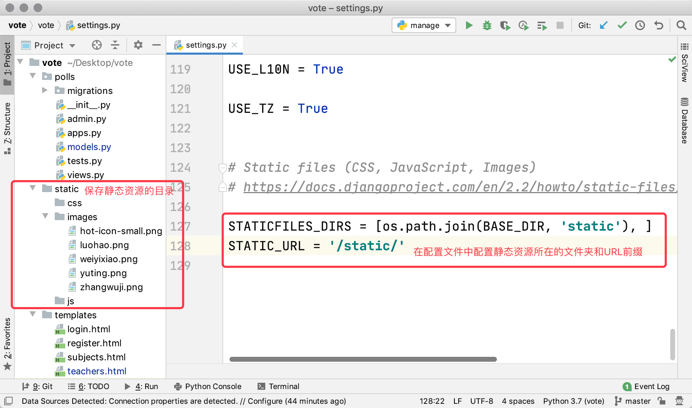
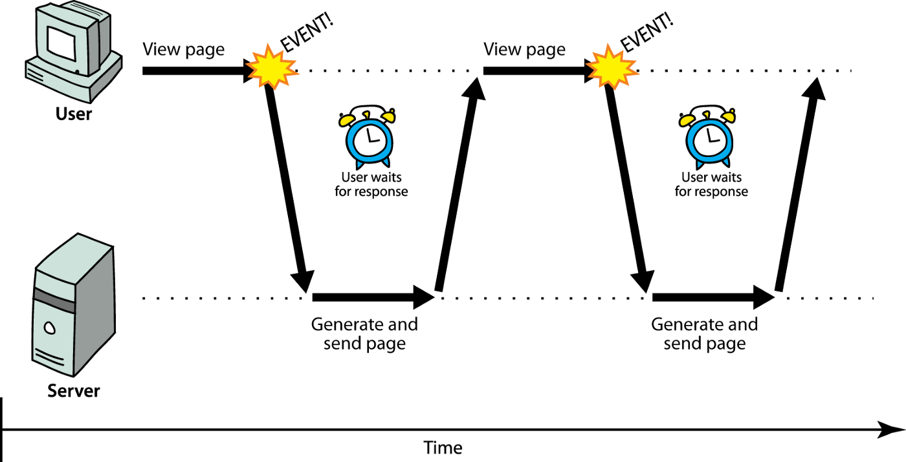
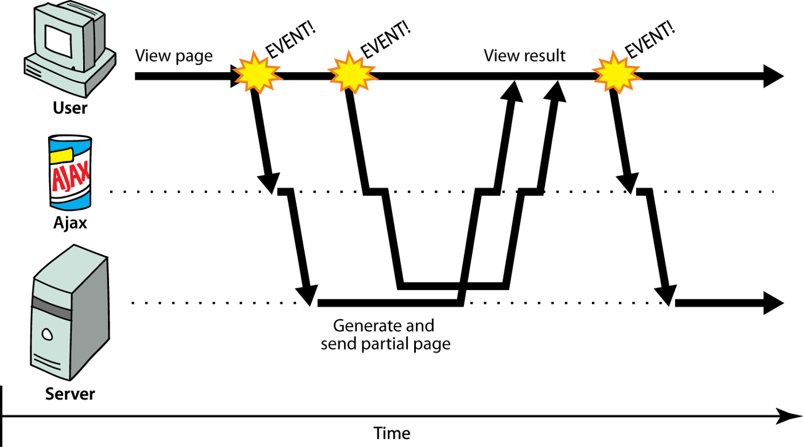

## Static Resources and Ajax Requests

### Loading Static Resources

If you want to use static resources in a Django project, you can first create a directory for saving static resources. In the `vote` project, we place static resources in a folder named `static`, which contains three subfolders: css, js, and images, used for saving external CSS files, external JavaScript files, and image resources respectively, as shown below.



To enable Django to find the folder containing static resources, we also need to modify the Django project's configuration file `settings.py`, as shown below:

```Python
STATICFILES_DIRS = [os.path.join(BASE_DIR, 'static'), ]
STATIC_URL = '/static/'
```

After configuring the static resources, you can run the project and check whether the images on the pages we wrote earlier can load correctly. It should be noted that when the project is officially deployed to a production environment, we typically hand off static resources to dedicated static resource servers (such as Nginx, Apache) for handling, rather than having the server running Python code manage static resources. So the above configuration is not suitable for production environments and is only for use during the project development phase. We will explain the proper way to use static resources in later chapters.

### Ajax Overview

Next, we can implement the "upvote" and "downvote" functionality. Obviously, being able to implement these two features without refreshing the page would provide a better user experience, so we consider using [Ajax](https://zh.wikipedia.org/wiki/AJAX) technology to implement "upvote" and "downvote." Ajax is an abbreviation for Asynchronous JavaScript And XML. Simply put, using Ajax technology allows you to partially refresh a page without reloading the entire page.

For traditional web applications, every time new content needs to be loaded on the page, it requires re-requesting the server and refreshing the entire page. If the server cannot respond in a short time or network conditions are not ideal, this may cause the browser to remain blank for a long time, leaving the user waiting and unable to do anything during this period, as shown below. Obviously, such a web application does not provide a good user experience.



For web applications using Ajax technology, the browser can send asynchronous requests to the server to retrieve data. Asynchronous requests do not interrupt the user experience. When the server returns new data, we can use JavaScript code to perform DOM operations to partially refresh the page, which is equivalent to updating the page content without refreshing the entire page, as shown below.



When using Ajax technology, browsers and servers typically exchange data in XML or JSON format. XML was a very commonly used data format in the past, but in recent years it has been almost entirely replaced by JSON. Below is a comparison of the two data formats.

XML format:

```XML
<?xml version="1.0" encoding="utf-8"?>
<message>
	<from>Alice</from>
    <to>Bob</to>
    <content>Dinner is on me!</content>
</message>
```

JSON format:

```JSON
{
    "from": "Alice",
    "to": "Bob",
    "content": "Dinner is on me!"
}
```

From the comparison above, JSON format data is clearly much more compact, so it has higher transmission efficiency. Moreover, JSON itself is an object expression syntax in JavaScript, making it more convenient to process JSON format data in JavaScript code.

### Implementing the Voting Feature with Ajax

Below, we use Ajax technology to implement the voting feature. First, modify the project's `urls.py` file to map the corresponding URLs for the "upvote" and "downvote" functions.

```Python
from django.contrib import admin
from django.urls import path

from polls import views

urlpatterns = [
    path('', views.show_subjects),
    path('teachers/', views.show_teachers),
    path('praise/', views.praise_or_criticize),
    path('criticize/', views.praise_or_criticize),
    path('admin/', admin.site.urls),
]
```

Design the view function `praise_or_criticize` to support the "upvote" and "downvote" functionality. This view function serializes a dictionary into a JSON string using Django's `JsonResponse` class as the response returned to the browser.

```Python
def praise_or_criticize(request):
    """Upvote"""
    try:
        tno = int(request.GET.get('tno'))
        teacher = Teacher.objects.get(no=tno)
        if request.path.startswith('/praise'):
            teacher.good_count += 1
            count = teacher.good_count
        else:
            teacher.bad_count += 1
            count = teacher.bad_count
        teacher.save()
        data = {'code': 20000, 'mesg': 'Operation successful', 'count': count}
    except (ValueError, Teacher.DoseNotExist):
        data = {'code': 20001, 'mesg': 'Operation failed'}
    return JsonResponse(data)
```

Modify the template page that displays teacher information, introducing the jQuery library to implement event handling, Ajax requests, and DOM operations.

```HTML
<!DOCTYPE html>
<html lang="en">
<head>
    <meta charset="UTF-8">
    <title>Teacher Information</title>
    <style>
        #container {
            width: 80%;
            margin: 10px auto;
        }
        .teacher {
            width: 100%;
            margin: 0 auto;
            padding: 10px 0;
            border-bottom: 1px dashed gray;
            overflow: auto;
        }
        .teacher>div {
            float: left;
        }
        .photo {
            height: 140px;
            border-radius: 75px;
            overflow: hidden;
            margin-left: 20px;
        }
        .info {
            width: 75%;
            margin-left: 30px;
        }
        .info div {
            clear: both;
            margin: 5px 10px;
        }
        .info span {
            margin-right: 25px;
        }
        .info a {
            text-decoration: none;
            color: darkcyan;
        }
    </style>
</head>
<body>
    <div id="container">
        <h1>Teachers of {{ subject.name }}</h1>
        <hr>
        
            <h2>No teacher information available for this subject</h2>
        
        
        <div class="teacher">
            <div class="photo">
                
            </div>
            <div class="info">
                <div>
                    <span><strong>Name: {{ teacher.name }}</strong></span>
                    <span>Gender: {{ teacher.sex | yesno:'Male,Female' }}</span>
                    <span>Date of Birth: {{ teacher.birth }}</span>
                </div>
                <div class="intro">{{ teacher.intro }}</div>
                <div class="comment">
                    <a href="/praise/?tno={{ teacher.no }}">Upvote</a>&nbsp;&nbsp;
                    (<strong>{{ teacher.good_count }}</strong>)
                    &nbsp;&nbsp;&nbsp;&nbsp;
                    <a href="/criticize/?tno={{ teacher.no }}">Downvote</a>&nbsp;&nbsp;
                    (<strong>{{ teacher.bad_count }}</strong>)
                </div>
            </div>
        </div>
        
        <a href="/">Back to Home</a>
    </div>
    <script src="https://cdn.bootcss.com/jquery/3.4.1/jquery.min.js"></script>
    <script>
        $(() => {
            $('.comment>a').on('click', (evt) => {
                evt.preventDefault()
                let url = $(evt.target).attr('href')
                $.getJSON(url, (json) => {
                    if (json.code == 20000) {
                        $(evt.target).next().text(json.count)
                    } else {
                        alert(json.mesg)
                    }
                })
            })
        })
    </script>
</body>
</html>
```

In the frontend code above, we used jQuery's `getJSON` method to send asynchronous requests to the server. If you are not familiar with the jQuery library for frontend development, you can refer to the [jQuery API Manual](https://www.runoob.com/manual/jquery/).

### Summary

At this point, the core functionality of this voting project is essentially complete. In the following chapters, we will require users to be logged in to vote, and users without an account can register one through the registration feature.
