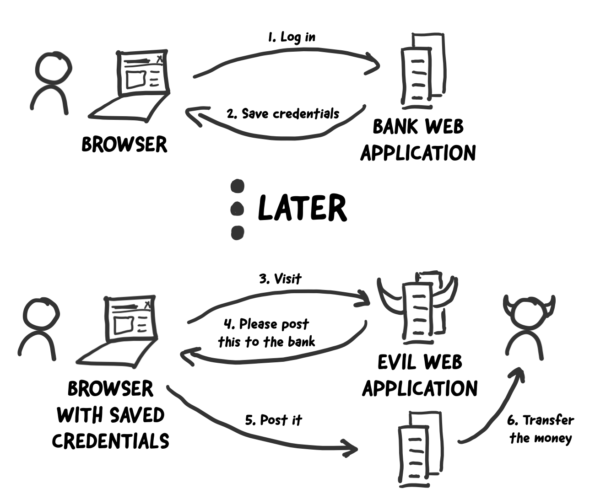
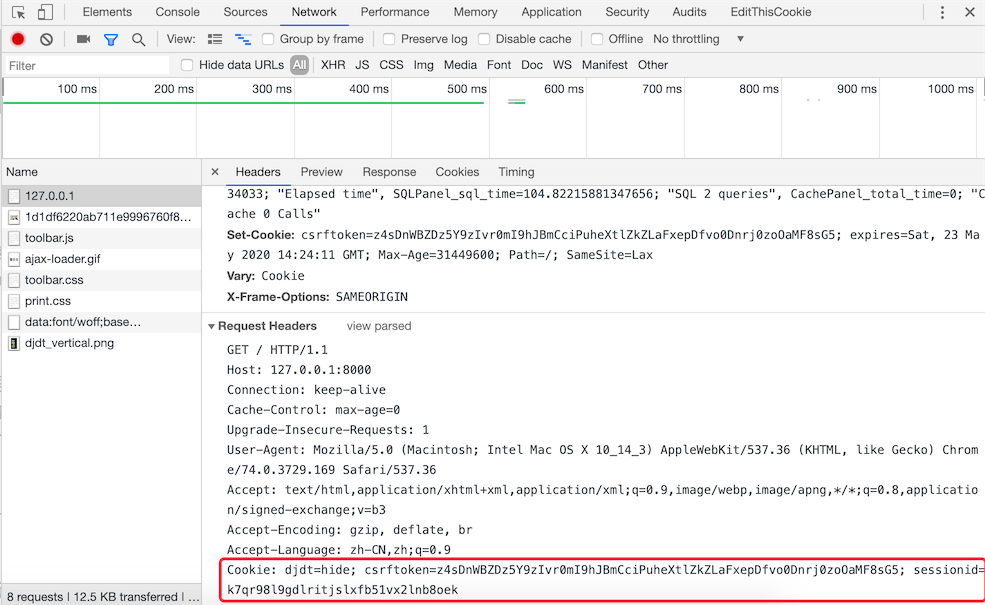

## Cookies and Sessions

We continue to work on the project from the previous chapter, implementing the "user login" feature and restricting voting to logged-in users only.

### Preparations for User Login

Let's first do some preparation work for implementing user login.

1. Create the User model. Previously, we explained how to convert from two-dimensional tables to models using Django's ORM (reverse engineering). This time, we try to convert models into two-dimensional tables (forward engineering).

    ```Python
    class User(models.Model):
        """User"""
        no = models.AutoField(primary_key=True, verbose_name='ID')
        username = models.CharField(max_length=20, unique=True, verbose_name='Username')
        password = models.CharField(max_length=32, verbose_name='Password')
        tel = models.CharField(max_length=20, verbose_name='Phone Number')
        reg_date = models.DateTimeField(auto_now_add=True, verbose_name='Registration Date')
        last_visit = models.DateTimeField(null=True, verbose_name='Last Login Time')

        class Meta:
            db_table = 'tb_user'
            verbose_name = 'User'
            verbose_name_plural = 'Users'
    ```

2. Use the following commands to generate migration files and execute the migration, converting the `User` model directly into the two-dimensional table `tb_user` in the relational database.

    ```Bash
    python manage.py makemigrations polls
    python manage.py migrate polls
    ```

3. Use the following SQL statements to directly insert two test records. Typically, user passwords should not be stored directly in the database, so we process user passwords into their corresponding MD5 digests. The MD5 message digest algorithm is a widely used cryptographic hash function that produces a 128-bit hash value, used to ensure complete and consistent information transmission. When using hash values, they are usually represented as hexadecimal strings, so a 128-bit MD5 digest is typically represented as 32 hexadecimal characters.

    ```SQL
    insert into `tb_user`
        (`username`, `password`, `tel`, `reg_date`)
    values
        ('wangdachui', '1c63129ae9db9c60c3e8aa94d3e00495', '13122334455', now()),
        ('hellokitty', 'c6f8cf68e5f68b0aa4680e089ee4742c', '13890006789', now());
    ```

    > **Note**: The two users created above, `wangdachui` and `hellokitty`, have passwords `1qaz2wsx` and `Abc123!!` respectively.

4. We add a module named `utils.py` under the app to store utility functions. The `hashlib` module in Python's standard library encapsulates commonly used hash algorithms, including MD5, SHA1, SHA256, etc. Below is a function that uses the `md5` class from `hashlib` to process a string into an MD5 digest.

    ```Python
    import hashlib


    def gen_md5_digest(content):
        return hashlib.md5(content.encode()).hexdigest()
    ```

5. Write the view function and template page for user login.

    Add the view function for rendering the login page:

    ```Python
    def login(request: HttpRequest) -> HttpResponse:
        hint = ''
        return render(request, 'login.html', {'hint': hint})
    ```

    Add the `login.html` template page:

    ```HTML
    <!DOCTYPE html>
    <html lang="en">
    <head>
        <meta charset="UTF-8">
        <title>User Login</title>
        <style>
            #container {
                width: 520px;
                margin: 10px auto;
            }
            .input {
                margin: 20px 0;
                width: 460px;
                height: 40px;
            }
            .input>label {
                display: inline-block;
                width: 140px;
                text-align: right;
            }
            .input>img {
                width: 150px;
                vertical-align: middle;
            }
            input[name=captcha] {
                vertical-align: middle;
            }
            form+div {
                margin-top: 20px;
            }
            form+div>a {
                text-decoration: none;
                color: darkcyan;
                font-size: 1.2em;
            }
            .button {
                width: 500px;
                text-align: center;
                margin-top: 20px;
            }
            .hint {
                color: red;
                font-size: 12px;
            }
        </style>
    </head>
    <body>
        <div id="container">
            <h1>User Login</h1>
            <hr>
            <p class="hint">{{ hint }}</p>
            <form action="/login/" method="post">
                
                <fieldset>
                    <legend>User Information</legend>
                    <div class="input">
                        <label>Username:</label>
                        <input type="text" name="username">
                    </div>
                    <div class="input">
                        <label>Password:</label>
                        <input type="password" name="password">
                    </div>
                    <div class="input">
                        <label>Captcha:</label>
                        <input type="text" name="captcha">
                        
                    </div>
                </fieldset>
                <div class="button">
                    <input type="submit" value="Login">
                    <input type="reset" value="Reset">
                </div>
            </form>
            <div>
                <a href="/">Back to Home</a>
                <a href="/register/">Register New User</a>
            </div>
        </div>
    </body>
    </html>
    ```

    Note that in the form above, we used the template directive `` to add a hidden field to the form (you can view the page source in the browser to see the `input` tag with `type` attribute set to `hidden` generated by this directive). Its purpose is to generate a random token in the form to prevent [Cross-Site Request Forgery](<https://zh.wikipedia.org/wiki/%E8%B7%A8%E7%AB%99%E8%AF%B7%E6%B1%82%E4%BC%AA%E9%80%A0>) (commonly known as CSRF), which is also a hard requirement from Django when submitting forms. If our form doesn't have such a token, submitting the form will cause Django to return a response with status code `403` (Forbidden), unless we set up CSRF token exemption. The image below is a simple and vivid example of CSRF.

    

Next, we can write the view functions for providing captchas and implementing user login. Before that, let's talk about how a web application implements user tracking and the support Django provides for this. For a web application, after a user logs in successfully, the server must be able to remember that the user is logged in so it can provide better service to the user. Also, the CSRF mentioned above is an attack method that uses phishing websites to steal user login information for malicious operations, all of which are based on user tracking technology. After understanding this background, it becomes clear what operations need to be performed during user login.

### Implementing User Tracking

Nowadays, if a website doesn't use some method to remember who you are and your previous activities on the website, it loses usability and convenience, which could very likely lead to user attrition. So remembering a user (more professionally called **user tracking**) is a necessary feature for the vast majority of web applications.

On the server side, the simplest way to remember a user is to create an object through which all user-related information can be saved. This object is what we commonly call a session (user session object). The problem is that HTTP itself is a **connectionless** (after each request and response process, the server disconnects from the client after completing its response) and **stateless** (when the client initiates a new request to the server, the server has no knowledge of any previous information about this client) protocol. Even though the server saves user data through session objects, there needs to be some way to determine which previously saved session is associated with the current request. Many people can probably think of this: we can assign a globally unique identifier to each session object to identify it - let's call it a sessionid. Each time the client makes a request, as long as it carries this sessionid, we can find the corresponding session object, thereby remembering user information between two requests, which is the user tracking we mentioned earlier.

To make the client remember and carry the sessionid with each request, there are several approaches:

1. URL rewriting. URL rewriting means carrying the sessionid in the URL, for example: `http://www.example.com/index.html?sessionid=123456`. The server retrieves the session object by getting the value of the sessionid parameter.

2. Hidden fields (hidden form fields). When submitting a form, you can send extra data to the server by setting hidden fields in the form. For example: `<input type="hidden" name="sessionid" value="123456">`.

3. Local storage. Modern browsers support multiple local storage solutions, including: cookies, localStorage, sessionStorage, IndexedDB, etc. Among these solutions, cookies have the longest history and are also the most criticized. They are also what we will explain first. Simply put, a cookie is data stored in the browser's temporary files in the form of key-value pairs. With each request, the request header carries the cookies of the current site to the server. So if the sessionid is written to a cookie, the next time a request is made, the server only needs to read the cookie from the request header to get the sessionid, as shown below.

   

   In the HTML5 era, besides cookies, you can also use new local storage APIs to save data, namely the localStorage, sessionStorage, IndexedDB technologies mentioned above, as shown below.

   

**To summarize**, to implement user tracking, the server can create a session object for each user session and write the session object's ID into the browser's cookie. When the user requests the server next time, the browser will carry the cookie information saved for that website in the HTTP request header, so the server can find the session object's ID from the cookie and retrieve the previously created session object based on this ID. Since the session object can save user data in key-value pairs, all information previously saved in the session object can be fully retrieved, and the server can also use this information to determine user identity and understand user preferences, providing better personalized services to users.

### Django's Support for Sessions

When creating a Django project, the default configuration file `settings.py` already has a middleware called `SessionMiddleware` activated (we will explain middleware in detail in later chapters; for now, you just need to know it exists). Because of this middleware, we can directly operate the session object through the request object's `session` attribute. As we mentioned before, the `session` attribute is a container object that can read and write data like a dictionary, so we can use "key-value pair" methods to retain user data. At the same time, the `SessionMiddleware` also encapsulates cookie operations, saving the sessionid in cookies, which we already mentioned above.

By default, Django serializes session data and stores it in a relational database. In versions after Django 1.6, the default method for serializing data is JSON serialization, while before that it always used Pickle serialization. The difference between JSON serialization and Pickle serialization is that the former serializes objects into strings (character form), while the latter serializes objects into byte strings (binary form). For security reasons, JSON serialization has become the current default data serialization method in the Django framework, which requires that data saved in sessions must be JSON-serializable, otherwise an exception will be raised. Another point to note is that using a relational database to store session data is not the best choice in most cases, because the database may bear enormous pressure and become a performance bottleneck for the system. In later chapters, we will show you how to save sessions to cache services to improve system performance.

### Implementing User Login Verification

First, we write the `gen_random_code` function for generating random captcha codes in the `polls/utils.py` file we just created, with the following content.

```Python
import random

ALL_CHARS = '0123456789abcdefghijklmnopqrstuvwxyzABCDEFGHIJKLMNOPQRSTUVWXYZ'


def gen_random_code(length=4):
    return ''.join(random.choices(ALL_CHARS, k=length))
```

Write the `Captcha` class for generating captcha images.

```Python
"""
Image Captcha
"""
import os
import random
from io import BytesIO

from PIL import Image
from PIL import ImageFilter
from PIL.ImageDraw import Draw
from PIL.ImageFont import truetype


class Bezier:
    """Bezier curve"""

    def __init__(self):
        self.tsequence = tuple([t / 20.0 for t in range(21)])
        self.beziers = {}

    def make_bezier(self, n):
        """Draw Bezier curve"""
        try:
            return self.beziers[n]
        except KeyError:
            combinations = pascal_row(n - 1)
            result = []
            for t in self.tsequence:
                tpowers = (t ** i for i in range(n))
                upowers = ((1 - t) ** i for i in range(n - 1, -1, -1))
                coefs = [c * a * b for c, a, b in zip(combinations,
                                                      tpowers, upowers)]
                result.append(coefs)
            self.beziers[n] = result
            return result


class Captcha:
    """Captcha"""

    def __init__(self, width, height, fonts=None, color=None):
        self._image = None
        self._fonts = fonts if fonts else \
            [os.path.join(os.path.dirname(__file__), 'fonts', font)
             for font in ['Arial.ttf', 'Georgia.ttf', 'Action.ttf']]
        self._color = color if color else random_color(0, 200, random.randint(220, 255))
        self._width, self._height = width, height

    @classmethod
    def instance(cls, width=200, height=75):
        """Class method for getting a Captcha object"""
        prop_name = f'_instance_{width}_{height}'
        if not hasattr(cls, prop_name):
            setattr(cls, prop_name, cls(width, height))
        return getattr(cls, prop_name)

    def _background(self):
        """Draw background"""
        Draw(self._image).rectangle([(0, 0), self._image.size],
                                    fill=random_color(230, 255))

    def _smooth(self):
        """Smooth the image"""
        return self._image.filter(ImageFilter.SMOOTH)

    def _curve(self, width=4, number=6, color=None):
        """Draw curves"""
        dx, height = self._image.size
        dx /= number
        path = [(dx * i, random.randint(0, height))
                for i in range(1, number)]
        bcoefs = Bezier().make_bezier(number - 1)
        points = []
        for coefs in bcoefs:
            points.append(tuple(sum([coef * p for coef, p in zip(coefs, ps)])
                                for ps in zip(*path)))
        Draw(self._image).line(points, fill=color if color else self._color, width=width)

    def _noise(self, number=50, level=2, color=None):
        """Draw noise"""
        width, height = self._image.size
        dx, dy = width / 10, height / 10
        width, height = width - dx, height - dy
        draw = Draw(self._image)
        for i in range(number):
            x = int(random.uniform(dx, width))
            y = int(random.uniform(dy, height))
            draw.line(((x, y), (x + level, y)),
                      fill=color if color else self._color, width=level)

    def _text(self, captcha_text, fonts, font_sizes=None, drawings=None, squeeze_factor=0.75, color=None):
        """Draw text"""
        color = color if color else self._color
        fonts = tuple([truetype(name, size)
                       for name in fonts
                       for size in font_sizes or (65, 70, 75)])
        draw = Draw(self._image)
        char_images = []
        for c in captcha_text:
            font = random.choice(fonts)
            c_width, c_height = draw.textsize(c, font=font)
            char_image = Image.new('RGB', (c_width, c_height), (0, 0, 0))
            char_draw = Draw(char_image)
            char_draw.text((0, 0), c, font=font, fill=color)
            char_image = char_image.crop(char_image.getbbox())
            for drawing in drawings:
                d = getattr(self, drawing)
                char_image = d(char_image)
            char_images.append(char_image)
        width, height = self._image.size
        offset = int((width - sum(int(i.size[0] * squeeze_factor)
                                  for i in char_images[:-1]) -
                      char_images[-1].size[0]) / 2)
        for char_image in char_images:
            c_width, c_height = char_image.size
            mask = char_image.convert('L').point(lambda i: i * 1.97)
            self._image.paste(char_image,
                              (offset, int((height - c_height) / 2)),
                              mask)
            offset += int(c_width * squeeze_factor)

    @staticmethod
    def _warp(image, dx_factor=0.3, dy_factor=0.3):
        """Warp the image"""
        width, height = image.size
        dx = width * dx_factor
        dy = height * dy_factor
        x1 = int(random.uniform(-dx, dx))
        y1 = int(random.uniform(-dy, dy))
        x2 = int(random.uniform(-dx, dx))
        y2 = int(random.uniform(-dy, dy))
        warp_image = Image.new(
            'RGB',
            (width + abs(x1) + abs(x2), height + abs(y1) + abs(y2)))
        warp_image.paste(image, (abs(x1), abs(y1)))
        width2, height2 = warp_image.size
        return warp_image.transform(
            (width, height),
            Image.QUAD,
            (x1, y1, -x1, height2 - y2, width2 + x2, height2 + y2, width2 - x2, -y1))

    @staticmethod
    def _offset(image, dx_factor=0.1, dy_factor=0.2):
        """Offset the image"""
        width, height = image.size
        dx = int(random.random() * width * dx_factor)
        dy = int(random.random() * height * dy_factor)
        offset_image = Image.new('RGB', (width + dx, height + dy))
        offset_image.paste(image, (dx, dy))
        return offset_image

    @staticmethod
    def _rotate(image, angle=25):
        """Rotate the image"""
        return image.rotate(random.uniform(-angle, angle),
                            Image.BILINEAR, expand=1)

    def generate(self, captcha_text='', fmt='PNG'):
        """Generate captcha (text and image)
        :param captcha_text: captcha text
        :param fmt: generated captcha image format
        :return: binary data of the captcha image
        """
        self._image = Image.new('RGB', (self._width, self._height), (255, 255, 255))
        self._background()
        self._text(captcha_text, self._fonts,
                   drawings=['_warp', '_rotate', '_offset'])
        self._curve()
        self._noise()
        self._smooth()
        image_bytes = BytesIO()
        self._image.save(image_bytes, format=fmt)
        return image_bytes.getvalue()


def pascal_row(n=0):
    """Generate Pascal's triangle (Yang Hui's triangle)"""
    result = [1]
    x, numerator = 1, n
    for denominator in range(1, n // 2 + 1):
        x *= numerator
        x /= denominator
        result.append(x)
        numerator -= 1
    if n & 1 == 0:
        result.extend(reversed(result[:-1]))
    else:
        result.extend(reversed(result))
    return result


def random_color(start=0, end=255, opacity=255):
    """Get a random color"""
    red = random.randint(start, end)
    green = random.randint(start, end)
    blue = random.randint(start, end)
    if opacity is None:
        return red, green, blue
    return red, green, blue, opacity
```

> **Note**: The code above uses three font files. The font files are located in the `polls/fonts` directory. You can add your own font files, but make sure the font file names match line 45 of the code above.

Next, let's complete the view function that provides the captcha.

```Python
def get_captcha(request: HttpRequest) -> HttpResponse:
    """Captcha"""
    captcha_text = gen_random_code()
    request.session['captcha'] = captcha_text
    image_data = Captcha.instance().generate(captcha_text)
    return HttpResponse(image_data, content_type='image/png')
```

Note line 4 in the code above: we save the randomly generated captcha string to the session. Later, when the user logs in, we need to compare the captcha string saved in the session with the one entered by the user. Only if the user enters the correct captcha can the subsequent login flow proceed, as shown in the code below.

```Python
def login(request: HttpRequest) -> HttpResponse:
    hint = ''
    if request.method == 'POST':
        username = request.POST.get('username')
        password = request.POST.get('password')
        if username and password:
            password = gen_md5_digest(password)
            user = User.objects.filter(username=username, password=password).first()
            if user:
                request.session['userid'] = user.no
                request.session['username'] = user.username
                return redirect('/')
            else:
                hint = 'Invalid username or password'
        else:
            hint = 'Please enter a valid username and password'
    return render(request, 'login.html', {'hint': hint})
```

> **Note**: The code above does not validate the username and password. In actual projects, it is recommended to use regular expressions to validate user input, otherwise invalid data may be sent to the database for processing or cause other security concerns.

In the code above, we set it so that after a successful login, the user's ID (`userid`) and username (`username`) are saved in the session, and the page redirects to the home page. Next, we can slightly adjust the home page code to display the logged-in user's username in the upper right corner. We write this code in a separate HTML file called header.html, and the home page can include this page by adding `` in the `<body>` tag, as shown below.

```HTML
<div class="user">
    
    <span>{{ request.session.username }}</span>
    <a href="/logout">Logout</a>
    
    <a href="/login">Login</a>&nbsp;&nbsp;
    
    <a href="/register">Register</a>
</div>
```

If the user is not logged in, the page will display login and register hyperlinks; after the user logs in successfully, the page will display the username and a logout link. The view function for the logout link is shown below; URL mapping is similar to what we've covered before and won't be repeated here.

```Python
def logout(request):
    """Logout"""
    request.session.flush()
    return redirect('/')
```

The code above destroys the session through the session object's `flush` method, which both clears the user data saved in the session object on the server and deletes the sessionid stored in the browser's cookie. We will explain how to read and write cookies in more detail shortly.

We can find all sessions through the table named `django_session` in the database used by the project. The structure of this table is as follows:

| session_key                      | session_data                    | expire_date                |
| -------------------------------- | ------------------------------- | -------------------------- |
| c9g2gt5cxo0k2evykgpejhic5ae7bfpl | MmI4YzViYjJhOGMyMDJkY2M5Yzg3... | 2019-05-25 23:16:13.898522 |

The first column is the sessionid saved in the browser's cookie; the second column is the session data encoded in BASE64. If you use Python's `base64` to decode it, the decoding process and result are as follows.

```Python
import base64

base64.b64decode('MmI4YzViYjJhOGMyMDJkY2M5Yzg3ZWIyZGViZmUzYmYxNzdlNDdmZjp7ImNhcHRjaGEiOiJzS3d0Iiwibm8iOjEsInVzZXJuYW1lIjoiamFja2ZydWVkIn0=')
```

The third column is the session's expiration time. After the session expires, the sessionid saved in the browser's cookie becomes invalid, but the corresponding record in the database will still exist. If you want to clear expired data, you can use the following command.

```Shell
python manage.py clearsessions
```

The default session expiration time in the Django framework is two weeks (1,209,600 seconds). If you want to change this time, you can add the following code to the project's configuration file.

```Python
# Configure the session timeout to 1 day (86400 seconds)
SESSION_COOKIE_AGE = 86400
```

Many applications with high security requirements must invalidate the session when the browser window is closed, no longer retaining any user information. If you want the session to expire when the browser window is closed (the sessionid in the cookie becomes invalid), you can add the following configuration.

```Python
# Set to True to expire the session when the browser window is closed
SESSION_EXPIRE_AT_BROWSER_CLOSE = True
```

If you don't want to save session data in the database, you can store it in cache instead. The corresponding configuration is shown below; cache configuration and usage will be explained later.

```Python
# Configure session objects to be stored in cache
SESSION_ENGINE = 'django.contrib.sessions.backends.cache'
# Configure which cache group to use for saving sessions
SESSION_CACHE_ALIAS = 'default'
```

If you want to change the default serialization method for session data, you can change the default `JSONSerializer` to `PickleSerializer`.

```Python
SESSION_SERIALIZER = 'django.contrib.sessions.serializers.PickleSerializer'
```

Next, we can restrict voting to logged-in users only. The modified `praise_or_criticize` function is shown below. We check whether the user is logged in by getting the `userid` from `request.session`.

```Python
def praise_or_criticize(request: HttpRequest) -> HttpResponse:
    if request.session.get('userid'):
        try:
            tno = int(request.GET.get('tno'))
            teacher = Teacher.objects.get(no=tno)
            if request.path.startswith('/praise/'):
                teacher.good_count += 1
                count = teacher.good_count
            else:
                teacher.bad_count += 1
                count = teacher.bad_count
            teacher.save()
            data = {'code': 20000, 'mesg': 'Vote successful', 'count': count}
        except (ValueError, Teacher.DoesNotExist):
            data = {'code': 20001, 'mesg': 'Vote failed'}
    else:
        data = {'code': 20002, 'mesg': 'Please login first'}
    return JsonResponse(data)
```

Of course, after modifying the view function, `teachers.html` also needs to be adjusted. If the user is not logged in, they should be directed to the login page, and after successful login, they should return to the voting page. This won't be elaborated further here.

### Reading and Writing Cookies in View Functions

Below we provide a more detailed explanation of how to use cookies to help everyone better use this technology in web projects. Django's `HttpRequest` and `HttpResponse` objects provide operations for reading and writing cookies respectively.

Attributes and methods encapsulated in HttpRequest:

1. `COOKIES` attribute - This attribute contains all cookies carried by the HTTP request.
2. `get_signed_cookie` method - Gets a signed cookie; if signature verification fails, it raises a `BadSignature` exception.

Methods encapsulated in HttpResponse:

1. `set_cookie` method - This method can set a key-value pair that will ultimately be written to the browser.
2. `set_signed_cookie` method - Similar to the method above, but signs the cookie to prevent tampering. Because if cookie data is tampered with, without knowing the [secret key](<https://zh.wikipedia.org/wiki/%E5%AF%86%E9%92%A5>) and [salt](<https://zh.wikipedia.org/wiki/%E7%9B%90_(%E5%AF%86%E7%A0%81%E5%AD%A6)>), a valid signature cannot be generated. When the server reads the cookie, it will find that the data doesn't match the signature and raise a `BadSignature` exception. It should be noted that the secret key mentioned here is the `SECRET_KEY` specified in the Django project configuration file, and the salt is a string set in the program - you can set it to whatever you want, as long as it's a valid string.

For the methods mentioned above, if you're not clear about their specific usage, you can consult the Django [official documentation](<https://docs.djangoproject.com/en/2.1/ref/request-response/>). No resource can explain how these methods work more clearly than the official documentation.

As we mentioned earlier, after activating `SessionMiddleware`, every `HttpRequest` object will have a `session` attribute bound to it. It's a dictionary-like object that, in addition to saving user data, also provides methods for detecting whether the browser supports cookies, including:

1. `set_test_cookie` method - Sets a test cookie.
2. `test_cookie_worked` method - Tests whether the test cookie works.
3. `delete_test_cookie` method - Deletes the test cookie.
4. `set_expiry` method - Sets the session expiration time.
5. `get_expire_age`/`get_expire_date` method - Gets the session expiration time.
6. `clear_expired` method - Clears expired sessions.

Below is code for checking whether the browser supports cookies before performing login. Normally, browsers have cookie support enabled by default, but for some reason, users may have disabled their browser's cookie functionality. When encountering this situation, we can provide a check function in the view function and provide appropriate prompts if we detect that the user's browser doesn't support cookies.

```Python
def login(request):
    if request.method == 'POST':
        if request.session.test_cookie_worked():
            request.session.delete_test_cookie()
            # Add your code to perform login process here
        else:
            return HttpResponse("Please enable cookies and try again.")
    request.session.set_test_cookie()
    return render_to_response('login.html')
```

### Alternatives to Cookies

As we mentioned before, cookies have never had the best reputation. Of course, in actual development, we won't save sensitive user information (such as user passwords, credit card numbers, etc.) in cookies, and data saved in cookies is generally encoded and signed. For browsers that support HTML5, localStorage and sessionStorage can be used as alternatives to cookies. As you can probably tell from the names, data stored in `localStorage` can be retained long-term, while data stored in `sessionStorage` is cleared when the browser is closed. For the usage of these cookie alternatives, it's recommended to check [MDN](<https://developer.mozilla.org/zh-CN/docs/Web>) for more information.
