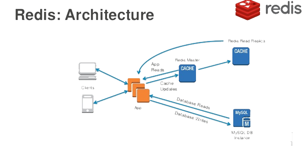

## Using Cache

Typically, the performance bottleneck of a web application occurs at the relational database. When concurrent access volume is high, if all requests need to complete data persistence operations through the relational database, the database will certainly be overwhelmed. The most important point in optimizing web application performance is using cache - preloading data that is small in volume but accessed very frequently into a cache server. This is a typical space-for-time approach. Cache servers typically store data directly in memory and use highly efficient data access strategies (hash storage, key-value pairs, etc.), offering far superior read/write performance compared to relational databases. Therefore, we can connect web applications to cache servers to optimize performance, and one excellent choice is Redis.

The cache architecture of a web application is roughly shown in the diagram below.



### Integrating Redis into a Django Project

In previous chapters, we introduced the installation and usage of Redis, which won't be repeated here. To integrate Redis into a Django project, you can use the third-party library `django-redis`, which depends on a library called `redis` that encapsulates various Redis operations.

Install `django-redis`.

```Bash
pip install django-redis
```

Modify the cache configuration in the Django configuration file.

```Python
CACHES = {
    'default': {
        # Specify connecting to Redis service through django-redis
        'BACKEND': 'django_redis.cache.RedisCache',
        # Redis server URL
        'LOCATION': ['redis://1.2.3.4:6379/0', ],
        # Key prefix in Redis (to resolve naming conflicts)
        'KEY_PREFIX': 'vote',
        # Other configuration options
        'OPTIONS': {
            'CLIENT_CLASS': 'django_redis.client.DefaultClient',
            # Connection pool (pre-allocated Redis connections) parameters
            'CONNECTION_POOL_KWARGS': {
                # Maximum number of connections
                'max_connections': 512,
            },
            # Password for connecting to Redis
            'PASSWORD': 'foobared',
        }
    },
}
```

At this point, our Django project can connect to Redis. Next, we'll modify the project code to use Redis to provide cache services for the previously written subject data retrieval interface.

### Providing Cache Services for Views

#### Declarative Caching

Declarative caching means adding caching functionality to existing code without modifying it, through Python decorators (proxies). For FBV, the code is as follows.

```Python
from django.views.decorators.cache import cache_page


@api_view(('GET', ))
@cache_page(timeout=86400, cache='default')
def show_subjects(request):
    """Get subject data"""
    queryset = Subject.objects.all()
    data = SubjectSerializer(queryset, many=True).data
    return Response({'code': 20000, 'subjects': data})
```

The code above uses Django's `cache_page` decorator to cache the view function's return value (response object). The original purpose of `cache_page` is to cache pages rendered by view functions; for view functions that return JSON data, it effectively caches the JSON data. When using the `cache_page` decorator, you can pass a `timeout` parameter to specify the cache expiration time, and use the `cache` parameter to specify which cache service group to use. Django projects allow configuring multiple cache service groups in the configuration file. The `cache='default'` above specifies using the default cache service (since we only configured a cache service named `default` in the previous configuration file). The view function's return value is serialized into byte strings and stored in Redis (Redis's str type can accept byte strings). The serialization and deserialization of cached data doesn't require us to handle it ourselves, because the `cache_page` decorator calls `RedisCache` from the `django-redis` library to interface with Redis, which uses `DefaultClient` to connect to Redis and uses [pickle serialization](https://python3-cookbook.readthedocs.io/zh_CN/latest/c05/p21_serializing_python_objects.html). `django_redis.serializers.pickle.PickleSerializer` is the default serialization class.

If there's no subject data in the cache, when accessing subject data through the interface, our view function will execute `Subject.objects.all()` to send an SQL statement to the database to get the data. The view function's return value will be cached, so the next request to this view function will directly retrieve the return value from cache if it hasn't expired, without querying the database again. If you want to understand cache usage, you can configure database logging or use Django-Debug-Toolbar to check. The first time you access the subject data interface, you'll see the SQL statement querying subject data; subsequent requests won't send SQL to the database because data can be retrieved directly from cache.

For CBV, you can use Django's `method_decorator` to apply the `cache_page` function decorator to a method in a class, achieving the same effect as the code above. Note that the `cache_page` decorator cannot be directly placed on a class because it's a function decorator, which is why Django provides `method_decorator` to solve this problem. Clearly, `method_decorator` is a class decorator.

```Python
from django.utils.decorators import method_decorator
from django.views.decorators.cache import cache_page


@method_decorator(decorator=cache_page(timeout=86400, cache='default'), name='get')
class SubjectView(ListAPIView):
    """View class for getting subject data"""
    queryset = Subject.objects.all()
    serializer_class = SubjectSerializer
```

#### Programmatic Caching

Programmatic caching means using cache services through code you write yourself. Although this approach requires slightly more code, compared to declarative caching, it offers more flexible cache operations and usage, and is used more frequently in actual development. The code below removes the previously used `cache_page` decorator and directly obtains a Redis connection through the `get_redis_connection` function provided by `django-redis` to operate Redis.

```Python
def show_subjects(request):
    """Get subject data"""
    redis_cli = get_redis_connection()
    # First try to get subject data from cache
    data = redis_cli.get('vote:polls:subjects')
    if data:
        # If subject data is obtained, deserialize it
        data = json.loads(data)
    else:
        # If no subject data is found in cache, query the database
        queryset = Subject.objects.all()
        data = SubjectSerializer(queryset, many=True).data
        # Serialize the queried subject data and put it in cache
        redis_cli.set('vote:polls:subjects', json.dumps(data), ex=86400)
    return Response({'code': 20000, 'subjects': data})
```

It should be noted that Django provides two ready-made variables, `cache` and `caches`, to support cache operations. The former accesses the default cache (the cache named `default`), while the latter can obtain a specified cache service through index operations (e.g., `caches['default']`). Sending `get` and `set` messages to the `cache` object enables read and write operations on the cache, but this approach has limited capabilities and is not as flexible as the method used in the code above. Another point worth noting is that since the Redis connection object obtained through `get_redis_connection` can issue various operations to Redis, including dangerous operations like `FLUSHDB` and `SHUTDOWN`, in actual commercial project development, `django-redis` is usually wrapped again. For example, a utility class can be created that only provides the cache operation methods needed by the project, thereby avoiding the potential risks of directly using `get_redis_connection`. Of course, wrapping your own cache operations also allows implementing cache updates using "Read Through" and "Write Through" patterns, which will be introduced below.

### Cache-Related Issues

#### Updating Cached Data

When using cache, a question that must be clearly understood is: how to update data in the cache when data changes. There are typically several strategies for updating cache:

1. Cache Aside Pattern
2. Read/Write Through Pattern
3. Write Behind Caching Pattern

The first approach works as follows: when data is updated, first update the database, then delete the cache. Note that you cannot use the approach of first updating the database then updating the cache, nor can you use first deleting the cache then updating the database. Think about why (consider scenarios with concurrent read and write operations). Of course, the approach of first updating the database then deleting the cache also has theoretical risks, but the probability of problems occurring is extremely low, so many projects use this approach.

The first approach requires developers writing business code to handle operations on two storage systems (cache and relational database), making the code very tedious. The second approach's main idea is to turn the backend storage system into a single set of code, with cache maintenance encapsulated within this code. Read Through refers to updating the cache during query operations - when the cache expires, the cache service itself is responsible for loading the data, making it transparent to the application. Write Through refers to updating data where, if the cache is not hit, the database is directly updated and the result is returned. If the cache is hit, the cache is updated, and then the cache service itself updates the database (synchronous update). As mentioned earlier, if you wrap your project's Redis operations once more, you can implement "Read Through" and "Write Through" patterns. Although this increases workload, it's undoubtedly a "once and for all" effort with lasting benefits.

The third approach only updates the cache when data is updated, not the database. The cache service then **asynchronously batch updates** the database. This approach significantly improves performance but at the cost of sacrificing **strong consistency**. The implementation logic of the third approach is relatively complex, as it needs to track which data has been updated and then batch flush it to the persistence layer.

#### Cache Penetration

Cache is a middle layer added to relieve database pressure. If malicious visitors frequently access data that doesn't exist in the cache, the cache loses its purpose, and the pressure from all requests falls on the database instantly. This can cause the database to bear enormous pressure and even connection exceptions, similar to a Distributed Denial of Service (DDoS) attack. One solution for cache penetration is to cache the empty value if a query returns empty, but a shorter timeout should be set for this empty value cache, since caching such values is a waste of cache space. Another solution for cache penetration is to use a Bloom filter, which interested readers can learn about on their own.

#### Cache Breakdown

In actual projects, a certain cache key may expire at a specific point in time, but at exactly that moment, a large number of concurrent requests for that key arrive. These requests don't find the data corresponding to the key in cache and go directly to the database to get data and write it back to cache. At this point, the surge of concurrent requests can instantly overwhelm the database. This phenomenon is called cache breakdown. A common solution for cache breakdown is to use a mutex lock. Simply put, when the cache expires, instead of immediately loading data from the database, a mutex lock is first set (e.g., Redis's setnx). Only the request that successfully sets the mutex lock can execute the query to load data from the database and write it to cache. Other requests that fail to set the mutex lock can first perform a brief sleep, then try to retrieve data from cache again. If the cache still has no data, repeat the mutex lock setting operation. The approximate reference code is as follows.

```Python
data = redis_cli.get(key)
while not data:
    if redis_cli.setnx('mutex', 'x'):
        redis.expire('mutex', timeout)
        data = db.query(...)
        redis.set(key, data)
        redis.delete('mutex')
    else:
        time.sleep(0.1)
        data = redis_cli.get(key)
```

#### Cache Avalanche

Cache avalanche refers to the situation where data placed in cache uses the same expiration time, causing the cache to expire simultaneously at a certain moment. All requests are then forwarded to the database, causing the database to crash under instant excessive pressure. The solution to cache avalanche is relatively simple: add a random time to the predetermined cache expiration time, which can prevent different keys from expiring collectively at the same time to some degree. Another approach is to use multi-level caching, where each level of cache has different expiration times. This way, even if one level of cache expires collectively, other levels can still provide data, preventing all requests from falling to the database.
