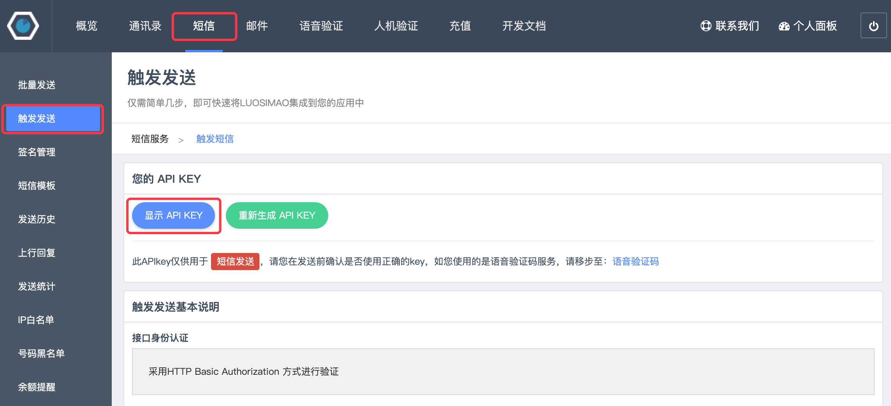
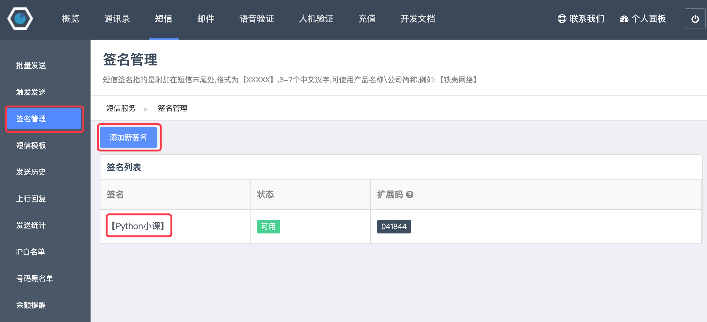
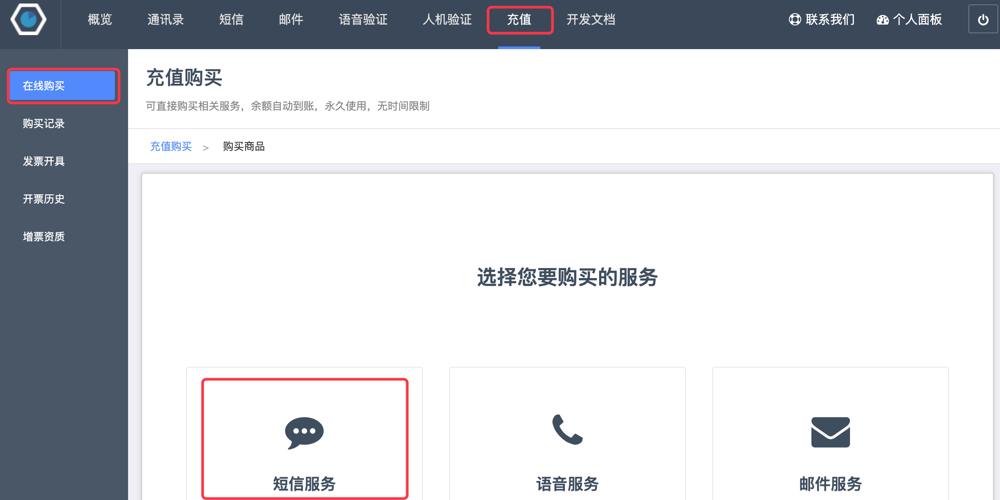
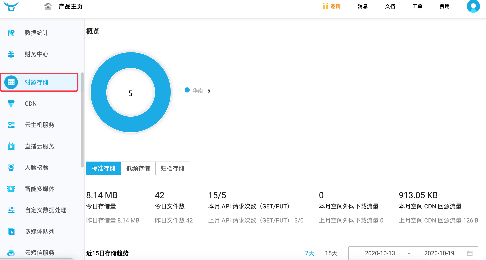
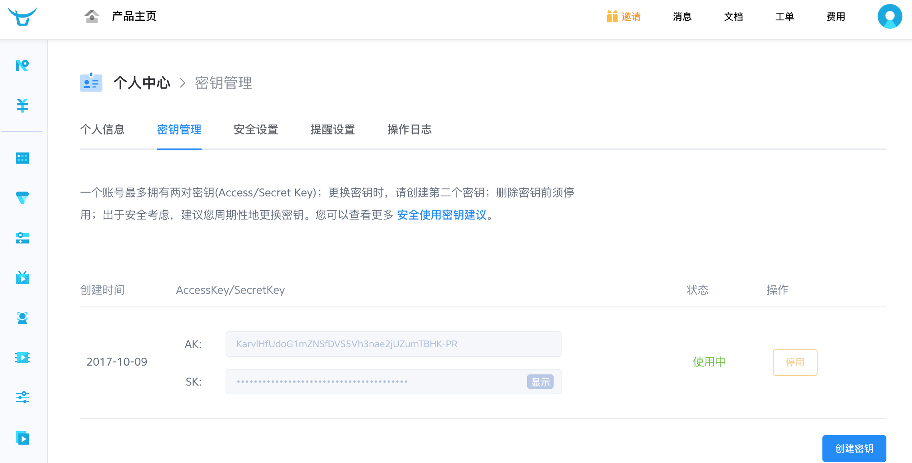
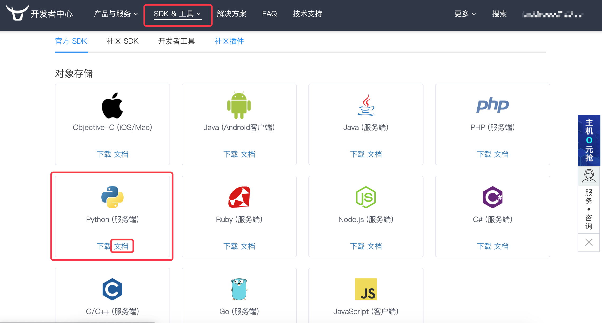
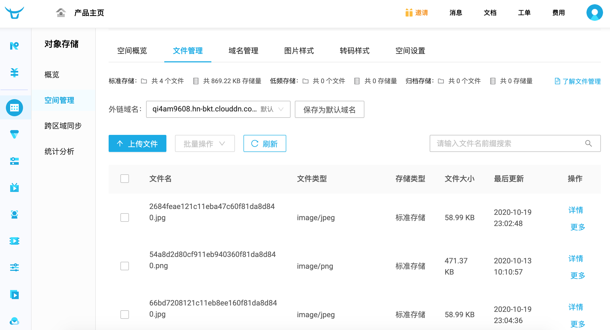

## Integrating Third-Party Platforms

During web application development, there are some tasks that we cannot complete on our own. For example, if our web project needs to perform identity verification for individuals or businesses, we clearly don't have the ability to verify the authenticity of the information provided by users. In this case, we need to rely on services provided by third-party platforms to complete such operations. Similarly, if our project needs to provide online payment functionality, this type of business is typically handled through payment gateways rather than implementing it ourselves. We only need to integrate platforms like WeChat Pay, Alipay, UnionPay, etc.

There are basically two ways to integrate third-party platforms in a project: API integration and SDK integration.

1. API integration refers to completing operations or retrieving data by accessing URLs provided by third parties. There are many such platforms in China that provide a wide variety of commonly used services. For example, [JuHe Data](https://www.juhe.cn/) provides APIs for life services, financial technology, transportation and geography, top-up and payment services, and more. We can initiate network requests through Python programs to access URLs and retrieve data. These API interfaces are the same as the data interfaces provided in our projects, except that our project's APIs are for our own use, while these third-party platform APIs are open. Of course, open doesn't mean free - most APIs that provide commercially valuable data require payment to use.
2. SDK integration refers to installing third-party libraries and using the classes and functions encapsulated by these libraries to utilize services provided by third-party platforms. For example, to integrate Alipay as mentioned earlier, you need to first install the Alipay SDK and then use the classes and methods encapsulated by Alipay to invoke the payment service.

Below, we'll explain how to integrate third-party platforms through specific examples.

### Integrating SMS Gateways

There are many places in a web project that can use SMS services, such as: phone verification code login, important message notifications, product marketing SMS, etc. To implement the SMS sending feature, you can integrate an SMS gateway. Well-known domestic SMS gateways include: Yunpian SMS, NetEase Cloud Communication, Luosimao, SendCloud, etc. These SMS gateways generally offer free trial features. Below, we use [Luosimao](https://luosimao.com/) as an example to explain how to integrate an SMS gateway in your project. Other platforms operate similarly.

1. Register an account. New users can try it for free.

2. Log in to the admin console and navigate to the SMS section.

3. Click "Triggered Send" to find your personal API Key (identity identifier).

    

4. Click "Signature Management" to add SMS signatures. All SMS messages must carry a signature. Free trial SMS messages must include the signature "[Test]" in the SMS, otherwise the SMS cannot be sent.

    

5. Click "IP Whitelist" to add the server address running the Django project (public IP address; if running locally, you can visit [xxx]() to check your machine's public IP address) to the whitelist, otherwise the SMS cannot be sent.

    

6. If there are no remaining SMS credits, you can go to the "Top Up" page, select "SMS Service," and make a payment.

    

Next, we can implement the SMS verification code sending feature by calling the Luosimao SMS gateway, as shown below.

```Python
def send_mobile_code(tel, code):
    """Send SMS verification code"""
    resp = requests.post(
        url='http://sms-api.luosimao.com/v1/send.json',
        auth=('api', 'key-YourAPIKey'),
        data={
            'mobile': tel,
            'message': f'Your SMS verification code is {code}. Never share it with anyone. [Python Course]'
        },
        verify=False
    )
    return resp.json()
```

Running the above code requires first installing the `requests` third-party library, which encapsulates HTTP networking request functionality and is very easy to use. We've covered this library in earlier content. The `send_mobile_code` function has two parameters: the first is the phone number and the second is the SMS verification code content. Line 5 requires providing your own API Key, which is the one found in step 2 above. The Luosimao SMS gateway returns JSON format data. For the above code, if `{'err': 0, 'msg': 'ok'}` is returned, the SMS was sent successfully. If the `err` field value is not `0` but another value, the SMS failed to send. You can find the meanings of different values on Luosimao's official [developer documentation](https://luosimao.com/docs/api/) page. For example: `-20` means insufficient balance, `-32` means missing SMS signature.

You can call the above function in view functions to complete the SMS verification code sending feature. Later, we can combine this feature with user registration.

Functions for generating random verification codes and validating phone numbers.

```Python
import random
import re

TEL_PATTERN = re.compile(r'1[3-9]\d{9}')


def check_tel(tel):
    """Validate phone number"""
    return TEL_PATTERN.fullmatch(tel) is not None


def random_code(length=6):
    """Generate random SMS verification code"""
    return ''.join(random.choices('0123456789', k=length))
```

View function for sending SMS verification codes.

```Python
@api_view(('GET', ))
def get_mobilecode(request, tel):
    """Get SMS verification code"""
    if check_tel(tel):
        redis_cli = get_redis_connection()
        if redis_cli.exists(f'vote:block-mobile:{tel}'):
            data = {'code': 30001, 'message': 'Please do not send SMS verification codes repeatedly within 60 seconds'}
        else:
            code = random_code()
            send_mobile_code(tel, code)
            # Block repeated SMS verification code sending within 60 seconds via Redis
            redis_cli.set(f'vote:block-mobile:{tel}', 'x', ex=60)
            # Keep the verification code in Redis for 10 minutes (valid for 10 minutes)
            redis_cli.set(f'vote2:valid-mobile:{tel}', code, ex=600)
            data = {'code': 30000, 'message': 'SMS verification code has been sent, please check'}
    else:
        data = {'code': 30002, 'message': 'Please enter a valid phone number'}
    return Response(data)
```

> **Note**: The code above uses Redis to implement two additional features: one is blocking users from sending SMS verification codes repeatedly within 60 seconds, and the other is keeping the user's SMS verification code for 10 minutes, meaning this SMS verification code is only valid for 10 minutes. We can require users to provide this verification code during registration to verify the authenticity of the user's phone number.

### Integrating Cloud Storage Services

When we mention **cloud storage**, we usually refer to storing data in a virtual server environment provided by a third party. Simply put, it means hosting certain data or resources through a third-party platform. Generally, companies that provide cloud storage services operate large data centers, and individuals or organizations that need cloud storage services purchase or lease storage space from them to meet their data storage needs. When developing web applications, you can place static resources, especially user-uploaded static resources, directly in cloud storage services. Cloud storage typically provides corresponding URLs so that users can access these static resources. Well-known domestic and international cloud storage services (such as Amazon's S3, Alibaba's OSS2, etc.) are generally affordable. Compared to setting up your own static resource server, cloud storage costs less, and most cloud storage platforms provide CDN services to accelerate access to static resources. So no matter from which angle, using cloud storage to manage web application data and static resources is an excellent choice, unless these resources involve personal or commercial privacy - otherwise, they can be hosted in cloud storage.

Below, we use [Qiniu Cloud](https://www.qiniu.com/) as an example to explain how to save user-uploaded files to Qiniu Cloud storage. Qiniu Cloud is a well-known domestic cloud computing and data service provider. Qiniu Cloud has its own products in areas such as massive file storage, CDN, video on demand, live streaming, and intelligent analysis and processing of large-scale heterogeneous data. Non-paying users can also integrate for free and use its services. Below is the process for integrating Qiniu Cloud:

1. Register an account and log in to the management console.

    

2. Select Object Storage from the left menu.

    

3. In Space Management, select Create New Space (e.g., myvote). If the space name is already taken, try another one. Note that after creating a space, you'll be prompted to bind a custom domain name. If you don't have your own domain name yet, you can use the temporary domain provided by Qiniu Cloud, but the temporary domain will be reclaimed after 30 days, so it's best to prepare your own domain (domains need to be registered; please consult relevant materials if you're unsure how to do this).

    

4. Click "Key Management" in the personal avatar area at the top right of the page to view your keys. You'll need the AK (AccessKey) and SK (SecretKey) in your code to authenticate the user's identity.

    

5. Click "Documentation" in the top menu of the page, go to the [Qiniu Developer Center](https://developer.qiniu.com/), select "SDK & Tools" in the navigation menu, click the "Official SDK" submenu, find Python (Server Side), and click "Documentation" to view the official documentation.

    

Next, following the examples provided in the official documentation, you can integrate Qiniu Cloud and use its cloud storage and other services. First, install the Qiniu Cloud third-party library with the following command.

```Bash
pip install qiniu
```

Next, you can use the `put_file` and `put_stream` functions in the `qiniu` module to implement file uploads. The former uploads a file from a specified path, while the latter uploads binary data from memory to Qiniu Cloud. The specific code is shown below.

```Python
import qiniu

AUTH = qiniu.Auth('AccessKey from Key Management', 'SecretKey from Key Management')
BUCKET_NAME = 'myvote'


def upload_file_to_qiniu(key, file_path):
    """Upload a file from a specified path to Qiniu Cloud"""
    token = AUTH.upload_token(BUCKET_NAME, key)
    return qiniu.put_file(token, key, file_path)


def upload_stream_to_qiniu(key, stream, size):
    """Upload a binary data stream to Qiniu Cloud"""
    token = AUTH.upload_token(BUCKET_NAME, key)
    return qiniu.put_stream(token, key, stream, None, size)
```

Below is a simple frontend page for file uploading.

```HTML
<!DOCTYPE html>
<html lang="en">
<head>
    <meta charset="UTF-8">
    <title>Upload File</title>
</head>
<body>
    <form action="/upload/" method="post" enctype="multipart/form-data">
        <div>
            <input type="file" name="photo">
            <input type="submit" value="Upload">
        </div>
    </form>
</body>
</html>
```

> **Note**: If the frontend uses a form to implement file uploading, the form's method attribute must be set to post, the enctype attribute needs to be set to multipart/form-data, and the input tag with type attribute set to file in the form serves as the file selector.

The view function implementing the upload functionality is shown below.

```Python
from django.views.decorators.csrf import csrf_exempt


@csrf_exempt
def upload(request):
    # If the uploaded file is less than 2.5MB, the photo object's type is InMemoryUploadedFile and the file is in memory
    # If the uploaded file exceeds 2.5MB, the photo object's type is TemporaryUploadedFile and the file is in a temporary path
    photo = request.FILES.get('photo')
    _, ext = os.path.splitext(photo.name)
    # Generate a unique new filename using UUID and the original file's extension
    filename = f'{uuid.uuid1().hex}{ext}'
    # For files in memory, use the upload_stream_to_qiniu function we encapsulated above to upload the file to Qiniu Cloud
    # If the file is saved in a temporary path, use upload_file_to_qiniu to implement file upload
    upload_stream_to_qiniu(filename, photo.file, photo.size)
    return redirect('/static/html/upload.html')
```

> **Note**: The view function above uses the `csrf_exempt` decorator, which allows the form to be submitted without providing a CSRF token. Additionally, line 11 of the code uses the `uuid1` function from the `uuid` module to generate a globally unique identifier.

Run the project and try the file upload feature. After a file is successfully uploaded, you can click on your space in Qiniu Cloud's "Space Management" and enter the "File Management" interface, where you can see the file we just uploaded successfully and access it through the domain provided by Qiniu Cloud.


