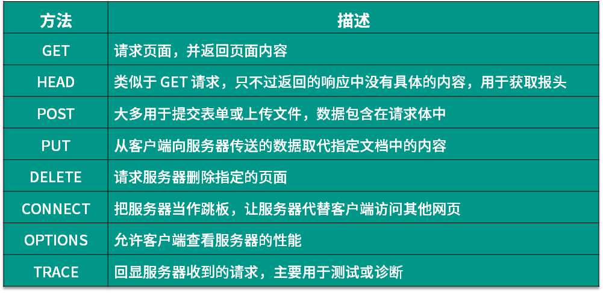
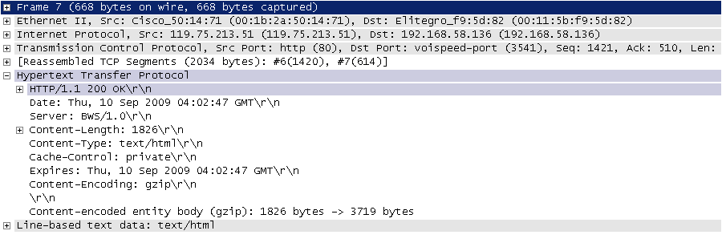
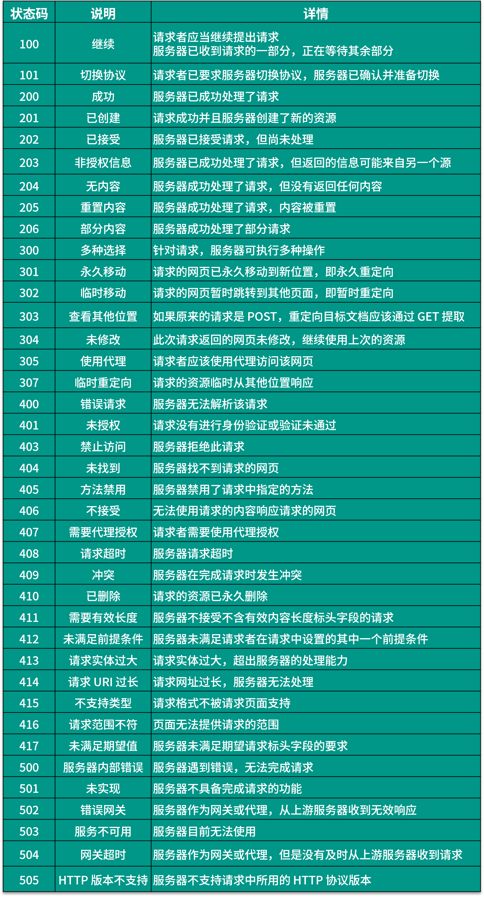
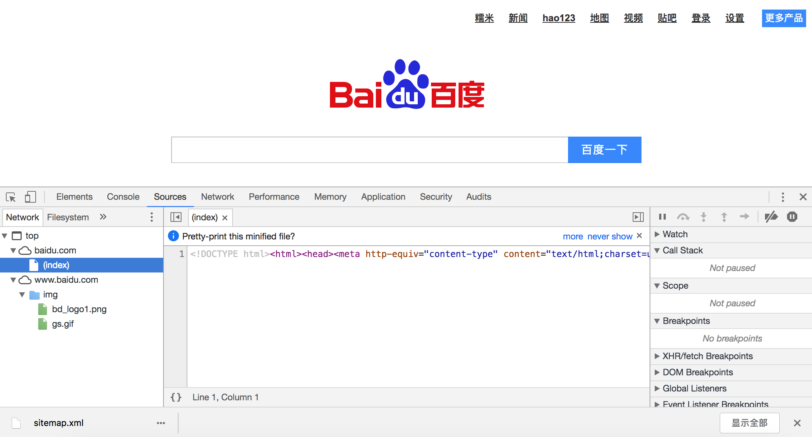
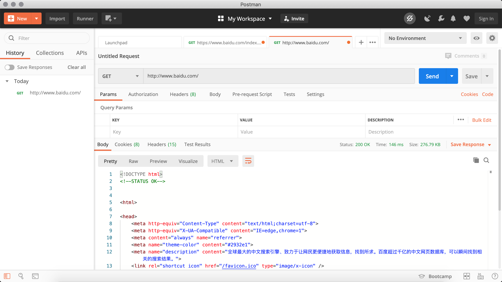

## Overview of Web Data Collection

A crawler, also frequently called a web spider, is a robot program (automated script code) that automatically browses websites and retrieves desired information according to certain rules. It is widely used in internet search engines and data collection. Anyone who has used the internet and a browser knows that web pages contain not only text information for users to read, but also hyperlinks. Web crawlers use hyperlink information in web pages to continuously obtain addresses of other pages on the network, and then persistently collect data. Because of this, the process of web data collection is like a crawler or spider roaming the web, which is why it is vividly called a crawler or web spider.

### Application Areas of Crawlers

In an ideal situation, all ICPs (Internet Content Providers) should provide API interfaces for their websites to share data that they allow other programs to access, in which case there would be no need for crawler programs at all. Well-known domestic e-commerce platforms (such as Taobao, JD.com, etc.) and social platforms (such as Weibo, WeChat, etc.) all provide their own API interfaces, but these API interfaces usually impose limits on the data that can be scraped and the frequency of scraping. For most companies, obtaining industry data and competitor data in a timely manner is one of the important aspects of business survival, yet for most enterprises, data is an inherent weakness. In this situation, reasonably using crawlers to obtain data and extract commercially valuable information from it becomes crucial for these enterprises.

The application areas of crawlers are actually very broad. Below we list some of them, and interested readers can explore the related content on their own.

1. Search engines
2. News aggregation
3. Social applications
4. Public opinion monitoring
5. Industry data

### Discussion on Crawler Legality

You often hear people say "write crawlers well, eat prison food till you're full," so is writing crawler programs illegal? Regarding this question, we can interpret it from the following perspectives.

1. The field of web crawlers is still in a pioneering stage. Although the internet world has established certain ethical norms through its own rules of the game, namely the Robots protocol (full name "Robots Exclusion Standard"), the legal part is still being established and improved, which means this field is currently still a gray area.
2. "What is not prohibited by law is permitted." If a crawler, like a browser, only retrieves front-end displayed data (publicly available information on web pages) rather than private sensitive information from the website's backend, there is less concern about legal constraints, because the development speed of the big data industry chain far exceeds the pace of legal improvement.
3. When scraping websites, you need to ensure your crawler complies with the Robots protocol while controlling the speed at which the crawler scrapes data. When using the data, you must respect the website's intellectual property rights (since the Web 2.0 era, although much of the data on the Web is provided by users, the website platform has invested operational costs, and when users register and publish content, the platform typically has already obtained ownership, usage rights, and distribution rights over the data). Violating these regulations would result in a very high probability of losing a lawsuit.
4. Properly concealing your identity is necessary when writing crawler programs, and it's best not to let the other party gather evidence that your crawler has damaged their movable property (such as servers).
5. Do not open-source or showcase your crawler code on public networks (such as code hosting platforms), as these actions usually bring unnecessary trouble.

#### Robots Protocol

Most websites define a `robots.txt` file. This is a gentleman's agreement, not a set of rules that all crawlers must follow. Let's take Taobao's [`robots.txt`](http://www.taobao.com/robots.txt) file as an example to see what restrictions Taobao places on crawlers.

```
User-agent: Baiduspider
Disallow: /

User-agent: baiduspider
Disallow: /
```

From the file above, we can see that Taobao prohibits Baidu's crawler from scraping any of its resources. Therefore, when you search for "Taobao" on Baidu, the following message appears below the search results: "Due to restriction directives in this website's `robots.txt` file (restricting search engine crawling), the system cannot provide a content description for this page." Baidu, as a search engine, at least on the surface follows Taobao's `robots.txt` protocol, so users cannot search for Taobao's internal product information through Baidu.

Figure 1. Baidu search results for Taobao


Below is Douban's [`robots.txt`](https://www.douban.com/robots.txt) file. Readers can interpret it on their own to see what restrictions it imposes.

```
User-agent: *
Disallow: /subject_search
Disallow: /amazon_search
Disallow: /search
Disallow: /group/search
Disallow: /event/search
Disallow: /celebrities/search
Disallow: /location/drama/search
Disallow: /forum/
Disallow: /new_subject
Disallow: /service/iframe
Disallow: /j/
Disallow: /link2/
Disallow: /recommend/
Disallow: /doubanapp/card
Disallow: /update/topic/
Disallow: /share/
Allow: /ads.txt
Sitemap: https://www.douban.com/sitemap_index.xml
Sitemap: https://www.douban.com/sitemap_updated_index.xml
# Crawl-delay: 5

User-agent: Wandoujia Spider
Disallow: /

User-agent: Mediapartners-Google
Disallow: /subject_search
Disallow: /amazon_search
Disallow: /search
Disallow: /group/search
Disallow: /event/search
Disallow: /celebrities/search
Disallow: /location/drama/search
Disallow: /j/
```

### Hypertext Transfer Protocol (HTTP)

Before we start explaining crawlers, let's briefly review the Hypertext Transfer Protocol (HTTP), because the content we see on web pages is usually the result of a browser executing HTML (Hypertext Markup Language), and HTTP is the protocol that transmits HTML data. Like many other application-level protocols, HTTP is built on top of TCP (Transmission Control Protocol), utilizing the reliable transmission service provided by TCP to implement data exchange in web applications. According to Wikipedia, the initial purpose of designing HTTP was to provide a method for publishing and receiving [HTML](https://zh.wikipedia.org/wiki/HTML) pages, meaning this protocol serves as the carrier for data transmitted between browsers and web servers. For detailed information about HTTP and its current development status, readers can refer to articles such as [Introduction to HTTP Protocol](http://www.ruanyifeng.com/blog/2016/08/http.html), [Introduction to Internet Protocols](http://www.ruanyifeng.com/blog/2012/05/internet_protocol_suite_part_i.html), and [Illustrated HTTPS Protocol](http://www.ruanyifeng.com/blog/2014/09/illustration-ssl.html).

The image below shows the HTTP request and response messages (protocol data) captured when accessing the Baidu homepage, using the open-source protocol analysis tool Ethereal (predecessor of WireShark) during my time working at the Sichuan Province Key Laboratory of Network Communication Technology. Since Ethereal captures data passing through the network adapter, you can clearly see the protocol data from the physical link layer to the application layer.

Figure 2. HTTP Request


An HTTP request typically consists of four parts: the request line, request headers, a blank line, and the message body. If there is no data to send to the server, the message body is not a required part. The request line contains the request method (GET, POST, etc., as shown in the table below), resource path, and protocol version; the request headers consist of several key-value pairs containing information about the browser, encoding method, preferred language, caching policy, etc.; after the request headers come the blank line and the message body.



Figure 3. HTTP Response



An HTTP response typically consists of four parts: the response line, response headers, a blank line, and the message body. The message body is the data returned by the server, which may be an HTML page, or it could be JSON or binary data, etc. The response line contains the protocol version and response status code. There are many types of response status codes; common ones are shown in the table below.



#### Related Tools

Below we will introduce some auxiliary tools for developing crawler programs. These tools should help you achieve twice the results with half the effort.

1. Chrome Developer Tools: The built-in developer tools of the Google Chrome browser. The most commonly used feature modules of this tool are:

   - Elements: Used to view or modify HTML element attributes, CSS properties, event listeners, etc. CSS can be modified and displayed in real-time, greatly facilitating developer page debugging.
   - Console: Used to execute one-time code, view JavaScript objects, and view debug log information or exception information. The console is essentially an interactive environment for executing JavaScript code.
   - Sources: Used to view the HTML file source code, JavaScript source code, and CSS source code of a page. Most importantly, it can debug JavaScript source code, allowing you to add breakpoints and step through code.
   - Network: Used for HTTP requests, HTTP responses, and information related to network connections.
   - Application: Used to view browser local storage, background tasks, and other content. Local storage mainly includes Cookie, Local Storage, Session Storage, etc.

   

2. Postman: A powerful tool for web page debugging and RESTful requests. Postman can help us simulate requests, making it very convenient to customize our requests and view server responses.

   

3. HTTPie: A command-line HTTP client.

   Installation.

   ```Bash
   pip install httpie
   ```

   Usage.

   ```Bash
   http --header http --header https://movie.douban.com/

   HTTP/1.1 200 OK
   Connection: keep-alive
   Content-Encoding: gzip
   Content-Type: text/html; charset=utf-8
   Date: Tue, 24 Aug 2021 16:48:00 GMT
   Keep-Alive: timeout=30
   Server: dae
   Set-Cookie: bid=58h4BdKC9lM; Expires=Wed, 24-Aug-22 16:48:00 GMT; Domain=.douban.com; Path=/
   Strict-Transport-Security: max-age=15552000
   Transfer-Encoding: chunked
   X-Content-Type-Options: nosniff
   X-DOUBAN-NEWBID: 58h4BdKC9lM
   ```

4. `builtwith` library: A tool for identifying the technologies used by a website.

   Installation.

   ```Bash
   pip install builtwith
   ```

   Usage.

   ```Python
   import ssl

   import builtwith

   ssl._create_default_https_context = ssl._create_unverified_context
   print(builtwith.parse('http://www.bootcss.com/'))
   ```

5. `python-whois` library: A tool for querying website ownership information.

   Installation.

   ```Bash
   pip3 install python-whois
   ```

   Usage.

   ```Python
   import whois

   print(whois.whois('https://www.bootcss.com'))
   ```

### Basic Workflow of a Crawler

A basic crawler is typically divided into three parts: data collection (page downloading), data processing (page parsing), and data storage (persisting useful information). Of course, more advanced crawlers use concurrent programming or distributed technologies for data collection and processing, which requires the participation of schedulers (arranging threads or processes to execute corresponding tasks), backend management programs (monitoring crawler work status and checking data scraping results), etc.


Generally speaking, the workflow of a crawler includes the following steps:

1. Set the scraping target (seed page/start page) and fetch the web page.
2. When the server is inaccessible, retry downloading the page according to the specified number of retries.
3. Set a user agent or hide the real IP when necessary, otherwise you may be unable to access the page.
4. Perform necessary decoding operations on the fetched page and then extract the needed information.
5. Extract link information from the fetched page using some method (such as regular expressions).
6. Further process the links (fetch the pages and repeat the above actions).
7. Persist useful information for subsequent processing.
