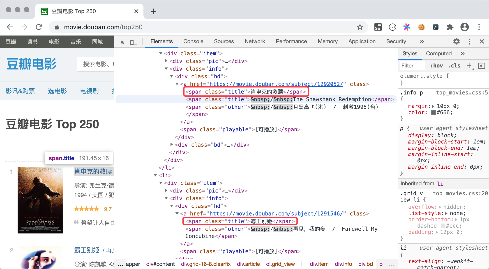

## Fetching Web Data with Python

Web data collection is an area where Python excels. In the previous lesson, we mentioned that programs that implement web data collection are commonly called web crawlers or spider programs. Even in the era of big data, data remains a pain point and weakness for small and medium-sized enterprises. Some data needs to be obtained through open or paid data interfaces, while other industry data and competitor data must be obtained through web data collection. Regardless of which method is used to obtain web data resources, Python is an excellent choice because both its standard library and third-party libraries provide good support for web data collection.

### The requests Library

To fetch web data with Python, we recommend using a third-party library called `requests`, which we have actually already used in previous lessons. According to its official website, `requests` is built on top of the Python standard library, simplifying operations for accessing network resources via HTTP or HTTPS. As we mentioned in the previous lesson, HTTP is a request-response protocol. When we enter a correct [URL](https://developer.mozilla.org/zh-CN/docs/Learn/Common_questions/What_is_a_URL) (commonly called a web address) in the browser and press the Enter key, we send an HTTP request to a [web server](https://developer.mozilla.org/zh-CN/docs/Learn/Common_questions/What_is_a_web_server) on the network, and the server gives us an HTTP response upon receiving the request. In Chrome browser, you can open "Developer Tools" from the menu and switch to the "Network" tab to see what HTTP requests and responses actually look like, as shown in the figure below.


With the `requests` library, we can make our Python program send requests to web servers just like a browser and receive the responses returned by the server. From the responses, we can extract the data we want. The web pages presented to us by the browser are written in [HTML](https://developer.mozilla.org/zh-CN/docs/Web/HTML), and the browser is essentially an interpreter environment for HTML. All the content we see on a web page is contained within HTML tags. After obtaining the HTML code, we can extract content from tag attributes or tag bodies. The following example demonstrates how to get a web page's HTML code. We use the `get` function of the `requests` library to fetch the HTML code of the Sohu homepage.

```Python
import requests

resp = requests.get('https://www.sohu.com/')
if resp.status_code == 200:
    print(resp.text)
```

> **Note**: In the code above, the variable `resp` is a `Response` object (a type encapsulated by the `requests` library). The `status_code` attribute of this object lets us get the response status code, and the `text` attribute helps us obtain the HTML code of the page.

Since the `text` attribute of the `Response` object is a string, we can use the regular expression knowledge we learned earlier to extract news titles and links from the page's HTML code, as shown below.

```Python
import re

import requests

pattern = re.compile(r'<a.*?href="(.*?)".*?title="(.*?)".*?>')
resp = requests.get('https://www.sohu.com/')
if resp.status_code == 200:
    all_matches = pattern.findall(resp.text)
    for href, title in all_matches:
        print(href)
        print(title)
```

In addition to text content, we can also use the `requests` library to fetch binary resources via URL. The following example demonstrates how to download the Baidu logo and save it to a local file named `baidu.png`. You can right-click on the Baidu logo on Baidu's homepage and use the "Copy image address" menu item to get the image URL.

```Python
import requests

resp = requests.get('https://www.baidu.com/img/PCtm_d9c8750bed0b3c7d089fa7d55720d6cf.png')
with open('baidu.png', 'wb') as file:
    file.write(resp.content)
```

> **Note**: The `content` attribute of the `Response` object lets us get the binary data from the server response.

The `requests` library is very user-friendly and quite powerful and comprehensive in terms of functionality. We will analyze its specific features gradually as we use it. To unlock more knowledge about the `requests` library, you can read its [official documentation](https://docs.python-requests.org/zh_CN/latest/).

### Writing Crawler Code

Next, we will use "Douban Movies" as an example to explain how to write crawler code. Following the method described above, we first use `requests` to get the HTML code of a web page, then treat the entire code as a long string, so we can use regular expression capture groups to extract the content we need from the string. The code below demonstrates how to get the names of the top 250 movies from [Douban Movies](https://movie.douban.com/). The page structure and corresponding code of [Douban Movies Top 250](https://movie.douban.com/top250) are shown in the figure below. As you can see, each page displays 25 movies. To get the Top 250 data, we need to visit 10 pages in total, with the corresponding addresses being <https://movie.douban.com/top250?start=xxx>, where `xxx` is `0` for the first page, and if `xxx` is `100`, we can access the fifth page. To keep the code simple and readable, we only extract movie titles and ratings.



```Python
import random
import re
import time

import requests

for page in range(1, 11):
    resp = requests.get(
        url=f'https://movie.douban.com/top250?start={(page - 1) * 25}',
        # If we don't set the User-Agent in the HTTP request header, Douban will detect that the request
        # is not from a browser and block our request.
        # Set the User-Agent value through the headers parameter of the get function. The specific value
        # can be found in the browser's developer tools.
        # When crawling most websites, disguising the crawler as a browser request is a very important step.
        headers={'User-Agent': 'Mozilla/5.0 (Macintosh; Intel Mac OS X 10_14_6) AppleWebKit/537.36 (KHTML, like Gecko) Chrome/92.0.4515.159 Safari/537.36'}
    )
    # Use regex to get span tags with class attribute 'title' whose body doesn't start with '&', and extract the tag content using capture groups
    pattern1 = re.compile(r'<span class="title">([^&]*?)</span>')
    titles = pattern1.findall(resp.text)
    # Use regex to get span tags with class attribute 'rating_num' and extract the tag content using capture groups
    pattern2 = re.compile(r'<span class="rating_num".*?>(.*?)</span>')
    ranks = pattern2.findall(resp.text)
    # Use zip to combine the two lists and iterate over all movie titles and ratings
    for title, rank in zip(titles, ranks):
        print(title, rank)
    # Sleep randomly for 1-5 seconds to avoid scraping pages too frequently
    time.sleep(random.random() * 4 + 1)
```

> **Note**: By analyzing Douban's robots protocol, we find that Douban does not reject Baidu's crawler from fetching its data. Therefore, we can also disguise our crawler as Baidu's crawler by modifying the `headers` parameter of the `get` function to: `headers={'User-Agent': 'BaiduSpider'}`.

### Using IP Proxies

Concealing the identity of a crawler program is quite important when writing crawlers. Many websites are averse to crawlers because they consume a lot of network bandwidth and generate a lot of invalid traffic. To conceal identity, you usually need to use **commercial IP proxies** (such as Mogu Proxy, Zhima Proxy, Kuai Proxy, etc.), so that the scraped website cannot obtain the real IP address of the crawler program's source, and therefore cannot simply block the crawler program by IP address.

Below, we'll use [Mogu Proxy](http://www.moguproxy.com/) as an example to explain how to use commercial IP proxies. First, you need to register an account on the website, after which you can [purchase](http://www.moguproxy.com/buy) a corresponding plan to get commercial IP proxies. For commercial use, it is recommended to purchase an unlimited plan so you can get enough proxy IP addresses based on actual needs; for learning purposes, you can purchase an hourly plan or decide based on your own needs. Mogu Proxy provides two ways to access the proxy: API private proxy and HTTP tunnel proxy. The former obtains proxy server addresses by requesting Mogu Proxy's API interface, while the latter accesses directly through a unified entry point (a domain name provided by Mogu Proxy).


Below, we'll use the HTTP tunnel proxy as an example to explain how to connect to an IP proxy. You can also directly refer to the code provided on Mogu Proxy's official website to set up proxies for your crawler.

```Python
import requests

APP_KEY = 'Wnp******************************XFx'
PROXY_HOST = 'secondtransfer.moguproxy.com:9001'

for page in range(1, 11):
    resp = requests.get(
        url=f'https://movie.douban.com/top250?start={(page - 1) * 25}',
        # Need to set the proxy authentication method in the HTTP request header
        headers={
            'Proxy-Authorization': f'Basic {APP_KEY}',
            'User-Agent': 'Mozilla/5.0 (Macintosh; Intel Mac OS X 10_14_6) AppleWebKit/537.36 (KHTML, like Gecko) Chrome/92.0.4515.159 Safari/537.36',
            'Accept-Language': 'zh-CN,zh;q=0.8,en-US;q=0.6,en;q=0.4'
        },
        # Set proxy server
        proxies={
            'http': f'http://{PROXY_HOST}',
            'https': f'https://{PROXY_HOST}'
        },
        verify=False
    )
    pattern1 = re.compile(r'<span class="title">([^&]*?)</span>')
    titles = pattern1.findall(resp.text)
    pattern2 = re.compile(r'<span class="rating_num".*?>(.*?)</span>')
    ranks = pattern2.findall(resp.text)
    for title, rank in zip(titles, ranks):
        print(title, rank)
```

> **Note**: The code above requires modifying `APP_KEY` to the `Appkey` value corresponding to your own created order, which can be found in the user center under user orders. Mogu Proxy offers free trial access for both API proxy and HTTP tunnel proxy, but the connectivity rate of trial proxies cannot be guaranteed. It is recommended to directly purchase a proxy service within your budget to experience it.

###  Summary

There are truly many things Python can do. When it comes to web data collection alone, Python is practically unrivaled. A large number of enterprises and individuals use Python to obtain the data they need from the internet, and this may also become part of your daily work in the future. Additionally, while extracting content from web pages using regular expressions is feasible, writing a regular expression that meets the requirements is not an easy task in itself, which is especially apparent for beginners. In the next lesson, we will introduce two other methods for extracting data from pages. Although they may not match regular expressions in terms of performance, they reduce the complexity of coding, and we believe you will enjoy using them.
