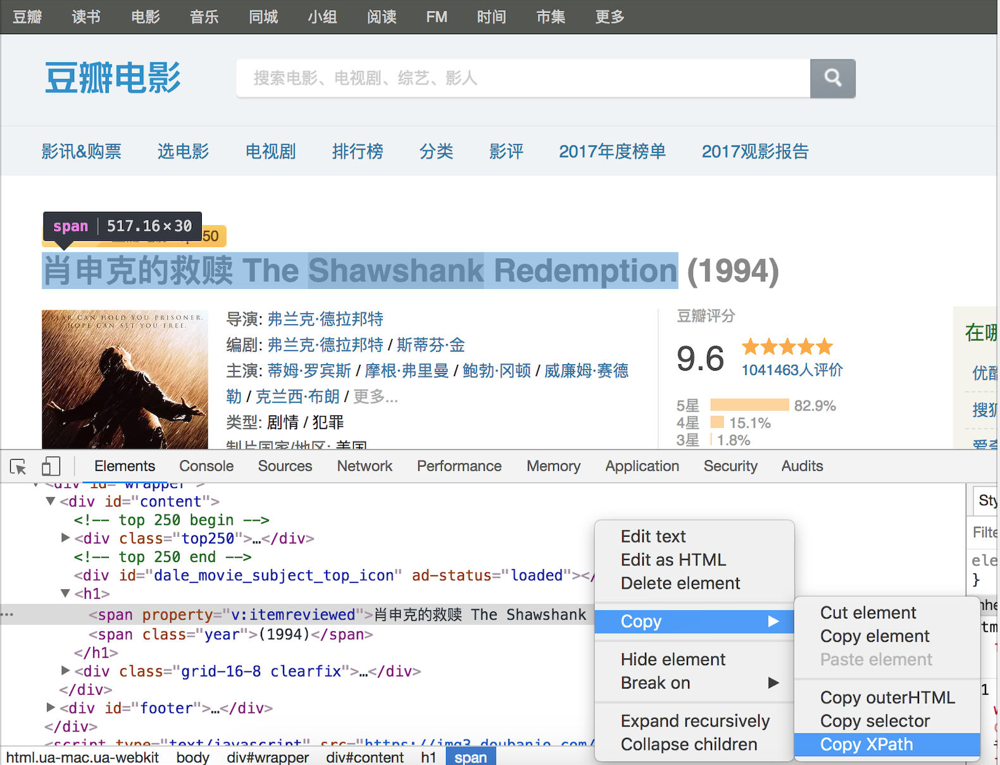

## Parsing HTML Pages with Python

In previous lessons, we discussed using the `requests` third-party library to fetch network resources and also introduced some frontend basics. Next, we will continue to explore how to parse HTML code and extract useful information from pages. Previously, we tried using regular expression capture groups to extract page content, but writing a correct regular expression can be a headache. To solve this problem, we need to first gain a deeper understanding of the structure of HTML pages, and on that basis, study other methods for parsing pages.

### Structure of an HTML Page

If we open any website in a browser and select "View Page Source" from the right-click context menu, we can see the HTML code corresponding to the web page.


Line `1` of the code is the document type declaration, line `2`'s `<html>` tag is the opening tag of the entire page's root element, and the last line is the root tag's closing tag `</html>`. The `<html>` tag has two child tags: `<head>` and `<body>`. The content placed under the `<body>` tag is displayed in the browser window and represents the main body of the web page; the content placed under the `<head>` tag is not displayed in the browser window but contains important meta-information about the page, commonly referred to as the page header. The approximate code structure of an HTML page is shown below.

```HTML
<!doctype html>
<html>
    <head>
        <!-- Page meta-information such as character encoding, title, keywords, media queries, etc. -->
    </head>
    <body>
        <!-- Main body of the page, content displayed in the browser window -->
    </body>
</html>
```

Tags, Cascading Style Sheets (CSS), and JavaScript are the three essential elements that make up an HTML page. Tags carry the content to be displayed on the page, CSS is responsible for rendering the page, and JavaScript controls interactive page behavior. To parse HTML pages, you can use XPath syntax, which was originally a query syntax for XML and can extract tag content or tag attributes based on the hierarchical structure of HTML tags. Additionally, CSS selectors can be used to locate page elements, following the same principle as using CSS to render page elements.

### XPath Parsing

XPath is a syntax for finding information in XML (eXtensible Markup Language) documents. XML, like HTML, is a tag language that uses tags to carry data, but the difference is that XML tags are extensible and customizable, and XML has stricter syntax requirements. XPath uses path expressions to select nodes or node sets in XML documents. The nodes referred to here include elements, attributes, text, namespaces, processing instructions, comments, root nodes, etc. Let's use an example to illustrate how to use XPath to parse a page.

```XML
<?xml version="1.0" encoding="UTF-8"?>
<bookstore>
    <book>
      <title lang="eng">Harry Potter</title>
      <price>29.99</price>
    </book>
    <book>
      <title lang="zh">Learning XML</title>
      <price>39.95</price>
    </book>
</bookstore>
```

For the XML file above, we can use the following XPath syntax to get nodes from the document.

| Path Expression | Result |
| --------------- | ------------------------------------------------------------ |
| `/bookstore`    | Selects the root element bookstore. **Note**: If the path starts with a forward slash ( / ), it always represents an absolute path to an element! |
| `//book`        | Selects all book child elements regardless of their position in the document. |
| `//@lang`       | Selects all attributes named lang. |
| `/bookstore/book[1]`               | Selects the first book element that is a child of bookstore. |
| `/bookstore/book[last()]`          | Selects the last book element that is a child of bookstore. |
| `/bookstore/book[last()-1]`        | Selects the second-to-last book element that is a child of bookstore. |
| `/bookstore/book[position()<3]`    | Selects the first two book elements that are children of bookstore. |
| `//title[@lang]`                   | Selects all title elements that have an attribute named lang. |
| `//title[@lang='eng']`             | Selects all title elements that have a lang attribute with a value of eng. |
| `/bookstore/book[price>35.00]`     | Selects all book elements of bookstore where the price element value is greater than 35.00. |
| `/bookstore/book[price>35.00]/title` | Selects all title elements of book elements in bookstore where the price element value is greater than 35.00. |

XPath also supports wildcard usage, as shown below.

| Path Expression | Result |
| -------------- | --------------------------------- |
| `/bookstore/*` | Selects all child elements of the bookstore element. |
| `//*`          | Selects all elements in the document. |
| `//title[@*]`  | Selects all title elements that have any attribute. |

To select multiple nodes, you can use the following methods.

| Path Expression | Result |
| ---------------------------------- | ------------------------------------------------------------ |
| `//book/title \| //book/price`     | Selects all title and price elements of book elements. |
| `//title \| //price`               | Selects all title and price elements in the document. |
| `/bookstore/book/title \| //price` | Selects all title elements of book elements belonging to bookstore, as well as all price elements in the document. |

> **Note**: The examples above are from the [XPath Tutorial](<https://www.runoob.com/xpath/xpath-tutorial.html>) on the "Runoob" website. Interested readers can read the original text.

Of course, if you don't understand or aren't familiar with XPath syntax, you can view an element's XPath syntax in the browser's developer tools as shown below. The image below shows how to view the XPath syntax for a movie title in the movie detail information on Douban using Chrome browser's developer tools.



Implementing XPath parsing requires support from the third-party library `lxml`, which can be installed using the following command.

```Bash
pip install lxml
```

Below, we rewrite the previous code for fetching the Douban Movies Top 250 using the XPath parsing method, as shown below.

```Python
from lxml import etree
import requests

for page in range(1, 11):
    resp = requests.get(
        url=f'https://movie.douban.com/top250?start={(page - 1) * 25}',
        headers={'User-Agent': 'BaiduSpider'}
    )
    tree = etree.HTML(resp.text)
    # Extract movie titles from the page using XPath syntax
    title_spans = tree.xpath('//*[@id="content"]/div/div[1]/ol/li/div/div[2]/div[1]/a/span[1]')
    # Extract movie ratings from the page using XPath syntax
    rank_spans = tree.xpath('//*[@id="content"]/div/div[1]/ol/li[1]/div/div[2]/div[2]/div/span[2]')
    for title_span, rank_span in zip(title_spans, rank_spans):
        print(title_span.text, rank_span.text)
```

### CSS Selector Parsing

For developers familiar with CSS selectors and JavaScript, using CSS selectors to get page elements may be an even simpler choice, because JavaScript running in browsers can natively use the `document` object's `querySelector()` and `querySelectorAll()` methods to get page elements based on CSS selectors. In Python, we can use the third-party libraries `beautifulsoup4` or `pyquery` to do the same thing. Beautiful Soup can parse HTML and XML documents, fix documents with errors such as unclosed tags, and implement encapsulation of data extraction operations by creating a tree structure in memory for the page to be parsed. You can install Beautiful Soup with the following command.

```Python
pip install beautifulsoup4
```

Below is the code rewritten using `bs4` to get the movie names from Douban Movies Top 250.

```Python
import bs4
import requests

for page in range(1, 11):
    resp = requests.get(
        url=f'https://movie.douban.com/top250?start={(page - 1) * 25}',
        headers={'User-Agent': 'BaiduSpider'}
    )
    # Create a BeautifulSoup object
    soup = bs4.BeautifulSoup(resp.text, 'lxml')
    # Extract span tags containing movie titles from the page using CSS selectors
    title_spans = soup.select('div.info > div.hd > a > span:nth-child(1)')
    # Extract span tags containing movie ratings from the page using CSS selectors
    rank_spans = soup.select('div.info > div.bd > div > span.rating_num')
    for title_span, rank_span in zip(title_spans, rank_spans):
        print(title_span.text, rank_span.text)
```

For more knowledge about BeautifulSoup, you can refer to its [official documentation](https://www.crummy.com/software/BeautifulSoup/bs4/doc.zh/).

###  Summary

Below we make a simple comparison of the three parsing methods.

| Parsing Method | Corresponding Module | Speed | Difficulty |
| -------------- | ---------------- | ------ | -------- |
| Regular Expression Parsing | `re` | Fast | Difficult |
| XPath Parsing | `lxml` | Fast | Moderate |
| CSS Selector Parsing | `bs4` or `pyquery` | Uncertain | Easy |
