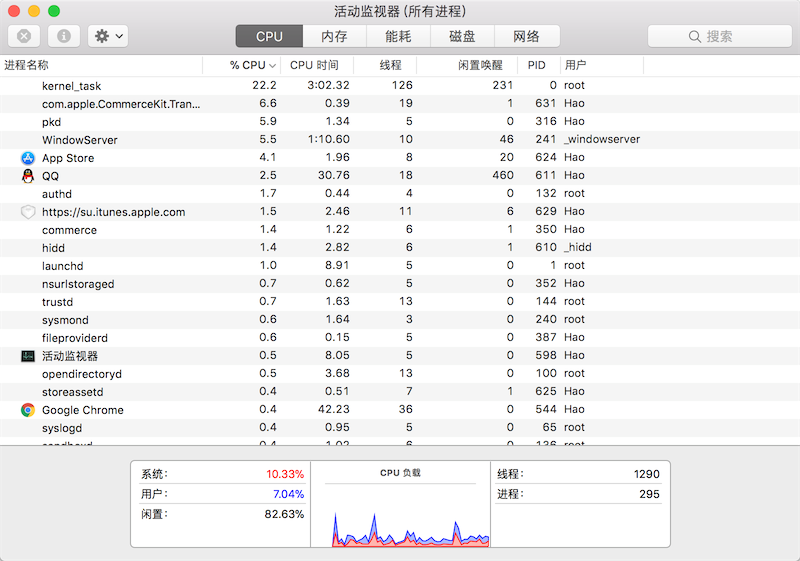

## Concurrent Programming in Python - 1

Nowadays, the computers we use are already multi-CPU or multi-core, and the operating systems we use basically all support "multitasking," which allows us to run multiple programs simultaneously and decompose a single program into several relatively independent subtasks that execute "in parallel" or "concurrently," thereby reducing program execution time and providing users with a better experience. Therefore, regardless of what programming language is used for development, implementing "parallel" or "concurrent" programming has become a standard skill for programmers. To explain how to implement "parallel" or "concurrent" programming in Python, we need to first understand two important concepts: processes and threads.

### Threads and Processes

Running a program through the operating system creates one or more processes. A process is a single execution of a program with certain independent functionality over a particular data set. Simply put, a process is the basic unit for the operating system to allocate storage space. Each process has its own address space, data stack, and other auxiliary data for tracking process execution. The operating system manages all processes and allocates resources to them reasonably. A process can create new processes to execute other tasks through fork or spawn, but new processes also have their own independent memory space. Therefore, if two processes need to share data, they must use inter-process communication mechanisms, including pipes, signals, sockets, etc.

A process can also have multiple execution threads, which simply means it can have multiple execution units that can be scheduled by the CPU - these are what we call threads. Since threads exist within the same process, they can share the same context, making information sharing and communication between threads easier compared to processes. Of course, in a single-core CPU system, multiple threads cannot execute simultaneously because only one thread can obtain the CPU at any given moment. Multiple threads achieve concurrency by sharing CPU execution time.

Using multithreading technology in programs usually brings self-evident benefits, mainly manifested in improving program performance and enhancing user experience. Almost all software we use today employs multithreading technology, which can be verified using the system's built-in process monitoring tools (such as "Activity Monitor" on macOS and "Task Manager" on Windows), as shown in the figure below.



Here, we need to emphasize two concepts again: **concurrency** and **parallelism**. **Concurrency** typically means that only one instruction can execute at any given moment, but instructions from multiple threads are rapidly alternated. For example, a processor executes instructions from thread A for a while, then switches to thread B's instructions for a while, then switches back to thread A for a while. Because the processor executes and switches instructions extremely fast, people cannot perceive that the computer is switching context between multiple threads during this process, making it appear macroscopically as if multiple threads are running simultaneously, while microscopically only one thread is executing at a time. **Parallelism** means that at the same moment, multiple instructions are executing simultaneously on multiple processors. Parallelism must rely on multiple processors; both macroscopically and microscopically, multiple threads can execute together at the same time. Often, we don't strictly distinguish between the words concurrency and parallelism, so sometimes we also consider multithreading, multiprocessing, and asynchronous I/O in Python as means of implementing concurrent programming. However, the first two can also implement parallel programming, though there is also the issue of the Global Interpreter Lock (GIL), which we will discuss later.

### Multithreaded Programming

The `Thread` class in Python's standard library `threading` module can help us implement multithreaded programming very easily. Let's use a file downloading example to compare the difference between using multithreading and not using it, as shown in the code below.

Downloading without multithreading.

```Python
import random
import time


def download(*, filename):
    start = time.time()
    print(f'Start downloading {filename}.')
    time.sleep(random.randint(3, 6))
    print(f'{filename} download complete.')
    end = time.time()
    print(f'Download time: {end - start:.3f} seconds.')


def main():
    start = time.time()
    download(filename='Python from Beginner to Hospitalized.pdf')
    download(filename='MySQL from Drop Database to Running Away.avi')
    download(filename='Linux from Mastery to Giving Up.mp4')
    end = time.time()
    print(f'Total time: {end - start:.3f} seconds.')


if __name__ == '__main__':
    main()
```

> **Note**: The code above does not actually implement real file downloading functionality. Instead, it uses `time.sleep()` to simulate the time overhead of downloading a file by sleeping for a period of time, which is similar to actual download conditions.

Running the code above produces the following output. As you can see, when our program has only one worker thread, each download task must wait for the previous one to finish before it can start, so the total execution time of the program is the sum of the individual execution times of the three download tasks.

```
Start downloading Python from Beginner to Hospitalized.pdf.
Python from Beginner to Hospitalized.pdf download complete.
Download time: 3.005 seconds.
Start downloading MySQL from Drop Database to Running Away.avi.
MySQL from Drop Database to Running Away.avi download complete.
Download time: 5.006 seconds.
Start downloading Linux from Mastery to Giving Up.mp4.
Linux from Mastery to Giving Up.mp3 download complete.
Download time: 6.007 seconds.
Total time: 14.018 seconds.
```

In fact, the three download tasks above have no logical causal relationship with each other. They can be "concurrent" - the next download task doesn't need to wait for the previous one to finish. For this reason, we can use multithreaded programming to rewrite the code above.

```Python
import random
import time
from threading import Thread


def download(*, filename):
    start = time.time()
    print(f'Start downloading {filename}.')
    time.sleep(random.randint(3, 6))
    print(f'{filename} download complete.')
    end = time.time()
    print(f'Download time: {end - start:.3f} seconds.')


def main():
    threads = [
        Thread(target=download, kwargs={'filename': 'Python from Beginner to Hospitalized.pdf'}),
        Thread(target=download, kwargs={'filename': 'MySQL from Drop Database to Running Away.avi'}),
        Thread(target=download, kwargs={'filename': 'Linux from Mastery to Giving Up.mp4'})
    ]
    start = time.time()
    # Start three threads
    for thread in threads:
        thread.start()
    # Wait for threads to finish
    for thread in threads:
        thread.join()
    end = time.time()
    print(f'Total time: {end - start:.3f} seconds.')


if __name__ == '__main__':
    main()
```

One sample run produced the following results.

```
Start downloading Python from Beginner to Hospitalized.pdf.
Start downloading MySQL from Drop Database to Running Away.avi.
Start downloading Linux from Mastery to Giving Up.mp4.
MySQL from Drop Database to Running Away.avi download complete.
Download time: 3.005 seconds.
Python from Beginner to Hospitalized.pdf download complete.
Download time: 5.006 seconds.
Linux from Mastery to Giving Up.mp4 download complete.
Download time: 6.003 seconds.
Total time: 6.004 seconds.
```

From the results above, we can see that the total execution time of the entire program is almost equal to the execution time of the longest download task, which means the three download tasks executed concurrently without one waiting for another. This clearly improves the program's execution efficiency. Simply put, if a program has very time-consuming execution units, and these time-consuming units have no logical causal relationship - meaning the execution of unit B does not depend on the result of unit A - then units A and B can be placed in two different threads for concurrent execution. The benefits of doing this, in addition to reducing program wait time, also include providing a better user experience, because the blocking of one unit won't cause the program to appear "frozen," since there are other units in the program that can still operate.

#### Creating Thread Objects Using the Thread Class

As you can see from the code above, you can create thread objects directly using the `Thread` class constructor, and the thread object's `start()` method can launch a thread. After the thread is started, it will execute the function specified by the `target` parameter, provided it gets CPU scheduling. If the target function that the `target` specifies needs parameters, you can specify them through the `args` parameter, and for keyword arguments, you can pass them through the `kwargs` parameter. The `Thread` class constructor has many other parameters that we will explain when we encounter them. For now, what you need to master is `target`, `args`, and `kwargs`.

#### Customizing Threads by Inheriting the Thread Class

In addition to the thread creation method shown above, you can also customize threads by inheriting the `Thread` class and overriding the `run()` method, as shown in the code below.

```Python
import random
import time
from threading import Thread


class DownloadThread(Thread):

    def __init__(self, filename):
        self.filename = filename
        super().__init__()

    def run(self):
        start = time.time()
        print(f'Start downloading {self.filename}.')
        time.sleep(random.randint(3, 6))
        print(f'{self.filename} download complete.')
        end = time.time()
        print(f'Download time: {end - start:.3f} seconds.')


def main():
    threads = [
        DownloadThread('Python from Beginner to Hospitalized.pdf'),
        DownloadThread('MySQL from Drop Database to Running Away.avi'),
        DownloadThread('Linux from Mastery to Giving Up.mp4')
    ]
    start = time.time()
    # Start three threads
    for thread in threads:
        thread.start()
    # Wait for threads to finish
    for thread in threads:
        thread.join()
    end = time.time()
    print(f'Total time: {end - start:.3f} seconds.')


if __name__ == '__main__':
    main()
```

#### Using Thread Pools

We can also use thread pools to place tasks into multiple threads for execution. Using thread pools is the most ideal choice for multithreaded programming. In fact, creating and destroying threads brings significant overhead, and frequently creating and destroying threads is usually not a good choice. With thread pools, you can prepare several threads in advance. During use, you don't need to create and destroy threads through custom code; instead, you directly reuse threads from the thread pool. Python's built-in `concurrent.futures` module provides thread pool support, as shown in the code below.

```Python
import random
import time
from concurrent.futures import ThreadPoolExecutor
from threading import Thread


def download(*, filename):
    start = time.time()
    print(f'Start downloading {filename}.')
    time.sleep(random.randint(3, 6))
    print(f'{filename} download complete.')
    end = time.time()
    print(f'Download time: {end - start:.3f} seconds.')


def main():
    with ThreadPoolExecutor(max_workers=4) as pool:
        filenames = ['Python from Beginner to Hospitalized.pdf', 'MySQL from Drop Database to Running Away.avi', 'Linux from Mastery to Giving Up.mp4']
        start = time.time()
        for filename in filenames:
            pool.submit(download, filename=filename)
    end = time.time()
    print(f'Total time: {end - start:.3f} seconds.')


if __name__ == '__main__':
    main()
```

### Daemon Threads

A "daemon thread" is a thread that is not worth preserving when the main thread ends. "Not worth preserving" here means that daemon threads will be destroyed after all other non-daemon threads have finished running - they guard all non-daemon threads within the current process. Simply put, a daemon thread will terminate along with the main thread, and the main thread's lifecycle is the lifecycle of a process. If this isn't clear, let's look at a simple piece of code.

```Python
import time
from threading import Thread


def display(content):
    while True:
        print(content, end='', flush=True)
        time.sleep(0.1)


def main():
    Thread(target=display, args=('Ping', )).start()
    Thread(target=display, args=('Pong', )).start()


if __name__ == '__main__':
    main()
```

> **Note**: In the code above, we set the `flush` parameter of the `print` function to `True` because if the `flush` parameter value is `False` and `print` doesn't add a newline, the output from each `print` call will be placed in the operating system's output buffer, and the buffer won't be flushed until it's full. This behavior is a design choice by the operating system to reduce I/O interrupts and improve CPU utilization. To make the code produce interactive output, we set the `flush` parameter to `True` to force flushing the output buffer on each print.

The code above will not stop once running because both child threads contain infinite loops, unless you manually interrupt the code execution. However, if you set the `daemon` parameter to `True` when creating thread objects, these two threads become daemon threads, and when other threads end, even with the infinite loops, the two daemon threads will also terminate and not continue executing, as shown in the code below.

 ```Python
 import time
 from threading import Thread


 def display(content):
     while True:
         print(content, end='', flush=True)
         time.sleep(0.1)


 def main():
     Thread(target=display, args=('Ping', ), daemon=True).start()
     Thread(target=display, args=('Pong', ), daemon=True).start()
     time.sleep(5)


 if __name__ == '__main__':
     main()
 ```

In the code above, we added a `time.sleep(5)` line in the main thread to make the main thread sleep for 5 seconds. During this time, the daemon threads outputting `Ping` and `Pong` will continue to run until the main thread ends after 5 seconds, at which point these two daemon threads are also destroyed and stop running.

> **Exercise**: What would happen if you remove `daemon=True` from line 12 of the code above? Interested readers can try it out and see if the actual execution result matches your expectation.

### Resource Competition

When writing multithreaded code, you will inevitably encounter situations where multiple threads compete for the same resource (object). In such cases, if there is no reasonable mechanism to protect the contested resource, unexpected situations may occur. The code below creates `100` threads that all transfer money to the same bank account (with an initial balance of `0` yuan), with each thread transferring `1` yuan. Under normal circumstances, the final balance of our bank account should be `100` yuan, but running the code below will not give us a result of `100`.

```Python
import time

from concurrent.futures import ThreadPoolExecutor


class Account(object):
    """Bank Account"""

    def __init__(self):
        self.balance = 0.0

    def deposit(self, money):
        """Deposit money"""
        new_balance = self.balance + money
        time.sleep(0.01)
        self.balance = new_balance


def main():
    """Main function"""
    account = Account()
    with ThreadPoolExecutor(max_workers=16) as pool:
        for _ in range(100):
            pool.submit(account.deposit, 1)
    print(account.balance)


if __name__ == '__main__':
    main()
```

The `Account` class in the code above represents a bank account. Its `deposit` method represents the deposit action, and the parameter `money` represents the amount to deposit. This method simulates the time needed to process a deposit using the `time.sleep` function. We used a thread pool to start `100` threads to transfer money to one account, but the code above cannot produce the expected result of `100`. This is the data inconsistency problem that can occur when multiple threads compete for the same resource. Note line `14` of the code above: when multiple threads all execute this line of code, they perform the addition of the deposit amount on the same balance, which causes a "lost update" phenomenon - the results of earlier data modifications are overwritten by subsequent modifications, which is why we don't get the correct result.

To solve the problem above, we can use a locking mechanism to protect the critical code that operates on data. Python's standard library `threading` module provides the `Lock` and `RLock` classes to support locking mechanisms. We won't delve into the differences between the two here; we recommend using `RLock` directly. Next, we'll add a lock object to the bank account to solve the "lost update" problem that occurred during deposits, as shown in the code below.

```Python
import time

from concurrent.futures import ThreadPoolExecutor
from threading import RLock


class Account(object):
    """Bank Account"""

    def __init__(self):
        self.balance = 0.0
        self.lock = RLock()

    def deposit(self, money):
        # Acquire the lock
        self.lock.acquire()
        try:
            new_balance = self.balance + money
            time.sleep(0.01)
            self.balance = new_balance
        finally:
            # Release the lock
            self.lock.release()


def main():
    """Main function"""
    account = Account()
    with ThreadPoolExecutor(max_workers=16) as pool:
        for _ in range(100):
            pool.submit(account.deposit, 1)
    print(account.balance)


if __name__ == '__main__':
    main()
```

In the code above, the operations to acquire and release the lock can also be implemented using context manager syntax, which makes the code more concise and elegant. This is the approach we recommend.

```Python
import time

from concurrent.futures import ThreadPoolExecutor
from threading import RLock


class Account(object):
    """Bank Account"""

    def __init__(self):
        self.balance = 0.0
        self.lock = RLock()

    def deposit(self, money):
        # Acquire and release the lock using context manager syntax
        with self.lock:
            new_balance = self.balance + money
            time.sleep(0.01)
            self.balance = new_balance


def main():
    """Main function"""
    account = Account()
    with ThreadPoolExecutor(max_workers=16) as pool:
        for _ in range(100):
            pool.submit(account.deposit, 1)
    print(account.balance)


if __name__ == '__main__':
    main()
```

> **Exercise**: Modify the code above so that 5 threads deposit money into the bank account and 5 threads withdraw money from it. The withdrawal threads should stop and wait when the account balance is insufficient, and then try to withdraw again after a deposit thread has deposited money. This requires knowledge of thread scheduling. You can research the `Condition` class in the `threading` module on your own to see if you can accomplish this task.

### The GIL Problem

If you use the official Python interpreter (commonly called CPython) to run Python programs, you cannot use multithreading to bring CPU utilization close to 400% (for a 4-core CPU) or 800% (for an 8-core CPU), because CPython is constrained by the GIL (Global Interpreter Lock) when executing code. Specifically, CPython requires the corresponding thread to first acquire the GIL before executing any code, and then every 100 (bytecode) instructions, CPython makes the thread that holds the GIL voluntarily release it so that other threads have a chance to execute. Because of the GIL, no matter how many cores your CPU has, the Python code we write never has the opportunity to truly execute in parallel.

The GIL is a historical legacy issue in the design of the official Python interpreter. To solve this problem and enable multithreading to leverage multi-core CPU advantages, a Python interpreter without the GIL would need to be reimplemented. According to the official statement, this problem will be resolved when Python version 4.0 is released, so let's wait and see. Currently, for CPython, if you want to fully leverage multi-core CPU advantages, you can consider using multiprocessing, because each process corresponds to a Python interpreter and therefore has its own independent GIL, which can break through the GIL limitation. In the next chapter, we will introduce knowledge about multiprocessing and compare the code and execution results of multithreading and multiprocessing.
