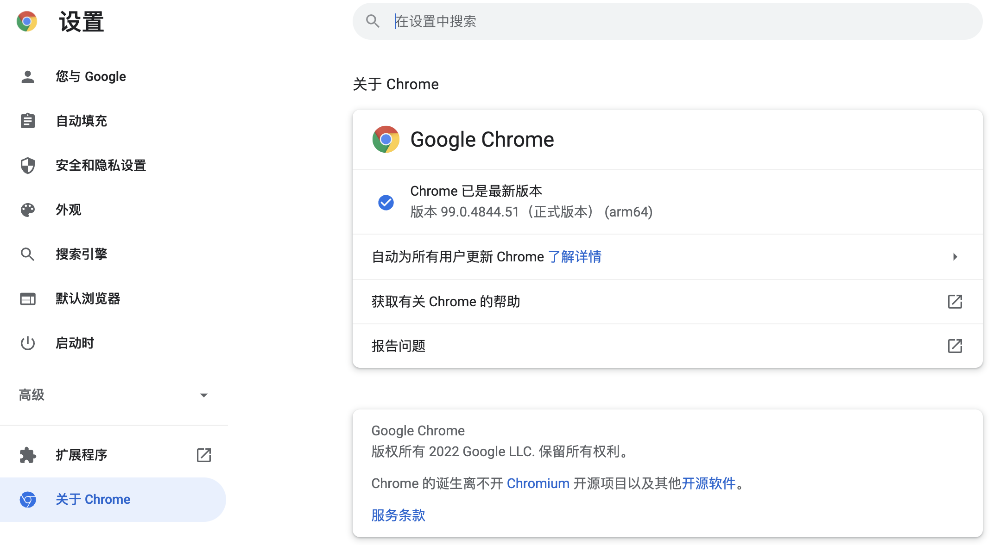

## Using Selenium to Scrape Dynamic Web Content

According to an accessibility audit report on the global internet published by an authoritative organization, approximately three-quarters of websites worldwide have content or partial content dynamically generated through JavaScript. This means that when you "View Page Source" in the browser window, you won't find this content in the HTML code, which means the data scraping methods we used before will no longer work properly. There are basically two solutions to this problem. One is to obtain the data interface that provides dynamic content, which is also applicable to scraping data from mobile apps. The other is to use the automated testing tool Selenium to run a browser and obtain the rendered dynamic content. For the first approach, we can use the browser's "Developer Tools" or more professional packet capture tools (such as Charles, Fiddler, Wireshark, etc.) to find the data interface, and the subsequent operations are the same as those explained in the previous chapter for fetching data from the "360 Images" website, so we won't repeat them here. In this chapter, we will focus on how to use the automated testing tool Selenium to obtain dynamic content from websites.

### Introduction to Selenium

Selenium is an automated testing tool that can drive a browser to perform specific actions, ultimately helping crawler developers obtain dynamic content from web pages. Simply put, anything we can see in a browser window can be obtained using Selenium. For websites that use JavaScript dynamic rendering technology, Selenium is an important option. Below, we will still use Chrome browser as an example to explain the usage of Selenium. You need to first install Chrome browser and download its driver. The Chrome browser driver can be downloaded from the [ChromeDriver official website](https://chromedriver.chromium.org/downloads). The driver version should match the browser version; if there is no exact match, choose the version with the closest version number.



### Using Selenium

We can first install Selenium via `pip`, with the command shown below.

```Shell
pip install selenium
```

#### Loading a Page

Next, we drive Chrome browser to open Baidu through the code below.

```Python
from selenium import webdriver

# Create a Chrome browser object
browser = webdriver.Chrome()
# Load the specified page
browser.get('https://www.baidu.com/')
```

If you don't want to use Chrome browser, you can also modify the code above to control other browsers by simply creating the corresponding browser object (such as Firefox, Safari, etc.). Running the program above, if you see an error message like the one below, it means we haven't added the Chrome browser driver to the PATH environment variable, nor specified the location of the Chrome browser driver in the program.

```Shell
selenium.common.exceptions.WebDriverException: Message: 'chromedriver' executable needs to be in PATH. Please see https://sites.google.com/a/chromium.org/chromedriver/home
```

There are three ways to solve this problem:

1. Place the downloaded ChromeDriver in an existing PATH environment variable location. It's recommended to put it in the same directory as the Python interpreter, since we already added the Python interpreter's path to the PATH environment variable when installing Python earlier.

2. Place ChromeDriver in the `bin` folder under the project's virtual environment (the corresponding directory on Windows is `Scripts`), so ChromeDriver will be in the same location as the virtual environment's Python interpreter and will certainly be found.

3. Modify the code above to configure a `Service` object through the `service` parameter when creating the Chrome object, and specify the location of ChromeDriver through the `executable_path` parameter when creating the `Service` object, as shown below:

    ```Python
    from selenium import webdriver
    from selenium.webdriver.chrome.service import Service

    browser = webdriver.Chrome(service=Service(executable_path='venv/bin/chromedriver'))
    browser.get('https://www.baidu.com/')
    ```

#### Finding Elements and Simulating User Actions

Next, we can try to simulate a user typing search keywords in the text box on Baidu's homepage and clicking the "Search" button. After the page is loaded, you can use the `Chrome` object's `find_element` and `find_elements` methods to get page elements. Selenium supports multiple ways to find elements, including CSS selectors, XPath, element name (tag name), element ID, class name, etc. The former can get a single page element (`WebElement` object), while the latter can get a list of multiple page elements. After obtaining a `WebElement` object, you can use `send_keys` to simulate user input, and `click` to simulate user clicks, as shown in the code below.

```Python
from selenium import webdriver
from selenium.webdriver.common.by import By

browser = webdriver.Chrome()
browser.get('https://www.baidu.com/')
# Get an element by its ID
kw_input = browser.find_element(By.ID, 'kw')
# Simulate user input
kw_input.send_keys('Python')
# Get an element by CSS selector
su_button = browser.find_element(By.CSS_SELECTOR, '#su')
# Simulate user click
su_button.click()
```

If you need to perform a series of actions, such as simulating a drag operation, you can create an `ActionChains` object. Interested readers can explore this on their own.

#### Implicit Waits and Explicit Waits

There's a detail you should know here: elements on a web page may be dynamically generated. When we use `find_element` or `find_elements` to get them, they may not have finished rendering yet, which will raise a `NoSuchElementException` error. To solve this problem, we can use implicit waiting by setting a wait time to let the browser complete rendering of page elements. Additionally, we can use explicit waiting by creating a `WebDriverWait` object and setting wait time and conditions. When conditions are not met, we can wait before attempting subsequent operations, as shown in the code below.

```Python
from selenium import webdriver
from selenium.webdriver.common.by import By
from selenium.webdriver.support import expected_conditions
from selenium.webdriver.support.wait import WebDriverWait

browser = webdriver.Chrome()
# Set the browser window size
browser.set_window_size(1200, 800)
browser.get('https://www.baidu.com/')
# Set implicit wait time to 10 seconds
browser.implicitly_wait(10)
kw_input = browser.find_element(By.ID, 'kw')
kw_input.send_keys('Python')
su_button = browser.find_element(By.CSS_SELECTOR, '#su')
su_button.click()
# Create an explicit wait object
wait_obj = WebDriverWait(browser, 10)
# Set wait condition (wait for the search results div to appear)
wait_obj.until(
    expected_conditions.presence_of_element_located(
        (By.CSS_SELECTOR, '#content_left')
    )
)
# Take a screenshot
browser.get_screenshot_as_file('python_result.png')
```

The wait condition `presence_of_element_located` set above means waiting for a specified element to appear. The table below lists common wait conditions and their meanings.

| Wait Condition                                 | Meaning                              |
| ---------------------------------------- | ------------------------------------- |
| `title_is / title_contains`              | Title is the specified content / Title contains the specified content |
| `visibility_of`                          | Element is visible                              |
| `presence_of_element_located`            | Located element has finished loading                    |
| `visibility_of_element_located`          | Located element becomes visible                    |
| `invisibility_of_element_located`        | Located element becomes invisible                  |
| `presence_of_all_elements_located`       | All located elements have finished loading                |
| `text_to_be_present_in_element`          | Element contains specified content                    |
| `text_to_be_present_in_element_value`    | Element's `value` attribute contains specified content       |
| `frame_to_be_available_and_switch_to_it` | Frame is loaded and switches to the specified internal window            |
| `element_to_be_clickable`                | Element is clickable                            |
| `element_to_be_selected`                 | Element is selected                            |
| `element_located_to_be_selected`         | Located element is selected                      |
| `alert_is_present`                       | An Alert popup appears                       |

#### Executing JavaScript Code

For pages that use waterfall loading, if you want to load more content in the browser window, you can use the browser object's `execute_scripts` method to execute JavaScript code. For some advanced scraping operations, similar techniques may also be needed. If your crawler code requires JavaScript support, it's recommended to first gain some understanding of JavaScript, especially BOM and DOM operations in JavaScript. We add the following code before the screenshot in the code above, which will use JavaScript to scroll the page to the very bottom.

```Python
# Execute JavaScript code
browser.execute_script('document.documentElement.scrollTop = document.documentElement.scrollHeight')
```

#### Bypassing Selenium Anti-Scraping Measures

Some websites have set up anti-scraping measures specifically targeting Selenium, because when using a Selenium-driven browser, the `webdriver` property value shown in the console is `true`. To bypass this check, you can execute JavaScript code to change it to `undefined` before loading the page.


Additionally, we can hide the "Chrome is being controlled by automated test software" message on the browser window. The complete code is shown below.

```Python
# Create Chrome options object
options = webdriver.ChromeOptions()
# Add experimental options
options.add_experimental_option('excludeSwitches', ['enable-automation'])
options.add_experimental_option('useAutomationExtension', False)
# Create Chrome browser object and pass in options
browser = webdriver.Chrome(options=options)
# Execute Chrome DevTools Protocol command (execute specified JavaScript code when loading pages)
browser.execute_cdp_cmd(
    'Page.addScriptToEvaluateOnNewDocument',
    {'source': 'Object.defineProperty(navigator, "webdriver", {get: () => undefined})'}
)
browser.set_window_size(1200, 800)
browser.get('https://www.baidu.com/')
```

#### Headless Browser

Many times, when scraping data, we don't need to see the browser window. As long as we have Chrome browser and the corresponding driver program, our crawler can operate. If you don't want to see the browser window, you can set up a headless browser in the following way.

```Python
options = webdriver.ChromeOptions()
options.add_argument('--headless')
browser = webdriver.Chrome(options=options)
```

### API Reference

There is much more to know about Selenium, and we won't cover everything here. Below we list some commonly used properties and methods of browser objects and `WebElement` objects. For specific details, you can also refer to the Selenium [official documentation's Chinese translation](https://selenium-python-zh.readthedocs.io/en/latest/index.html).

#### Browser Object

Table 1. Common Properties

| Property Name                  | Description                             |
| ----------------------- | -------------------------------- |
| `current_url`           | URL of the current page                    |
| `current_window_handle` | Handle (reference) of the current window           |
| `name`                  | Name of the browser                     |
| `orientation`           | Current device orientation (landscape, portrait)     |
| `page_source`           | Source code of the current page (including dynamic content) |
| `title`                 | Title of the current page                   |
| `window_handles`        | Handles of all windows opened by the browser       |

Table 2. Common Methods

| Method Name                                 | Description                                |
| -------------------------------------- | ----------------------------------- |
| `back` / `forward`                     | Go back/forward in browsing history           |
| `close` / `quit`                       | Close the current browser window / Quit the browser instance |
| `get`                                  | Load the page at the specified URL into the browser       |
| `maximize_window`                      | Maximize the browser window                  |
| `refresh`                              | Refresh the current page                        |
| `set_page_load_timeout`                | Set page load timeout                |
| `set_script_timeout`                   | Set JavaScript execution timeout        |
| `implicit_wait`                        | Set wait time for elements to be found or target instructions to complete    |
| `get_cookie` / `get_cookies`           | Get a specific Cookie / Get all Cookies   |
| `add_cookie`                           | Add Cookie information                    |
| `delete_cookie` / `delete_all_cookies` | Delete a specific Cookie / Delete all Cookies |
| `find_element` / `find_elements`       | Find a single element / Find a series of elements       |

#### WebElement Object

Table 1. Common WebElement Properties

| Property Name     | Description           |
| ---------- | -------------- |
| `location` | Position of the element     |
| `size`     | Size of the element     |
| `text`     | Text content of the element |
| `id`       | ID of the element      |
| `tag_name` | Tag name of the element   |

Table 2. Common Methods

| Method Name                           | Description                                 |
| -------------------------------- | ------------------------------------ |
| `clear`                          | Clear the content in a text box or text area           |
| `click`                          | Click the element                             |
| `get_attribute`                  | Get the value of an element's attribute                     |
| `is_displayed`                   | Check if the element is visible to the user             |
| `is_enabled`                     | Check if the element is in an enabled state             |
| `is_selected`                    | Check if the element (radio button or checkbox) is selected |
| `send_keys`                      | Simulate text input                         |
| `submit`                         | Submit a form                             |
| `value_of_css_property`          | Get the value of a specified CSS property                  |
| `find_element` / `find_elements` | Get a single child element / Get a series of child elements    |
| `screenshot`                     | Take a snapshot of the element                       |

### Simple Example

The example below demonstrates how to use Selenium to search for and download images from the "360 Images" website.

```Python
import os
import time
from concurrent.futures import ThreadPoolExecutor

import requests
from selenium import webdriver
from selenium.webdriver.common.by import By
from selenium.webdriver.common.keys import Keys

DOWNLOAD_PATH = 'images/'


def download_picture(picture_url: str):
    """
    Download and save an image
    :param picture_url: URL of the image
    """
    filename = picture_url[picture_url.rfind('/') + 1:]
    resp = requests.get(picture_url)
    with open(os.path.join(DOWNLOAD_PATH, filename), 'wb') as file:
        file.write(resp.content)


if not os.path.exists(DOWNLOAD_PATH):
    os.makedirs(DOWNLOAD_PATH)
browser = webdriver.Chrome()
browser.get('https://image.so.com/z?ch=beauty')
browser.implicitly_wait(10)
kw_input = browser.find_element(By.CSS_SELECTOR, 'input[name=q]')
kw_input.send_keys('苍老师')
kw_input.send_keys(Keys.ENTER)
for _ in range(10):
    browser.execute_script(
        'document.documentElement.scrollTop = document.documentElement.scrollHeight'
    )
    time.sleep(1)
imgs = browser.find_elements(By.CSS_SELECTOR, 'div.waterfall img')
with ThreadPoolExecutor(max_workers=32) as pool:
    for img in imgs:
        pic_url = img.get_attribute('src')
        pool.submit(download_picture, pic_url)
```

Run the code above and check whether the images searched by keyword have been downloaded to the specified directory.
