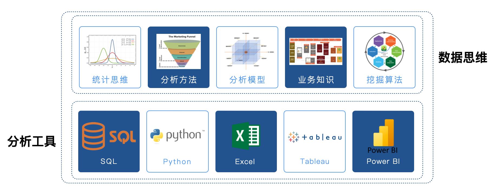

## Overview of Data Analysis

In today's world, every industry is becoming increasingly dependent on information technology, generating massive amounts of data every day. We often feel that there is more and more data, but it is becoming harder to extract valuable information from it. The information mentioned here can be understood as the result of processing a dataset -- something distilled from data that can be used to support and guide decision-making. The process of **extracting valuable information from raw data** is what we call **data analysis**, and it is an important part of data science.

> **Definition 1**: Data analysis is the science of purposefully collecting, processing, and organizing data, and using statistical and mining techniques to explore, analyze, present, and interpret data.
>
> **Definition 2**: Data analysis is the activity of collecting, organizing, and analyzing data to extract valuable information and insights to support decision-making and optimize processes. (GPT-4o)
>
> **Definition 3**: Data analysis is the process of systematically collecting, organizing, processing, verifying, and interpreting data to extract valuable information, form conclusions, and support decision-making. Its core is using statistical, algorithmic, and logical methods to reveal the patterns, trends, or correlations behind data. (DeepSeek)

For those who want to work in data analysis, two sets of skills need to be mastered: "data thinking" and "analysis tools," as shown in the figure below.

In the figure above, the analysis tools part is actually relatively easy to master. Programming languages like SQL or Python can be handled by most people with systematic study and adequate practice. Business intelligence tools like Power BI and Tableau make it even easier -- they allow us to complete data visualization and generate business insights through simple drag-and-drop operations. On the other hand, the data thinking part is not so easy for most beginners to master. For example, with "statistical thinking," many people have studied courses like "Probability Theory and Statistics" in school, but when facing actual business scenarios, they find it difficult to map this knowledge to business contexts to solve real-world problems. Moreover, without mastering basic analysis methods, understanding commonly used analysis models, or accumulating relevant business knowledge, even with abundant useful data, we may feel at a loss, let alone generating business insights and discovering commercial value. Therefore, in addition to systematically learning relevant knowledge and skills, the data thinking part also requires continuous accumulation and refinement in actual business scenarios.

### Responsibilities of a Data Analyst

When HR posts job requirements, positions such as data engineering, data analysis, and data mining are often collectively referred to as data analysis positions. However, based on the nature of the work, they can be divided into the engineering-oriented **data governance direction**, the business-oriented **business analysis direction**, the algorithm-oriented **data mining direction**, the application-oriented **data development direction**, and the product-oriented **data product manager**. What we usually refer to as a data analyst mainly means a **business data analyst**. Many data analysts start their careers from this position, and it is also the position with the most job openings. Some companies assign business data analysts to specific business departments (marketing, operations, product, etc.), some companies have dedicated data departments (data analysis teams or data science teams), and some companies have data analysts directly serving senior leadership and belonging to the corporate strategy department. For this reason, it's not surprising that you'll see data analysts referred to as **data operations**, **business analysts**, or **BI engineers** on job sites. Typically, the job description (JD) for a business data analyst position on recruitment websites is as follows:

1. Responsible for producing relevant reports.
2. Establishing and optimizing metric systems.
3. Monitoring data fluctuations and anomalies to identify problems.
4. Optimizing and driving business, promoting digital operations.
5. Identifying potential market and product growth opportunities.

Based on the above description, as a business data analyst, our job is not to provide simple and superficial conclusions, but to combine with the company's business to complete tasks such as **monitoring data**, **identifying anomalies**, **finding root causes**, and **exploring trends**. Whether you use Python, Excel, Tableau, SPSS, or other business intelligence tools, tools are just a means to achieve the goal. **Data thinking is the core skill**, and the ultimate goal is to start from actual business problems and ultimately **discover the commercial value in data**. In many companies, data analyst is just an entry-level position. Data analysts who excel in business can advance to management positions such as **Data Analysis Manager** or **Data Operations Director**. For data analysts familiar with machine learning algorithms, they can move toward **Data Mining Engineer** or **Algorithm Expert** roles. These positions not only require corresponding mathematical and statistical knowledge but also have higher requirements for programming ability than data analysts, and may also require experience in big data storage and processing.

Here, let's briefly mention a few other directions. The data governance position mainly helps companies build data warehouses or data lakes, implementing the transfer of data from business systems, tracking systems, and log systems to data warehouses or data lakes, providing infrastructure for subsequent data analysis and mining. The data governance position has high requirements for SQL and HiveSQL, requires proficiency in ETL tools, and also requires a good understanding of the Hadoop ecosystem. As a data product manager, in addition to the traditional product manager skill set, strong technical capabilities are also needed. For example, you need to understand common recommendation algorithms and machine learning models, be able to provide a basis for improving algorithms, and be able to formulate relevant tracking specifications and metric definitions. While you don't need to master all algorithms, you need to consider the implementation of data models, metrics, and algorithms from a product perspective.

### Skill Stack for Data Analysts

The skill stack for data analysts includes both hard skills and soft skills. The following is my understanding of this position, for reference only.

1. Computer Science (data analysis tools, programming languages, databases)
2. Mathematics and Statistics (data thinking, statistical thinking)
3. Artificial Intelligence (machine learning and deep learning algorithms)
4. Business Understanding (communication, expression, experience)
5. Summarization and Presentation Skills (summarization, reporting, business PPTs)

Of course, for a beginner, it is impossible to master the entire skill stack in a short time. However, as you deepen your work in this field, you will inevitably encounter the topics mentioned above. You can focus on certain skills based on the actual needs of your work.

### General Workflow of Data Analysis

When we mention "data analysis," we are often referring to **data analysis in the narrow sense**. This type of data analysis primarily aims to generate visual reports and use these reports to gain insights into business issues. This type of work is generally retrospective. **Data analysis in the broad sense** also includes the data mining component -- not only monitoring and analyzing business through data but also using machine learning algorithms to uncover knowledge hidden behind the data and leveraging this knowledge to support future decisions, which is forward-looking to some extent.

Basic data analysis work generally includes the following aspects, though there may be slight differences depending on the industry and work content.

1. Define objectives (input): Understand the business, determine metric definitions
2. Acquire data: Data warehouses, spreadsheets, third-party APIs, web scraping, open datasets, etc.
3. Clean data: Handle missing values, duplicate values, outliers, and other preprocessing (formatting, discretization, binarization, etc.)
4. Data pivoting: Sorting, statistics, group aggregation, cross-tabulations, pivot tables, etc.
5. Data presentation (output): Data visualization, publish work results (data analysis reports)
6. Analytical insights (follow-up): Interpret data changes, propose corresponding solutions

In-depth data mining work typically includes the following aspects, though there may be slight differences depending on the industry and work content.

1. Define objectives (input): Understand the business, clarify mining goals
2. Data preparation: Data collection, data description, data exploration, quality assessment, etc.
3. Data processing: Data extraction, data cleaning, data transformation, special encoding, dimensionality reduction, feature selection, etc.
4. Data modeling: Model comparison, model selection, algorithm application
5. Model evaluation: Cross-validation, parameter tuning, result evaluation
6. Model deployment (output): Model implementation, business improvement, operations monitoring, report writing

### Libraries Related to Data Analysis

Using Python for data analysis-related work is an excellent choice. First, Python is very easy to learn, and the Python ecosystem contains a wealth of mature software packages and libraries for data science. Unlike other data science programming languages (such as Julia, R, etc.), Python can be used not only for data science but also for many other things.

#### The Classic Big Three

1. [NumPy](https://numpy.org/): Supports common array and matrix operations. It implements multi-dimensional array encapsulation through the `ndarray` class and provides methods and functions for manipulating these arrays. Since NumPy has built-in parallel computation capabilities, it will automatically perform parallel computations when using multi-core CPUs.
2. [Pandas](https://pandas.pydata.org/): The core of pandas is its unique data structures `DataFrame` and `Series`, which enable pandas to handle tables and time series containing different data types -- something that NumPy's `ndarray` cannot do. With pandas, you can easily and smoothly load data in various formats, then slice, dice, reshape, clean, aggregate, and present the data.
3. [Matplotlib](https://matplotlib.org/): matplotlib is a library containing various plotting modules that can create high-quality charts based on the data we provide. Additionally, matplotlib provides the pylab module, which contains many plotting components similar to [MATLAB](https://www.mathworks.com/products/matlab.html).

#### Other Related Libraries

1. [SciPy](https://scipy.org/): Extends the functionality of NumPy by encapsulating a large number of scientific computing algorithms, including linear algebra, statistical tests, sparse matrices, signal and image processing, optimization problems, fast Fourier transforms, etc.
2. [Polars](https://pola.rs/): A high-performance data analysis library designed to provide faster data operations than pandas. It supports large-scale data processing and can leverage multi-core CPUs to accelerate computations. It can be used as a replacement for pandas when processing large-scale datasets.
3. [Seaborn](https://seaborn.pydata.org/): Seaborn is a graphical visualization tool built on matplotlib. While matplotlib alone can be used to create beautiful statistical charts, it is generally not simple and convenient enough. Seaborn is essentially a wrapper around matplotlib that allows users to create various attractive statistical charts in a more concise and effective way.
4. [Scikit-learn](https://scikit-learn.org/): Scikit-learn was originally part of SciPy and provides a large number of tools that may be used in machine learning, including data preprocessing, supervised learning (classification, regression), unsupervised learning (clustering), model selection, cross-validation, etc.
5. [Statsmodels](https://www.statsmodels.org/stable/index.html): A library containing classical statistics and econometrics algorithms that helps users complete data exploration, regression analysis, hypothesis testing, and other tasks.
6. [PySpark](https://spark.apache.org/): The Python version of Apache Spark (a big data processing engine), used for large-scale data processing and distributed computing. It can efficiently perform data cleaning, transformation, and analysis in a distributed environment.
7. [Tensorflow](https://www.tensorflow.org/): TensorFlow is an open-source deep learning framework developed by Google, primarily for deep learning tasks. It is commonly used to build and train machine learning models (especially complex neural network models).
8. [Keras](https://keras.io/): Keras is a high-level neural network API primarily used for building and training deep learning models. Keras is suitable for deep learning beginners and researchers because it makes building and training neural networks simpler.
9. [PyTorch](https://pytorch.org/): PyTorch is an open-source deep learning framework developed by Facebook, widely used in research and production environments. PyTorch is a popular framework in deep learning research and has been widely applied in areas such as computer vision and natural language processing.
10. [NLTK](https://www.nltk.org/) / [SpaCy](https://spacy.io/): Natural Language Processing (NLP) libraries.
