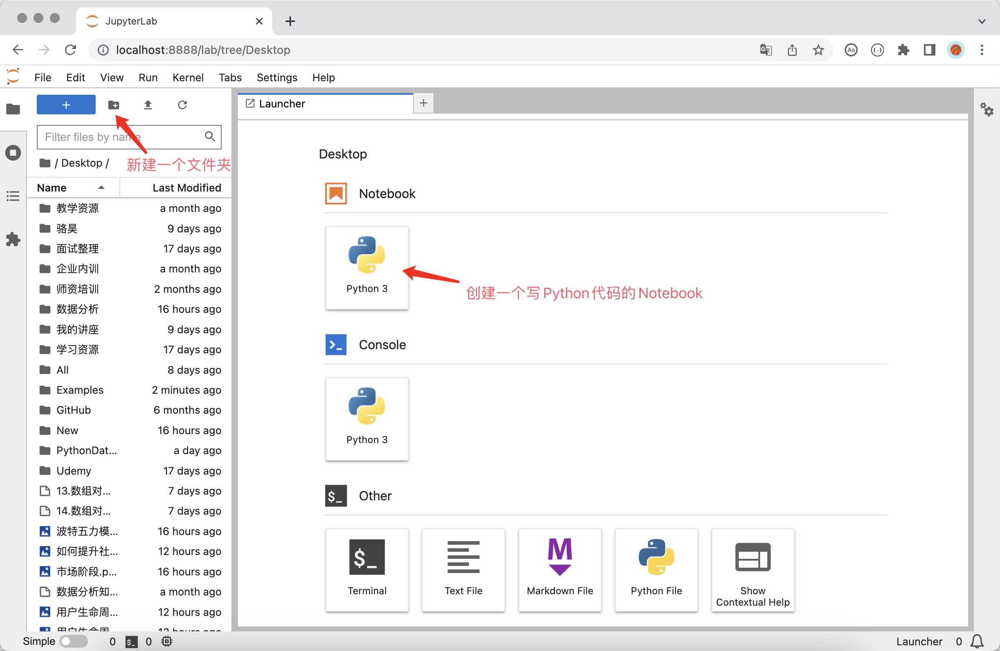

## Environment Setup

If you want to quickly start using Python for data science work, it is recommended to install Anaconda directly and use the Notebook or JupyterLab tools integrated in Anaconda to write code. For beginners, installing the official Python interpreter first and then individually installing the third-party libraries needed for work can be quite troublesome, especially on Windows, where installation failures often occur due to missing build tools or DLL files. Beginners typically find it difficult to take the correct corrective measures based on error messages, which can lead to serious frustration. If you already have a Python interpreter environment on your computer, you can also directly use Python's package management tool pip to install Jupyter, and then install third-party libraries as needed -- this approach is suitable for users with some experience.

### Installing and Using Anaconda

For individual users, you can download the "Individual Edition" installer from the Anaconda [official website](https://www.anaconda.com/). After installation, your computer will not only have a Python environment and Spyder (an integrated development tool similar to PyCharm), but also nearly 200 packages related to data science work, including the three Python data analysis essentials mentioned above. In addition, Anaconda provides a package management tool called conda, which can not only manage Python packages but also create virtual environments for running Python programs.


As shown above, you can select the installer for your operating system through the download links provided on the Anaconda website. It is recommended to choose the graphical installer. After downloading, double-click the installer to begin installation. The installation process can generally use default settings. After installation, macOS users can find an application called "Anaconda-Navigator" in "Applications" or "Launchpad." Running this application will display the interface shown below, where we can select the operations we need to perform.


For Windows users, it is recommended to follow the installation wizard's prompts and recommended options to install Anaconda (apart from the installation path, there is basically nothing to choose). After installation, you can find "Anaconda3" in the "Start Menu."

> **Tip**: You can choose Miniconda as an alternative to Anaconda. Miniconda only installs the Python interpreter environment and some essential tools, with other third-party libraries left for the user to install on their own. **Personally, I don't really like Anaconda because it is designed for novice users. Once we have a Python environment, we can install the third-party libraries we need according to our own preferences**.

#### conda Commands

For non-beginner users who want to use the conda tool to manage dependencies or create virtual environments for projects, you can use the conda command in the terminal or command prompt. Windows users can find "Anaconda3" in the "Start Menu" and then click "Anaconda Prompt" or "Anaconda PowerShell" to launch a command prompt that supports conda. For beginners who want to create new virtual environments or manage third-party libraries (dependencies), it is recommended to directly use "Environments" in "Anaconda-Navigator" to manage virtual environments and dependencies through the graphical interface.

1. Version and help information.

    - Check version: `conda -V` or `conda --version`
    - Get help: `conda -h` or `conda --help`
    - Related information: `conda list`

2. Virtual environment related.

    - Show all virtual environments: `conda env list`
    - Create a virtual environment: `conda create --name venv`
    - Create a virtual environment with a specific Python version: `conda create --name venv python=3.7`
    - Create a virtual environment with a specific Python version and install specified dependencies: `conda create --name venv python=3.7 numpy pandas`
    - Create a virtual environment by cloning an existing one: `conda create --name venv2 --clone venv`
    - Export virtual environment to a file: `conda env export > environment.yml`
    - Create a virtual environment from an exported file: `conda env create -f environment.yml`
    - Activate a virtual environment: `conda activate venv`
    - Deactivate a virtual environment: `conda deactivate`
    - Delete a virtual environment: `conda remove --name venv --all`

    > **Note**: In the commands above, `venv` and `venv2` are the names of the virtual environment folders. You can replace them with names you prefer, but it is **strongly recommended** to use English without special characters.

3. Package (third-party library or tool) management.

    - View installed packages: `conda list`
    - Search for a specific package: `conda search matplotlib`
    - Install a specific package: `conda install matplotlib`
    - Update a specific package: `conda update matplotlib`
    - Remove a specific package: `conda remove matplotlib`

    > **Note**: When searching, installing, and updating packages, it connects to the official website by default. If you find the speed unsatisfactory, you can replace the default official source with a domestic mirror site. The Tsinghua University open-source mirror site is recommended. The commands to switch to the domestic mirror are: `conda config --add channels https://mirrors.tuna.tsinghua.edu.cn/anaconda/pkgs/free/` and `conda config --add channels https://mirrors.tuna.tsinghua.edu.cn/anaconda/pkgs/main`. If you need to switch back to the default source, you can use the command `conda config --remove-key channels`.

### Installing and Using JupyterLab

#### Installation and Launch

If you have already installed Anaconda, you can launch Notebook or JupyterLab directly from "Anaconda-Navigator" as described above. According to the official statement, JupyterLab is the next generation of Notebook, offering a more user-friendly interface and more powerful features. We also recommend using JupyterLab. Windows users can also open "Anaconda Prompt" or "Anaconda PowerShell" from the Start Menu. Since the default Anaconda virtual environment is already activated, you only need to type the `jupyter lab` command to start JupyterLab. On macOS, after installing Anaconda, the default Anaconda virtual environment is automatically activated every time you open the terminal, and you can start JupyterLab by typing the `jupyter lab` command.

For users who have installed a Python environment but not Anaconda, you can use Python's package management tool `pip` to install JupyterLab. After successful installation, execute the `jupyter lab` command in the terminal or command prompt to start JupyterLab, as shown below.

Install JupyterLab:

```Bash
pip install jupyterlab
```

Install the three Python data analysis essentials:

```Bash
pip install numpy pandas matplotlib
```

Launch JupyterLab:

```Bash
jupyter lab
```

JupyterLab is a web-based application for interactive computing that can be used for code development, document writing, code execution, and result display. In short, you can **write code** and **run code** directly in a web page, and the execution results are displayed directly below the code block. If you need to write documentation while coding, you can use Markdown format on the same page and see the rendered result directly. Additionally, Notebook was originally designed to provide a working environment that supports multiple programming languages. It currently supports over 40 programming languages, including Python, R, Julia, Scala, etc.

First, we can create a Notebook for writing Python code, as shown below.



Next, we can start writing code, composing documents, and running programs, as shown below.


#### Tips and Tricks

If you are doing engineering-oriented project development in Python, PyCharm is definitely the best choice. It provides all the features an integrated development environment should have, especially features like smart suggestions, code completion, and auto-correction that make developers very comfortable. For data science work with Python, JupyterLab is no less capable than PyCharm, and it is even better at data and chart presentation. For this reason, JetBrains even developed a new tool called DataSpell that competes with JupyterLab. Interested readers can explore it on their own. Below, we introduce some JupyterLab tips and tricks to help you improve work efficiency.

1. Auto-completion. When writing code in JupyterLab, pressing the `Tab` key provides code hints and auto-completion.

2. Getting help. If you want to learn about an object (such as a variable, class, function, etc.) and how to use it, you can add `?` after the object and run the code. The corresponding information will be displayed at the bottom of the window to help you understand the object, as shown below.

    

3. Searching names. If you only remember part of a class or function name, you can use the wildcard `*` together with `?` to search, as shown below.

    

4. Executing commands. You can execute system commands in JupyterLab by prefixing the command with `!`.

5. Magic commands. JupyterLab has many interesting and useful magic commands. For example, you can use `%timeit` to test the execution time of a statement, or `%pwd` to view the current working directory. To see all magic commands, use `%lsmagic`. To learn how to use magic commands, use `%magic`, as shown below.

    

    Commonly used magic commands:

    | Magic Command                               | Description                                          |
    | ------------------------------------------- | ---------------------------------------------------- |
    | `%pwd`                                      | View the current working directory                   |
    | `%ls`                                       | List the contents of the current or specified folder |
    | `%cat`                                      | View the contents of a specified file                |
    | `%hist`                                     | View input history                                   |
    | `%matplotlib inline`                        | Set matplotlib to embed charts inline on the page    |
    | `%config Inlinebackend.figure_format='svg'` | Set charts to use SVG format (vector graphics)       |
    | `%run`                                      | Run a specified program                              |
    | `%load`                                     | Load a specified file into a cell                    |
    | `%quickref`                                 | Display IPython quick reference                      |
    | `%timeit`                                   | Run code multiple times and measure execution time   |
    | `%prun`                                     | Run code with `cProfile.run` and display profiler output |
    | `%who` / `%whos`                            | Display variables in the namespace                   |
    | `%xdel`                                     | Delete an object and clean up all references to it   |

6. Keyboard shortcuts. Many operations in JupyterLab can be performed using keyboard shortcuts, which can improve work efficiency. JupyterLab shortcuts can be divided into command mode shortcuts and edit mode shortcuts. Edit mode is the state when you are entering code or writing documents. In edit mode, pressing `Esc` returns to command mode, and in command mode, pressing `Enter` enters edit mode.

    Command mode shortcuts:

    | Shortcut                                     | Description                                              |
    | -------------------------------------------- | -------------------------------------------------------- |
    | `Alt` + `Enter`                              | Run the current cell and insert a new cell below         |
    | `Shift` + `Enter`                            | Run the current cell and select the cell below           |
    | `Ctrl` + `Enter`                             | Run the current cell                                     |
    | `j` / `k`, `Shift` + `j` / `Shift` + `k`    | Select the cell below/above, continuously select below/above |
    | `a` / `b`                                    | Insert a new cell below/above                            |
    | `c` / `x`                                    | Copy cell / Cut cell                                     |
    | `v` / `Shift` + `v`                          | Paste cell below/above                                   |
    | `dd` / `z`                                   | Delete cell / Undo cell deletion                         |
    | `Shift` + `l`                                | Show or hide line numbers for current/all cells          |
    | `Space` / `Shift` + `Space`                  | Scroll page down/up                                      |

    Edit mode shortcuts:

    | Shortcut                     | Description                                    |
    | ---------------------------- | ---------------------------------------------- |
    | `Shift` + `Tab`              | Get tooltip information                        |
    | `Ctrl` + `]`/ `Ctrl` + `[`  | Increase/decrease indent                       |
    | `Alt` + `Enter`              | Run the current cell and insert a new cell below |
    | `Shift` + `Enter`            | Run the current cell and select the cell below |
    | `Ctrl` + `Enter`             | Run the current cell                           |
    | `Ctrl` + `Left` / `Right`   | Move cursor to the beginning/end of line       |
    | `Ctrl` + `Up` / `Down`      | Move cursor to the beginning/end of code       |
    | `Up` / `Down`                | Move cursor up/down one line or to the previous/next cell |

    > **Note**: For macOS, you can replace the `Alt` key with the `Option` key and the `Ctrl` key with the `Command` key.
