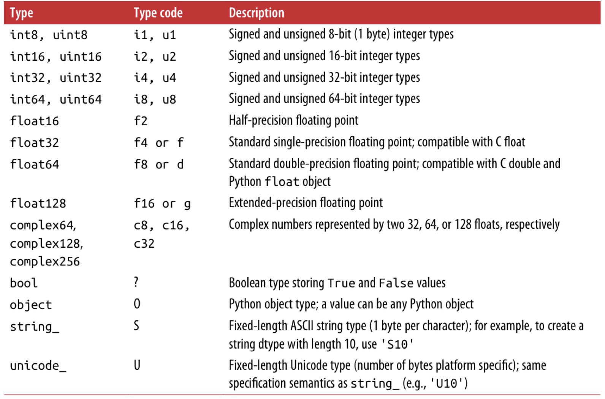
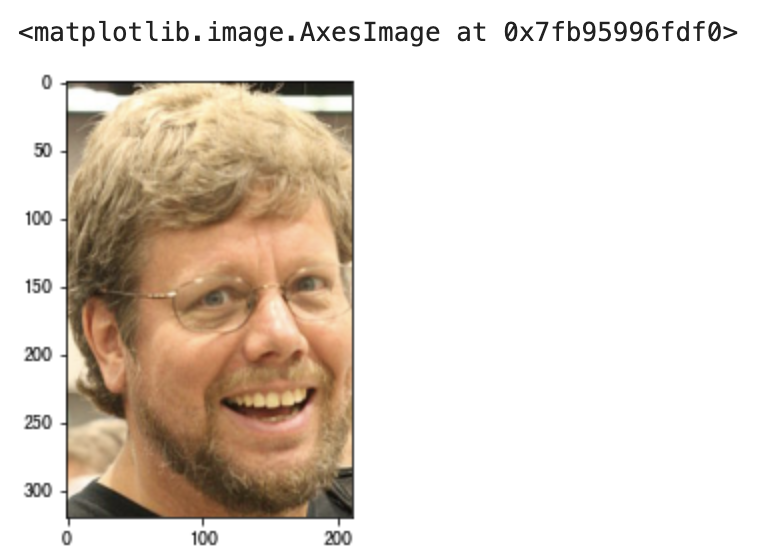
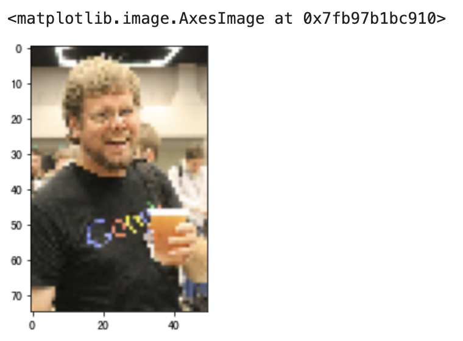

## NumPy Applications - 1

NumPy is an open-source Python scientific computing library **used for fast processing of arrays of arbitrary dimensions**. NumPy **supports common array and matrix operations**. For the same numerical computation tasks, using NumPy not only results in much more concise code, but NumPy also far outperforms native Python in terms of performance -- by at least one to two orders of magnitude, and the larger the data, the more pronounced NumPy's advantage becomes.

The most core data type in NumPy is `ndarray`. Using `ndarray`, you can work with one-dimensional, two-dimensional, and multi-dimensional arrays. This object is essentially a fast and flexible container for large data. The underlying code of NumPy is written in C, which bypasses the GIL limitation. When `ndarray` stores and accesses data, both the data and the memory addresses are contiguous, ensuring efficient batch operations and far superior performance compared to Python's native `list`. On the other hand, the `ndarray` object provides more methods for processing data, especially methods for obtaining statistical features of data, which are not available in Python's native `list`.

 ### Preparation

1. Launch JupyterLab

    ```Bash
    jupyter lab
    ```

    > **Tip**: Before launching JupyterLab, it is recommended to install the data analysis dependencies, including the three essentials mentioned earlier and related dependencies. If using Anaconda, no separate installation is needed -- you can launch it through Anaconda's Navigator.

2. Import

    ```Python
    import numpy as np
    import pandas as pd
    import matplotlib.pyplot as plt
    ```

    > **Note**: If you have already started JupyterLab but have not yet installed the required dependency libraries, for example if `numpy` is not yet installed, you can type `%pip install numpy` in a cell and run it to install NumPy. Of course, you can also type `%pip install numpy pandas matplotlib` in a cell to install all three core Python data analysis libraries at once. Note that in the code above, we imported not only NumPy but also the pandas and matplotlib libraries.

### Creating Array Objects

There are many ways to create `ndarray` objects. Below we introduce some commonly used methods.

Method 1: Use the `array` function to create an array object from a `list`

Code:

```Python
array1 = np.array([1, 2, 3, 4, 5])
array1
```

Output:

```
array([1, 2, 3, 4, 5])
```

Code:

```Python
array2 = np.array([[1, 2, 3], [4, 5, 6]])
array2
```

Output:

```
array([[1, 2, 3],
       [4, 5, 6]])
```

Method 2: Use the `arange` function to create an array object by specifying a range and step size

Code:

```Python
array3 = np.arange(0, 20, 2)
array3
```

Output:

```
array([ 0,  2,  4,  6,  8, 10, 12, 14, 16, 18])
```

Method 3: Use the `linspace` function to create an array object with a specified range and number of elements, generating an arithmetic sequence

Code:

```Python
array4 = np.linspace(-1, 1, 11)
array4
```

Output:

```
array([-1. , -0.8, -0.6, -0.4, -0.2,  0. ,  0.2,  0.4,  0.6,  0.8,  1. ])
```

Method 4: Use the `logspace` function to generate a geometric sequence

Code:

```python
array5 = np.logspace(1, 10, num=10, base=2)
array5
```

> **Note**: The starting value of the geometric sequence is $\small{2^1}$, the ending value is $\small{2^{10}}$, `num` is the number of elements, and `base` is the base.

Output:

```
array([   2.,    4.,    8.,   16.,   32.,   64.,  128.,  256.,  512., 1024.])
```

Method 5: Use the `fromstring` function to create an array object by extracting data from a string

Code:

```Python
array6 = np.fromstring('1, 2, 3, 4, 5', sep=',', dtype='i8')
array6
```

Output:

```
array([1, 2, 3, 4, 5])
```

Method 6: Use the `fromiter` function to create an array object from a generator (iterator)

Code:

```Python
def fib(how_many):
    a, b = 0, 1
    for _ in range(how_many):
        a, b = b, a + b
        yield a


gen = fib(20)
array7 = np.fromiter(gen, dtype='i8')
array7
```

Output:

```
array([   1,    1,    2,    3,    5,    8,   13,   21,   34,   55,   89,
        144,  233,  377,  610,  987, 1597, 2584, 4181, 6765])
```

Method 7: Use functions from the `numpy.random` module to generate random numbers and create array objects

Generate 10 random decimals in the range $\small{[0, 1)}$, code:

```Python
array8 = np.random.rand(10)
array8
```

Output:

```
array([0.45556132, 0.67871326, 0.4552213 , 0.96671509, 0.44086463,
       0.72650875, 0.79877188, 0.12153022, 0.24762739, 0.6669852 ])
```

Generate 10 random integers in the range $\small{[1, 100)}$, code:

```Python
array9 = np.random.randint(1, 100, 10)
array9
```

Output:

```
array([29, 97, 87, 47, 39, 19, 71, 32, 79, 34])
```

Generate 20 normally distributed random numbers with $\small{\mu=50}$ and $\small{\sigma=10}$, code:

```Python
array10 = np.random.normal(50, 10, 20)
array10
```

Output:

```
array([55.04155586, 46.43510797, 20.28371158, 62.67884053, 61.23185964,
       38.22682148, 53.17126151, 43.54741592, 36.11268017, 40.94086676,
       63.27911699, 46.92688903, 37.1593374 , 67.06525656, 67.47269463,
       23.37925889, 31.45312239, 48.34532466, 55.09180924, 47.95702787])
```

Generate a 3-row by 4-column 2D array of random decimals in the range $\small{[0, 1)}$, code:

```Python
array11 = np.random.rand(3, 4)
array11
```

Output:

```
array([[0.54017809, 0.46797771, 0.78291445, 0.79501326],
       [0.93973783, 0.21434806, 0.03592874, 0.88838892],
       [0.84130479, 0.3566601 , 0.99935473, 0.26353598]])
```

Generate a 3D array of random integers in the range $\small{[1, 100)}$, code:

```Python
array12 = np.random.randint(1, 100, (3, 4, 5))
array12
```

Output:

```
array([[[94, 26, 49, 24, 43],
        [27, 27, 33, 98, 33],
        [13, 73,  6,  1, 77],
        [54, 32, 51, 86, 59]],

       [[62, 75, 62, 29, 87],
        [90, 26,  6, 79, 41],
        [31, 15, 32, 56, 64],
        [37, 84, 61, 71, 71]],

       [[45, 24, 78, 77, 41],
        [75, 37,  4, 74, 93],
        [ 1, 36, 36, 60, 43],
        [23, 84, 44, 89, 79]]])
```

Method 8: Create arrays of all zeros, all ones, or with a specified element

Using the `zeros` function, code:

```Python
array13 = np.zeros((3, 4))
array13
```

Output:

```
array([[0., 0., 0., 0.],
       [0., 0., 0., 0.],
       [0., 0., 0., 0.]])
```

Using the `ones` function, code:

```Python
array14 = np.ones((3, 4))
array14
```

Output:

```
array([[1., 1., 1., 1.],
       [1., 1., 1., 1.],
       [1., 1., 1., 1.]])
```

Using the `full` function, code:

```Python
array15 = np.full((3, 4), 10)
array15
```

Output:

```
array([[10, 10, 10, 10],
       [10, 10, 10, 10],
       [10, 10, 10, 10]])
```

Method 9: Use the `eye` function to create an identity matrix

Code:

```Python
np.eye(4)
```

Output:

```
array([[1., 0., 0., 0.],
       [0., 1., 0., 0.],
       [0., 0., 1., 0.],
       [0., 0., 0., 1.]])
```

Method 10: Read an image to get the corresponding 3D array

Code:

```Python
array16 = plt.imread('guido.jpg')
array16
```

Output:

```
array([[[ 36,  33,  28],
        [ 36,  33,  28],
        [ 36,  33,  28],
        ...,
        [ 32,  31,  29],
        [ 32,  31,  27],
        [ 31,  32,  26]],

       [[ 37,  34,  29],
        [ 38,  35,  30],
        [ 38,  35,  30],
        ...,
        [ 31,  30,  28],
        [ 31,  30,  26],
        [ 30,  31,  25]],

       [[ 38,  35,  30],
        [ 38,  35,  30],
        [ 38,  35,  30],
        ...,
        [ 30,  29,  27],
        [ 30,  29,  25],
        [ 29,  30,  25]],

       ...,

       [[239, 178, 123],
        [237, 176, 121],
        [235, 174, 119],
        ...,
        [ 78,  68,  56],
        [ 75,  67,  54],
        [ 73,  65,  52]],

       [[238, 177, 120],
        [236, 175, 118],
        [234, 173, 116],
        ...,
        [ 82,  70,  58],
        [ 78,  68,  56],
        [ 75,  66,  51]],

       [[238, 176, 119],
        [236, 175, 118],
        [234, 173, 116],
        ...,
        [ 84,  70,  61],
        [ 81,  69,  57],
        [ 79,  67,  53]]], dtype=uint8)
```

> **Note**: The code above reads an image file named `guido.jpg` from the current path. Images in computer systems are typically composed of rows and columns of pixels, and each pixel is made up of the three primary colors: red, green, and blue. This can be represented as a 3D array. Reading the image uses the `imread` function from the `matplotlib` library.

### Array Object Properties

`size` property: Get the number of elements in the array.

Code:

```Python
array17 = np.arange(1, 100, 2)
array18 = np.random.rand(3, 4)
print(array16.size)
print(array17.size)
print(array18.size)
```

Output:

```
1125000
50
12
```

`shape` property: Get the shape of the array.

Code:

```Python
print(array16.shape)
print(array17.shape)
print(array18.shape)
```

Output:

```
(750, 500, 3)
(50,)
(3, 4)
```

`dtype` property: Get the data type of the array elements.

Code:

```Python
print(array16.dtype)
print(array17.dtype)
print(array18.dtype)
```

Output:

```
uint8
int64
float64
```

The data types of `ndarray` object elements can be referenced in the table shown below.



`ndim` property: Get the number of dimensions of the array.

Code:

```Python
print(array16.ndim)
print(array17.ndim)
print(array18.ndim)
```

Output:

```
3
1
2
```

`itemsize` property: Get the number of bytes a single element occupies in memory.

Code:

```Python
print(array16.itemsize)
print(array17.itemsize)
print(array18.itemsize)
```

Output:

```
1
8
8
```

`nbytes` property: Get the total number of bytes all elements occupy in memory.

Code:

```Python
print(array16.nbytes)
print(array17.nbytes)
print(array18.nbytes)
```

Output:

```
1125000
400
96
```

### Array Indexing Operations

Similar to lists in Python, NumPy's `ndarray` objects can perform indexing and slicing operations. Through indexing, you can get or modify elements in the array, and through slicing operations, you can extract a portion of the array. Slicing operations are also referred to as slice indexing.

#### Basic Indexing

Similar to indexing operations on Python's `list` type.

Code:

```Python
array19 = np.arange(1, 10)
print(array19[0], array19[array19.size - 1])
print(array19[-array20.size], array19[-1])
```

Output:

```
1 9
1 9
```

Code:

```Python
array20 = np.array([[1, 2, 3], [4, 5, 6], [7, 8, 9]])
array20[2]
```

Output:

```
array([7, 8, 9])
```

Code:

```Python
print(array20[0][0])
print(array20[-1][-1])
```

Output:

```
1
9
```

Code:

```Python
print(array20[1][1])
print(array20[1, 1])
```

Output:

```
5
5
```

Code:

```Python
array20[1][1] = 10
array20
```

Output:

```
array([[ 1,  2,  3],
       [ 4, 10,  6],
       [ 7,  8,  9]])
```

Code:

```Python
array20[1] = [10, 11, 12]
array20
```

Output:

```
array([[ 1,  2,  3],
       [10, 11, 12],
       [ 7,  8,  9]])
```

#### Slice Indexing

Slice indexing follows the syntax `[start_index:end_index:step]`, which extracts specified portions of the array by specifying the **start index** (default: negative infinity), **end index** (default: positive infinity), and **step** (default: 1), creating a new array. Since the start index, end index, and step all have default values, they can all be omitted. If no step is specified, the second colon can also be omitted. The slicing of one-dimensional arrays is very similar to slicing on Python's `list` type, so it won't be repeated here. Slicing of two-dimensional arrays can be referenced in the code below, which should be very easy to understand.

Code:

```Python
array20[:2, 1:]
```

Output:

```
array([[ 2,  3],
       [11, 12]])
```

Code:

```Python
array20[2, :]
```

Output:

```
array([7, 8, 9])
```

Code:

```Python
array20[2:, :]
```

Output:

```
array([[7, 8, 9]])
```

Code:

```Python
array20[:, :2]
```

Output:

```
array([[ 1,  2],
       [10, 11],
       [ 7,  8]])
```

Code:

```Python
array20[::2, ::2]
```

Output:

```
array([[1, 3],
       [7, 9]])
```

Code:

```Python
array20[::-2, ::-2]
```

Output:

```
array([[9, 7],
       [3, 1]])
```

For array indexing and slicing operations, you can enhance your understanding through the two figures below, which are from the book [*Python for Data Analysis*](https://item.jd.com/12398725.html), written by Wes McKinney, the creator of the pandas library. It is a classic textbook in the field of Python data analysis. Interested readers can purchase and read the original book.

Figure 1: Basic indexing of a 2D array


Figure 2: Slice indexing of a 2D array


#### Fancy Indexing

Fancy indexing uses an array of integers as an index for another array. The array mentioned here can be a NumPy `ndarray` or an iterable type in Python such as `list` or `tuple`. Both positive and negative indices can be used.

Code:

```Python
array19[[0, 1, 1, -1, 4, -1]]
```

Output:

```
array([1, 2, 2, 9, 5, 9])
```

Code:

```Python
array20[[0, 2]]
```

Output:

```
array([[1, 2, 3],
       [7, 8, 9]])
```

Code:

```Python
array20[[0, 2], [1, 2]]
```

Output:

```
array([2, 9])
```

Code:

```Python
array20[[0, 2], 1]
```

Output:

```
array([2, 8])
```

#### Boolean Indexing

Boolean indexing uses an array of boolean values as an index for another array. Elements with a `True` boolean value are kept, while elements with a `False` boolean value are not selected. The boolean array can be manually constructed or generated through relational operations.

Code:

```Python
array19[[True, True, False, False, True, False, False, True, True]]
```

Output:

```
array([1, 2, 5, 8, 9])
```

Code:

```Python
array19 > 5
```

Output:

```
array([False, False, False, False, False,  True,  True,  True,  True])
```

Code:

```Python
~(array19 > 5)
```

Output:

```
array([ True,  True,  True,  True,  True, False, False, False, False])
```

> **Note**: The `~` operator can perform logical negation on the boolean values in a boolean array, turning `True` into `False` and `False` into `True`.

Code:

```Python
array19[array19 > 5]
```

Output:

```
array([6, 7, 8, 9])
```

Code:

```Python
array19 % 2 == 0
```

Output:

```
array([False,  True, False,  True, False,  True, False,  True, False])
```

Code:

```Python
array19[array19 % 2 == 0]
```

Output:

```
array([2, 4, 6, 8])
```

Code:

```Python
(array19 > 5) & (array19 % 2 == 0)
```

Output:

```
array([False, False, False, False, False,  True, False,  True, False])
```

> **Note**: The `&` operator works on two boolean arrays. If both corresponding elements are `True`, the result is `True`; otherwise, it is `False`. This operator works similarly to Python's `and` operator, except it operates on two boolean arrays.

Code:

```Python
array19[(array19 > 5) & (array19 % 2 == 0)]
```

Output:

```
array([6, 8])
```

Code:

```Python
array19[(array19 > 5) | (array19 % 2 == 0)]
```

Output:

```
array([2, 4, 6, 7, 8, 9])
```

> **Note**: The `|` operator works on two boolean arrays. If both corresponding elements are `False`, the result is `False`; otherwise, it is `True`. This operator works similarly to Python's `or` operator, except it operates on two boolean arrays.

Code:

```Python
array20[array21 % 2 != 0]
```

Output:

```
array([1, 3, 5, 7, 9])
```

Regarding indexing operations, it should be noted that although slice indexing creates a new array object, the new array and the original array share the data in the array. In simple terms, whether you modify data through the new array object or the original array object, you are actually modifying the same block of data in memory. Fancy indexing and boolean indexing also create new array objects, but the new array copies the elements from the original array. The new array and the original array do not share data. This can be verified by checking the array object's `base` attribute. Interested readers can explore this on their own.

### Example: Processing Images with Array Slicing

Learning basic knowledge is always rather tedious and unrewarding, so let's look at an example to demonstrate what the array indexing and slicing operations we just learned are actually useful for. As we mentioned earlier, images can be represented by 3D arrays. By operating on the 3D array corresponding to an image, we can process the image, as shown below.

Read an image and create a 3D array object.

```Python
guido_image = plt.imread('guido.jpg')
plt.imshow(guido_image)
```


Reverse slice along axis 0 to flip the image vertically.

```Python
plt.imshow(guido_image[::-1])
```


Reverse slice along axis 1 to flip the image horizontally.

```Python
plt.imshow(guido_image[:,::-1])
```


Use slicing to crop the image, extracting Guido's head.

```Python
plt.imshow(guido_image[30:350, 90:300])
```



Use slicing to perform downsampling.

```Python
plt.imshow(guido_image[::10, ::10])
```


