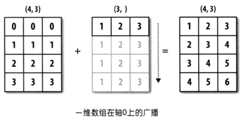

## NumPy Applications - 3

### Array Operations

The most convenient aspect of using NumPy is that when performing operations on array elements, you don't need to write loop code to iterate over each element -- all operations are automatically **vectorized**. Simply put, mathematical operations and functions in NumPy automatically apply to every element in the array.

#### Array and Scalar Operations

NumPy arrays can perform addition, subtraction, multiplication, division, modulo, exponentiation, and other operations with a single value, and the corresponding operation will be applied to every element of the array, as shown below.

Code:

```python
array1 = np.arange(1, 10)
print(array1 + 10)
print(array1 * 10)
```

Output:

```
[11 12 13 14 15 16 17 18 19]
[10 20 30 40 50 60 70 80 90]
```

In addition to the operations above, relational operations also work without issues, as we've already seen when discussing boolean indexing.

Code:

```python
print(array1 > 5)
print(array1 % 2 == 0)
```

Output:

```
[False False False False False  True  True  True  True]
[False  True False  True False  True False  True False]
```

#### Array and Array Operations

NumPy arrays can also perform arithmetic and relational operations with other arrays. The operations are applied to corresponding elements of the two arrays, which requires both arrays to have the same shape (`shape` attribute), as shown below.

Code:

```python
array2 = np.array([1, 1, 1, 2, 2, 2, 3, 3, 3])
print(array1 + array2)
print(array1 * array2)
print(array1 ** array2)
```

Output:

```
[ 2  3  4  6  7  8 10 11 12]
[ 1  2  3  8 10 12 21 24 27]
[  1   2   3  16  25  36 343 512 729]
```

Code:

```python
print(array1 > array2)
print(array1 % array2 == 0)
```

Output:

```
[False  True  True  True  True  True  True  True  True]
[ True  True  True  True False  True False False  True]
```

#### Universal Unary Functions

Universal unary functions in NumPy take a single array object as a parameter and perform element-level processing on the array. For example, the `sqrt` function computes the square root of each element in the array, while the `log2` function computes the base-2 logarithm of each element, as shown below.

Code:

```python
print(np.sqrt(array1))
print(np.log2(array1))
```

Output:

```
[1.         1.41421356 1.73205081 2.         2.23606798 2.44948974
 2.64575131 2.82842712 3.        ]
[0.         1.         1.5849625  2.         2.32192809 2.5849625
 2.80735492 3.         3.169925  ]
```

**Table 1: Universal Unary Functions**

| Function                         | Description                                             |
| -------------------------------- | ------------------------------------------------------- |
| `abs` / `fabs`                   | Absolute value function                                 |
| `sqrt`                           | Square root function, equivalent to `array ** 0.5`      |
| `square`                         | Square function, equivalent to `array ** 2`             |
| `exp`                            | Computes $\small{e^x}$, equivalent to `np.e ** array`   |
| `log` / `log10` / `log2`        | Logarithm functions (base `e` / base `10` / base `2`)  |
| `sign`                           | Sign function (`1` - positive; `0` - zero; `-1` - negative) |
| `ceil` / `floor`                 | Ceiling / Floor                                         |
| `isnan`                          | Returns boolean array, `True` for NaN, `False` for non-NaN |
| `isfinite` / `isinf`            | Functions to check whether values are infinite          |
| `cos` / `cosh` / `sin`          | Trigonometric functions                                 |
| `sinh` / `tan` / `tanh`         | Trigonometric functions                                 |
| `arccos` / `arccosh` / `arcsin` | Inverse trigonometric functions                         |
| `arcsinh` / `arctan` / `arctanh`| Inverse trigonometric functions                         |
| `rint` / `round`                | Rounding functions                                      |

#### Universal Binary Functions

Universal binary functions in NumPy take two array objects as parameters and perform operations on corresponding elements of the two arrays. For example, the `maximum` function finds the maximum value among corresponding elements of two arrays, while the `power` function raises corresponding elements to a power, as shown below.

Code:

```python
array3 = np.array([[4, 5, 6], [7, 8, 9]])
array4 = np.array([[1, 2, 3], [3, 2, 1]])
print(np.maximum(array3, array4))
print(np.power(array3, array4))
```

Output:

```
[[4 5 6]
 [7 8 9]]
[[  4  25 216]
 [343  64   9]]
```

**Table 2: Universal Binary Functions**

| Function                           | Description                                                  |
| ---------------------------------- | ------------------------------------------------------------ |
| `add(x, y)` / `substract(x, y)`   | Addition function / Subtraction function                     |
| `multiply(x, y)` / `divide(x, y)` | Multiplication function / Division function                  |
| `floor_divide(x, y)` / `mod(x, y)`| Floor division function / Modulo function                    |
| `allclose(x, y)`                   | Check if elements of arrays `x` and `y` are approximately equal |
| `power(x, y)`                      | For element $\small{x_{i}}$ of array `x` and element $\small{y_{i}}$ of array `y`, computes $\small{x_{i}^{y_{i}}}$ |
| `maximum(x, y)` / `fmax(x, y)`    | Pairwise comparison to get maximum / Get maximum (ignoring NaN) |
| `minimum(x, y)` / `fmin(x, y)`    | Pairwise comparison to get minimum / Get minimum (ignoring NaN) |
| `dot(x, y)`                        | Dot product (scalar product, usually denoted by $\small{\cdot}$, used in Euclidean space) |
| `inner(x, y)`                      | Inner product (the concept of inner product is broader than dot product; dot product is a special case of inner product in Euclidean space $\small{\mathbb{R}^{n}}$, while inner product can be generalized to normed vector spaces as long as it satisfies the parallelogram law) |
| `cross(x, y) `                     | Cross product (vector product, usually denoted by $\small{\times}$, the result is a vector) |
| `outer(x, y)`                      | Outer product (tensor product, usually denoted by $\small{\bigotimes}$, the result is typically a matrix) |
| `intersect1d(x, y)`                | Compute the intersection of `x` and `y`, returning a sorted array of these elements |
| `union1d(x, y)`                    | Compute the union of `x` and `y`, returning a sorted array of these elements |
| `in1d(x, y)`                       | Return a boolean array indicating whether each element of `x` is in `y` |
| `setdiff1d(x, y)`                  | Compute the set difference of `x` and `y`, returning an array of these elements |
| `setxor1d(x, y)`                   | Compute the symmetric difference of `x` and `y`, returning an array of these elements |

> **Note**: Operations involving vectors and matrices will be explained in the next chapter.

#### Broadcasting Mechanism

In the array operation examples above, the two arrays had exactly the same shape (`shape` attribute). Now let's examine whether two arrays with different shapes can directly perform binary operations or use universal binary functions. Consider the following examples.

Code:

```python
array5 = np.array([[0, 0, 0], [1, 1, 1], [2, 2, 2], [3, 3, 3]])
array6 = np.array([1, 2, 3])
array5 + array6
```

Output:

```
array([[1, 2, 3],
       [2, 3, 4],
       [3, 4, 5],
       [4, 5, 6]])
```

Code:

```python
array7 = np.array([[1], [2], [3], [4]])
array5 + array7
```

Output:

```
array([[1, 1, 1],
       [3, 3, 3],
       [5, 5, 5],
       [7, 7, 7]])
```

From the examples above, we can see that arrays with different shapes can still perform binary operations, but this doesn't mean that arrays of any shape can do so. Simply put, broadcasting is only triggered when the trailing dimensions of the two arrays are the same, or when the trailing dimensions differ but one of the arrays has a trailing dimension of 1. Through broadcasting, NumPy transforms two arrays that originally have different shapes into the same shape, enabling binary operations. The term "trailing dimensions" refers to the corresponding parts of the array shapes (`shape` attribute) when viewed from right to left. Let's illustrate with examples.



In the figure above, one array has shape `(4, 3)` and the other has shape `(3, )`. Looking from right to left, the corresponding parts are both `3`, meaning the trailing dimensions are the same. Broadcasting can be applied, and the second array will broadcast itself along the axis of the missing dimension, ultimately making the two arrays' shapes consistent.


In the figure above, one array has shape `(3, 4, 2)` and the other has shape `(4, 2)`. Looking from right to left, the corresponding parts are both `(4, 2)`, meaning the trailing dimensions are the same. Broadcasting can be applied, and the second array will broadcast itself along the axis of the missing dimension, ultimately making the two arrays' shapes consistent.


In the figure above, one array has shape `(4, 3)` and the other has shape `(4, 1)`. This is a case where the trailing dimensions are different, but the dimension where the second array differs from the first is `1`. The second array can broadcast itself along the axis with dimension `1`, ultimately making the two arrays' shapes consistent.

> **Think about it**: Can a 3-row by 1-column 2D array and a 1-row by 3-column 2D array perform addition?

### Other Common Functions

Besides the functions mentioned above, NumPy provides many more functions for processing arrays. Many methods of `ndarray` objects can also be achieved by calling functions. The table below lists some commonly used functions.

**Table 3: Other Common NumPy Functions**

| Function                       | Description                                              |
| ------------------------------ | -------------------------------------------------------- |
| `unique`                       | Remove duplicate elements from an array, returning a sorted array of unique elements |
| `copy`                         | Return a copy of the array                               |
| `sort`                         | Return a sorted copy of the array elements               |
| `split` / `hsplit` / `vsplit`  | Split an array into multiple sub-arrays                  |
| `stack` / `hstack` / `vstack`  | Stack multiple arrays into a new array                   |
| `concatenate`                  | Concatenate multiple arrays along a specified axis into a new array |
| `append` / `insert`            | Append elements to the end of an array / Insert elements at a specified position |
| `argwhere`                     | Find the positions of non-zero elements                  |
| `extract` / `select` / `where`| Extract or process array elements based on specified conditions |
| `flip`                         | Flip elements along a specified axis                     |
| `fromregex`                    | Create an array by reading a file and parsing with regex |
| `repeat` / `tile`              | Create a new array by repeating elements                 |
| `roll`                         | Shift array elements along a specified axis              |
| `resize`                       | Resize the array                                         |
| `place` / `put`                | Replace elements that meet conditions / Replace specified elements with given values |
| `partition`                    | Partition the array using a selected element and return the partitioned array |

**Deduplication (keeping only one of each duplicate element)**.

Code:

```python
np.unique(array5)
```

Output:

```
array([0, 1, 2, 3])
```

**Stacking and concatenation**.

Code:

```python
array8 = np.array([[1, 1, 1], [2, 2, 2], [3, 3, 3]])
array9 = np.array([[4, 4, 4], [5, 5, 5], [6, 6, 6]])
np.hstack((array8, array9))
```

Output:

```
array([[1, 1, 1, 4, 4, 4],
       [2, 2, 2, 5, 5, 5],
       [3, 3, 3, 6, 6, 6]])
```

Code:

```python
np.vstack((array8, array9))
```

Output:

```
array([[1, 1, 1],
       [2, 2, 2],
       [3, 3, 3],
       [4, 4, 4],
       [5, 5, 5],
       [6, 6, 6]])
```

Code:

```python
np.concatenate((array8, array9))
```

Output:

```
array([[1, 1, 1],
       [2, 2, 2],
       [3, 3, 3],
       [4, 4, 4],
       [5, 5, 5],
       [6, 6, 6]])
```

Code:

```python
np.concatenate((array8, array9), axis=1)
```

Output:

```
array([[1, 1, 1, 4, 4, 4],
       [2, 2, 2, 5, 5, 5],
       [3, 3, 3, 6, 6, 6]])
```

**Appending and inserting elements**.

Code:

```python
np.append(array1, [10, 100])
```

Output:

```
array([  1,   2,   3,   4,   5,   6,   7,   8,   9,  10, 100])
```

Code:

```python
np.insert(array1, 1, [98, 99, 100])
```

Output:

```
array([  1,  98,  99, 100,   2,   3,   4,   5,   6,   7,   8,   9])
```

**Extracting and processing elements**.

Code:

```python
np.extract(array1 % 2 != 0, array1)
```

Output:

```
array([1, 3, 5, 7, 9])
```

> **Note**: The `extract` function operation above is equivalent to the boolean indexing we discussed earlier.

Code:

```python
np.select([array1 <= 3, array1 >= 7], [array1 * 10, array1 ** 2])
```

Output:

```
array([10, 20, 30,  0,  0,  0, 49, 64, 81])
```

> **Note**: The first parameter of the `select` function above sets two conditions. Elements satisfying the first condition are multiplied by 10, elements satisfying the second condition are squared, and elements that don't satisfy either condition are set to 0.

Code:

```python
np.where(array1 <= 5, array1 * 10, array1 ** 2)
```

Output:

```
array([10, 20, 30, 40, 50, 36, 49, 64, 81])
```

> **Note**: The first parameter of the `where` function specifies the condition. Elements satisfying the condition are multiplied by 10, while elements that don't satisfy the condition are squared.

**Creating new arrays by repeating array elements**.

Code:

```python
np.repeat(array1, 3)
```

Output:

```
array([1, 1, 1, 2, 2, 2, 3, 3, 3, 4, 4, 4, 5, 5, 5, 6, 6, 6, 7, 7, 7, 8, 8, 8, 9, 9, 9])
```

Code:

```python
np.tile(array1, 2)
```

Output:

```
array([1, 2, 3, 4, 5, 6, 7, 8, 9, 1, 2, 3, 4, 5, 6, 7, 8, 9])
```

**Resizing arrays**.

Code:

```python
np.resize(array1, (5, 3))
```

Output:

```
array([[1, 2, 3],
       [4, 5, 6],
       [7, 8, 9],
       [1, 2, 3],
       [4, 5, 6]])
```

> **Tip**: `array1` was originally a 1D array with 9 elements. Using the `resize` function, it becomes a 2D array with 5 rows and 3 columns (15 elements total), with missing elements filled by reusing elements from the original array.

Code:

```python
 np.resize(array5, (2, 4))
```

Output:

```
array([[0, 0, 0, 1],
       [1, 1, 2, 2]])
```

**Replacing array elements**.

Code:

```python
np.put(array1, [0, 1, -1, 3, 5], [100, 200])
array1
```

Output:

```
array([100, 200,   3, 200,   5, 100,   7,   8, 100])
```

> **Note**: The second parameter of the `put` function specifies the indices of elements to be replaced, but only `100` and `200` are provided as replacement values, so these two values are used cyclically. Therefore, elements at indices `0`, `1`, `-1`, `3`, `5` are replaced with `100`, `200`, `100`, `200`, `100` respectively.

Code:

```python
np.place(array1, array1 > 5, [1, 2, 3])
array1
```

Output:

```
array([1, 2, 3, 3, 5, 1, 2, 3, 1])
```

> **Note**: Both the `put` and `place` functions do not return a new array object; instead, they perform replacements directly on the original array.
