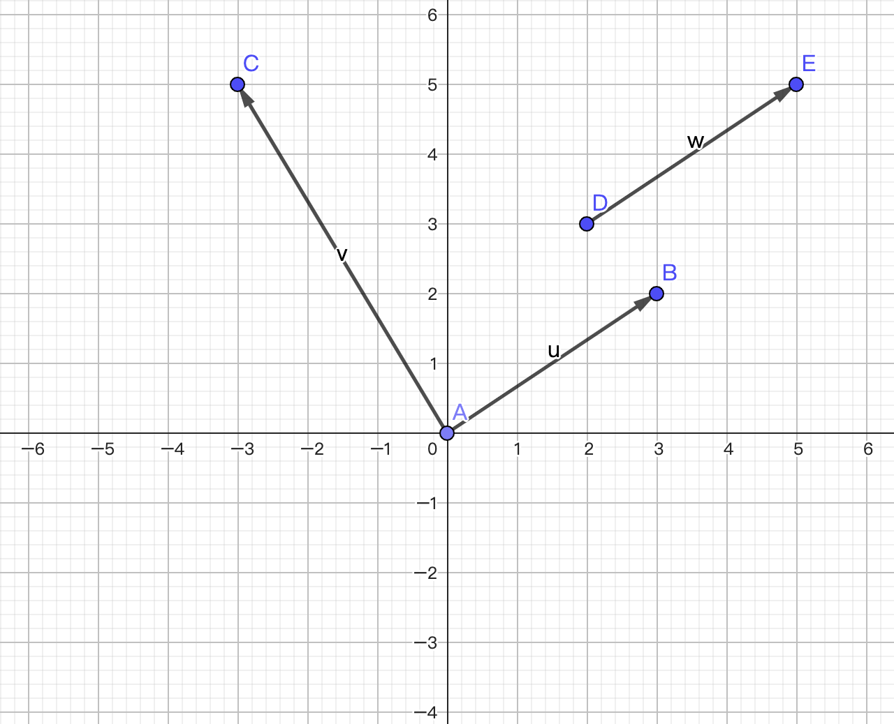
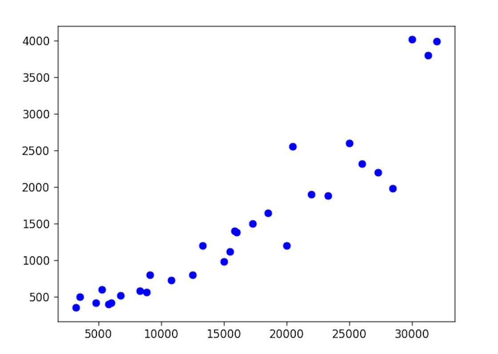

## NumPy Applications - 4

### Vectors

A **vector** (*vector*) is a geometric object that simultaneously has magnitude and direction, and satisfies the parallelogram law. The concept opposite to a vector is called a **scalar**, which has only magnitude and in most cases no direction. We usually represent vectors as line segments with arrows. Vectors in a Cartesian coordinate system are shown in the figure below. It is important to note that a vector represents magnitude and direction without specifying start and end points, so the same vector can be drawn at any position. For example, in the figure below, vectors $\small{\boldsymbol{w}}$ and $\small{\boldsymbol{u}}$ are identical.



There are many algebraic representations for vectors. For a two-dimensional vector, the following notations are all valid.

$$
\boldsymbol{a} = \langle a_1, a_2 \rangle = (a_1, a_2) = \begin{pmatrix} a_1 \\\\ a_2 \end{pmatrix} = \begin{bmatrix} a_1 \\\\ a_2 \end{bmatrix}
$$

The magnitude of a vector is called the norm of the vector, which is a scalar. For a two-dimensional vector, the norm can be calculated using the following formula.

$$
\lvert \boldsymbol{a} \rvert = \sqrt{a_{1}^{2} + a_{2}^{2}}
$$

Note that $\small{\lvert \boldsymbol{a} \rvert}$ here does not represent absolute value; you can call it the 2-norm of vector $\small{\boldsymbol{a}}$. This is a case of symbol reuse in mathematics. The notation and concepts above can also be extended to $\small{n}$-dimensional space. We usually use $\small{\boldsymbol{R^{n}}}$ to represent $\small{n}$-dimensional space. The two-dimensional space we just discussed can be written as $\small{\boldsymbol{R^{2}}}$, and three-dimensional space as $\small{\boldsymbol{R^{3}}}$. Although it is difficult for us living in three-dimensional space to imagine what four-dimensional or five-dimensional space looks like, this does not prevent us from exploring higher-dimensional spaces. In machine learning, we often refer to a training sample with $\small{n}$ features as an $\small{n}$-dimensional vector.

#### Vector Addition

Vectors of the same dimension can be added to produce a new vector. The method is to add the corresponding components of the vectors, as shown below.

$$
\boldsymbol{u} = \begin{bmatrix} u_1 \\\\ u_2 \\\\ \vdots \\\\ u_n \end{bmatrix}, \quad
\boldsymbol{v} = \begin{bmatrix} v_1 \\\\ v_2 \\\\ \vdots \\\\ v_n \end{bmatrix}, \quad
\boldsymbol{u} + \boldsymbol{v} = \begin{bmatrix} u_1 + v_1 \\\\ u_2 + v_2 \\\\ \vdots \\\\ u_n + v_n \end{bmatrix}
$$

Vector addition satisfies the "parallelogram law," meaning that two vectors $\small{\boldsymbol{u}}$ and $\small{\boldsymbol{v}}$ form two adjacent sides of a parallelogram, and the result of their addition is the diagonal of the parallelogram, as shown in the figure below.


#### Scalar Multiplication of Vectors

A vector $\small{\boldsymbol{v}}$ can be multiplied by a scalar $\small{k}$. The method is to multiply each component of the vector by that scalar, as shown below.

$$
\boldsymbol{v} = \begin{bmatrix} v_1 \\\\ v_2 \\\\ \vdots \\\\ v_n \end{bmatrix}, \quad
k \cdot \boldsymbol{v} = \begin{bmatrix} k \cdot v_1 \\\\ k \cdot v_2 \\\\ \vdots \\\\ k \cdot v_n \end{bmatrix}
$$

We can use NumPy arrays to represent vectors. Vector addition can be implemented through array addition, and scalar multiplication can be implemented through array-scalar multiplication. We won't elaborate further here.

#### Dot Product of Vectors

The dot product (*dot product*) is one of the most important operations between two vectors. The method is to compute the sum of the products of corresponding components of the two vectors, so the result of the dot product is a scalar. Its geometric meaning is the product of the norms of the two vectors multiplied by the cosine of the angle between them, as shown below.

$$
\boldsymbol{u} = \begin{bmatrix} u_1 \\\\ u_2 \\\\ \vdots \\\\ u_n \end{bmatrix}, \quad
\boldsymbol{v} = \begin{bmatrix} v_1 \\\\ v_2 \\\\ \vdots \\\\ v_n \end{bmatrix} \quad
$$

$$
\boldsymbol{u} \cdot \boldsymbol{v} = \sum_{i=1}^{n}{u_iv_i} = \lvert \boldsymbol{u} \rvert \lvert \boldsymbol{v} \rvert cos\theta
$$

Suppose we use 3D vectors to represent a user's preferences for comedy, romance, and action movies. We use numbers from 1 to 5 to indicate the level of preference, where 5 means really likes, 4 means somewhat likes, 3 means indifferent, 2 means somewhat dislikes, and 1 means strongly dislikes. The following vector indicates that the user really likes comedy, strongly dislikes romance, and is indifferent to action movies.

$$
\boldsymbol{u} = \begin{pmatrix} 5 \\\\ 1 \\\\ 3 \end{pmatrix}
$$

Now two movies have been released: one is a romantic comedy and the other is a comedy action film. We can also represent these two movies as 3D vectors, as shown below.

$$
\boldsymbol{m_1} = \begin{pmatrix} 4 \\\\ 5 \\\\ 1 \end{pmatrix}, \quad \boldsymbol{m_2} = \begin{pmatrix} 5 \\\\ 1 \\\\ 5 \end{pmatrix}
$$

If we need to recommend a movie to the user mentioned above, which one should we recommend? We can compute the dot product of the user vector $\small{\boldsymbol{u}}$ with each movie vector $\small{\boldsymbol{m_{1}}}$ and $\small{\boldsymbol{m_{2}}}$, then divide by the product of their norms to get the cosine of the angle between the vectors. The closer the cosine value is to 1, the closer the angle is to 0 degrees, meaning the two vectors are more similar. Clearly, we should recommend the movie that has a higher similarity to the user's viewing preferences.

$$
cos\theta_1 = \frac{\boldsymbol{u} \cdot \boldsymbol{m1}}{|\boldsymbol{u}||\boldsymbol{m1}|} \approx \frac{4 \times 5 + 5 \times 1 + 3 \times 1}{5.92 \times 6.48} \approx 0.73
$$

$$
cos\theta_2 = \frac{\boldsymbol{u} \cdot \boldsymbol{m2}}{|\boldsymbol{u}||\boldsymbol{m2}|} \approx \frac{5 \times 5 + 1 \times 1 + 3 \times 5}{5.92 \times 7.14} \approx 0.97
$$

You might say that the movie represented by vector $\small{\boldsymbol{m_{2}}}$ is obviously a better match for the user. Indeed, for a 3D vector, we can give the correct answer based on intuition. But for an $\small{n}$-dimensional vector, when $\small{n}$ is very large, would you still be confident in giving an accurate answer based on visual observation and instinct alone? The dot product of vectors can be computed using the `dot` function, and the norm of a vector can be computed using the `norm` function from NumPy's `linalg` module, as shown below.

```python
u = np.array([5, 1, 3])
m1 = np.array([4, 5, 1])
m2 = np.array([5, 1, 5])
print(np.dot(u, m1) / (np.linalg.norm(u) * np.linalg.norm(m1)))  # 0.7302967433402214
print(np.dot(u, m2) / (np.linalg.norm(u) * np.linalg.norm(m2)))  # 0.9704311900788593
```

#### Cross Product of Vectors

In two-dimensional space, the cross product of two vectors is defined as:

$$
\boldsymbol{A} = \begin{pmatrix} a_{1} \\\\ a_{2} \end{pmatrix}, \quad \boldsymbol{B} = \begin{pmatrix} b_{1} \\\\ b_{2} \end{pmatrix}
$$

$$
\boldsymbol{A} \times \boldsymbol{B} = \begin{vmatrix} a_{1} \quad a_{2} \\\\ b_{1} \quad b_{2} \end{vmatrix} = a_{1}b_{2} - a_{2}b_{1}
$$

For three-dimensional space, the cross product of two vectors results in a vector, as shown below:

$$
\boldsymbol{A} = \begin{pmatrix} a_{1} \\\\ a_{2} \\\\ a_{3} \end{pmatrix}, \quad \boldsymbol{B} = \begin{pmatrix} b_{1} \\\\ b_{2} \\\\ b_{3} \end{pmatrix}
$$

$$
\boldsymbol{A} \times \boldsymbol{B} = \begin{vmatrix} \boldsymbol{\hat{i}} \quad \boldsymbol{\hat{j}} \quad \boldsymbol{\hat{k}} \\\\ a_{1} \quad a_{2} \quad a_{3} \\\\ b_{1} \quad b_{2} \quad b_{3} \end{vmatrix} = \langle \boldsymbol{\hat{i}}\begin{vmatrix} a_{2} \quad a_{3} \\\\ b_{2} \quad b_{3} \end{vmatrix}, -\boldsymbol{\hat{j}}\begin{vmatrix} a_{1} \quad a_{3} \\\\ b_{1} \quad b_{3} \end{vmatrix}, \boldsymbol{\hat{k}}\begin{vmatrix} a_{1} \quad a_{2} \\\\ b_{1} \quad b_{2} \end{vmatrix} \rangle
$$

Since the result of the cross product is a vector, $\small{\boldsymbol{A} \times \boldsymbol{B}}$ and $\small{\boldsymbol{B} \times \boldsymbol{A}}$ are not the same. In fact:

$$
\boldsymbol{A} \times \boldsymbol{B} = -(\boldsymbol{B} \times \boldsymbol{A})
$$

In NumPy, the cross product of vectors can be computed using the `cross` function, as shown below.

```python
print(np.cross(u, m1))  # [-14   7  21]
print(np.cross(m1, u))  # [ 14  -7 -21]
```

### Determinants

A **determinant** (*determinant*) is usually written as $\small{det(\boldsymbol{A})}$ or $\small{ \lvert \boldsymbol{A} \rvert}$, where $\small{\boldsymbol{A}}$ is an $\small{n}$th-order square matrix. A determinant can be seen as the generalization of the concept of signed area or volume to general Euclidean space, or it describes the effect of a linear transformation on "volume." The concept of determinants first appeared in the process of solving systems of linear equations. In the late 17th century, the works of Seki Takakazu (a Japanese mathematician of the Edo period) and Leibniz already used determinants to determine the number and form of solutions to systems of linear equations. From the 18th century onward, determinants began to be studied as an independent mathematical concept. After the 19th century, the theory of determinants was further developed and refined.

#### Properties of Determinants

Determinants are derived from vectors, so what determinants describe are actually properties of vectors.

**Property 1**: If all elements of a certain row (or column) in $\small{det(\boldsymbol{A})}$ are 0, then $\small{det(\boldsymbol{A}) = 0}$.

**Property 2**: If a certain row (or column) in $\small{det(\boldsymbol{A})}$ has a common factor $\small{k}$, then $\small{k}$ can be factored out, yielding determinant $\small{det(\boldsymbol{A^{'}})}$, and $\small{det(\boldsymbol{A}) = k \cdot det(\boldsymbol{A^{'}})}$.

$$
det(\boldsymbol{A})={\begin{vmatrix}a_{11}&a_{12}&\dots &a_{1n}\\\\\vdots &\vdots &\ddots &\vdots \\\\{\color {blue}k}a_{i1}&{\color {blue}k}a_{i2}&\dots &{\color {blue}k}a_{in}\\\\\vdots &\vdots &\ddots &\vdots \\\\a_{n1}&a_{n2}&\dots &a_{nn}\end{vmatrix}}={\color {blue}k}{\begin{vmatrix}a_{11}&a_{12}&\dots &a_{1n}\\\\\vdots &\vdots &\ddots &\vdots \\\\a_{i1}&a_{i2}&\dots &a_{in}\\\\\vdots &\vdots &\ddots &\vdots \\\\a_{n1}&a_{n2}&\dots &a_{nn}\end{vmatrix}}={\color {blue}k} \cdot det(\boldsymbol{A^{'}})
$$

**Property 3**: If each element of a certain row (or column) in $\small{det(\boldsymbol{A})}$ is a sum of two numbers, then the determinant can be split into the sum of two determinants, as shown below.

$$
{\begin{vmatrix}a_{11}&a_{12}&\dots &a_{1n}\\\\\vdots &\vdots &\ddots &\vdots \\\\{\color {blue}a_{i1}}+{\color {OliveGreen}b_{i1}}&{\color {blue}a_{i2}}+{\color {OliveGreen}b_{i2}}&\dots &{\color {blue}a_{in}}+{\color {OliveGreen}b_{in}}\\\\\vdots &\vdots &\ddots &\vdots \\\\a_{n1}&a_{n2}&\dots &a_{nn}\end{vmatrix}}={\begin{vmatrix}a_{11}&a_{12}&\dots &a_{1n}\\\\\vdots &\vdots &\ddots &\vdots \\\\{\color {blue}a_{i1}}&{\color {blue}a_{i2}}&\dots &{\color {blue}a_{in}}\\\\\vdots &\vdots &\ddots &\vdots \\\\a_{n1}&a_{n2}&\dots &a_{nn}\end{vmatrix}}+{\begin{vmatrix}a_{11}&a_{12}&\dots &a_{1n}\\\\\vdots &\vdots &\ddots &\vdots \\\\{\color {OliveGreen}b_{i1}}&{\color {OliveGreen}b_{i2}}&\dots &{\color {OliveGreen}b_{in}}\\\\\vdots &\vdots &\ddots &\vdots \\\\a_{n1}&a_{n2}&\dots &a_{nn}\end{vmatrix}}
$$

**Property 4**: If the elements of two rows (or columns) in $\small{det(\boldsymbol{A})}$ are proportional, then $\small{det(\boldsymbol{A}) = 0}$.

**Property 5**: If two rows (or columns) in $\small{det(\boldsymbol{A})}$ are swapped to obtain $\small{det(\boldsymbol{A^{'}})}$, then $\small{det(\boldsymbol{A}) = -det(\boldsymbol{A^{'}})}$.

**Property 6**: Adding $\small{k}$ times one row (or column) of $\small{det(\boldsymbol{A})}$ to another row (or column) does not change the value of the determinant, as shown below.

$$
{\begin{vmatrix}\vdots &\vdots &\vdots &\vdots \\\\ a_{i1}&a_{i2}&\dots &a_{in} \\\\ a_{j1}&a_{j2}&\dots &a_{jn}\\\\\vdots &\vdots &\vdots &\vdots \\\\ \end{vmatrix}}={\begin{vmatrix}\vdots &\vdots &\vdots &\vdots \\\\ a_{i1}&a_{i2}&\dots &a_{in} \\\\ a_{j1}{\color {blue}+ka_{i1}}&a_{j2}{\color {blue}+ka_{i2}}&\dots &a_{jn}{\color {blue}+ka_{in}} \\\\ \vdots &\vdots &\vdots &\vdots \\\\ \end{vmatrix}}
$$

**Property 7**: Transposing the rows and columns of a determinant does not change its value, as shown below.

$$
{\begin{vmatrix}a_{11}&a_{12}&\dots &a_{1n} \\\\ a_{21}&a_{22}&\dots &a_{2n} \\\\ \vdots &\vdots &\ddots &\vdots  \\\\ a_{n1}&a_{n2}&\dots &a_{nn}\end{vmatrix}}={\begin{vmatrix}a_{11}&a_{21}&\dots &a_{n1} \\\\ a_{12}&a_{22}&\dots &a_{n2} \\\\ \vdots &\vdots &\ddots &\vdots  \\\\ a_{1n}&a_{2n}&\dots &a_{nn}\end{vmatrix}}
$$

**Property 8**: The determinant of the product of square matrices $\small{\boldsymbol{A}}$ and $\small{\boldsymbol{B}}$ equals the product of their determinants, i.e., $\small{det(\boldsymbol{A}\boldsymbol{B}) = det(\boldsymbol{A})det(\boldsymbol{B})}$. In particular, if each row of a matrix is multiplied by a constant $\small{r}$, then the value of the determinant will be $\small{r^{n}}$ times the original, i.e., $\small{det(r\boldsymbol{A}) = det(r\boldsymbol{I_{n}} \cdot \boldsymbol{A}) = r^{n}det(\boldsymbol{A})}$, where $\small{\boldsymbol{I_{n}}}$ is the $\small{n}$th-order identity matrix.

**Property 9**: If $\small{\boldsymbol{A}}$ is an invertible matrix, then $\small{det(\boldsymbol{A}^{-1}) = (det(\boldsymbol{A}))^{-1}}$.

#### Computing Determinants

The formula for computing an $\small{n}$th-order determinant is as follows:

$$
det(\boldsymbol{A})=\sum_{n!} \pm {a_{1\alpha}a_{2\beta} \cdots a_{n\omega}}
$$

For a second-order determinant, the formula above is equivalent to:

$$
\begin{vmatrix} a_{11} \quad a_{12} \\\\ a_{21} \quad a_{22} \end{vmatrix} = a_{11}a_{22} - a_{12}a_{21}
$$

For a third-order determinant, the formula above is equivalent to:

$$
\begin{vmatrix} a_{11} \quad a_{12} \quad a_{13} \\\\ a_{21} \quad a_{22} \quad a_{23} \\\\ a_{31} \quad a_{32} \quad a_{33} \end{vmatrix} = a_{11}a_{22}a_{33} + a_{12}a_{23}a_{31} + a_{13}a_{21}a_{32} - a_{11}a_{23}a_{32} - a_{12}a_{21}a_{33} - a_{13}a_{22}a_{31}
$$

Higher-order determinants can be expanded using **cofactors** (*cofactor*) into multiple lower-order determinants, as shown below:

$$
det(\boldsymbol{A})=a_{11}C_{11}+a_{12}C_{12}+ \cdots +a_{1n}C_{1n} = \sum_{i=1}^{n}{a_{1i}C_{1i}}
$$

Where $\small{C_{11}}$ is the determinant formed by the remaining part after removing the row and column containing $\small{a_{11}}$ from the original determinant, and so on.

### Matrices

A **matrix** (*matrix*) is a rectangular array of elements arranged in rows and columns. The elements of a matrix can be numbers, symbols, or mathematical formulas. Matrices support operations such as **addition**, **subtraction**, **scalar multiplication**, **transpose**, and **matrix multiplication**, as shown in the figure below.


Worth mentioning is matrix multiplication. This operation is only defined when the number of columns of the first matrix $\small{\boldsymbol{A}}$ equals the number of rows of the other matrix $\small{\boldsymbol{B}}$. If $\small{\boldsymbol{A}}$ is an $\small{m \times n}$ matrix and $\small{\boldsymbol{B}}$ is an $\small{n \times k}$ matrix, their product is an $\small{m \times k}$ matrix, as shown in the figure below.


For example:

$$
\begin{bmatrix} 1 & 0 & 2 \\\\ -1 & 3 & 1 \end{bmatrix} \times \begin{bmatrix} 3 & 1 \\\\ 2 & 1 \\\\ 1 & 0 \end{bmatrix} = \begin{bmatrix} (1 \times 3  +  0 \times 2  +  2 \times 1) & (1 \times 1   +   0 \times 1   +   2 \times 0) \\\\ (-1 \times 3  +  3 \times 2  +  1 \times 1) & (-1 \times 1   +   3 \times 1   +   1 \times 0) \end{bmatrix} = \begin{bmatrix} 5 & 1 \\\\ 4 & 2 \end{bmatrix}
$$

Matrix multiplication satisfies the associative law and the distributive law over matrix addition:

Associativity: $\small{(\boldsymbol{AB})\boldsymbol{C} = \boldsymbol{A}(\boldsymbol{BC})}$.

Left distributivity: $\small{(\boldsymbol{A} + \boldsymbol{B})\boldsymbol{C} = \boldsymbol{AC} + \boldsymbol{BC}}$.

Right distributivity: $\small{\boldsymbol{C}(\boldsymbol{A} + \boldsymbol{B}) = \boldsymbol{CA} + \boldsymbol{CB}}$.

**Matrix multiplication does not satisfy the commutative law**. In general, if the product $\small{\boldsymbol{AB}}$ of matrices $\small{\boldsymbol{A}}$ and $\small{\boldsymbol{B}}$ exists, $\small{\boldsymbol{BA}}$ may not exist, and even if $\small{\boldsymbol{BA}}$ exists, in most cases $\small{\boldsymbol{AB} \neq \boldsymbol{BA}}$.

A fundamental application of matrix multiplication is in systems of linear equations. A system of linear equations is a type of equation system that has the following form:

$$
\begin{cases}
     a_{1,1}x_{1} + a_{1,2}x_{2} + \cdots + a_{1,n}x_{n}=  b_{1} \\\\
     a_{2,1}x_{1} + a_{2,2}x_{2} + \cdots + a_{2,n}x_{n}=  b_{2} \\\\
     \vdots \quad \quad \quad \vdots \\\\
     a_{m,1}x_{1} + a_{m,2}x_{2} + \cdots + a_{m,n}x_{n}=  b_{m}
 \end{cases}
$$

Using matrices, the system of linear equations can be written as a vector equation:

$$
\boldsymbol{Ax} = \boldsymbol{b}
$$

Where $\small{\boldsymbol{A}}$ is the $\small{m \times n}$ matrix formed by the coefficients of the unknowns in the equation system, $\small{\boldsymbol{x}}$ is a row vector containing $\small{n}$ elements, and $\small{\boldsymbol{b}}$ is a row vector containing $\small{m}$ elements.

Matrices are a convenient representation for linear transformations (functions that preserve vector addition and scalar multiplication). The essence of matrix multiplication is best revealed in connection with linear transformations, because matrix multiplication is related to the composition of linear transformations: every $\small{m \times n}$ matrix $\small{\boldsymbol{A}}$ represents a linear transformation from $\small{\boldsymbol{R}^{n}}$ to $\small{\boldsymbol{R}^{m}}$. If you cannot understand the content above, we recommend watching the video series titled [*Essence of Linear Algebra*](https://www.bilibili.com/video/BV1ib411t7YR/) on Bilibili, which should give you a better understanding of linear algebra.

The figure below is an example from Wikipedia, showing the effects of some typical linear transformations on plane vectors (shapes) in the two-dimensional real plane, along with their corresponding 2D matrices. Each linear transformation maps the blue shape to the green shape; the origin $\small{(0, 0)}$ of the plane is represented by a black dot.


#### Matrix Objects

NumPy provides a dedicated module for linear algebra (*linear algebra*) and a type `matrix` for representing matrices. Of course, we can also use 2D arrays to represent matrices. The official recommendation is to use 2D arrays rather than the `matrix` class, and it may be removed in future versions. Regardless, with these encapsulated classes and functions, we can easily perform many matrix operations.

We can create matrix (`matrix`) objects using the following code.

Code:

```Python
m1 = np.matrix('1 2 3; 4 5 6')
m1
```

> **Note**: The `matrix` constructor can accept either an array-like object or a string to construct a matrix object.

Output:

```
matrix([[1, 2, 3],
        [4, 5, 6]])
```

Code:

```Python
m2 = np.asmatrix(np.array([[1, 1], [2, 2], [3, 3]]))
m2
```

> **Note**: The `asmatrix` function can also be replaced by the `mat` function; these two functions are actually the same.

Output:

```
matrix([[1, 1],
        [2, 2],
        [3, 3]])
```

Code:

```Python
m1 * m2
```

Output:

```
matrix([[14, 14],
        [32, 32]])
```

> **Note**: Notice the difference between the multiplication of `matrix` objects and `ndarray` objects. The `*` operation for `matrix` objects is matrix multiplication. If you want to perform matrix multiplication with two 2D arrays, you should use the `@` operator or the `matmul` function, not the `*` operator.

The attributes of matrix objects are shown in the table below.

| Attribute | Description                                              |
| --------- | -------------------------------------------------------- |
| `A`       | Get the `ndarray` object corresponding to the matrix     |
| `A1`      | Get the flattened `ndarray` object corresponding to the matrix |
| `I`       | The inverse of an invertible matrix                      |
| `T`       | The transpose of the matrix                              |
| `H`       | The conjugate transpose of the matrix                    |
| `shape`   | The shape of the matrix                                  |
| `size`    | The number of elements in the matrix                     |

The methods of matrix objects are essentially the same as those of `ndarray` array objects discussed earlier, so we won't elaborate further here.

#### Linear Algebra Module

NumPy's `linalg` module contains a standard set of matrix decomposition operations and functions such as inverse and determinant. These use the same industry-standard linear algebra libraries used by languages like MATLAB and R. The table below lists some commonly used linear algebra functions in `numpy` and the `linalg` module.

| Function      | Description                                                  |
| ------------- | ------------------------------------------------------------ |
| `diag`        | Return the diagonal elements of a square matrix as a 1D array, or convert a 1D array to a square matrix (with non-diagonal elements as 0) |
| `matmul`      | Matrix multiplication operation                              |
| `trace`       | Compute the sum of diagonal elements                         |
| `norm`        | Compute the norm of a matrix or vector                       |
| `det`         | Compute the value of a determinant                           |
| `matrix_rank` | Compute the rank of a matrix                                 |
| `eig`         | Compute the eigenvalues (*eigenvalue*) and eigenvectors (*eigenvector*) of a matrix |
| `inv`         | Compute the inverse of a non-singular matrix ($\small{n}$th-order square matrix) |
| `pinv`        | Compute the Moore-Penrose (*Moore-Penrose*) pseudoinverse of a matrix |
| `qr`          | QR decomposition (decompose a matrix into the product of an orthogonal matrix and an upper triangular matrix) |
| `svd`         | Compute the singular value decomposition (*singular value decomposition*) |
| `solve`       | Solve the system of linear equations $\small{\boldsymbol{Ax}=\boldsymbol{b}}$, where $\small{\boldsymbol{A}}$ is a square matrix |
| `lstsq`       | Compute the least squares solution of $\small{\boldsymbol{Ax}=\boldsymbol{b}}$ |

Let's try some of the functions above. First, let's try computing the inverse matrix.

Code:

```Python
m3 = np.array([[1., 2.], [3., 4.]])
m4 = np.linalg.inv(m3)
m4
```

Output:

```
array([[-2. ,  1. ],
       [ 1.5, -0.5]])
```

Code:

```Python
np.around(m3 @ m4)
```

> **Note**: The `around` function rounds array elements; the default number of decimal places is 0.

Output:

```
array([[1., 0.],
       [0., 1.]])
```

> **Note**: A matrix multiplied by its inverse yields the identity matrix.

Computing the value of a determinant.

Code:

```Python
m5 = np.array([[1, 3, 5], [2, 4, 6], [4, 7, 9]])
np.linalg.det(m5)
```

Output:

```
2
```

Computing the rank of a matrix.

Code:

```Python
np.linalg.matrix_rank(m5)
```

Output:

```
3
```

Solving a system of linear equations.

$$
\begin{cases}
x_1 + 2x_2 + x_3 = 8 \\\\
3x_1 + 7x_2 + 2x_3 = 23 \\\\
2x_1 + 2x_2 + x_3 = 9
\end{cases}
$$

For the system of linear equations above, we can express it in matrix form as shown below.

$$
\boldsymbol{A} = \begin{bmatrix}
1 & 2 & 1 \\\\
3 & 7 & 2 \\\\
2 & 2 & 1
\end{bmatrix}, \quad
\boldsymbol{x} = \begin{bmatrix}
x_1 \\\\
x_2 \\\\
x_3
\end{bmatrix}, \quad
\boldsymbol{b} = \begin{bmatrix}
8 \\\\
23 \\\\
9
\end{bmatrix}
$$

$$
\boldsymbol{Ax} = \boldsymbol{b}
$$

The condition for a unique solution to a system of linear equations: the rank of the coefficient matrix $\small{\boldsymbol{A}}$ equals the rank of the augmented matrix $\small{\boldsymbol{Ab}}$, and both equal the number of unknowns.

Code:

```Python
A = np.array([[1, 2, 1], [3, 7, 2], [2, 2, 1]])
b = np.array([8, 23, 9]).reshape(-1, 1)
print(np.linalg.matrix_rank(A))
print(np.linalg.matrix_rank(np.hstack((A, b))))
```

> **Note**: When using the `reshape` method of array objects, if one of the parameters is -1, the number of elements in that dimension is automatically calculated based on the total number of elements (the `size` attribute) and the other dimensions.

Output:

```
3
3
```

Code:

```Python
np.linalg.solve(A, b)
```

Output:

```
array([[1.],
       [2.],
       [3.]])
```

> **Note**: The result above indicates that the solution to the system of linear equations is: $\small{x_1 = 1, x_2 = 2, x_3 = 3}$.

Below is another method for solving the system of linear equations. Take a moment to think about why this works.

$$
\boldsymbol{x} = \boldsymbol{A}^{-1} \cdot \boldsymbol{b}
$$

Code:

```Python
np.linalg.inv(A) @ b
```

Output:

```
array([[1.],
       [2.],
       [3.]])
```

### Polynomials

In addition to arrays, NumPy also encapsulates data types for **polynomial** (*polynomial*) operations. A polynomial is a sum of products of integer powers of variables and coefficients, in the form:

$$
f(x)=a_nx^n + a_{n-1}x^{n-1} + \cdots + a_1x^{1} + a_0x^{0}
$$

Before NumPy version 1.4, we could use the `poly1d` type to represent polynomials. It is still available, but the official `numpy.polynomial` module has been introduced, which supports not only basic power series polynomials but also Chebyshev polynomials, Laguerre polynomials, and more.

#### Creating Polynomial Objects

Creating a `poly1d` object, for example: $\small{f(x)=3x^{2}+2x+1}$.

Code:

```python
p1 = np.poly1d([3, 2, 1])
p2 = np.poly1d([1, 2, 3])
print(p1)
print(p2)
```

Output:

```
   2
3 x + 2 x + 1
   2
1 x + 2 x + 3
```

#### Polynomial Operations

**Getting the coefficients of a polynomial**

Code:

```python
print(p1.coefficients)
print(p2.coeffs)
```

Output:

```
[3 2 1]
[1 2 3]
```

**Arithmetic operations on two polynomials**

Code:

```python
print(p1 + p2)
print(p1 * p2)
```

Output:

```
   2
4 x + 4 x + 4
   4     3      2
3 x + 8 x + 14 x + 8 x + 3
```

**Substituting $\small{x}$ to evaluate the polynomial**

Code:

```python
print(p1(3))
print(p2(3))
```

Output:

```
34
18
```

**Differentiation and indefinite integration of polynomials**

Code:

```python
print(p1.deriv())
print(p1.integ())
```

Output:

```

6 x + 2
   3     2
1 x + 1 x + 1 x
```

**Finding the roots of a polynomial**

For example, given the polynomial $\small{f(x)=x^2+3x+2}$, the roots of the polynomial are the solutions to the quadratic equation $\small{x^2+3x+2=0}$.

Code:

```python
p3 = np.poly1d([1, 3, 2])
print(p3.roots)
```

Output:

```
[-2. -1.]
```

If using the `Polynomial` class from the `numpy.polynomial` module to represent polynomial objects, the corresponding operations are as shown below.

Code:

```python
from numpy.polynomial import Polynomial

p3 = Polynomial((2, 3, 1))
print(p3)           # Print the polynomial
print(p3(3))        # Evaluate the polynomial at x=3
print(p3.roots())   # Compute the roots of the polynomial
print(p3.degree())  # Get the degree of the polynomial
print(p3.deriv())   # Differentiate
print(p3.integ())   # Integrate
```

Output:

```
2.0 + 3.0·x + 1.0·x²
20.0
[-2. -1.]
2
3.0 + 2.0·x
0.0 + 2.0·x + 1.5·x² + 0.33333333·x³
```

#### Least Squares Solution

The `Polynomial` class also has a class method named `fit` that can find the least squares solution for a polynomial. The least-squares solution uses the method of least squares to find the coefficients of the best-fitting function by minimizing the sum of squared errors. Assuming the polynomial is $\small{f(x)=ax+b}$, the least squares solution is the values of $\small{a}$ and $\small{b}$ that minimize the residual sum of squares $\small{RSS}$.

$$
RSS = \sum_{i=0}^{k}{(f(x_i) - y_i)^{2}}
$$

For example, suppose we want to use collected historical data on monthly income and online shopping expenditure to build a prediction model that can predict a person's online shopping expenditure based on their monthly income. Below is the income and online shopping expenditure data we collected, stored in two arrays.

```python
x = np.array([
    25000, 15850, 15500, 20500, 22000, 20010, 26050, 12500, 18500, 27300,
    15000,  8300, 23320,  5250,  5800,  9100,  4800, 16000, 28500, 32000,
    31300, 10800,  6750,  6020, 13300, 30020,  3200, 17300,  8835,  3500
])
y = np.array([
    2599, 1400, 1120, 2560, 1900, 1200, 2320,  800, 1650, 2200,
     980,  580, 1885,  600,  400,  800,  420, 1380, 1980, 3999,
    3800,  725,  520,  420, 1200, 4020,  350, 1500,  560,  500
])
```

We can first plot a scatter chart to see whether the two datasets have a positive or negative correlation. A positive correlation means that larger values in array `x` correspond to larger values in array `y`, while a negative correlation means that larger values in `x` correspond to smaller values in `y`.

```python
import matplotlib.pyplot as plt

plt.figure(dpi=120)
plt.scatter(x, y, color='blue')
plt.show()
```

Output:



If we need to quantitatively study the correlation between the two datasets, we can calculate the covariance or correlation coefficient. The corresponding NumPy functions are `cov` and `corrcoef`.

Code:

```python
np.corrcoef(x, y)
```

Output:

```
array([[1.        , 0.92275889],
       [0.92275889, 1.        ]])
```

> **Note**: The correlation coefficient is a value between `-1` and `1`. The closer it is to `1`, the stronger the positive correlation; the closer it is to `-1`, the stronger the negative correlation; and close to `0` indicates no obvious correlation between the two datasets. The correlation coefficient between monthly income and online shopping expenditure above is `0.92275889`, indicating a strong positive correlation.

Through the operations above, we have confirmed a strong positive correlation between income and online shopping expenditure. So we use this data to create a regression model to find a line that fits these data points well. Here, we can use the `fit` method mentioned above, with the specific code shown below.

Code:

```python
from numpy.polynomial import Polynomial

Polynomial.fit(x, y, deg=1).convert().coef
```

> **Note**: `deg=1` means the highest degree term in the regression model is 1, so the model has the form $\small{y=ax+b}$; if you want to create a model like $\small{y=ax^2+bx+c}$, you would set `deg=2`, and so on.

Output:

```
array([-2.94883437e+02,  1.10333716e-01])
```

Based on the output above, our regression equation should be $\small{y=0.110333716x-294.883437}$. We plot this regression equation on the scatter chart from earlier. The red points are our predicted values, and the blue points are the historical data, i.e., the actual values.

Code:

```python
import matplotlib.pyplot as plt

plt.scatter(x, y, color='blue')
plt.scatter(x, 0.110333716 * x - 294.883437, color='red')
plt.plot(x, 0.110333716 * x - 294.883437, color='darkcyan')
plt.show()
```

Output:


If you don't want to use the `Polynomial` class's `fit` method, you can also use NumPy's `polyfit` function to accomplish the same thing. Interested readers can explore this on their own.

> **Note**: Some images in this chapter are from Wikipedia.
