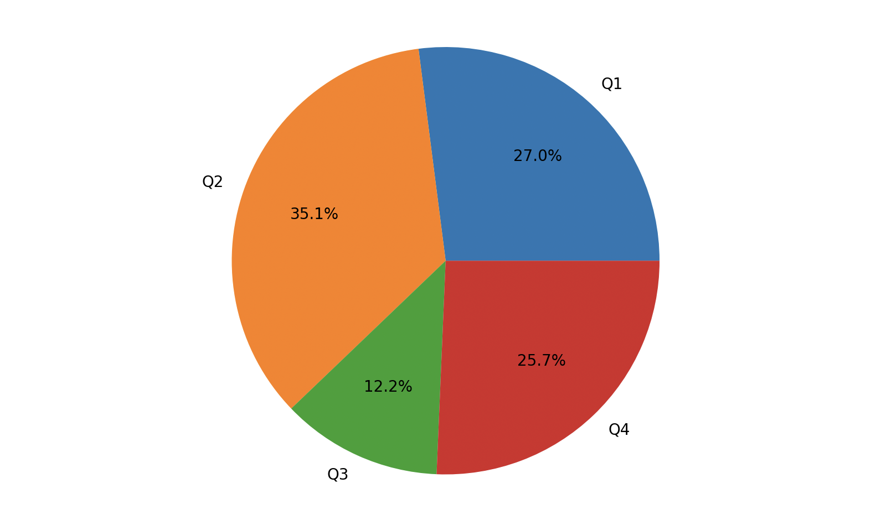

## Pandas In Depth - 1

Pandas is a powerful toolkit for **analyzing structured data** developed by Wes McKinney in 2008. Built on top of NumPy (for data storage and computation), pandas provides specialized types, methods, and functions for data analysis, offering excellent support for data analysis and data mining. Additionally, pandas integrates seamlessly with the data visualization tool matplotlib, making it very easy and convenient to create data visualizations.

The core data types of pandas are `Series` (data series) and `DataFrame` (data frame), used for handling one-dimensional and two-dimensional data respectively. There is also a type called `Index` and its subtypes, which provide indexing functionality for `Series` and `DataFrame`. In daily work, `DataFrame` is the most widely used, as a two-dimensional data structure naturally corresponds to a table with rows and columns. Both `Series` and `DataFrame` provide a large number of methods for data processing, allowing data analysts to perform operations such as filtering, merging, concatenation, cleaning, preprocessing, aggregation, pivoting, and visualization.

### Creating Series Objects

The `Series` object in the pandas library can be used to represent one-dimensional data structures, but with added indexing and some extra functionality. The internal structure of the `Series` type includes two arrays: one for storing data and another for storing data indices. We can create `Series` objects from lists or arrays, as shown below.

Code:

```Python
import numpy as np
import pandas as pd

ser1 = pd.Series(data=[120, 380, 250, 360], index=['Q1', 'Q2', 'Q3', 'Q4'])
ser1
```

> **Note**: The `data` parameter in the `Series` constructor represents the data, and the `index` parameter represents the data index, which serves as the label corresponding to the data.

Output:

```
Q1    120
Q2    380
Q3    250
Q4    360
dtype: int64
```

Creating a Series object from a dictionary.

Code:

```Python
ser2 = pd.Series({'Q1': 320, 'Q2': 180, 'Q3': 300, 'Q4': 405})
ser2
```

> **Note**: When creating a `Series` object from a dictionary, the dictionary keys become the data labels (indices), and the values become the data.

Output:

```
Q1    320
Q2    180
Q3    300
Q4    405
dtype: int64
```

### Operations on Series Objects

#### Scalar Operations

Let's try adding `10` to each quarter of `ser1`, as shown below.

Code:

```python
ser1 += 10
ser1
```

Output:

```
Q1    130
Q2    390
Q3    260
Q4    370
dtype: int64
```

#### Vector Operations

Let's try adding the corresponding quarterly data of `ser1` and `ser2`, as shown below.

Code:

```python
ser1 + ser2
```

Output:

```
Q1    450
Q2    570
Q3    560
Q4    775
dtype: int64
```

#### Indexing Operations

##### Basic Indexing

Like arrays, `Series` objects also support indexing and slicing operations. The difference is that since `Series` objects internally maintain an index array, in addition to using integer indices to retrieve data, you can also use custom indices (labels) to access the corresponding data.

Using integer indexing.

Code:

```Python
ser1[2]
```

Output:

```
260
```

Using custom indexing.

Code:

```Python
ser1['Q3']
```

Output:

```
260
```

Code:

```Python
ser1['Q1'] = 380
ser1
```

Output:

```
Q1    380
Q2    390
Q3    260
Q4    370
dtype: int64
```

##### Slice Indexing

Slicing operations on `Series` objects are similar to those on lists and arrays. By specifying start and end indices, you can retrieve or modify a portion of data from the original `Series` object. Both integer indices and custom indices can be used here, as shown below.

Code:

```Python
ser2[1:3]
```

Output:

```
Q2    180
Q3    300
dtype: int64
```

Code:

```Python
ser2['Q2':'Q4']
```

Output:

```
Q2    180
Q3    300
Q4    405
dtype: int64
```

> **Tip**: When using custom indices for slicing, the element corresponding to the end index is also included.

Code:

```Python
ser2[1:3] = 400, 500
ser2
```

Output:

```
Q1    320
Q2    400
Q3    500
Q4    405
dtype: int64
```

##### Fancy Indexing

Code:

```Python
ser2[['Q2', 'Q4']]
```

Output:

```
Q2    400
Q4    405
dtype: int64
```

Code:

```Python
ser2[['Q2', 'Q4']] = 600, 520
ser2
```

Output:

```
Q1    320
Q2    600
Q3    500
Q4    520
dtype: int64
```

##### Boolean Indexing

Code:

```Python
ser2[ser2 >= 500]
```

Output:

```
Q2    600
Q3    500
Q4    520
dtype: int64
```

### Attributes and Methods of Series Objects

`Series` objects have many attributes and methods. Let's cover the important ones. First, look at the table below, which shows commonly used attributes of `Series` objects.

| Attribute                 | Description                                     |
| ------------------------- | ----------------------------------------------- |
| `dtype` / `dtypes`        | Return the data type of the `Series` object     |
| `hasnans`                 | Check if the `Series` object contains null values |
| `at` / `iat`              | Access a single value in the `Series` via index |
| `loc` / `iloc`            | Access a single value or a group of values in the `Series` via index |
| `index`                   | Return the index of the `Series` object (`Index` object) |
| `is_monotonic`            | Check if the data in the `Series` is monotonic  |
| `is_monotonic_increasing` | Check if the data is monotonically increasing   |
| `is_monotonic_decreasing` | Check if the data is monotonically decreasing   |
| `is_unique`               | Check if all values in the `Series` are unique  |
| `size`                    | Return the number of elements in the `Series`   |
| `values`                  | Return the values of the `Series` as an `ndarray` object |

We can explore the attributes of `Series` objects with the following code.

Code:

```python
print(ser2.dtype)                    # Data type
print(ser2.hasnans)                  # Contains null values?
print(ser2.index)                    # Index
print(ser2.values)                   # Values
print(ser2.is_monotonic_increasing)  # Is monotonically increasing?
print(ser2.is_unique)                # Are all values unique?
```

Output:

```
int64
False
Index(['Q1', 'Q2', 'Q3', 'Q4'], dtype='object')
[320 600 500 520]
False
True
```

`Series` objects have many methods. Below we introduce some commonly used methods through code snippets.

#### Statistics-Related

`Series` objects support various methods for obtaining descriptive statistics.

Code:

```Python
print(ser2.count())   # Count
print(ser2.sum())     # Sum
print(ser2.mean())    # Mean
print(ser2.median())  # Median
print(ser2.max())     # Maximum
print(ser2.min())     # Minimum
print(ser2.std())     # Standard deviation
print(ser2.var())     # Variance
```

Output:

```
4
1940
485.0
510.0
600
320
118.18065267490557
13966.666666666666
```

`Series` objects also have a method called `describe()` that provides all the descriptive statistics mentioned above, as shown below.

Code:

```Python
ser2.describe()
```

Output:

```
count      4.000000
mean     485.000000
std      118.180653
min      320.000000
25%      455.000000
50%      510.000000
75%      540.000000
max      600.000000
dtype: float64
```

> **Tip**: Since `describe()` returns a `Series` object, you can also use `ser2.describe()['mean']` to get the mean, or `ser2.describe()[['max', 'min']]` to get the maximum and minimum values.

If a `Series` object contains duplicate values, we can use the `unique()` method to get an array of unique values; we can use the `nunique()` method to count the number of unique values; and if we want to count the occurrences of each value, we can use the `value_counts()` method, which returns a `Series` object where the index is the values from the original `Series` and the data is the count of each value's occurrences. By default, results are sorted in descending order of occurrence count, as shown below.

Code:

```Python
ser3 = pd.Series(data=['apple', 'banana', 'apple', 'pitaya', 'apple', 'pitaya', 'durian'])
ser3.value_counts()
```

Output:

```
apple     3
pitaya    2
durian    1
banana    1
dtype: int64
```

Code:

```Python
ser3.nunique()
```

Output:

```
4
```

For `ser3`, we can also use the `mode()` method to find the mode of the data. Since the mode may not be unique, the return value of `mode()` is still a `Series` object.

Code:

```python
ser3.mode()
```

Output:

```
0    apple
dtype: object
```

#### Data Processing

The `isna()` and `isnull()` methods of `Series` objects can be used to detect null values, while `notna()` and `notnull()` methods can be used to detect non-null values, as shown below.

Code:

```Python
ser4 = pd.Series(data=[10, 20, np.nan, 30, np.nan])
ser4.isna()
```

> **Note**: `np.nan` is an IEEE 754 standard floating-point number specifically used to represent "not a number." In the code above, we use it to represent null values. Of course, you can also use Python's `None` to represent null values; in pandas, `None` is also treated as `np.nan`.

Output:

```
0    False
1    False
2     True
3    False
4     True
dtype: bool
```

Code:

```Python
ser4.notna()
```

Output:

```
0     True
1     True
2    False
3     True
4    False
dtype: bool
```

The `dropna()` and `fillna()` methods of `Series` objects are used to drop and fill null values respectively, as shown below.

Code:

```Python
ser4.dropna()
```

Output:

```
0    10.0
1    20.0
3    30.0
dtype: float64
```

Code:

```Python
ser4.fillna(value=40)  # Fill null values with 40
```

Output:

```
0    10.0
1    20.0
2    40.0
3    30.0
4    40.0
dtype: float64
```

Code:

```Python
ser4.fillna(method='ffill')  # Fill null values with the preceding non-null value
```

Output:

```
0    10.0
1    20.0
2    20.0
3    30.0
4    30.0
dtype: float64
```

It's important to note that both `dropna()` and `fillna()` methods have a parameter called `inplace`, which defaults to `False`, meaning that dropping or filling null values will not modify the original `Series` object but will return a new `Series` object. If you set the `inplace` parameter to `True`, the drop or fill operation will be performed in place, directly modifying the original `Series` object, and the method's return value will be `None`. Many methods we'll encounter later, including many `DataFrame` object methods, have this same parameter with the same meaning.

The `mask()` and `where()` methods of `Series` objects can replace values that meet or don't meet a condition, as shown below.

Code:

```Python
ser5 = pd.Series(range(5))
ser5.where(ser5 > 0)
```

Output:

```
0    NaN
1    1.0
2    2.0
3    3.0
4    4.0
dtype: float64
```

Code:

```Python
ser5.where(ser5 > 1, 10)
```

Output:

```
0    10
1    10
2     2
3     3
4     4
dtype: int64
```

Code:

```Python
ser5.mask(ser5 > 1, 10)
```

Output:

```
0     0
1     1
2    10
3    10
4    10
dtype: int64
```

The `duplicated()` method of `Series` objects can help us find duplicate data, while the `drop_duplicates()` method can help remove duplicates.

Code:

```Python
ser3.duplicated()
```

Output:

```
0    False
1    False
2     True
3    False
4     True
5     True
6    False
dtype: bool
```

Code:

```Python
ser3.drop_duplicates()
```

Output:

```
0     apple
1    banana
3    pitaya
6    durian
dtype: object
```

The `apply()` and `map()` methods of `Series` objects are very important. They can process data through dictionaries or specified functions, mapping or transforming data into the desired form. These two methods are crucial during the data preparation stage. Let's first try the `map` method.

Code:

```Python
ser6 = pd.Series(['cat', 'dog', np.nan, 'rabbit'])
ser6
```

Output:

```
0       cat
1       dog
2       NaN
3    rabbit
dtype: object
```

Code:

```Python
ser6.map({'cat': 'kitten', 'dog': 'puppy'})
```

> **Note**: Processing data using mapping rules provided by a dictionary.

Output:

```
0    kitten
1     puppy
2       NaN
3       NaN
dtype: object
```

Code:

```Python
ser6.map('I am a {}'.format, na_action='ignore')
```

> **Note**: Applying the `format` method of the specified string to the data in the series, ignoring all null values.

Output:

```
0       I am a cat
1       I am a dog
2              NaN
3    I am a rabbit
dtype: object
```

Let's create a new `Series` object.

```Python
ser7 = pd.Series([20, 21, 12],  index=['London', 'New York', 'Helsinki'])
ser7
```

Output:

```
London      20
New York    21
Helsinki    12
dtype: int64
```

Code:

```Python
ser7.apply(np.square)
```

> **Note**: Applying the square function to the data in the series. The parameter `np.square` can also be replaced with `lambda x: x ** 2`.

Output:

```
London      400
New York    441
Helsinki    144
dtype: int64
```

Code:

```Python
ser7.apply(lambda x, value: x - value, args=(5, ))
```

> **Note**: The `lambda` function in the `apply` method above has two parameters. The first parameter is the data from the series, while the second parameter needs to be passed in. So we add the `args` parameter to the `apply` method to pass a value to the lambda function's second parameter.

Output:

```
London      15
New York    16
Helsinki     7
dtype: int64
```

#### Getting Top Values and Sorting

The `sort_index()` and `sort_values()` methods of `Series` objects can be used to sort by index and by values respectively. The sorting methods have a boolean parameter called `ascending` that controls whether the result is in ascending or descending order. The `kind` parameter controls the sorting algorithm used -- the default is `quicksort`, but you can also choose `mergesort` or `heapsort`. If there are null values, the `na_position` parameter determines whether nulls are placed first or last (default is `last`), as shown below.

Code:

```Python
ser8 = pd.Series(
    data=[35, 96, 12, 57, 25, 89],
    index=['grape', 'banana', 'pitaya', 'apple', 'peach', 'orange']
)
ser8.sort_values()  # Sort by values in ascending order
```

Output:

```
pitaya    12
peach     25
grape     35
apple     57
orange    89
banana    96
dtype: int64
```

Code:

```Python
ser8.sort_index(ascending=False)  # Sort by index in descending order
```

Output:

```
pitaya    12
peach     25
orange    89
grape     35
banana    96
apple     57
dtype: int64
```

If you want to find the largest or smallest "Top-N" elements in a `Series` object, you don't need to sort all values. You can use the `nlargest()` and `nsmallest()` methods, as shown below.

Code:

```Python
ser8.nlargest(3)  # Top 3 largest values
```

Output:

```
banana    96
orange    89
apple     57
dtype: int64
```

Code:

```Python
ser8.nsmallest(2)  # Top 2 smallest values
```

Output:

```
pitaya    12
peach     25
dtype: int64
```

#### Plotting Charts

`Series` objects have a method called `plot` that can be used to generate charts. When creating line charts, pie charts, bar charts, etc., it uses the `Series` object's index as the horizontal axis and the data as the vertical axis by default. Below we create a `Series` object and draw a bar chart based on it, as shown below.

Code:

```Python
import matplotlib.pyplot as plt

ser9 = pd.Series({'Q1': 400, 'Q2': 520, 'Q3': 180, 'Q4': 380})
# Use the plot method's kind parameter to specify bar chart type
ser9.plot(kind='bar')
# Customize the y-axis range
plt.ylim(0, 600)
# Customize the x-axis ticks (rotate to 0 degrees)
plt.xticks(rotation=0)
# Add data labels to the bars
for i in range(ser9.size):
    plt.text(i, ser9[i] + 5, ser9[i], ha='center')
plt.show()
```

Output:


We can also draw a pie chart, as shown below.

Code:

```Python
# The kind parameter of the plot method specifies pie chart type
# autopct automatically calculates and displays percentages
# pctdistance controls the distance of the percentage from the center
ser9.plot(kind='pie', autopct='%.1f%%', pctdistance=0.65)
plt.show()
```

Output:


