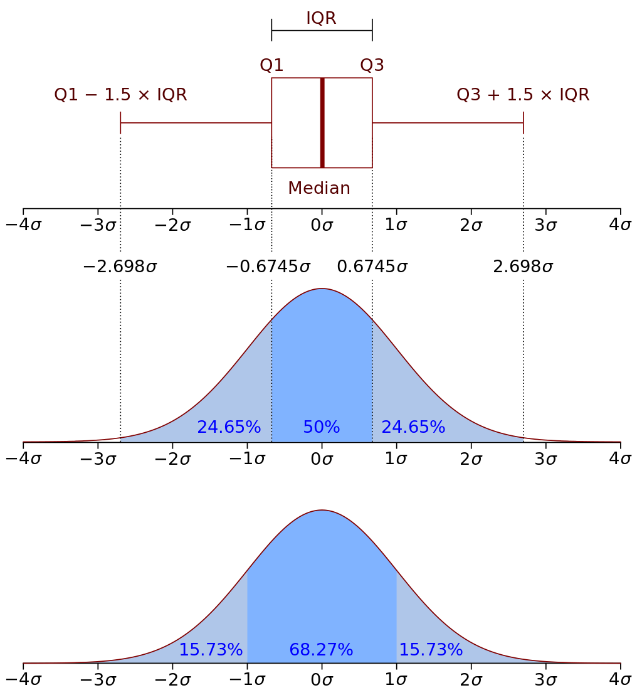

## Pandas In Depth - 3

After completing the data loading, we may need to join fact tables and dimension tables, which is the foundation for multi-dimensional analysis of data. We may have loaded identically structured data from different data sources and need to concatenate them together. We collectively call these operations data reshaping. Of course, due to differences in enterprise informatization levels and data platform maturity, the data we obtain may not be of high quality, and we may need to handle missing values, duplicate values, and outliers appropriately. Even if the data we obtain has no quality issues, we may still need to perform a series of preprocessing steps to meet our data analysis needs. Next, we will explain and organize this knowledge for you.

### Data Reshaping

Sometimes, the raw data we need for data analysis may not come from a single source, just like in the previous chapter's example where we read three tables from a relational database and obtained three `DataFrame` objects, but actual work may require us to integrate their data together. For example, `emp_df` and `emp2_df` are both employee data with exactly the same data structure. We can use the `concat` function provided by `pandas` to concatenate two or more `DataFrame` objects, as shown in the code below.

```Python
all_emp_df = pd.concat([emp_df, emp2_df])
```

Output:

```
        ename    job        mgr      sal     comm    dno
eno
1359    胡一刀    销售员	   3344.0	1800	200.0	30
2056    乔峰	    分析师	    7800.0	 5000	 1500.0	 20
3088    李莫愁	   设计师	   2056.0	3500	800.0	20
3211    张无忌	   程序员	   2056.0	3200	NaN     20
3233    丘处机	   程序员	   2056.0	3400	NaN	    20
3244    欧阳锋	   程序员	   3088.0	3200	NaN     20
3251    张翠山	   程序员	   2056.0	4000	NaN	    20
3344    黄蓉	    销售主管   7800.0	3000	800.0	30
3577    杨过	    会计	     5566.0	  2200	  NaN	  10
3588    朱九真	   会计	    5566.0	 2500	 NaN	 10
4466    苗人凤	   销售员	   3344.0	2500	NaN	    30
5234    郭靖	    出纳	     5566.0	  2000	  NaN	  10
5566    宋远桥	   会计师	   7800.0	4000	1000.0	10
7800    张三丰	   总裁	    NaN      9000	 1200.0	 20
9500	张三丰	   总裁	    NaN	     50000	 8000.0	 20
9600	王大锤    程序员	   9800.0	8000	600.0	20
9700	张三丰	   总裁	    NaN	     60000	 6000.0	 20
9800	骆昊	    架构师	    7800.0	 30000	 5000.0	 20
9900	陈小刀	   分析师	   9800.0	10000	1200.0	20
```

The code above concatenated two `DataFrame` objects containing employee data. Next, we use the `merge` function to combine the employee table and department table data into one table, as shown below.

First, we use the `reset_index` method to reset the index of `all_emp_df`, so that `eno` is no longer the index but a regular column. Setting the `inplace` parameter of `reset_index` to `True` means the index reset operation is performed directly on `all_emp_df`, rather than returning a new modified object.

```Python
all_emp_df.reset_index(inplace=True)
```

Merge the data using the `merge` function. Of course, you can also call the `merge` method on a `DataFrame` object to achieve the same effect.

```Python
pd.merge(all_emp_df, dept_df, how='inner', on='dno')
```

Output:

```
    eno	    ename	job	     mgr	 sal	 comm	 dno	dname	 dloc
0	1359	胡一刀	 销售员	3344.0	1800	200.0	30	   销售部	 重庆
1	3344	黄蓉	  销售主管	7800.0	3000	800.0	30	   销售部	 重庆
2	4466	苗人凤	 销售员	3344.0	2500	NaN	    30	   销售部	 重庆
3	2056	乔峰	  分析师	 7800.0	 5000	 1500.0	 20	    研发部	  成都
4	3088	李莫愁	 设计师	2056.0	3500	800.0	20	   研发部	 成都
5	3211	张无忌  程序员	2056.0	3200	NaN	    20	   研发部	 成都
6	3233	丘处机	 程序员	2056.0	3400	NaN	    20	   研发部	 成都
7	3244	欧阳锋	 程序员	3088.0	3200	NaN	    20	   研发部	 成都
8	3251	张翠山	 程序员	2056.0	4000	NaN	    20	   研发部	 成都
9	7800	张三丰	 总裁	     NaN	 9000	 1200.0	 20	    研发部	  成都
10	9500	张三丰	 总裁	     NaN	 50000	 8000.0	 20	    研发部	  成都
11	9600	王大锤	 程序员	9800.0	8000	600.0	20	   研发部	 成都
12	9700	张三丰	 总裁	     NaN	 60000	 6000.0	 20	    研发部	  成都
13	9800	骆昊	  架构师	 7800.0	 30000	 5000.0	 20	    研发部	  成都
14	9900	陈小刀	 分析师	9800.0	10000	1200.0	20	   研发部	 成都
15	3577	杨过	  会计	  5566.0  2200	  NaN	  10	会计部	  北京
16	3588	朱九真	 会计	     5566.0	 2500	 NaN	 10	   会计部	 北京
17	5234	郭靖	  出纳	  5566.0  2000	  NaN	  10	会计部	  北京
18	5566	宋远桥	 会计师	7800.0	4000	1000.0	10	  会计部	北京
```

The first parameter of the `merge` function represents the left table for merging, and the second parameter represents the right table. Those with SQL programming experience should find these two terms very familiar. As you might have guessed, merging `DataFrame` objects is very similar to table joins in databases. So the `how` parameter in the code above represents the method of merging two tables, with four options: `left`, `right`, `inner`, and `outer`. The `on` parameter represents which column to base the merge on, equivalent to the join condition in SQL table joins. If the corresponding columns in the left and right tables have different names, you can use the `left_on` and `right_on` parameters instead of `on` to specify them separately.

If we slightly modify the code above by changing the `how` parameter to `'right'`, think about what the result would be.

```Python
pd.merge(all_emp_df, dept_df, how='right', on='dno')
```

The result has one more row than the previous output, as shown below. This is because `how='right'` represents a right outer join, meaning that all data from the right table `dept_df` will be completely retrieved, but since there are no employees in department `40` in `all_emp_df`, the corresponding positions are filled with null values.

```
19	NaN    NaN    NaN    NaN    NaN     NaN    40    运维部    深圳
```

### Data Cleaning

Typically, the data we obtain from Excel, CSV, or databases is not perfect. It may contain duplicate values or outliers mixed in due to system or human errors, and there may be missing values in certain fields. Furthermore, the data in a `DataFrame` may have inconsistent formats, inconsistent units of measurement, and various other issues. Therefore, cleaning the data before beginning data analysis is particularly important.

#### Missing Values

You can use the `isnull` or `isna` methods of a `DataFrame` object to find missing values in the data table, as shown below.

```Python
emp_df.isnull()
```

Or

```Python
emp_df.isna()
```

Output:

```
        ename   job	    mgr     sal     comm    dno
eno
1359	False	False	False	False	False	False
2056	False	False	False	False	False	False
3088	False	False	False	False	False	False
3211	False	False	False	False	True	False
3233	False	False	False	False	True	False
3244	False	False	False	False	True	False
3251	False	False	False	False	True	False
3344	False	False	False	False	False	False
3577	False	False	False	False	True	False
3588	False	False	False	False	True	False
4466	False	False	False	False	True	False
5234	False	False	False	False	True	False
5566	False	False	False	False	False	False
7800	False	False	True	False	False	False
```

Correspondingly, the `notnull` and `notna` methods can mark non-null values as `True`. If you want to remove these missing values, you can use the `dropna` method of the `DataFrame` object. The `axis` parameter of this method specifies whether to delete along axis 0 or axis 1, meaning whether to delete the entire row or the entire column when a null value is encountered. By default, deletion is performed along axis 0, as shown below.

```Python
emp_df.dropna()
```

Output:

```
        ename   job      mgr	 sal    comm     dno
eno
1359	胡一刀  销售员	3344.0	1800   200.0	30
2056	乔峰    架构师	 7800.0	 5000	1500.0	 20
3088	李莫愁  设计师	2056.0	3500   800.0	20
3344	黄蓉    销售主管	7800.0	3000   800.0	30
5566	宋远桥  会计师	7800.0	4000   1000.0	10
```

To delete along axis 1, you can use the following code.

```Python
emp_df.dropna(axis=1)
```

Output:

```
        ename    job      sal    dno
eno
1359	胡一刀   销售员    1800	30
2056	乔峰     架构师	  5000	 20
3088	李莫愁   设计师    3500	20
3211	张无忌   程序员    3200	20
3233	丘处机   程序员    3400	20
3244	欧阳锋   程序员    3200	20
3251	张翠山   程序员    4000	20
3344	黄蓉     销售主管  3000	30
3577	杨过     会计	   2200	  10
3588	朱九真   会计	  2500	 10
4466	苗人凤   销售员	 2500   30
5234	郭靖     出纳      2000   10
5566	宋远桥   会计师    4000   10
7800	张三丰   总裁      9000   20
```

> **Note**: Many methods of `DataFrame` objects have a parameter called `inplace`, which defaults to `False`, meaning that our operations will not modify the original `DataFrame` object but will return the processed result as a new `DataFrame` object. If you set this parameter to `True`, the operation will be performed directly on the original `DataFrame`, and the method's return value will be `None`. Simply put, the operations above did not modify `emp_df`, but returned a new `DataFrame` object.

In certain specific scenarios, we can fill null values using the `fillna` method. When filling null values, you can use a specified value (via the `value` parameter), or fill with the value from the previous cell (by setting `method=ffill`) or the next cell (by setting `method=bfill`), as shown below.

```Python
emp_df.fillna(value=0)
```

> **Note**: How to choose the fill value is also a topic worth exploring. In actual work, you might use some statistical measure (such as mean, mode, etc.) for filling, or use some interpolation method (such as random interpolation, Lagrange interpolation, etc.), or even use regression models, Bayesian models, etc. to fill missing data.

Output:

```
        ename    job        mgr      sal     comm    dno
eno
1359	胡一刀    销售员	   3344.0	1800	200.0	30
2056	乔峰	    分析师	    7800.0	 5000	 1500.0	 20
3088	李莫愁	   设计师	   2056.0	3500	800.0	20
3211	张无忌	   程序员	   2056.0	3200	0.0     20
3233	丘处机	   程序员	   2056.0	3400	0.0	    20
3244	欧阳锋	   程序员	   3088.0	3200	0.0     20
3251	张翠山	   程序员	   2056.0	4000	0.0	    20
3344	黄蓉	    销售主管   7800.0	3000	800.0	30
3577	杨过	    会计	     5566.0	  2200	  0.0	  10
3588	朱九真	   会计	    5566.0	 2500	 0.0	 10
4466	苗人凤	   销售员	   3344.0	2500	0.0	    30
5234	郭靖	    出纳	     5566.0	  2000	  0.0	  10
5566	宋远桥	   会计师	   7800.0	4000	1000.0	10
7800	张三丰	   总裁	    0.0      9000	 1200.0	 20
```

#### Duplicate Values

Next, let's first add two rows of data to the department table from before, so that the department table has two departments named "研发部" (R&D Department) and "销售部" (Sales Department) each.

```Python
dept_df.loc[50] = {'dname': '研发部', 'dloc': '上海'}
dept_df.loc[60] = {'dname': '销售部', 'dloc': '长沙'}
dept_df
```

Output:

```
    dname  dloc
dno
10	会计部	北京
20	研发部	成都
30	销售部	重庆
40	运维部	天津
50	研发部	上海
60	销售部	长沙
```

Now our data table has duplicate data. We can use the `duplicated` method of the `DataFrame` object to check for duplicate values. When no parameters are specified, it defaults to checking whether the row index is duplicated. We can also specify to check whether departments are duplicated based on the department name `dname`, as shown below.

```Python
dept_df.duplicated('dname')
```

Output:

```
dno
10    False
20    False
30    False
40    False
50     True
60     True
dtype: bool
```

From the output above, we can see that departments `50` and `60` are duplicates based on their department names. To remove duplicate values, you can use the `drop_duplicates` method. The `keep` parameter of this method controls whether to keep the first occurrence, the last occurrence, or to not keep any of the duplicates and delete them all.

```Python
dept_df.drop_duplicates('dname')
```

Output:

```
	dname	dloc
dno
10	会计部	北京
20	研发部	成都
30	销售部	重庆
40	运维部	天津
```

Setting the `keep` parameter to `last`.

```Python
dept_df.drop_duplicates('dname', keep='last')
```

Output:

```
	dname	dloc
dno
10	会计部	北京
40	运维部	天津
50	研发部	上海
60	销售部	长沙
```

Using the same approach, we can also remove duplicate data from `all_emp_df`. For example, if we consider records with the same "ename" and "job" fields as duplicates, we can use the following code to remove them.

```python
all_emp_df.drop_duplicates(['ename', 'job'], inplace=True)
```

> **Note**: The `drop_duplicates` method above was called with `inplace=True`, so the method will not return a new `DataFrame` object but will instead delete duplicates directly in the original `DataFrame` object. You can check `all_emp_df` to see if the duplicate employee data has been removed.

#### Outliers

The full name of outliers in statistics is "suspected outliers," also called outlier points. Outlier analysis is also known as outlier detection. Outliers are "extreme values" that appear in a sample, where the data values appear abnormally large or small, with their distribution clearly deviating from the rest of the observations. In practical work, some outliers may be caused by system or human errors, but some outliers are not -- they can appear repeatedly and stably, representing normal extreme values. For example, data for top players in many game products are often outlying extreme values. Therefore, we should neither ignore the existence of outliers nor simply remove them from our data analysis. Paying attention to outliers and analyzing their causes often becomes an opportunity to discover problems and improve decisions.

Methods for detecting outliers include the Z-score method, IQR method, DBScan clustering, Isolation Forest, etc. Here we provide a brief introduction to the first two methods.



If the data follows a normal distribution, according to the 3-sigma rule, outliers are defined as values whose deviation from the mean exceeds three times the standard deviation. Under a normal distribution, the probability of a value being more than 3 standard deviations from the mean is $\small{P(\lvert x - \mu \rvert \gt 3 \sigma) < 0.003}$, which qualifies as a rare event. If the data does not follow a normal distribution, we can describe values that are some multiple of standard deviations away from the mean, and this multiple is the Z-score. The Z-score measures how far a raw score deviates from the mean in units of standard deviation. The formula is as follows.

$$
z = \frac {X - \mu} {\sigma}
$$

$$
\lvert z \rvert > 3
$$

The Z-score needs to be determined based on experience and the actual situation. Typically, data points more than 3 standard deviations away are considered outliers. The code below shows how to detect outliers using the Z-score method.

```Python
def detect_outliers_zscore(data, threshold=3):
    avg_value = np.mean(data)
    std_value = np.std(data)
    z_score = np.abs((data - avg_value) / std_value)
    return data[z_score > threshold]
```

In the IQR method, IQR (Inter-Quartile Range) represents the interquartile range, which is the difference between the upper quartile (Q3) and the lower quartile (Q1). Typically, values less than $\small{Q1 - 1.5 \times IQR}$ or greater than $\small{Q3 + 1.5 \times IQR}$ are considered outliers, and this method of detecting outliers is also the default method used by box plots (which we will cover later). The code below shows how to detect outliers using the IQR method.

```Python
def detect_outliers_iqr(data, whis=1.5):
    q1, q3 = np.quantile(data, [0.25, 0.75])
    iqr = q3 - q1
    lower, upper = q1 - whis * iqr, q3 + whis * iqr
    return data[(data < lower) | (data > upper)]
```

To delete outliers, you can use the `drop` method of the `DataFrame` object, which can delete specified rows or columns based on row or column indices. For example, if we consider monthly salaries below `2000` or above `8000` as outliers in the employee table, we can use the following code to delete the corresponding records.

```Python
emp_df.drop(emp_df[(emp_df.sal > 8000) | (emp_df.sal < 2000)].index)
```

To replace outliers, you can do so by assigning values to cells, or use the `replace` method to replace specified values. For example, if we want to replace salaries of `1800` and `9000` with the average salary, and replace bonuses of `800` with `1000`, the code is as follows.

```Python
avg_sal = np.mean(emp_df.sal).astype(int)
emp_df.replace({'sal': [1800, 9000], 'comm': 800}, {'sal': avg_sal, 'comm': 1000})
```

#### Preprocessing

Data preprocessing is also a very broad topic, encompassing operations such as data decomposition, transformation, reduction, and discretization. Let's first look at data decomposition. If the data in a table is a date or time, we typically need to decompose it along dimensions such as year, quarter, month, day, weekday, hour, minute, etc. If the date/time is represented as a string, it can first be processed into a datetime type using pandas' `to_datetime` function.

In the example below, we first read an Excel file to obtain a set of sales data. The first column is the sales date, which we decompose into "month," "quarter," and "weekday," as shown below.

```Python
sales_df = pd.read_excel(
    'data/2020年销售数据.xlsx',
    usecols=['销售日期', '销售区域', '销售渠道', '品牌', '销售额']
)
sales_df.info()
```

> **Note**: The code above uses a relative path to access the Excel file, meaning the Excel file is in a folder named `data` under the current working directory. If you need the Excel file used in this example, you can obtain it via the following Baidu Cloud Drive link: <https://pan.baidu.com/s/1rQujl5RQn9R7PadB2Z5g_g>, access code: e7b4.

Output:

```
<class 'pandas.core.frame.DataFrame'>
RangeIndex: 1945 entries, 0 to 1944
Data columns (total 5 columns):
 #   Column  Non-Null Count  Dtype
---  ------  --------------  -----
 0   销售日期    1945 non-null   datetime64[ns]
 1   销售区域    1945 non-null   object
 2   销售渠道    1945 non-null   object
 3   品牌        1945 non-null   object
 4   销售额      1945 non-null   int64
dtypes: datetime64[ns](1), int64(1), object(3)
memory usage: 76.1+ KB
```

```Python
sales_df['月份'] = sales_df['销售日期'].dt.month
sales_df['季度'] = sales_df['销售日期'].dt.quarter
sales_df['星期'] = sales_df['销售日期'].dt.weekday
sales_df
```

Output:

```
	    销售日期	 销售区域	销售渠道	品牌	  销售额	月份	季度	星期
0	    2020-01-01	上海	     拼多多	 八匹马   8217	    1	 1	   2
1	    2020-01-01	上海	     抖音	      八匹马	6351	 1	  1	    2
2	    2020-01-01	上海	     天猫	      八匹马	14365	 1	  1	    2
3	    2020-01-01	上海	     天猫       八匹马	2366	 1	  1     2
4	    2020-01-01	上海	     天猫 	  皮皮虾	15189	 1	  1     2
...     ...         ...        ...       ...      ...     ...  ...   ...
1940    2020-12-30	北京	     京东	      花花姑娘 6994     12	 4	   2
1941    2020-12-30	福建	     实体	      八匹马	7663	 12	  4	    2
1942    2020-12-31	福建	     实体	      花花姑娘 14795    12	 4	   3
1943    2020-12-31	福建	     抖音	      八匹马	3481	 12	  4	    3
1944    2020-12-31	福建	     天猫	      八匹马	2673	 12	  4	    3
```

In the code above, by accessing the `dt` property of a datetime-type `Series` object, we get an object for accessing datetime information. Through this object's `year`, `month`, `quarter`, `hour`, and other properties, we can obtain year, month, quarter, hour, and other time information. The result is still a `Series` object containing a set of time information, which is why we also call this `dt` property the "datetime vector."

Let's now discuss how to handle string-type data. First, we read job recruitment data from a specified Excel file.

```Python
jobs_df = pd.read_csv(
    'data/某招聘网站招聘数据.csv',
    usecols=['city', 'companyFullName', 'positionName', 'salary']
)
jobs_df.info()
```

> **Note**: The code above uses a relative path to access the CSV file, meaning the CSV file is in a folder named `data` under the current working directory. If you need the CSV file used in this example, you can obtain it via the following Baidu Cloud Drive link: <https://pan.baidu.com/s/1rQujl5RQn9R7PadB2Z5g_g>, access code: e7b4.

Output:

```
<class 'pandas.core.frame.DataFrame'>
RangeIndex: 3140 entries, 0 to 3139
Data columns (total 4 columns):
 #   Column           Non-Null Count  Dtype
---  ------           --------------  -----
 0   city             3140 non-null   object
 1   companyFullName  3140 non-null   object
 2   positionName     3140 non-null   object
 3   salary           3140 non-null   object
dtypes: object(4)
memory usage: 98.2+ KB
```

View the first `5` rows of data.

```Python
jobs_df.head()
```

Output:

```
    city    companyFullName              positionName    salary
0   北京	  达疆网络科技（上海）有限公司    数据分析岗       15k-30k
1   北京	  北京音娱时光科技有限公司        数据分析        10k-18k
2   北京	  北京千喜鹤餐饮管理有限公司	     数据分析        20k-30k
3   北京	  吉林省海生电子商务有限公司	     数据分析        33k-50k
4   北京	  韦博网讯科技（北京）有限公司	数据分析        10k-15k
```

The data table above has `3140` records, but not all positions are "data analysis" roles. To filter out data analysis positions, we can check whether the `positionName` field contains the keyword "数据分析" (data analysis). This requires fuzzy matching -- how should we implement it? We can first get the `positionName` column, and since this `Series` object's `dtype` is string, we can access the corresponding string vector through the `str` property, then use familiar string methods to operate on it. The code is shown below.

```Python
jobs_df = jobs_df[jobs_df.positionName.str.contains('数据分析')]
jobs_df.shape
```

Output:

```
(1515, 4)
```

We can see that after filtering, there are still `1515` records. Next, we need to process the `salary` field. If we want to calculate the average salary for all positions or the average salary for each city, we first need to convert the salary ranges into their midpoint values. The code is shown below.

```Python
jobs_df.salary.str.extract(r'(\d+)[kK]?-(\d+)[kK]?')
```

> **Note**: The code above uses regular expression capture groups to extract two groups of numbers from the string, corresponding to the lower and upper bounds of the salary respectively. Readers unfamiliar with regular expressions can read the article [Regular Expression Applications](https://zhuanlan.zhihu.com/p/158929767) in my Zhihu column "Learning Python from Scratch."

Output:

```
        0     1
0	    15    30
1	    10	  18
2       20    30
3       33    50
4       10    15
...     ...   ...
3065    8     10
3069    6     10
3070    2     4
3071    6     12
3088    8     12
```

It's important to note that the two extracted columns are string-type values. We need to convert them to `int` type before we can calculate the average. The corresponding method is the `applymap` method of the `DataFrame` object, whose parameter is a function that will be applied to every element in the `DataFrame`. After completing this step, we can use the `apply` method to process the `DataFrame` above into midpoint values. The `apply` method also takes a function as its parameter, and by specifying the `axis` parameter, it can be applied to the rows or columns of a `DataFrame` object. The code is shown below.

```Python
temp_df = jobs_df.salary.str.extract(r'(\d+)[kK]?-(\d+)[kK]?').applymap(int)
temp_df.apply(np.mean, axis=1)
```

 Output:

```
0       22.5
1       14.0
2       25.0
3       41.5
4       12.5
        ...
3065    9.0
3069    8.0
3070    3.0
3071    9.0
3088    10.0
Length: 1515, dtype: float64
```

Next, we can use the result above to replace the original `salary` column or add a new column to represent the salary corresponding to each position. The complete code is shown below.

```Python
temp_df = jobs_df.salary.str.extract(r'(\d+)[kK]?-(\d+)[kK]?').applymap(int)
jobs_df['salary'] = temp_df.apply(np.mean, axis=1)
jobs_df.head()
```

Output:

```
    city    companyFullName              positionName    salary
0   北京	  达疆网络科技（上海）有限公司    数据分析岗       22.5
1   北京	  北京音娱时光科技有限公司        数据分析        14.0
2   北京	  北京千喜鹤餐饮管理有限公司	     数据分析        25.0
3   北京	  吉林省海生电子商务有限公司	     数据分析        41.5
4   北京	  韦博网讯科技（北京）有限公司	数据分析        12.5
```

The `applymap` and `apply` methods are frequently used during data preprocessing. `Series` objects also have an `apply` method for data preprocessing. However, `DataFrame` objects also have a method called `transform`, which also transforms data through a passed-in function, similar to the `map` method of `Series` objects. It's important to emphasize that the `apply` method has a reduction effect -- simply put, it can process a larger amount of data into a smaller amount or a single piece of data. The `transform` method, on the other hand, has no reduction effect; however many records there were originally, there will be the same number after processing.

For deep data analysis and mining, non-numeric types like strings and datetimes need to be converted to numeric values, because non-numeric types cannot be used to calculate correlations or perform $\small{\chi^{2}}$ tests and similar operations. For string types, they can usually be classified into the following three categories, with corresponding processing approaches.

1. Ordinal Variable: String data that has an order relationship can be processed through ordinal encoding.
2. Categorical Variable / Nominal Variable: String data that has no magnitude or ranking distinction can be processed into a dummy variable (virtual variable) matrix using one-hot encoding.
3. Scale Variable: Strings that essentially correspond to data with magnitude distinctions and can undergo addition and subtraction operations only need to be converted to the corresponding numeric values.

For types 1 and 3, we can use the `apply` or `transform` methods mentioned above, or use `OrdinalEncoder` from `scikit-learn` to handle type 1 strings, which we will cover in subsequent lessons. For type 2 strings, we can use pandas' `get_dummies()` function to generate a dummy variable (virtual variable) matrix, as shown below.

```Python
persons_df = pd.DataFrame(
    data={
        '姓名': ['关羽', '张飞', '赵云', '马超', '黄忠'],
        '职业': ['医生', '医生', '程序员', '画家', '教师'],
        '学历': ['研究生', '大专', '研究生', '高中', '本科']
    }
)
persons_df
```

Output:

```
	姓名	职业	学历
0	关羽	医生	研究生
1	张飞	医生	大专
2	赵云	程序员	研究生
3	马超	画家	高中
4	黄忠	教师	本科
```

Convert the occupation column into a dummy variable matrix.

```Python
pd.get_dummies(persons_df['职业'])
```

Output:

```
    医生 教师  画家  程序员
0	1    0    0    0
1	1    0    0    0
2	0    0    0    1
3	0    0    1    0
4	0    1    0    0
```

Convert education level into numeric values of different magnitudes.

```Python
def handle_education(x):
    edu_dict = {'高中': 1, '大专': 3, '本科': 5, '研究生': 10}
    return edu_dict.get(x, 0)


persons_df['学历'].apply(handle_education)
```

Output:

```
0    10
1     3
2    10
3     1
4     5
Name: 学历, dtype: int64
```

Let's now discuss data discretization. Discretization is also called binning. If a variable's values are continuous, it has infinitely many possible values, making it very inconvenient for data grouping. In such cases, discretizing continuous variables becomes very important. The reason discretization is called binning is that we can preset some bins, where each bin represents a range of data values, allowing continuous values to be assigned to different bins to achieve discretization. The example below reads the 2018 Beijing points-based settlement data, and we can group the data based on settlement scores. The specific approach is shown below.

```Python
luohu_df = pd.read_csv('data/2018年北京积分落户数据.csv', index_col='id')
luohu_df.score.describe()
```

Output:

```
count    6019.000000
mean       95.654552
std         4.354445
min        90.750000
25%        92.330000
50%        94.460000
75%        97.750000
max       122.590000
Name: score, dtype: float64
```

We can see that the maximum settlement score is `122.59` and the minimum is `90.75`. So we can construct 7 bins from `90` to `125`, with groups of `5` points each. The pandas `cut` function can help us implement data binning, as shown below.

```Python
bins = np.arange(90, 126, 5)
pd.cut(luohu_df.score, bins, right=False)
```

> **Note**: The default value of the `right` parameter of the `cut` function is `True`, meaning the bins are open on the left and closed on the right. Setting it to `False` makes the right boundary open and the left boundary closed. You'll understand by looking at the output below.

Output:

```
id
1       [120, 125)
2       [120, 125)
3       [115, 120)
4       [115, 120)
5       [115, 120)
           ...
6015      [90, 95)
6016      [90, 95)
6017      [90, 95)
6018      [90, 95)
6019      [90, 95)
Name: score, Length: 6019, dtype: category
Categories (7, interval[int64, left]): [[90, 95) < [95, 100) < [100, 105) < [105, 110) < [110, 115) < [115, 120) < [120, 125)]
```

We can group data based on the binning results and then use aggregate functions to compute statistics for each group, which is a frequently used operation in data analysis. This will be introduced in the next chapter. Additionally, pandas also provides a function called `qcut`, which can bin data by specifying quantiles. Interested readers can explore it on their own.
