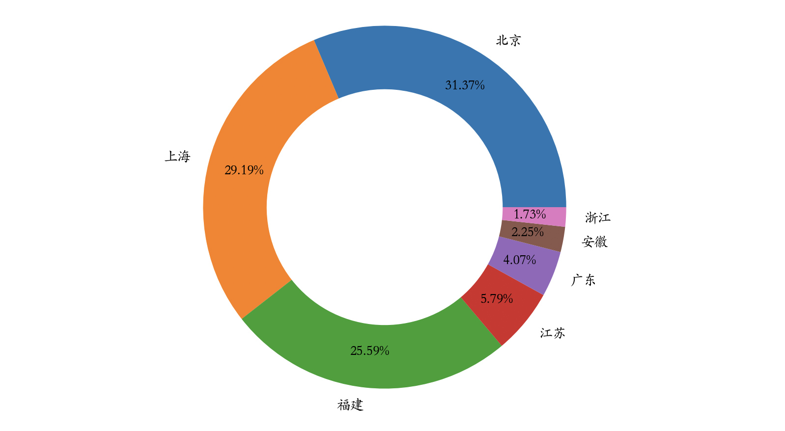

## Pandas In Depth - 4

### Data Pivoting

Through our previous learning, we have prepared our data and shaped it into the form we want. Now comes the most important stage -- data pivoting. When we have a large amount of data, how to quickly extract valuable information from it, transform complex data into easy-to-read statistical charts, and generate business insights on that basis -- this is the core problem that data analysis aims to solve.

#### Getting Descriptive Statistics

First, we can obtain descriptive statistics of the data. Through descriptive statistics, we can understand the central tendency and dispersion of the data.

For example, suppose we have the following student grade table.

```Python
scores = np.random.randint(50, 101, (5, 3))
names = ('关羽', '张飞', '赵云', '马超', '黄忠')
courses = ('语文', '数学', '英语')
df = pd.DataFrame(data=scores, columns=courses, index=names)
df
```

Output:

```
     语文   数学   英语
关羽  96    72    73
张飞  72    70	97
赵云  74    51	79
马超  100   54	54
黄忠  89    100	88
```

We can use the `DataFrame` object's methods `mean`, `max`, `min`, `std`, `var`, etc. to get the average, maximum, minimum, standard deviation, variance, and other information for each student or each course respectively. We can also directly use the `describe` method to get descriptive statistics, as shown below.

Calculate the average score for each course.

```Python
df.mean()
```

Output:

```
语文    86.2
数学    69.4
英语    78.2
dtype: float64
```

Calculate the average score for each student.

```Python
df.mean(axis=1)
```

Output:

```
关羽    80.333333
张飞    79.666667
赵云    68.000000
马超    69.333333
黄忠    92.333333
dtype: float64
```

Calculate the variance of scores for each course.

```Python
df.var()
```

Output:

```
语文    161.2
数学    379.8
英语    265.7
dtype: float64
```

> **Note**: From the variance, we can see that math scores fluctuate the most, and the polarization may be more severe.

Get descriptive statistics for each course.

```Python
df.describe()
```

Output:

```
        语文        数学         英语
count   5.000000	5.000000	5.000000
mean    86.200000	69.400000	78.200000
std     12.696456	19.488458	16.300307
min     72.000000	51.000000	54.000000
25%     74.000000	54.000000	73.000000
50%     89.000000	70.000000	79.000000
75%     96.000000	72.000000	88.000000
max     100.000000	100.000000	97.000000
```

#### Sorting and Getting Top Values

To sort data, you can use the `sort_values` method of the `DataFrame` object. The `by` parameter specifies which column or columns to sort by, and the `ascending` parameter specifies ascending or descending order. For example, the code below shows how to sort the student table by Chinese language scores in descending order.

```Python
df.sort_values(by='语文', ascending=False)
```

Output:

```
      语文   数学   英语
马超	100    54	  54
关羽	96     72     73
黄忠	89     100    88
赵云	74     51     79
张飞	72     70     97
```

If the `DataFrame` has a large amount of data, sorting will be a very time-consuming operation. Sometimes we only need to get the top N or bottom N data, in which case there's no need to sort all the data. Instead, we can use a heap structure to directly find the Top-N data. The `nlargest` and `nsmallest` methods of `DataFrame` provide support for Top-N operations, as shown below.

Find the top 3 students by Chinese language scores.

```Python
df.nlargest(3, '语文')
```

Output:

```
      语文   数学   英语
马超	100    54	  54
关羽	96     72     73
黄忠	89     100    88
```

Find the 3 students with the lowest math scores.

```Python
df.nsmallest(3, '数学')
```

Output:

```
      语文  数学  英语
赵云  74    51	79
马超  100   54	54
张飞  72    70	97
```

#### Group Aggregation

Let's first read the 2020 sales data from the Excel file we used before, and then demonstrate how to perform group aggregation operations.

```Python
df = pd.read_excel('data/2020年销售数据.xlsx')
df.head()
```

Output:

```
    销售日期	 销售区域   销售渠道  销售订单     品牌    售价  销售数量
0   2020-01-01  上海       拼多多    182894-455  八匹马  99    83
1   2020-01-01  上海       抖音      205635-402  八匹马  219   29
2   2020-01-01  上海       天猫      205654-021  八匹马  169   85
3   2020-01-01  上海       天猫      205654-519  八匹马  169   14
4   2020-01-01  上海       天猫      377781-010  皮皮虾  249   61
```

If we want to calculate the total sales amount for each sales region, we can first calculate the sales amount from "unit price" and "quantity sold" and add a column to the `DataFrame`, as shown below.

```Python
df['销售额'] = df['售价'] * df['销售数量']
df.head()
```

Output:

```
    销售日期	 销售区域   销售渠道  销售订单     品牌    售价  销售数量  销售额
0   2020-01-01  上海       拼多多    182894-455  八匹马  99    83        8217
1   2020-01-01  上海       抖音      205635-402  八匹马  219   29        6351
2   2020-01-01  上海       天猫      205654-021  八匹马  169   85        14365
3   2020-01-01  上海       天猫      205654-519  八匹马  169   14        2366
4   2020-01-01  上海       天猫      377781-010  皮皮虾  249   61        15189
```

Then we group the data by the "sales region" column using the `groupby` method of the `DataFrame` object. After grouping, we take the "sales amount" column and perform a sum aggregation within each group. The code and result are shown below.

```Python
df.groupby('销售区域').销售额.sum()
```

Output:

```
销售区域
上海    11610489
北京    12477717
安徽      895463
广东     1617949
江苏     2304380
浙江      687862
福建    10178227
Name: 销售额, dtype: int64
```

If we want to calculate the total sales amount for each month, we can use the "sales date" as the parameter of the `groupby` method. Of course, we need to first convert the "sales date" to months, as shown below.

```Python
df.groupby(df['销售日期'].dt.month).销售额.sum()
```

Output:

```
销售日期
1     5409855
2     4608455
3     4164972
4     3996770
5     3239005
6     2817936
7     3501304
8     2948189
9     2632960
10    2375385
11    2385283
12    1691973
Name: 销售额, dtype: int64
```

Let's increase the difficulty and calculate the total sales amount for each sales region per month. How should we handle this? In fact, the first parameter of the `groupby` method can be a list, and the list can specify multiple grouping criteria. Look at the code and output below to understand.

```Python
df.groupby(['销售区域', df['销售日期'].dt.month]).销售额.sum()
```

Output:

```
销售区域  销售日期
上海    1       1679125
        2       1689527
        3       1061193
        4       1082187
        5        841199
        6        785404
        7        863906
        8        734937
        9       1107693
        10       412108
       11       825169
       12       528041
北京    1       1878234
        2       1807787
        3       1360666
        4       1205989
        5        807300
        6       1216432
        7       1219083
        8        645727
        9        390077
        10       671608
        11       678668
        12       596146
安徽    4        341308
        5        554155
广东    3        388180
        8        469390
        9        365191
        11       395188
江苏    4        537079
        7        841032
        10       710962
        12       215307
浙江    3        248354
        8        439508
福建    1       1852496
        2       1111141
        3       1106579
        4        830207
        5       1036351
        6        816100
        7        577283
        8        658627
        9        769999
        10       580707
        11       486258
        12       352479
Name: 销售额, dtype: int64
```

If we want to calculate both the total sales amount and the maximum and minimum single transaction amounts for each region, we can use the `agg` method on `DataFrame` or `Series` objects and specify multiple aggregate functions. The code and result are shown below.

```Python
df.groupby('销售区域').销售额.agg(['sum', 'max', 'min'])
```

Output:

```
           sum     max   min
销售区域
上海    11610489  116303   948
北京    12477717  133411   690
安徽      895463   68502  1683
广东     1617949  120807   990
江苏     2304380  114312  1089
浙江      687862   90909  3927
福建    10178227   87527   897
```

If you want to customize the column names after aggregation, you can use the following approach.

```Python
df.groupby('销售区域').销售额.agg(销售总额='sum', 单笔最高='max', 单笔最低='min')
```

Output:

```
          销售总额    单笔最高  单笔最低
销售区域
上海      11610489     116303     948
北京      12477717     133411     690
安徽        895463      68502    1683
广东       1617949     120807     990
江苏       2304380     114312    1089
浙江        687862      90909    3927
福建      10178227      87527     897
```

If you need to apply different aggregate functions to multiple columns, such as "calculate the sum of sales amounts and the minimum and maximum quantities sold for each sales region," we can do it as follows.

```Python
df.groupby('销售区域')[['销售额', '销售数量']].agg({
    '销售额': 'sum', '销售数量': ['max', 'min']
})
```

Output:

```
           销售额  销售数量
           sum    max min
销售区域
上海    11610489  100  10
北京    12477717  100  10
安徽      895463   98  16
广东     1617949   98  10
江苏     2304380  100  11
浙江      687862   95  20
福建    10178227  100  10
```

#### Pivot Tables and Cross Tables

In the example above, "calculating the total sales amount for each sales region per month" produces a very long result. In practice, we usually call tables with many rows and few columns "narrow tables." If we don't want such a "narrow table," we can use the `pivot_table` method of `DataFrame` or the `pivot_table` function to generate a pivot table. The essence of a pivot table is a group aggregation operation -- **computing statistics on column B grouped by column A**. If you have experience using Excel, you should certainly be familiar with the concept of pivot tables. For example, if we want to "calculate the total sales amount for each sales region," then "sales region" is our column A, and "sales amount" is our column B. In the `pivot_table` function, they correspond to the `index` and `values` parameters respectively, both of which can be a single column or multiple columns.

```Python
pd.pivot_table(df, index='销售区域', values='销售额', aggfunc='sum')
```

Output:

```
           销售额
销售区域
上海    11610489
北京    12477717
安徽      895463
广东     1617949
江苏     2304380
浙江      687862
福建    10178227
```

> **Note**: The result above is slightly different from the result obtained using `groupby`. After a `groupby` operation, if aggregating on a single column, the result is a `Series` object, whereas the result above is a `DataFrame` object.

If we want to calculate the total sales amount for each sales region per month, we can also use the `pivot_table` function, as shown below.

```Python
df['月份'] = df['销售日期'].dt.month
pd.pivot_table(df, index=['销售区域', '月份'], values='销售额', aggfunc='sum')
```

The result above is a `DataFrame`, but it's also a long "narrow table." If we want to create a "wide table" with fewer rows and more columns, we can move the column from the `index` parameter to the `columns` parameter, as shown below.

```Python
pd.pivot_table(df, index='销售区域', columns='月份', values='销售额', aggfunc='sum', fill_value=0)
```

> **Note**: The `fill_value=0` in the `pivot_table` function will treat null values as `0`.

Output:


When using the `pivot_table` function, you can also add `margins` and `margins_name` parameters to create a summary of the group aggregation results. The specific operation and effect are shown below.

```Python
pd.pivot_table(df, index='销售区域', columns='月份', values='销售额', aggfunc='sum', fill_value=0, margins=True, margins_name='总计')
```

Output:


A cross table is a special type of pivot table. It doesn't require constructing a `DataFrame` object first; instead, it directly uses arrays or `Series` objects to specify two or more factors for computation to obtain statistical results. For example, to calculate the total sales amount for each sales region, we can also do it as follows. Let's first prepare three groups of data.

```Python
sales_area, sales_month, sales_amount = df['销售区域'], df['月份'], df['销售额']
```

Use the `crosstab` function to generate a cross table.

```Python
pd.crosstab(index=sales_area, columns=sales_month, values=sales_amount, aggfunc='sum').fillna(0).astype('i8')
```

> **Note**: The code above uses the `fillna` method of the `DataFrame` object to replace null values with 0, then uses the `astype` method to convert the data type to integer.

### Data Presentation

A picture is worth a thousand words. The results of our data pivoting ultimately need to be presented through charts, because charts have extremely strong expressive power and can help us quickly interpret the hidden value in data. Like `Series`, `DataFrame` objects provide a `plot` method to support charting, with the underlying implementation still relying on the `matplotlib` library for chart rendering. We will discuss `matplotlib` in detail in the next chapter; here we will only briefly explain the usage of the `plot` method.

For example, if we want to compare "total sales amount by sales region" through a bar chart, we can directly use the `plot` method on the pivot table to generate it. Let's first import the `matplotlib.pyplot` module and modify the plotting parameters to support Chinese display.

```Python
import matplotlib.pyplot as plt

plt.rcParams['font.sans-serif'] = 'FZJKai-Z03S'
```

> **Note**: `FZJKai-Z03S` above is the name of a Chinese-supporting font installed on my computer. Font names can be found by viewing the file named `fontlist-v330.json` in the `.matplotlib` folder under your home directory, and this file will be generated after executing the command above.

Use a magic command to configure vector graphics output.

```Python
%config InlineBackend.figure_format = 'svg'
```

Draw a bar chart of "total sales amount by sales region."

```Python
temp = pd.pivot_table(df, index='销售区域', values='销售额', aggfunc='sum')
temp.plot(figsize=(8, 4), kind='bar')
plt.xticks(rotation=0)
plt.show()
```

> **Note**: Line 3 of the code above rotates the text on the horizontal axis tick marks to 0 degrees, and line 4 displays the image.

Output:


To draw a pie chart, you can change the `kind` parameter of the `plot` method to `pie`, then use pie chart customization parameters to customize the chart, as shown below.

```Python
temp.sort_values(by='销售额', ascending=False).plot(
    figsize=(6, 6),
    kind='pie',
    y='销售额',
    ylabel='',
    autopct='%.2f%%',
    pctdistance=0.8,
    wedgeprops=dict(linewidth=1, width=0.35),
    legend=False
)
plt.show()
```

Output:


