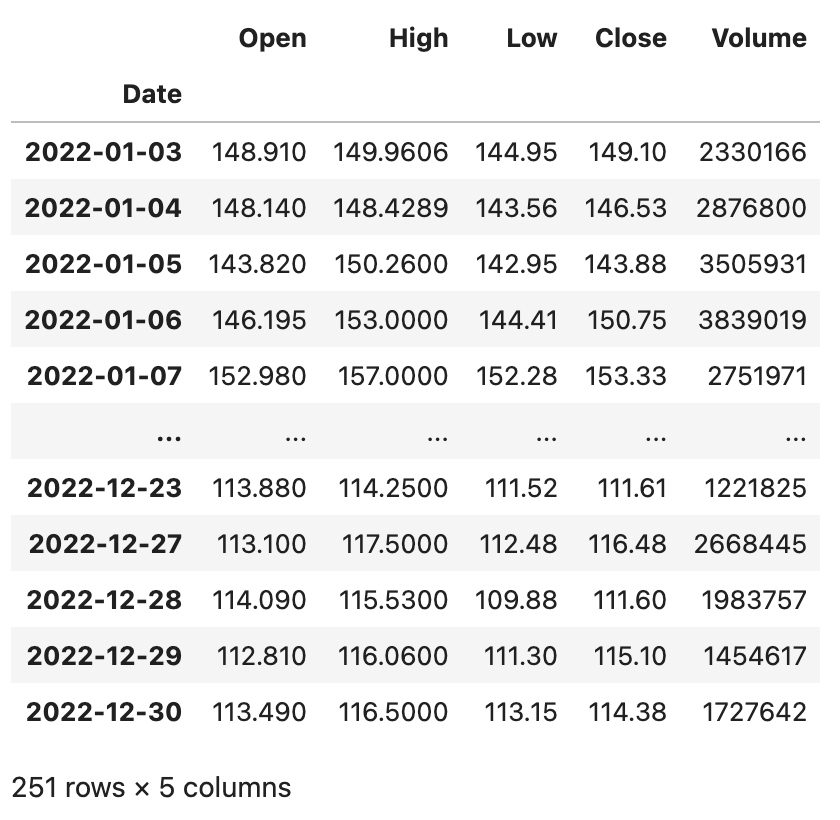
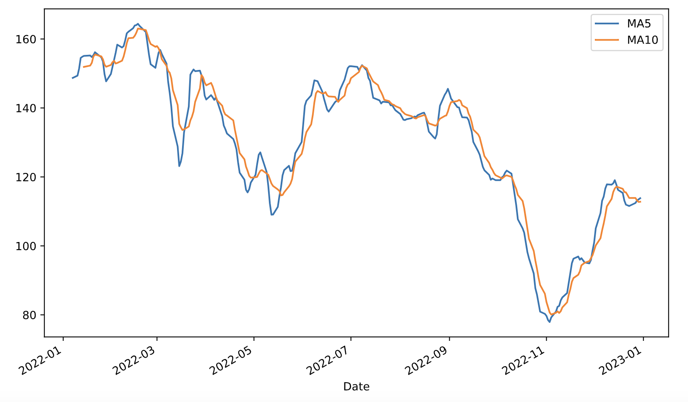
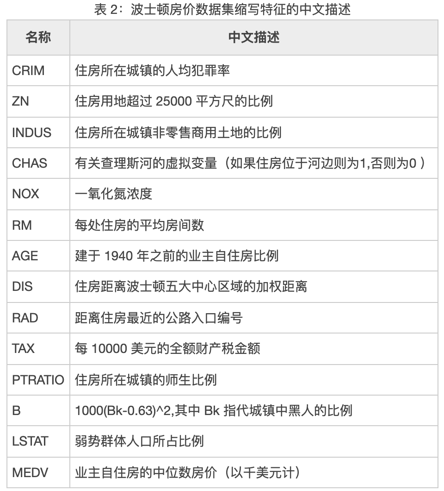
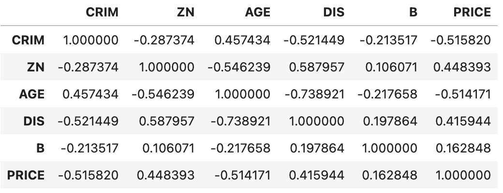

## Pandas in Action - 5

Let's supplement some additional operations that are commonly used when performing data analysis with `DataFrame`. These operations are not only common but also very important.

### Calculating Year-over-Year and Month-over-Month Changes

We previously covered an example of calculating monthly sales. We can use the `groupby` method for group aggregation, or generate a pivot table using `pivot_table`, as shown below.

```python
sales_df = pd.read_excel('data/2020年销售数据.xlsx')
sales_df['月份'] = sales_df.销售日期.dt.month
sales_df['销售额'] = sales_df.售价 * sales_df.销售数量
result_df = sales_df.pivot_table(index='月份', values='销售额', aggfunc='sum')
result_df.rename(columns={'销售额': '本月销售额'}, inplace=True)
result_df
```

Output:

```
      本月销售额
月份
1       5409855
2       4608455
3       4164972
4       3996770
5       3239005
6       2817936
7       3501304
8       2948189
9       2632960
10      2375385
11      2385283
12      1691973
```

After obtaining the monthly sales, if we need to calculate the month-over-month (MoM) change, there are two approaches. The first approach is to use the `shift` method to move the data, aligning the previous month's data with the current month's data, and then calculating MoM change using `(Current Month Sales - Previous Month Sales) / Previous Month Sales`, as shown in the code below.

```python
result_df['上月销售额'] = result_df.本月销售额.shift(1)
result_df
```

Output:

```
      本月销售额      上月销售额
月份
1       5409855            NaN
2       4608455      5409855.0
3       4164972      4608455.0
4       3996770      4164972.0
5       3239005      3996770.0
6       2817936      3239005.0
7       3501304      2817936.0
8       2948189      3501304.0
9       2632960      2948189.0
10      2375385      2632960.0
11      2385283      2375385.0
12      1691973      2385283.0
```

In the example above, the `shift` method parameter of `1` means shifting the data down by one cell. Of course, we can use a parameter of `-1` to shift the data up by one cell. As you can imagine, if we had data spanning multiple years, we could set the parameter to `12` to calculate the year-over-year (YoY) change for each month compared to the same month of the previous year.

```python
result_df['环比'] = (result_df.本月销售额 - result_df.上月销售额) / result_df.上月销售额
result_df.style.format(
    formatter={'上月销售额': '{:.0f}', '环比': '{:.2%}'},
    na_rep='--------'
)
```

Output:

```
      本月销售额      上月销售额         环比
月份
1       5409855       --------     --------
2       4608455        5409855      -14.81%
3       4164972        4608455       -9.62%
4       3996770        4164972       -4.04%
5       3239005        3996770      -18.96%
6       2817936        3239005      -13.00%
7       3501304        2817936       24.25%
8       2948189        3501304      -15.80%
9       2632960        2948189      -10.69%
10      2375385        2632960       -9.78%
11      2385283        2375385        0.42%
12      1691973        2385283      -29.07%
```

> **Note**: When using JupyterLab, you can render a `DataFrame` object in the browser through its `style` property. The code above uses the `Styler` object's `format` method to display the MoM change as a percentage, and also specifies replacing null values with `--------`.

A simpler second approach is to use the `pct_change` method directly to calculate the percentage change. Let's first drop the previous month's sales and MoM change columns.

```python
result_df.drop(columns=['上月销售额', '环比'], inplace=True)
```

Next, we use the `DataFrame` object's `pct_change` method to calculate the MoM change. It's worth noting that `pct_change` has a parameter called `periods`, which defaults to `1`, computing the percentage change between adjacent items -- which is exactly the MoM change we need. If we have data spanning many years, we can set this parameter to `12` to get the YoY change for the same month across adjacent years.

```python
result_df['环比'] = result_df.pct_change()
result_df
```

### Window Calculations

The `DataFrame` object's `rolling` method allows us to place data within a window and then apply functions to compute and process the data within that window. For example, if we have recent stock data and want to create 5-day and 10-day moving averages, we need to set the window first and then perform the calculations. Let's start by reading Baidu's 2022 stock data using the code below. The data file can be obtained through the following link.

```Python
baidu_df = pd.read_excel('data/2022年股票数据.xlsx', sheet_name='BIDU', index_col='Date')
baidu_df.sort_index(inplace=True)
baidu_df
```

Output:



The `DataFrame` above has five columns: `Open`, `High`, `Low`, `Close`, and `Volume`, representing the stock's opening price, highest price, lowest price, closing price, and trading volume respectively. Next, let's perform window calculations on Baidu's stock data.

```Python
baidu_df.rolling(5).mean()
```

Output:


We can also use `rolling` on a `Series` to set a window and perform calculations within it. For example, we can calculate the 5-day and 10-day moving averages for Baidu's closing price (`Close` column), assemble them into a single `DataFrame` object using the `merge` function, and plot a dual moving average chart, as shown in the code below.

```Python
close_ma5 = baidu_df.Close.rolling(5).mean()
close_ma10 = baidu_df.Close.rolling(10).mean()
result_df = pd.merge(close_ma5, close_ma10, left_index=True, right_index=True)
result_df.rename(columns={'Close_x': 'MA5', 'Close_y': 'MA10'}, inplace=True)
result_df.plot(kind='line', figsize=(10, 6))
plt.show()
```

Output:



### Correlation Analysis

In statistics, we typically use covariance to measure the degree of joint variability of two random variables. If larger values of variable $\small{X}$ mainly correspond to larger values of another variable $\small{Y}$, and their smaller values also correspond to each other, then the two variables tend to exhibit similar behavior and the covariance is positive. If larger values of one variable mainly correspond to smaller values of the other, the two variables tend to exhibit opposite behavior and the covariance is negative. In short, the sign of the covariance indicates the direction of the relationship between two variables. Variance is a special case of covariance, specifically the covariance of a variable with itself.

$$
cov(X,Y) = E((X - \mu)(Y - \upsilon)) = E(X \cdot Y) - \mu\upsilon
$$

If $\small{X}$ and $\small{Y}$ are statistically independent, then their covariance is 0, because when $\small{X}$ and $\small{Y}$ are independent:

$$
E(X \cdot Y) = E(X) \cdot E(Y) = \mu\upsilon
$$

The magnitude of covariance depends on the scale of the variables and is usually difficult to interpret, but the normalized form of covariance can reveal the strength of the linear relationship between two variables. In statistics, the Pearson product-moment correlation coefficient is the normalized form of covariance, used to measure the degree of correlation (linear correlation) between two variables $\small{X}$ and $\small{Y}$, with values ranging between -1 and 1.

$$
\frac {cov(X, Y)} {\sigma_{X}\sigma_{Y}}
$$

By estimating the sample covariance and standard deviations, we can obtain the sample Pearson coefficient, commonly denoted by the Greek letter $\small{\rho}$.

$$
\rho = \frac {\sum_{i=1}^{n}(X_i - \bar{X})(Y_i - \bar{Y})} {\sqrt{\sum_{i=1}^{n}(X_i - \bar{X})^2} \sqrt{\sum_{i=1}^{n}(Y_i - \bar{Y})^2}}
$$

When using $\small{\rho}$ to determine the correlation between variables, we follow these two steps:

1. Determine whether the variables are positively correlated, negatively correlated, or uncorrelated.
    - When $\small{\rho \gt 0}$, the variables are considered positively correlated, meaning they tend to move in the same direction.
    - When $\small{\rho \lt 0}$, the variables are considered negatively correlated, meaning they tend to move in opposite directions.
    - When $\small{\rho \approx 0}$, the variables are considered uncorrelated, but this does not mean the two variables are statistically independent.
2. Determine the degree of correlation between variables.
    - When the absolute value of $\small{\rho}$ is in the range $\small{[0.6,1]}$, the variables are considered strongly correlated.
    - When the absolute value of $\small{\rho}$ is in the range $\small{[0.1,0.6)}$, the variables are considered weakly correlated.
    - When the absolute value of $\small{\rho}$ is in the range $\small{[0,0.1)}$, the variables are considered to have no correlation.

The Pearson correlation coefficient is applicable when:

1. The two variables have a linear relationship and both are continuous data.
2. Both variables come from a normally distributed population, or a near-normal unimodal distribution.
3. The observations of the two variables are paired, and each pair is independent of the others.

As a side note, if the two sets of variables are not continuous values from a normal population, how can we determine correlation? For ordinal scales (rankings), we can use the Spearman rank correlation coefficient, calculated as follows:

$$
r_{s}=1-{\frac {6\sum d_{i}^{2}}{n(n^{2}-1)}}
$$

Where $\small{d_{i}=\operatorname {R} (X_{i})-\operatorname {R} (Y_{i})}$ is the difference between the ranks of each observation pair, and $\small{n}$ is the number of observed samples.

For nominal scales (categories), we can use the chi-square test to determine correlation. In practice, continuous values can often be transformed into discrete ranks or categories through binning, and then the Spearman rank correlation coefficient or chi-square test can be used to determine correlation.

The `DataFrame` object's `cov` method and `corr` method are used to calculate covariance and correlation coefficients respectively. The `corr` method has a parameter called `method`, which defaults to `pearson` for computing the Pearson correlation coefficient; alternatively, you can specify `kendall` or `spearman` to calculate the Kendall coefficient or Spearman rank correlation coefficient.

We'll load the famous Boston housing price dataset from a file called `boston_house_price.csv` to create a `DataFrame`.

```python
boston_df = pd.read_csv('data/boston_house_price.csv')
boston_df
```

Output:


> **Note**: The code above uses a relative path to access the CSV file, meaning the CSV file is in a folder named `data` under the current working directory. If you need the CSV file used in the example above, you can obtain it through the following Baidu Cloud link: <https://pan.baidu.com/s/1rQujl5RQn9R7PadB2Z5g_g?pwd=e7b4>, access code: e7b4.

As you can see, this dataset contains many features that affect housing prices, including crime rate, nitrogen oxide concentration, average number of rooms, percentage of lower-income population, etc. The `PRICE` column represents the house price. Details are shown below.



Next, let's use the `corr` method to calculate the Pearson correlation coefficients for the continuous values that can be considered as coming from normal populations, to see which features are positively or negatively correlated with house prices, as shown in the code below.

```Python
boston_df[['NOX', 'RM', 'PTRATIO', 'LSTAT', 'PRICE']].corr()
```

Output:


We can see that the average number of rooms (`RM`) has a strong positive correlation with house prices, while the percentage of lower-income population (`LSTAT`) has a clear negative correlation with house prices.

The Spearman rank correlation coefficient has less strict data requirements than the Pearson correlation coefficient. As long as the observations of two variables are paired rank data, or data converted from continuous variables to ranks, regardless of the population distribution shape or sample size, the Spearman rank correlation coefficient can be used for analysis. We can preprocess some features using the method below and then calculate the Spearman rank correlation coefficient.

```Python
boston_df['CRIM'] = boston_df.CRIM.apply(lambda x: x // 5 if x < 25 else 5).map(int)
boston_df['ZN'] = pd.qcut(boston_df.ZN, q=[0, 0.75, 0.8, 0.85, 0.9, 0.95, 1], labels=np.arange(6))
boston_df['AGE'] = (boston_df.AGE // 20).map(int)
boston_df['DIS'] = (boston_df.DIS // 2.05).map(int)
boston_df['B'] = (boston_df.B // 66).map(int)
boston_df['PRICE'] = pd.qcut(boston_df.PRICE, q=[0, 0.15, 0.3, 0.5, 0.7, 0.85, 1], labels=np.arange(6))
boston_df[['CRIM', 'ZN', 'AGE', 'DIS', 'B', 'PRICE']].corr(method='spearman')
```

Output:



We can see that house prices have a relatively clear negative correlation with crime rate (`CRIM`) and housing age (`AGE`), and a weak positive correlation with residential land zone size (`ZN`). Correlation analysis can help us find business levers in practice -- identifying the factors that can influence or change business outcomes.
