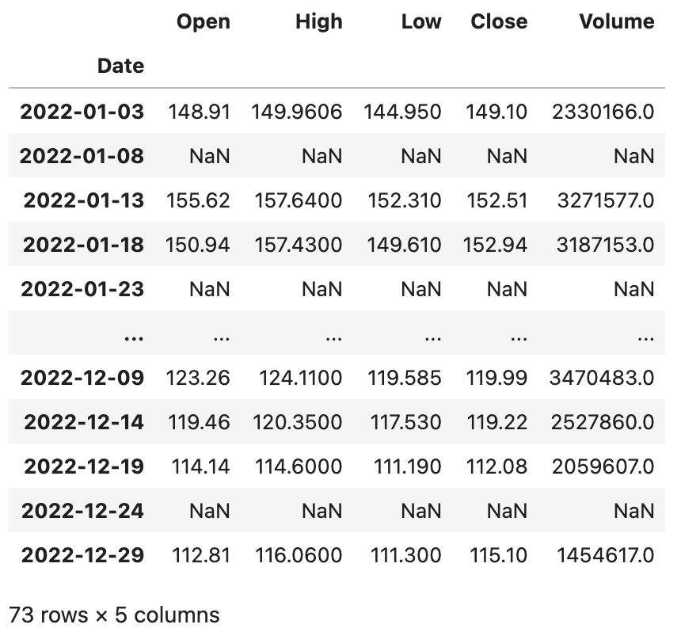
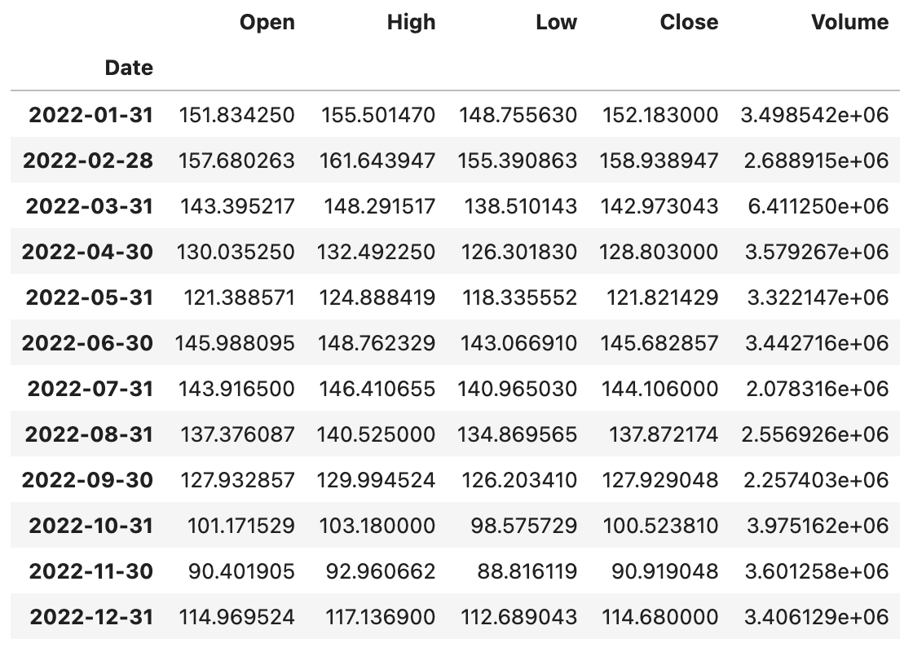
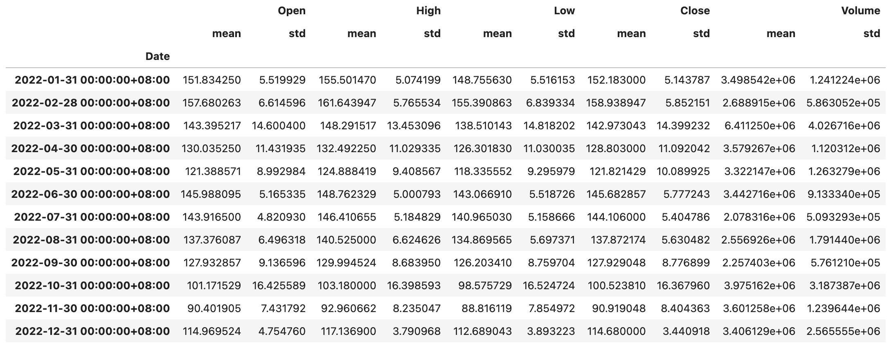
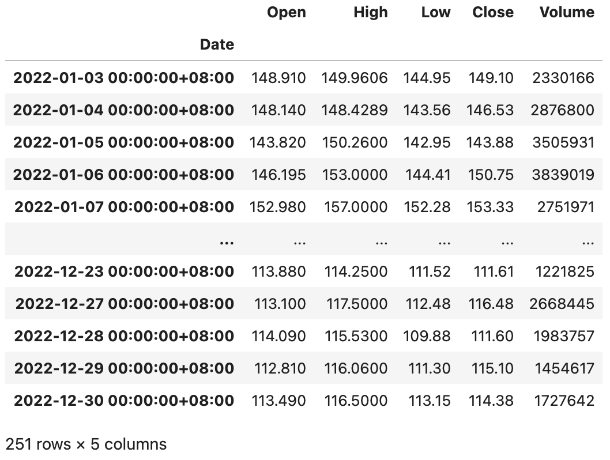
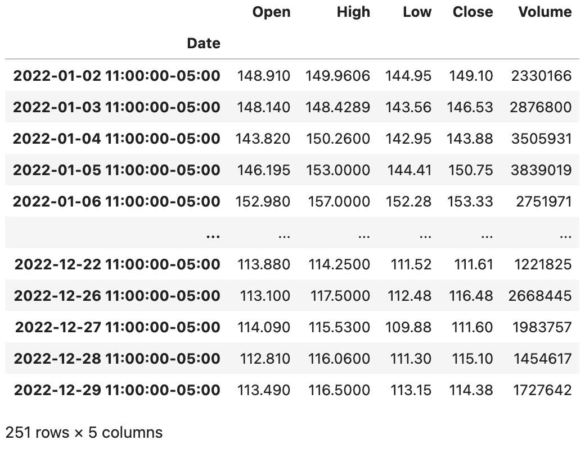

## Pandas in Action - 6

Let's take a look at the `Index` type, which provides indexing services for `Series` and `DataFrame` objects. With an index, we can sort data (using the `sort_index` method), align data (which is crucial during operations and data merging), and achieve fast data retrieval (index operations). Since a `DataFrame` represents two-dimensional data, it has indexes for both rows and columns, namely `index` and `columns`. Creating an `Index` type is relatively straightforward -- typically you just need to provide three parameters: `data`, `dtype`, and `name`, representing the data used as the index, the data type of the index, and the name of the index respectively. Since `Index` itself is also one-dimensional data, its methods and properties are very similar to those of `Series`. You can try creating an `Index` object and test whether the properties and methods you've learned before also work on the `Index` type. Next, let's focus on several subtypes of `Index`.

### Range Index

A range index consists of monotonic integers. We can create a range index using the `RangeIndex` constructor, or through the `RangeIndex` class method `from_range`, as shown in the code below.

Code:

```Python
sales_data = np.random.randint(400, 1000, 12)
index = pd.RangeIndex(1, 13, name='月份')
ser = pd.Series(data=sales_data, index=index)
ser
```

Output:

```
月份
1     703
2     705
3     557
4     943
5     961
6     615
7     788
8     985
9     921
10    951
11    874
12    609
dtype: int64
```

### Categorical Index

A categorical index is composed of nominal-scale values. If we need to group data by index and then perform aggregation operations, a categorical index comes in handy. The categorical index also has a method called `reorder_categories`, which allows you to specify an order for the index. The results of group aggregation will be presented according to this specified order, as shown in the code below.

Code:

```Python
sales_data = [6, 6, 7, 6, 8, 6]
index = pd.CategoricalIndex(
    data=['苹果', '香蕉', '苹果', '苹果', '桃子', '香蕉'],
    categories=['苹果', '香蕉', '桃子'],
    ordered=True
)
ser = pd.Series(data=sales_data, index=index)
ser
```

Output:

```
苹果    6
香蕉    6
苹果    7
苹果    6
桃子    8
香蕉    6
dtype: int64
```

Group data by index, then use `sum` to calculate the totals.

```Python
ser.groupby(level=0).sum()
```

Output:

```
苹果    19
香蕉    12
桃子     8
dtype: int64
```

Specify the order of the index.

```python
ser.index = index.reorder_categories(['香蕉', '桃子', '苹果'])
ser.groupby(level=0).sum()
```

Output:

```
香蕉    12
桃子     8
苹果    19
dtype: int64
```

### Multi-level Index

The `MultiIndex` type in Pandas is used to represent hierarchical or multi-level indexes. You can use the `MultiIndex` class methods `from_arrays`, `from_product`, `from_tuples`, etc. to create multi-level indexes. Here are a few examples.

Code:

```python
tuples = [(1, 'red'), (1, 'blue'), (2, 'red'), (2, 'blue')]
index = pd.MultiIndex.from_tuples(tuples, names=['no', 'color'])
index
```

Output:

```
MultiIndex([(1,  'red'),
            (1, 'blue'),
            (2,  'red'),
            (2, 'blue')],
           names=['no', 'color'])
```

Code:

```python
arrays = [[1, 1, 2, 2], ['red', 'blue', 'red', 'blue']]
index = pd.MultiIndex.from_arrays(arrays, names=['no', 'color'])
index
```

Output:

```
MultiIndex([(1,  'red'),
            (1, 'blue'),
            (2,  'red'),
            (2, 'blue')],
           names=['no', 'color'])
```

Code:

```python
sales_data = np.random.randint(1, 100, 4)
ser = pd.Series(data=sales_data, index=index)
ser
```

Output:

```
no  color
1   red      43
    blue     31
2   red      55
    blue     75
dtype: int64
```

Code:

```python
ser.groupby('no').sum()
```

Output:

```
no
1     74
2    130
dtype: int64
```

Code:

```python
ser.groupby(level=1).sum()
```

Output:

```
color
blue    106
red      98
dtype: int64
```

Code:

```Python
stu_ids = np.arange(1001, 1006)
semisters = ['期中', '期末']
index = pd.MultiIndex.from_product((stu_ids, semisters), names=['学号', '学期'])
courses = ['语文', '数学', '英语']
scores = np.random.randint(60, 101, (10, 3))
df = pd.DataFrame(data=scores, columns=courses, index=index)
df
```

Output:

```
             语文 数学 英语
学号	学期
1001  期中	93	77	60
      期末	93	98	84
1002  期中	64	78	71
      期末	70	71	97
1003  期中	72	88	97
      期末	99	100	63
1004  期中	80	71	61
      期末	91	62	72
1005  期中	82	95	67
      期末	84	78	86
```

Group data by the first-level index, and calculate each student's course grade using a weighting of `25%` for the midterm score and `75%` for the final exam score.

Code:

```Python
df.groupby(level=0).agg(lambda x: x.values[0] * 0.25 + x.values[1] * 0.75)
```

Output:

```
        语文    数学    英语
学号
1001	93.00	92.75	78.00
1002	68.50	72.75	90.50
1003	92.25	97.00	71.50
1004	88.25	64.25	69.25
1005	83.50	82.25	81.25
```

### Interval Index

An interval index, as the name suggests, uses fixed interval ranges as the index. We typically use the `interval_range` function to create interval indexes, as shown in the code below.

Code:

```python
index = pd.interval_range(start=0, end=5)
index
```

Output:

```
IntervalIndex([(0, 1], (1, 2], (2, 3], (3, 4], (4, 5]], dtype='interval[int64, right]')
```

`IntervalIndex` has a method called `contains` that checks whether the range includes a certain element, as shown below.

Code:

```python
index.contains(1.5)
```

Output:

```
array([False,  True, False, False, False])
```

`IntervalIndex` also has a method called `overlaps` that checks whether a range overlaps with other ranges, as shown below.

Code:

```python
index.overlaps(pd.Interval(1.5, 3.5))
```

Output:

```
array([False,  True,  True,  True, False])
```

If you want the interval range to be left-closed and right-open, you can set `closed='left'` when creating the interval index; if you want both sides to be closed, you can set the `closed` parameter to `both`, as shown in the code below.

Code:

```python
index = pd.interval_range(start=0, end=5, closed='left')
index
```

Output:

```
IntervalIndex([[0, 1), [1, 2), [2, 3), [3, 4), [4, 5)], dtype='interval[int64, left]')
```

Code:

```python
index = pd.interval_range(start=pd.Timestamp('2022-01-01'), end=pd.Timestamp('2022-01-04'), closed='both')
index
```

Output:

```
IntervalIndex([[2022-01-01, 2022-01-02], [2022-01-02, 2022-01-03], [2022-01-03, 2022-01-04]], dtype='interval[datetime64[ns], both]')
```


### Datetime Index

`DatetimeIndex` is probably the most complex and important type of index among all index types. We typically use the `date_range()` function to create datetime indexes. This function has several very important parameters: `start`, `end`, `periods`, `freq`, and `tz`, representing the start datetime, end datetime, number of periods to generate, sampling frequency, and timezone respectively. Let's first look at how to create `DatetimeIndex` objects, and then discuss related operations and calculations, as shown in the code below.

Code:

```Python
pd.date_range('2021-1-1', '2021-6-30', periods=10)
```

Output:

```
DatetimeIndex(['2021-01-01', '2021-01-21', '2021-02-10', '2021-03-02',
               '2021-03-22', '2021-04-11', '2021-05-01', '2021-05-21',
               '2021-06-10', '2021-06-30'],
              dtype='datetime64[ns]', freq=None)
```

Code:

```Python
pd.date_range('2021-1-1', '2021-6-30', freq='W')
```

> **Note**: `freq=W` means the sampling period is one week, and by default Sunday is the start of the week. If you want Monday to be the start of the week, you can change it to `freq=W-MON`. You can also try setting this parameter to `12H`, `M`, `Q`, etc. to see what happens -- it shouldn't be hard to guess their meanings.

Output:

```
DatetimeIndex(['2021-01-03', '2021-01-10', '2021-01-17', '2021-01-24',
               '2021-01-31', '2021-02-07', '2021-02-14', '2021-02-21',
               '2021-02-28', '2021-03-07', '2021-03-14', '2021-03-21',
               '2021-03-28', '2021-04-04', '2021-04-11', '2021-04-18',
               '2021-04-25', '2021-05-02', '2021-05-09', '2021-05-16',
               '2021-05-23', '2021-05-30', '2021-06-06', '2021-06-13',
               '2021-06-20', '2021-06-27'],
              dtype='datetime64[ns]', freq='W-SUN')
```

`DatetimeIndex` can perform arithmetic with `DateOffset` types, which makes sense since we can set a time offset to shift dates forward or backward. The specific operations are shown below.

Code:

```Python
index = pd.date_range('2021-1-1', '2021-6-30', freq='W')
index - pd.DateOffset(days=2)
```

Output:

```
DatetimeIndex(['2021-01-01', '2021-01-08', '2021-01-15', '2021-01-22',
               '2021-01-29', '2021-02-05', '2021-02-12', '2021-02-19',
               '2021-02-26', '2021-03-05', '2021-03-12', '2021-03-19',
               '2021-03-26', '2021-04-02', '2021-04-09', '2021-04-16',
               '2021-04-23', '2021-04-30', '2021-05-07', '2021-05-14',
               '2021-05-21', '2021-05-28', '2021-06-04', '2021-06-11',
               '2021-06-18', '2021-06-25'],
              dtype='datetime64[ns]', freq=None)
```

Code:

```Python
index + pd.DateOffset(hours=2, minutes=10)
```

Output:

```
DatetimeIndex(['2021-01-03 02:10:00', '2021-01-10 02:10:00',
               '2021-01-17 02:10:00', '2021-01-24 02:10:00',
               '2021-01-31 02:10:00', '2021-02-07 02:10:00',
               '2021-02-14 02:10:00', '2021-02-21 02:10:00',
               '2021-02-28 02:10:00', '2021-03-07 02:10:00',
               '2021-03-14 02:10:00', '2021-03-21 02:10:00',
               '2021-03-28 02:10:00', '2021-04-04 02:10:00',
               '2021-04-11 02:10:00', '2021-04-18 02:10:00',
               '2021-04-25 02:10:00', '2021-05-02 02:10:00',
               '2021-05-09 02:10:00', '2021-05-16 02:10:00',
               '2021-05-23 02:10:00', '2021-05-30 02:10:00',
               '2021-06-06 02:10:00', '2021-06-13 02:10:00',
               '2021-06-20 02:10:00', '2021-06-27 02:10:00'],
              dtype='datetime64[ns]', freq=None)
```

If a `Series` or `DataFrame` object uses a `DatetimeIndex` type index, we can use the `asfreq()` method to specify a time frequency to resample the data. We'll use the Baidu stock data mentioned earlier as an example.

Code:

```Python
baidu_df = pd.read_excel('data/2022年股票数据.xlsx', sheet_name='BIDU', index_col='Date')
baidu_df.sort_index(inplace=True)
baidu_df.asfreq('5D')
```

Output:



You may have noticed that sampling every 5 days might land on a non-trading day, in which case all corresponding columns become null values. To solve this problem, you can specify a method to fill null values using the `method` parameter of the `asfreq` method, which fills in data from adjacent trading days.

Code:

```Python
baidu_df.asfreq('5D', method='ffill')
```

Output:


When using a `DatetimeIndex`, we can also use the `resample()` method to resample data based on time, which is equivalent to grouping data by time periods. After grouping, we can also perform aggregate statistics, as shown in the code below.

Code:

```Python
baidu_df.resample('1M').mean()
```

Output:



Code:

```python
baidu_df.resample('1M').agg(['mean', 'std'])
```

Output:



> **Tip**: Have you noticed that the column index of the `DataFrame` output above is a `MultiIndex` object? You can access the `columns` attribute of the `DataFrame` object above to verify this.

If you need to perform timezone conversion for datetime, you can first use the `tz_localize()` method to localize the datetime, as shown in the code below.

Code:

```Python
baidu_df = baidu_df.tz_localize('Asia/Chongqing')
baidu_df
```

Output:



After localizing the datetime, we can use the `tz_convert()` method to convert timezones, as shown in the code below.

Code:

```Python
baidu_df.tz_convert('America/New_York')
```

Output:



If your data uses a `DatetimeIndex` type index, you'll very likely need to perform time series analysis on the data. The methods and models for time series analysis are not the focus of this chapter -- we'll share them in other dedicated articles.
