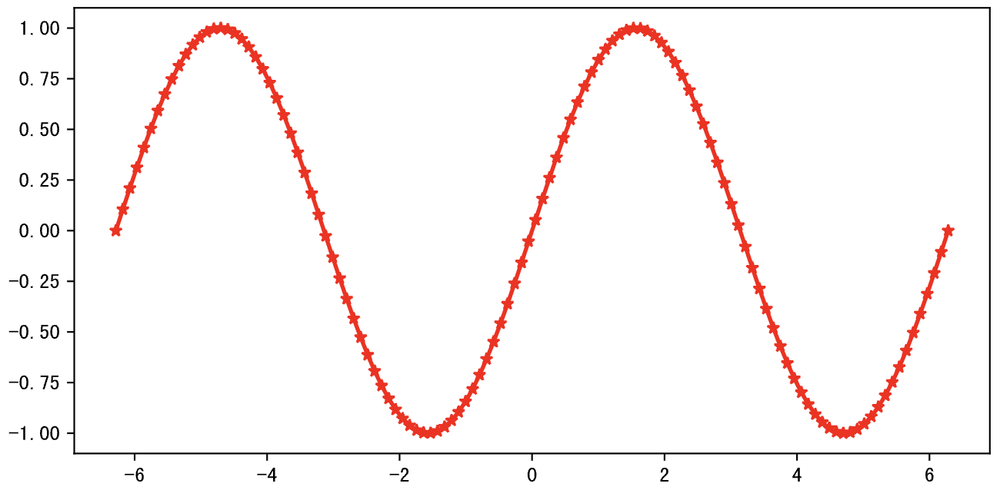
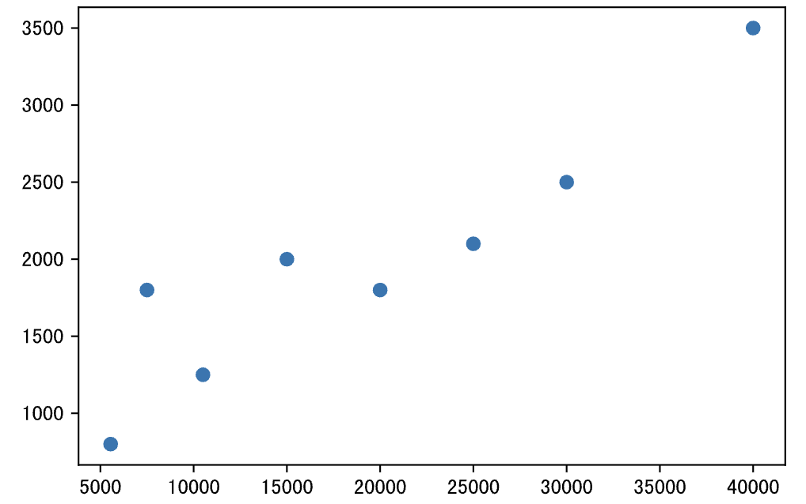
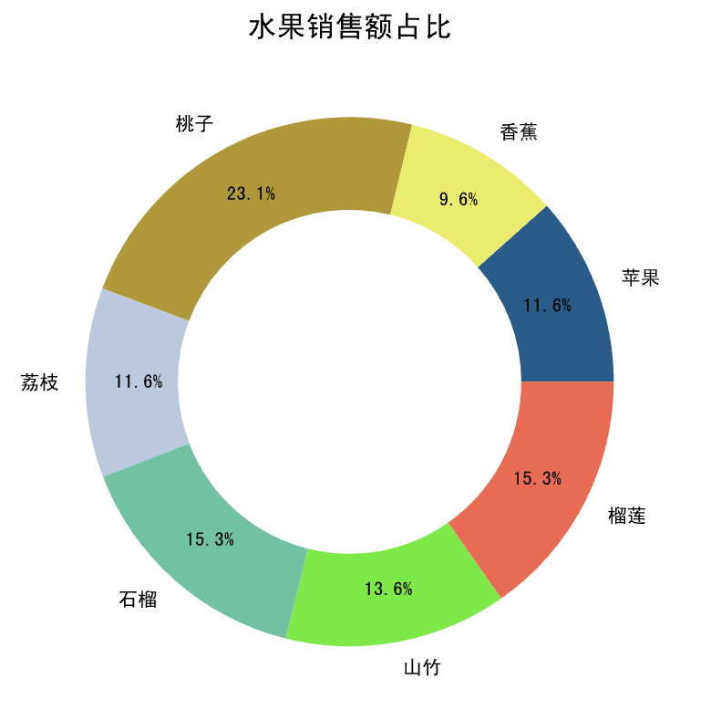
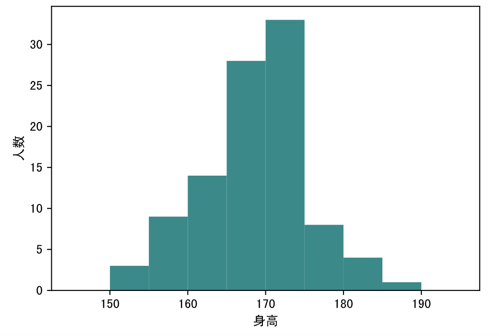

## Data Visualization - 1

After completing data pivoting, we can present the results through visualization -- in other words, turning data into attractive statistical charts. Since humans are more sensitive to colors and shapes, this helps us further interpret the business value hidden behind the data. In previous lessons, we've already shown you how to generate visualizations using the `plot` method of `Series` or `DataFrame` objects. In this chapter, we'll introduce the foundation of that plotting method: the famous matplotlib library.

Before diving into matplotlib, please take a look at the chart below, which shows common chart types and their application scenarios. If you're unsure which chart to choose when creating statistical graphics, this diagram should help. In short: use line charts for trends, bar charts for comparisons, scatter plots for relationships, pie charts for proportions, histograms for distributions, and box plots for outliers.


### Import and Configuration

In previous lessons, we covered how to install and import the matplotlib library. If you're not sure whether matplotlib is already installed, you can use the following magic command to install or upgrade it.

```
%pip install -U matplotlib
```

To resolve the issue of displaying Chinese characters in matplotlib charts, we need to modify the `rcParams` configuration parameters of the `pyplot` module, as shown below.

```Python
import matplotlib.pyplot as plt

plt.rcParams['font.sans-serif'].insert(0, 'SimHei')
plt.rcParams['axes.unicode_minus'] = False
```

> **Note**: `SimHei` in the code above is a font name. You can download and install this font from Baidu Cloud at the following link: https://pan.baidu.com/s/1rQujl5RQn9R7PadB2Z5g_g?pwd=e7b4. You can try installing other Chinese fonts as well. After installation, if you don't know the font name, you can look in the `.matplotlib` folder under your home directory for the `fontlist-v330.json` file, which contains information about font file paths and font names. Note that after using a Chinese font, the minus sign on the axes will not display correctly. You need to set the `axes.unicode_minus` parameter to `False` to ensure the minus sign displays properly on the axes.

With the following magic command, we can generate [vector graphics](https://zh.wikipedia.org/wiki/%E7%9F%A2%E9%87%8F%E5%9B%BE%E5%BD%A2) (SVG - Scalable Vector Graphics) when plotting. Vector graphics don't lose quality when zoomed in, zoomed out, or rotated, making them much more pleasant to look at.

```Python
%config InlineBackend.figure_format='svg'
```

### Creating a Canvas

The `figure` function in the `pyplot` module can be used to create a canvas. When creating a canvas, you can specify the canvas size using the `figsize` parameter (default value is `[6.4, 4.8]`), set the drawing resolution using the `dpi` parameter (since `dpi` represents pixels per inch), and set the background color using the `facecolor` parameter. The return value of the `figure` function is a `Figure` object representing the canvas, which we can use to create coordinate systems for plotting.

```Python
plt.figure(figsize=(8, 4), dpi=120, facecolor='darkgray')
```

### Creating Coordinate Systems

You can use the `subplot` function in the `pyplot` module to create a coordinate system, which returns an `Axes` object. The first three parameters of `subplot` specify how many rows and columns the canvas is divided into, and the index of the current coordinate system -- all three parameters default to `1`. If no coordinate system is created, plotting will use the default (and only) coordinate system on the canvas. If you need multiple coordinate systems on a canvas, you can use this function. Alternatively, you can use the `add_subplot` method or `add_axes` method of the `Figure` object created above. The former works the same way as the `subplot` function, while the latter creates nested coordinate systems.

```Python
plt.subplot(2, 2, 1)
```

### Drawing Charts

#### Line Chart

When plotting, if you haven't called the `figure` and `subplot` functions first, the default canvas and coordinate system will be used. To draw a line chart, you can use the `plot` function of the `pyplot` module, specifying the data for the horizontal and vertical axes. Line charts are best suited for observing data trends, especially when the horizontal axis represents time. You can use the `color` parameter of the `plot` function to customize the line color, the `marker` parameter to customize data point markers (e.g., `*` for star, `^` for triangle, `o` for circle, etc.), the `linestyle` parameter to customize the line style (e.g., `-` for solid line, `--` for dashed line, `:` for dotted line, etc.), and the `linewidth` parameter to customize the line thickness. The code below draws a sine curve, where `marker='*'` sets the data point markers to star shapes, and `color='red'` draws the line in red.

Code:

```Python
import numpy as np

x = np.linspace(-2 * np.pi, 2 * np.pi, 120)
y = np.sin(x)

# Create canvas
plt.figure(figsize=(8, 4), dpi=120)
# Draw line chart
plt.plot(x, y, linewidth=2, marker='*', color='red')
# Display the chart
plt.show()
```

Output:



To plot both sine and cosine curves on the same coordinate system, we can slightly modify the code above.

Code:

```Python
x = np.linspace(-2 * np.pi, 2 * np.pi, 120)
y1, y2 = np.sin(x), np.cos(x)

plt.figure(figsize=(8, 4), dpi=120)
plt.plot(x, y1, linewidth=2, marker='*', color='red')
plt.plot(x, y2, linewidth=2, marker='^', color='blue')
# Customize annotations on the chart (don't worry about the annotate function parameters if you don't understand them yet)
plt.annotate('sin(x)', xytext=(0.5, -0.75), xy=(0, -0.25), fontsize=12, arrowprops={
    'arrowstyle': '->', 'color': 'darkgreen', 'connectionstyle': 'angle3, angleA=90, angleB=0'
})
plt.annotate('cos(x)', xytext=(-3, 0.75), xy=(-1.25, 0.5), fontsize=12, arrowprops={
    'arrowstyle': '->', 'color': 'darkgreen', 'connectionstyle': 'arc3, rad=0.35'
})
plt.show()
```

Output:


To use two separate coordinate systems for sine and cosine, you can use the `subplot` function mentioned above to create coordinate systems before plotting.

Code:

```Python
plt.figure(figsize=(8, 4), dpi=120)
# Create coordinate system (1st plot)
plt.subplot(2, 1, 1)
plt.plot(x, y1, linewidth=2, marker='*', color='red')
# Create coordinate system (2nd plot)
plt.subplot(2, 1, 2)
plt.plot(x, y2, linewidth=2, marker='^', color='blue')
plt.show()
```

Output:


You can also do it like this -- run the code and see what's different from the chart above.

```Python
plt.figure(figsize=(8, 4), dpi=120)
plt.subplot(1, 2, 1)
plt.plot(x, y1, linewidth=2, marker='*', color='red')
plt.subplot(1, 2, 2)
plt.plot(x, y2, linewidth=2, marker='^', color='blue')
plt.show()
```

Then, try the following code and see what the output looks like.

```Python
fig = plt.figure(figsize=(10, 4), dpi=120)
plt.plot(x, y1, linewidth=2, marker='*', color='red')
# Use the Figure object's add_axes method to nest a new coordinate system within the existing one.
# The parameter is a four-element tuple representing the position of the new coordinate system
# within the original one: the first two values are the bottom-left position, and the last two
# values are the width and height of the coordinate system.
ax = fig.add_axes((0.595, 0.6, 0.3,0.25))
ax.plot(x, y2, marker='^', color='blue')
ax = fig.add_axes((0.155, 0.2, 0.3,0.25))
ax.plot(x, y2, marker='^', color='green')
plt.show()
```

#### Scatter Plot

Scatter plots help us understand the relationship between two variables. If we need to understand the relationship among three variables, we can upgrade a scatter plot to a bubble chart. In the code below, the `x` and `y` arrays represent monthly income and monthly online shopping expenditure respectively. If we want to see whether `x` and `y` are correlated, we can draw a scatter plot as shown below.

Code:

```Python
x = np.array([5550, 7500, 10500, 15000, 20000, 25000, 30000, 40000])
y = np.array([800, 1800, 1250, 2000, 1800, 2100, 2500, 3500])

plt.figure(figsize=(6, 4), dpi=120)
plt.scatter(x, y)
plt.show()
```

Output:



#### Bar Chart

When comparing data differences, bar charts are an excellent choice. We can use the `bar` function of the `pyplot` module to generate vertical bar charts, or the `barh` function to generate horizontal bar charts. Let's first prepare some data for the bar chart, as shown below.

```Python
x = np.arange(4)
y1 = np.random.randint(20, 50, 4)
y2 = np.random.randint(10, 60, 4)
```

Code for drawing a bar chart.

Code:

```Python
plt.figure(figsize=(6, 4), dpi=120)
# Offset the x-coordinates to separate bars for two groups. The width parameter controls bar thickness, and the label parameter adds labels.
plt.bar(x - 0.1, y1, width=0.2, label='Sales Team A')
plt.bar(x + 0.1, y2, width=0.2, label='Sales Team B')
# Customize x-axis ticks
plt.xticks(x, labels=['Q1', 'Q2', 'Q3', 'Q4'])
# Display legend
plt.legend()
plt.show()
```

Output:


To draw a stacked bar chart, we can slightly modify the code above, as shown below.

Code:

```Python
labels = ['Q1', 'Q2', 'Q3', 'Q4']
plt.figure(figsize=(6, 4), dpi=120)
plt.bar(labels, y1, width=0.4, label='Sales Team A')
# Note: The key to stacked bar charts is using the previous bars as the base for new bars. Use the bottom parameter to specify the base data, and new bars will be drawn on top of it.
plt.bar(labels, y2, width=0.4, bottom=y1, label='Sales Team B')
plt.legend(loc='lower right')
plt.show()
```

Output:


#### Pie Chart

A pie chart is a statistical chart that divides data into several sectors, primarily used to describe the relative proportions of quantities, frequencies, etc. In a pie chart, the size of each sector represents the proportion of the quantity it represents, and all sectors together form a complete circle. When you need to show data composition, pie charts, treemaps, and waterfall charts are good choices. We can use the `pie` function of the `pyplot` module to draw pie charts, as shown in the code below.

Code:

```Python
data = np.random.randint(100, 500, 7)
labels = ['Apple', 'Banana', 'Peach', 'Lychee', 'Pomegranate', 'Mangosteen', 'Durian']

plt.figure(figsize=(5, 5), dpi=120)
plt.pie(
    data,
    # Automatically display percentages
    autopct='%.1f%%',
    # Pie chart radius
    radius=1,
    # Distance from percentage label to center
    pctdistance=0.8,
    # Colors (randomly generated)
    colors=np.random.rand(7, 3),
    # Separation distance
    # explode=[0.05, 0, 0.1, 0, 0, 0, 0],
    # Shadow effect
    # shadow=True,
    # Font properties
    textprops=dict(fontsize=8, color='black'),
    # Wedge properties (key to generating donut charts)
    wedgeprops=dict(linewidth=1, width=0.35),
    # Labels
    labels=labels
)
# Customize chart title
plt.title('Fruit Sales Proportion')
plt.show()
```

Output:



> **Note**: Try uncommenting the commented-out parts of the code above and see what effects they produce.

#### Histogram

In statistics, a histogram is a chart that displays the distribution of data. It is a two-dimensional statistical chart where the two axes represent the statistical samples and a measured attribute of those samples. The data below shows the heights of 100 male students at a school. If we want to understand the distribution of the data, we can use a histogram.

```Python
heights = np.array([
    170, 163, 174, 164, 159, 168, 165, 171, 171, 167,
    165, 161, 175, 170, 174, 170, 174, 170, 173, 173,
    167, 169, 173, 153, 165, 169, 158, 166, 164, 173,
    162, 171, 173, 171, 165, 152, 163, 170, 171, 163,
    165, 166, 155, 155, 171, 161, 167, 172, 164, 155,
    168, 171, 173, 169, 165, 162, 168, 177, 174, 178,
    161, 180, 155, 155, 166, 175, 159, 169, 165, 174,
    175, 160, 152, 168, 164, 175, 168, 183, 166, 166,
    182, 174, 167, 168, 176, 170, 169, 173, 177, 168,
    172, 159, 173, 185, 161, 170, 170, 184, 171, 172
])
```

We can use the `hist` function of the `pyplot` module to draw a histogram, where the `bins` parameter represents the binning method we use (heights from 150cm to 190cm, with 5cm per bin), as shown in the code below.

Code:

```Python
plt.figure(figsize=(6, 4), dpi=120)
# Draw histogram
plt.hist(heights, bins=np.arange(145, 196, 5), color='darkcyan')
# Customize x-axis label
plt.xlabel('Height')
# Customize y-axis label
plt.ylabel('Probability Density')
plt.show()
```

Output:



When drawing a histogram, if you set the `hist` function's `density` parameter to `True` and also set the `cumulative` parameter to `True`, the y-axis will display probability density and the chart will show the cumulative probability distribution, as shown below.

Code:

```python
plt.figure(figsize=(6, 4), dpi=120)
# Draw histogram
plt.hist(heights, bins=np.arange(145, 196, 5), color='darkcyan', density=True, cumulative=True)
# Customize x-axis label
plt.xlabel('Height')
# Customize y-axis label
plt.ylabel('Probability')
plt.show()
```

Output:


#### Box Plot

A box plot, also known as a box-and-whisker diagram, is a statistical chart used to display the distribution and spread of a dataset, as shown below. It gets its name because the graphic resembles a box with lines (whiskers) extending from the upper and lower quartiles. In a box plot, the top edge of the box is at the upper quartile ( $\small{Q_{3}}$ ), the bottom edge is at the lower quartile ( $\small{Q_{1}}$ ), the line in the middle of the box is at the median ( $\small{Q_{2}}$ ), and the length of the box is the interquartile range (IQR). Additionally, the upper whisker boundary is the maximum value, and the lower whisker boundary is the minimum value. Points beyond these two whiskers are outliers. An outlier is defined as a value less than $\small{Q_{1} - 1.5 \times IQR}$ or greater than $\small{Q_{3} + 1.5 \times IQR}$. The `1.5` in the formula can also be replaced with `3` to detect extreme outliers, while outliers between `1.5` and `3` are typically called mild outliers.

We can use the `boxplot` function of the `pyplot` module to draw box plots, as shown in the code below.

Code:

```Python
# Array with 47 random numbers in the range [0, 100)
data = np.random.randint(0, 100, 47)
# Append three values that might be outliers
data = np.append(data, 160)
data = np.append(data, 200)
data = np.append(data, -50)

plt.figure(figsize=(6, 4), dpi=120)
# The default value of whis is 1.5; setting it to 3 detects extreme outliers. showmeans=True marks the mean on the chart.
plt.boxplot(data, whis=1.5, showmeans=True, notch=True)
# Customize y-axis range
plt.ylim([-100, 250])
# Customize x-axis ticks
plt.xticks([1], labels=['data'])
plt.show()
```

Output:


> **Note**: Since the data is randomly generated, the chart you get from running the code above may differ from what's shown here. The actual result from running the code is what matters.

### Displaying and Saving Charts

You can use the `show` function of the `pyplot` module to display a chart -- we've used this function in the code above. If you want to save a chart, you can use the `savefig` function. Note that if you want to both display and save a chart, you should call `savefig` first and then `show`, because the chart is released when `show` is called, and calling `savefig` after `show` will only save a blank area.

```Python
plt.savefig('chart.png')
plt.show()
```

### Other Charts

With matplotlib, we can also create other types of statistical charts (such as radar charts, rose charts, heatmaps, etc.), but the most frequently used chart types in practice have already been fully demonstrated above. Additionally, matplotlib has many details for customizing statistical charts, such as customizing axes, text, and labels on charts. If you want to learn how to create and customize more types of charts with matplotlib, you can refer to the [documentation](https://matplotlib.org/stable/tutorials/index.html) and [examples](https://matplotlib.org/stable/gallery/index.html) on the matplotlib official website. We'll provide a brief introduction in the next chapter.
