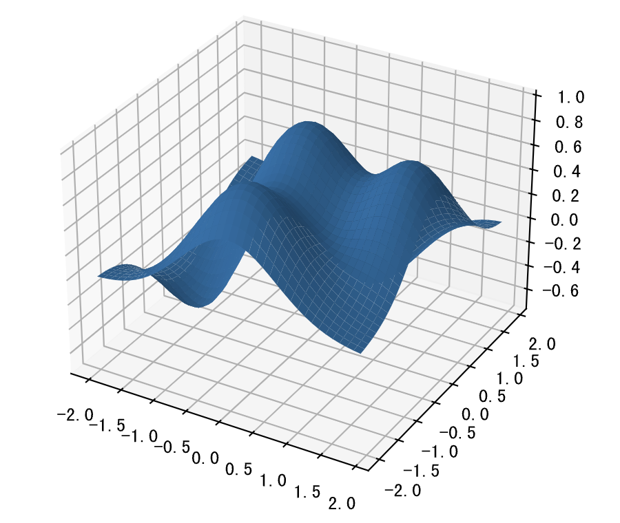
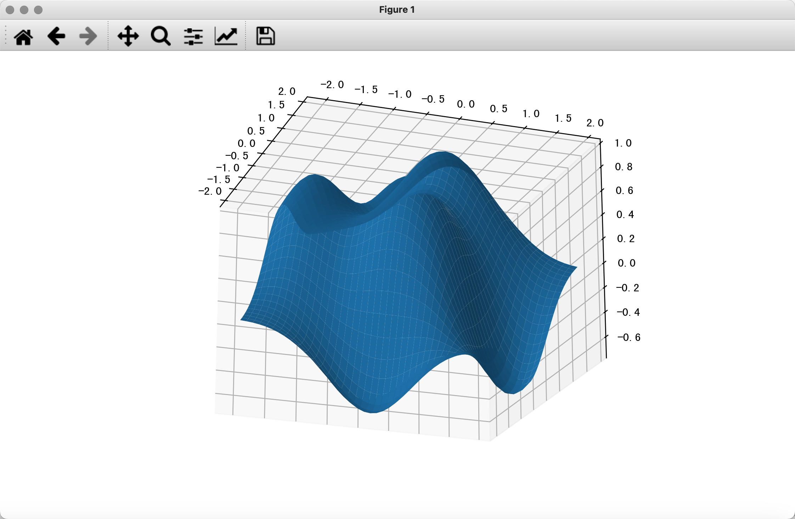

## Data Visualization - 2

In this chapter, we'll try to use matplotlib to create some advanced statistical charts. As mentioned earlier, you can learn how to use matplotlib and create more advanced charts by referring to the [documentation](https://matplotlib.org/stable/tutorials/index.html) and [examples](https://matplotlib.org/stable/gallery/index.html) on the matplotlib official website. Especially when customizing complex charts, we recommend finding the examples provided on the official site and simply making the necessary modifications to create the charts you want. This "copy + modify" approach should greatly improve your efficiency, because most of the time, the only difference between your code and the official code is the data -- there's no need to repeat tedious work.

### Bubble Chart

Bubble charts can be used to understand the relationship among three variables by comparing the position and size of bubbles to analyze the correlation between data dimensions. For example, in the scatter plot of monthly income vs. online shopping expenditure we drew earlier, we already discovered a positive correlation between the two. If we introduce a third variable -- the number of online purchases -- we need a bubble chart to display the data.

Code:

```python
income = np.array([5550, 7500, 10500, 15000, 20000, 25000, 30000, 40000])
outcome = np.array([800, 1800, 1250, 2000, 1800, 2100, 2500, 3500])
nums = np.array([5, 3, 10, 5, 12, 20, 8, 10])

# Use the scatter function's s parameter and c parameter to control size and color respectively
plt.scatter(income, outcome, s=nums * 30, c=nums, cmap='Reds')
# Display color bar
plt.colorbar()
# Display chart
plt.show()
```

Output:


### Area Chart

An area chart, also known as a stacked line chart, is based on line charts with color fill applied to the area below the lines to display magnitude. It is used to show values over continuous intervals or time spans, typically to display trends and compare values. Different color fills make the comparison and trends between multiple areas more prominent. In the example below, we use an area chart to show the time spent sleeping, eating, working, and playing from Monday to Sunday.

Code:

```python
plt.figure(figsize=(8, 4))
days = np.arange(7)
sleeping = [7, 8, 6, 6, 7, 8, 10]
eating = [2, 3, 2, 1, 2, 3, 2]
working = [7, 8, 7, 8, 6, 2, 3]
playing = [8, 5, 9, 9, 9, 11, 9]
# Draw stacked line chart
plt.stackplot(days, sleeping, eating, working, playing)
# Customize x-axis ticks
plt.xticks(days, labels=['Mon', 'Tue', 'Wed', 'Thu', 'Fri', 'Sat', 'Sun'])
# Customize legend
plt.legend(['Sleeping', 'Eating', 'Working', 'Playing'], fontsize=10)
# Display chart
plt.show()
```

Output:


### Radar Chart

Radar charts are typically used to compare multiple quantitative variables, useful for seeing which variables have similar values. They can also be used to identify which variables have relatively low or high values, making them ideal for displaying performance. Readers who frequently watch basketball or football games should be very familiar with radar charts -- for example, they are often used in NBA broadcasts to show player statistics. A radar chart is essentially a line chart mapped onto a polar coordinate system. When drawing a radar chart, the line needs to be closed (i.e., the first and last points must connect). Below is the code for drawing a radar chart.

Code:

```python
labels = np.array(['Speed', 'Power', 'Experience', 'Defense', 'Serve', 'Technique'])
# Data for Ma Long and Jun Mizutani
malong_values = np.array([93, 95, 98, 92, 96, 97])
shuigu_values = np.array([30, 40, 65, 80, 45, 60])
angles = np.linspace(0, 2 * np.pi, labels.size, endpoint=False)
# Add one more data point to close the shape
malong_values = np.append(malong_values, malong_values[0])
shuigu_values = np.append(shuigu_values, shuigu_values[0])
angles = np.append(angles, angles[0])
# Create canvas
plt.figure(figsize=(4, 4), dpi=120)
# Create coordinate system
ax = plt.subplot(projection='polar')
# Plot and fill
plt.plot(angles, malong_values, color='r', linewidth=2, label='Ma Long')
plt.fill(angles, malong_values, color='r', alpha=0.3)
plt.plot(angles, shuigu_values, color='g', linewidth=2, label='Jun Mizutani')
plt.fill(angles, shuigu_values, color='g', alpha=0.2)
# Display legend
ax.legend()
# Display chart
plt.show()
```

Output:


### Rose Chart

A rose chart is a bar chart mapped onto polar coordinates, invented by Florence Nightingale to present seasonal mortality rates in field hospitals. Since the relationship between radius and area is quadratic, a Nightingale rose chart exaggerates the proportional differences in data, making it especially suitable for comparing values that are close in magnitude. Additionally, due to the cyclical nature of circles, Nightingale rose charts are also suitable for representing time-based concepts within a cycle, such as days of the week or months.

Code:

```python
group1 = np.random.randint(20, 50, 4)
group2 = np.random.randint(10, 60, 4)
x = np.array([f'A-Q{i}' for i in range(1, 5)] + [f'B-Q{i}' for i in range(1, 5)])
y = np.array(group1.tolist() + group2.tolist())
# Angles and width of rose petals
theta = np.linspace(0, 2 * np.pi, x.size, endpoint=False)
width = 2 * np.pi / x.size
# Generate 8 random colors
colors = np.random.rand(8, 3)
# Project bar chart onto polar coordinates
ax = plt.subplot(projection='polar')
# Draw bar chart
plt.bar(theta, y, width=width, color=colors, bottom=0)
# Set grid
ax.set_thetagrids(theta * 180 / np.pi, x, fontsize=10)
# Display chart
plt.show()
```

Output:


### 3D Charts

matplotlib can also be used to create 3D charts. For details, you can refer to the official documentation. Below, we'll use a simple piece of code to demonstrate how to draw 3D charts.

Code:

```python
from mpl_toolkits.mplot3d import Axes3D

fig = plt.figure(figsize=(8, 4), dpi=120)
# Create a 3D coordinate system and add it to the canvas
ax = Axes3D(fig, auto_add_to_figure=False)
fig.add_axes(ax)
x = np.arange(-2, 2, 0.1)
y = np.arange(-2, 2, 0.1)
x, y = np.meshgrid(x, y)
z = (1 - y ** 5 + x ** 5) * np.exp(-x ** 2 - y ** 2)
# Draw 3D surface
ax.plot_surface(x, y, z)
# Display chart
plt.show()
```

Output:



It should be noted that the 3D chart rendered in JupyterLab is not a true 3D chart, because you cannot adjust the viewer's angle, nor can you rotate or zoom. To see true 3D effects, you need to render the chart in a Qt window. To do this, we can first install a third-party library called PyQt6, as shown below.

```
%pip install PyQt6
```

Then, we use a magic command to have JupyterLab render charts in a Qt window.

```
%matplotlib qt
```

After completing the steps above, we can re-run the 3D chart code and see a window like the one below. In this window, we can rotate and zoom the 3D chart using the mouse, and we can also select a portion of the chart data for closer observation -- isn't that very cool?


