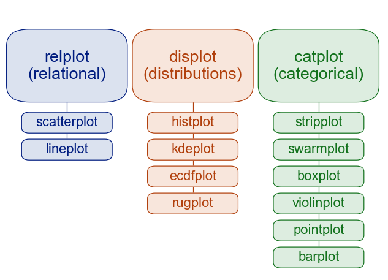
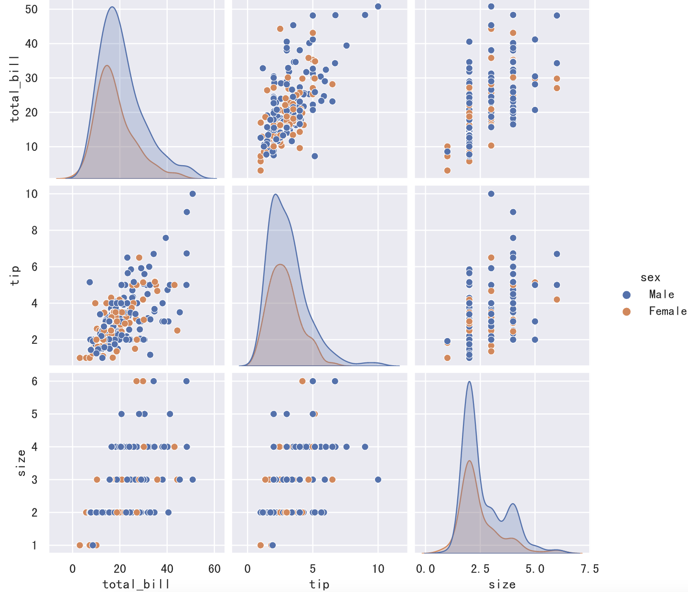
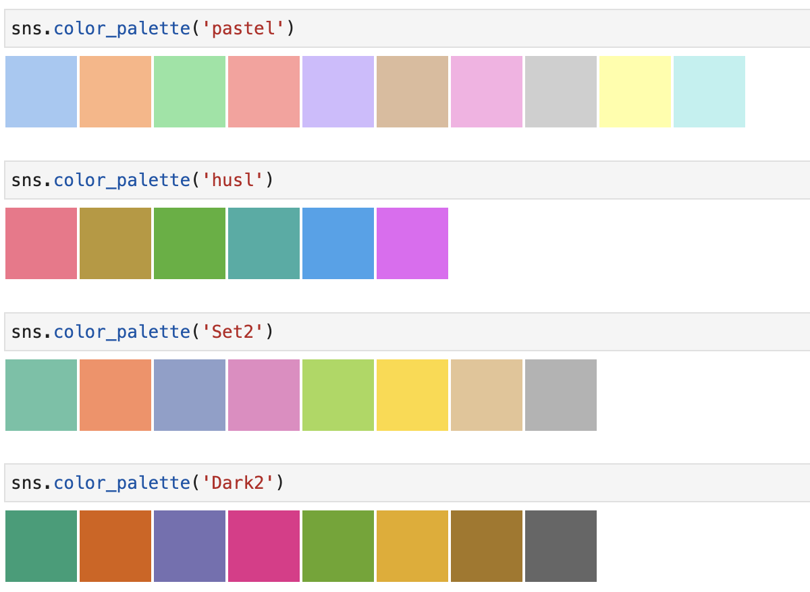
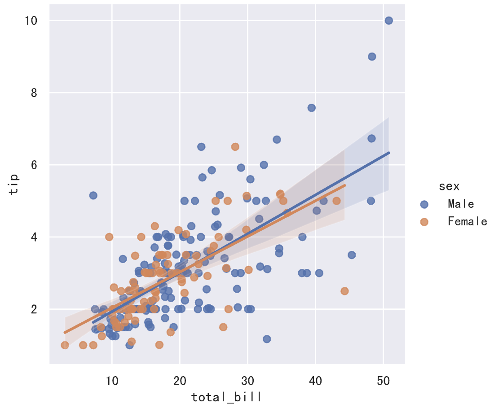
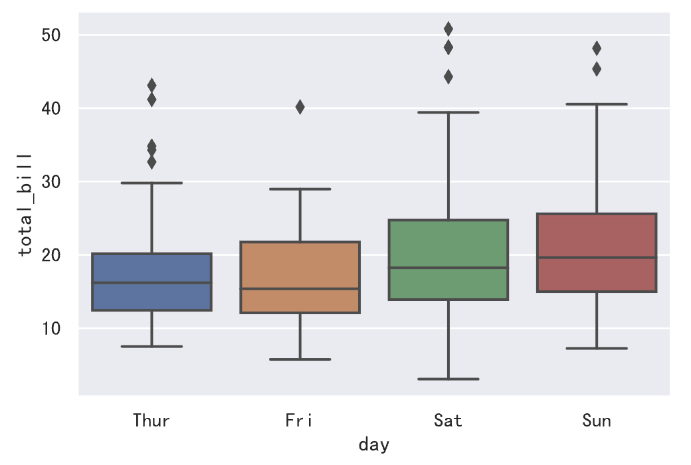
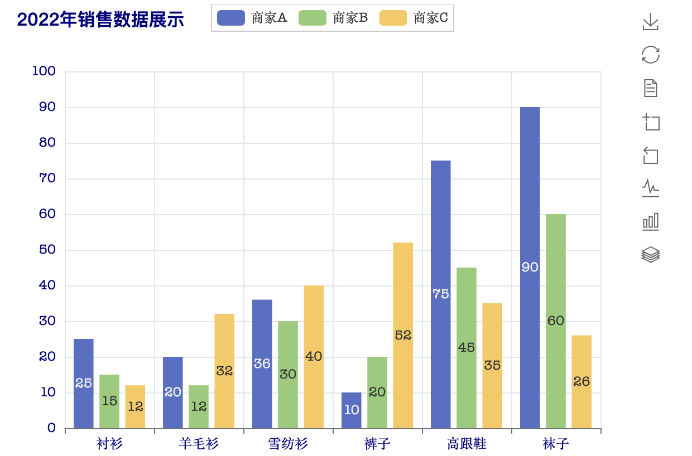
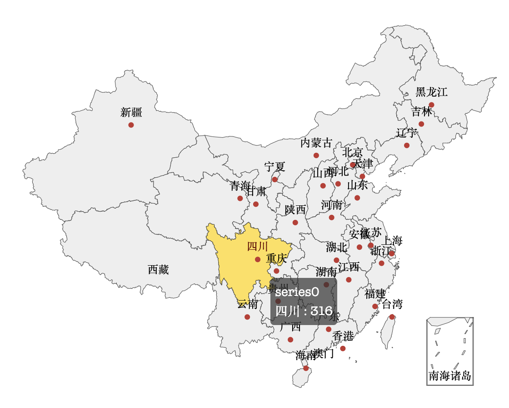

## Data Visualization - 3

Through our previous learning, we already have a basic understanding of the data visualization tool matplotlib. You may have also noticed that while the functions provided by matplotlib are powerful, there are too many parameters -- deep customization of charts requires modifying a series of parameters, which is not very beginner-friendly. On the other hand, the charts created with matplotlib are static, which may not be suitable for scenarios requiring interactive effects. To address these two issues, we'll introduce two new visualization tools: seaborn and pyecharts.

### Seaborn

Seaborn is a data visualization tool built on top of matplotlib. It essentially provides a higher-level wrapper around matplotlib, and seaborn also integrates seamlessly with pandas, allowing us to build better statistical charts with less code and helping us explore and understand data. Seaborn includes but is not limited to the following capabilities:

1. A dataset-oriented API for examining relationships between multiple variables.
1. Support for using categorical variables to display observations or summary statistics.
1. Options for visualizing univariate or bivariate distributions and comparing across data subsets.
1. Automatic estimation and plotting of linear regression models for various dependent variables.
1. Integrated color palettes and themes for easily customizing the visual appearance of statistical charts.

You can use Python's package manager pip to install seaborn.

```Bash
pip install seaborn
```

In Jupyter, you can install it directly using a magic command, as shown below.

```Bash
%pip install seaborn
```

Below, we'll use seaborn's built-in datasets as examples to briefly demonstrate seaborn's usage and power. Readers who want to dive deeper into seaborn can read the official [documentation](https://seaborn.pydata.org/tutorial.html) and check out the [examples in the official gallery.](https://seaborn.pydata.org/examples/index.html) Writing your own code based on official examples is a good approach -- simply keep the official code and replace the data with your own. The diagram below shows seaborn's plotting functions. As you can see, these functions primarily help us explore data relationships, distributions, and categories through chart creation.



To use seaborn, first import the library and set the theme, as shown in the code below.

```Python
import seaborn as sns

sns.set_theme()
```

If you need to display Chinese characters on charts, you'll also need to modify matplotlib's configuration parameters using the method we discussed earlier, as shown below.

```Python
import matplotlib.pyplot as plt

plt.rcParams['font.sans-serif'].insert(0, 'SimHei')
plt.rcParams['axes.unicode_minus'] = False
```

> **Note**: The code above must be placed after calling the set_theme function, otherwise calling set_theme will reset matplotlib's font configuration parameters.

Load the official Tips dataset (restaurant tipping data).

```Python
tips_df = sns.load_dataset('tips')
tips_df.info()
```

The output is shown below, where total_bill represents the total bill amount, tip represents the tip amount, sex is the customer's gender, smoker indicates whether the customer smokes, day represents the day of the week, time indicates whether it's lunch or dinner, and size is the number of diners.

```
<class 'pandas.core.frame.DataFrame'>
RangeIndex: 244 entries, 0 to 243
Data columns (total 7 columns):
 #   Column      Non-Null Count  Dtype
---  ------      --------------  -----
 0   total_bill  244 non-null    float64
 1   tip         244 non-null    float64
 2   sex         244 non-null    category
 3   smoker      244 non-null    category
 4   day         244 non-null    category
 5   time        244 non-null    category
 6   size        244 non-null    int64
dtypes: category(4), float64(2), int64(1)
memory usage: 7.4 KB
```

Since the dataset is loaded from the internet, the code above may fail to retrieve data due to SSL issues. You can try running the following code first, and then load the dataset.

```Python
import ssl

ssl._create_default_https_context = ssl._create_unverified_context
```

If we want to understand the distribution of bill amounts, we can use the following code to plot a distribution chart.

```Python
sns.histplot(data=tips_df, x='total_bill', kde=True)
```


If we want to understand the pairwise relationships between variables, we can draw a pair plot, as shown in the code and output below.

```Python
sns.pairplot(data=tips_df, hue='sex')
```



If you're not satisfied with the colors in the chart above, you can use the palette parameter to select one of seaborn's built-in "color palettes" to modify the colors. This approach is much more convenient and reliable than specifying colors manually or using random colors. The image below shows some of seaborn's built-in color palettes.



We can slightly modify the code above and see what difference it makes.

```Python
sns.pairplot(data=tips_df, hue='sex', palette='Dark2')
```

Next, let's create a joint distribution plot for the total_bill and tip columns, as shown in the code below.

```Python
sns.jointplot(data=tips_df, x='total_bill', y='tip', hue='sex')
```


The plot clearly shows that there is a positive correlation between total_bill and tip, which we can also verify using the DataFrame object's corr method. Next, we can build a regression model to fit these data points, and seaborn's linear model plot has already implemented this functionality for us, as shown in the code below.

```Python
sns.lmplot(data=tips_df, x='total_bill', y='tip', hue='sex')
```



If we want to understand the central tendency and dispersion of bill amounts, we can draw box plots or violin plots, as shown in the code below. We'll display the data separately for Thursday, Friday, Saturday, and Sunday.

```Python
sns.boxplot(data=tips_df, x='day', y='total_bill')
```



```Python
sns.violinplot(data=tips_df, x='day', y='total_bill')
```


> **Note**: Compared to box plots, violin plots do not mark outlier points but instead display the full range of the data. Additionally, violin plots effectively show the data distribution (density trace).

### Pyecharts

ECharts was originally a front-end charting library developed by Baidu. On January 16, 2018, ECharts entered the Apache Incubator for incubation and is now a top-level project of the Apache Software Foundation. Thanks to its excellent interactivity and elegant chart design, ECharts has gained recognition from many developers. Pyecharts is a Python wrapper for ECharts, allowing Python developers to create visually appealing and highly interactive statistical charts.

You can use Python's package manager pip to install pyecharts.

```Bash
pip install pyecharts
```

In JupyterLab, you can install it directly using a magic command, as shown below.

```Bash
%pip install pyecharts
```

To use pyecharts for plotting in JupyterLab, we need to do some preparation work, mainly modifying pyecharts configuration, as shown in the code below.

```python
from pyecharts.globals import CurrentConfig, NotebookType

CurrentConfig.NOTEBOOK_TYPE = NotebookType.JUPYTER_LAB
```

Next, let's get to know pyecharts through an example from the pyecharts official website's beginner tutorial. Of course, we've made some adjustments to the official example, as shown in the code below.

```Python
from pyecharts.charts import Bar
from pyecharts import options as opts

# Create a bar chart object and set initial parameters (width, height)
bar_chart = Bar(init_opts=opts.InitOpts(width='600px', height='450px'))
# Set x-axis data
bar_chart.add_xaxis(["衬衫", "羊毛衫", "雪纺衫", "裤子", "高跟鞋", "袜子"])
# Set y-axis data (first group)
bar_chart.add_yaxis("商家A", [25, 20, 36, 10, 75, 90])
# Set y-axis data (second group)
bar_chart.add_yaxis("商家B", [15, 12, 30, 20, 45, 60])
# Set y-axis data (third group)
bar_chart.add_yaxis("商家C", [12, 32, 40, 52, 35, 26])
# Add global configuration parameters
bar_chart.set_global_opts(
    # X-axis related parameters
    xaxis_opts=opts.AxisOpts(
        axislabel_opts=opts.LabelOpts(color='navy')
    ),
    # Y-axis related parameters (label, min, max, interval)
    yaxis_opts=opts.AxisOpts(
        axislabel_opts=opts.LabelOpts(color='navy'),
        min_=0,
        max_=100,
        interval=10
    ),
    # Title related parameters (content, link, position, text style)
    title_opts=opts.TitleOpts(
        title='2022年销售数据展示',
        pos_left='2%',
        title_textstyle_opts=opts.TextStyleOpts(
            color='navy',
            font_size=16,
            font_family='苹方-简',
            font_weight='bold'
        )
    ),
    # Toolbox related parameters
    toolbox_opts=opts.ToolboxOpts(
        orient='vertical',
        pos_left='right'
    )
)
# Load the JavaScript files needed for rendering
bar_chart.load_javascript()
```

After executing the code above, we can render the chart by calling methods on the `bar` object. If you use the `render` method directly, the chart will be saved to an HTML file, and opening that file will display the chart. The `render_notebook` method renders the chart directly in the browser window.

```python
bar_chart.render_notebook()
```

The output of the code above is shown in the image below. It's worth noting that the title, legend, and toolbox on the right side of the chart are all clickable -- try clicking them to see what happens. The charm of ECharts lies in its interactive effects, so be sure to give it a try.



Next, let's also look at how to draw a pie chart using an official example.

```Python
import pyecharts.options as opts
from pyecharts.charts import Pie

# Prepare data for the pie chart
x_data = ["Direct Visit", "Email Marketing", "Affiliate Ads", "Video Ads", "Search Engine"]
y_data = [335, 310, 234, 135, 1548]
data = [(x, y) for x, y in zip(x_data, y_data)]

# Create a pie chart object and set initialization parameters
pie_chart = Pie(init_opts=opts.InitOpts(width="800px", height="400px"))
# Add data to the pie chart
pie_chart.add(
    '',
    data_pair=data,
    radius=["50%", "75%"],
    label_opts=opts.LabelOpts(is_show=False),
)
# Set global configuration items
pie_chart.set_global_opts(
    # Configure legend-related parameters
    legend_opts=opts.LegendOpts(
        pos_left="legft",
        orient="vertical"
    )
)
# Set data series configuration parameters
pie_chart.set_series_opts(
    # Disable tooltip display
    tooltip_opts=opts.TooltipOpts(is_show=False),
    # Set pie chart label style
    label_opts=opts.LabelOpts(formatter="{b}({c}): {d}%")
)
pie_chart.load_javascript()
```

```python
pie_chart.render_notebook()
```

Running the code above produces the result shown in the image below.


It's important to note that pyecharts cannot directly use NumPy's ndarray or Pandas' Series and DataFrame to provide data -- it requires Python's native data types. As you may have noticed, in the code above we used lists and tuples as data types.

Finally, let's see how to draw maps. Drawing maps requires installing additional dependency libraries to obtain map-related information, as shown in the commands below.

```Bash
pip install echarts-countries-pypkg echarts-china-provinces-pypkg echarts-china-cities-pypkg echarts-china-counties-pypkg
```

In Jupyter, you can install them directly using magic commands, as shown below.

```Bash
%pip install echarts-countries-pypkg
%pip install echarts-china-provinces-pypkg
%pip install echarts-china-cities-pypkg
%pip install echarts-china-counties-pypkg
```

> **Note**: The four libraries above contain data for countries worldwide, Chinese provincial-level administrative regions, Chinese city-level administrative regions, and Chinese district/county-level administrative regions respectively.

Then, we put the data for all provinces in China into a list, as shown in the code below.

```Python
data = [
    ('广东', 594), ('浙江', 438), ('四川', 316), ('北京', 269), ('山东', 248),
    ('江苏', 234), ('湖南', 196), ('福建', 166), ('河南', 153), ('辽宁', 152),
    ('上海', 138), ('河北', 86), ('安徽', 79), ('湖北', 75), ('黑龙江', 70),
    ('陕西', 63), ('吉林', 59), ('江西', 56), ('重庆', 46), ('贵州', 39),
    ('山西', 37), ('云南', 33), ('广西', 24), ('天津', 22), ('新疆', 21),
    ('海南', 18), ('内蒙古', 14), ('台湾', 11), ('甘肃', 7), ('广西壮族自治区', 4),
    ('香港', 4), ('青海', 3), ('新疆维吾尔自治区', 3), ('内蒙古自治区', 3), ('宁夏', 1)
]
```

Next, we use pyecharts to mark the number of top Douyin (TikTok) influencers by province on the map.

```Python
import pyecharts.options as opts
from pyecharts.charts import Map

map_chart = Map(init_opts=opts.InitOpts(width='1000px', height='1000px'))
map_chart.add('', data, 'china', is_roam=False)
map_chart.load_javascript()
```

```python
map_chart.render_notebook()
```

The output of the code is shown in the image below. When hovering the mouse over the map, the corresponding province will be highlighted and related information will be displayed.



Like seaborn, we recommend using pyecharts by referring to the official examples. On the pyecharts [official website](https://pyecharts.org/#/zh-cn/), you can find the "Chart Types" option in the left navigation bar, where each chart type has corresponding official examples. Much of the code can be used directly -- all you need to do is replace the data with your own.
