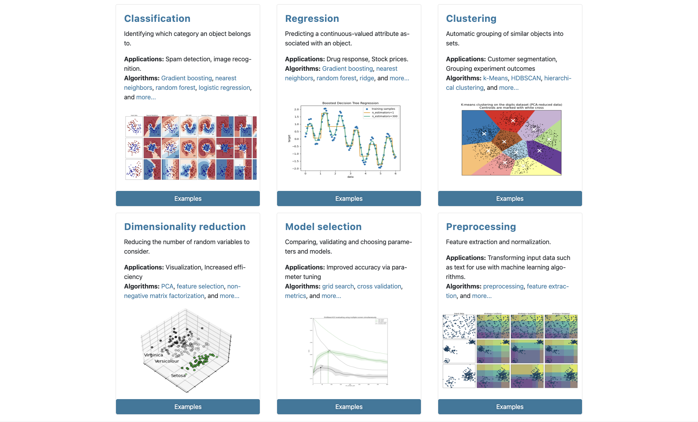
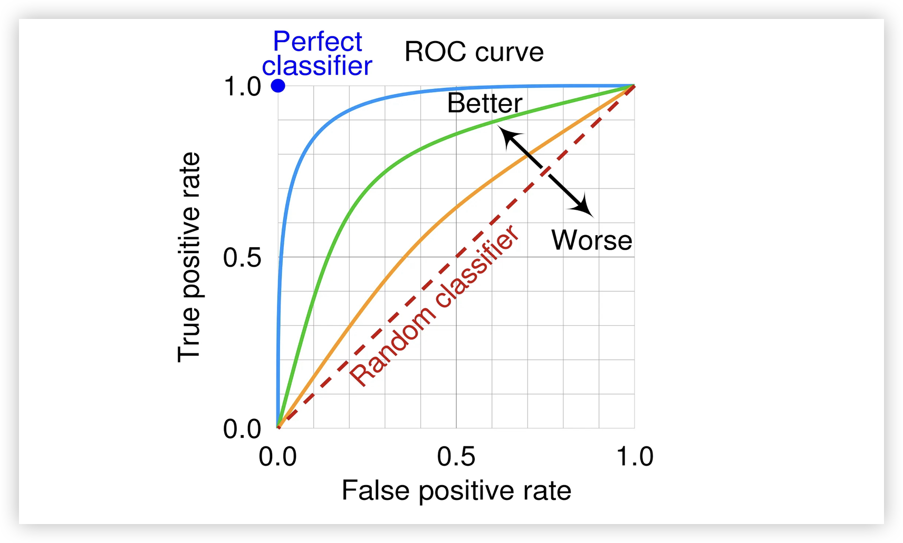
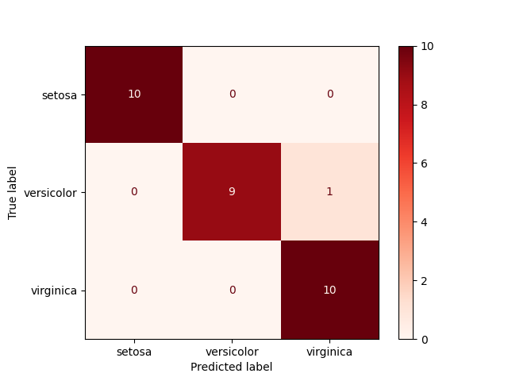
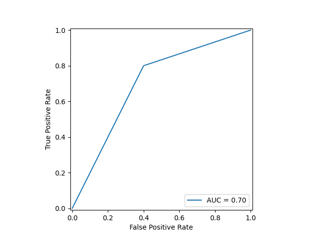
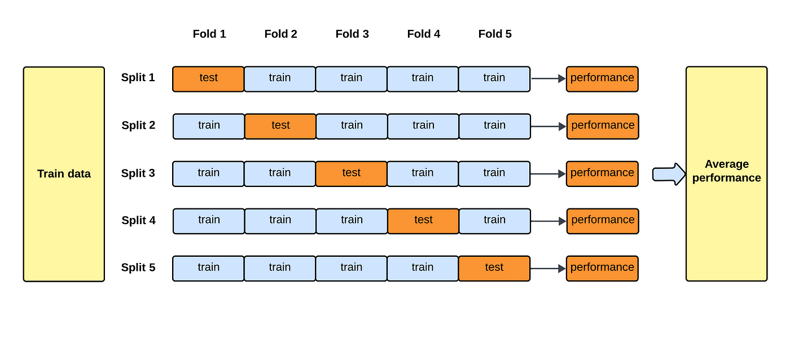

## k-Nearest Neighbors Algorithm

The k-nearest neighbors algorithm (kNN) is a non-parametric statistical method used for classification and regression, proposed by American statisticians Evelyn Fix and Joseph Hodges Jr. in 1951. The principle of the kNN algorithm is to find the $\small{k}$ nearest instances in the historical data to the new input instance, and classify the new instance based on the majority class of those instances or output the new instance's target value. We have already provided a simple demonstration of this algorithm earlier. Unlike mainstream machine learning algorithms, the k-nearest neighbors algorithm has no explicit learning or training process. It uses the simple and intuitive idea of "birds of a feather flock together" to perform classification or regression. The k-nearest neighbors algorithm has two key issues: the first is how to choose the value of $\small{k}$, i.e., how many nearest neighbors to use to determine the class or target value of a new instance; the second is how to determine whether two instances are near or far, which involves the problem of measuring distance.

### Distance Metrics

We can use distance to measure the similarity between two instances in the feature space. Common distance metrics include Minkowski distance, Mahalanobis distance, cosine distance, edit distance, etc. The full name of Minkowski distance is Minkowski Distance. For two $\small{n}$-dimensional vectors $\small{\mathbf{x}=(x_{1}, x_{2}, \cdots, x_{n})}$ and $\small{\mathbf{y}=(y_{1}, y_{2}, \cdots, y_{n})}$, the distance between them can be defined as:

$$
d(\mathbf{x}, \mathbf{y}) = (\sum_{i=1}^{n}{\vert x_{i} - y_{i} \rvert}^{p})^{\frac{1}{p}}
$$

where $\small{p \ge 1}$. Although $\small{p \lt 1}$ can be computed, it no longer strictly satisfies the definition of a distance and is usually not considered a true distance.

When $\small{p = 1}$, the Minkowski distance becomes the **Manhattan distance**:

$$
d(\mathbf{x}, \mathbf{y}) = \sum_{i=1}^{n} \lvert x_{i} - y_{i} \rvert
$$

When $\small{p = 2}$, the Minkowski distance becomes the **Euclidean distance**:

$$
d(\mathbf{x}, \mathbf{y}) = \sqrt{\sum_{i=1}^{n}(x_{i} - y_{i})^{2}}
$$

When $\small{p \to \infty}$, the Minkowski distance becomes the **Chebyshev distance**:

$$
d(\mathbf{x}, \mathbf{y}) = \underset{i}{max}(\lvert x_{i} - y_{i} \rvert)
$$

We will introduce other distance metrics when they are needed. When using the k-nearest neighbors algorithm for classification, our dataset typically consists of numerical data, in which case using Euclidean distance directly is a good choice.


### Dataset Introduction

Next, let us formally introduce an important dataset that we will use frequently going forward — the Iris dataset. The Iris dataset is one of the most famous and classic datasets in the field of machine learning, collected by botanist *Edgar S. Anderson* on the Gaspe Peninsula in Quebec, Canada, and first introduced by British statistician *Ronald A. Fisher* in 1936 in his paper *"The Use of Multiple Measurements in Taxonomic Problems"*. It is widely used for introductory experiments with machine learning algorithms.


The Iris dataset contains 150 samples of 3 types of iris flowers: Iris setosa, Iris versicolor, and Iris virginica, as shown in the figure above, with 50 samples of each type. The sample data includes 4 features and 1 class label. The 4 features are sepal length, sepal width, petal length, and petal width, all expressed as positive numbers in centimeters. The class labels in the dataset have values 0, 1, and 2, corresponding to the three iris types mentioned above.

#### Loading the Dataset

We can load this dataset through the well-known Python machine learning library scikit-learn. Scikit-learn includes various classification, regression, and clustering algorithms, and also provides models such as multi-layer perceptrons, support vector machines, and random forests. It covers everything from data preprocessing, feature engineering to model training, model evaluation, and parameter tuning, as shown in the figure below. We recommend using this library to complete various machine learning operations. The scikit-learn [official website](https://scikit-learn.org/stable/) also provides user guides, API documentation, and examples. Interested readers can visit it on their own.



Since we will use this library in virtually all subsequent lessons, you can install it first using the following command.

```
pip install scikit-learn
```

If you have already opened IPython or Jupyter but have not yet installed scikit-learn, you can install it using the following magic command.

```
%pip install scikit-learn
```

After installation, we can load the Iris dataset and view its description using the following code.

```Python
from sklearn.datasets import load_iris

# Load the Iris dataset
iris = load_iris()
# View the dataset description
print(iris.DESCR)
```

Next, we can obtain the features and labels from the dataset, as shown in the code below.

```python
# Features (150x4 2D array: sepal length, sepal width, petal length, petal width)
X = iris.data
# Labels (1D array of 150 elements with values 0, 1, 2 representing the three iris types)
y = iris.target
```

If you want a more intuitive view of the Iris dataset, you can create a DataFrame object using the features and labels obtained above. Interested readers can try it out on their own.

#### Splitting the Dataset

Typically, we need to split the original data into a training set and a test set. The training set is the data selected for training the model, while the test set is the data reserved for evaluating the model's training results. For the Iris dataset above, we can select 80% of the data (120 samples) as the training set and reserve 20% (30 samples) as the test set. The code below uses NumPy to split the dataset.

```python
# Stack features and labels into the same array
data = np.hstack((X, y.reshape(-1, 1)))
# Shuffle the original data randomly
np.random.shuffle(data)
# Select 80% of the data as the training set
train_size = int(y.size * 0.8)
train, test = data[:train_size], data[train_size:]
X_train, y_train = train[:, :-1], train[:, -1]
X_test, y_test = test[:, :-1], test[:, -1]
```

Of course, a more convenient way to split the dataset is to use scikit-learn's built-in function `train_test_split`. We only need to pass in the features and labels and specify `train_size` or `test_size` to achieve the same operation. The `train_test_split` function returns a 4-tuple, with the four elements representing the training features, test features, training labels, and test labels respectively.

```python
from sklearn.model_selection import train_test_split

X_train, X_test, y_train, y_test = train_test_split(X, y, train_size=0.8, random_state=3)
```

> **Note**: The `random_state` parameter of the `train_test_split` function can be understood as the random seed. If you use the same random seed as me, then our training and test sets will be exactly the same.

### Implementing kNN Classification

Below, we will first implement the kNN algorithm using the basic data science libraries NumPy and SciPy without using scikit-learn. The purpose is to help you better understand the algorithm's principles, and on this basis, appreciate the power of scikit-learn and understand why its classes, functions, and parameters are designed the way they are.

#### NumPy-Based Implementation

The k-nearest neighbors algorithm requires distance computation. Below, we first design a function to calculate the Euclidean distance between two data points, as shown in the code below.

```python
import numpy as np


def euclidean_distance(u, v):
    """Calculate the Euclidean distance between two n-dimensional vectors"""
    return np.sqrt(np.sum(np.abs(u - v) ** 2))
```

Next, we design a function to generate a label for new data based on the labels of its neighbors.

```python
from scipy import stats


def make_label(X_train, y_train, X_one, k):
    """
    Generate a label for new data based on k nearest neighbors in historical data
    :param X_train: features in the training set
    :param y_train: labels in the training set
    :param X_one: features of the sample to be predicted (new data)
    :param k: number of neighbors
    :return: the predicted label for the sample (mode of neighbor labels)
    """
    # Calculate the distance between x and each training sample
    distes = [euclidean_distance(X_one, X_i) for X_i in X_train]
    # Use a single partition to find the indices of the k smallest distances and get corresponding labels
    labels = y_train[np.argpartition(distes, k - 1)[:k]]
    # Get the mode of the labels
    return stats.mode(labels).mode
```

> **Note**: The `np.partition` function can partition an array, placing the k smallest elements on the left side and the n - k larger elements on the right side, similar to performing one partition operation in the quicksort algorithm. The `np.argpartition` function used in the code above places the indices of the k smallest elements on the left side. After the `[:k]` slice operation and fancy indexing on `y_train`, we can obtain the labels corresponding to the k samples closest to the new data. Finally, we use the `mode` function from scipy's stats module to get the mode of the labels and use it as the predicted class label for the new data.

With the above preparation complete, the function for making predictions with k-nearest neighbors is straightforward, as shown in the code below.

```python
def predict_by_knn(X_train, y_train, X_new, k=5):
    """
    KNN algorithm
    :param X_train: features in the training set
    :param y_train: labels in the training set
    :param X_new: array of samples to be predicted
    :param k: number of neighbors (default is 5)
    :return: array of prediction results (labels)
    """
    return np.array([make_label(X_train, y_train, X, k) for X in X_new])
```

We use the Iris dataset training and test sets prepared above to experiment and see if our `predict_by_knn` function works well. In the code below, `y_pred` contains our predicted types for the 30 iris samples. By comparing it with `y_test`, we can see our prediction performance.

```python
y_pred = predict_by_knn(X_train, y_train, X_test)
y_pred == y_test
```

My output is:

```
array([ True,  True,  True,  True,  True,  True,  True,  True,  True,
        True,  True,  True,  True,  True,  True,  True, False,  True,
        True,  True,  True,  True,  True,  True,  True,  True,  True,
        True,  True,  True])
```

There is one `False` in the output, indicating that the predicted label does not match the actual label — an incorrect prediction. This means our prediction accuracy is $\small{\frac{29}{30}}$, or `96.67%`. Of course, if you used a different `random_state` parameter when splitting the training and test sets, the results here may differ from mine.

#### scikit-learn-Based Implementation

Using scikit-learn to implement the kNN algorithm is much simpler. We basically only need to perform three actions to get the desired results, as shown in the code below.

```python
from sklearn.neighbors import KNeighborsClassifier

# Create the model
model = KNeighborsClassifier()
# Train the model
model.fit(X_train, y_train)
# Predict results
y_pred = model.predict(X_test)
```

Let us check the output results to see if they are exactly the same as our hand-written code.

```python
y_pred == y_test
```

Output:

```
array([ True,  True,  True,  True,  True,  True,  True,  True,  True,
        True,  True,  True,  True,  True,  True,  True, False,  True,
        True,  True,  True,  True,  True,  True,  True,  True,  True,
        True,  True,  True])
```

Of course, scikit-learn considers far more things than our hand-written code. For example, if we want to know the model's prediction accuracy, we can use the following function.

```python
model.score(X_test, y_test)
```

Output:

```
0.9666666666666667
```

### Model Evaluation

Of course, evaluating whether a classifier's prediction performance is good should not rely solely on accuracy, because in cases of class imbalance, accuracy can be misleading. For example, if the number of Iris virginica samples in our test data is very small, even if our model cannot identify Iris virginica at all, the model would still show high accuracy. Therefore, we also need to examine precision, recall, F1 score, and other metrics. The **confusion matrix** is a tool for displaying detailed classification model performance, applicable to both binary and multi-class tasks. The confusion matrix for binary classification is shown below.

|      | **Predicted Positive** | **Predicted Negative** |
| ---- | ------------------------- | ------------------------- |
| **Actual Positive** | True Positive (TP) | False Negative (FN) |
| **Actual Negative** | False Positive (FP) | True Negative (TN) |

Let us use an example to illustrate how to use a confusion matrix and calculate evaluation metrics for a classification model. Suppose a medical detection system aims to predict whether a patient has a certain disease, where the "positive" class means "diseased" and the "negative" class means "not diseased." The test results for 1000 samples are shown below.

|      | **Predicted Diseased** | **Predicted Not Diseased** |
| ---- | -------------- | ---------------- |
| **Actually Diseased** | 80 (TP) | 20 (FN) |
| **Actually Not Diseased** | 30 (FP) | 870 (TN) |

1. **Accuracy**.

$$
\text{Accuracy} = \frac{\text{TP} + \text{TN}}{\text{TP} + \text{FP} + \text{FN} + \text{TN}}
$$

In the example above, the model's prediction accuracy is: $\frac{80 + 870}{80 + 30 + 20 + 870} = \frac{950}{1000} = 0.95$.

2. **Precision**. Precision measures the proportion of samples predicted as positive that actually belong to the positive class.

$$
\text{Precesion} = \frac{\text{TP}}{\text{TP} + \text{FP}}
$$

In the example above, the model's prediction precision is: $\frac{80}{80 + 30} = \frac{80}{110} = 0.73$.

3. **Recall**. Recall measures the proportion of actual positive samples that the model correctly predicted as positive, also known as the True Positive Rate.
$$
\text{Recall} = \frac{\text{TP}}{\text{TP} + \text{FN}}
$$

In the example above, the model's prediction recall is: $\frac{80}{80 + 20} = \frac{80}{100} = 0.8$.

4. **F1 Score**. The F1 score is the harmonic mean of precision and recall, seeking a balance between the two, especially useful when there is a trade-off between them.

$$
\text{F1 Score} = \frac{2}{\frac{1}{\text{Precision}} + \frac{1}{\text{Recall}}} = 2 \times \frac{\text{Precision} \times \text{Recall}}{\text{Precesion} + \text{Recall}}
$$

In the example above, the model's F1 score is: $2 \times \frac{0.7273 * 0.8}{0.7273 + 0.8} = 0.76$.

5. **Specificity** and **False Positive Rate (FPR)**. Specificity measures the proportion of actual negative samples that the model correctly predicted as negative, similar to recall but for negative samples.

$$
\text{Specificity} = \frac{\text{TN}}{\text{TN} + \text{FP}} \\\\
\text{FPR} = 1 - \text{Specificity}
$$

In the example above, the model's specificity is: $\frac{870}{870 + 30} = \frac{870}{900} = 0.97$.

6. **ROC** and **AUC**.

    - **ROC** (Receiver Operating Characteristic Curve) plots the relationship between recall and false positive rate, as shown in the figure below.

        

    - **AUC** (Area Under the Curve) is the area under the ROC curve, measuring the model's ability to distinguish between positive and negative classes. The AUC value ranges from $\small[0, 1]$, with values closer to 1 indicating a stronger ability to distinguish between classes. When 0.5 < AUC < 1, our model is better than random guessing, and with proper threshold settings, the classifier has predictive value. When AUC = 0.5, our model is no better than random guessing and has no predictive value. When AUC < 0.5, the model is worse than random guessing, but if we always reverse the prediction, its actual effect would be better than random guessing.

For multi-class problems, both the number of rows and columns in the confusion matrix equal the number of classes, forming a square matrix. That is, if there are $\small{n}$ classes, then the confusion matrix is an $\small{n \times n}$ square matrix. Based on our prediction results for the Iris dataset above, let us first output the actual and predicted values, then construct the corresponding confusion matrix, as shown below.

```python
print(y_test)
print(y_pred)
```

Output:

```
[0 0 0 0 0 2 1 0 2 1 1 0 1 1 2 0 1 2 2 0 2 2 2 1 0 2 2 1 1 1]
[0 0 0 0 0 2 1 0 2 1 1 0 1 1 2 0 2 2 2 0 2 2 2 1 0 2 2 1 1 1]
```

|      | **Predicted Class 0 (Setosa)** | **Predicted Class 1 (Versicolor)** | **Predicted Class 2 (Virginica)** |
| :---- | :---------------: | :---------------: | :---------------: |
| **Actual Class 0 (Setosa)** | 10 | 0 | 0 |
| **Actual Class 1 (Versicolor)** | 0 | 9 | 1 |
| **Actual Class 2 (Virginica)** | 0 | 0 | 10 |


We can use the `confusion_matrix` and `classification_report` functions from scikit-learn to output the confusion matrix and evaluation report, as shown in the code below.

```python
from sklearn.metrics import classification_report, confusion_matrix

# Output the classification model confusion matrix
print('Confusion Matrix: ')
print(confusion_matrix(y_test, y_pred))
# Output the classification model evaluation report
print('Evaluation Report: ')
print(classification_report(y_test, y_pred))
```

Output:

```
Confusion Matrix:
[[10  0  0]
 [ 0  9  1]
 [ 0  0 10]]
Evaluation Report:
              precision    recall  f1-score   support

           0       1.00      1.00      1.00        10
           1       1.00      0.90      0.95        10
           2       0.91      1.00      0.95        10

    accuracy                           0.97        30
   macro avg       0.97      0.97      0.97        30
weighted avg       0.97      0.97      0.97        30
```

If you prefer to visualize the confusion matrix, you can use the following code.

```python
import matplotlib.pyplot as plt
from sklearn.metrics import ConfusionMatrixDisplay

# Create confusion matrix display object
cm_display_obj = ConfusionMatrixDisplay(confusion_matrix(y_test, y_pred), display_labels=iris.target_names)
# Plot and display the confusion matrix
cm_display_obj.plot(cmap=plt.cm.Reds)
plt.show()
```

> **Note**: Here `iris.target_names` contains the English names of the three iris types corresponding to class labels `0`, `1`, and `2`.



For binary classification problems, if you want to plot the ROC curve and display the AUC value, you can use the following code.

```python
from sklearn.metrics import roc_curve, auc
from sklearn.metrics import RocCurveDisplay

# Manually construct a set of actual values and corresponding predicted values
y_test_ex = np.array([0, 0, 0, 1, 1, 0, 1, 1, 1, 0])
y_pred_ex = np.array([1, 0, 0, 1, 1, 0, 1, 1, 0, 1])
# Calculate FPR (False Positive Rate) and TPR (True Positive Rate) using roc_curve
fpr, tpr, _ = roc_curve(y_test_ex, y_pred_ex)
# Calculate AUC value using auc function and plot using RocCurveDisplay
RocCurveDisplay(fpr=fpr, tpr=tpr, roc_auc=auc(fpr, tpr)).plot()
plt.show()
```



### Hyperparameter Tuning

We mentioned earlier that the kNN algorithm has two key issues: distance metric and k value selection. When creating a classifier model using scikit-learn's `KNeighborsClassifier`, we can configure the model's hyperparameters. Here are several important parameters:

1. `n_neighbors`: The number of neighbors, which is the k value in the kNN algorithm.
2. `weights`: Can be `uniform` or `distance`. The former means all samples have equal weight, while the latter means closer samples have higher weight. The default is `uniform`. You can also pass a custom function to determine each sample's weight.
3. `algorithm`: Has four options: `auto`, `ball_tree`, `kd_tree`, and `brute`, with a default of `auto`. `ball_tree` is a tree structure that assigns data points to a hierarchical tree based on sphere partitioning, offering good performance for high-dimensional and sparse data. `kd_tree` is also a tree structure that partitions space into subregions by selecting a dimension for searching, thus avoiding comparison with all neighbors. It works well for low-dimensional and uniformly distributed data but may encounter the curse of dimensionality in high-dimensional space. `auto` automatically selects between `ball_tree` or `kd_tree` based on input data dimensions. `brute` uses a brute-force search algorithm (exhaustive method), and is a simple and effective choice for small datasets.
4. `leaf_size`: When using `ball_tree` or `kd_tree`, this parameter limits the maximum number of samples in leaf nodes of the tree structure, with a default of `30`. This parameter affects tree construction and node search performance.
5. `p`: The `p` value in the Minkowski distance formula, with a default of 2, which computes Euclidean distance.

We can use **Grid Search** and **Cross Validation** to tune the model's hyperparameters, evaluate the model's generalization ability, and improve prediction performance. Grid search exhaustively traverses a given hyperparameter space to find the optimal combination. Cross-validation divides the training set into multiple subsets, performing multiple training and evaluation cycles on different training and validation sets to comprehensively evaluate prediction performance. K-Fold cross-validation is the most commonly used cross-validation method. It divides the dataset into K subsets, selects one subset as the validation set each time while using the remaining K-1 subsets as the training set, repeats the process for each subset, completing K rounds of training and evaluation, and uses the average as the final performance evaluation, as shown in the figure below.



The code below uses scikit-learn's `GridSearchCV` to perform grid search and cross-validation, finding the optimal parameters for applying the kNN algorithm to the Iris dataset.

```python
from sklearn.model_selection import GridSearchCV

# Grid search with cross-validation
gs = GridSearchCV(
    estimator=KNeighborsClassifier(),
    param_grid={
        'n_neighbors': [1, 3, 5, 7, 9, 11, 13, 15],
        'weights': ['uniform', 'distance'],
        'p': [1, 2]
    },
    cv=5
)
gs.fit(X_train, y_train)
```

You can obtain the best parameters and their scores using the following code.

```python
print('Best parameters:', gs.best_params_)
print('Score:', gs.best_score_)
```

Output:

```
Best parameters: {'n_neighbors': 5, 'p': 2, 'weights': 'uniform'}
Score: 0.9666666666666666
```

If you need to use the trained best model for prediction, you can do so as follows.

```python
gs.predict(X_test)
```

### kNN Regression

The kNN algorithm is typically used for classification problems, but it can also be used for regression problems. The basic idea is also to find the k nearest neighbors of a new instance, and then predict the new instance's target value based on these k neighbors' labels (in regression, we usually call them target values). Since we need to predict a numerical value rather than a class label, we typically use the mean or weighted mean of the k neighbors' target values to obtain the prediction for the new instance. Let us return to the example from the previous lesson where we predicted online shopping expenditure from monthly income, and use scikit-learn's `KNeighborsRegressor` to build a regression model. We start with some preparation work, as shown in the code below.

```python
# Monthly income
incomes = np.array([
    9558, 8835, 9313, 14990, 5564, 11227, 11806, 10242, 11999, 11630,
    6906, 13850, 7483, 8090, 9465, 9938, 11414, 3200, 10731, 19880,
    15500, 10343, 11100, 10020, 7587, 6120, 5386, 12038, 13360, 10885,
    17010, 9247, 13050, 6691, 7890, 9070, 16899, 8975, 8650, 9100,
    10990, 9184, 4811, 14890, 11313, 12547, 8300, 12400, 9853, 12890
])
# Monthly online shopping expenditure
outcomes = np.array([
    3171, 2183, 3091, 5928, 182, 4373, 5297, 3788, 5282, 4166,
    1674, 5045, 1617, 1707, 3096, 3407, 4674, 361, 3599, 6584,
    6356, 3859, 4519, 3352, 1634, 1032, 1106, 4951, 5309, 3800,
    5672, 2901, 5439, 1478, 1424, 2777, 5682, 2554, 2117, 2845,
    3867, 2962,  882, 5435, 4174, 4948, 2376, 4987, 3329, 5002
])
X = np.sort(incomes).reshape(-1, 1)  # Sort income and reshape into a 2D array
y = outcomes[np.argsort(incomes)]    # Sort online shopping expenditure by income
```

> **Note**: Even with only one feature, we need to reshape the independent variable into a 2D array because the `fit` method used for model training cannot accept a 1D array as its first parameter. Sorting X and y in advance here is so that when we plot the scatter and line charts later, we can draw them from the smallest to the largest X values.

Next, we create a kNN regression model.

```python
from sklearn.neighbors import KNeighborsRegressor

# Create the model
model = KNeighborsRegressor()
# Train the model
model.fit(X, y)
# Predict results
y_pred = model.predict(X)
```

Above, we directly used all historical data for model training, then plot the following chart to see how well the predictions perform.

```python
# Original data scatter plot
plt.scatter(X, y, color='navy')
# Prediction results line chart
plt.plot(X, y_pred, color='coral')
plt.show()
```


The kNN regression model has high computational complexity and is very sensitive to noisy data, so it may not be a good choice in many situations. Of course, how to evaluate the performance of a regression model will be discussed in subsequent chapters.

### Summary

The kNN algorithm is a simple yet powerful machine learning algorithm, suitable for classification and regression tasks on small datasets. Its advantages include being simple to understand, having no explicit training process, not relying on assumptions about data distributions, and being able to adapt to complex data patterns. However, the kNN algorithm's disadvantages are also quite obvious. The biggest problem lies in computational efficiency, so it may not be the best choice for large datasets. Additionally, kNN is very sensitive to noise, and prediction results depend on the choice of k and whether samples are balanced (whether the number of samples in each class is roughly equal). A k value that is too small may lead to overfitting, a k value that is too large may lead to underfitting, and imbalanced samples may cause class imbalance bias — meaning that if most training samples belong to class A while class B samples are few, KNN is more likely to predict test samples as class A.
