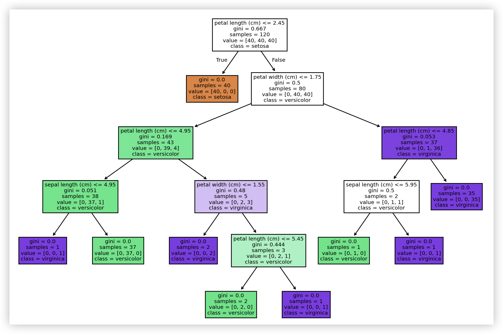
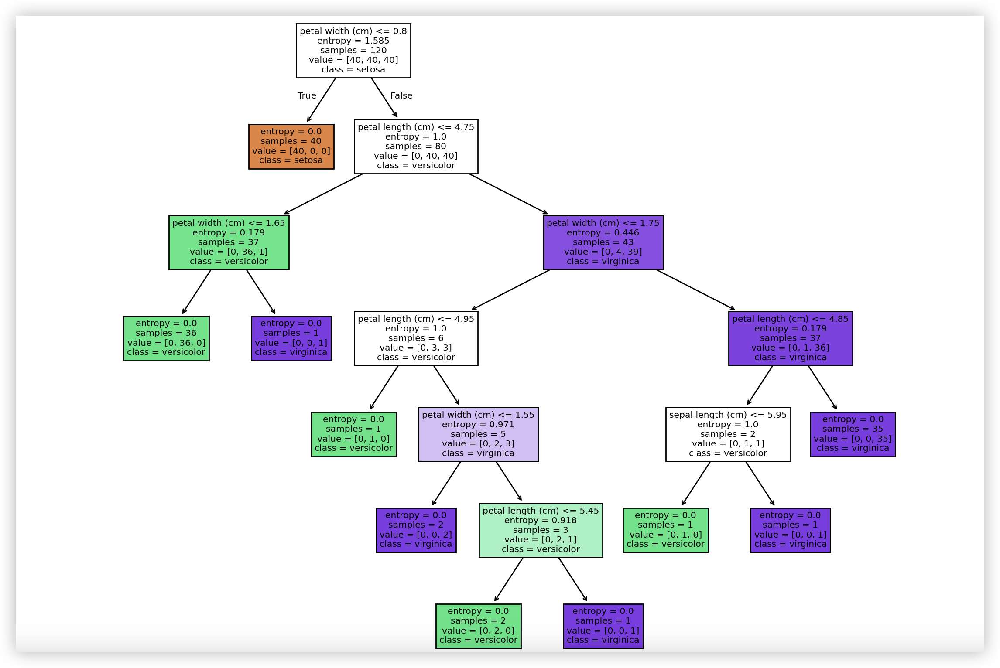

## Decision Trees and Random Forests

A **Decision Tree** is a supervised learning algorithm based on a tree structure that can be used for **classification** and **regression** tasks. It achieves prediction targets by progressively splitting the dataset into different subsets until certain stopping conditions are met. We also use similar methods when making decisions in daily life. For example, a woman's decision-making process for a blind date can be drawn as the following decision tree.


> **Note**: The figure above is only intended to help you understand what a decision tree is. It is not meant to be misleading and does not represent the author's views on love or marriage.

If you have some programming knowledge, you will notice that making predictions with a decision tree is equivalent to executing a series of `if...else...` structures. If you are more familiar with probability theory, the construction of a decision tree can also be viewed as a process of computing conditional probabilities based on the feature space. Nodes in a decision tree can be divided into two types: internal nodes (blue nodes in the figure above) and leaf nodes (red and green nodes in the figure above). Internal nodes correspond to sample feature attribute tests (feature split conditions), while leaf nodes represent decision results (class labels or regression target values). Decision trees can be used to solve both classification and regression problems; in this chapter, we still focus on classification problems.

### Building a Decision Tree

#### Feature Selection

Training a decision tree model has three core steps: feature selection, decision tree construction, and decision tree pruning. Feature selection determines which features to use for making decisions. In the training dataset, each sample may have many attributes, and different attributes have varying levels of importance. The purpose of feature selection is to identify features with higher relevance to the classification result, i.e., features with stronger classification ability, and these features should appear at higher positions in the decision tree. If a feature can make the branch nodes after classification belong to the same class as much as possible, i.e., the node has high **purity**, then that feature has strong classification ability for the dataset. This raises the first question: what criteria should we use to select features with strong classification ability? In decision tree models, there are three methods for selecting features with strong classification ability: **information gain**, **gain ratio**, and **Gini index**.

To explain information gain clearly, we first need to introduce the concept of **information entropy**. In 1948, Claude Shannon introduced the concept of "information entropy" in his famous paper *A Mathematical Theory of Communication*, solving the problem of quantifying information and measuring its value. "Entropy" was originally a concept from thermodynamics, reflecting the degree of disorder in a system — the larger the entropy, the higher the disorder. In information theory, entropy can be seen as a measure of the uncertainty of a random variable (dataset). The larger the entropy, the greater the uncertainty of the variable (data), and the more information is needed to determine it. The lower the entropy, the higher the data purity and the less uncertainty.

For example, in a shooting competition between two contestants A and B, if historical records show that A's win rate is 100%, we can easily accept that A will win. If A's win rate is 50%, then it is difficult to determine who will win. Claude Shannon proposed the following formula to describe this uncertainty:

$$
H(D) = -\sum_{i = 1}^{k} P(x_i)log_2P(x_i)
$$

where $\small{D}$ represents the dataset, $\small{k}$ represents the total number of classes, and $\small{P(x_i)}$ represents the proportion (probability) of the $\small{i}$-th class in the dataset. Using $\small{x_1}$ and $\small{x_2}$ to represent A winning and B winning respectively, it is obvious that when $\small{P(x_1)=0.5}$ and $\small{P(x_2)=0.5}$, $\small{H=1}$, the uncertainty is maximized; when $\small{P(x_1)=1}$ and $\small{P(x_2)=0}$, $\small{H=0}$, the uncertainty is minimized; when $\small{P(x_1)=0.8}$ and $\small{P(x_2)=0.2}$, $\small{H \approx 0.72}$.

Clearly, the more information we know, the less uncertainty there is about the random variable (dataset). This information can be direct information about the random event we want to learn about, or information about other events related to the event we care about. It can be mathematically proven that such related information can also reduce or eliminate uncertainty. For this purpose, we define **conditional entropy**, which represents the uncertainty of dataset $\small{D}$ given feature $\small{A}$. The conditional entropy formula is:

$$
H(D \vert A) = \sum_{v \in A}\frac{\lvert D_{v} \rvert}{\lvert D \rvert}H(D_{v})
$$

In the formula above, we let $\small{v}$ take all possible values of feature $\small{A}$, where $\small{D_{v}}$ represents the subset of samples where feature $\small{A}$ has value $\small{v}$, and $\small{\frac{\lvert D_{v} \rvert}{\lvert D \rvert}}$ represents the weight, i.e., the proportion of samples with feature value $\small{v}$. It can be proven that $\small{H(D) \ge H(D \vert A)}$, meaning that with the additional information of feature $\small{A}$, the uncertainty of dataset $\small{D}$ decreases. Note also the case where equality holds, meaning that gaining information about feature $\small{A}$ does not reduce the uncertainty of $\small{D}$, i.e., the acquired information is unrelated to what we are studying.

With the above groundwork, we can now define **information gain**, which is the degree of reduction in uncertainty of dataset $\small{D}$ after obtaining information about feature $\small{A}$. In other words, information gain is a quantity describing the increase in certainty of a dataset. The larger the information gain of a feature, the stronger its classification ability, and the greater the certainty of the dataset given that feature. Information gain can be intuitively described by the following mathematical formula:

$$
g(D, A) = E(D) - E(D \vert A)
$$

The functions for computing information entropy and information gain are as follows:

```python
import numpy as np


def entropy(y):
    """
    Compute information entropy
    :param y: target values of the dataset
    :return: information entropy
    """
    _, counts = np.unique(y, return_counts=True)
    prob = counts / y.size
    return -np.sum(prob * np.log2(prob))


def info_gain(x, y):
    """
    Compute information gain
    :param x: a given feature
    :param y: target values of the dataset
    :return: information gain
    """
    values, counts = np.unique(x, return_counts=True)
    new_entropy = 0
    for i, value in enumerate(values):
        prob = counts[i] / x.size
        new_entropy += prob * entropy(y[x == value])
    return entropy(y) - new_entropy
```

The classic ID3 algorithm in decision tree algorithms uses information gain for feature selection. We still use the Iris dataset as an example, split it into training and test sets, and compute the original information entropy on the training set as well as the information gain after introducing the four features (sepal length, sepal width, petal length, petal width), as shown in the code below.

```python
from sklearn.datasets import load_iris
from sklearn.model_selection import train_test_split

iris = load_iris()
X, y = iris.data, iris.target
X_train, X_test, y_train, y_test = train_test_split(X, y, train_size=0.8, random_state=3)
print(f'H(D)    = {entropy(y_train)}')
print(f'g(D,A0) = {info_gain(X_train[:, 0], y_train)}')
print(f'g(D,A1) = {info_gain(X_train[:, 1], y_train)}')
print(f'g(D,A2) = {info_gain(X_train[:, 2], y_train)}')
print(f'g(D,A3) = {info_gain(X_train[:, 3], y_train)}')
```

Output:

```
H(D)    = 1.584962500721156
g(D,A0) = 0.9430813063736728
g(D,A1) = 0.5692093930591595
g(D,A2) = 1.4475439590905472
g(D,A3) = 1.4420095891994646
```

> **Note**: If the `random_state` parameter of the `train_test_split` function differs from my code above when splitting the training and test sets, the results here may differ.

From the output above, we can see that petal length (corresponding to `A2` above) has the highest information gain, meaning that using petal length as a feature provides the strongest classification ability and results in the highest purity after classification. It should be noted that when a feature has many possible values, its information gain calculation will tend to be larger, so using information gain for feature selection is biased toward features with more values. To address this issue, we can compute the **gain ratio**, defined as follows:

$$
R(D, A) = \frac{g(D, A)}{E_{A}(D)}
$$

where $\small{E_{A}(D) = -\sum_{i=1}^{n}{\frac{\lvert D_{i} \rvert}{\lvert D \rvert}log_{2}\frac{\lvert D_{i} \rvert}{\lvert D \rvert}}}$, $\small{n}$ represents the number of possible values of feature $\small{A}$. Simply put, $\small{E_{A}(D)}$ is the information entropy of feature $\small{A}$, and the gain ratio is the ratio of feature $\small{A}$'s information gain to feature $\small{A}$'s information entropy. We use the following function to compute the gain ratio, and calling this function outputs the gain ratios for the four features.

```python
def info_gain_ratio(x, y):
    """
    Compute gain ratio
    :param x: a given feature
    :param y: target values of the dataset
    :return: gain ratio
    """
    return info_gain(x, y) / entropy(x)


print(f'R(D,A0) = {info_gain_ratio(X_train[:, 0], y_train)}')
print(f'R(D,A1) = {info_gain_ratio(X_train[:, 1], y_train)}')
print(f'R(D,A2) = {info_gain_ratio(X_train[:, 2], y_train)}')
print(f'R(D,A3) = {info_gain_ratio(X_train[:, 3], y_train)}')
```

Output:

```
R(D,A0) = 0.19687406476459068
R(D,A1) = 0.14319788821311977
R(D,A2) = 0.28837763858461984
R(D,A3) = 0.35550822529855447
```

> **Note**: If the `random_state` parameter of the `train_test_split` function differs from my code above when splitting the training and test sets, the results here may differ.

From the output above, we can see that petal width (corresponding to `A3` above) has the highest gain ratio, meaning that this feature can make a good data split and can serve as the root node for building our decision tree. Of course, building a decision tree involves more than just one split. We can continue computing gain ratios on the split datasets to select new splitting features, repeating this process until certain conditions are met to construct a complete decision tree model. In classic decision tree algorithms, the C4.5 algorithm uses gain ratio for feature selection.

In addition to the information gain and gain ratio discussed above, the **Gini index** is also an excellent feature selection method that can be used to evaluate dataset purity. The Gini index, also called **Gini impurity**, ranges between 0 and 1. Higher dataset purity leads to a Gini index closer to 0, and lower purity leads to a Gini index closer to 1. If a dataset has $\small{n}$ classes and the probability of a sample belonging to the $\small{k}$-th class is $\small{p_{k}}$, then the Gini index of the dataset can be calculated using the following formula:

$$
G(D) = 1 - \sum_{k=1}^{n}{p_{k}}^{2}
$$

For example, in the Iris dataset where the number of samples for all three iris types is 50, the Gini index of the entire dataset is:

$$
G(D) = 1 - [(\frac{1}{3})^{2} + (\frac{1}{3})^{2} + (\frac{1}{3})^{2}] = \frac{2}{3}
$$

If the three iris types have 100, 25, and 25 samples respectively, the Gini index is:

$$
G(D) = 1 - [(\frac{2}{3})^{2} + (\frac{1}{6})^{2} + (\frac{1}{6})^{2}] = \frac{1}{2}
$$

If the three iris types have 140, 5, and 5 samples respectively, the Gini index is:

$$
G(D) = 1 - [(\frac{14}{15})^{2} + (\frac{1}{30})^{2} + (\frac{1}{30})^{2}] = \frac{19}{150}
$$

As we can see, as the dataset purity increases, the Gini index decreases. If dataset $\small{D}$ is split into $\small{k}$ parts based on feature $\small{A}$, then the Gini index given feature $\small{A}$ can be defined as:

$$
G(D, A) = \sum_{i=1}^{k}\frac{\lvert D_{i} \rvert}{\lvert D \rvert}G(D_{i})
$$

Based on the formula above, we can design the following functions to compute the Gini index. You can compare them with the formulas above to see if you understand the code, or call the functions to see which feature of the Iris dataset makes the best split on the original dataset or training set. The CART algorithm in classic decision tree algorithms uses the Gini index for feature selection.

```python
def gini_index(y):
    """
    Compute Gini index
    :param y: target values of the dataset
    :return: Gini index
    """
    _, counts = np.unique(y, return_counts=True)
    return 1 - np.sum((counts / y.size) ** 2)


def gini_with_feature(x, y):
    """
    Compute Gini index given a feature
    :param x: a given feature
    :param y: target values of the dataset
    :return: Gini index given the feature
    """
    values, counts = np.unique(x, return_counts=True)
    gini = 0
    for value in values:
        prob = x[x == value].size / x.size
        gini += prob * gini_index(y[x == value])
    return gini


print(f'G(D)    = {gini_index(y_train)}')
print(f'G(D,A0) = {gini_with_feature(X_train[:, 0], y_train)}')
print(f'G(D,A1) = {gini_with_feature(X_train[:, 1], y_train)}')
print(f'G(D,A2) = {gini_with_feature(X_train[:, 2], y_train)}')
print(f'G(D,A3) = {gini_with_feature(X_train[:, 3], y_train)}')
```

Output:

```
G(D,A0) = 0.29187830687830685
G(D,A1) = 0.44222582972582963
G(D,A2) = 0.06081349206349207
G(D,A3) = 0.06249999999999998
```

#### Data Splitting

Building a decision tree is a recursive process. After selecting a feature using the methods described above, data splitting is performed — simply put, the dataset is split into two or more subsets based on that feature (two subsets correspond to a binary tree, multiple subsets correspond to a multi-way tree), with each subset corresponding to different values of the feature. Then, we repeat the feature selection and data splitting process for each subset until stopping conditions are met. Stopping conditions are very important for the recursive process and also help avoid generating overly complex tree structures. Common stopping conditions include:

1. The tree reaches a preset depth.
2. The number of samples at the current node is less than a preset threshold.
3. All samples at the node belong to the same class.
4. The change in information gain or Gini index falls below a certain threshold.

> **Note**: If you have experience with tree structures, the above process should be easy to understand. For those unfamiliar with recursion, binary trees, or multi-way trees, you can look at any data structures textbook — the related knowledge is not complex, and we will not elaborate further here.

During data splitting, another important issue is handling continuous values and missing values in features. For continuous values, we can iterate through all possible values of a feature to find a split point $\small{x}$ that optimizes the gain ratio or Gini index after splitting. During data splitting, $\small{x}$ divides the data into two subsets $\small{D_{1}}$ and $\small{D_{2}}$, where $\small{D_{1}}$ contains samples with feature values less than or equal to $\small{x}$, and $\small{D_{2}}$ contains samples with feature values greater than $\small{x}$. For missing values, the C4.5 algorithm uses a weighted allocation approach: when a feature is selected for splitting, samples with missing values for that feature are assigned to each subset, but with different weights calculated based on the proportion of that feature across different classes. The CART algorithm typically creates a default branch for each feature when handling missing values. For samples with missing values, CART guides them to the default branch for processing, and when computing the Gini index, CART can choose whether to include samples with missing values in the calculation.

#### Tree Pruning

Pruning a complex decision tree is quite necessary, as it can reduce the complexity of the tree structure while also avoiding the risk of overfitting. Common pruning strategies include:

1. **Post-pruning**. As the name suggests, post-pruning simplifies the tree structure after the decision tree has been fully constructed by evaluating and removing unnecessary branches. The process typically starts from leaf nodes, evaluating each node bottom-up to see whether replacing it with a leaf node (pruning it and its subtree) improves the model's performance (prediction on the validation set). This approach reduces overfitting risk while maintaining good fitting ability, but it is computationally expensive, and without a suitable validation set, the pruning effect may be compromised.
2. **Pre-pruning**. As the name suggests, pre-pruning dynamically decides whether to stop splitting a node during the construction of the decision tree. By evaluating before splitting whether the current node should continue to be split, overly complex trees can be avoided, using the stopping conditions mentioned above. The pre-pruning strategy reduces unnecessary splits during the construction phase, thereby lowering model complexity, but it may risk underfitting because stopping too early may miss potentially important decision rules.

### Implementing a Decision Tree Model

We can use `DecisionTreeClassifier` and `DecisionTreeRegressor` from scikit-learn's `tree` module to implement decision trees for classification and regression. Here we focus on the decision tree model for classification problems. Interested readers can explore the decision tree model for regression problems on their own.

```python
from sklearn.tree import DecisionTreeClassifier

# Create the model
model = DecisionTreeClassifier()
# Train the model
model.fit(X_train, y_train)
# Predict results
y_pred = model.predict(X_test)
```

Below, we compare the predicted and actual values and look at the model evaluation report.

```python
from sklearn.metrics import classification_report

print(y_test)
print(y_pred)
print(classification_report(y_test, y_pred))
```

Output:

```
[0 0 0 0 0 2 1 0 2 1 1 0 1 1 2 0 1 2 2 0 2 2 2 1 0 2 2 1 1 1]
[0 0 0 0 0 2 1 0 2 1 1 0 1 1 2 0 1 2 2 0 2 2 2 1 0 2 2 1 2 1]
              precision    recall  f1-score   support

           0       1.00      1.00      1.00        10
           1       1.00      0.90      0.95        10
           2       0.91      1.00      0.95        10

    accuracy                           0.97        30
   macro avg       0.97      0.97      0.97        30
weighted avg       0.97      0.97      0.97        30
```

> **Note**: The output you see when running the code above may differ from mine, because the `DecisionTreeClassifier` has a `random_state` parameter that controls randomness. Providing a fixed integer value for this parameter ensures that your results are reproducible.

We can visualize the decision tree with the following code. The visual representation should help you better understand the decision tree model.

```python
import matplotlib.pyplot as plt
from sklearn.tree import plot_tree

plt.figure(figsize=(12, 10))
plot_tree(
    decision_tree=model,               # Decision tree model
    feature_names=iris.feature_names,  # Feature names
    class_names=iris.target_names,     # Label names
    filled=True                        # Fill with colors
)
plt.show()
```

Output:



> **Note**: The Gini index of the root node in the figure above is exactly the same as the Gini index of the dataset we calculated earlier.

Let us adjust the parameters of `DecisionTreeClassifier`, recreate the decision tree, and visualize the model.

```python
# Create the model
model = DecisionTreeClassifier(
    criterion='entropy',
    ccp_alpha=0.01,

)
# Train the model
model.fit(X_train, y_train)
# Visualization
plt.figure(figsize=(12, 10))
plot_tree(
    decision_tree=model,               # Decision tree model
    feature_names=iris.feature_names,  # Feature names
    class_names=iris.target_names,     # Label names
    filled=True                        # Fill with colors
)
plt.show()
```

Output:



> **Note**: The information entropy of the root node in the figure above is exactly the same as the information entropy of the dataset we calculated earlier.

As we can see, different parameters when creating the `DecisionTreeClassifier` object produce different decision trees. The constructor parameters of `DecisionTreeClassifier` are the hyperparameters of the decision tree model, and several particularly important ones include:

1. `criterion`: The criterion for feature selection (data split quality evaluation). Options are `'gini'` or `'entropy'` — the former represents the Gini index and is the default, while the latter represents information gain.
2. `max_depth`: Maximum depth of the tree, default is `None`. If this parameter is not set, there is a risk of overfitting.
3. `min_samples_split`: Minimum number of samples required to split an internal node, default is `2`. This can be set as an integer for the minimum number of samples, or as a float for the proportion of total samples.
4. `min_samples_leaf`: Minimum number of samples required at a leaf node, default is `1`. Setting this to a larger value can smooth the model and reduce overfitting risk. This parameter can also be set as an integer or float, with the same logic.
5. `max_features`: Number of features to consider for the best split, default is `None`. This can be set as an integer for a fixed number of features; as a float for a proportion of features; or as a string — `'auto'` and `'sqrt'` mean taking the square root of the total number of features, while `'log2'` means taking the logarithm of the total number of features.
6. `class_weight`: Specifies class weights for handling class imbalance, default is `None`. You can manually set each class's weight using a dictionary, or use `'balanced'` to let the model adjust automatically.
7. `splitter`: Strategy for choosing the split at each node, default is `'best'` for the best split, with `'random'` as another option for random splitting.
8. `max_leaf_nodes`: Limits the maximum number of leaf nodes, preventing overly complex tree structures.
9. `min_impurity_decrease`: Minimum impurity decrease required for a node to be split. A node will only be split if the impurity decrease exceeds this value.
10. `ccp_alpha`: The $\small{\alpha}$ parameter value in cost-complexity pruning. This controls the $\small{\alpha}$ value in the cost-complexity formula for post-pruning. Smaller $\small{\alpha}$ values allow more complex trees, while larger $\small{\alpha}$ values favor simpler trees. By adjusting $\small{\alpha}$, you can find the optimal balance between complexity and error.

We can use grid search and cross-validation as discussed earlier to tune the hyperparameters. Interested readers can refer to the code below.

```python
from sklearn.model_selection import GridSearchCV

gs = GridSearchCV(
    estimator=DecisionTreeClassifier(),
    param_grid={
        'criterion': ['gini', 'entropy'],
        'max_depth': np.arange(5, 10),
        'max_features': [None, 'sqrt', 'log2'],
        'min_samples_leaf': np.arange(1, 11),
        'max_leaf_nodes': np.arange(5, 15)
    },
    cv=5
)
gs.fit(X_train, y_train)
```

### Random Forest Overview

Random forest is an ensemble learning algorithm based on decision trees. Ensemble learning improves overall model performance by combining the prediction results of multiple models. Its core idea is that a combination of multiple models is often more effective than a single model, as different models capture different features in the data, thereby reducing overfitting risk (improving generalization ability). Random forest builds multiple decision trees and combines their prediction results through voting (classification) or averaging (regression) to improve model accuracy and robustness, as shown in the figure below.


The basic workflow of random forest is as follows:

1. Bootstrap Sampling: Randomly sample (with replacement) from the original training dataset to form multiple different subsets, each used to train one decision tree.
2. Build Decision Trees: For each tree, when performing node splitting, instead of considering all features, a random subset of features is selected for data splitting. This approach increases model diversity and reduces correlation between trees.
3. Ensemble Learning: For classification tasks, random forest determines the final classification result through voting (majority vote); for regression tasks, the average of each tree's prediction is typically used as the final result.

The main advantages of random forest include:

1. Effectively improves model accuracy by ensembling multiple decision trees.
2. Due to the introduced randomness, random forest is typically less prone to overfitting than a single decision tree.
3. Random forest can provide feature importance scores, helping to understand the model.
4. Capable of handling large-scale datasets and high-dimensional data.

Of course, because multiple decision trees need to be built, random forest models are typically more complex, consuming more computational resources, memory, and time during training. We can construct a random forest model using the `RandomForestClassifier` class from scikit-learn's `ensemble` module. Here we still use grid search with cross-validation to tune hyperparameters, as shown in the code below.

```python
from sklearn.ensemble import RandomForestClassifier

gs = GridSearchCV(
    estimator=RandomForestClassifier(n_jobs=-1),
    param_grid={
        'n_estimators': [50, 100, 150],
        'criterion': ['gini', 'entropy'],
        'max_depth': np.arange(5, 10),
        'max_features': ['sqrt', 'log2'],
        'min_samples_leaf': np.arange(1, 11),
        'max_leaf_nodes': np.arange(5, 15)
    },
    cv=5
)
gs.fit(X_train, y_train)
```

> **Tip**: The code above may take a very long time to run.

Many of the random forest model's hyperparameters are similar to those of decision trees. The following hyperparameters need special attention:

1. `estimator`: The number of trees in the forest — simply put, how many decision trees are used to construct the forest. More trees generally lead to better prediction performance but also increase computational cost.
2. `boostrap`: Whether to use Bootstrap sampling, default is `True`, meaning samples are drawn with replacement when building each tree.
3. `n_jobs`: Number of tasks for parallel execution, default is `None`, meaning a single processor core is used. Setting it to `-1` uses all available processor cores.

### Summary

Decision trees are simple, effective, and easy-to-understand predictive models suitable for classification and regression tasks, but they are prone to overfitting and sensitive to noisy data. Random forests improve generalization ability and are insensitive to noisy data by ensembling multiple decision trees, making them suitable for solving complex problems. In practice, you can choose the appropriate model based on the specific scenario and tune the relevant hyperparameters for the best results. A comparison of the two is shown in the table below:

| **Attribute**         | **Decision Tree**           | **Random Forest**       |
| ---------------- | -------------------- | ------------------ |
| **Model Complexity**   | Simple                 | More Complex             |
| **Overfitting Resistance** | Poor                   | Strong                 |
| **Computational Efficiency**     | High                   | Lower               |
| **Result Stability**   | Easily affected by individual data changes | Stable               |
| **Use Cases**     | Less data, simple problems   | More data, complex problems |
