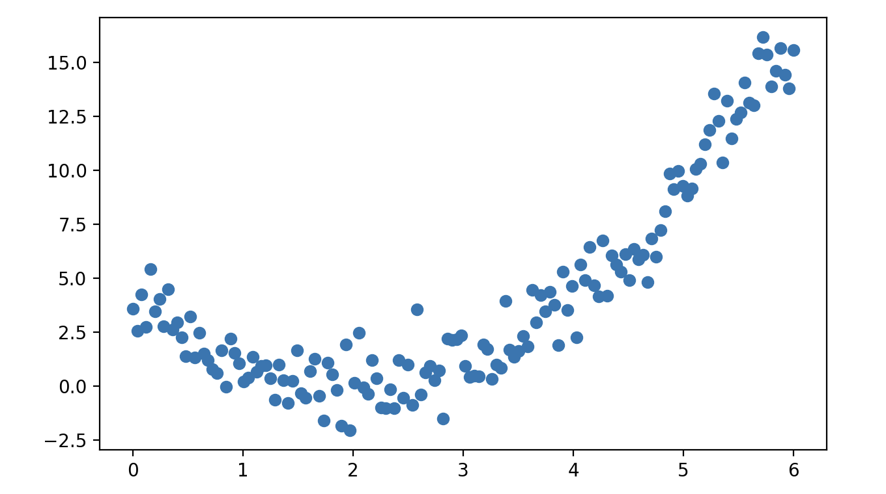

## Regression Models

Regression models are a fundamental type of model in machine learning and statistics, used for predicting continuous output variables. Simply put, given a set of input variables (independent variables) and corresponding output variables (dependent variables), regression models aim to find the mapping relationship between input and output variables. Although the form of a regression model may be relatively simple, it encompasses the most essential modeling ideas in machine learning. Typically, we build regression models with two main objectives:

1. **Describe relationships between data**. We mentioned earlier that **the key to machine learning is learning how to map from features to target values through historical data**. This process does not require us to set any rules in advance; instead, the machine learns by studying historical data. Regression models help us express the relationship between inputs and outputs through a model.
2. **Make predictions on unknown data**. Through the learned mapping relationship, the model can make predictions on new input data.

Regression models have extremely wide applications. Here are a few specific examples:

1. **Retail industry**. Amazon, the world's largest e-commerce platform, creates regression models to predict the demand for different products over a future period based on features such as historical sales volume, product attributes (price, discount, brand, category, etc.), time features (season, workday, holiday, etc.), and external factors (weather, social media, etc.). During promotional campaigns, multivariate regression combined with interaction terms is used to analyze the impact of promotions on sales.
2. **Automotive industry**. To optimize battery charging strategies, extend battery lifespan, and provide more accurate battery level warnings for electric vehicle users, Tesla uses regression models to predict the remaining battery lifespan through features such as battery charge-discharge cycles, ambient temperature, depth of discharge, and battery physical parameters.
3. **Real estate industry**. Zillow, the largest online real estate platform in the United States, once used regression models to help users estimate housing values, predicting market prices based on house area, age, geographic location, house type, community safety rating, school ratings, etc.

### Classification of Regression Models

Based on model complexity and assumptions, regression models can be classified into the following categories:

1. **Linear Regression**: Assumes a linear relationship between input and output variables.

Simple linear regression: builds a model of the linear relationship between one dependent variable and a single independent variable.

$$
y = \beta_0 + \beta_1 x + \varepsilon
$$

Here, $\small{y}$ is the target variable (dependent variable), $\small{x}$ is the input variable (independent variable), $\small{\beta_{0}}$ is the intercept representing the predicted value when $\small{x=0}$, $\small{\beta_{1}}$ is the regression coefficient (slope) representing the magnitude of the impact of the input variable on the output variable, and $\small{\varepsilon}$ is the error term representing random noise or unexplainable parts of the data.

Multiple linear regression: builds a model of the linear relationship between one dependent variable and multiple independent variables.

$$
y = \beta_{0} + \beta_{1} x_{1} + \beta_{2} x_{2} + \cdots + \beta_{n} x_{n} + \varepsilon
$$

The formula above can also be simplified using vector notation as:

$$
y = \mathbf{x}^{T} \mathbf{\beta} + \varepsilon
$$

Here, $\small{\mathbf{x} = [1, x_{1}, x_{2}, \dots, x_{n}]^{T}}$ is the input vector including the intercept, $\small{\mathbf{\beta} = [\beta_{0}, \beta_{1}, \beta_{2}, \dots, \beta_{n}]^{T}}$ is the model parameters (including intercept $\small{\beta_{0}}$ and regression coefficients $\small{\beta_{1}, \beta_{2}, \cdots, \beta_{n}}$), and $\small{\varepsilon}$ is the error term.

2. **Polynomial Regression**: Introduces higher-order features to enable the model to fit more complex nonlinear relationships. It is an extension of linear models because the solution for parameter $\small{\beta}$ is still in linear form, such as the following quadratic relationship:

$$
y = \beta_{0} + \beta_{1} x + \beta_{2} x^{2} + \varepsilon
$$

3. **Nonlinear Regression**: Completely abandons the linear assumption, and the model form can be any nonlinear function.

4. **Ridge Regression**, **Lasso Regression**, **Elastic Net Regression**: Add regularization terms on top of linear regression, used to handle overfitting, multicollinearity, and feature selection problems.

5. **Logistic Regression**: Although the name contains "regression," logistic regression is actually a model for classification problems. It maps the linearly combined input values to the interval $\small{(0, 1)}$ through the Sigmoid function, representing classification probability, suitable for binary classification problems; it can also be extended to Softmax regression to solve multi-class classification problems.

$$
P(y=1 \vert x) = \frac{1}{1 + e^{-(\beta_{0} + \beta_{1} x_{1} + \cdots + \beta_{n} x_{n})}}
$$

### Computing Regression Coefficients

The key to building a regression model is finding the optimal regression coefficients $\small{\mathbf{\beta}}$. The optimal regression coefficients are the model parameters that achieve the best fit to the data, i.e., those that minimize the difference between the model's predicted values $\small{\hat{y_{i}}}$ and the actual observed values $\small{y_{i}}$. To this end, we first define the following loss function.

$$
L(\mathbf{\beta}) = \sum_{i=1}^{m}(y_{i} - \hat{y_{i}})^{2}
$$

Here, $\small{m}$ represents the sample size. Substituting the regression model, we get:

$$
L(\mathbf{\beta}) = \sum_{i=1}^{m}(y_{i} - \mathbf{x}_{i}^{T}\mathbf{\beta})^{2}
$$

In matrix form:

$$
L(\mathbf{\beta}) = (\mathbf{y} - \mathbf{X\beta})^{T}(\mathbf{y} - \mathbf{X\beta})
$$

Here, $\mathbf{y}$ is the vector of target values with size $\small{m \times 1}$, $\mathbf{X}$ is the feature matrix with size $\small{m \times n}$, and $\small{\mathbf{\beta}}$ is the vector of regression coefficients with size $\small{n \times 1}$.

By minimizing the loss function $\small{L(\mathbf{\beta})}$, we can obtain the analytical solution of the linear regression model. Taking the derivative of $\small{L(\mathbf{\beta})}$ and setting it to 0:

$$
\frac{\partial{L(\mathbf{\beta})}}{\partial{\mathbf{\beta}}} = -2\mathbf{X}^{T}(\mathbf{y} - \mathbf{X\beta}) = 0
$$

Rearranging:

$$
\mathbf{\beta} = (\mathbf{X}^{T}\mathbf{X})^{-1}\mathbf{X}^{T}\mathbf{y}
$$

For cases where the matrix $\small{\mathbf{X}^{T}\mathbf{X}}$ is not full rank, we can add a regularization term to make the matrix invertible, as shown below. This is the analytical solution for linear regression.

$$
\mathbf{\beta} = (\mathbf{X}^{T}\mathbf{X} + \mathbf{\lambda \mit{I}})^{-1}\mathbf{X}^{T}\mathbf{y}
$$

> **Note**: If you don't understand the regularization mentioned here, you can put it aside for now. We will discuss this topic later.

The method above is suitable for small-scale datasets. When the data volume is small (with few samples and features), the computational efficiency is not a problem. For large-scale datasets or more complex optimization problems, we can use **gradient descent**, which iteratively updates parameters to gradually approach the optimal solution. The goal of gradient descent is also to minimize the loss function. This method updates parameters by computing the gradient direction. The gradient is a vector containing the partial derivatives of the objective function with respect to each parameter. For the loss function $\small{L(\mathbf{\beta})}$ above, the gradient can be expressed as:

$$
\nabla L(\mathbf{\beta}) = \left[ \frac{\partial{L}}{\partial{\beta_{1}}},  \frac{\partial{L}}{\partial{\beta_{2}}}, \cdots,  \frac{\partial{L}}{\partial{\beta_{n}}} \right]
$$

Gradient descent updates parameters $\small{\mathbf{\beta}}$ through the following update rule:

$$
\mathbf{\beta}^{\prime} = \mathbf{\beta} - \alpha \nabla L(\mathbf{\beta}) \\\\
\mathbf{\beta} = \mathbf{\beta^{\prime}}
$$

Here, $\small{\alpha}$ is the learning rate (step size), typically a small positive number used to control the magnitude of each update. If the learning rate $\small{\alpha}$ is chosen appropriately, gradient descent will converge to a local minimum of the objective function. If the learning rate is too large, it may cause oscillation without convergence; if the learning rate is too small, convergence will be slow and require more iterations.

### New Dataset Introduction

The Iris dataset introduced earlier is not suitable for explaining regression models, so we introduce another classic dataset: the Auto MPG dataset. The Auto MPG dataset was originally provided by the American Automobile Association. We can use this dataset to predict vehicle fuel efficiency, i.e., Miles Per Gallon (MPG). Note that scikit-learn does not have this dataset built in. We can download the dataset directly from the [UCI Machine Learning Repository](https://archive.ics.uci.edu/dataset/9/auto+mpg) website, or load it online by running the following code.

```python
import ssl
import pandas as pd

ssl._create_default_https_context = ssl._create_unverified_context
df = pd.read_csv('https://archive.ics.uci.edu/static/public/9/data.csv')
df.info()
```

Output:

```
<class 'pandas.core.frame.DataFrame'>
RangeIndex: 398 entries, 0 to 397
Data columns (total 9 columns):
 #   Column        Non-Null Count  Dtype
---  ------        --------------  -----
 0   car_name      398 non-null    object
 1   cylinders     398 non-null    int64
 2   displacement  398 non-null    float64
 3   horsepower    392 non-null    float64
 4   weight        398 non-null    int64
 5   acceleration  398 non-null    float64
 6   model_year    398 non-null    int64
 7   origin        398 non-null    int64
 8   mpg           398 non-null    float64
dtypes: float64(4), int64(4), object(1)
memory usage: 28.1+ KB
```

Based on the output above, let us briefly introduce the nine attributes of the dataset. The first eight are input variables (the first one is not used for now), and the last one is the output variable. Details are shown in the table below.

| Attribute Name | Description                                                  |
| -------------- | ------------------------------------------------------------ |
| *car_name*     | Car name, string; this attribute is not helpful for modeling at this point |
| *cylinders*    | Number of cylinders, integer                                 |
| *displacement* | Engine displacement (cubic inches), float                    |
| *horsepower*   | Horsepower, float; has missing values that need pre-processing |
| *weight*       | Car weight (pounds), integer                                 |
| *acceleration* | Acceleration (time to go from 0 to 60 mph), float            |
| *model_year*   | Model year (1970-1982), using two-digit year format          |
| *origin*       | Car origin (1 = USA, 2 = Europe, 3 = Japan); `1`, `2`, `3` here should be treated as three categories rather than integers |
| *mpg*          | Vehicle fuel efficiency, miles per gallon (target variable)  |

We first remove the `car_name` attribute which is not needed for now, then use the `DataFrame` object's `corr` method to check whether there is a correlation between the input variables (features) and the output variable (target value). Through correlation analysis, we can select features with strong correlations and remove features with weak correlations to the target value, which helps reduce model complexity and the risk of overfitting. In multiple regression, multicollinearity (i.e., high correlation among input variables) may affect the estimation of regression coefficients, leading to model instability. This can be detected by computing the correlation between features and the Variance Inflation Factor (VIF).

```python
# Drop the specified column
df.drop(columns=['car_name'], inplace=True)
# Compute the correlation coefficient matrix
df.corr()
```

> **Note**: The `DataFrame` object's `corr` method computes the Pearson correlation coefficient by default. The Pearson correlation coefficient is suitable for continuous values from a normal population. For determining the correlation of ordinal data, you can compute Spearman's rank correlation or Kendall's coefficient by changing the `method` parameter to `spearman` or `kendall`. Of course, continuous values can also be converted to ordinal data through binning and then tested for correlation.

Before using this dataset for modeling, we need to do some preparation work: first handle the missing values in the `horsepower` field, then convert the `origin` field to **one-hot encoding**. One-hot encoding is a common encoding method for handling categorical variables. Typically, categorical data (such as gender, color, season, etc.) cannot be directly input into machine learning models for training because most algorithms can only handle numerical data. One-hot encoding converts each categorical variable into several new binary features (`0` or `1`) to represent them, thus allowing these variables to be input into machine learning models. Suppose we have a feature column called "color" with possible values `red`, `green`, and `blue`. We can convert it into three binary features through one-hot encoding, as shown in the table below:

| Red  | Green | Blue |
| :--: | :--: | :--: |
| 1    | 0    | 0    |
| 0    | 1    | 0    |
| 0    | 0    | 1    |
| 0    | 1    | 0    |
| 1    | 0    | 0    |

> **Note**: We can also keep only the green and blue columns. If both columns have a value of `0`, then the color is red.

The one-hot encoding method is simple and intuitive, easy to understand and implement. It is very effective for unordered categories because it does not introduce any spurious ordering relationships. The processed data type is numerical, which many machine learning algorithms can handle well. Of course, if a categorical feature has a large number of different category values, one-hot encoding will generate a large number of new features, which may significantly increase data dimensionality, affecting computational performance and storage efficiency, especially when there are many sparse categories in the data.

The following code implements data preprocessing.

```python
# Drop samples with missing values
df.dropna(inplace=True)
# Convert the origin field to categorical type
df['origin'] = df['origin'].astype('category')
# Convert the origin field to one-hot encoding
df = pd.get_dummies(df, columns=['origin'], drop_first=True)
df
```

Output:

```
     cylinders  displacement  horsepower  weight  ...  model_year   mpg  origin_2  origin_3
0            8         307.0       130.0    3504  ...          70  18.0     False     False
1            8         350.0       165.0    3693  ...          70  15.0     False     False
2            8         318.0       150.0    3436  ...          70  18.0     False     False
3            8         304.0       150.0    3433  ...          70  16.0     False     False
4            8         302.0       140.0    3449  ...          70  17.0     False     False
..         ...           ...         ...     ...  ...         ...   ...       ...       ...
393          4         140.0        86.0    2790  ...          82  27.0     False     False
394          4          97.0        52.0    2130  ...          82  44.0      True     False
395          4         135.0        84.0    2295  ...          82  32.0     False     False
396          4         120.0        79.0    2625  ...          82  28.0     False     False
397          4         119.0        82.0    2720  ...          82  31.0     False     False

[392 rows x 9 columns]
```

> **Note**: Above, we used pandas' `get_dummies` function to convert the `origin` column to one-hot encoding. Since the `drop_first` parameter was set to `True`, the original values `1`, `2`, `3` only retained two columns, named `origin_2` and `origin_3`. The `OneHotEncoder` from scikit-learn's `preprocessing` module also supports converting categorical features to one-hot encoding.

Next, we still split the dataset into training and test sets, as shown below.

```python
from sklearn.model_selection import train_test_split

X, y = df.drop(columns='mpg').values, df['mpg'].values
X_train, X_test, y_train, y_test = train_test_split(X, y, train_size=0.8, random_state=3)
```

### Linear Regression Code Implementation

We first use `LinearRegression` from scikit-learn's `linear_model` module to create a linear regression model. `LinearRegression` uses the least squares method to compute the regression model parameters, as shown below.

```python
from sklearn.linear_model import LinearRegression

model = LinearRegression()
model.fit(X_train, y_train)
y_pred = model.predict(X_test)
```

If you want to view the linear regression model parameters (regression coefficients and intercept), you can do so with the following code.

```python
print('Regression coefficients:', model.coef_)
print('Intercept:', model.intercept_)
```

Output:

```
Regression coefficients: [-0.70865621  0.03138774 -0.03034065 -0.0064137   0.06224274  0.82866534
  3.20888265  3.68252848]
Intercept: -21.685482718950933
```

### Evaluation of Regression Models

How well a regression model performs in prediction can be assessed through the following metrics.

1. Mean Squared Error (MSE). MSE is one of the most commonly used evaluation metrics for regression models, defined as the average of the squared differences between predicted and actual values.

$$
\text{MSE} = \frac{1}{m} \sum_{i=1}^{m}(y_{i} - \hat{y_{i}})^{2}
$$

2. Root Mean Squared Error (RMSE). RMSE is the square root of MSE, used to more intuitively measure the actual scale of the error (units are consistent with the target variable).

$$
\text{RMSE} = \sqrt{\text{MSE}} = \sqrt{\frac{1}{m} \sum_{i=1}^{m}(y_{i} - \hat{y_{i}})^{2}}
$$

3. Mean Absolute Error (MAE). MAE is another commonly used error metric, defined as the average of the absolute differences between predicted and actual values.

$$
\text{MAE} = \frac{1}{m} \sum_{i=1}^{m} \lvert y_{i} - \hat{y_{i}} \rvert
$$

4. Coefficient of Determination (R-Squared, $\small{R^{2}}$). $\small{R^{2}}$ is a relative metric used to measure how well the model fits the data. The closer its value is to 1, the better. The formula for $\small{R^{2}}$ is:

$$
R^{2} = 1 - \frac{SS_{res}}{{SS}_{tot}}
$$

Here, $\small{SS_{res} = \sum_{i=1}^{m}(y_{i} - \hat{y_{i}})^{2}}$ is the residual sum of squares; $\small{SS_{tot} = \sum_{i=1}^{m} (y_{i} - \bar{y})^{2}}$ is the total sum of squares, as shown in the figure below.


In the figure above, the sum of areas of the red squares on the left is the total sum of squares, and the sum of areas of the blue squares on the right is the residual sum of squares. Obviously, the better the model fits, the closer the ratio of residual sum of squares to total sum of squares is to 0, and the closer $\small{R^{2}}$ is to 1. Typically, when $\small{R^{2} \ge 0.8}$, we consider the model to have a good fit.

We can use functions encapsulated in scikit-learn to compute the mean squared error, mean absolute error, and $\small{R^{2}}$ values, as shown below.

```python
from sklearn.metrics import mean_absolute_error, mean_squared_error, r2_score

mse = mean_squared_error(y_test, y_pred)
mae = mean_absolute_error(y_test, y_pred)
r2 = r2_score(y_test, y_pred)

print(f'Mean Squared Error: {mse:.4f}')
print(f'Mean Absolute Error: {mae:.4f}')
print(f'Coefficient of Determination: {r2:.4f}')
```

Output:

```
Mean Squared Error: 13.1215
Mean Absolute Error: 2.8571
Coefficient of Determination: 0.7848
```

### Introducing Regularization Terms

Ridge regression adds an $\small{L2}$ regularization term on top of linear regression, aimed at preventing model overfitting, especially when there are many features or multicollinearity exists among features. The loss function for ridge regression is as follows:

$$
L(\beta) = \sum_{i=1}^{m}{(y_{i} - \hat{y_{i}})^{2}} + \lambda \cdot \sum_{j=1}^{n}{\beta_{j}^{2}}
$$

Here, the $\small{L2}$ regularization term $\small{\lambda \sum_{j=1}^{n} \beta_{j}^{2}}$ penalizes large regression coefficients, effectively shrinking their magnitude, but without setting coefficients to 0 (i.e., it does not perform feature selection). Ridge regression can be implemented using the `Ridge` class from scikit-learn's `linear_model` module, as shown below.

```python
from sklearn.linear_model import Ridge

model = Ridge()
model.fit(X_train, y_train)
y_pred = model.predict(X_test)
print('Regression coefficients:', model.coef_)
print('Intercept:', model.intercept_)
mse = mean_squared_error(y_test, y_pred)
r2 = r2_score(y_test, y_pred)
print(f'Mean Squared Error: {mse:.4f}')
print(f'Coefficient of Determination: {r2:.4f}')
```

Output:

```
Regression coefficients: [-0.68868217  0.03023126 -0.0291811  -0.00642523  0.06312298  0.82583962
  3.04105754  3.49988826]
Intercept: -21.390402697674855
Mean Squared Error: 12.9604
Coefficient of Determination: 0.7874
```

Lasso regression introduces an $\small{L1}$ regularization term, which not only prevents overfitting but also has the function of feature selection, making it particularly suitable for high-dimensional data. The loss function for lasso regression is as follows:

$$
L(\mathbf{\beta}) = \sum_{i=1}^{m}{(y_{i} - \hat{y_i})^{2}} + \lambda \cdot \sum_{j=1}^{n}{\lvert \beta_{j} \rvert}
$$

Here, the $\small{L1}$ regularization term $\small{\lambda \sum_{j=1}^{n} \lvert \beta_{j} \rvert}$ shrinks some unimportant regression coefficients to 0, thereby achieving feature selection. Lasso regression can be implemented using the `Lasso` class from scikit-learn's `linear_model` module, as shown below.

```python
from sklearn.linear_model import Lasso

model = Lasso()
model.fit(X_train, y_train)
y_pred = model.predict(X_test)
print('Regression coefficients:', model.coef_)
print('Intercept:', model.intercept_)
mse = mean_squared_error(y_test, y_pred)
r2 = r2_score(y_test, y_pred)
print(f'Mean Squared Error: {mse:.4f}')
print(f'Coefficient of Determination: {r2:.4f}')
```

Output:

```
Regression coefficients: [-0.00000000e+00  4.46821248e-04 -1.22830326e-02 -6.29725191e-03
  0.00000000e+00  6.91590631e-01  0.00000000e+00  0.00000000e+00]
Intercept: -9.109888229245005
Mean Squared Error: 11.1035
Coefficient of Determination: 0.8179
```

> **Note**: In the regression coefficients shown above, four features have their regression coefficients set to 0, which is equivalent to selecting 4 important features out of 8. The model's fit is better than the previous regression model, as can be seen from the mean squared error and coefficient of determination.

Elastic net regression combines the advantages of both ridge regression and lasso regression by simultaneously introducing both $\small{L1}$ and $\small{L2}$ regularization terms. It is suitable for high-dimensional data where features are correlated. Its loss function is as follows:

$$
L(\mathbf{\beta}) = \sum_{i=1}^{m}{(y_{i} - \hat{y_i})^{2}} + \alpha \cdot \lambda \sum_{j=1}^{n}{\lvert \beta_{j} \rvert} + (1 - \alpha) \cdot \lambda \cdot \sum_{j=1}^{n}{\beta_{j}^{2}}
$$

Here, $\small{\alpha}$ controls the weight ratio between $\small{L1}$ and $\small{L2}$ regularization.

### Another Implementation of Linear Regression

As mentioned above, in addition to the least squares method, we can also use gradient descent to solve for regression model parameters. The `SGDRegressor` from scikit-learn's `linear_model` module uses this approach. SGD stands for Stochastic Gradient Descent. Stochastic gradient descent computes the gradient using only one random sample per iteration, offering fast computation speed, making it suitable for large-scale datasets, and can escape local optima. Note that its learning rate is important -- if the learning rate is set unreasonably, convergence may oscillate. A learning rate decay strategy is usually needed to promote convergence. Additionally, stochastic gradient descent is very sensitive to feature scales, so feature standardization or normalization is usually required before training. The complete code is shown below.

```python
from sklearn.linear_model import SGDRegressor
from sklearn.preprocessing import StandardScaler

# Feature selection and standardization
scaler = StandardScaler()
scaled_X = scaler.fit_transform(X[:, [1, 2, 3, 5]])
# Re-split training and test sets
X_train, X_test, y_train, y_test = train_test_split(scaled_X, y, train_size=0.8, random_state=3)

# Model creation, training, and prediction
model = SGDRegressor()
model.fit(X_train, y_train)
y_pred = model.predict(X_test)
print('Regression coefficients:', model.coef_)
print('Intercept:', model.intercept_)

# Model evaluation
mse = mean_squared_error(y_test, y_pred)
r2 = r2_score(y_test, y_pred)
print(f'Mean Squared Error: {mse:.4f}')
print(f'Coefficient of Determination: {r2:.4f}')
```

Output:

```
Regression coefficients: [-0.25027084 -0.41349219 -4.9559786   2.83009217]
Intercept: [23.48707219]
Mean Squared Error: 11.3853
Coefficient of Determination: 0.8133
```

Here, we need to emphasize several important parameters of the `SGDRegressor` constructor, which are also important hyperparameters of regression models, as follows:

1. `loss`: Specifies the optimization objective (loss function), default value is `'squared_error'` (least squares). Other options include `'huber'`, `'epsilon_insensitive'`, and `'squared_epsilon_insensitive'`, where `'huber'` is suitable for regression models that are more robust to outliers.

2. `penalty`: Specifies the regularization method to prevent overfitting, default is `'l2'` (L2 regularization). Other options include `'l1'` (L1 regularization), `'elasticnet'` (elastic net, a combination of L1 and L2), and `None` (no regularization).

3. `alpha`: Coefficient for regularization strength, controlling the weight of the regularization term, default value is `0.0001`. A larger `alpha` value increases the impact of regularization, thereby limiting model complexity; a smaller value makes the model focus more on fitting the training data.
4. `l1_ratio`: When `penalty='elasticnet'`, controls the weight between L1 and L2 regularization, default value is `0.15`, range is `[0, 1]` (`0` means fully L2, `1` means fully L1).
5. `tol`: Tolerance for the optimization algorithm, the threshold for determining convergence, default value is `1e-3`. When the change in the objective function is less than `tol`, training will terminate early; if you want more precise training, you can lower `tol` appropriately.
6. `learning_rate`: Specifies the learning rate adjustment strategy, default value is `'constant'`, meaning a fixed learning rate specified by `eta0`. Other options include:
    - `'optimal'`: Automatically adjusts based on the formula `eta = 1.0 / (alpha * (t + t0))`.
    - `'invscaling'`: Scales the learning rate by `eta = eta0 / pow(t, power_t)`.
    - `'adaptive'`: Dynamically adjusts; keeps the current learning rate when error decreases, otherwise reduces it.

7. `eta0`: Initial learning rate, default value is `0.01`. When `learning_rate='constant'` or other strategies are used, `eta0` determines the initial update step size.
8. `power_t`: When `learning_rate='invscaling'`, controls the rate of learning rate decay, default value is `0.25`. Smaller values make the learning rate decrease more slowly, focusing on global optimization for longer.
9. `early_stopping`: Whether to enable early stopping mechanism, default value is `False`. If set to `True`, the model will automatically stop training based on validation set performance, preventing overfitting.
10. `validation_fraction`: Specifies the proportion of training data used as the validation set, default value is `0.1`. This parameter takes effect when `early_stopping=True`.
11. `max_iter`: Maximum number of training iterations, default value is `1000`. When data is large or the learning rate is small, the number of iterations may need to be increased to ensure convergence.
12. `shuffle`: Whether to shuffle training data at the beginning of each iteration round, default value is `True`. Shuffling data helps improve the model's generalization ability.
13. `warm_start`: Whether to use parameters from the previous training to continue training, default value is `False`. When set to `True`, further optimization can be performed on top of the existing model.
14. `verbose`: Controls log output during the training process, default value is `0`. Can be set to higher values to observe training progress.

### Polynomial Regression

Sometimes, the relationship between the independent and dependent variables is not a simple linear one. For example, the relationship between advertising investment and sales growth, the relationship between equipment usage time and failure rate, etc. Additionally, if there are obvious inflection points in the data or you want to approximate complex phenomena with simple formulas, the linear regression model may not meet such needs. In such cases, we need to build a polynomial regression model.

Below, we use a simple example to illustrate polynomial regression. We first generate a set of data points and plot the corresponding scatter plot, as shown below.

```python
import numpy as np
import matplotlib.pyplot as plt

x = np.linspace(0, 6, 150)
y = x ** 2 - 4 * x + 3 + np.random.normal(1, 1, 150)
plt.scatter(x, y)
plt.show()
```

Output:



Obviously, such a set of data points is difficult to fit with a linear model. The following code demonstrates this.

```Python
x_ = x.reshape(-1, 1)

model = LinearRegression()
model.fit(x_, y)
a, b = model.coef_[0], model.intercept_
y_pred = a * x + b
plt.scatter(x, y)
plt.plot(x, y_pred, color='r')
plt.show()
```

Output:


This is clearly an underfitting result. Let's also look at the $\small{R^{2}}$ value:

```python
r2 = r2_score(y, y_pred)
print(f'Coefficient of Determination: {r2:.4f}')
```

Output:

```
Coefficient of Determination: 0.5933
```

The `PolynomialFeatures` class from scikit-learn's `preprocessing` module can expand original features into polynomial features, thereby transforming a linear model into one with higher-order terms. There are several important parameters when creating a `PolynomialFeatures` object:

1. `degree`: Sets the highest degree of the polynomial. For example, `degree=3` generates features including first-order, second-order, and third-order terms.
2. `interaction_only`: Default value is `False`. If set to `True`, only interaction terms are generated (such as $\small{x_{1}x_{2}}$), without individual higher-order terms (such as $\small{x_{1}^{2}}$, $\small{x_{2}^{2}}$).
3. `include_bias`: Default value is `True`, meaning a constant term (usually 1) is included. Set to `False` to exclude the constant term.

Below, we demonstrate how to use the `PolynomialFeatures` class for feature preprocessing to achieve polynomial regression.

```python
from sklearn.preprocessing import PolynomialFeatures

poly = PolynomialFeatures(degree=2)
x_ = poly.fit_transform(x_)

model = LinearRegression()
model.fit(x_, y)
y_pred = model.predict(x_)
r2 = r2_score(y, y_pred)
print(f'Coefficient of Determination: {r2:.4f}')
```

Output:

```
Coefficient of Determination: 0.9497
```

After introducing higher-order terms through feature preprocessing, the model's fit has significantly improved. If you want to add higher-order terms to only some features, you can use `ColumnTransformer` from scikit-learn's `compose` module to define processing rules. Interested readers can explore this on their own. Note that as higher-order terms are introduced in polynomial regression, the risk of overfitting greatly increases, especially with small datasets. Additionally, the values of higher-order terms may cause feature ranges to become very large, so feature standardization should be considered.

### Logistic Regression

Despite the word "regression" in its name, logistic regression is actually a classification algorithm used for binary classification problems, such as whether an email is spam, whether a user will click an ad, whether a credit card customer has default risk, etc. The core idea of logistic regression is to map the output of linear regression to the $\small{(0, 1)}$ interval through the Sigmoid function, as a prediction of classification probability. The curve of the Sigmoid function is shown below.


Below, we use the `make_classification` function from scikit-learn's `datasets` module to generate simulated data and build a classification prediction model using logistic regression, as shown below.

```python
from sklearn.datasets import make_classification
from sklearn.linear_model import LogisticRegression
from sklearn.metrics import classification_report

# Generate 1000 sample data points, each with 6 features
X, y = make_classification(n_samples=1000, n_features=6, random_state=3)
# Split the 1000 samples into training and test sets
X_train, X_test, y_train, y_test = train_test_split(X, y, train_size=0.8, random_state=3)

# Create and train the logistic regression model
model = LogisticRegression()
model.fit(X_train, y_train)

# Predict on the test set and evaluate
y_pred = model.predict(X_test)
print(classification_report(y_test, y_pred))
```

Output:

```
              precision    recall  f1-score   support

           0       0.95      0.93      0.94       104
           1       0.93      0.95      0.94        96

    accuracy                           0.94       200
   macro avg       0.94      0.94      0.94       200
weighted avg       0.94      0.94      0.94       200
```

Here, let us emphasize several important parameters of the `LogisticRegression` constructor, which are also important hyperparameters of the logistic regression model, as follows:

1. `penalty`: Specifies the regularization type, used to control model complexity and prevent overfitting, default value is `l2`.
2. `C`: The inverse of regularization strength, default value is `1.0`. A smaller `C` value strengthens regularization (more restriction on model complexity), while a larger `C` value weakens regularization (more focus on fitting training data).
3. `solver`: Specifies the optimization algorithm, default value is `lbfgs`. Options include:
    - `'newton-cg'`, `'lbfgs'`, `'sag'`, `'saga'`: Support L2 and no regularization.
    - `'liblinear'`: Supports L1 and L2 regularization, suitable for small datasets.
    - `'saga'`: Supports L1, L2, and ElasticNet, suitable for large-scale data.
4. `multi_class`: Specifies how to handle multi-class problems, default value is `'auto'`, which selects either `'ovr'` or `'multinomial'` based on the data. The former represents the one-vs-rest strategy, suitable for basic binary or multi-class scenarios; the latter represents the multinomial regression strategy, suitable for multi-class problems and should be used with `'lbfgs'`, `'sag'`, or `'saga'`.
5. `fit_intercept`: Whether to compute the intercept (bias term), default value is `True`.
6. `class_weight`: Class weights for handling class imbalance, default value is `None`. Setting to `'balanced'` automatically adjusts weights based on class frequencies.

> **Note**: Some hyperparameters of logistic regression are similar to those of `SGDRegressor` discussed earlier, so they are not repeated here.

### Summary

Regression models are a statistical analysis method used to establish the relationship between independent and dependent variables. They predict target variable values by fitting data and have wide applications in fields such as economics, engineering, and medicine, helping decision-makers make data-driven predictions and analyses.
