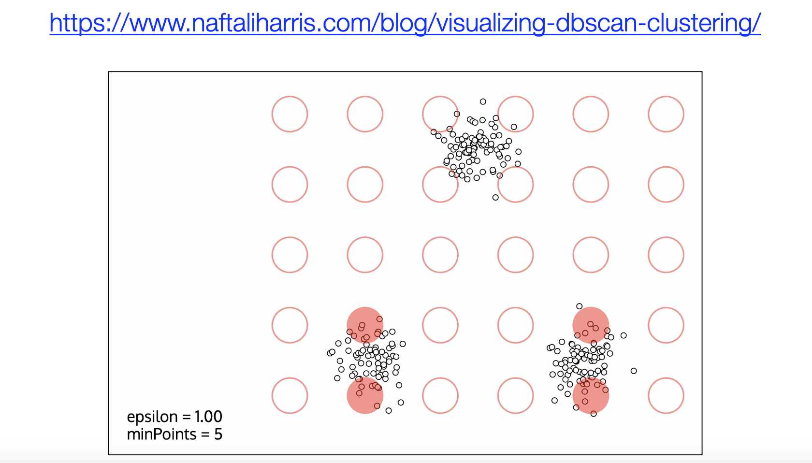

## K-Means Clustering Algorithm

Clustering is an important technique in data mining and machine learning, used to partition samples in a dataset into multiple similar groups or categories. This method has been widely applied in many fields, such as:

- **E-commerce industry**: Based on user behavior data, consumers are divided into different groups (high-spending users, highly active users, churn-risk users, price-sensitive users, etc.) to develop targeted operational strategies and achieve more precise advertising. Representative companies include Alibaba, Amazon, etc.
- **Financial industry**: Major banks use clustering algorithms to analyze user credit records, income levels, spending behavior, and other data, dividing users into different risk groups. Higher-risk groups require stricter credit reviews, while lower-risk groups can enjoy more favorable loan rates or credit limits.
- **Healthcare industry**: By analyzing patient health data (such as medical history, genetic data, lifestyle habits, etc.), patients are divided into different health risk groups, improving the accuracy of disease prediction and advancing precision medicine. Representative companies include Johnson & Johnson, Pfizer, etc.
- **Social media**: By analyzing user friendship networks, interests, social interactions, and other data, users are divided into different social circles for friend recommendations, personalized content customization, and optimization of the platform's information feed recommendation system.

Clustering is a type of **unsupervised learning** because it does not require predefined labels. It learns only from data features, measures feature similarity or distance, and then partitions the known dataset into several different categories. Unlike classification, the goal of clustering is to discover the inherent structure of the data. Clustering algorithms can generally be divided into: **distance-based clustering**, **density-based clustering**, **hierarchical clustering**, **spectral clustering**, etc. If you still cannot distinguish between clustering and classification, the following figure should help.


### Algorithm Principles

Below, we focus on introducing the clustering algorithm called K-Means. K-Means is a prototype-based partitioning clustering method. Its goal is to partition a dataset into K clusters, making data points within each cluster as similar as possible. The implementation steps of the K-Means algorithm are as follows:

1. **Initialize cluster centers**: Randomly select K samples as initial cluster centers, also commonly called centroids.
2. **Assign samples to the nearest centroid**: Compute the distance between each sample and all centroids, and assign the sample to the nearest cluster.
3. **Update centroids**: Compute the mean of all samples in each cluster and use it as the new centroid.
4. **Repeat steps 2 and 3** until the centroids converge or a preset number of iterations is reached.

### Mathematical Description

We describe the algorithm principles above using mathematical language. For a given dataset, the goal of the K-Means algorithm is to minimize the objective function (total sum of squared errors). The objective function is as follows:

$$
J = \sum_{i=1}^{K} \sum_{x \in C_{i}} {\lVert x - \mu_{i} \rVert}^{2}
$$

Here, $\small{K}$ is the number of clusters, $\small{C_{i}}$ represents the set of samples in the $\small{i}$-th cluster, $\small{\mu_{i}}$ is the center of the $\small{i}$-th cluster, and $\small{x}$ is a data point. Since this problem belongs to NP-hard combinatorial optimization, in practice we use an iterative approach to find a satisfactory solution.

First, randomly select $\small{K}$ points as initial centroids $\small{\mu_{1}, \mu_{2}, \cdots, \mu_{K}}$. For each data point $\small{x_{j}}$, compute the distance to each centroid and select the nearest centroid:

$$
C_{i} = \lbrace {x_{j} \ \vert \ {\lVert x_{j} - \mu_{i} \rVert}^{2} \le {\lVert x_{j} - \mu_{k} \rVert}^{2} \ \text{for all} \ k \ne i} \rbrace
$$

Update the centroid to be the mean of all points in the cluster:

$$
\mu_{i} = \frac{1}{\lvert C_{i} \rvert}\sum_{x \in C_{i}} x
$$

Repeat the two steps above until the centroids no longer change or change by less than a certain threshold, which ensures the convergence of the algorithm.

### Code Implementation

Below, we implement K-Means clustering in Python code. We will not use the scikit-learn library for now, mainly to help you understand the working principles of the algorithm.

```python
import numpy as np


def distance(u, v, p=2):
    """Compute the distance between two vectors"""
    return np.sum(np.abs(u - v) ** p) ** (1 / p)


def init_centroids(X, k):
    """Randomly select k centroids"""
    index = np.random.choice(np.arange(len(X)), k, replace=False)
    return X[index]


def closest_centroid(sample, centroids):
    """Find the nearest centroid to a sample"""
    distances = [distance(sample, centroid) for i, centroid in enumerate(centroids)]
    return np.argmin(distances)


def build_clusters(X, centroids):
    """Partition data into clusters based on centroids"""
    clusters = [[] for _ in range(len(centroids))]
    for i, sample in enumerate(X):
        centroid_index = closest_centroid(sample, centroids)
        clusters[centroid_index].append(i)
    return clusters


def update_centroids(X, clusters):
    """Update centroid positions"""
    return np.array([np.mean(X[cluster], axis=0) for cluster in clusters])


def make_label(X, clusters):
    """Generate labels"""
    labels = np.zeros(len(X))
    for i, cluster in enumerate(clusters):
        for j in cluster:
            labels[j] = i
    return labels


def kmeans(X, *, k, max_iter=1000, tol=1e-4):
    """K-Means clustering"""
    # Randomly select k centroids
    centroids = init_centroids(X, k)
    # Partition data through continuous iteration
    for _ in range(max_iter):
        # Partition data into different clusters through centroids
        clusters = build_clusters(X, centroids)
        # Recompute new centroid positions
        new_centroids = update_centroids(X, clusters)
        # Terminate early if centroids barely changed
        if np.allclose(new_centroids, centroids, rtol=tol):
            break
        # Record new centroid positions
        centroids = new_centroids
    # Generate labels for data
    return make_label(X, clusters), centroids
```

We still use the Iris dataset as an example to see if our own `kmeans` function can partition the three types of iris into three different categories. Since this is unsupervised learning, we directly pass the entire dataset to the `kmeans` function, as shown below.

```python
from sklearn.datasets import load_iris

iris = load_iris()
X, y = iris.data, iris.target
labels, centers = kmeans(X, k=3)
```

Here, do not directly compare `y_pred` with `y`. As we mentioned earlier, the clustering algorithm does not know the labels corresponding to the data; it only partitions the data into different categories based on features. The output `0`, `1`, `2` here do not directly correspond to Setosa, Versicolor, and Virginica iris. We can use visualization to examine the prediction results, as shown below:

```python
import matplotlib.pyplot as plt

colors = ['#FF6969', '#050C9C', '#365E32']
markers = ['o', 'x', '^']

plt.figure(dpi=200)
for i in range(len(centers)):
    samples = X[labels == i]
    print(markers[i])
    plt.scatter(samples[:, 2], samples[:, 3], marker=markers[i], color=colors[i])
    plt.scatter(centers[i, 2], centers[i, 3], marker='*', color='r', s=120)

plt.xlabel('Petal length')
plt.ylabel('Petal width')
plt.show()
```

Output:


Let's re-plot using the original data for comparison with the figure above, as shown below.

```python
import matplotlib.pyplot as plt

colors = ['#FF6969', '#050C9C', '#365E32']
markers = ['o', 'x', '^']

plt.figure(dpi=200)
for i in range(len(centers)):
    samples = X[y == i]
    plt.scatter(samples[:, 2], samples[:, 3], marker=markers[i], color=colors[i])

plt.xlabel('Petal length')
plt.ylabel('Petal width')
plt.show()
```

Output:


Directly using the `KMeans` class from scikit-learn's `cluster` module to implement K-Means clustering is a better choice, as shown below.

```python
from sklearn.cluster import KMeans

# Create KMeans object
km_cluster = KMeans(
    n_clusters=3,       # K value (number of clusters)
    max_iter=30,        # Maximum number of iterations
    n_init=10,          # Number of centroid initialization attempts
    init='k-means++',   # Centroid initialization algorithm
    algorithm='elkan',  # Whether to use triangle inequality optimization
    tol=1e-4,           # Centroid change tolerance
    random_state=3      # Random seed
)
# Train the model
km_cluster.fit(X)
print(km_cluster.labels_)           # Cluster labels
print(km_cluster.cluster_centers_)  # Centroid positions
print(km_cluster.inertia_)          # Sum of squared distances to centroids
```

Below we explain several hyperparameters of the `KMeans` class:

1. `n_clusters`: Specifies the number of clusters, i.e., the $\small{K}$ value, default value is `8`.
2. `max_iter`: Maximum number of iterations, default value is `300`, controlling the maximum number of K-Means iteration steps for each initialization.
3. `init`: Method for initializing centroids, default value is `'k-means++'`, which randomly selects K centroids from the data multiple times, computes the distances between the selected center points each time, and takes the set with the maximum distance as the initial center points. This value is recommended. If set to `'random'`, centroids are randomly selected.
4. `n_init`: Works with the parameter above, specifying the number of initialization runs for the algorithm, default value is `10`.
5. `algorithm`: The computation algorithm for K-Means, default value is `'lloyd'`. Another available option is `'elkan'`, an optimization algorithm based on the triangle inequality, suitable for cases with larger K values and offering higher computational efficiency.
6. `tol`: Tolerance controlling the convergence precision of the algorithm, default value is `1e-4`. For larger datasets, this value can be increased appropriately to speed up convergence.

### Summary

K-Means is a classic clustering algorithm. Its advantages include simple implementation and fast convergence speed; its disadvantages are unstable results (related to initial value settings), inability to handle imbalanced samples, tendency to converge to local optima, and high sensitivity to noisy data. If you want to understand the clustering process through visualization, we recommend a blog by someone named Naftali, which provides visualization demonstrations of K-Means and DBSCAN clustering (a density-based clustering algorithm), as shown in the figures below.



