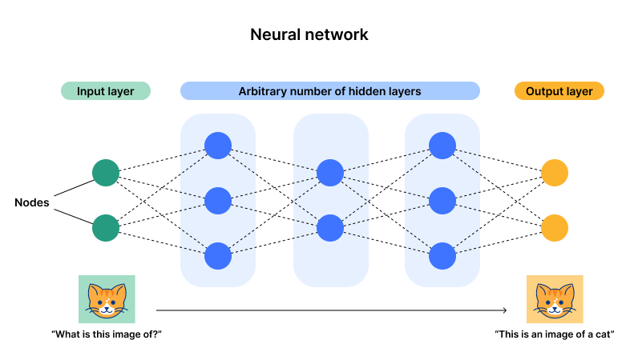
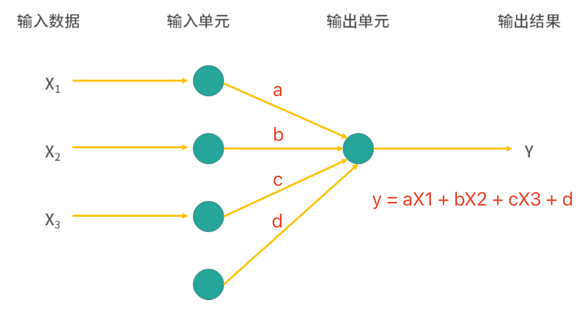
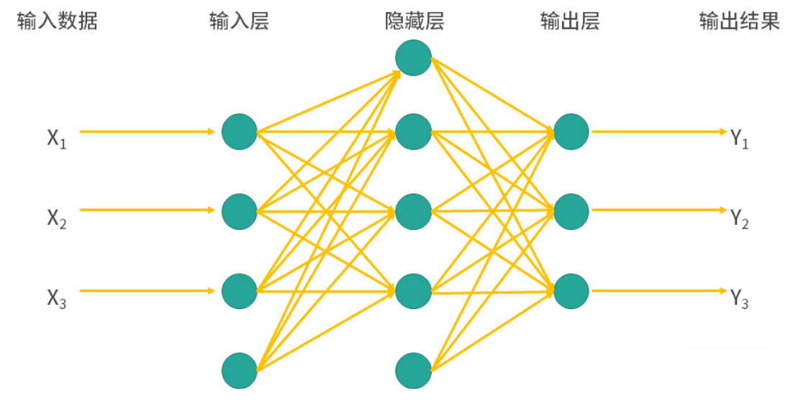

## Neural Network Models

In the human brain, neurons are the units responsible for information transmission and processing. Neurons communicate through chemical and electrical signals, which form the basis of human memory, sensation, movement, and other functions. Neurons contain axons and dendrites -- dendrites receive signals and axons send signals. Additionally, the cell body is an important part of the neuron, playing a role in integrating and transmitting information. Connections between neurons are achieved through synapses that transmit chemical or electrical signals. A single neuron may connect with thousands of other neurons, forming an intricate neural network. At birth, the human brain has approximately 86 billion neurons. Most neurons do not regenerate, so this number slightly decreases with age. Newborn brains possess an extremely large number of synaptic connections, laying the foundation for future learning and adaptation.

Many popular science articles promote neural network models as computational models that simulate human brain neurons, completing complex nonlinear mappings through multi-layer neuron connections. However, there is no evidence that the brain's learning mechanism is the same as the neural network model mechanism. Although the term "neural network" comes from neurobiology and some concepts in deep learning are inspired by our understanding of the brain, for beginners, believing that neural networks have some connection to neurobiology will only make things more confusing.

### Basic Structure

A neural network generally consists of multiple layers, typically including an input layer, hidden layers, and an output layer. Neurons in each layer are connected to neurons in the previous layer. Through weight adjustment and the action of activation functions, data is processed and passed layer by layer, ultimately completing feature extraction and learning from complex data.

1. **Input layer**: Input layer neurons receive input data, with each neuron typically corresponding to one input feature. The input layer's task is to pass the input data to the neurons in the next layer.
2. **Hidden layers**: The hidden layers are the core part of the network, responsible for feature extraction and data processing. There can be one or multiple hidden layers, and neurons in each layer process data through weights and activation functions. Deep neural networks typically contain multiple hidden layers, enabling the extraction of higher-order features from data.
3. **Output layer**: The output layer converts the hidden layers' results into the final output. The output layer's activation function usually depends on the problem type -- for example, a binary classification task might use the Sigmoid function to obtain probabilities, while a regression task might directly output numerical values.
4. **Neurons**: Each neuron receives inputs from the previous layer's neurons, performs weighted summation, and then computes the output through an activation function.



The training process of a neural network typically uses the backpropagation algorithm and gradient descent to optimize weights and reduce prediction errors. Deep neural networks can learn more complex feature representations through multiple nonlinear transformations, and therefore perform excellently in many tasks.

### Working Principles

Let's design the simplest neural network model, which has only one input layer and one output layer. This model predicts the output ($\small{y}$) based on the input ($\small{X}$), where the output satisfies the following formula:

$$
y = aX_{1} + bX_{2} + cX_{3} + d
$$

Here, $\small{a, b, c, d}$ are all model parameters (weights and bias), so our neural network model should have the structure shown in the figure below.



You may have already noticed that this simplest neural network model is no different from linear regression. But what happens if we add a hidden layer between the input and output layers? Look at the figure below -- doesn't it already have a bit of a "network" feel? The added hidden layer can handle nonlinear relationships, and there can be multiple hidden layers. The connections between layers can be fully connected or partially connected, and can even have circular structures. As mentioned above, introducing nonlinearity enables the model to learn more complex feature representations, which is why neural network models perform excellently in many tasks.



Next, let's look at how neural networks work. The computation process of each neuron can be expressed as:

$$
y = f \left( \sum_{i=1}^{n}w_{i}x_{i} + b \right)
$$

Here, $\small{x_{1}, x_{2}, \dots, x_{n}}$ are the input features, $\small{w_1, w_2, \dots, w_n}$ are the weights corresponding to the inputs; $\small{b}$ is the bias term; $\small{f}$ is the activation function, typically a nonlinear function such as Sigmoid, ReLU, Tanh, etc. Activation functions serve two purposes: on one hand, they introduce nonlinear transformations, increasing the neural network's expressive power, enabling it to model arbitrarily complex functional relationships; on the other hand, during training, backpropagation is used to update weights, and the nonlinear properties of activation functions make gradient transmission more effective, allowing the neural network to converge faster and improve training efficiency. Below, we provide a brief introduction to commonly used activation functions.

1. Sigmoid Function

$$
f(x) = \frac{1}{1 + e^{-x}}
$$


- **Characteristics**: The Sigmoid function maps input values to the range $\small{(0, 1)}$, exhibiting a smooth S-shaped curve.
- **Advantages**: Particularly suitable for probability prediction, since the output is between $\small{(0, 1)}$ and can be interpreted as a probability value.
- **Disadvantages**: For very large positive or negative values, the gradient becomes very small, leading to the vanishing gradient problem, which affects training of deep networks. Additionally, since the output is not zero-centered, gradient updates become asymmetric, potentially slowing convergence.

2. Tanh Function (Hyperbolic Tangent Function)

$$
f(x) = tanh(x) = \frac{e^{x} - e^{-x}}{e^{x} + e^{-x}}
$$


- **Characteristics**: The Tanh function maps input to the range $\small{(-1, 1)}$, also an S-shaped curve but center-symmetric.
- **Advantages**: Similar to Sigmoid but with output in $\small{(-1, 1)}$. This zero-centered output makes gradient updates more symmetric, making it more suitable for deep networks.
- **Disadvantages**: Near extreme values, the gradient still tends toward zero, causing the vanishing gradient problem.

3. ReLU Function (Rectified Linear Unit)

$$
f(x) = max(0, x)
$$

- **Characteristics**: ReLU sets the part of the input less than zero to zero, while keeping the part greater than zero unchanged, so its output range is $\small{[0, +\infty]}$.
- **Advantages**: Simple to compute and effectively avoids the vanishing gradient problem, making it widely used in deep networks. It maintains sparsity, with many neuron outputs being zero, which helps simplify computation.
- **Disadvantages**: When the input is negative, ReLU's gradient is zero. If the input is persistently negative, the neuron may "die" and stop updating.

4. Leaky ReLU Function

$$
f(x) = \begin{cases} x & (x \gt 0) \\\\ {\alpha}x & (x \le 0)\end{cases}
$$

- **Characteristics**: Leaky ReLU is an improvement on ReLU that introduces a small negative slope for inputs less than zero (typically $\small{\alpha = 0.01}$), ensuring the gradient is not zero.
- **Advantages**: By allowing negative outputs, it avoids the dead neuron problem, making the network more robust.
- **Disadvantages**: Although Leaky ReLU can alleviate the dead neuron problem, the choice of negative slope has some impact on network performance, and it does not significantly improve the model's nonlinear representation capability.

In a neural network with multiple layers, information is passed layer by layer. Assuming the output of layer $\small{l}$ is $\small{\mathbf{a}^{[l]}}$, following the neuron computation formula above:

$$
\mathbf{a}^{[l]} = f \left( \mathbf{W}^{[l]} \mathbf{a}^{[l-1]} + \mathbf{b}^{[l]} \right)
$$

Here, $\small{\mathbf{W}^{[l]}}$ is the weight matrix of layer $\small{l}$, $\small{\mathbf{a}^{[l-1]}}$ is the output of layer $\small{l - 1}$, $\small{\mathbf{b}^{[l]}}$ is the bias term of layer $\small{l}$, and $\small{f}$ is the activation function. The final output of the neural network is obtained through the activation function of the last layer. This process is called forward propagation.

For neural network models, there is another extremely important operation: updating the parameters (weights and biases) of the neural network by computing the gradient of the loss function with respect to each weight and bias. This process is commonly known as backpropagation. Backpropagation has two key elements: the loss function and gradient descent. The former measures the gap between predicted and actual values -- commonly used loss functions include mean squared error (for regression tasks) and cross-entropy loss (for classification tasks). The latter updates parameters $\small{\theta}$ (weights and biases) to minimize the loss function:

$$
\theta^{\prime} = \theta - \eta \nabla L(\theta) \\\\
\theta = \theta^{\prime}
$$

Here, $\small{\eta}$ is the learning rate, and $\small{\nabla L(\theta)}$ is the gradient of the loss function with respect to the parameters, consistent with the method we used when explaining regression models.

### Code Implementation

Based on the neural network model principles described above, writing a simple neural network model from scratch is not difficult. Of course, we can also use scikit-learn's `neural_network` module to build neural network models. Below, we still use the Iris dataset as an example to demonstrate the construction and prediction performance of a neural network model.

```python
from sklearn.datasets import load_iris
from sklearn.model_selection import train_test_split
from sklearn.neural_network import MLPClassifier
from sklearn.metrics import classification_report

# Load and split the dataset
iris = load_iris()
X, y = iris.data, iris.target
X_train, X_test, y_train, y_test = train_test_split(X, y, train_size=0.8, random_state=3)

# Create multi-layer perceptron classifier model
model = MLPClassifier(
    solver='lbfgs',            # Solver for optimizing model parameters
    learning_rate='adaptive',  # Adaptive learning rate adjustment
    activation='relu',         # Activation function for hidden layer neurons
    hidden_layer_sizes=(1, )   # Number of neurons in each layer
)
# Train and predict
model.fit(X_train, y_train)
y_pred = model.predict(X_test)

# View model evaluation report
print(classification_report(y_test, y_pred))
```

Output:

```
              precision    recall  f1-score   support

           0       1.00      0.10      0.18        10
           1       0.00      0.00      0.00        10
           2       0.34      1.00      0.51        10

    accuracy                           0.37        30
   macro avg       0.45      0.37      0.23        30
weighted avg       0.45      0.37      0.23        30
```

> **Note**: Since `random_state` was not specified when creating the `MLPClassifier`, the results may differ each time the code is executed.

The model's prediction accuracy is only `0.37`. Are you disappointed by this result? The model we painstakingly built has such poor prediction performance. Don't worry -- in the code above, when creating the neural network model, the `hidden_layer_sizes` parameter was set to `(1, )`, which means our network has only 1 hidden layer with only 1 neuron. That single neuron is bearing too much burden. Next, we need to increase the number of hidden layers and neurons so the model can better learn the mapping relationship between features and targets, and the prediction performance will improve. Below, we adjust the `hidden_layer_sizes` parameter to `(32, 32, 32)`, meaning the model has three hidden layers with 32 neurons each, and let's see the execution results.

```python
from sklearn.datasets import load_iris
from sklearn.model_selection import train_test_split
from sklearn.neural_network import MLPClassifier
from sklearn.metrics import classification_report

# Load and split the dataset
iris = load_iris()
X, y = iris.data, iris.target
X_train, X_test, y_train, y_test = train_test_split(X, y, train_size=0.8, random_state=3)

# Create multi-layer perceptron classifier model
model = MLPClassifier(
    solver='lbfgs',                  # Solver for optimizing model parameters
    learning_rate='adaptive',        # Adaptive learning rate adjustment
    activation='relu',               # Activation function for hidden layer neurons
    hidden_layer_sizes=(32, 32, 32)  # Number of neurons in each layer
)
# Train and predict
model.fit(X_train, y_train)
y_pred = model.predict(X_test)

# View model evaluation report
print(classification_report(y_test, y_pred))
```

> **Note**: You can try running the code above to see if you get better results. Of course, a model accuracy of 1 is not necessarily cause for celebration, because you may have trained an overfitting model. In any case, you can try resetting the `hidden_layer_sizes` parameter to see what results you get.

Below, let's explain several important hyperparameters of `MLPClassifier`.

1. `hidden_layer_sizes`: Specifies the number of neurons in each layer of the neural network. Tuple type, default value is `(100, )`, meaning there is only one hidden layer with 100 neurons. This hyperparameter can change the network's structure and capacity. More layers and more neurons increase the model's representational power, but also increase the risk of overfitting.
2. `activation`: Activation function for hidden layer neurons, default value is `relu`, meaning the ReLU activation function is used. The activation function determines the output form of each layer. Generally, `'relu'` is the preferred choice for training deep networks because it mitigates the vanishing gradient problem and trains faster. Options include:
    - `'identity'`: Linear activation function, i.e., $\small{f(x) = x}$, generally not recommended.
    - `'logistic'` / `'tanh'` / `'relu'`: Sigmoid / Hyperbolic Tangent / ReLU activation functions.
3. `solver`: Solver (optimization algorithm) used to optimize model parameters. Common optimization algorithms include:
    - `'lbfgs'`: Limited-memory Broyden-Fletcher-Goldfarb-Shanno, a quasi-Newton method with higher computational complexity but better performance on small datasets.
    - `'sgd'`: Stochastic Gradient Descent, suitable for large-scale datasets, randomly selecting small batches of data for updates during training.
    - `'adam'`: Adaptive Moment Estimation, the default value, suitable for most situations with high computational efficiency.
4. `alpha`: L2 regularization term (also called weight decay), controlling neural network complexity, default value is `0.0001`.
5. `batch_size`: Batch size used for each iteration, default value is `'auto'`, which automatically determines batch size based on sample count. Smaller batches make training more unstable but help avoid local optima; larger batches can speed up training but may cause memory issues.
6. `learning_rate`: Learning rate adjustment method, affecting the step size of weight adjustment at each iteration, default value is `'constant'`, meaning the learning rate remains unchanged. Other options include `'invscaling'` and `'adaptive'` -- the former decreases the learning rate gradually as iterations increase, the latter automatically adjusts the learning rate based on current gradient changes: increasing it when gradient updates are small and decreasing it when gradients are large.
7. `learning_rate_init`: Initial learning rate, default value is `0.001`.
8. `max_iter`: Maximum number of iterations, controlling the maximum iterations of the optimization algorithm during training, default value is `200`. If the model has not converged after reaching the maximum iterations, training will stop. This is useful for preventing overly long training, but too small a value may cause training to stop too early, resulting in underfitting.
9. `tol`: Optimization tolerance during training, determining when training stops if the objective function change is less than this value, default value is `0.0001`. A smaller `tol` leads to longer training time; a larger `tol` may stop training prematurely.

Besides the scikit-learn library, we can also use third-party libraries such as TensorFlow, PyTorch, and MXNet to implement neural network models. Many of these libraries support GPU (Graphics Processing Unit) or TPU (Tensor Processing Unit) acceleration, and have many built-in deep network models (such as convolutional neural networks, recurrent neural networks, generative adversarial networks, etc.) along with corresponding optimizers. Compared to scikit-learn, these libraries may be a better choice. For those interested, you can look at the code below, where we built a neural network model using PyTorch to solve the Iris classification problem.

```python
import torch
import torch.nn as nn
import torch.optim as optim
from sklearn import datasets
from sklearn.model_selection import train_test_split
from sklearn.preprocessing import StandardScaler
from sklearn.metrics import accuracy_score, classification_report

# Load Iris dataset
iris = datasets.load_iris()
X, y = iris.data, iris.target

# Data preprocessing (standardization)
scaler = StandardScaler()
X_scaled = scaler.fit_transform(X)

# Split training and test sets
X_train, X_test, y_train, y_test = train_test_split(X_scaled, y, train_size=0.8, random_state=3)
# Convert arrays to PyTorch tensors
X_train_tensor, X_test_tensor, y_train_tensor, y_test_tensor = (
    torch.tensor(X_train, dtype=torch.float32),
    torch.tensor(X_test, dtype=torch.float32),
    torch.tensor(y_train, dtype=torch.long),
    torch.tensor(y_test, dtype=torch.long)
)


class IrisNN(nn.Module):
    """Iris neural network model"""

    def __init__(self):
        """Initialization method"""
        # Call parent constructor
        super(IrisNN, self).__init__()
        # Input layer to hidden layer (4 features to 32 neurons, fully connected)
        self.fc1 = nn.Linear(4, 32)
        # Hidden layer to output layer (32 neurons to 3 outputs, fully connected)
        self.fc2 = nn.Linear(32, 3)

    def forward(self, x):
        """Forward propagation"""
        # Hidden layer uses ReLU activation function
        x = torch.relu(self.fc1(x))
        x = self.fc2(x)
        return x


# Create model instance
model = IrisNN()
# Define loss function (cross-entropy loss)
loss_function = nn.CrossEntropyLoss()
# Use Adam optimizer (performs well on most tasks)
optimizer = optim.Adam(model.parameters(), lr=0.001)

# Train the model (iterate for 256 epochs)
for _ in range(256):
    model.train()
    # Clear gradients from the previous step
    optimizer.zero_grad()
    # Compute output
    output = model(X_train_tensor)
    # Compute loss
    loss = loss_function(output, y_train_tensor)
    # Backpropagation
    loss.backward()
    # Update weights
    optimizer.step()

# Evaluate the model
model.eval()
with torch.no_grad():
    output = model(X_test_tensor)
    # Get the index of the maximum prediction score (predicted label)
    _, y_pred_tensor = torch.max(output, 1)
    # Compute and output prediction accuracy
    print(f'Accuracy: {accuracy_score(y_test_tensor, y_pred_tensor):.2%}')
    # Output classification model evaluation report
    print(classification_report(y_test_tensor, y_pred_tensor))
```

> **Note**: If you haven't installed the PyTorch library yet, you can install it using the command `pip install torch`.

We can also use neural network models for regression tasks. Here we still use the "Auto MPG dataset" from the regression model chapter to demonstrate how to solve a regression task with a neural network model. The complete code is shown below.

```python
import ssl

import pandas as pd
import torch
import torch.nn as nn
import torch.optim as optim
from sklearn.metrics import mean_squared_error, r2_score
from sklearn.model_selection import train_test_split
from sklearn.preprocessing import StandardScaler

ssl._create_default_https_context = ssl._create_unverified_context


def load_prep_data():
    """Load and prepare data"""
    df = pd.read_csv('https://archive.ics.uci.edu/static/public/9/data.csv')
    # Clean features
    df.drop(columns=['car_name'], inplace=True)
    df.dropna(inplace=True)
    df['origin'] = df['origin'].astype('category')
    df = pd.get_dummies(df, columns=['origin'], drop_first=True).astype('f8')
    # Scale features
    scaler = StandardScaler()
    return scaler.fit_transform(df.drop(columns='mpg').values), df['mpg'].values


class MLPRegressor(nn.Module):
    """Neural network model"""

    def __init__(self, n):
        super(MLPRegressor, self).__init__()
        self.fc1 = nn.Linear(n, 64)
        self.fc2 = nn.Linear(64, 64)
        self.fc3 = nn.Linear(64, 1)

    def forward(self, x):
        x = torch.relu(self.fc1(x))
        x = torch.relu(self.fc2(x))
        x = self.fc3(x)
        return x


def main():
    # Load and prepare the dataset
    X, y = load_prep_data()
    # Split training and test sets
    X_train, X_test, y_train, y_test = train_test_split(X, y, train_size=0.8, random_state=3)
    # Convert data to PyTorch Tensors
    X_train_tensor, X_test_tensor, y_train_tensor, y_test_tensor = (
        torch.tensor(X_train, dtype=torch.float32),
        torch.tensor(X_test, dtype=torch.float32),
        torch.tensor(y_train, dtype=torch.float32).view(-1, 1),
        torch.tensor(y_test, dtype=torch.float32).view(-1, 1)
    )

    # Instantiate the neural network model
    model = MLPRegressor(X_train.shape[1])
    # Specify loss function (mean squared error)
    criterion = nn.MSELoss()
    # Specify optimizer (Adam optimizer)
    optimizer = optim.Adam(model.parameters(), lr=0.001)

    # Model training
    epochs = 256
    for epoch in range(epochs):
        # Forward propagation
        y_pred_tensor = model(X_train_tensor)
        loss = criterion(y_pred_tensor, y_train_tensor)
        # Backpropagation
        optimizer.zero_grad()
        loss.backward()
        optimizer.step()

        if (epoch + 1) % 16 == 0:
            print(f'Epoch [{epoch + 1} / {epochs}], Loss: {loss.item():.4f}')

    # Model evaluation
    model.eval()
    with torch.no_grad():
        y_pred = model(X_test_tensor)
        test_loss = mean_squared_error(y_test, y_pred.numpy())
        r2 = r2_score(y_test, y_pred.numpy())
    print(f'Test MSE: {test_loss:.4f}')
    print(f'Test R2: {r2:.4f}')


if __name__ == '__main__':
    main()
```

Output:

```
Epoch [16 / 256], Loss: 588.2971
Epoch [32 / 256], Loss: 530.0340
Epoch [48 / 256], Loss: 429.9081
Epoch [64 / 256], Loss: 286.5121
Epoch [80 / 256], Loss: 133.6717
Epoch [96 / 256], Loss: 44.3843
Epoch [112 / 256], Loss: 30.3168
Epoch [128 / 256], Loss: 24.0182
Epoch [144 / 256], Loss: 19.5326
Epoch [160 / 256], Loss: 16.4941
Epoch [176 / 256], Loss: 14.2642
Epoch [192 / 256], Loss: 12.5515
Epoch [208 / 256], Loss: 11.2248
Epoch [224 / 256], Loss: 10.1825
Epoch [240 / 256], Loss: 9.3600
Epoch [256 / 256], Loss: 8.7116
Test MSE: 8.7226
Test R2: 0.8569
```

From the output above, we can see that as the neural network model continues forward and backward propagation, the loss becomes smaller and the model's fit improves. During prediction, we perform one forward propagation using the trained model parameters to complete the mapping from features to target values. The two regression model evaluation metrics, MSE and $\small{R^{2}}$, look quite good. Currently, neural networks are widely applied in pattern recognition, image processing, speech recognition, and other fields, and they are the core technology in deep learning. For readers interested in deep learning, you can follow my other project ["Deep Learning Is Nothing But Brute Force"](https://github.com/jackfrued/Deep-Learning-Is-Nothing), which is still being created and updated.

### Model Advantages and Disadvantages

The most appealing aspect of neural network models is that they can be continuously expanded like building blocks, without requiring too much intervention in the specific internal operations of the model. Neural networks can learn and fit extremely complex mapping relationships, and can automatically adjust their structure and parameters based on input data, giving them strong adaptability. When facing different types of data or tasks, neural networks can adapt to different requirements by adjusting the network structure (number of layers, number of nodes, etc.). As long as the data volume is large enough and computing power is sufficient, you will ultimately get a good result, often outperforming traditional machine learning algorithms -- this is what we commonly call "brute force works wonders." Additionally, the word "deep" in the well-known term "deep learning" refers to the sufficient depth of the neural network model's layers, and we typically call such networks deep neural networks (DNN).

A neural network model is like a black box: you give it data and it tells you the result, but it lacks interpretability as to why that result appears. Therefore, in many scenarios that require high model interpretability (such as credit rating, financial risk control, etc.), we may not be able to use neural network models. Furthermore, neural networks, especially deep neural networks, require a large amount of computational resources for training, especially when processing high-dimensional data. Training time and required resources can be enormous, requiring powerful hardware support such as high-performance GPUs or dedicated hardware (TPU). Finally, what I personally find most challenging about neural network models is that hyperparameter tuning is extremely difficult. The number of layers, the number of neurons per layer, the learning rate, the choice of activation function, etc., can all affect model performance. Without strong computational resources to support it, hyperparameter tuning is very difficult to complete, essentially discouraging individuals and small companies.

### Summary

Neural network models learn knowledge from massive data in a way different from traditional machine learning algorithms. Despite the model's lack of interpretability, it cannot be denied that they have achieved remarkable results in multiple fields such as image, speech, and natural language processing. Of course, training neural network models consumes a large amount of resources. When applying neural network models, it is recommended to weigh their advantages and disadvantages and choose appropriate models and training methods based on specific task requirements. For scenarios with smaller datasets, requirements for interpretability, or limited computational resources, we recommend considering traditional machine learning algorithms or other more lightweight models.
