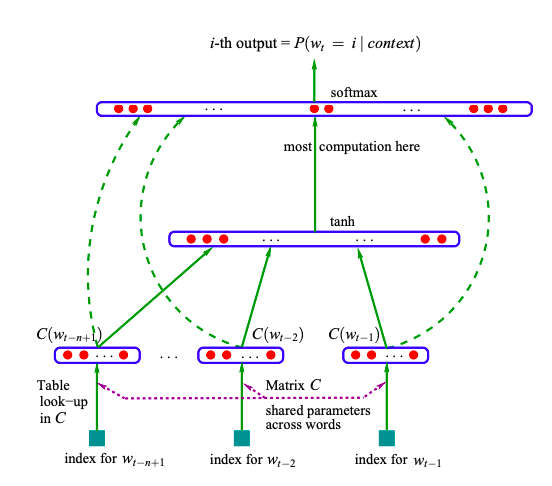
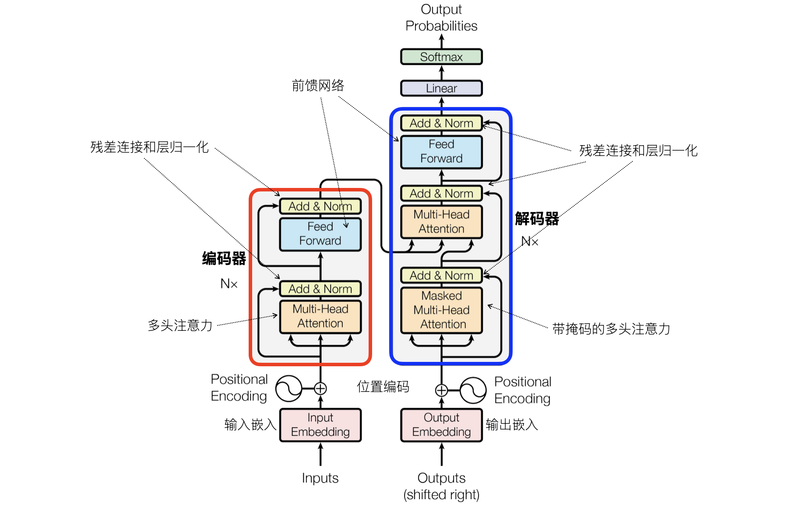

## Introduction to Natural Language Processing

Natural Language Processing (NLP) is an important branch of computer science and artificial intelligence, aimed at enabling computers to understand, generate, and interact with human language. NLP has wide application scenarios, including text classification, sentiment analysis, machine translation, speech recognition, chatbots, and more. With the rapid development of deep learning, NLP research has gradually shifted from traditional machine learning methods to deep learning methods. Classic NLP methods rely on feature engineering and model design, while modern deep learning methods rely more on data-driven approaches and automatic feature learning.

### Bag of Words Model

The Bag of Words (BoW) model is one of the simplest text representation methods in NLP. It treats each word in the text as a "bag of words," ignoring word order and grammar, and only considering the frequency of each word's occurrence. Simply put, the bag of words model represents text by converting it into term frequency vectors (TF). Building a bag of words model involves two very simple steps:

1. **Build a vocabulary**: First scan all documents, list all words in the text (keeping only one entry for repeated words), forming a vocabulary.
2. **Text vectorization**: Map the words in each document to the vocabulary and count the number of occurrences of each word, forming the document's vector representation.

For example, given three documents:

1. `I love programming.`
2. `I love machine learning.`
3. `I love apple.`

Building the vocabulary yields: `['I', 'love', 'programming', 'machine', 'learning', 'apple']`. Then, converting each document to a term frequency vector gives:

1. `[1, 1, 1, 0, 0, 0]`
2. `[1, 1, 0, 1, 1, 0]`
3. `[1, 1, 0, 0, 0, 1]`

The scikit-learn library provides the `CountVectorizer` class for building bag of words models, used as follows.

```python
from sklearn.feature_extraction.text import CountVectorizer

# Document list
documents = [
    'I love programming.',
    'I love machine learning.',
    'I love apple.'
]

# Create bag of words model
cv = CountVectorizer()
X = cv.fit_transform(documents)

# Output vocabulary and term frequency vectors
print('Vocabulary:\n', cv.get_feature_names_out())
print('Term frequency vectors:\n', X.toarray())
```

Output:

```
Vocabulary:  ['apple' 'learning' 'love' 'machine' 'programming']
Term frequency vectors:
[[0 0 1 0 1]
 [0 1 1 1 0]
 [1 0 1 0 0]]
```

> **Note**: The vocabulary above does not contain the word `'I'` because it is considered a stop word and is ignored. Stop words typically refer to words that appear frequently in a specific language but contribute little to text analysis tasks.

For Chinese documents, a third-party library `jieba` is needed for Chinese word segmentation, first splitting sentences into words and then constructing term frequency vectors, as shown below.

```python
import jieba
from sklearn.feature_extraction.text import CountVectorizer

# Document list
documents = [
    '我在四川大学读书',
    '四川大学是四川最好的大学',
    '大学校园里面有很多学生',
]

# Create bag of words model with specified tokenizer function
cv = CountVectorizer(
    tokenizer=lambda x: jieba.cut(x),
    token_pattern=None
)
X = cv.fit_transform(documents)

# Output vocabulary and term frequency vectors
print('Vocabulary:\n', cv.get_feature_names_out())
print('Term frequency vectors:\n', X.toarray())
```

> **Note**: If the Chinese segmentation library is not yet installed, you can install it with the command `pip install jieba`.

Output:

```
Vocabulary:
 ['四川' '四川大学' '在' '大学' '大学校园' '学生' '很多' '我' '是' '最好' '有' '的' '读书' '里面']
Term frequency vectors:
 [[0 1 1 0 0 0 0 1 0 0 0 0 1 0]
  [1 1 0 1 0 0 0 0 1 1 0 1 0 0]
  [0 0 0 0 1 1 1 0 0 0 1 0 0 1]]
```

If you want to remove common Chinese stop words, you can specify the `stop_words` parameter when creating the `CountVectorizer` object. We can load a stop word list from a Chinese stop words file, as shown below.

```python
import jieba
from sklearn.feature_extraction.text import CountVectorizer

with open('哈工大停用词表.txt') as file_obj:
    stop_words_list = file_obj.read().split('\n')

# Document list
documents = [
    '我在四川大学读书',
    '四川大学是四川最好的大学',
    '大学校园里面有很多学生',
]

# Create bag of words model with specified tokenizer function
cv = CountVectorizer(
    tokenizer=lambda x: jieba.lcut(x),
    token_pattern=None,
    stop_words=stop_words_list
)
X = cv.fit_transform(documents)

# Output vocabulary and term frequency vectors
print('Vocabulary:\n', cv.get_feature_names_out())
print('Term frequency vectors:\n', X.toarray())
```

> **Note**: The Chinese stop words file used above can be obtained from this [link](https://github.com/goto456/stopwords).

Output:

```
Vocabulary:
 ['四川' '四川大学' '大学' '大学校园' '学生' '很多' '最好' '读书' '里面']
Term frequency vectors:
 [[0 1 0 0 0 0 0 1 0]
  [1 1 1 0 0 0 1 0 0]
  [0 0 0 1 1 1 0 0 1]]
```

### Word Embeddings

Unlike the bag of words model, word embeddings map each word to a dense vector space, enabling computers to understand and process text data. These vectors capture semantic and contextual relationships between words, allowing models to better perform word sense matching and semantic analysis. For example, the relationship between the words `'king'` and `'queen'`, and the relationship between `'cat'` and `'dog'`, should be reflected in the vector space.

Common word embedding models include:

1. **Word2Vec**: Learns word vectors through shallow neural network training, with two architectures: CBOW (Continuous Bag Of Words) and Skip-Gram.
    - The core idea of the CBOW model is: given context words, predict the center word, i.e., predict the target word through surrounding context words. The order of the context is not important because the bag of words is a set, and sets have no concept of order. Suppose you have the sentence "The cat sits on the mat." If the goal is to predict "sits," CBOW would use the context words "The," "cat," "on," "the," "mat" to predict "sits." During training, CBOW adjusts the word vector for "sits" based on its context, making the word more accurately represent its semantics in the given context. Through this approach, CBOW learns a context-dependent representation for each word.
    - Opposite to CBOW, the core idea of the Skip-Gram model is: given a target word, predict its context words, i.e., predict surrounding words from a center word. Using the same sentence "The cat sits on the mat." as an example, with the target word "sits," the Skip-Gram model would use "sits" to predict its context words: "The," "cat," "on," "the," "mat." The Skip-Gram model trains so that the word vector for "sits" maximizes its association with context words in the training data.
2. **GloVe**: Based on word frequency matrix factorization, capable of capturing global statistical information of vocabulary, proposed by researchers at Stanford University in 2014. GloVe word vectors can be used in various NLP tasks, such as text classification, sentiment analysis, machine translation, etc. They provide effective input features for subsequent deep learning models.

Below, we briefly explain the basic approach to learning word vectors, which has three core elements:

1. **Input and Target**: Assuming we use the Word2Vec model (CBOW or Skip-Gram), the goal is to learn word vectors through a word (center word) or context words. In Skip-Gram, given a word, the goal is to predict its context words; in CBOW, given context words, the goal is to predict the center word.

2. **Neural Network Model**: Word2Vec learns word vectors through a simple neural network. The input layer is the one-hot encoding corresponding to each word; the hidden layer is a low-dimensional dense vector (i.e., the word vector), which is gradually optimized during training through backpropagation; the output layer is the probability distribution of the target word, as shown in the figure below.

    

3. **Training Process**: Through co-occurrence information of context and target words, the model adjusts word vectors based on each word's context, bringing semantically similar word vectors closer together. During training, the neural network adjusts word vectors by minimizing the error (the gap between predicted and actual words), enabling accurate prediction of relationships between words.

The dimensionality of word vectors is typically a hyperparameter that needs to be chosen based on the actual situation. Usually, common dimension ranges are between 50 and 300, though sometimes higher or lower is appropriate. Lower dimensions may not capture rich semantic information but reduce computational complexity, suitable for scenarios with less training data or lower accuracy requirements; higher dimensions can capture more semantic features, suitable for large-scale datasets, but computational cost also increases.

Once word vectors are trained, they can capture various relationships between words. The most common approach is to understand their relationships by computing the distance or similarity between word vectors. Computing cosine similarity between two word vectors is the most commonly used method. The cosine similarity formula was mentioned earlier:

$$
\text{Cosine Similarity}(\mathbf{A}, \mathbf{B}) = \frac{\mathbf{A} \cdot \mathbf{B}}{\lVert \mathbf{A} \rVert \lVert \mathbf{B} \rVert}
$$

Here, $\small{\mathbf{A}}$ and $\small{\mathbf{B}}$ are the word vectors of two words, $\small{\cdot}$ is the dot product operation, and $\small{\lVert \mathbf{A} \rVert}$ and $\small{\lVert \mathbf{B} \rVert}$ are their magnitudes. Cosine similarity values range from -1 to 1, where larger values indicate more similar words and smaller values indicate less similarity.

On the other hand, we can study the spatial relationships of word vectors and perform some interesting operations. For example, if we want to know the relationship between `'king'` and `'queen'`, we can explore it as follows:

$$
\text{king} − \text{man} + \text{woman} \approx \text{queen}
$$

This equation means: take `'king'`, remove the `'man'` component, add the `'woman'` component, and the result is approximately `'queen'`. Such operations can capture gender-based similarities. Additionally, word vectors can be used for clustering analysis, word sense disambiguation (determining a word's meaning in a specific context through context and similarity), text classification, sentiment analysis, and other operations.

We use the following code to demonstrate word vector construction and word-to-word similarity measurement. This requires installing a third-party library called `gensim`.

```bash
pip install gensim
```

Additionally, we need to pre-load the training corpus. Here we use the `datasets` library provided by Hugging Face, which can load various public datasets, including some commonly used corpora. Of course, you can also choose a specialized NLP toolkit like `nltk` to download corpora. If the `datasets` library is not yet installed, use the following command to install it.

```bash
pip install datasets
```

We first load the IMDB dataset, which is a widely used text classification dataset, especially in the fields of sentiment analysis and NLP. The IMDB dataset contains a large number of movie reviews, with each review annotated with its sentiment orientation (which we won't use for now). The IMDB dataset typically contains 50,000 reviews, with 25,000 for training and 25,000 for testing. Each review is a viewer's evaluation of a movie, varying in length, and we use it as the training corpus.

```python
import re

from datasets import load_dataset
from gensim.models import Word2Vec
from sklearn.metrics.pairwise import cosine_similarity

# Load the IMDB dataset
imdb = load_dataset('imdb')
# Use all 50,000 reviews as the corpus
temp = [imdb['unsupervised'][i]['text'] for i in range(50000)]
# Simple text processing using regular expressions
corpus = [re.sub(r'[^\w\s]', '', x) for x in temp]

# Preprocess the corpus (English tokenization)
sentences = [sentence.lower().split() for sentence in corpus]
# Train the Word2Vec model
# sentences - input corpus (list of sentences, each sentence is a list of one or more words)
# vector_size - word vector dimensionality (higher dimensions can represent more information)
# windows - context window size (range of context words used during training)
# min_count - ignore words with frequency below this value (filter out infrequent words)
# workers - number of CPU cores used for training
# seed - random seed (for initializing model weights)
model = Word2Vec(sentences, vector_size=100, window=10, min_count=2, workers=4, seed=3)

# Get word vectors for king and queen through the model
king_vec, queen_vec = model.wv['king'], model.wv['queen']

# Compute cosine similarity between two word vectors
cos_similarity = cosine_similarity([king_vec], [queen_vec])
print(f'Cosine similarity between king and queen: {cos_similarity[0, 0]:.2f}')

# Perform inference through word vectors (king - man + woman ≈ queen)
man_vec, woman_vec = model.wv['man'], model.wv['woman']
result_vec = king_vec - man_vec + woman_vec
# Find the three most similar words to the computed result
similar_words = model.wv.similar_by_vector(result_vec, topn=3)
print(f'Words most similar to king - man + woman:\n {similar_words}')

# Find the five most similar words to dog
dog_similar_words = model.wv.most_similar('dog', topn=5)
print(f'Words most similar to dog:\n {dog_similar_words}')
```

Output:

```
Cosine similarity between king and queen: 0.43
Words most similar to king - man + woman:
 [('queen', 0.7126370668411255), ('princess', 0.6760246753692627), ('mary', 0.5891180038452148)]
Words most similar to dog:
 [('cat', 0.7801533937454224), ('sheep', 0.6783771514892578), ('pet', 0.6658452749252319),
  ('doll', 0.655034065246582), ('dude', 0.6548768877983093)]
```

From the code output, we can see that the words most similar to `'king' - 'man' + 'woman'` are `'queen'` and `'princess'`, with the other word being a girl's name. The words most similar to `'dog'` are: `'cat'`, `'sheep'`, `'pet'`, `'doll'`, and `'dude'`.

### NPLM and RNN

Although Word2Vec has helped us master the connections between words, due to its inability to capture long-distance dependencies (words beyond the context window) and handle unknown words (words not seen during training), it could not achieve breakthroughs in specific downstream NLP tasks. As the limitations of Word2Vec became apparent, researchers proposed **NPLM** (Neural Probabilistic Language Model), which uses neural network structures to predict the next word in a word sequence. Unlike traditional language models, NPLM uses neural networks (typically feedforward neural networks) to process entire word sequences, not just local context information, enabling modeling of more complex language structures. Its structure is shown in the figure below.



Of course, the NPLM model also has the problem of being unable to effectively capture long-term dependencies. To address this, researchers proposed the **RNN** (Recurrent Neural Network) model. RNN is a type of neural network capable of processing sequential data. Its key characteristic is the ability to pass the hidden state from the previous time step to the next, thereby establishing connections across the time dimension. RNNs can capture temporal dependencies in text during training and are not limited to fixed-length context windows. At each time step, RNN depends on the current input and the previous time step's hidden state, effectively capturing temporal dependencies in sequential data and updating weights through the backpropagation algorithm, as shown in the figure below.


To solve the vanishing gradient and exploding gradient problems in traditional RNNs, researchers proposed improved algorithms such as **Long Short-Term Memory** (LSTM) and **Gated Recurrent Unit** (GRU). Both LSTM and GRU introduce gating mechanisms that allow the model to control information flow and forgetting, effectively preventing the vanishing gradient problem and capturing dependencies in long time sequences. However, LSTM and GRU still have issues with low computational efficiency, slow training speed, and inability to perform parallel training.

### Seq2Seq

Initially, researchers attempted to use a single RNN to solve NLP tasks such as machine translation, text summarization, and speech recognition, but found the results unsatisfactory. The main reason was that when an RNN simultaneously handles input and output sequences, it is responsible for both encoding and decoding, making it prone to information loss. Later, Google proposed the Seq2Seq model, whose core idea is to learn the mapping relationship between input and output sequences to achieve sequence-to-sequence conversion. The Seq2Seq model typically consists of an **encoder** and a **decoder**. The encoder is usually composed of RNN or its variants (LSTM, GRU, etc.), and its main task is to read the input sequence and convert it into a context vector containing the semantic information of the entire input sequence, which serves as the basis for the decoder to generate output. The decoder is also usually composed of RNN or its variants, and its main task is to generate the target sequence based on the context vector. The structure of the Seq2Seq model is shown in the figure below.


A simple Seq2Seq model compresses the entire input sequence's information into a fixed-size context vector, which may lead to information loss, especially when processing long sequences. The **attention mechanism** is an important extension of the Seq2Seq model. By dynamically computing weighted sums over different parts of the encoder output at each decoding step, it allows the decoder to focus on relevant parts of the input sequence when generating each word. This way, the model can automatically "focus" on a specific sub-part of the input based on the current decoding needs, rather than relying on a fixed-size context vector.

### Transformer

To further overcome the limitations of LSTM, GRU, and other models in long sequence modeling, in 2017, Vaswani et al. from the Google Brain team proposed the **Transformer** architecture in their paper [*Attention Is All You Need*](https://arxiv.org/pdf/1706.03762). This architecture quickly became the mainstream method in NLP and completely transformed the field's ecosystem. The well-known GPT and BERT are both based on the Transformer architecture. The core of Transformer is the **self-attention mechanism**, which assigns different weights to each element in the input sequence, better capturing dependency relationships within the sequence. Additionally, Transformer abandons the recurrent structures of RNN and LSTM, adopting a completely new encoder-decoder architecture. This design enables the model to process input data in parallel, further accelerating the training process. Beyond NLP, Transformer has also achieved remarkable results in computer vision, speech recognition, and other fields.



The Transformer architecture is shown in the figure above. It is also an encoder-decoder structure: the left part in the red box contains N stacked encoders, and the right part in the blue box contains N stacked decoders. The encoder processes the input sequence and converts it into a context-dependent representation, while the decoder generates the target sequence based on the encoder's output (e.g., the target language in a translation task). Below, we briefly describe the composition of the encoder and decoder.

1. Encoder: Each encoder includes multi-head attention mechanism, feedforward neural network, residual connections, and layer normalization.
2. Decoder: The decoder structure is similar to the encoder but introduces additional layers between the self-attention layer and the encoder-decoder attention layer to process the context information output by the encoder.

Let us elaborate on the core components of Transformer.

1. Embedding layer (input embedding and output embedding): Similar to traditional word vector methods (such as Word2Vec or GloVe), Transformer input first needs to pass through a word embedding layer to map discrete words into dense vectors.

2. Positional encoding: Since Transformer does not process temporal information in sequences like RNN or LSTM, it needs to inject word order information through Positional Encoding. The form of positional encoding is typically a vector of the same size as the word embedding, with each dimension encoding the position information of that word in the sequence. A common approach is to use sine and cosine functions to construct these positional encodings.

3. Self-attention mechanism: Allows the model to compute the representation of each word at each time step based on all other words in the input sequence. This way, each word can attend to information at other positions in the sequence, without depending on input order. The principle of self-attention is: for each input word, compute three vectors through the embedding layer: **Query vector** (Q), **Key vector** (K), and **Value vector** (V).

- Query vector: A vector used to query other words' information, representing the content we are focusing on. Each input word has a corresponding query vector.

- Key vector: A vector generated from each element in the input sequence, which is compared with the query vector to compute attention scores. These scores determine the relevance between the current word and other words. The formula is as follows, where $\small{d_{k}}$ is the dimension of the key vector. Dividing by $\small{\sqrt{d_k}}$ prevents the dot product values from becoming too large.

$$
\text{Attention Score}(Q, K) = \frac{Q \cdot K^{T}}{\sqrt{d_{k}}}
$$

- Value vector: The actual information carrier. After computing attention scores, the weighted sum operation produces the final representation for each word -- a context-dependent vector reflecting the word's importance in context.

$$
\text{Output} = \sum_{i} \text{softmax} \left( \frac{Q \cdot K^{T}}{\sqrt{d_{k}}} \right) \cdot V_{i}
$$

Here, the final representation we obtain for a word contains not only its own semantics but also its relationships with other words and contextual information.

4. Multi-head attention: In standard self-attention, Q, K, V vectors are all obtained through the same linear transformation, which may limit information capture. Multi-head attention solves this problem by using multiple parallel attention heads, each using different linear transformations to capture different features or relationships.

5. Feedforward neural network: Provides nonlinear transformation for each word, extracting higher-level features and enhancing the model's capability.

6. Residual connections and layer normalization: Transformer extensively uses residual connections (adding input directly to output) and layer normalization (standardizing each sample's features), which help prevent vanishing gradients during training and accelerate training.

### Summary

From traditional rule-based and statistics-based methods to deep learning and the Transformer architecture, researchers have never stopped exploring NLP, even through several AI winters. With the emergence of GPT and BERT, and now the wide application of various large models across different fields, computers can understand and generate the essence of virtually all languages and successfully pass the "Turing Test." All of this has not only changed how we interact with machines but has also opened up new horizons for information acquisition, understanding, and communication. The power of language never stops!


