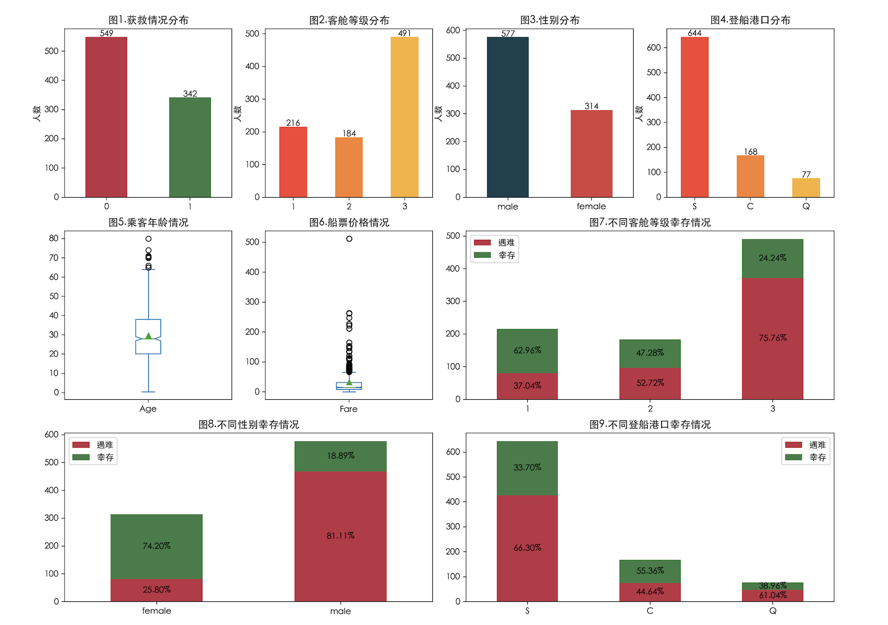
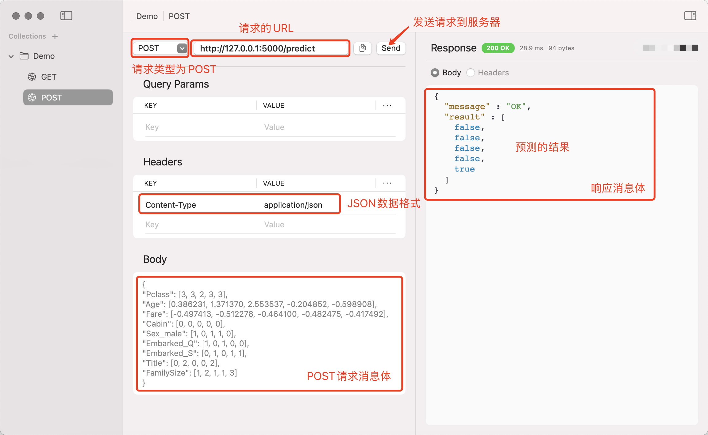

## Machine Learning in Practice

In this chapter, we walk through a complete machine learning application using the classic "Titanic Survival Prediction" project, which comes from the world-renowned data science competition platform [Kaggle](https://www.kaggle.com/). Kaggle is one of the most important communities in the fields of data science, machine learning, and artificial intelligence, providing data scientists and algorithm engineers with a space to practice, share, and compete. Whether you are a beginner or an experienced expert, Kaggle offers a wealth of resources and challenges. Through datasets, competitions, courses, and other resources available on the platform, users can improve their data science skills according to their needs and interact with data scientists from around the world.

The Titanic Survival Prediction project is one of the most well-known beginner-level machine learning projects on Kaggle. The project requires you to predict whether passengers survived the Titanic disaster based on their basic information (such as age, gender, cabin class, port of embarkation, etc.), which is a typical classification task. You can search for the project named "[*Titanic - Machine Learning from Disaster*](https://www.kaggle.com/competitions/titanic/)" under the Competitions section on the Kaggle website. Clicking into it, you can see the project's background introduction and find the download links for the data files `train.csv` and `test.csv` -- the former is the training set (containing features and labels) and the latter is the test set (containing only features). You can download the data files locally and train a model, then submit your predictions. Of course, if you prefer, you can also create a Notebook file online and write and run code there.

### Data Exploration

First, we load the data for training the model. Assuming the data file is saved in a directory named `data` under the current path, the code is as follows.

```python
import numpy as np
import pandas as pd

df = pd.read_csv('data/train.csv', index_col='PassengerId')
df.head(5)
```

Output:

```
			Survived Pclass	Name			Sex		Age		SibSp	Parch	Ticket		Fare	Cabin	Embarked
PassengerId
1			0		 3		Braund, ...	    male	22.0	1		0		A/5 ...		7.2500	NaN		S
2			1		 1		Cumings, ...	female	38.0	1		0		PC ...		71.2833	C85		C
3			1		 3		Heikkinen, ...  female	26.0	0		0		STON/O2 ...	7.9250	NaN		S
4			1		 1		Futrelle, ...   female	35.0	1		0		113803 ...	53.1000	C123	S
5			0		 3		Allen, ...	    male	35.0	0		0		373450 ...	8.0500	NaN		S
```

> **Note**: When loading the data, we directly treated the PassengerID (passenger number) column as the row index.

The following data dictionary explains the meaning of each column in the `DataFrame`.

| Column     | Meaning                      | Description                                                          |
| ---------- | ---------------------------- | -------------------------------------------------------------------- |
| `Survived` | Survival status              | Target class (`1` means survived, `0` means perished)                |
| `Pclass`   | Cabin class                  | Integer, values are `1`, `2`, `3`, representing three different classes |
| `Name`     | Passenger name               | String                                                               |
| `Sex`      | Gender                       | String, `male` for male, `female` for female                         |
| `Age`      | Age                          | Float                                                                |
| `SibSp`    | Number of siblings/spouses aboard | Integer, total number of siblings, sisters, and spouses aboard  |
| `Parch`    | Number of parents/children aboard | Integer                                                         |
| `Ticket`   | Ticket number                | String                                                               |
| `Fare`     | Ticket price                 | Float                                                                |
| `Cabin`    | Cabin number                 | String                                                               |
| `Embarked` | Port of embarkation          | String, `C` for Cherbourg, `Q` for Queenstown, `S` for Southampton  |

We visualize the data to perform an initial exploration through statistical charts, with the code shown below.

```python
import matplotlib.pyplot as plt

# Modify configuration to add Chinese font
plt.rcParams['font.sans-serif'].insert(0, 'SimHei')
plt.rcParams['axes.unicode_minus'] = False

# Set up the canvas
plt.figure(figsize=(16, 12), dpi=200)

# Distribution of perished and survived passengers
plt.subplot(3, 4, 1)
ser = df.Survived.value_counts()
ser.plot(kind='bar', color=['#BE3144', '#3A7D44'])
plt.xticks(rotation=0)
plt.title('Fig 1. Survival Distribution')
plt.ylabel('Count')
plt.xlabel('')
for i, v in enumerate(ser):
    plt.text(i, v, v, ha='center')

# Distribution of cabin class
plt.subplot(3, 4, 2)
ser = df.Pclass.value_counts().sort_index()
ser.plot(kind='bar', color=['#FA4032', '#FA812F', '#FAB12F'])
plt.xticks(rotation=0)
plt.ylabel('Count')
plt.xlabel('')
plt.title('Fig 2. Cabin Class Distribution')
for i, v in enumerate(ser):
    plt.text(i, v, v, ha='center')

# Distribution of gender
plt.subplot(3, 4, 3)
ser = df.Sex.value_counts()
ser.plot(kind='bar', color=['#16404D', '#D84040'])
plt.xticks(rotation=0)
plt.ylabel('Count')
plt.xlabel('')
plt.title('Fig 3. Gender Distribution')
for i, v in enumerate(ser):
    plt.text(i, v, v, ha='center')

# Distribution of embarkation port
plt.subplot(3, 4, 4)
ser = df.Embarked.value_counts()
ser.plot(kind='bar', color=['#FA4032', '#FA812F', '#FAB12F'])
plt.xticks(rotation=0)
plt.ylabel('Count')
plt.xlabel('')
plt.title('Fig 4. Embarkation Port Distribution')
for i, v in enumerate(ser):
    plt.text(i, v, v, ha='center')

# Box plot of passenger age
plt.subplot(3, 4, 5)
df.Age.plot(kind='box', showmeans=True, notch=True)
plt.title('Fig 5. Passenger Age Overview')

# Box plot of ticket fare
plt.subplot(3, 4, 6)
df.Fare.plot(kind='box', showmeans=True, notch=True)
plt.title('Fig 6. Ticket Fare Overview')

# Distribution of perished and survived by cabin class
plt.subplot(3, 4, (7, 8))
s0 = df[df.Survived == 0].Pclass.value_counts()
s1 = df[df.Survived == 1].Pclass.value_counts()
temp = pd.DataFrame({'Perished': s0, 'Survived': s1})
pcts = temp.div(temp.sum(axis=1), axis=0)
temp.plot(ax=plt.gca(), kind='bar', stacked=True, color=['#BE3144', '#3A7D44'])
for i, idx in enumerate(temp.index):
    plt.text(i, temp.at[idx, 'Perished'] // 2, f'{pcts.at[idx, "Perished"]:.2%}', ha='center', va='center')
    plt.text(i, temp.at[idx, 'Perished'] + temp.at[idx, 'Survived'] // 2, f'{pcts.at[idx, "Survived"]:.2%}', ha='center', va='center')
plt.xticks(rotation=0)
plt.xlabel('')
plt.title('Fig 7. Survival by Cabin Class')

# Distribution of perished and survived by gender
plt.subplot(3, 4, (9, 10))
s0 = df[df.Survived == 0].Sex.value_counts()
s1 = df[df.Survived == 1].Sex.value_counts()
temp = pd.DataFrame({'Perished': s0, 'Survived': s1})
pcts = temp.div(temp.sum(axis=1), axis=0)
temp.plot(ax=plt.gca(), kind='bar', stacked=True, color=['#BE3144', '#3A7D44'])
for i, idx in enumerate(temp.index):
    plt.text(i, temp.at[idx, 'Perished'] // 2, f'{pcts.at[idx, "Perished"]:.2%}', ha='center', va='center')
    plt.text(i, temp.at[idx, 'Perished'] + temp.at[idx, 'Survived'] // 2, f'{pcts.at[idx, "Survived"]:.2%}', ha='center', va='center')
plt.xticks(rotation=0)
plt.xlabel('')
plt.title('Fig 8. Survival by Gender')

# Distribution of perished and survived by embarkation port
plt.subplot(3, 4, (11, 12))
s0 = df[df.Survived == 0].Embarked.value_counts()
s1 = df[df.Survived == 1].Embarked.value_counts()
temp = pd.DataFrame({'Perished': s0, 'Survived': s1})
pcts = temp.div(temp.sum(axis=1), axis=0)
temp.plot(ax=plt.gca(), kind='bar', stacked=True, color=['#BE3144', '#3A7D44'])
for i, idx in enumerate(temp.index):
    plt.text(i, temp.at[idx, 'Perished'] // 2, f'{pcts.at[idx, "Perished"]:.2%}', ha='center', va='center')
    plt.text(i, temp.at[idx, 'Perished'] + temp.at[idx, 'Survived'] // 2, f'{pcts.at[idx, "Survived"]:.2%}', ha='center', va='center')
plt.xticks(rotation=0)
plt.xlabel('')
plt.title('Fig 9. Survival by Embarkation Port')

plt.show()
```

Output:



From the statistical charts above, we can see that first-class passengers had a higher survival rate, female passengers had a higher survival rate compared to male passengers, and passengers who embarked at Cherbourg had a higher survival rate than those from the other two ports. If you wish, you can also try cross-combining dimensions such as gender, cabin class, and age to create corresponding statistical charts, or even explore whether the titles in passenger names (`Mr`, `Miss`, `Mrs`, `Dr`, `Master`, `Major`, etc.) have any relationship with survival. Interested readers can investigate this on their own.

Let us further examine the information of the `DataFrame` object.

```python
df.info()
```

Output:

```
<class 'pandas.core.frame.DataFrame'>
Index: 891 entries, 1 to 891
Data columns (total 11 columns):
 #   Column    Non-Null Count  Dtype
---  ------    --------------  -----
 0   Survived  891 non-null    int64
 1   Pclass    891 non-null    int64
 2   Name      891 non-null    object
 3   Sex       891 non-null    object
 4   Age       714 non-null    float64
 5   SibSp     891 non-null    int64
 6   Parch     891 non-null    int64
 7   Ticket    891 non-null    object
 8   Fare      891 non-null    float64
 9   Cabin     204 non-null    object
 10  Embarked  889 non-null    object
dtypes: float64(2), int64(4), object(5)
memory usage: 83.5+ KB
```

We can see that the training set contains a total of `891` records. Among them, columns such as age, cabin number, and embarkation port have missing values. Passenger name, embarkation port, and other columns are string types that cannot be directly used for model training, so we need to do some preparatory work.

### Feature Engineering

Feature Engineering is an important step in machine learning. By processing, transforming, and selecting raw data, we extract features that help the model better understand the data, ultimately improving the model's predictive performance. The main steps of feature engineering include:

1. **Data Cleaning**: Handling missing values, duplicate values, outliers, etc. in the data.

2. **Feature Transformation**: Converting raw data into a form more suitable for model input. Common feature transformation methods include:

    - Standardization and Normalization: Standardization converts data to a distribution with a mean of `0` and a standard deviation of `1`; normalization scales data to a specific range (e.g., $\small{[0, 1]}$), ensuring all features are on the same scale. The corresponding formulas are shown below:
        $$
        X^{\prime} = \frac{X - \mu}{\sigma}
        $$

        $$
        X^{\prime} = \frac{X - X_{min}}{X_{max} - X_{min}}
        $$

        Here, $\small{\mu}$ represents the mean of the data, $\small{\sigma}$ represents the standard deviation of the data, $\small{X_{min}}$ represents the minimum value in the data, and $\small{X_{max}}$ represents the maximum value in the data. The `StandardScaler` and `MinMaxScaler` in the `preprocessing` module of the Scikit-learn library can perform standardization and normalization of data.

    - Category Encoding: For categorical variables (e.g., gender, occupation, region, etc.), commonly used encoding methods include One-Hot Encoding and Label Encoding. The `OneHotEncoder` and `LabelEncoder` in the `preprocessing` module of the Scikit-learn library can perform one-hot encoding and label encoding. You can also use the `get_dummies` function from the pandas library to handle categorical variables in a `DataFrame`.

    - Log Transformation: Log transformation can help handle features with skewed distributions, making them closer to a normal distribution.

3. **Feature Selection**: Selecting features that are useful for model prediction from a large number of features, removing redundant or irrelevant features to reduce dimensionality and improve model performance. Common methods include:

    - **Filter Methods**: Selecting the most discriminative features based on statistical tests (e.g., chi-square test, Pearson correlation coefficient, etc.).
    - **Wrapper Methods**: Evaluating the effectiveness of feature subsets through model performance (e.g., Recursive Feature Elimination).
    - **Embedded Methods**: Extracting feature importance from trained models (e.g., decision trees, L1 regularization, etc.) for feature selection.

4. **Dimensionality Reduction**: Mapping data from a high-dimensional space to a low-dimensional space through mathematical transformations, preserving the main information of the data and simplifying the model. The new features after dimensionality reduction are some combination of the original features. Dimensionality reduction can reduce the computation required for model training and reduce complexity by removing unnecessary noise and redundant features, thereby improving the model's generalization ability. Common methods for dimensionality reduction include:

    - **PCA** (Principal Component Analysis): The goal of PCA is to find the most important features (principal components) in the data that retain most of the data's variance. PCA projects data onto new coordinate axes through linear transformation, maximizing the variance of the projected data. In other words, PCA "rotates" the data features and transforms them into a new coordinate system, where each axis (i.e., principal component) is arranged by the magnitude of data variance. The first few principal components can usually explain most of the data's variation. The `PCA` class in the `decomposition` module of the Scikit-learn library can help us perform principal component analysis.
    - **LDA** (Linear Discriminant Analysis): The main goal of LDA is to find the optimal projection direction to maximize the separability between different classes while minimizing the spread of data points within the same class. LDA finds a low-dimensional space in the feature space where the differences between classes are as large as possible and the data within the same class is as clustered as possible. In simple terms, the core idea of LDA is to **maximize inter-class scatter and minimize intra-class scatter**. The `LinearDiscriminantAnalysis` class in the `discriminant_analysis` module of the Scikit-learn library can help us perform linear discriminant analysis.
    - **t-SNE** (t-Distributed Stochastic Neighbor Embedding): t-SNE is a nonlinear dimensionality reduction method mainly used for data visualization, especially suitable for dimensionality reduction of high-dimensional data (such as images, text, etc.). The goal of t-SNE is to map similar points (neighboring points) in the high-dimensional space to nearby positions in the low-dimensional space while avoiding overlap between different classes as much as possible. The `TSNE` class in the `manifold` module of the Scikit-learn library can help us perform t-distributed stochastic neighbor embedding.

5. **Feature Construction**: Creating new features through combination, transformation, or derivation of original features.

Feature engineering is not only a key factor in improving model accuracy but also a process in machine learning that requires continuous optimization. Through careful cleaning, transformation, selection, and construction of data, we can provide more valuable information to the model and improve its performance. Although feature engineering may seem complex, its effect in many cases exceeds improvements from the model itself. Therefore, in practice, we should invest sufficient effort and time in optimizing feature engineering.

For our loaded dataset, we can fill the missing values in the age field with the median, fill the missing values in the embarkation port with the mode, and for the cabin number field which has many missing values, one approach is to simply drop the column, and another is to binarize it -- marking `1` for records that have a cabin number and `0` for those that do not. The code is as follows.

```python
df['Age'] = df.Age.fillna(df.Age.median())
df['Embarked'] = df.Embarked.fillna(df.Embarked.mode()[0])
df['Cabin'] = df.Cabin.replace(r'.+', '1', regex=True).replace(np.nan, 0).astype('i8')
```

After handling the missing values, we perform feature scaling on the age and ticket fare fields using `StandardScaler` for standardization, as shown below.

```python
from sklearn.preprocessing import StandardScaler

scaler = StandardScaler()
df[['Fare', 'Age']] = scaler.fit_transform(df[['Fare', 'Age']])
```

Next, we also need to apply one-hot encoding to the gender and embarkation port fields. This can be done using the `get_dummies` function from the pandas library or the `OneHotEncoder` from the scikit-learn library. Both produce similar results, as shown below.

```python
df = pd.get_dummies(df, columns=['Sex', 'Embarked'], drop_first=True)
```

We continue to process the passenger name field by deriving a new feature from the title in the name. Additionally, for the `SibSp` and `Parch` fields, we can derive a new feature representing the family size, as shown below.

```python
title_mapping = {
    'Mr': 0, 'Miss': 1, 'Mrs': 2, 'Master': 3, 'Dr': 4, 'Rev': 5, 'Col': 6, 'Major': 7,
    'Mlle': 8, 'Ms': 9, 'Lady': 10, 'Sir': 11, 'Jonkheer': 12, 'Don': 13, 'Dona': 14, 'Countess': 15
}
df['Title'] = df['Name'].map(
    lambda x: x.split(',')[1].split('.')[0].strip()
).map(title_mapping).fillna(-1)
df['FamilySize'] = df['SibSp'] + df['Parch'] + 1
```

> **Note**: We map each title to a number. There is no need to worry too much about the correspondence between titles and numbers, and some titles may not appear in our training set. For unknown titles, we uniformly assign a value of `-1`.

After completing the above operations, we can remove all unnecessary fields, and the data preparation is essentially done.

```python
df.drop(columns=['Name', 'SibSp', 'Parch', 'Ticket'], inplace=True)
```

### Model Training

First, we split the dataset into a training set and a validation set. Note that this is not splitting into a training set and a test set, because our final test set is the officially provided `test.csv` file. Here, we allocate 90% of the data from `train.csv` for training the model and use the remaining 10% to validate the model. In the code below, we name the validation set's features and labels `X_valid` and `y_valid`, respectively.

```python
from sklearn.model_selection import train_test_split

X, y = df.drop(columns='Survived'), df.Survived
X_train, X_valid, y_train, y_valid = train_test_split(X, y, train_size=0.9, random_state=3)
```

Let us first try a logistic regression model, as shown below.

```python
from sklearn.linear_model import LogisticRegression
from sklearn.metrics import classification_report

model = LogisticRegression(penalty='l1', tol=1e-6, solver='liblinear')
model.fit(X_train, y_train)
y_pred = model.predict(X_valid)
print(classification_report(y_valid, y_pred))
```

Output:

```
              precision    recall  f1-score   support

           0       0.88      0.80      0.84        56
           1       0.72      0.82      0.77        34

    accuracy                           0.81        90
   macro avg       0.80      0.81      0.80        90
weighted avg       0.82      0.81      0.81        90
```

Now let us try the heavy hitter -- XGBoost, as shown below.

```python
import xgboost as xgb

# Convert data to DMatrix format
dm_train = xgb.DMatrix(X_train, y_train)
dm_valid = xgb.DMatrix(X_valid)

# Set model parameters
params = {
    'booster': 'gbtree',             # Type of base learner for training
    'objective': 'binary:logistic',  # Specifies the model's loss function
    'gamma': 0.1,                    # Minimum loss reduction required for each split
    'max_depth': 10,                 # Maximum depth of decision tree
    'lambda': 0.5,                   # L2 regularization weight
    'subsample': 0.8,                # Proportion of samples randomly selected for each tree
    'colsample_bytree': 0.8,        # Proportion of features selected for each tree or node
    'eta': 0.05,                     # Learning rate
    'seed': 3,                       # Seed for the random number generator
    'nthread': 16,                   # Number of parallel threads used for training
}

model = xgb.train(params, dm_train, num_boost_round=200)
y_pred = model.predict(dm_valid)
# Convert predicted probabilities to class labels
y_pred_label = (y_pred > 0.5).astype('i8')
print(classification_report(y_valid, y_pred_label))
```

Output:

```
              precision    recall  f1-score   support

           0       0.89      0.91      0.90        56
           1       0.85      0.82      0.84        34

    accuracy                           0.88        90
   macro avg       0.87      0.87      0.87        90
weighted avg       0.88      0.88      0.88        90
```

Of course, when conditions allow, it is **strongly recommended** to tune the model's hyperparameters through grid search with cross-validation. We can also plot a **learning curve** to help determine whether overfitting or underfitting is occurring. A learning curve contains two curves: one reflecting the training error and one reflecting the validation error. Underfitting typically manifests as large errors on both the training and validation sets, with the gap between training error and validation error remaining small as training data increases, indicating that our model is too simple to capture the patterns in the data. Overfitting typically manifests as the model performing well on the training set (low training error) but poorly on the validation set (high validation error). When the training error continues to decrease while the validation error starts to increase as more training data is added, it indicates that our model is too complex. The `learning_curve` function in the `model_selection` module of the Scikit-learn library can help us plot learning curves. Interested readers can explore this on their own.

### Model Evaluation

Next, we load the actual test data `test.csv` and make predictions using the model we trained earlier. We can save the prediction results as a CSV file with two columns: one for PassengerID and one for our predicted results. We submit this file to the Kaggle platform to obtain the final model accuracy score.

```python
test = pd.read_csv('data/test.csv', index_col='PassengerId')
# Handle missing values
test['Age'] = test.Age.fillna(test.Age.median())
test['Fare'] = test.Fare.fillna(test.Fare.median())
test['Embarked'] = test.Embarked.fillna(test.Embarked.mode()[0])
test['Cabin'] = test.Cabin.replace(r'.+', '1', regex=True).replace(np.nan, 0).astype('i8')
# Feature scaling
test[['Fare', 'Age']] = scaler.fit_transform(test[['Fare', 'Age']])
# Handle categories
test = pd.get_dummies(test, columns=['Sex', 'Embarked'], drop_first=True)
# Feature construction
test['Title'] = test['Name'].apply(lambda x: x.split(',')[1].split('.')[0].strip()).map(title_mapping).fillna(-1)
test['FamilySize'] = test['SibSp'] + test['Parch'] + 1
# Drop unnecessary features
test.drop(columns=['Name', 'Ticket', 'SibSp', 'Parch'], inplace=True)

# Using logistic regression model
passenger_id, X_test = test.index, test
# Using XGBoost model
# passenger_id, X_test = test.index, xgb.DMatrix(test)

y_test_pred = model.predict(X_test)
# XGBoost model - Convert predicted probabilities to class labels
# y_test_pred = (model.predict(X_test) > 0.5).astype('i8')

# Generate submission file
result = pd.DataFrame({
    'PassengerId': passenger_id,
    'Survived': y_test_pred
})
result.to_csv('submission.csv', index=False)
```

You can try different models and see whether there are significant differences in prediction results, and which model you consider the most ideal. You can also verify through experiments the point we made earlier -- whether feature engineering has a significant impact on prediction results. Below are some of my suggestions for feature engineering (for reference only). You can try them out and see if these operations can improve the model's performance.

1. Discretize (bin) the Age field and handle very young passengers (children) separately (e.g., add a boolean field).
2. Process the Cabin field more carefully by extracting the prefix letter and the following numbers as features, rather than simply binarizing it.
3. Combine the two important features Pclass (cabin class) and Sex (gender) into a combined feature.
4. Handle passengers whose Name contains "Mrs" and whose Parch (parents/children aboard) is greater than 1 (likely a mother) separately (e.g., add a boolean field).
5. Drop the Embarked (embarkation port) field.

### Model Deployment

We can deploy the trained model into a production project. First, we need to serialize the model, as shown below.

```python
import joblib

joblib.dump(model, 'model.pkl')
```

> **Note**: Here we assume that the `model` object in the code above is the model previously trained with XGBoost.

The `dump` function of the `joblib` module performs Pickle serialization (Python's proprietary serialization protocol) on the model. Where the model is needed, we can use the `load` function to deserialize it, loading the model into an application to make predictions, as shown below.

```python
import joblib

model = joblib.load('model.pkl')
model.predict(X_test)
```

> **Note**: Here we assume that `X_test` in the code above has already been converted to a `DMatrix` object for XGBoost.

If we want to deploy the model as a web service, we can use web frameworks like Flask or FastAPI to create API endpoints. Below, we use Flask as an example to demonstrate this process with simple code.

```python
from flask import Flask
from flask import jsonify
from flask import request

import joblib
import pandas as pd
import xgboost as xgb

app = Flask(__name__)


@app.route('/predict', methods=['POST'])
def predict():
    query_df = pd.DataFrame(request.json)
    model = joblib.load('model.pkl')
    y_pred = (model.predict(xgb.DMatrix(query_df)) > 0.5).tolist()
    return jsonify({'message': 'OK', 'result': y_pred})


if __name__ == '__main__':
    app.run(debug=True)
```

> **Note**: In a production project, you should never load the model only when a request arrives, as this would severely impact the performance of the web service. The model should be loaded at an appropriate time after the project starts up. At the same time, you should also monitor the resource usage of the model based on actual requirements.

Running the code above will start a web server on port 5000 of the local machine by default. Below, we use an API testing tool to simulate sending an HTTP request to the server and see if our model can run properly and produce predictions.



In addition to deploying the model as a web service, we can also deploy the model in scheduled tasks that automatically trigger model invocations at specified times. Furthermore, some edge devices support embedding trained models in certain special formats. Interested readers can explore this on their own.
