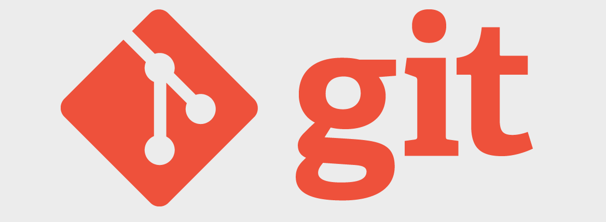
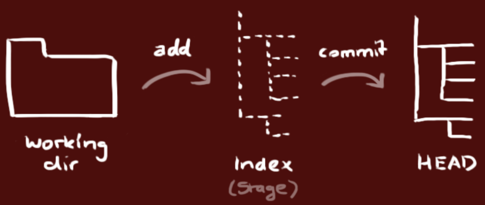
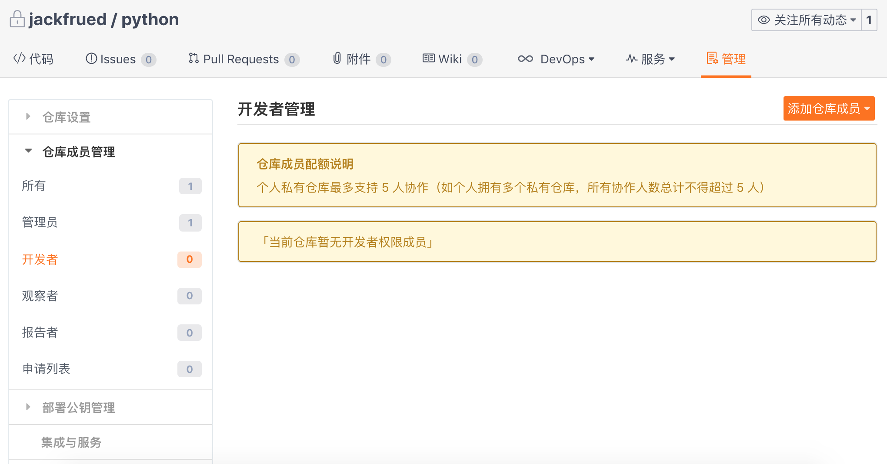
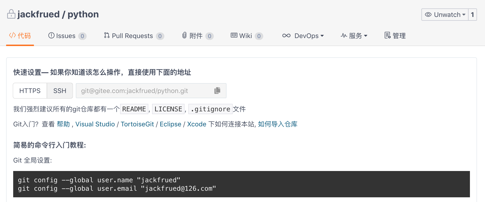
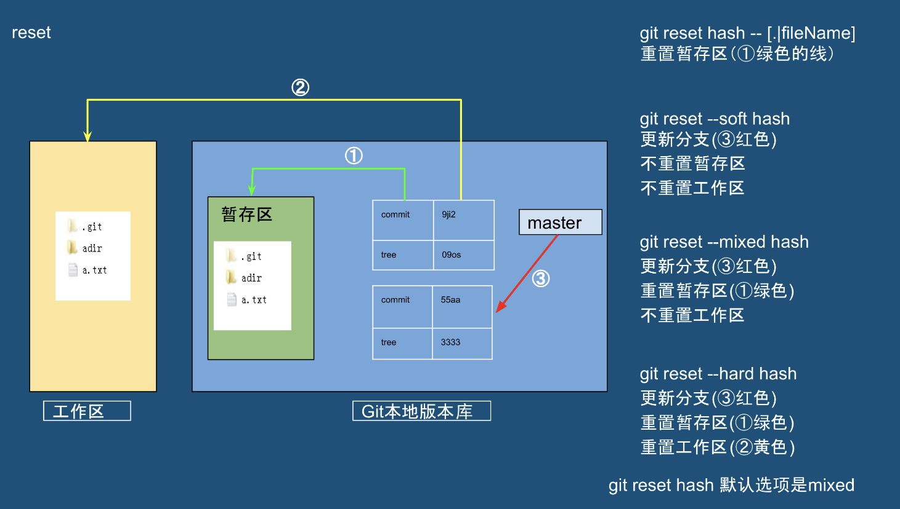
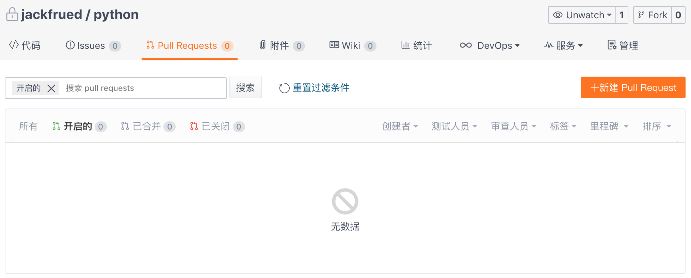
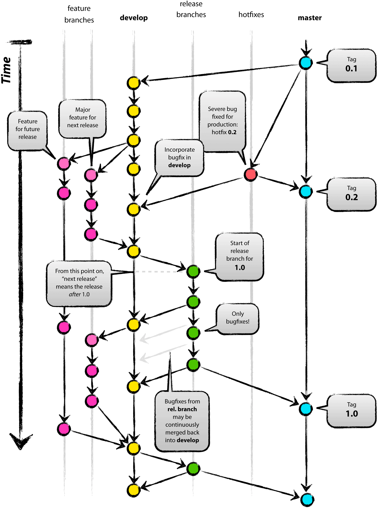
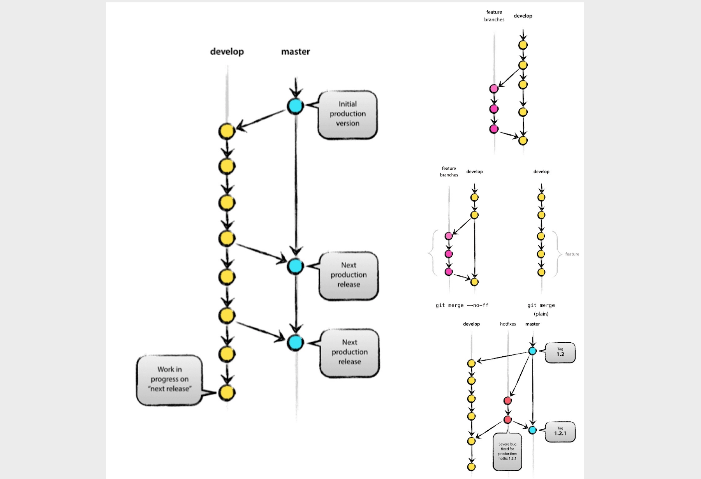
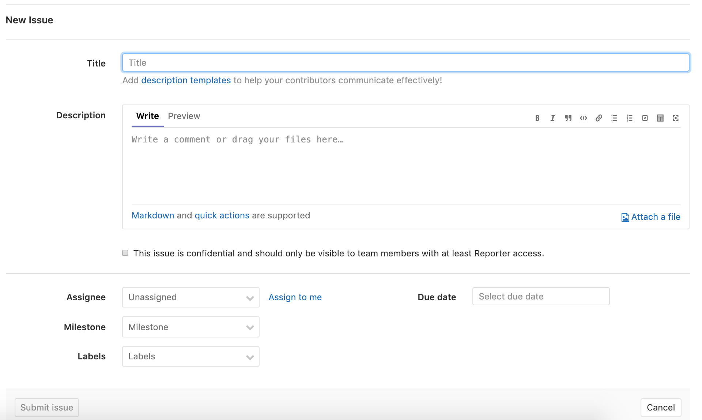
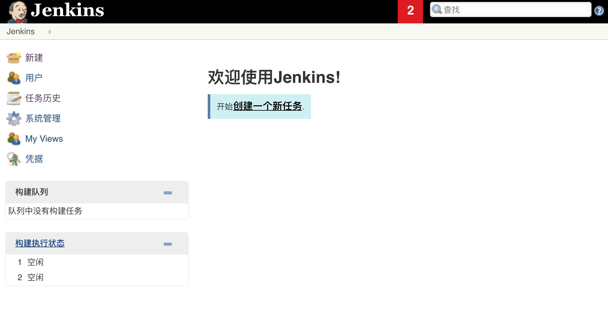

## Problems and Solutions in Team Project Development

The terms individual development and team development should be familiar to everyone. Individual development means one person controls all aspects of a product, while team development involves multiple people working together to complete product development. To implement team development, the following points are indispensable:

1. Managing and sharing various events during the development process (e.g., who completed what by what time).
2. Sharing various work outputs and new knowledge and techniques within the team.
3. Managing changes to work outputs - both preventing outputs from being damaged and ensuring that each member can work in parallel using existing outputs.
4. Proving that the software developed by the team can function properly at any time.
5. Using automated workflows so that team members can correctly implement development, testing, and deployment.

### Common Problems in Team Project Development

Team development, compared to individual development, is more likely to encounter the following types of problems.

#### Problem 1: Traditional communication methods cannot determine processing priorities

For example: Using email for communication may result in too many emails causing important ones to be buried, inability to manage status, not knowing which issues have been resolved and which remain unaddressed, and searching emails via full-text search for related issues is extremely inefficient.

Solution: Use defect management tools.

#### Problem 2: No environment available for verification

For example: After receiving a fault report from the production environment, it takes a long time to reproduce the production environment.

Solution: Implement continuous delivery.

#### Problem 3: Using alias directories to manage project branches

Solution: Implement version control.

#### Problem 4: Recreating the database is very difficult

For example: Inconsistencies between the production and development environment database table structures or inconsistent column ordering in certain tables.

Solution: Implement version control.

#### Problem 5: Problems cannot be detected without running the system

For example: Fixing one bug may introduce other bugs or cause system regression, incorrect use of the version system may overwrite other people's modifications, modifications may interfere with each other, and if problems are not discovered early, tracing them months later becomes very troublesome.

Solution: Implement continuous integration - frequently and continuously build and test the team members' work outputs.

#### Problem 6: Overwriting code fixed by other members

Solution: Implement version control.

#### Problem 7: Unable to perform code refactoring

For example: Performing code refactoring (adjusting the internal structure of code without affecting the code's output) may cause regression.

Solution: A large number of reusable tests and implementing continuous integration.

#### Problem 8: Unable to track regression without knowing the bug fix date

Solution: The version control system, defect management system, and continuous integration need to interact with each other, and ideally should be integrated with automated deployment tools.

#### Problem 9: The release process is too complex

Solution: Implement continuous delivery.

Based on the discussion and analysis of the above problems, we can basically draw the following conclusion: in team development, version control, defect management, and continuous integration are all very important and indispensable.

### Version Control

Based on the series of problems mentioned above, we can draw a simple conclusion: version control is the primary prerequisite for implementing team development. Various information generated during the product development process must be managed through version control, including:

1. Code.
2. Requirements and design related documents.
3. Database schemas and initial data.
4. Configuration files.
5. Library dependency definitions.

#### Introduction to Git



Git is an open-source distributed version control system born in 2005. It was originally developed by Linus Torvalds (the father of Linux) to help manage Linux kernel development. Unlike commonly used version control tools such as Subversion, Git uses distributed version control, which allows version control to be implemented even without central server support.

For those with Subversion (hereafter referred to as SVN) experience, the commonality between Git and SVN is that both abandoned the traditional lock-based version control (early CVS and VSS used locking mode, where when one developer edited a file, that file was locked and other developers could not edit it during that period) in favor of more efficient merge-based version control. The differences between the two are:

1. Git is distributed while SVN is centralized; SVN requires central server support to work.
2. Git stores content as metadata, while SVN stores by file, hiding file meta-information in a .svn folder.
3. Git branches are different from SVN branches; SVN's handling of branches is quite cumbersome.
4. Git has no global version number, but you can maintain version tags yourself.
5. Git's content integrity is superior to SVN's. Git uses SHA-1 hashing for content storage, which ensures code content integrity and reduces damage to the repository in the event of disk failure or network issues.

In summary, **Git is truly amazing!!!**

#### Installing Git

You can find the Git download link for your system on the [Git official website](http://git-scm.com/) and install it. Installing Git on macOS and Windows is very straightforward. On Linux, if you want to install the latest official version, it is recommended to build and install from the official Git source code, with the following steps (using CentOS as an example).

Download the Git source code compressed file.

```Shell
wget https://mirrors.edge.kernel.org/pub/software/scm/git/git-2.23.0.tar.xz
```

Decompress and extract.

```Shell
xz -d git-2.23.0.tar.xz
tar -xvf git-2.23.0.tar
```

Install underlying dependency libraries.

```Shell
yum -y install libcurl-devel
```

> Note: Without this dependency library, Git's network features will not work.

Pre-installation configuration.

```Shell
cd git-2.23.0
./configure --prefix=/usr/local
```

Build and install.

```Shell
make && make install
```

After successful installation, you can type the following command in the terminal to check your Git version.

```Shell
git --version
```

If you have never used Git before, you can first read ["git - the simple guide"](http://www.bootcss.com/p/git-guide/) to get a general understanding of Git.

#### Git Local Operations

You can use the following command to turn a folder into a Git repository.
```Shell
git init
```

After completing the above operation, your local directory will look like the following. The left side of the diagram below is your working directory (the working directory you are operating on), while the right side is your local repository. Between them is the staging area (also called the cache area) between the working directory and local repository.



> **Tip**: Using `ls -la` to view all files will reveal that after executing the above command, a hidden folder named `.git` has appeared in the directory. This is the local Git repository.

You can add specified files or all files to the staging area using `git add`.

```Shell
git add <file>
git add .
```

At this point, you can use the following command to check the status of the working directory, staging area, and local repository.

```Shell
git status
```

> **Tip**: If you don't want to add a file to the staging area, you can follow the prompt and use the `git rm --cached <file>` command to move the file back from the staging area to the working directory.

If the working directory files are modified again at this point, making the working directory and staging area contents different, running `git status` again will show which file(s) were modified. If you want to restore the working directory using the staging area contents, you can use the following command.

```Shell
git restore <file>
git restore .
```

> **Note**: The above command is still experimental. In earlier versions of Git, the corresponding command was `git checkout -- <file>`. Since `git checkout` can also be used to switch branches, which causes confusion, the latest version of Git has assigned these two functions to two new commands: one is `git restore` above, and the other is `git switch`.

If you are using Git for the first time, you need to configure your username and email before you can commit code to the repository.

```Shell
git config --global user.name "jackfrued"
git config --global user.email "jackfrued@126.com"
```

> **Tip**: You can use `git config --list` to view Git's configuration information.

You can commit the staging area contents to the local repository with the following command.

```Shell
git commit -m 'Description of this commit'
```

You can view the log for each commit using `git log`.

```Shell
git log
git log --graph --oneline --abbrev-commit
```

#### Git Server Overview

Unlike SVN, Git does not necessarily need a central server to work. All the version control operations we demonstrated above were performed locally. However, for enterprise development with multi-person collaboration, central server support is still needed. Typically, enterprises can choose to use code hosting platforms (such as [GitHub](https://github.com)) or set up their own Git private server. Of course, most enterprises prefer the latter. GitHub was founded in April 2008 and is currently the world's largest code hosting platform, supporting enterprise users (who can create private repositories with content not visible to the public) and regular users (limited use of private repositories, unlimited use of public repositories with content visible to others). GitHub's amazing growth rate of code repositories proves it is very successful. It was acquired by Microsoft for a staggering $7.5 billion in June 2018.

There are also many similar code hosting platforms in China, the most famous being [Gitee](https://gitee.com/) and [CODING](https://coding.net/). Currently, both Gitee and CODING provide registered users with limited use of private repositories, support **Pull Requests** (a conversation mechanism that allows relevant people or teams to notice when you submit your work), and also provide support for **defect management**, **Webhooks**, and other features. These give the version control system defect management and continuous integration capabilities. Of course, many companies are unwilling to host their commercial code on other platforms. Such companies can use [GitLab](<https://about.gitlab.com/>) to set up their internal Git private server. The specific method will be introduced in the next chapter.


Here we will use Gitee as an example to explain some considerations when using a Git server. First, you need to register an account on Gitee (you can also use third-party login with GitHub, WeChat, Sina Weibo, CSDN accounts, etc.). After logging in successfully, you can create a project. Creating a project is almost self-explanatory, so we will only explain a few points.

1. When creating a project, it is not recommended to check the options shown in the image below. The programming language can be left unselected for now, and the `.gitignore` template can also be written later by yourself or automatically generated through more professional tools (such as the <http://gitignore.io/> website).

   

2. Adding project members. After creating a project, you can find the "Member Management" feature in the project's "Settings" or "Management". This allows you to set other developers as members of the project team. Project members are typically divided into roles such as "Owner", "Manager", "Regular Member", and "Restricted Member".

   

3. Project branches. After creating a project, it only has one default **master** branch. This branch should be set as a "protected branch" to prevent members other than project managers from modifying it (no direct commits). Of course, we can also create new code branches online if needed.

4. Setting up public keys for password-free access. In the project's "Settings" or "Management", we can also find the "Deploy Key Management" option. By adding deploy keys, you can access the server via SSH (secure remote connection) without entering a username and password each time. You can use the `ssh-keygen` command to create key pairs.

   ```Shell
   ssh-keygen -t rsa -b 2048 -C "your_email@example.com"
   ```

   > **Note**: The key pair generated by the above command is in the `~/.ssh` directory. The default name for the public key file is `id_rsa.pub`, and you can view your public key using `cat id_rsa.pub`. Windows users can enter the above command through **Git Bash** after installing the Git tool.

#### Git Remote Operations

With a Git server, we can push our work outputs to the server repository and update other people's work outputs from the server repository to our local machine. Using the repository we just created on Gitee (repository name: `python`) as an example, let's explain how to perform remote operations. You can find the repository address (URL) on the page shown below. If **SSH Key** is configured, use SSH to access the repository; otherwise, use HTTPS, which requires providing a username and password for remote operations.



1. Add a remote repository (Git server).

   ```Shell
   git remote add origin git@gitee.com:jackfrued/python.git
   ```

   Here `git@gitee.com:jackfrued/python.git` is the repository URL shown in the image above, and `origin` is a string that replaces this long URL. Simply put, `origin` is an alias for the repository on the server (if there are multiple Git servers, there will be multiple short names). You can use `git remote -v` to view configured Git services, and `git remote remove` to remove a specified Git server.

2. Push local code (work outputs) to the remote repository.

   ```Shell
   git push -u origin master:master
   ```

   Here, `-u` is short for `--set-upstream`, used to specify the server repository to push to. The `origin` after it is the short alias we just gave the repository. `master` before the colon is the local branch name, and `master` after the colon is the remote branch name. If the local branch `master` has already been associated with the remote branch `master`, the colon and everything after it can be omitted.

3. Pull code from the remote repository.

   ```Shell
   git pull origin master
   ```

#### Git Branch Operations

1. **Creating** and **switching** branches. The following commands create a branch named `dev` and switch to it.

   ```Shell
   git branch <branch-name>
   git switch <branch-name>
   ```

   or

   ```Shell
   git switch -c <branch-name>
   ```

   > **Note**: In previous Git versions, `git checkout <branch-name>` was used to switch branches, and `git checkout -b <branch-name>` to create and switch branches. The `git switch` command is still experimental, but it clearly expresses what it does.

2. **Associating with remote** branches. For example: if the current branch has not been associated with a remote branch, the following command can establish the association.

   ```Shell
   git branch --set-upstream-to origin/develop
   ```

   To associate a specified branch with a remote branch, do the following.

   ```Shell
   git branch --set-upstream-to origin/develop <branch-name>
   ```

   > Tip: The above operation assumes a branch named `develop` exists on the Git server. `--set-upstream-to` can be abbreviated to `-u`.

   Of course, when creating a branch, if you use the `--track` parameter, you can directly specify the remote branch associated with the local branch, as shown below.

   ```Shell
   git branch --track <branch-name> origin/develop
   ```

   To disassociate a local branch from a remote branch, use the following command.

   ```Shell
   git branch --unset-upstream <branch-name>
   ```

3. Branch **merging**. For example, after completing development tasks on the `dev` branch, if you want to merge the results from `dev` into `master`, you can switch back to `master` and then use `git merge` to perform the branch merge. The merge result is shown in the upper right of the diagram.

   ```Shell
   git switch master
   git merge --no-ff dev
   ```

   When merging branches with `git merge`, the default is `Fast Forward` merge, which means if the branch is deleted, all information on the branch is lost. If you want to preserve the history of the branch, you can use the `--no-ff` parameter to disable `Fast Forward`.

   During branch merging, Git will automatically merge parts without conflicts. If a conflict occurs (e.g., both `dev` and `master` branches modified the same file), you will see the message `CONFLICT (content): Merge conflict in <filename>. Automatic merge failed; fix conflicts and then commit the result`. At this point, we can use `git diff` to view the conflicting content. Resolving conflicts usually requires face-to-face communication between the parties involved to decide whose version to keep. After resolving conflicts, the code needs to be recommitted.

4. Branch **rebasing**. Branch merge operations can ultimately merge work outputs from multiple branches onto one branch, but after many merge operations, branches may become very messy and complex. To solve this problem, you can use `git rebase` to perform branch rebasing. As shown in the diagram below, when we want to unify the work outputs from `master` and `dev`, we can also use a rebase operation.

   

   ```Shell
   git rebase master
   git switch master
   git merge dev
   ```

   When we execute `git rebase` on the `dev` branch, it first calculates the difference between `dev` and `master` branches, then applies that difference to the `dev` branch. Finally, we switch back to `master` and perform the merge operation, resulting in the clean branch shown in the lower right of the diagram above.

5. **Deleting** branches. Deleting a branch can be done using `git branch` with the `-d` parameter. If the work on the branch has not been merged, deleting the branch will show `error: The branch '<branch-name>' is not fully merged.`. If you want to force delete the branch, use the `-D` parameter. The branch deletion operation is shown below.

   ```Shell
   git branch -d <branch-name>
   error: The branch '<branch-name>' is not fully merged.
   If you are sure you want to delete it, run 'git branch -D <branch-name>'.
   git branch -D <branch-name>
   ```

   To delete a remote branch, you can use the following commands, but please proceed with caution.

   ```Shell
   git branch -r -d origin/develop
   git push origin :develop
   ```

   or

   ```Shell
   git push origin --delete develop
   ```

#### Other Git Operations

1. `git fetch`: Downloads all changes from the remote repository. It can download the remote repository to a temporary branch, and then merge as needed. The `git fetch` command and `git merge` command can be seen as the decomposed actions of the previously mentioned `git pull` command.

   ```Shell
   git fetch origin master:temp
   git merge temp
   ```

2. `git diff`: Commonly used to compare differences between the working directory and repository, staging area and repository, or two branches.

3. `git stash`: Stores the current changes in the working directory and staging area to a temporary area, making the working directory clean. This command is suitable for situations where your current work has not been committed, but you suddenly need to handle a more urgent task (such as fixing a production bug).

   ```Shell
   git stash
   git stash list
   git stash pop
   ```

4. `git reset`: Reverts to a specified version. This command has three main parameters, as shown in the diagram below.

   

5. `git cherry-pick`: Picks a single commit from a branch and introduces it as a new commit on your current branch.

6. `git revert`: Reverts commit information.

7. `git tag`: Commonly used to view or add tags.

#### Git Workflow (Branch Management Strategy)

Since Git is an essential tool for team development, there must be a standardized workflow for team collaboration so the team can work efficiently and the project can progress smoothly. Otherwise, no matter how powerful the tool is, if team members each work independently, conflicts will be everywhere and collaboration will be impossible. Using the `python` project created on Gitee as an example, let's explain Git branch management strategies.

##### GitHub-flow

1. Clone the server code to local.

   ```Shell
   git clone git@gitee.com:jackfrued/python.git
   ```

2. Create and switch to your own branch.

   ```Shell
   git switch -c <branch-name>
   ```

   or

   ```Shell
   git checkout -b <branch-name>
   ```

3. Develop on your own branch and perform local version control.

4. Push your branch (work outputs) to the server.

   ```Shell
   git push origin <branch-name>
   ```

5. Initiate a merge request online (commonly called a **Pull Request**, sometimes called a **Merge Request**), requesting to merge your work outputs into the `master` branch. After merging, the branch can be deleted.

   

This branch management strategy is known as **GitHub-flow** or **PR** workflow. It is very simple and easy to understand, with only the following points to note:

1. The content in `master` is always ready to be released (no direct modifications on `master`).
2. New branches should be created based on `master` for development (daily development tasks are done on your own branch).
3. Branches are version-controlled locally first, then periodically pushed to the server as same-named branches.
4. After development tasks are completed, send a merge request to `master`.
5. After the merge request passes review, merge into `master`, and deploy to the production environment from `master`.

Of course, the disadvantage of GitHub-flow is also obvious. The `master` branch is by default the current production code, but sometimes merging work outputs into `master` does not mean it can be released immediately, which causes the production version to lag behind the `master` branch.

##### Git-flow

Besides the GitHub-flow branch management strategy mentioned above, there is another strategy called Git-flow, which is the workflow most companies are willing to use. Git-flow borrows the strengths of centralized version control systems, establishing unified methods for creating, merging, and closing branches within the team, as shown in the diagram below.



In this model, the project has two long-lived branches: `master` and `develop`. All others are temporary auxiliary branches, including `feature` (branches for developing specific features, merged into `develop` after development), `release` (branches separated from `develop` for release preparation, merged into both `master` and `develop` after release), and `hotfix` (branches urgently created from `master` after a production issue is found, merged into `master` with a tag after the fix, and also merged into `develop` to prevent future versions from missing this fix; if there is an ongoing `release` branch, it should also be merged into `release`). The specific process is as follows:



1. Initially, there are only `master` and `develop` branches, as shown on the left side of the diagram.

2. Create a `feature` branch from `develop` (upper right of diagram), merge work outputs back to `develop` after completion (middle right of diagram).

   Creating a `feature` branch:

   ```Shell
   git switch -c feature/user develop
   ```

   or

   ```Shell
   git checkout -b feature/user develop
   ```

   Next is developing and version controlling on the `feature` branch, which we won't elaborate on further. After work is complete, merge the `feature` branch into `develop`:

   ```Shell
   git checkout develop
   git merge --no-ff feature/user
   git branch -d feature/user
   git push origin develop
   ```

3. Create a `release` branch from `develop`, merge back into both `master` and `develop` after release.

   Creating a `release` branch:

   ```Shell
   git checkout -b release-0.1 develop
   git push -u origin release-0.1
   ... ... ...
   git pull
   git commit -a -m "............"
   ```

   Merging the `release` branch back into `master` and `develop`:

   ```Shell
   git checkout master
   git merge --no-ff release-0.1
   git push

   git checkout develop
   git merge --no-ff release-0.1
   git push

   git branch -d release-0.1
   git push --delete release-0.1
   git tag v0.1 master
   git push --tags
   ```

4. Create a `hotfix` branch from `master`, merge into both `develop` and `master` after fixing the bug (lower right of diagram).

   Creating a `hotfix` branch:

   ```Shell
   git checkout -b hotfix-0.1.1 master
   git push -u origin hotfix-0.1.1
   ... ... ...
   git pull
   git commit -a -m "............"
   ```

   Merging the `hotfix` branch back into `develop` and `master`.

   ```Shell
   git checkout master
   git merge --no-ff hotfix-0.1.1
   git push

   git checkout develop
   git merge --no-ff hotfix-0.1.1
   git push

   git branch -d hotfix-0.1.1
   git push --delete hotfix-0.1.1
   git tag v0.1.1 master
   git push --tags
   ```

The Git-flow process makes it relatively easy to control the state of each branch, but it is much more complex to use than GitHub-flow. Therefore, in practice, the command-line tool named `gitflow` (which comes with Git on Windows) or graphical Git tools (such as SmartGit, SourceTree, etc.) are usually installed to simplify operations. For details, please refer to the article ["The git-flow Workflow"](<https://www.git-tower.com/learn/git/ebook/cn/command-line/advanced-topics/git-flow>), as it is already well-written and we won't elaborate further here.

### Defect Management

Without good team management tools, project progress will inevitably be hindered and task management will be difficult. Introducing a defect management system can solve these problems. Typically, a defect management system includes the following features:

1. Task management (including what must be done, who does it, when it should be completed, current status, etc.).
2. Intuitive and searchable history of past issues.
3. Unified management and sharing of information.
4. Ability to generate various reports.
5. Ability to link to other systems with extensibility.

#### ZenTao

[ZenTao](<https://www.zentao.net/>) is a professional domestic project management software. It is not just a defect management tool; it provides complete software lifecycle management features, supports [Scrum agile development](<http://www.scrumcn.com/agile/scrum-knowledge-library/scrum.html>), and can implement requirements management, defect management, task management, and a series of other functions, with powerful extension mechanisms and rich feature plugins. You can download ZenTao from the [download link](<https://www.zentao.net/download.html>) provided on the ZenTao official website. The one-click installation package is recommended.

Below, using CentOS Linux as an example, we explain how to install ZenTao using the official one-click installation package.

```Shell
cd /opt
wget http://dl.cnezsoft.com/zentao/pro8.5.2/ZenTaoPMS.pro8.5.2.zbox_64.tar.gz
gunzip ZenTaoPMS.pro8.5.2.zbox_64.tar.gz
tar -xvf ZenTaoPMS.pro8.5.2.zbox_64.tar
```

We downloaded the ZenTao archive compressed file in the `/opt` directory (officially recommended to use this directory) and performed decompression and extraction operations. After completing the above steps, you will see a folder named `zbox`. The one-click installation package includes built-in Apache, MySQL, PHP, and other applications, meaning these do not need to be installed and deployed separately. Next, we start ZenTao with the following commands.

```Shell
/opt/zbox/zbox -ap 8080 -mp 3307
/opt/zbox/zbox start
```

> Note: The above uses the `zbox` command in the `zbox` folder. `-ap` specifies the port used by the Apache server, `-mp` specifies the port used by the MySQL database. Port 3307 is used here to avoid conflicting with a potentially existing MySQL service on port 3306; `start` starts the service, and `stop` can be used to stop the service. Additionally, firewall port 8080 needs to be opened to access ZenTao. Note that **the database port must never be exposed to the public network**.

Open a browser and enter the server's public IP address to access ZenTao. If desired, you can also bind a domain name via DNS resolution for access. ZenTao's homepage is shown in the image below. The default administrator is `admin` with password `123456`.


When using ZenTao for the first time, it is recommended to click on the username and then go through the "Help" menu's "Beginner Tutorial" to quickly understand ZenTao. The official website documentation section provides [video tutorials](<https://www.zentao.net/video/c1454.html>) that beginners can also use to get started.


For those who are not particularly familiar with agile development and agile closed-loop tools, please refer to the article ["Scrum Agile Development Project Management Based on JIRA"](<https://blog.51cto.com/newthink/1775427>).

#### GitLab

Common code hosting platforms and the previously mentioned Git private server GitLab all provide defect management features. When we want to report a bug, we can create a new issue ticket on the interface shown below. The information to fill in includes:

1. **[Required]** Software version number where the problem occurred, specific environment (such as operating system), and other related information.
2. **[Required]** Steps to reliably reproduce the problem.
3. **[Required]** Description of the expected behavior and actual behavior.
4. **[Optional]** Your perspective on the bug (what caused it).



As shown in the image above, when creating an issue ticket, we also need to assign the issue to the person responsible for handling it. If it's unclear who should fix this bug, assign it to the project manager. In addition, we need to specify the issue priority (critical, urgent, normal, not urgent, etc.), issue label (feature defect, new feature, improvement/enhancement, forward-looking research, etc.), milestone (milestones can associate issues with specific project nodes, and later you can view the progress of each milestone; milestones can be established based on software version numbers or iteration cycles), and the deadline by which the issue should be fixed.

Some agile teams use issue tickets to manage product requirements, called "Ticket-Driven Development" (TiDD). This means new feature development is driven by creating issue tickets. The specific steps include: creating an issue ticket, assigning a responsible person, developing, committing, and pushing to the code repository. If creating a requirements-related issue ticket, the following content should be filled in:

1. **[Required]** Brief description of the requirement, used as the title.
2. **[Required]** What problem does this requirement solve.
3. **[Required]** What impact will this requirement have on existing software functionality.
4. **[Required]** What functionality should this requirement implement.
5. **[Required]** Does this requirement depend on other modules for support.
6. **[Optional]** What implementation approaches are available for this requirement.
7. **[Optional]** What are the pros and cons of each optional implementation approach.

#### Other Products

Besides ZenTao and GitLab, [JIRA](<https://www.atlassian.com/zh/software/jira>), [Redmine](<https://www.redmine.org/>), Backlog, and others are also good defect management systems. Currently, these systems offer much more than just defect management - they can often serve as agile closed-loop tools. For more on this topic, please refer to the article ["Scrum Agile Development Project Management Based on JIRA"](<https://blog.51cto.com/newthink/1775427>).


### Continuous Integration

To quickly produce high-quality software, continuous integration (CI) is a very important part of team development. CI is a method that allows computers to automatically repeat compilation, testing, reporting, and other work any number of times. CI can help developers discover problems early and reduce the risks that various human errors bring to the project. According to the classic software process model (waterfall model), integration work typically doesn't begin until all development work is finished, but at that point, if problems are discovered, the cost of fixing them is very significant. Basically, the later integration is performed and the larger the codebase, the harder it is to resolve problems. Continuous integration combines version control, automated building, and code testing, making this work automated and collaborative. Because it frequently repeats the entire development process (pulling source code and running test code multiple times within a specified time period), it helps developers discover problems early.

Among all CI tools, Jenkins and [TravisCI](<https://www.travis-ci.org/>) are the most representative. The former is an open-source CI tool based on Java, while the latter is a newer online CI tool. The image below shows Jenkins' work panel.



Continuous integration has greater significance for compiled languages. For interpreted languages like Python, it is more often used to connect with version control systems to trigger automated testing and produce corresponding reports. Similar functionality can also be achieved by configuring **Webhooks**. If you want to package and deploy projects through Docker-like virtualized containers or manage containers through K8S, you can install corresponding plugins on the continuous integration platform to support these features. Gitee can even directly connect to the [DingTalk Open Platform](<https://ding-doc.dingtalk.com/>) to use DingTalk robots to send instant messages to project-related personnel. GitLab also provides support for CI and CD (Continuous Delivery). For details, please refer to ["GitLab CI/CD Basic Tutorial"](<https://blog.stdioa.com/2018/06/gitlab-cicd-fundmental/>).

> **Note**:
>
> 1. For content related to agile development, interested readers can read the article ["This Is Agile Development"](<https://zhuanlan.zhihu.com/p/33472102>) on Zhihu.
>
> 2. Some illustrations in this chapter are from the NetEase Cloud Classroom course ["Everyone Can Use Git"](<https://study.163.com/course/introduction/1003268008.htm>) (it's free!). Thanks are expressed here.
