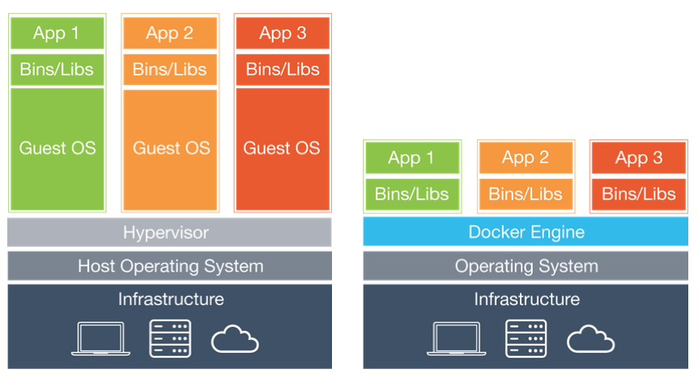

## Docker Container Technology In-Depth

Docker is an open-source application container engine developed in Go, following the Apache Licence 2.0 protocol. It allows developers to package applications along with their dependencies into a portable container, and then deploy them on various Linux distributions.

### Introduction to Docker

One of the most troublesome aspects of software development is probably configuring the environment. Due to the diversity of operating systems used by users, even cross-platform development languages (such as Java and Python) cannot guarantee that code will run correctly on all platforms. Moreover, the software packages that our installed software depends on also differ across environments.

So the question is: can we install the software along with its entire running environment? Can we make an exact copy of the original environment?

A virtual machine is a solution that comes with the environment pre-installed. It can run one operating system inside another -- for example, running Linux within Windows, or Windows on macOS -- and applications are completely unaware of this. Anyone who has used a virtual machine knows that it works exactly like a real system. For the host system, the virtual machine is just a regular file; when it's no longer needed, you simply delete it without affecting the host system or other programs. However, virtual machines typically consume significant system resources, and starting and shutting them down is very slow. Overall, the user experience is not as good as one might imagine.

Docker is a type of wrapper around Linux container technology (LXC), utilizing Linux's namespace and cgroup technologies. It provides a simple and easy-to-use container interface and is currently the most popular Linux container solution. Docker packages an application along with its dependencies into a single file. Running this file generates a virtual container. Programs running inside this virtual container behave as if they are running on a real physical machine. The image below compares virtual machines and containers -- the left side shows traditional virtual machines, and the right side shows Docker.



Currently, Docker is mainly used for the following purposes:

1. Providing disposable environments.
2. Providing elastic cloud services (scaling up and down is easy with Docker).
3. Implementing microservice architectures (running multiple services in isolated containers from the real environment).

### Installing Docker

Below we use CentOS as an example to explain how to install Docker. Users of [Ubuntu](https://docs.docker.com/install/linux/docker-ce/ubuntu/), [macOS](https://docs.docker.com/docker-for-mac/install/), or [Windows](https://docs.docker.com/docker-for-windows/install/) can click the corresponding links to learn about installation on their platforms.

1. Verify the operating system kernel version (CentOS 7 requires 64-bit, kernel version 3.10+; CentOS 6 requires 64-bit, kernel version 2.6+).

   ```Bash
   uname -r
   ```

2. Update the system's underlying library files (this is strongly recommended; otherwise, you may encounter mysterious issues when using Docker).

   ```Bash
   yum update
   ```

3. Remove any existing old Docker versions.

   ```Bash
   yum list installed | grep docker
   yum erase -y docker docker-common docker-engine
   ```

4. Install yum utilities and dependencies.

   ```Bash
   yum install -y yum-utils device-mapper-persistent-data lvm2
   ```

5. Add the yum source (Docker-ce source) via yum utilities.

   ```Bash
   yum-config-manager --add-repo https://download.docker.com/linux/centos/docker-ce.repo
   ```

6. Install Docker-ce using yum on CentOS and start it.

   ```Bash
   yum -y install docker-ce
   systemctl start docker
   ```

7. View Docker information and version.

   ```Shell
   docker version
   docker info
   ```

Next, we can download an image and create a container to check if Docker is working properly. Use the following command to download an image named hello-world from Docker's image repository.

 ```Shell
docker pull hello-world
 ```

View all image files.

```Shell
docker images
```

```
REPOSITORY               TAG        IMAGE ID            CREATED             SIZE
docker.io/hello-world    latest     fce289e99eb9        7 months ago        1.84 kB
```

Create and run a container from the image file.

```Shell
docker container run --name mycontainer hello-world
```

> Note: Here `mycontainer` is the name we gave to the container, following the `--name` parameter; `hello-world` is the image file we just downloaded.

```
Hello from Docker!
This message shows that your installation appears to be working correctly.

To generate this message, Docker took the following steps:
 1. The Docker client contacted the Docker daemon.
 2. The Docker daemon pulled the "hello-world" image from the Docker Hub.
    (amd64)
 3. The Docker daemon created a new container from that image which runs the
    executable that produces the output you are currently reading.
 4. The Docker daemon streamed that output to the Docker client, which sent it
    to your terminal.

To try something more ambitious, you can run an Ubuntu container with:
 $ docker run -it ubuntu bash

Share images, automate workflows, and more with a free Docker ID:
 https://hub.docker.com/

For more examples and ideas, visit:
 https://docs.docker.com/get-started/
```

To delete this container, use the following command.

```Shell
docker container rm mycontainer
```

After deleting the container, we can also delete the image file we just downloaded.

```Shell
docker rmi hello-world
```

> Note: To install and start Docker on Ubuntu (kernel version 3.10+), follow these steps.
>
> ```Shell
> apt update
> apt install docker-ce
> service docker start
> ```
>
> Users in China can improve download speeds by switching Ubuntu's software download source. Please refer to the [Ubuntu Mirror Usage Guide](<https://mirrors.tuna.tsinghua.edu.cn/help/ubuntu/>) on the Tsinghua University Open Source Software Mirror site.

After installing Docker, since directly accessing [dockerhub](https://hub.docker.com/) to download images can be very slow, it is recommended to switch the server to a domestic mirror. This can be done by modifying the `/etc/docker/daemon.json` file. Cloud servers typically have their own dedicated mirrors, so manual modification may not be necessary.

```JavaScript
{
	"registry-mirrors": [
        "http://hub-mirror.c.163.com",
        "https://registry.docker-cn.com"
    ]
}
```

### Using Docker

The simplest way to get familiar with Docker is to immediately create containers that you need for your learning and work. Let's walk through creating these containers together.

#### Running Nginx

Nginx is a high-performance web server and also an excellent choice for a reverse proxy server. Using Docker, you can very easily create a container running Nginx, as shown below.

```Shell
docker container run -d -p 80:80 --rm --name mynginx nginx
```

> Note: The `-d` parameter means the container runs in the background (no output to Shell) and displays the container's ID; `-p` maps the container's port to the host's port, where the port before the colon is the host's port and the port after the colon is the port used inside the container; `--rm` means the container is automatically deleted when stopped -- for example, after executing `docker container stop mynginx`, the container will cease to exist; `--name` followed by mynginx is the custom container name; during container creation, the nginx image file is needed, and the download happens automatically. If no version number is specified, the latest version is used by default.

If you need to deploy your own web project (pages) to Nginx, you can use the container copy command to copy all files and folders from a specified path to the specified directory in the container.

```Shell
docker container cp /root/web/index.html mynginx:/usr/share/nginx/html
```

If you prefer not to copy files, you can use the `--volume` data volume operation when creating the container to map a specified folder to a directory in the container. For example, map the web project folder directly to `/usr/share/nginx/html`. First, stop the previously created container with the following command.

```Shell
docker container stop mynginx
```

Then recreate the container with the following command.

```Shell
docker container run -d -p 80:80 --rm --name mynginx --volume /root/docker/nginx/html:/usr/share/nginx/html nginx
```

> Note: In the commands for creating containers and copying files above, `container` can be omitted. That is, `docker container run` is the same as `docker run`, and `docker container cp` is the same as `docker cp`. Additionally, `--volume` can be abbreviated as `-v`, just as `-d` is short for `--detach` and `-p` is short for `--publish`. `$PWD` represents the current folder of the host system -- these should be easy to understand for anyone who has used Unix or Linux systems.

To view running containers, use the following command.

```Shell
docker ps
```

```
CONTAINER ID    IMAGE    COMMAND                  CREATED            STATUS             PORTS                 NAMES
3c38d2476384    nginx    "nginx -g 'daemon ..."   4 seconds ago      Up 4 seconds       0.0.0.0:80->80/tcp    mynginx
```

To start and stop containers, use the following commands.

```Shell
docker start mynginx
docker stop mynginx
```

Since we used the `--rm` option when creating the container, the container is removed when stopped. When we use the following command to view all containers, the `mynginx` container should no longer be visible.

```Shell
docker container ls -a
```

If the `--rm` option was not specified when creating the container, you can use the following command to delete the container.

```Shell
docker rm mynginx
```

To delete a running container, use the `-f` option.

```Shell
docker rm -f mynginx
```

#### Running MySQL

Let's try using Docker to install a MySQL server. First, check if there is a MySQL image file available.

```Shell
docker search mysql
```

```
INDEX        NAME            DESCRIPTION        STARS        OFFICIAL        AUTOMATED
docker.io    docker.io/mysql MySQL is a ...     8486         [OK]
...
```

> Note: The columns in the query results above represent index, image name, image description, user rating, whether it's an official image, and auto-build, respectively.

Download the MySQL image and specify the version number.

```Shell
docker pull mysql:5.7
```

To view already downloaded image files, use the following command.

```Shell
docker images
```

```
REPOSITORY          TAG                 IMAGE ID            CREATED             SIZE
docker.io/nginx     latest              e445ab08b2be        2 weeks ago         126 MB
docker.io/mysql     5.7                 f6509bac4980        3 weeks ago         373 MB
```

Create and run a MySQL container.

```Shell
docker run -d -p 3306:3306 --name mysql57 -v /root/docker/mysql/conf:/etc/mysql/mysql.conf.d -v /root/docker/mysql/data:/var/lib/mysql -e MYSQL_ROOT_PASSWORD=123456 mysql:5.7
```

> **Note**: We used data volume operations again when creating this container, because containers are typically created and deleted at will, but data in the database needs to be preserved.

The two data volume operations above map the MySQL configuration file directory and the MySQL data directory, respectively. These two data volume operations are very important. We can place the MySQL configuration file in the `$PWD/mysql/conf` directory. The specific content of the configuration file is as follows:

```INI
[mysqld]
pid-file=/var/run/mysqld/mysqld.pid
socket=/var/run/mysqld/mysqld.sock
datadir=/var/lib/mysql
log-error=/var/log/mysql/error.log
server-id=1
log-bin=/var/log/mysql/mysql-bin.log
expire_logs_days=30
max_binlog_size=256M
symbolic-links=0
```

If you installed MySQL 8.x (the current latest version), you may encounter the error `error 2059: Authentication plugin 'caching_sha2_password' cannot be loaded` when connecting with client tools. This is because MySQL 8.x uses a mechanism called "caching_sha2_password" by default for better password protection. However, if the client tool doesn't support the new authentication method, the connection will fail. There are two ways to solve this problem: one is to upgrade the client tool to support MySQL 8.x authentication; the other is to enter the container and modify MySQL's user password authentication method. Below are the specific steps. We first use the `docker exec` command to enter the container's interactive environment, assuming the container running MySQL 8.x is named `mysql8x`.

```Shell
docker exec -it mysql8x /bin/bash
```

After entering the container's interactive Shell, you can first use MySQL's client tool to connect to the MySQL server.

```Shell
mysql -u root -p
Enter password:
Your MySQL connection id is 16
Server version: 8.0.12 MySQL Community Server - GPL
Copyright (c) 2000, 2018, Oracle and/or its affiliates. All rights reserved.
Oracle is a registered trademark of Oracle Corporation and/or its
affiliates. Other names may be trademarks of their respective
owners.
Type 'help;' or '\h' for help. Type '\c' to clear the current input statement.
mysql>
```

Next, modify the user password via SQL.

```SQL
alter user 'root'@'%' identified with mysql_native_password by '123456' password expire never;
```

Of course, you can also check the user table to verify the modification was successful.

```SQL
use mysql;
select user, host, plugin, authentication_string from user where user='root';
+------+-----------+-----------------------+-------------------------------------------+
| user | host      | plugin                | authentication_string                     |
+------+-----------+-----------------------+-------------------------------------------+
| root | %         | mysql_native_password | *6BB4837EB74329105EE4568DDA7DC67ED2CA2AD9 |
| root | localhost | mysql_native_password | *6BB4837EB74329105EE4568DDA7DC67ED2CA2AD9 |
+------+-----------+-----------------------+-------------------------------------------+
2 rows in set (0.00 sec)
```

After completing the steps above, you can now connect to MySQL 8.x even without updating the client tool.

#### Running Redis

Next, let's try running multiple containers and having them communicate over a network. We'll create 4 Redis containers to implement a master-slave replication structure with one master and three slaves.

```Shell
docker run -d -p 6379:6379 --name redis-master redis
docker run -d -p 6380:6379 --name redis-slave-1 --link redis-master:redis-master redis redis-server --replicaof redis-master 6379
docker run -d -p 6381:6379 --name redis-slave-2 --link redis-master:redis-master redis redis-server --replicaof redis-master 6379
docker run -d -p 6382:6379 --name redis-slave-3 --link redis-master:redis-master redis redis-server --replicaof redis-master 6379
```

In the commands above, the `--link` parameter creates a network alias for the container, because the three slave machines need to connect to their master over the network. Although we can use `docker inspect --format '{{ .NetworkSettings.IPAddress }}' <container-ID>` to view a container's IP address, since containers are disposable, the container's IP address may change. If you use the IP address directly, after a container restart the slaves may be unable to connect to the master due to the IP address change. Using `--link` to create a network alias allows us to use this alias instead of the IP address after the `--replicaof` parameter when starting the Redis server.

Next, let's enter the container named `redis-master` to check if the master-slave replication configuration was successful.

```Shell
docker exec -it redis-master /bin/bash
```

Start the command-line tool with `redis-cli`.

```Shell
redis-cli
127.0.0.1:6379> info replication
# Replication
role:master
connected_slaves:3
slave0:ip=172.17.0.4,port=6379,state=online,offset=1988,lag=0
slave1:ip=172.17.0.5,port=6379,state=online,offset=1988,lag=1
slave2:ip=172.17.0.6,port=6379,state=online,offset=1988,lag=1
master_replid:94703cfa03c3ddc7decc74ca5b8dd13cb8b113ea
master_replid2:0000000000000000000000000000000000000000
master_repl_offset:1988
second_repl_offset:-1
repl_backlog_active:1
repl_backlog_size:1048576
repl_backlog_first_byte_offset:1
repl_backlog_histlen:1988
```

#### Running GitLab

GitLab is a Git repository management tool developed by GitLab Inc., featuring wiki, issue tracking, continuous integration, and a series of other capabilities. It comes in Community and Enterprise editions. Through Docker's virtualized containers, we can install the community edition of GitLab. Because GitLab needs to use the SSH protocol for secure connections, we need to expose the container's port 22. Therefore, we should first change the host machine's SSH connection port 22 to another port (e.g., 12345), then proceed with the subsequent operations.

```Shell
vim /etc/ssh/sshd_config
```

Remove the comment from the line that defines the port and change the port to 12345.

```
Port 12345
```

Restart the `sshd` service.

```Shell
systemctl restart sshd
```

> **Tip**: After modifying the port, make sure the firewall also has the corresponding port open; otherwise, you won't be able to connect to the Linux server via SSH.

Create the folders needed for data volume mapping operations.

```Shell
mkdir -p /root/gitlab/{config,logs,data}
```

Create a container based on the `gitlab/gitlab-ce` image, exposing port 80 (HTTP connections) and port 22 (SSH connections).

```Shell
docker run -d -p 80:80 -p 22:22 --name gitlab -v /root/gitlab/config:/etc/gitlab -v /root/gitlab/logs:/var/log/gitlab -v /root/gitlab/data:/var/opt/gitlab gitlab/gitlab-ce
```

> Note: GitLab starts up rather slowly. After creating the container, you may need to wait a while before you can access it through a browser.

The first time you access the GitLab interface, you'll be prompted to change the administrator password. After setting the admin password, you can log in to the administrator console using the username `root` and the password you just set. The usage is very simple and user-friendly.

### Building Images

Through the explanations above, we've mastered how to create containers from officially provided images. Of course, if desired, we can also generate images from configured containers. In short, **Docker images are composed of layered file systems. The bottommost layer of the system is bootfs, which is essentially the boot file system for the Linux kernel; the next layer is rootfs, which can be one or more operating systems (such as Debian or Ubuntu file systems). In Docker, rootfs is read-only; Docker uses union mount technology to overlay the file systems on top of each other. The final file system will contain files and directories from the underlying layers -- such a file system constitutes an image**.

We previously covered how to search, list, and pull (download) images. Now let's look at two ways to build images:

1. Using the `docker commit` command. (Not recommended)
2. Using the `docker build` command with a Dockerfile.

#### Building Images with the commit Command

To demonstrate how to build an image, let's first use an Ubuntu image to customize a container, as shown below.

```Shell
docker run --name myubuntu -it ubuntu /bin/bash
```

Execute the following commands inside the container to install the Apache server and exit the container.

```Shell
apt -y upgrade
apt -y install apache2
exit
```

We'll save this container as a customized web server. When we need such a web server in the future, we won't need to recreate a container and install Apache again.

First, let's check the container's ID with the following command.

```Shell
docker container ls -a
```

```
docker container ls -a
CONTAINER ID    IMAGE    COMMAND        CREATED        STATUS        PORTS    NAMES
014bdb321612    ubuntu   "/bin/bash"    5 minutes ago  Exited (0)             myubuntu
```

Commit the customized container.

```Shell
docker commit 014bdb321612 jackfrued/mywebserver
```

View the image files.

```Shell
docker images
```

```
REPOSITORY              TAG       IMAGE ID        CREATED             SIZE
jackfrued/mywebserver   latest    795b294d265a    14 seconds ago      189 MB
```

After generating the image file, we can use it later to create new containers.

#### Building Images with Dockerfile

Dockerfile uses a DSL (Domain Specific Language) to build a Docker image. Once the Dockerfile is written, you can use the `docker build` command to build a new image.

First, let's create a folder called myapp to store the project code and Dockerfile, as shown below:

```Shell
[ECS-root temp]# tree myapp
myapp
├── api
│   ├── app.py
│   ├── requirements.txt
│   └── start.sh
└── Dockerfile
```

The api folder contains the Flask project files, including project code, dependencies, and startup scripts. The specific contents are as follows:

`app.py` file:

```Python
from flask import Flask
from flask_restful import Resource, Api
from flask_cors import CORS

app = Flask(__name__)
CORS(app, resources={r'/api/*': {'origins': '*'}})
api = Api(app)


class Product(Resource):

    def get(self):
        products = ['Ice Cream', 'Chocolate', 'Coca Cola', 'Hamburger']
        return {'products': products}


api.add_resource(Product, '/api/products')
```

`requirements.txt` file:

```INI
flask
flask-restful
flask-cors
gunicorn
```

`start.sh` file:

```Shell
#!/bin/bash
exec gunicorn -w 4 -b 0.0.0.0:8000 app:app
```

> **Tip**: You need to give the start.sh file execution permission, which can be done with `chmod 755 start.sh`.

Dockerfile file:

```Dockerfile
# Specify the base image
FROM python:3.7
# Specify the image maintainer
MAINTAINER jackfrued "jackfrued@126.com"
# Add specified files to the specified location in the container
ADD api/* /root/api/
# Set the working directory
WORKDIR /root/api
# Execute command (install Flask project dependencies)
RUN pip install -r requirements.txt -i https://pypi.doubanio.com/simple/
# Command to execute when the container starts
ENTRYPOINT ["./start.sh"]
# Expose port
EXPOSE 8000
```

Let's explain the Dockerfile above. A Dockerfile uses special instructions to specify the base image (FROM instruction), commands to execute after creating the container (RUN instruction), and ports to expose (EXPOSE), among other information. We will introduce these Dockerfile instructions in detail shortly.

Next, we can use the `docker build` command to create the image, as shown below.

```Shell
docker build -t "jackfrued/myapp" .
```

> Tip: Don't forget the `.` at the end of the command -- it indicates looking for the Dockerfile in the current path.

View the created image with the following command.

```Shell
docker images
```

```
REPOSITORY                   TAG                 IMAGE ID            CREATED             SIZE
jackfrued/myapp              latest              6d6f026a7896        5 seconds ago       930 MB
```

To see how the image file was created, use the following command.

```Shell
docker history jackfrued/myapp
```

```
IMAGE               CREATED             CREATED BY                                      SIZE                COMMENT
6d6f026a7896        31 seconds ago      /bin/sh -c #(nop)  EXPOSE 8000/tcp              0 B
3f7739173a79        31 seconds ago      /bin/sh -c #(nop)  ENTRYPOINT ["./start.sh"]    0 B
321e6bf09bf1        32 seconds ago      /bin/sh -c pip install -r requirements.txt...   13 MB
2f9bf2c89ac7        37 seconds ago      /bin/sh -c #(nop) WORKDIR /root/api             0 B
86119afbe1f8        37 seconds ago      /bin/sh -c #(nop) ADD multi:4b76f9c9dfaee8...   870 B
08d465e90d4d        3 hours ago         /bin/sh -c #(nop)  MAINTAINER jackfrued "j...   0 B
fbf9f709ca9f        12 days ago         /bin/sh -c #(nop)  CMD ["python3"]              0 B
```

Use this image to create a container and run the web server.

```Shell
docker run -d -p 8000:8000 --name myapp jackfrued/myapp
```

If you want to push the image file to the dockerhub repository, follow these steps.

Log in to dockerhub with the following command.

```Shell
docker login
```

Enter your username and password to log in.

```
Login with your Docker ID to push and pull images from Docker Hub. If you don't have a Docker ID, head over to https://hub.docker.com to create one.
Username: jackfrued
Password:
Login Succeeded
```

Push the image to the repository with the following command.

```Shell
docker push jackfrued/webserver
```


#### Dockerfile Instructions

To learn about Dockerfile instructions, you can refer to the official [reference manual](<https://docs.docker.com/engine/reference/builder/>). Below we introduce some commonly used instructions.

1. **FROM**: Sets the base image. Must be the first instruction in the Dockerfile.

   ```Dockerfile
   FROM <image-name> [AS <alias>]
   ```

   or

   ```Dockerfile
   FROM <image-name>[:<tag>] [AS <alias>]
   ```

2. **RUN**: Specifies commands to execute when building the image.

   ```Dockerfile
   RUN <command> [param1], [param2], ...
   ```

   or

   ```Dockerfile
   RUN ["executable", "param1", "param2", ...]
   ```

3. **CMD**: Specifies commands to execute after the image is built.

   ```Dockerfile
   CMD <command> [param1], [param2], ...
   ```

   or

   ```Dockerfile
   CMD ["executable", "param1", "param2", ...]
   ```

   > Note: Unlike virtual machines, a container is itself a process, and applications within the container should run in the foreground. The CMD command essentially specifies the container's main process (the program to run in the foreground after creating the container). When the main process ends, the container stops running. Therefore, to start Nginx in a container, you cannot use `service nginx start` or `systemctl start nginx`; instead, you should use `CMD ["nginx", "-g", "daemon off;"]` to keep it running in the foreground.

4. **ENTRYPOINT**: Similar to CMD, it can also execute commands, but any arguments specified on the `docker run` command line are passed as additional arguments to the ENTRYPOINT command. This allows us to build an image that can run a default command while also supporting overridable parameter options through `docker run` command-line arguments.

   ```Dockerfile
   ENTRYPOINT <command> [param1], [param2], ...
   ```

   or

   ```Dockerfile
   ENTRYPOINT ["executable", "param1", "param2", ...]
   ```

5. **WORKDIR**: Creates a working directory inside the container when creating a new container from the image. Programs specified by ENTRYPOINT and CMD will execute in this directory. When using `docker run`, you can override the WORKDIR-specified working directory with the `-w` parameter. For example:

   ```Dockerfile
   WORKDIR /opt/webapp
   ```

   ```Shell
   docker run -w /usr/share/webapp ...
   ```

6. **ENV**: Sets environment variables when creating the image. When using `docker run`, you can modify environment variable settings with the `-e` parameter. For example:

   ```Dockerfile
   ENV DEFAULT_PORT=8080
   ```

   ```Shell
   docker run -e "DEFAULT_PORT=8000" ...
   ```

7. **USER**: Specifies the user identity under which the image will run. For example:

   ```Dockerfile
   USER nginx
   ```

8. **VOLUME**: Adds a data volume mount point when creating a container. Data volume operations enable data sharing and reuse between containers. Modifications to volumes take effect immediately without needing to restart the container. We used the `--volume` parameter when creating containers earlier to implement data volume mapping operations.

   ```Dockerfile
   VOLUME ["/path1", "/path2/subpath2.1/", ...]
   ```

9. **ADD**: Copies files and folders from the build directory to the image. For compressed and archive files, the ADD command will decompress and unarchive them.

   ```Dockerfile
   ADD [--chown=<user>:<group>] <source-file> <target-file>
   ```

10. **COPY**: Very similar to ADD, but does not automatically extract files.

11. **LABEL**: Adds metadata to Docker images, which can be seen when using the `docker inspect` command.

    ```Dockerfile
    LABEL version="1.0.0" location="Chengdu"
    ```

12. **ONBUILD**: Adds triggers to the image. When the image is used as a base image for another image, the triggers will be executed. For example:

    ```Dockerfile
    ONBUILD ADD . /app/src
    ONBUILD RUN cd /app/src && make
    ```

### Multi-Container Management

Our projects may use multiple containers, and managing containers becomes cumbersome as the number grows. If you want to automatically configure multiple containers so they can cooperate with each other or even implement complex scheduling, you need container orchestration. Docker's native support for container orchestration is very weak, but tools provided by the community can be used to achieve it.

#### Docker Compose

Docker Compose can be installed to implement YAML-based container orchestration. The YAML file defines a series of containers and their runtime properties, and Docker Compose manages the containers based on these configurations.

1. Install Docker Compose.

   ```Shell
   curl -L "https://github.com/docker/compose/releases/download/1.25.4/docker-compose-$(uname -s)-$(uname -m)" -o /usr/local/bin/docker-compose
   chmod +x /usr/local/bin/docker-compose
   ```

   > Note: If curl is not installed, on CentOS you can first install curl via the package manager yum and then execute the command above.

   Alternatively, you can use Python's package management tool pip to install Docker Compose, as shown below.

   ```Shell
   pip3 install -U docker-compose
   ```

2. Using Docker Compose.

   We'll introduce caching into our Flask project from earlier, then use the data interface provided by Flask to supply data for the frontend page, use Vue.js for page rendering, and deploy the static page on an Nginx server. The project folder structure is as follows:

   ```Shell
   [ECS-root ~]# tree temp
   temp
   ├── docker-compose.yml
   ├── html
   │   └── index.html
   └── myapp
       ├── api
       │   ├── app.py
       │   ├── requirements.txt
       │   └── start.sh
       └── Dockerfile
   ```

   The modified app.py code is as follows:

   ```Python
   from pickle import dumps, loads

   from flask import Flask
   from flask_restful import Resource, Api
   from flask_cors import CORS
   from redis import Redis

   app = Flask(__name__)
   CORS(app, resources={r'/api/*': {'origins': '*'}})
   api = Api(app)
   redis = Redis(host='redis-master', port=6379)


   class Product(Resource):

       def get(self):
           data = redis.get('products')
           if data:
               products = loads(data)
           else:
               products = ['Ice Cream', 'Chocolate', 'Coca Cola', 'Hamburger']
               redis.set('products', dumps(products))
           return {'products': products}


   api.add_resource(Product, '/api/products')
   ```

   The html folder stores static pages. Later we'll use an Nginx container to serve static pages to the browser. The content of the index.html file is as follows:

   ```HTML
   <!DOCTYPE html>
   <html lang="en">
   <head>
       <meta charset="utf-8">
       <title>Home</title>
   </head>
   <body>
       <div id="app">
           <h2>Product List</h2>
           <ul>
               <li v-for="product in products">{{ product }}</li>
           </ul>
       </div>
       <script src="https://cdn.bootcss.com/vue/2.6.10/vue.min.js"></script>
       <script>
           new Vue({
               el: '#app',
               data: {
                   products: []
               },
               created() {
                   fetch('http://1.2.3.4:8000/api/products')
                       .then(resp => resp.json())
                       .then(json => {this.products = json.products})
               }
           })
       </script>
   </body>
   </html>
   ```

   Next, we'll use the docker-compose.yml file to create three containers and specify the dependencies between them.

   ```YAML
   version: '3'
   services:
     api-server:
       build: ./myapp
       ports:
         - '8000:8000'
       links:
         - redis-master
     web-server:
       image: nginx
       ports:
         - '80:80'
       volumes:
         - ./html:/usr/share/nginx/html
     redis-master:
       image: redis
       expose:
         - '6379'
   ```

   With this YAML file, we can use the `docker-compose` command to create containers and run the project:

   ```Shell
   [ECS-root temp]# docker-compose up
   Creating network "temp_default" with the default driver
   Creating temp_web-server_1   ... done
   Creating temp_redis-master_1 ... done
   Creating temp_api-server_1   ... done
   Attaching to temp_redis-master_1, temp_web-server_1, temp_api-server_1
   redis-master_1  | 1:C 05 Dec 2019 11:57:26.828 # oO0OoO0OoO0Oo Redis is starting oO0OoO0OoO0Oo
   redis-master_1  | 1:C 05 Dec 2019 11:57:26.828 # Redis version=5.0.6, bits=64, commit=00000000, modified=0, pid=1, just started
   redis-master_1  | 1:C 05 Dec 2019 11:57:26.828 # Warning: no config file specified, using the default config. In order to specify a config file use redis-server /path/to/redis.conf
   redis-master_1  | 1:M 05 Dec 2019 11:57:26.830 * Running mode=standalone, port=6379.
   redis-master_1  | 1:M 05 Dec 2019 11:57:26.831 # WARNING: The TCP backlog setting of 511 cannot be enforced because /proc/sys/net/core/somaxconn is set to the lower value of 128.
   redis-master_1  | 1:M 05 Dec 2019 11:57:26.831 # Server initialized
   redis-master_1  | 1:M 05 Dec 2019 11:57:26.831 # WARNING overcommit_memory is set to 0! Background save may fail under low memory condition. To fix this issue add 'vm.overcommit_memory = 1' to /etc/sysctl.conf and then reboot or run the command 'sysctl vm.overcommit_memory=1' for this to take effect.
   redis-master_1  | 1:M 05 Dec 2019 11:57:26.831 # WARNING you have Transparent Huge Pages (THP) support enabled in your kernel. This will create latency and memory usage issues with Redis. To fix this issue run the command 'echo never > /sys/kernel/mm/transparent_hugepage/enabled' as root, and add it to your /etc/rc.local in order to retain the setting after a reboot. Redis must be restarted after THP is disabled.
   redis-master_1  | 1:M 05 Dec 2019 11:57:26.831 * Ready to accept connections
   api-server_1    | [2019-12-05 11:57:27 +0000] [1] [INFO] Starting gunicorn 20.0.4
   api-server_1    | [2019-12-05 11:57:27 +0000] [1] [INFO] Listening at: http://0.0.0.0:8000 (1)
   api-server_1    | [2019-12-05 11:57:27 +0000] [1] [INFO] Using worker: sync
   api-server_1    | [2019-12-05 11:57:27 +0000] [8] [INFO] Booting worker with pid: 8
   api-server_1    | [2019-12-05 11:57:27 +0000] [9] [INFO] Booting worker with pid: 9
   api-server_1    | [2019-12-05 11:57:27 +0000] [10] [INFO] Booting worker with pid: 10
   api-server_1    | [2019-12-05 11:57:27 +0000] [11] [INFO] Booting worker with pid: 11
   ```

    To stop the containers, use the following command.

   ```Shell
   docker-compose down
   ```

#### Kubernetes (K8S)

In real production environments, it's often necessary to deploy and manage multiple cooperating containers. Docker Compose solves the problem of creating and managing multiple containers, but in real projects, we also need Kubernetes (hereafter referred to as K8S) to provide a cross-host cluster container scheduling platform. K8S can automate the deployment, scaling, and operations of containers, providing a container-centric infrastructure. This project was initiated by Google in 2014, built upon Google's decade-plus of operational experience, and Google's own applications also run on containers.
