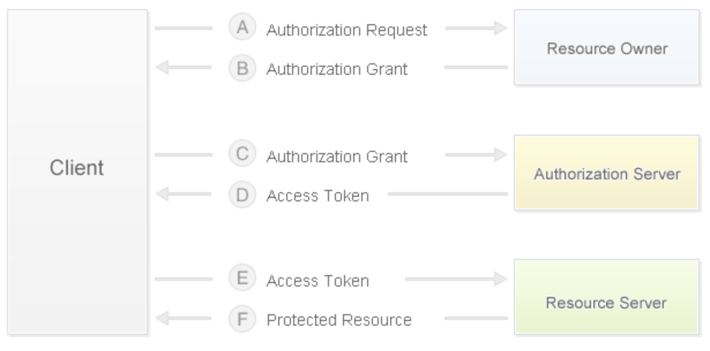

## E-Commerce Website Technical Analysis

### Business Models

1. B2B - Business to Business, where both parties in the transaction are enterprises (businesses). The most typical example is Alibaba.
2. C2C - Consumer to Consumer, for example: Taobao, Renrenche.
3. B2C - Business to Consumer, for example: Vipshop, Jumei.
4. C2B - Consumer to Business, where consumers first propose demands and then businesses organize production according to those demands, for example: Shangpin Home Collection.
5. O2O - Online to Offline, combining offline business opportunities with the internet, making the internet a platform for offline transactions, for example: Meituan Food Delivery, Ele.me.
6. B2B2C - Business to Business to Consumer, for example: Tmall, JD.com.

### Key Requirements

1. User Side
   - Homepage (product categories, ad carousels, scrolling news, waterfall loading, recommendations, discounts, best sellers, ...)

   - User (login (third-party login), registration, logout, self-service (personal info, browsing history, shipping addresses, ...))

   - Products (categories, lists, details, search, trending searches, search history, add to cart, favorites, follow, reviews, ...)
   - Shopping Cart (view, edit (modify quantity, remove items, clear all))
   - Orders (submit order (payment), order history, order details, order reviews, ...)
2. Admin Side
   - CRUD operations for core business entities
   - Scheduled tasks (periodic and non-periodic, such as handling unpaid orders, data collection for anomaly alerting, ...)
   - Reporting features (import/export Excel, PDF, and frontend ECharts statistical chart display)
   - Permission control (RBAC, whitelist, blacklist, ...)
   - Business workflow (e.g., initiating refund processes; common workflow engines include: Activity, Airflow, Spiff, etc.)
   - Third-party services (integration with maps, SMS, logistics, payment, identity verification, weather, monitoring, cloud storage, ...)

### Physical Model Design

First, we need to understand two concepts: SPU (Standard Product Unit) and SKU (Stock Keeping Unit).

- SPU: iPhone 6s
- SKU: iPhone 6s 64G Gold


### Third-Party Login

Third-party login refers to using accounts from third-party websites (usually well-known social networking sites) for login verification (mainly obtaining user-related information through well-known third-party websites), such as QQ and Weibo in China, and Google and Facebook internationally. Most third-party logins use the [OAuth](<https://en.wikipedia.org/wiki/OAuth>) protocol, which is an open network standard for authorization (**the data owner tells the system that it agrees to authorize a third-party application to access the system and obtain the data. The system then generates a short-term access token to replace the password for the third-party application to use**). It has been widely adopted, and version 2.0 is currently in common use. For the basics of OAuth, you can read Ruan Yifeng's ["Understanding OAuth 2.0"](http://www.ruanyifeng.com/blog/2014/05/oauth_2_0.html). Regarding the differences between **tokens** and **passwords**, we can summarize the following three points:

1. Tokens are short-term and expire automatically; users cannot modify them. Passwords are generally long-term and won't change unless the user modifies them.
2. Tokens can be revoked by the data owner and become immediately invalid. In the example above, the homeowner can revoke the courier's token at any time. Passwords generally cannot be revoked by others.
3. Tokens have a scope of permissions -- for example, they may only allow entry through gate #2 of the community. For network services, a read-only token is more secure than a read-write token. Passwords generally grant full permissions.

Therefore, tokens allow third-party applications to gain access while remaining controllable at all times, without compromising system security. This is the advantage of the OAuth protocol.

#### OAuth 2.0 Authorization Flow

1. After the user opens the client, the client requests authorization from the user (resource owner).
2. The user (resource owner) grants authorization to the client.
3. The client uses the authorization obtained in the previous step to request an access token from the authentication server.
4. After authenticating the client, the authentication server issues an access token.
5. The client uses the access token to request resources from the resource server.
6. The resource server confirms the access token is valid and grants the client access to the resources.



For integration with Weibo login, the specific steps can be found in the ["Weibo Login Integration"](http://open.weibo.com/wiki/Connect/login) documentation on the Weibo Open Platform. For QQ login integration, you first need to register as a QQ Connect developer and pass the review. The specific steps can be found in the ["Integration Guide"](http://wiki.connect.qq.com/) on QQ Connect, with detailed steps available in the ["Website Development Process"](http://wiki.connect.qq.com/%E5%87%86%E5%A4%87%E5%B7%A5%E4%BD%9C_oauth2-0).

> Tip: On Gitbook, there is a book called [Django Blog Introduction](https://shenxgan.gitbooks.io/django/content/publish/2015-08-10-django-oauth-login.html) that uses GitHub as an example to introduce third-party account login. Interested readers can read it on their own.

Typically, when e-commerce websites use third-party login, they require binding with a website account or automatically complete account binding based on information obtained from the third-party account (such as phone number).

### Cache Warming and Query Caching

#### Cache Warming

Cache warming refers to preloading data into the cache when starting the server. To do this, you can write a subclass of `AppConfig` in the Django application's `apps.py` module and override the `ready()` method, as shown below.

```Python
import pymysql

from django.apps import AppConfig
from django.core.cache import cache

SELECT_PROVINCE_SQL = 'select distid, name from tb_district where pid is null'


class CommonConfig(AppConfig):
    name = 'common'

    def ready(self):
        conn = pymysql.connect(host='1.2.3.4', port=3306,
                               user='root', password='pass',
                               database='db', charset='utf8',
                               cursorclass=pymysql.cursors.DictCursor)
        try:
            with conn.cursor() as cursor:
                cursor.execute(SELECT_PROVINCE_SQL)
                provinces = cursor.fetchall()
                cache.set('provinces', provinces)
        finally:
            conn.close()
```

Next, you also need to write the following code in the application's `__init__.py`.

```Python
default_app_config = 'common.apps.CommonConfig'
```

Or register the application in the project's `settings.py` file.

```Python
INSTALLED_APPS = [
    ...
    'common.apps.CommonConfig',
    ...
]
```

#### Query Caching

Implementing query result caching with a custom decorator.

```Python
from pickle import dumps, loads

from django.core.cache import caches

MODEL_CACHE_KEY = 'project:modelcache:%s'


def my_model_cache(key, section='default', timeout=None):
    """Decorator for implementing model caching"""

    def wrapper1(func):

        def wrapper2(*args, **kwargs):
            real_key = '%s:%s' % (MODEL_CACHE_KEY % key, ':'.join(map(str, args)))
            serialized_data = caches[section].get(real_key)
            if serialized_data:
                data = loads(serialized_data)
            else:
                data = func(*args, **kwargs)
                cache.set(real_key, dumps(data), timeout=timeout)
            return data

        return wrapper2

    return wrapper1
```

```Python
@my_model_cache(key='provinces')
def get_all_provinces():
    return list(Province.objects.all())
```

### Shopping Cart Implementation

Question 1: Where should the shopping cart be stored for logged-in users? Where should it be stored for non-logged-in users?

```Python
class CartItem(object):
    """Item in the shopping cart"""

    def __init__(self, sku, amount=1, selected=False):
        self.sku = sku
        self.amount = amount
        self.selected = selected

    @property
    def total(self):
        return self.sku.price * self.amount


class ShoppingCart(object):
    """Shopping Cart"""

    def __init__(self):
        self.items = {}
        self.index = 0

    def add_item(self, item):
        if item.sku.id in self.items:
            self.items[item.sku.id].amount += item.amount
        else:
            self.items[item.sku.id] = item

    def remove_item(self, sku_id):
        if sku_id in self.items:
            self.items.remove(sku_id)

    def clear_all_items(self):
        self.items.clear()

    @property
    def cart_items(self):
        return self.items.values()

    @property
    def cart_total(self):
        total = 0
        for item in self.items.values():
            total += item.total
        return total
```

The shopping cart for logged-in users can be stored in the database (with Redis caching first); the shopping cart for non-logged-in users can be saved in Cookie, localStorage, or sessionStorage (to reduce server-side memory overhead).

```JSON
{
    '1001': {sku: {...}, 'amount': 1, 'selected': True},
    '1002': {sku: {...}, 'amount': 2, 'selected': False},
    '1003': {sku: {...}, 'amount': 3, 'selected': True},
}
```

```Python
request.get_signed_cookie('cart')

cart_base64 = base64.base64encode(pickle.dumps(cart))
response.set_signed_cookie('cart', cart_base64)
```

Question 2: How to merge shopping carts after a user logs in? (Currently, shopping carts in e-commerce applications are almost always persisted, mainly to facilitate data sharing across multiple terminals.)

### Integrating Payment Functionality

Question 1: How to persist payment information? (Every transaction must have a record.)

Question 2: How to integrate Alipay? (Integration with other platforms is basically similar.)

1. [Ant Financial Open Platform](https://open.alipay.com/platform/home.htm).
2. [Platform Registration](https://open.alipay.com/platform/homeRoleSelection.htm).
3. [Developer Center](https://openhome.alipay.com/platform/appManage.htm#/apps).
4. [Documentation Center](https://docs.open.alipay.com/270/105899/).
5. [SDK Integration](https://docs.open.alipay.com/54/103419) - [PYPI Link](https://pypi.org/project/alipay-sdk-python/).
6. [API List](https://docs.open.alipay.com/270/105900/).


Configuration file:

```Python
ALIPAY_APPID = '......'
ALIPAY_URL = 'https://openapi.alipaydev.com/gateway.do'
ALIPAY_DEBUG = False
```

Obtaining the payment link (initiating payment):

```Python
# Create the Alipay call object
alipay = AliPay(
    # App ID assigned when creating the application online
    appid=settings.ALIPAY_APPID,
    app_notify_url=None,
    # Your application's private key
    app_private_key_path=os.path.join(
        os.path.dirname(os.path.abspath(__file__)),
        'keys/app_private_key.pem'),
    # Alipay's public key
    alipay_public_key_path=os.path.join(
        os.path.dirname(os.path.abspath(__file__)),
        'keys/alipay_public_key.pem'),
    sign_type='RSA2',
    debug=settings.ALIPAY_DEBUG
)
# Call the payment page operation
order_info = alipay.api_alipay_trade_page_pay(
    out_trade_no='...',
    total_amount='...',
    subject='...',
    return_url='http://...'
)
# Generate the complete payment page URL
alipay_url = settings.ALIPAY_URL + '?' + order_info
return JsonResponse({'alipay_url': alipay_url})
```

Through the link returned above, you can enter the payment page. After payment is completed, it will automatically redirect back to the project page configured in the code above. On that page, you can obtain the order number (out_trade_no), payment transaction number (trade_no), transaction amount (total_amount), and the corresponding signature (sign), then request the backend to verify and save the transaction result. The code is as follows:

```Python
# Create the Alipay call object
alipay = AliPay(
    # App ID assigned when creating the application online
    appid=settings.ALIPAY_APPID,
    app_notify_url=None,
    # Your application's private key
    app_private_key_path=os.path.join(
        os.path.dirname(os.path.abspath(__file__)),
        'keys/app_private_key.pem'),
    # Alipay's public key
    alipay_public_key_path=os.path.join(
        os.path.dirname(os.path.abspath(__file__)),
        'keys/alipay_public_key.pem'),
    sign_type='RSA2',
    debug=settings.ALIPAY_DEBUG
)
# Request parameters (assuming a POST request) include order number, payment transaction number, transaction amount, and signature
params = request.POST.dict()
# Call the verification operation
if alipay.verify(params, params.pop('sign')):
    # Persist the transaction
```

Alipay's payment API also provides a series of interfaces for transaction queries, transaction settlements, refunds, refund queries, etc., which can be called according to business needs. We won't elaborate further here.

### Flash Sales and Overselling

1. Flash Sales: Flash sales typically mean handling extremely high concurrency in a very short time. The system needs to handle traffic hundreds of times higher than normal in a short period. Therefore, flash sale architecture is a relatively complex problem, with core strategies being traffic control and performance optimization. This requires coordination from the frontend (implementing countdown timers, preventing duplicate submissions, and limiting frequent refreshing with JavaScript) to every backend component. Traffic control mainly limits the flow to the backend (since ultimately only a small number of users can successfully complete the flash sale). At the physical architecture level, caching is used (partly because read operations far outnumber write operations; inventory can be stored in Redis, using the DECR primitive for inventory reduction; Redis can also be used for rate limiting, similar to limiting frequent SMS verification code requests) and message queues (the most important function of message queues is "peak shaving" and "decoupling upstream and downstream nodes") for optimization. Additionally, stateless service design should be adopted, as this facilitates horizontal scaling (expanding system capacity by adding devices).
2. Overselling: For example, if a product has an inventory of 1, and User 1 and User 2 concurrently purchase the product, after User 1 submits the order the inventory is modified to 0, but User 2, unaware of this, submits an order and the inventory is modified to -1 -- this is the overselling phenomenon. There are three common approaches to solving overselling:
   - Pessimistic Lock Control: Use `select ... for update` when querying product quantity to lock the data. This way, when User 1 queries the inventory, User 2 is blocked from reading the inventory quantity until User 1 commits or rolls back the inventory update operation, thus solving the overselling problem. However, for products with very high concurrent access, the performance is too poor. In practice, you might consider adding locks only when inventory falls below a certain value, but overall this approach is not ideal.
   - Optimistic Lock Control: Query the product quantity without locking. When updating inventory, set the condition that the product quantity must be the same as the previously queried quantity for the update to succeed; otherwise, it means another transaction has already updated the inventory, and a new request must be issued.
   - Attempt Inventory Reduction: Merge the query (`select`) and update (`update`) operations into a single SQL operation. When updating inventory, add a condition in the `where` clause such as `inventory >= purchase quantity` or `inventory - purchase quantity >= 0`. This approach requires the transaction isolation level to be Read Committed.

> Tip: Interested readers can search for discussions on this type of problem on Zhihu.

### Static Resource Management

Static resource management can be done by setting up your own file server or distributed file server (FastDFS), but in most projects this is unnecessary and may not produce the best results. We recommend using cloud storage services to manage website static resources. Domestic and international cloud service providers such as [Amazon](<https://amazonaws-china.com/cn/>), [Alibaba Cloud](<https://www.aliyun.com/product/oss>), [Qiniu](<https://www.qiniu.com/products/kodo>), [LeanCloud](<https://leancloud.cn/storage/>), [Bmob](<https://www.bmob.cn/cloud>), etc., all provide excellent cloud storage services at prices that are generally acceptable for most companies. For specific operations, refer to the official documentation, such as Alibaba Cloud's [Object Storage Service OSS Developer Guide](https://www.alibabacloud.com/zh/support/developer-resources).

### Full-Text Search

#### Choosing a Solution

1. Using database fuzzy query functionality - Low efficiency, requires full table scan each time, does not support word segmentation.
2. Using database full-text search functionality - Before MySQL 5.6, only applicable to the MyISAM engine. Search operations are coupled with other DML operations in the database, which may cause search operations to be very slow. Performance drops significantly when data volume reaches millions of records, resulting in long query times.
3. Using open-source search engines - Index data is separated from source data. ElasticSearch or Solr can be used to provide external indexing services. If high-concurrency full-text search is not required, pure Python Whoosh is also an option.

#### ElasticSearch

ElasticSearch is both a distributed document database and a highly scalable open-source full-text search and analytics engine. It allows you to store, search, and analyze large volumes of data in near real-time. It is commonly used as the underlying engine and technology to power complex search features and requirements. Well-known platforms like Wikipedia, Stack Overflow, and GitHub all use ElasticSearch.

The underlying engine of ElasticSearch is the open-source search engine [Lucene](https://lucene.apache.org/), but using Lucene directly is very cumbersome -- you must write your own code to call its interface, and it only supports Java. ElasticSearch essentially provides a comprehensive wrapper around Lucene, offering REST-style API interfaces that shield programming language differences through HTTP-based access. ElasticSearch builds [inverted indexes](https://zh.wikipedia.org/zh-hans/%E5%80%92%E6%8E%92%E7%B4%A2%E5%BC%95) for data, but the built-in tokenizers have almost zero support for Chinese word segmentation. Therefore, the elasticsearch-analysis-ik plugin needs to be installed to provide Chinese word segmentation services.

For ElasticSearch installation and configuration, you can refer to ["ElasticSearch Docker Installation"](https://blog.csdn.net/jinyidong/article/details/80475320). Besides ElasticSearch, Solr, Whoosh, etc., can also be used to provide search engine services. For Django projects, the following solutions can be considered:

- haystack (django-haystack / drf-haystack) + whoosh + Jieba
- haystack (django-haystack / drf-haystack) + elasticsearch
- requests + elasticsearch
- django-elasticsearch-dsl

#### Installing and Using ElasticSearch

1. Install ElasticSearch using Docker.

   ```Shell
   docker pull elasticsearch:7.6.0
   docker run -d -p 9200:9200 -p 9300:9300 -e "discovery.type=single-node" -e ES_JAVA_OPTS="-Xms512m -Xmx512m" --name es elasticsearch:7.6.0
   ```

   > Note: When creating the container above, the `-e` parameter specifies single-node mode and the minimum/maximum available heap space for the Java virtual machine. The heap space size can be determined based on the actual memory the server can provide to ElasticSearch; the default is 2G.

2. Create a database.

   Request: PUT - `http://1.2.3.4:9200/demo/`

   Response:

    ```JSON
   {
       "acknowledged": true,
       "shards_acknowledged": true,
       "index": "demo"
   }
    ```

3. View the created database.

   Request: GET - `http://1.2.3.4:9200/demo/`

   Response:

   ```JSON
   {
       "demo": {
           "aliases": {},
           "mappings": {},
           "settings": {
               "index": {
                   "creation_date": "1552213970199",
                   "number_of_shards": "5",
                   "number_of_replicas": "1",
                   "uuid": "ny3rCn10SAmCsqW6xPP1gw",
                   "version": {
                       "created": "6050399"
                   },
                   "provided_name": "demo"
               }
           }
       }
   }
   ```

4. Insert data.

   Request: POST - `http://1.2.3.4:9200/demo/goods/1/`

   Request Header: Content-Type: application/json

   Parameters:

   ```JSON
   {
       "no": "5089253",
       "title": "Apple iPhone X (A1865) 64GB Space Gray China Unicom China Telecom 4G Phone",
       "brand": "Apple",
       "name": "Apple iPhone X",
       "product": "Mainland China",
       "resolution": "2436 x 1125",
       "intro": "Apple has always envisioned creating an iPhone like this: one with an all-screen design that you can completely immerse yourself in while using, as if forgetting it exists. It's so intelligent that even a glance elicits an intuitive response. And this vision has finally become reality with the arrival of iPhone X. Now, come meet the future."
   }
   ```

   Response:

   ```JSON
   {
       "_index": "demo",
       "_type": "goods",
       "_id": "1",
       "_version": 4,
       "result": "created",
       "_shards": {
           "total": 2,
           "successful": 1,
           "failed": 0
       },
       "_seq_no": 3,
       "_primary_term": 1
   }
   ```

5. Delete data.

   Request: DELETE -  `http://1.2.3.4:9200/demo/goods/1/`

   Response:

   ```JSON
   {
       "_index": "demo",
       "_type": "goods",
       "_id": "1",
       "_version": 2,
       "result": "deleted",
       "_shards": {
           "total": 2,
           "successful": 1,
           "failed": 0
       },
       "_seq_no": 1,
       "_primary_term": 1
   }
   ```

6. Update data.

   Request: PUT - `http://1.2.3.4:9200/demo/goods/1/_update`

   Request Header: Content-Type: application/json

   Parameters:

   ```JSON
   {
   	"doc": {
   		"no": "5089253",
       	"title": "Apple iPhone X (A1865) 64GB Space Gray China Unicom China Telecom 4G Phone",
       	"brand": "Apple",
       	"name": "Apple iPhone X",
       	"product": "United States",
       	"resolution": "2436 x 1125",
       	"intro": "Apple has always envisioned creating an iPhone like this: one with an all-screen design that you can completely immerse yourself in while using, as if forgetting it exists. It's so intelligent that even a glance elicits an intuitive response. And this vision has finally become reality with the arrival of iPhone X. Now, come meet the future."
       }
   }
   ```

   Response:

   ```JSON
   {
       "_index": "demo",
       "_type": "goods",
       "_id": "1",
       "_version": 10,
       "result": "updated",
       "_shards": {
           "total": 2,
           "successful": 1,
           "failed": 0
       },
       "_seq_no": 9,
       "_primary_term": 1
   }
   ```

7. Query data.

   Request: GET - `http://1.2.3.4:9200/demo/goods/1/`

   Response:

   ```JSON
   {
       "_index": "demo",
       "_type": "goods",
       "_id": "1",
       "_version": 10,
       "found": true,
       "_source": {
           "doc": {
               "no": "5089253",
               "title": "Apple iPhone X (A1865) 64GB Space Gray China Unicom China Telecom 4G Phone",
               "brand": "Apple",
               "name": "Apple iPhone X",
               "product": "United States",
               "resolution": "2436 x 1125",
               "intro": "Apple has always envisioned creating an iPhone like this: one with an all-screen design that you can completely immerse yourself in while using, as if forgetting it exists. It's so intelligent that even a glance elicits an intuitive response. And this vision has finally become reality with the arrival of iPhone X. Now, come meet the future."
           }
       }
   }
   ```

#### Configuring Chinese Word Segmentation and Pinyin Plugins

1. Enter the plugins directory of the Docker container.

   ```Shell
   docker exec -it es /bin/bash
   ```

2. Download the [ik](https://github.com/medcl/elasticsearch-analysis-ik) and [pinyin](https://github.com/medcl/elasticsearch-analysis-pinyin) plugins corresponding to the ElasticSearch version.

   ```Shell
   yum install -y wget
   cd plugins/
   mkdir ik
   cd ik
   wget https://github.com/medcl/elasticsearch-analysis-ik/releases/download/v7.6.0/elasticsearch-analysis-ik-7.6.0.zip
   unzip elasticsearch-analysis-ik-7.6.0.zip
   rm -f elasticsearch-analysis-ik-7.6.0.zip
   cd ..
   mkdir pinyin
   cd pinyin
   wget https://github.com/medcl/elasticsearch-analysis-pinyin/releases/download/v7.6.0/elasticsearch-analysis-pinyin-7.6.0.zip
   unzip elasticsearch-analysis-pinyin-7.6.0.zip
   rm -f elasticsearch-analysis-pinyin-7.6.0.zip
   ```

3. Exit the container and restart ElasticSearch.

   ```Shell
   docker restart es
   ```

4. Test Chinese word segmentation results.

   Request: POST - `http://1.2.3.4:9200/_analyze`

   Request Header: Content-Type: application/json

   Parameters:

   ```JSON
   {
     "analyzer": "ik_smart",
     "text": "The Chinese men's football team bravely won last place in their group in the 2022 Qatar World Cup qualifiers"
   }
   ```

   Response:

   ```JSON
   {
       "tokens": [
           {
               "token": "中国",
               "start_offset": 0,
               "end_offset": 2,
               "type": "CN_WORD",
               "position": 0
           },
           {
               "token": "男足",
               "start_offset": 2,
               "end_offset": 4,
               "type": "CN_WORD",
               "position": 1
           },
           {
               "token": "在",
               "start_offset": 4,
               "end_offset": 5,
               "type": "CN_CHAR",
               "position": 2
           },
           {
               "token": "2022年",
               "start_offset": 5,
               "end_offset": 10,
               "type": "TYPE_CQUAN",
               "position": 3
           },
           {
               "token": "卡塔尔",
               "start_offset": 10,
               "end_offset": 13,
               "type": "CN_WORD",
               "position": 4
           },
           {
               "token": "世界杯",
               "start_offset": 13,
               "end_offset": 16,
               "type": "CN_WORD",
               "position": 5
           },
           {
               "token": "预选赛",
               "start_offset": 16,
               "end_offset": 19,
               "type": "CN_WORD",
               "position": 6
           },
           {
               "token": "中",
               "start_offset": 19,
               "end_offset": 20,
               "type": "CN_CHAR",
               "position": 7
           },
           {
               "token": "勇夺",
               "start_offset": 20,
               "end_offset": 22,
               "type": "CN_WORD",
               "position": 8
           },
           {
               "token": "小组",
               "start_offset": 22,
               "end_offset": 24,
               "type": "CN_WORD",
               "position": 9
           },
           {
               "token": "最后",
               "start_offset": 24,
               "end_offset": 26,
               "type": "CN_WORD",
               "position": 10
           },
           {
               "token": "一名",
               "start_offset": 26,
               "end_offset": 28,
               "type": "CN_WORD",
               "position": 11
           }
       ]
   }
   ```

5. Test pinyin word segmentation results.

   Request: POST - `http://1.2.3.4:9200/_analyze`

   Request Header: Content-Type: application/json

   Parameters:

   ```JSON
   {
     "analyzer": "pinyin",
     "text": "张学友"
   }
   ```

   Response:

   ```JSON
   {
       "tokens": [
           {
               "token": "zhang",
               "start_offset": 0,
               "end_offset": 0,
               "type": "word",
               "position": 0
           },
           {
               "token": "zxy",
               "start_offset": 0,
               "end_offset": 0,
               "type": "word",
               "position": 0
           },
           {
               "token": "xue",
               "start_offset": 0,
               "end_offset": 0,
               "type": "word",
               "position": 1
           },
           {
               "token": "you",
               "start_offset": 0,
               "end_offset": 0,
               "type": "word",
               "position": 2
           }
       ]
   }
   ```

#### Full-Text Search Functionality

Searches can be performed via GET or POST requests. Below demonstrates searching for products with the keyword "future".

1. GET - `http://120.77.222.217:9200/demo/goods/_search?q=未来`

   > Note: Chinese characters in the URL should be percent-encoded.

   ```JSON
   {
       "took": 19,
       "timed_out": false,
       "_shards": {
           "total": 5,
           "successful": 5,
           "skipped": 0,
           "failed": 0
       },
       "hits": {
           "total": 2,
           "max_score": 0.73975396,
           "hits": [
               {
                   "_index": "demo",
                   "_type": "goods",
                   "_id": "1",
                   "_score": 0.73975396,
                   "_source": {
                       "doc": {
                           "no": "5089253",
                           "title": "Apple iPhone X (A1865) 64GB Space Gray China Unicom China Telecom 4G Phone",
                           "brand": "Apple",
                           "name": "Apple iPhone X",
                           "product": "United States",
                           "resolution": "2436*1125",
                           "intro": "Apple has always envisioned creating an iPhone like this: one with an all-screen design that you can completely immerse yourself in while using, as if forgetting it exists. It's so intelligent that even a glance elicits an intuitive response. And this vision has finally become reality with the arrival of iPhone X. Now, come meet the future."
                       }
                   }
               },
               {
                   "_index": "demo",
                   "_type": "goods",
                   "_id": "3",
                   "_score": 0.68324494,
                   "_source": {
                       "no": "42417956432",
                       "title": "Xiaomi 9 Transparent Premium Edition Phone Transparent Premium Full Netcom (12GB + 256GB)",
                       "brand": "Xiaomi (MI)",
                       "name": "Xiaomi (MI) Xiaomi 9 Transparent",
                       "product": "Mainland China",
                       "resolution": "2340*1080",
                       "intro": "Fully transparent body, unique sci-fi mecha style, a design from the future."
                   }
               }
           ]
       }
   }
   ```

   Available search parameters in the URL are shown in the table below:

   | Parameter        | Description                                                   |
   | ---------------- | ------------------------------------------------------------- |
   | q                | Query string                                                  |
   | analyzer         | Tokenizer used to analyze the query string                    |
   | analyze_wildcard | Whether wildcard or prefix queries are analyzed, default false |
   | default_operator | Relationship between multiple conditions, default OR, can be changed to AND |
   | explain          | Include scoring mechanism explanation in returned results     |
   | fields           | Return only specified columns from the index, separated by commas |
   | sort             | Field for sort reference, use :asc and :desc for ascending and descending |
   | timeout          | Timeout duration                                              |
   | from             | Starting value of matching results, default 0                 |
   | size             | Number of matching results, default 10                        |

2. POST - `http://120.77.222.217:9200/demo/goods/_search`

   Request Header: Content-Type: application/json

   Parameters:

   ```JSON
   {
       "query": {
           "term": {
               "type": ""
           }
       }
   }
   ```

   POST search is DSL-based.


#### Integrating Django with ElasticSearch

The third-party Python library for connecting to ElasticSearch is HayStack. In Django projects, django-haystack can be used. Through HayStack, you can connect to multiple search engine services without modifying code.

```shell
pip install django-haystack elasticsearch
```

Configuration file:

```Python
INSTALLED_APPS = [
    ...
    'haystack',
    ...
]

HAYSTACK_CONNECTIONS = {
    'default': {
        # Engine configuration
        'ENGINE': 'haystack.backends.elasticsearch_backend.ElasticsearchSearchEngine',
        # Search engine service URL
        'URL': 'http://1.2.3.4:9200',
        # Index name
        'INDEX_NAME': 'goods',
    },
}

# Automatically generate indexes when adding/deleting/updating data
HAYSTACK_SIGNAL_PROCESSOR = 'haystack.signals.RealtimeSignalProcessor'
```

Index class:

```Python
from haystack import indexes


class GoodsIndex(indexes.SearchIndex, indexes.Indexable):
    text = indexes.CharField(document=True, use_template=True)

    def get_model(self):
        return Goods

    def index_queryset(self, using=None):
        return self.get_model().objects.all()
```

Edit the text field template (needs to be placed at templates/search/indexes/demo/goods_text.txt):

```
{{object.title}}
{{object.intro}}
```

Configure URL:

```Python
urlpatterns = [
    # ...
    url('search/', include('haystack.urls')),
]
```

Generate initial index:

```Shell
python manage.py rebuild_index
```

> Note: You can refer to the article ["Django Haystack Full-Text Search and Keyword Highlighting"](https://www.zmrenwu.com/post/45/) for a deeper understanding of full-text search operations based on Haystack.
