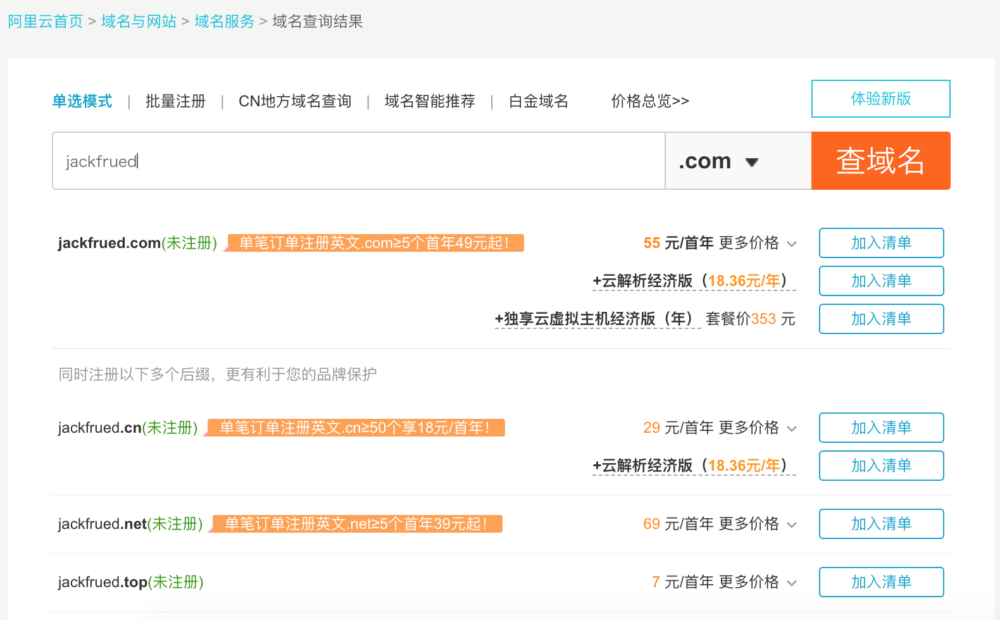
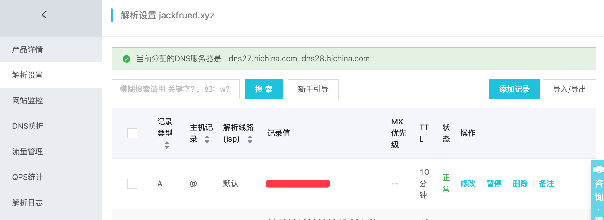

## Project Deployment and Performance Tuning Guide

### Preparing for Deployment

1. Pre-deployment checks.

   ```Shell
   python manage.py check --deploy
   ```

2. Set DEBUG to False and configure ALLOWED_HOSTS.

   ```Python
   DEBUG = False
   ALLOWED_HOSTS = ['*']
   ```

3. Security-related configuration.

   ```Python
   # Duration to maintain HTTPS connection
   SECURE_HSTS_SECONDS = 3600
   SECURE_HSTS_INCLUDE_SUBDOMAINS = True
   SECURE_HSTS_PRELOAD = True

   # Automatically redirect to secure connection
   SECURE_SSL_REDIRECT = True

   # Prevent browsers from guessing content types
   SECURE_CONTENT_TYPE_NOSNIFF = True

   # Prevent cross-site scripting attacks
   SECURE_BROWSER_XSS_FILTER = True

   # COOKIE can only be transmitted via HTTPS
   SESSION_COOKIE_SECURE = True
   CSRF_COOKIE_SECURE = True

   # Prevent clickjacking attacks - modify HTTP response headers
   # The current website does not allow loading via <iframe> tags
   X_FRAME_OPTIONS = 'DENY'
   ```

4. Store sensitive information in environment variables or files.

   ```Python
   SECRET_KEY = os.environ['SECRET_KEY']

   DB_USER = os.environ['DB_USER']
   DB_PASS = os.environ['DB_PASS']

   REDIS_AUTH = os.environ['REDIS_AUTH']
   ```

### Updating Server Python Environment to 3.x

> Note: If you need to clean up previous installations, simply delete the corresponding files and folders.

1. Install underlying dependency libraries.

   ```Shell
   yum -y install zlib-devel bzip2-devel openssl-devel ncurses-devel sqlite-devel readline-devel tk-devel gdbm-devel libdb4-devel libpcap-devel xz-devel libffi-devel libxml2
   ```

2. Download Python source code.

   ```Shell
   wget https://www.python.org/ftp/python/3.7.6/Python-3.7.6.tar.xz
   ```

3. Verify the downloaded file.

   ```Bash
   md5sum Python-3.7.6.tar.xz
   ```

4. Decompress and unarchive.

   ```Shell
   xz -d Python-3.7.6.tar.xz
   tar -xvf Python-3.7.6.tar
   ```

5. Execute pre-installation configuration (generate Makefile).

   ```Shell
   cd Python-3.7.6
   ./configure --prefix=/usr/local/python37 --enable-optimizations
   ```

6. Build and install.

   ```Shell
   make && make install
   ```

7. Configure PATH environment variable (user or system environment variable) and activate it.

   ```Shell
   vim ~/.bash_profile
   vim /etc/profile
   ```

   ```INI
   ... code above omitted ...

   export PATH=$PATH:/usr/local/python37/bin

   ... code below omitted ...
   ```

    ```Shell
   source ~/.bash_profile
   source /etc/profile
    ```

8. Register symbolic links - this step is not mandatory but is usually useful.

   ```Shell
   ln -s /usr/local/python37/bin/python3 /usr/bin/python3
   ```

9. Test whether the Python environment was updated successfully (installing Python 3 must not break the existing Python 2).

   ```Shell
   python3 --version
   python --version
   ```

### Project Directory Structure

Assuming the project folder is `project`, the five subdirectories below are: `code`, `conf`, `logs`, `stat`, and `venv`, which are used to store the project's code, configuration files, log files, static resources, and virtual environment, respectively. Within the `conf` directory, the `cert` subdirectory contains the certificate and key needed for HTTPS configuration; project code in the `code` directory can be checked out from a code repository using version control tools; the virtual environment can be created using tools such as venv, virtualenv, pyenv, etc.

```
project
├── code
│   └── fangtx
│       ├── api
│       ├── common
│       ├── fangtx
│       ├── forum
│       ├── rent
│       ├── user
│       ├── manage.py
│       ├── README.md
│       ├── static
│       └── templates
├── conf
│   ├── cert
│   │   ├── 214915882850706.key
│   │   └── 214915882850706.pem
│   ├── nginx.conf
│   └── uwsgi.ini
├── logs
│   ├── access.log
│   ├── error.log
│   └── uwsgi.log
├── stat
│   └── css
│   └── images
│   └── js
└── venv
    ├── bin
    │   ├── activate
    │   ├── activate.csh
    │   ├── activate.fish
    │   ├── celery
    │   ├── celerybeat
    │   ├── celeryd
    │   ├── celeryd-multi
    │   ├── coverage
    │   ├── coverage3
    │   ├── coverage-3.7
    │   ├── django-admin
    │   ├── django-admin.py
    │   ├── easy_install
    │   ├── easy_install-3.7
    │   ├── pip
    │   ├── pip3
    │   ├── pip3.7
    │   ├── __pycache__
    │   ├── pyrsa-decrypt
    │   ├── pyrsa-decrypt-bigfile
    │   ├── pyrsa-encrypt
    │   ├── pyrsa-encrypt-bigfile
    │   ├── pyrsa-keygen
    │   ├── pyrsa-priv2pub
    │   ├── pyrsa-sign
    │   ├── pyrsa-verify
    │   ├── python -> python3
    │   ├── python3 -> /usr/bin/python3
    │   └── uwsgi
    ├── include
    ├── lib
    │   └── python3.7
    ├── lib64 -> lib
    ├── pip-selfcheck.json
    └── pyvenv.cfg
```

Below, using Alibaba Cloud as an example, we briefly explain how to register a domain name, resolve a domain name, and purchase a certificate issued by an authoritative organization.

1. [Register a Domain Name](https://wanwang.aliyun.com/domain/).

   

2. [Domain ICP Filing](https://beian.aliyun.com/).

   

3. [Domain Name Resolution](https://dns.console.aliyun.com/#/dns/domainList).

   

   

4. [Purchase a Certificate](https://www.aliyun.com/product/cas).

   

You can use tools like sftp to upload the certificate to the `conf/cert` directory, and then use git to clone the project code to the `code` directory.

```Shell
cd code
git clone <url>
```

Return to the project directory, create and activate the virtual environment.

```Shell
python3 -m venv venv
source venv/bin/activate
```

Rebuild project dependencies.

```Shell
pip install -r code/teamproject/requirements.txt
```

### uWSGI Configuration

1. Install uWSGI.

   ```Shell
   pip install uwsgi
   ```

2. Modify the uWSGI configuration file (`/root/project/conf/uwsgi.ini`).

   ```INI
   [uwsgi]
   # Configure base path
   base=/root/project
   # Configure project name
   name=teamproject
   # Daemon process
   master=true
   # Number of processes
   processes=4
   # Virtual environment
   pythonhome=%(base)/venv
   # Project directory
   chdir=%(base)/code/%(name)
   # Specify Python interpreter
   pythonpath=%(pythonhome)/bin/python
   # Specify uwsgi file
   module=%(name).wsgi
   # Communication address and port (your server's IP address and port)
   socket=172.18.61.250:8000
   # Log file location
   logto=%(base)/logs/uwsgi.log
   ```

   > Note: You can first change the "communication address and port" from socket to http for testing. If there are no issues, change it back to socket, and then use Nginx to implement "static-dynamic separation" for the project (static resources handled by Nginx, dynamic content handled by uWSGI). You can start the uWSGI server using the method below.

5. Start the server.

   ```Shell
   nohup uwsgi --ini conf/uwsgi.ini &
   ```

### Nginx Configuration

1. Install Nginx.

    ```Shell
    yum -y install nginx
    ```

2. Modify the global configuration file (`/etc/nginx/nginx.conf`).

    ```Nginx
    # Configure user
    user nginx;
    # Number of worker processes (recommended to match the number of CPU cores)
    worker_processes auto;
    # Error log
    error_log /var/log/nginx/error.log;
    # Process file
    pid /run/nginx.pid;
    # Include other configurations
    include /usr/share/nginx/modules/*.conf;
    # Work mode (multiplexed I/O) and connection limit
    events {
        use epoll;
        worker_connections 1024;
    }
    # HTTP server related configuration
    http {
        # Log format
        log_format  main  '$remote_addr - $remote_user [$time_local] "$request" '
                          '$status $body_bytes_sent "$http_referer" '
                          '"$http_user_agent" "$http_x_forwarded_for"';
        # Access log
        access_log  /var/log/nginx/access.log  main;
        # Enable efficient file transfer mode
        sendfile            on;
        # Improves performance when using sendfile for file transfer
        tcp_nopush          on;
        # Disable Nagle to resolve interactivity issues
        tcp_nodelay         on;
        # Client keep-alive timeout
        keepalive_timeout   30;
        types_hash_max_size 2048;
        # Include MIME types configuration
        include             /etc/nginx/mime.types;
        # Default binary stream format
        default_type        application/octet-stream;
        # Include other configuration files
        include /etc/nginx/conf.d/*.conf;
        # Include project Nginx configuration files
        include /root/project/conf/*.conf;
    }
    ```

3. Edit the local configuration file (`/root/project/conf/nginx.conf`).

    ```Nginx
    server {
        listen      80;
        server_name _;
        access_log /root/project/logs/access.log;
        error_log /root/project/logs/error.log;
        location / {
            include uwsgi_params;
            uwsgi_pass 172.18.61.250:8000;
        }
        location /static/ {
            alias /root/project/stat/;
            expires 30d;
        }
    }
    server {
        listen      443;
        server_name _;
        ssl         on;
        access_log /root/project/logs/access.log;
        error_log /root/project/logs/error.log;
        ssl_certificate     /root/project/conf/cert/214915882850706.pem;
        ssl_certificate_key /root/project/conf/cert/214915882850706.key;
        ssl_session_timeout 5m;
        ssl_ciphers ECDHE-RSA-AES128-GCM-SHA256:ECDHE:ECDH:AES:HIGH:!NULL:!aNULL:!MD5:!ADH:!RC4;
        ssl_protocols TLSv1 TLSv1.1 TLSv1.2;
        ssl_prefer_server_ciphers on;
        location / {
            include uwsgi_params;
            uwsgi_pass 172.18.61.250:8000;
        }
        location /static/ {
            alias /root/project/static/;
            expires 30d;
        }
    }
    ```

    At this point, we can start Nginx to access our application. Both HTTP and HTTPS should work without issues. If Nginx is already running, after modifying the configuration file, we can use the following command to restart Nginx.

4. Restart the Nginx server.

    ```Shell
    nginx -s reload
    ```

    or

    ```Shell
    systemctl restart nginx
    ```

> Note: You can use `python manage.py collectstatic` command on the Django project to collect static resources to a specified directory. To achieve this, simply add the `STATIC_ROOT` configuration to the project's `settings.py` file.

#### Load Balancing Configuration

In the configuration below, we use Nginx to implement load balancing, providing reverse proxy services for three other Nginx servers (created via Docker).

```Shell
docker run -d -p 801:80 --name nginx1 nginx:latest
docker run -d -p 802:80 --name nginx2 nginx:latest
docker run -d -p 803:80 --name nginx3 nginx:latest
```

```Nginx
user root;
worker_processes auto;
error_log /var/log/nginx/error.log;
pid /run/nginx.pid;

include /usr/share/nginx/modules/*.conf;

events {
    worker_connections 1024;
}

# Configure load balancing for HTTP services
http {
	upstream xx {
		server 192.168.1.100 weight=2;
		server 192.168.1.101 weight=1;
		server 192.168.1.102 weight=1;
    }

	server {
		listen       80 default_server;
		listen       [::]:80 default_server;
		listen       443 ssl;
		listen       [::]:443 ssl;

        ssl on;
		access_log /root/project/logs/access.log;
		error_log /root/project/logs/error.log;
		ssl_certificate /root/project/conf/cert/214915882850706.pem;
		ssl_certificate_key /root/project/conf/cert/214915882850706.key;
		ssl_session_timeout 5m;
		ssl_ciphers ECDHE-RSA-AES128-GCM-SHA256:ECDHE:ECDH:AES:HIGH:!NULL:!aNULL:!MD5:!ADH:!RC4;
		ssl_protocols TLSv1 TLSv1.1 TLSv1.2;
		ssl_prefer_server_ciphers on;

		location / {
			proxy_set_header Host $host;
			proxy_set_header X-Forwarded-For $remote_addr;
			# proxy_set_header X-Real-IP $remote_addr;
			# proxy_set_header X-Forwarded-For $proxy_add_x_forwarded_for;
			proxy_buffering off;
			proxy_pass http://fangtx;
		}
	}
}
```

> Note: By default, Nginx uses WRR (Weighted Round Robin algorithm) for load balancing. It also supports ip_hash, fair (requires the upstream_fair module), and url_hash algorithms. Additionally, when configuring the upstream module, you can specify server status values, including: backup (backup machine, requests are only distributed to this machine when other servers are unavailable), down, fail_timeout (pause duration after reaching max_fails), max_fails (allowed number of failed requests), and weight (polling weight).

### Keepalived

When using Nginx for load balancing configuration, you need to consider the scenario where the load balancing server goes down. Keepalived can be used to implement hot-switching between the primary and backup load balancing hosts, ensuring high system availability. Keepalived configuration is relatively complex and is typically done by dedicated operations personnel. A basic configuration can refer to ["Keepalived Configuration and Usage"](https://www.jianshu.com/p/dd93bc6d45f5).

### MySQL Master-Slave Replication

Below we demonstrate how to configure MySQL master-slave replication using Docker. We prepare MySQL configuration files and directories for MySQL data and runtime logs in advance, then use Docker's data volume mapping to specify the container's configuration, data, and log file locations.

```Shell
root
└── mysql
    ├── master
    │   ├── conf
    |	└── data
    └── slave-1
    |	├── conf
    |	└── data
    └── slave-2
    |	├── conf
    |	└── data
    └── slave-3
    	├── conf
    	└── data
```

1. MySQL configuration file (master and slave configuration files need different server-id values).
   ```
   [mysqld]
   pid-file=/var/run/mysqld/mysqld.pid
   socket=/var/run/mysqld/mysqld.sock
   datadir=/var/lib/mysql
   log-error=/var/log/mysql/error.log
   server-id=1
   log-bin=/var/log/mysql/mysql-bin.log
   expire_logs_days=30
   max_binlog_size=256M
   symbolic-links=0
   # slow_query_log=ON
   # slow_query_log_file=/var/log/mysql/slow.log
   # long_query_time=1
   ```

2. Create and configure the master.

   ```Shell
   docker run -d -p 3306:3306 --name mysql-master \
   -v /root/mysql/master/conf:/etc/mysql/mysql.conf.d \
   -v /root/mysql/master/data:/var/lib/mysql \
   -e MYSQL_ROOT_PASSWORD=123456 mysql:5.7

   docker exec -it mysql-master /bin/bash
   ```

   ```Shell
   mysql -u root -p
   Enter password:
   Welcome to the MySQL monitor.  Commands end with ; or \g.
   Your MySQL connection id is 1
   Server version: 5.7.23-log MySQL Community Server (GPL)
   Copyright (c) 2000, 2018, Oracle and/or its affiliates. All rights reserved.
   Oracle is a registered trademark of Oracle Corporation and/or its
   affiliates. Other names may be trademarks of their respective
   owners.
   Type 'help;' or '\h' for help. Type '\c' to clear the current input statement.

   mysql> grant replication slave on *.* to 'slave'@'%' identified by 'iamslave';
   Query OK, 0 rows affected, 1 warning (0.00 sec)

   mysql> flush privileges;
   Query OK, 0 rows affected (0.00 sec)

   mysql> show master status;
   +------------------+----------+--------------+------------------+-------------------+
   | File             | Position | Binlog_Do_DB | Binlog_Ignore_DB | Executed_Gtid_Set |
   +------------------+----------+--------------+------------------+-------------------+
   | mysql-bin.000003 |      590 |              |                  |                   |
   +------------------+----------+--------------+------------------+-------------------+
   1 row in set (0.00 sec)

   mysql> quit
   Bye
   exit
   ```

   The `-v` parameter (`--volume`) used when creating the Docker container above maps data volumes. The path before the colon is the host directory, and the path after the colon is the directory inside the container. This is equivalent to mounting the host directory into the container.

3. Back up data from the master table (if needed).

   ```SQL
   mysql> flush table with read lock;
   ```

   ```Bash
   mysqldump -u root -p 123456 -A -B > /root/backup/mysql/mybak$(date +"%Y%m%d%H%M%S").sql
   ```

   ```SQL
   mysql> unlock table;
   ```

4. Create and configure the slaves.

   ```Shell
   docker run -d -p 3308:3306 --name mysql-slave-1 \
   -v /root/mysql/slave-1/conf:/etc/mysql/mysql.conf.d \
   -v /root/mysql/slave-1/data:/var/lib/mysql \
   -e MYSQL_ROOT_PASSWORD=123456 \
   --link mysql-master:mysql-master mysql:5.7

   docker run -d -p 3309:3306 --name mysql-slave-2 \
   -v /root/mysql/slave-2/conf:/etc/mysql/mysql.conf.d \
   -v /root/mysql/slave-2/data:/var/lib/mysql \
   -e MYSQL_ROOT_PASSWORD=123456 \
   --link mysql-master:mysql-master mysql:5.7

   docker run -d -p 3310:3306 --name mysql-slave-3 \
   -v /root/mysql/slave-3/conf:/etc/mysql/mysql.conf.d \
   -v /root/mysql/slave-3/data:/var/lib/mysql \
   -e MYSQL_ROOT_PASSWORD=123456 \
   --link mysql-master:mysql-master mysql:5.7

   docker exec -it mysql-slave-1 /bin/bash
   ```

   ```Shell
   mysql -u root -p
   Enter password:
   Welcome to the MySQL monitor.  Commands end with ; or \g.
   Your MySQL connection id is 2
   Server version: 5.7.23-log MySQL Community Server (GPL)
   Copyright (c) 2000, 2018, Oracle and/or its affiliates. All rights reserved.
   Oracle is a registered trademark of Oracle Corporation and/or its
   affiliates. Other names may be trademarks of their respective
   owners.
   Type 'help;' or '\h' for help. Type '\c' to clear the current input statement.

   mysql> reset slave;
   Query OK, 0 rows affected (0.02 sec)

   mysql> change master to master_host='mysql-master', master_user='slave', master_password='iamslave', master_log_file='mysql-bin.000003', master_log_pos=590;
   Query OK, 0 rows affected, 2 warnings (0.03 sec)

   mysql> start slave;
   Query OK, 0 rows affected (0.01 sec)

   mysql> show slave status\G
   *************************** 1. row ***************************
                  Slave_IO_State: Waiting for master to send event
                     Master_Host: mysql57
                     Master_User: slave
                     Master_Port: 3306
                   Connect_Retry: 60
                 Master_Log_File: mysql-bin.000001
             Read_Master_Log_Pos: 590
                  Relay_Log_File: f352f05eb9d0-relay-bin.000002
                   Relay_Log_Pos: 320
           Relay_Master_Log_File: mysql-bin.000001
                Slave_IO_Running: Yes
               Slave_SQL_Running: Yes
                Replicate_Do_DB:
             Replicate_Ignore_DB:
              Replicate_Do_Table:
          Replicate_Ignore_Table:
         Replicate_Wild_Do_Table:
     Replicate_Wild_Ignore_Table:
                      Last_Errno: 0
                      Last_Error:
                    Skip_Counter: 0
             Exec_Master_Log_Pos: 590
                 Relay_Log_Space: 534
                 Until_Condition: None
                  Until_Log_File:
                   Until_Log_Pos: 0
              Master_SSL_Allowed: No
              Master_SSL_CA_File:
              Master_SSL_CA_Path:
                 Master_SSL_Cert:
               Master_SSL_Cipher:
                  Master_SSL_Key:
           Seconds_Behind_Master: 0
   Master_SSL_Verify_Server_Cert: No
                   Last_IO_Errno: 0
                   Last_IO_Error:
                  Last_SQL_Errno: 0
                  Last_SQL_Error:
     Replicate_Ignore_Server_Ids:
                Master_Server_Id: 1
                     Master_UUID: 30c38043-ada1-11e8-8fa1-0242ac110002
                Master_Info_File: /var/lib/mysql/master.info
                       SQL_Delay: 0
             SQL_Remaining_Delay: NULL
         Slave_SQL_Running_State: Slave has read all relay log; waiting for more updates
              Master_Retry_Count: 86400
                     Master_Bind:
         Last_IO_Error_Timestamp:
        Last_SQL_Error_Timestamp:
                  Master_SSL_Crl:
              Master_SSL_Crlpath:
              Retrieved_Gtid_Set:
               Executed_Gtid_Set:
                   Auto_Position: 0
            Replicate_Rewrite_DB:
                    Channel_Name:
              Master_TLS_Version:
   1 row in set (0.00 sec)

   mysql> quit
   Bye
   exit
   ```

   You can then follow the same procedure to configure slave2 and slave3, building a "one master with three slaves" master-slave replication environment. The `--link` parameter used when creating containers above configures the container's hostname (network address alias) on the network.

After configuring master-slave replication, write operations should be performed on the master, while read operations should be performed on the slaves. To achieve this, configure DATABASE_ROUTERS in the Django project and implement read-write separation through a custom master-slave replication router class, as shown below:

```Python
DATABASE_ROUTERS = [
    # Other configurations omitted here
    'common.routers.MasterSlaveRouter',
]
```

```Python
class MasterSlaveRouter(object):
    """Master-slave replication router"""

    @staticmethod
    def db_for_read(model, **hints):
        """
        Attempts to read auth models go to auth_db.
        """
        return random.choice(('slave1', 'slave2', 'slave3'))

    @staticmethod
    def db_for_write(model, **hints):
        """
        Attempts to write auth models go to auth_db.
        """
        return 'default'

    @staticmethod
    def allow_relation(obj1, obj2, **hints):
        """
        Allow relations if a model in the auth app is involved.
        """
        return None

    @staticmethod
    def allow_migrate(db, app_label, model_name=None, **hints):
        """
        Make sure the auth app only appears in the 'auth_db'
        database.
        """
        return True
```

The content above references Django's official documentation on [DATABASE_ROUTERS configuration](https://docs.djangoproject.com/en/2.1/topics/db/multi-db/#topics-db-multi-db-routing), with appropriate adjustments to the code.

### Docker

In fact, the most troublesome aspect of project deployment is configuring the software runtime environment. Environmental differences can cause numerous issues with software installation and deployment, and Docker can solve exactly this problem. We have already introduced Docker in previous documentation. Next, we will provide some necessary supplementary Docker knowledge.

1. Creating image files.

   Save a container as an image:

   ```Shell
   docker commit -m "..." -a "jackfrued" <container-name> jackfrued/<image-name>
   ```

   Build an image using a Dockerfile:

   ```Dockerfile
   # Specify the base image file
   FROM centos:latest

   # Specify maintainer information
   MAINTAINER jackfrued

   # Execute commands
   RUN yum -y install gcc
   RUN cd ~
   RUN mkdir -p project/code
   RUN mkdir -p project/logs

   # Copy files
   COPY ...

   # Expose ports
   EXPOSE ...

   # Execute command on container startup
   CMD ~/init.sh
   ```

   ```Shell
   docker build -t jackfrued/<image-name> .
   ```

2. Importing and exporting images.

   ```Shell
   docker save -o <file-name>.tar <image-name>:<version>
   docker load -i <file-name>.tar
   ```

3. Pushing to DockerHub server.

   ```Shell
   docker tag <image-name>:<version> jackfrued/<name>
   docker login
   docker push jackfrued/<name>
   ```

4. Communication between containers.

   ```Shell
   docker run --link <container-name>:<alias-name>
   ```


If we can complete project deployment within Docker and package the entire deployed container as an image file for distribution and installation, this solves the troubles that may be encountered when deploying projects across multiple nodes, and the entire deployment can be completed in a very short time.

### Supervisor

[Supervisor](https://github.com/Supervisor/supervisor) is a process management tool written in Python that makes it convenient to start, restart (auto-restart programs), and stop processes on Unix-like systems. Supervisor currently does not support Python 3, but you can install and run Supervisor via Python 2, and then use Supervisor to manage Python 3 programs.

> **Tip**: There is another tool similar to Supervisor called Circus, which supports Python 3.

1. Install Supervisor.

   ```Shell
   virtualenv -p /usr/bin/python venv
   source venv/bin/activate
   pip install supervisor
   ```

2. View the Supervisor configuration file.

    ```Shell
    vim /etc/supervisord.conf
    ```

    ```INI
    ; Code above omitted here
    ; The [include] section can just contain the "files" setting.  This
    ; setting can list multiple files (separated by whitespace or
    ; newlines).  It can also contain wildcards.  The filenames are
    ; interpreted as relative to this file.  Included files *cannot*
    ; include files themselves.
    [include]
    files = supervisord.d/*.ini
    ```

    As you can see, custom management configuration code can be placed in the `/etc/supervisord.d` directory, with files using the `ini` extension.

3. Write your own configuration file `fangtx.ini` and place it in the `/etc/supervisord.d` directory.

   ```INI
   [program:project]
   command=uwsgi --ini /root/project/conf/uwsgi.ini
   stopsignal=QUIT
   autostart=true
   autorestart=true
   redirect_stderr=true

   [program:celery]
   ; Set full path to celery program if using virtualenv
   command=/root/project/venv/bin/celery -A fangtx worker
   user=root
   numprocs=1
   stdout_logfile=/var/log/supervisor/celery.log
   stderr_logfile=/var/log/supervisor/celery_error.log
   autostart=true
   autorestart=true
   startsecs=10

   ; Need to wait for currently executing tasks to finish at shutdown.
   ; Increase this if you have very long running tasks.
   ;stopwaitsecs = 600

   ; When resorting to send SIGKILL to the program to terminate it
   ; send SIGKILL to its whole process group instead,
   ; taking care of its children as well.
   killasgroup=true
   ; Set Celery priority higher than default (999)
   ; so, if rabbitmq is supervised, it will start first.
   priority=1000
   ```

4. Start Supervisor.

   ```Shell
   supervisorctl -c /etc/supervisord.conf
   ```


### Other Services

1. Common open-source software.

   | Function                     | Open-source Solutions                  |
   | ---------------------------- | -------------------------------------- |
   | Version Control Tools        | Git, Mercurial, SVN                    |
   | Defect Management            | Redmine, Mantis                        |
   | Load Balancing               | Nginx, LVS, HAProxy                   |
   | Email Services               | Postfix, Sendmail                      |
   | HTTP Services                | Nginx, Apache                          |
   | Message Queues               | RabbitMQ, ZeroMQ, Redis, Kafka         |
   | File Systems                 | FastDFS                                |
   | Location-Based Services (LBS)| MongoDB, Redis                         |
   | Monitoring Services          | Nagios, Zabbix                         |
   | Relational Databases         | MySQL, PostgreSQL                      |
   | Non-relational Databases     | MongoDB, Redis, Cassandra, TiDB        |
   | Search Engines               | ElasticSearch, Solr                    |
   | Caching Services             | Memcached, Redis                       |

2. Common cloud services.

   | Function                | Available Cloud Services                         |
   | ----------------------- | ------------------------------------------------ |
   | Team Collaboration Tools| Teambition, DingTalk                             |
   | Code Hosting Platforms  | Github, Gitee, CODING                            |
   | Email Services          | SendCloud                                        |
   | Cloud Storage (CDN)     | Qiniu, OSS, LeanCloud, Bmob, Upyun, S3          |
   | Mobile Push             | JPush, Umeng, Baidu                              |
   | Instant Messaging       | Easemob, Rongyun                                 |
   | SMS Services            | Yunpian, JPush, Luosimao, Upyun                  |
   | Third-party Login       | Umeng, ShareSDK                                  |
   | Website Monitoring & Analytics | Alibaba Cloud Monitoring, Jiankongbao, Baidu Cloud Observation, Xiaoniaoyun |
